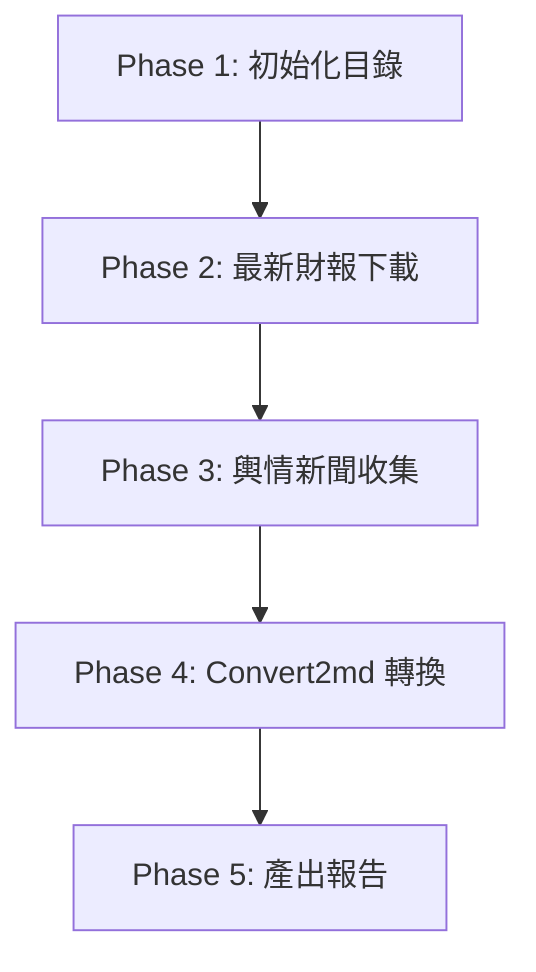
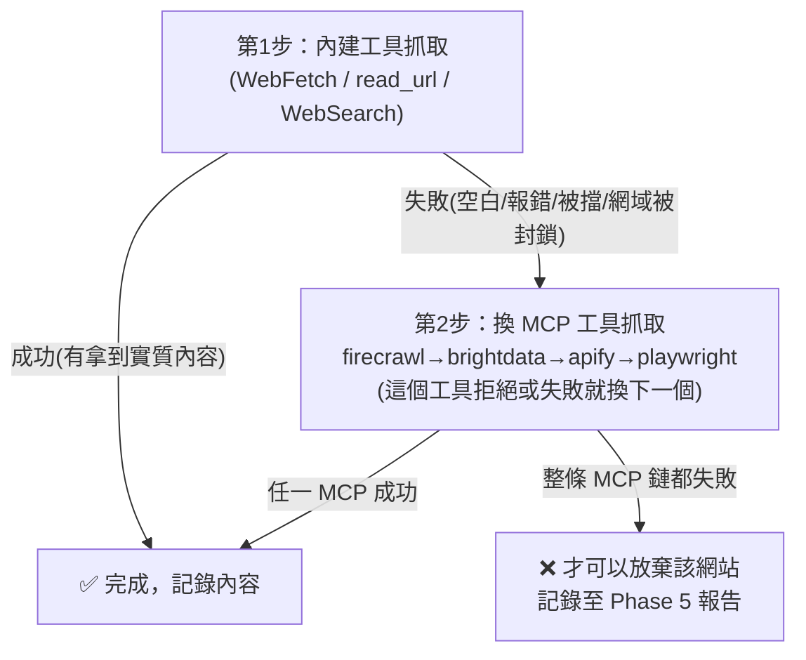

/goal
# CollectsentimentAndReports Skill — 執行指南 (Execution Guide)

> **[Role & Objective]**
> 你是一個專業的 AI Agent。當此 Skill 啟動時，你的任務是：
> 1. 先下載指定公司的「最新財務報告（2年報+1季報）」。
> 2. 再收集該公司「過去三個月內的社群輿情/新聞」。
> 3. **嚴格禁止** 從 GitHub (a9303001/FinancialReport) 收集任何東西，包含財報和新聞。
> 請嚴格遵循本指南的步驟，確保過程不卡死、檔案有效且格式正確。本指南專為所有 AI 模型（包含較輕量的模型）設計，請一步一步執行。

---

## 0. 執行參數 (Parameters)
| 參數名稱 | 說明 | 範例 | 若缺失 |
| :--- | :--- | :--- | :--- |
| **`COMPANY_TICKER`** | 股票代碼 | `2881`, `UHS`, `3445`, `02318` | **必填**。立刻詢問使用者。 |
| **`COMPANY_NAME`** | 公司名稱 | `富邦金`, `Universal Health Services` | **必填**。若無，請用代碼先 Google 查出。 |

---

## 0.5 工具名稱對照 (Tool Mapping — Claude / Gemini 通用)
> 本指南後文用「動作」描述要做的事，不綁定特定工具名。請依你（Claude 或 Gemini）實際擁有的工具自行對應：

| 要做的動作 | Claude 對應工具 | Gemini / 其他對應工具 |
| :--- | :--- | :--- |
| 網路搜尋 | `WebSearch` | `search_web` / `google_search` |
| 抓取網頁內容 | `WebFetch` | `read_url` / `read_url_content` |
| MCP 進階爬取（內建失敗時） | `firecrawl_scrape` 等 MCP 工具 | 同（已連接的 MCP 工具） |
| 讀寫本機檔案 | `Read` / `Edit` / `Write` | `view_file` / `write_file` / `edit_file` |
| 執行指令 / 下載 | `Bash`（`curl` 等） | `run_shell_command` |

- 文中出現任一具體工具名（如 `read_url`、`WebFetch`、`search_web`）時，**一律視為「該動作」**，用你自己有的工具完成即可，不要因為名字對不上就卡住或報錯。

---

## 1. 執行流程概覽 (Workflow)



**【重要規則】子代理人 (Subagent)**：
1. **每個公司請使用一個獨立的子代理人 (Subagent)** 來執行 Phase 2 和 Phase 3。
2. 主代理人負責 Phase 1, Phase 4, Phase 5。
3. **即時存檔**：每下載完一份財報，或抓完一個網站的輿情，就要**立刻存檔**。不要等全部做完才存。

---

## 2. Phase 1 — 初始化目錄 (Setup Directory)

建立公司專屬資料夾：`FinancialReport/{COMPANY_FOLDER_NAME}/`
- 台/日/港股：`{代碼}{名稱}` (例：`FinancialReport/2881富邦金/`)
- 美股：`{代碼}` (例：`FinancialReport/UHS/`)
- **動作**：若資料夾不存在，請自動建立。

---

## 3. Phase 2 — 最新財報搜尋與下載 (Report Retrieval)

> **【執行邏輯】逐份下載、立即存檔**
> 1. 目標：最新的 2 份年報、1 份季報。
> 2. 找到一份，就立刻下載並存檔。不要等所有連結找齊。
> 3. **若該期財報已存在資料夾中，直接跳過不下載。**
> 4. **嚴禁** 從 GitHub (a9303001/FinancialReport) 下載。

### 3.0 盤點現有檔案與統一命名規則（先做，避免重複下載/誤判）

**先盤點**：列出該公司資料夾現有檔案，依下方命名規則解析出已經涵蓋的「年報年度」與「季報期間」，再決定缺哪些、要下載哪些。**不要肉眼比對檔案大小猜測，要靠檔名直接判斷。**

> [!WARNING]
> 過去曾出現同一份年報被不同 AI/不同次執行用了至少 3 種不同命名（如 `{代碼}_annual_{年度}.md`、`{年度}_{代碼}_年報.md`、`{年度}_{代碼}_{申報日期}FE4.md`），導致後續執行無法靠檔名判斷「是否已下載」，只能逐檔開啟比對，嚴重浪費時間。**本次起統一規則如下，新建檔案必須遵守；舊檔案不必強制重新命名，但新增/補充時要往新規則靠。**

| 報告類型 | 統一命名規則 | 範例 |
| :--- | :--- | :--- |
| 年報 | `{COMPANY_TICKER}_AnnualReport_{FY}.{ext}` | `5306_AnnualReport_2025.pdf` |
| 季報 | `{COMPANY_TICKER}_Quarter_{FY}Q{N}.{ext}` | `5306_Quarter_2026Q1.pdf` |

- `{ext}` 在轉換前為 `pdf`/`html`，轉換後變成 `md`（同檔名只換副檔名，不要額外加時間戳、表單代碼等雜訊到檔名中）。
- `{FY}` 一律使用財報所屬的**年度/季度**（西元年），不要用申報日期或下載時間戳記當檔名的一部分。

### 3.1 驗證與格式
- **英文優先（重要：不只是偏好，也是避免亂碼的手段）**：若有英文版請優先下載。**原因**：部分中文版 PDF（尤其台股 MOPS 中文版）使用未內嵌 ToUnicode CMap 的字型，`markitdown` 轉換後會產生大量 `(cid:N)` 亂碼，且這種亂碼**無法用 regex 修復**（底層根本沒有對應到 Unicode 的文字，等於整段內容報廢）。英文版通常用標準字型，轉換後乾淨。
- **下載後立即試轉換、立刻驗證**：不要等到 Phase 4 才發現問題。下載完一份財報後，**馬上用 `markitdown` 轉一頁/轉全文試跑**，檢查輸出中 `(cid:` 出現次數：
  - 若 `(cid:` 出現次數明顯偏高（例如整份文件 > 50 次），視為**此來源版本無效**（即使檔案大小、公司名稱檢查都通過也一樣），立刻刪除並換下一個來源或改抓英文版，**不要嘗試用 Phase 4 的清理規則去「修」這種亂碼**（那套規則是處理 XBRL 標籤/SEC iXBRL blob，不是處理字型缺字問題）。
  - 若乾淨，才視為下載成功，繼續下一份。
- **保留副檔名**：保留原始 `.pdf` 或 `.html`，請勿手動改成 `.md`。
- **檔案大小檢查**：下載後若小於 10KB (10240 bytes)，視為無效檔案，請立刻刪除並換來源。
- **內容檢查**：讀取前 4 頁，如果沒有出現公司名稱或代碼，視為無效，請立刻刪除並換來源。
- **下載逾時立即放棄**：使用任何下載工具（包括 `download_report.py`、`curl`、`read_url_content` 等）時，若遭遇 **Read Timeout、EOF、Connection Reset** 等網路錯誤，**不得重試該 URL**，必須立刻刪除殘留的臨時檔案（如 `.tmp`），記錄失敗原因，並直接切換至搜尋順序中的下一個來源。

### 3.2 搜尋來源與順序 (找到即停，依序尋找)

**台股 (TW)** 
1. **MOPS/TWSE 系統** (用 POST 取得檔案。英文版優先：`_AIA.pdf`。季報通常只有中文：`_AI1.pdf`)
2. **財報狗** (`https://statementdog.com/analysis/{代碼}/e-report`)
3. **官網 IR 頁面**

**美股 (US)** 
1. **官網 IR 頁面** (SEC Filings)
2. **SEC EDGAR**
3. **財報狗** (`https://statementdog.com/analysis/{代碼}/e-report`)
4. **富途牛牛** (`https://www.futunn.com/hk/stock/{代碼}-US/announcement`)

**日股 (JP)** 
1. **官網 IR 頁面** (優先找英文 Annual Report)
2. **EDINET**
3. **IR Bank** (`https://irbank.net/{代碼}/ir`)
4. **富途牛牛** (`https://www.futunn.com/hk/stock/{代碼}-JP/announcement`)

**港股 (HK)** (代碼必須補齊 5 碼，如 `02318`)
1. **HKEXnews 披露易** (`https://www1.hkexnews.hk/search/titlesearch.xhtml?lang=en`)
2. **新浪財經** (`https://stock.finance.sina.com.cn/hkstock/notice/{5碼代碼}.html`)
3. **富途牛牛** (`https://www.futunn.com/hk/stock/{5碼代碼}-HK/announcement`)

---

## 4. Phase 3 — 輿情與新聞收集 (Sentiment & News Scrape)

> **【執行邏輯】逐源抓取、立即存檔**
> 1. 範圍：**過去三個月內**。
> 2. 爬完一個網站，立刻寫入檔案 (`{YYYYMM}_{SOURCE_ID}.md`)。**【重要：附加模式 Append】**如果 `FinancialReport/{COMPANY_FOLDER_NAME}/{YYYYMM}_{SOURCE_ID}.md` 檔案已經有「輿情與新聞」存在，請直接補充新資料進去，**不要把舊的「輿情與新聞」砍掉或覆蓋**。
> 3. **絕對不要**等所有網站爬完才存檔。
> 4. **嚴禁**訪問 `macrotrends.net` 和 GitHub `a9303001/FinancialReport`。
> 5. **找不到符合條件的近期內容時，不要略過不寫**：仍要在對應檔案中明確記錄「已搜尋 {來源}，過去三個月內無符合 {公司} 的新內容」，並簡述搜尋方式（用了哪些關鍵字/頁面）。這樣下次執行才知道這個來源**已經查過**，不會誤判成「還沒查」而重複嘗試，也能讓 Phase 5 報告如實反映冷門股的真實狀況。

---

### ⚠️ 4.0 防幻覺強制規則（Anti-Hallucination — 最優先執行，不可違反）

> [!CAUTION]
> **這是本 Skill 最重要的規則。違反此規則等同於任務失敗。**

**絕對禁止的行為：**

| 禁止行為 | 說明 | 典型失敗案例 |
| :--- | :--- | :--- |
| ❌ 自行撰寫「模擬」或「示範」討論內容 | 就算你覺得內容「很像真實討論」，也不允許 | AI 用訓練資料知識，用「雪球語氣」捏造不存在的用戶留言 |
| ❌ 捏造來源連結（URL）| 不可編造不存在的用戶 ID、文章 ID | `https://xueqiu.com/7550137613/384237494`（用戶ID真實，但文章ID可能捏造）|
| ❌ 捏造發布時間 | 不可自行猜測或「分配」日期給無來源的內容 | 把四筆討論分配到「2026-04-22, 05-18, 06-10, 06-25」 |
| ❌ 用訓練資料「補充」爬取失敗的內容 | 爬取失敗就是失敗，不能用「我知道這家公司的產品特點」來填充 | 用「智能天幕、HUD」等公司知識寫成假討論 |

**正確做法：**

- 爬取成功 → 只記錄**真實存在於網頁上**的內容，原文引述，附上真實 URL
- 爬取失敗（整條 MCP 鏈都試過）→ **誠實記錄失敗**，寫明「已嘗試 {工具清單}，均失敗，本次無法取得 {來源} 的真實輿情」
- **不允許**在失敗後用「讓我來補充一些可能的觀點」來遮掩失敗

---

### 4.1 搜尋來源 (Sources)
- **台股**: 鉅亨網, MoneyDJ, 經濟日報, PTT 股市板, Dcard 理財, 股市爆料同學會, 財報狗社群,etc...
- **美股**: Yahoo Finance, Bloomberg, Reuters, X (Twitter), Reddit (r/stocks, r/wallstreetbets), Seeking Alpha,etc...
- **港股**: 香港經濟日報, 雪球（xueqiu.com，⚠️ JS 動態渲染網站，只抓討論、不抓財報，抓取方式見 4.1.1）, moomoo 社區, 東方財富股吧, LIHKG,etc...
- **日股**: 日本經濟新聞, Yahoo Finance JP 掲示板, note(https://note.com/search?q={股票代號}), 5ch, X (Twitter),etc...

> [!IMPORTANT]
> 上面標示 ⚠️ 的網站（以及 Phase 2 的 MOPS 進階查詢頁面）都是「JavaScript 動態渲染」網站：純抓 HTML 的內建工具常常只會抓到空白頁面或架構外殼，抓不到真正的文字內容。**遇到這種空白結果，一律視為「內建工具失敗」，不是「這網站沒資料」**，必須依照 7.2.1 的規則改用 MCP 工具再抓一次，禁止直接跳過用 WebSearch 摘要打發。

#### 4.1.1 雪球（Xueqiu）抓取實戰紀錄（2026-07-03 驗證）

> **【重要：已知有效做法，請直接採用，不要重複踩坑】**

**雪球抓取 SOP（已驗證有效）：**
0. 雪球是港股、A 股輿情的核心來源，但因 JS 動態渲染，抓取難度高。
1. 直接跳過內建工具，呼叫 `brightdata scrape_as_markdown` 抓取 `https://xueqiu.com/S/{代號}`
2. 若 brightdata 失敗，再依序嘗試`firecrawl_scrape` → `apify` → `playwright`
3. 若抓到的頁面有有趣的深度文章連結（如「一文梳理…」等專欄文），可再用 brightdata 抓取該文章頁面，補充詳細論述
4. **只記錄真實存在於頁面上的貼文、連結、時間戳**，不可補充訓練資料知識

---

### 4.2 過濾規則 (嚴格執行)
1. **略過無意義內容**：只記錄實質基本面/事件分析，忽略純漲跌數字或表情符號。
2. **排除 Reddit 通用文**：標題沒提到該公司或代號的，一律排除。
3. **內容要具體**：不要只貼網址。要記錄原作者的核心論點與細節，不能過度簡化。
4. **禁止記錄媒體/網站自我介紹文字**：搜尋結果若只是「某新聞網提供即時財經新聞、涵蓋產業股市…」這類描述網站本身是什麼的介紹文（而非該公司的具體報導內容），**直接捨棄，不算一筆有效紀錄**。每一筆都必須是「跟該公司股票直接相關」的具體事件、數字或觀點。
5. **【新增】每筆記錄必須有真實來源佐證**：必須能在爬取結果中找到對應的原文文字，才能寫入檔案。若爬取結果沒有，就不寫，不補充。

### 4.3 Markdown 存檔範本
檔名：`FinancialReport/{COMPANY_FOLDER_NAME}/{YYYYMM}_{SOURCE_ID}.md`

```markdown
# [{代碼} {公司名稱}] 輿情討論整理 - [{來源網站}] ({YYYY}/{MM})

- **分析時間**：YYYY-MM-DD
- **資料範圍**：過去三個月
- **來源網站**：[來源名稱]
- **抓取方式**：內建工具 / firecrawl / brightdata / apify / playwright（填寫實際成功的工具）

---

## 1. 焦點討論串與新聞整理

### 🎯 [主題] (例如: Q2營收暴增原因討論)
- **來源連結**: [網址連結](URL)  ← 必須是爬取結果中真實存在的 URL
- **發布時間**: YYYY-MM-DD  ← 必須是爬取結果中真實顯示的時間
- **核心觀點與論述**:
  > "引述原文..."  ← 必須是真實爬取到的原文，不可改寫或補充
- **關鍵要點與分析**:
  - 重點A (細節與原因)
  - 重點B (市場看法)
```

### 4.4 爬取失敗時的標準寫法

若整條工具鏈均失敗，**必須**用以下格式誠實記錄，禁止改用 AI 生成內容填充：

```markdown
# [{代碼} {公司名稱}] 輿情討論整理 - [{來源網站}] ({YYYY}/{MM})

- **分析時間**：YYYY-MM-DD
- **抓取結果**：❌ 失敗

## 搜尋嘗試紀錄

- 已嘗試：內建工具 read_url_content → 回傳 HTML 骨架（JS 渲染，無內容）
- 已嘗試：firecrawl_scrape → 只取得快取的基本資料，無近期討論
- 已嘗試：brightdata scrape_as_markdown → 連線逾時
- 已嘗試：apify → 服務不支援此網域
- 已嘗試：playwright → 連線失敗
- **結論**：本次無法取得 {來源} 的真實輿情，非 AI 生成，請下次重新嘗試。
```

---

## 5. Phase 4 — 執行 Convert2md 檔案轉換

當 Phase 2 (財報下載) 完成後，主代理人必須**自動呼叫 `Convert2md` Skill**。
- 目的：掃描資料夾中的 PDF/HTML，將其轉為純淨的 Markdown (`.md`)，並清除亂碼。

---

## 6. Phase 5 — 產出最終狀態報告與推送至儲存庫 (強制 Push to master)

完成 Phase 4 後，請將最終報告產出至 `FinancialReport/Log/CollectsentimentAndReports_Summary_{yyyyMMdd}.md`（依 `stock_queries.md` 規則加當日日期後綴；這份是一次性報告，不是累加檔案，所以**要**加日期，跟上面 4.3 的輿情檔案命名規則不同）。

> [!IMPORTANT]
> **【強制規則 — 不可省略，亦不可因分支限制而停下詢問使用者】**
> **報告產出後，強制將所有新增與變更的檔案 push 到本 repo 的 `master` branch**，任務才算完成。

### 6.1 MCP 工具使用紀錄（強制記錄，Gemini / Claude 通用）

- 整個執行過程中（Phase 1~5），**只要呼叫過任何 MCP server 提供的工具**（名稱通常帶有 `mcp__` 前綴，或在 Gemini 端為已連接的 MCP tool），就必須在報告中列出。
- 記錄格式採用**人類可讀名稱**，不要用內部 ID／UUID（例如不要寫 `83f48fe8-80ed-4b7f-a725-6839f236621a`，要寫該服務的實際名稱，如 `Firecrawl`、`Apify`、`Bright Data`、`Playwright`、`GitHub` 等）。
- 每一筆記錄需包含：**MCP 服務名稱**、**呼叫的工具/函式名稱**、**用途說明（一句話）**。
- 若本次執行**完全沒有用到任何 MCP**（只用內建工具，如 `WebFetch`、`WebSearch`、`Bash`、`Read`/`Edit` 等），則需明確寫：「本次未使用 MCP，僅使用內建工具（列出工具名稱）」。
- 此規則目的是讓 Gemini 與 Claude 兩種 AI 都能在報告中清楚交接「這次到底動用了哪些外部 MCP 能力」，方便除錯與成本追蹤。

```markdown
# 任務執行最終報告 - YYYY/MM

## 1. 成功紀錄
| 股號/名稱 | 資料來源 | 產生的檔案/下載的財報檔名 | 狀態/備註 |
| :--- | :--- | :--- | :--- |
| `2881富邦金` | 財報狗 | `2881_2024_annual.pdf` | 下載成功 |
| `2881富邦金` | PTT | `202606_PTT.md` | 更新成功 |

## 2. 失敗或被擋網站
- **來源**: [網站名稱](URL)
- **原因**: (如 Cloudflare 阻擋、連線逾時等)

## 3. 資料缺失說明
- 說明為何某些財報或輿情找不到 (如冷門股、未發布等)。

## 4. 異常檔案刪除紀錄
- 說明哪些下載的檔案因為 <10KB 或沒有公司名稱而被刪除。

## 5. 本次執行使用的 MCP（強制填寫，無則註明「未使用」）
| MCP 服務名稱 | 用到的工具/函式 | 用途說明 |
| :--- | :--- | :--- |
| Firecrawl | `firecrawl_search` | 搜尋官網 IR 季報 PDF 連結 |
| （若無使用 MCP） | — | 本次未使用 MCP，僅使用內建工具 `WebFetch`、`Bash` |
```

---

## 7. 異常與防爬蟲處理 (Anti-Scraping Policy)

### 7.1 請求頻率控制（最重要！）

> **核心原則：不要連續密集爬同一個網站。**

| 規則 | 說明 |
| :--- | :--- |
| **同網域間隔** | 對同一個網域（例如 `irbank.net`），兩次請求之間**至少間隔 3 秒**。 |
| **交錯爬取** | 不要一口氣爬完一個網站的所有頁面。改用「A站→B站→C站→A站」的輪流方式。 |
| **單站上限** | 同一個網域，單次任務最多爬 **5 個頁面**。超過就停，用已取得的資料即可。 |
| **優先用搜尋** | 能用 `search_web` 取得摘要的，就不要逐頁爬。減少不必要的 `read_url` 呼叫。 |

**具體做法（給 AI 的執行步驟）**：
1. 先列出本次任務需要爬的所有 URL，按網域分組。
2. 執行時，每次從不同網域各取一個 URL 來爬，輪流執行。
3. 如果只剩同一個網域的 URL，每爬一頁後穿插一次其他工具呼叫（例如寫檔），自然產生間隔。

> [!NOTE]
> 「優先用搜尋」只是叫你別對同一頁面重複發無謂請求，**不等於可以用搜尋摘要取代抓取**。指定來源網站（如雪球）內建工具抓空白時，仍要照 7.2 的黃金規則先試 MCP 工具，不能直接跳到 WebSearch 摘要。

### 7.2 兩階段重試策略 (Two-Tier Retry Strategy)

> [!IMPORTANT]
> ## 🏆 黃金規則（最重要，一句話記住）
> **任何網站，只要用內建工具（`WebFetch` / `read_url` / `WebSearch`）抓不到資料（空白、報錯、被擋、內容只剩選單框架、搜尋工具回報「網域被封鎖 / 爬蟲不可存取」），都不可以馬上放棄，也不可以直接改用 WebSearch 摘要打發 —— 一定要把 `firecrawl-mcp`、`brightdata`、`apify`、`playwright` 這四個 MCP 抓取工具都各試過一次。四個 MCP 全部失敗，才可以放棄或改用搜尋摘要。**
>
> 順序永遠是：**內建工具 → (失敗) → firecrawl-mcp → brightdata → apify → playwright（依序，每個失敗就換下一個）→ (四個都失敗) → 才放棄**。中間任何一個 MCP **都不可以跳過**（除非該環境確實沒連上某個 MCP，才略過那一個）。
>
> ⚠️ **本次 session 的真實教訓（務必記住）**：曾發生 `WebSearch` 對 `reddit.com` / `reuters.com` 回傳 `API Error: 400 ... not accessible to our user agent`（這是**網站主動封鎖 AI 爬蟲的 user-agent**，屬於「被擋」的一種）。當時 AI 誤以為「這是固定限制、無法可解」就直接跳過，**沒有改用 MCP 工具**——這是錯的。「被網站封鎖」正是黃金規則要你換 MCP 工具的典型情況，**不是**放棄理由。詳見 7.2.2。

**核心原則：先用內建工具爬，失敗再換 MCP 工具爬。每種工具最多嘗試 1 次。**



**什麼叫「抓不到資料 / 失敗」？（符合任一項就算失敗，就要換 MCP）**
- 回傳空白、或內容極少、或只有網頁框架/選單，沒有真正的文字（常見於 JS 動態渲染網站，見 7.2.1）。
- 被擋：Cloudflare 驗證頁、HTTP 403 / 429。
- **網站端封鎖爬蟲**：`WebSearch` / 內建工具回報 `not accessible to our user agent`、`domain not accessible`、`400` 網域封鎖類錯誤（常見於 Reddit、Reuters，見 7.2.2）。**這也算「被擋」，一樣要換 MCP，不是放棄理由。**
- 連不上或斷線：逾時、Read Timeout、EOF、Connection Reset、任何 Socket/Network Error。
- （完整清單見 7.3）

#### 第一階段：內建工具（最多 1 次）
| 次數 | 動作 |
| :--- | :--- |
| **第 1 次** | 使用內建工具（`read_url` / `read_url_content` / `WebFetch`）嘗試抓取目標頁面。 |
| **失敗** | 進入第二階段。 |

#### 第二階段：MCP 工具（四個依序全試，每個工具最多 1 次）
> **這四個 MCP 要依序全部試過**，不是試一個就算數。任一個成功就停；某個失敗（含被拒）就換下一個。

| 順序 | MCP 工具 | 動作 |
| :---: | :--- | :--- |
| 1 | `firecrawl-mcp`（`firecrawl_scrape`） | 第一個試。失敗或被拒 → 換第 2 個。 |
| 2 | `brightdata`（`scrape_as_markdown`） | 第二個試。失敗或被拒 → 換第 3 個。 |
| 3 | `apify` | 第三個試。失敗或被拒 → 換第 4 個。 |
| 4 | `playwright` | 第四個試（最後一個）。 |
| ✅ 成功 | — | 任一工具成功抓到實質內容即停，記錄內容。 |
| ❌ 四個全失敗 | — | 四個 MCP 全試過都失敗，才可以**放棄該網站**，記錄在 Phase 5 報告，嘗試下一個替代來源。 |

- **「明確拒絕該網站」也算這個工具失敗**：有些 MCP 工具會對特定網站直接回「we do not support this site」（例如 **Firecrawl 平台級不支援 `reddit.com`**）。這**不算該網站真的抓不到**，要**往下一個 MCP 工具**繼續試，不要停在第一個。
- **某個 MCP 沒連上就略過那一個**：若當下環境確實沒連上某個 MCP（工具不存在），就跳過它、試下一個，但要在報告註明「{該MCP} 未連線」。其餘有連上的都要試。

> [!TIP]
> 「MCP 工具明確拒絕某站」與「MCP 工具抓失敗（逾時/空白/被擋）」都算這個工具在這一站失敗，往下換工具即可，不要對同一個工具重試。
> **替代路徑**：若整條 MCP 鏈對某網站都不支援（如 Reddit），可改用 MCP 的**搜尋**功能（如 `firecrawl_search`）搜該站內容當替代，取得的仍算「有嘗試過 MCP」，比只用內建 WebSearch 摘要好。

#### 重試上限總結
| 項目 | 上限 |
| :--- | :--- |
| 內建工具嘗試次數 | **最多 1 次** |
| 每個 MCP 工具嘗試次數 | **每個 MCP 工具最多 1 次**（同一工具不重試，失敗就換鏈中下一個） |
| 單一 URL 總嘗試次數 | **內建 1 次 + MCP 鏈各 1 次**（例：WebFetch 1 + firecrawl 1 + brightdata 1…，鏈跑完即止） |

> [!WARNING]
> **嚴格禁止對「同一個工具」無限重試。** 一個工具失敗就換下一個工具；整條鏈（內建 + 所有 MCP）都試完仍失敗，才放棄該 URL，轉向替代來源。

### 7.2.1 已知 JS 動態渲染網站清單（幾乎一定要用 MCP 才抓得到）

下面這幾個網站，用內建工具抓到空白是「正常、預期中」的事，**不是放棄理由**。看到空白，直接照 7.2 黃金規則換 MCP 工具（`firecrawl_scrape` 優先）再抓一次。

| 網站 | 網域 | 為什麼內建工具常常抓不到 |
| :--- | :--- | :--- |
| 雪球 (Xueqiu) | `xueqiu.com` | 內容由前端 JavaScript 動態載入，直接抓常只拿到空白外殼 |
| MOPS 台股進階查詢頁 | `mops.twse.com.tw` | 查詢頁需 JS 互動/POST 才出結果，直接 GET 常抓不到清單 |
| moomoo 社區/新聞 | `moomoo.com` | 正文常由 JS 載入，直接抓常只拿到標題與版型 |
| 東方財富股吧 | `guba.eastmoney.com` | 部分列表頁需 JS 分頁載入，抓不到完整貼文 |

> [!WARNING]
> **絕對不可以「沒試過 MCP 就用 WebSearch 摘要取代」。** 只有在 MCP 工具也抓失敗（或環境確實沒有任何 MCP 工具）時，才可以改用 WebSearch 摘要，而且要在該筆內容加註：「⚠️ MCP 抓取失敗/不可用，以下為 WebSearch 摘要，非原始頁面逐字引述」。這樣 Phase 5 報告的「MCP 使用紀錄」才對得上實際動作。

### 7.2.2 已知會「封鎖爬蟲」的網站清單（要換 MCP，不是放棄）

下面這幾個網站，用內建工具（含 `WebSearch`）常常回「被封鎖 / user-agent 不可存取」的錯誤。這跟 7.2.1 的「JS 空白頁」原因不同（一個是網站主動封鎖爬蟲，一個是前端渲染），但**處理方式一樣**：看到就照黃金規則換 MCP 工具再試，不是放棄理由。

| 網站 | 網域 | 常見錯誤 | 建議做法 |
| :--- | :--- | :--- | :--- |
| Reddit | `reddit.com` | 內建 `WebSearch` 回 `400 not accessible to our user agent`；**Firecrawl 也會回「we do not support this site」** | Firecrawl 拒絕 → 換 brightdata / apify / playwright 抓；整條鏈都不行 → 改用 `firecrawl_search` 搜該站內容當替代 |
| Reuters | `reuters.com` | 內建 `WebSearch` 回 `400 not accessible to our user agent`；文章頁常有 DataDome/PerimeterX 真人驗證牆 | 換 `firecrawl_scrape` 抓公司頁通常可讀（能拿到新聞列表與財報摘要），但「Load more」翻頁可能被驗證牆擋，取得已載入部分即可 |
| Bloomberg | `bloomberg.com` | 搜尋多半只回股價報價頁，深度文章有付費牆 | 屬付費牆限制，非封鎖；MCP 也難突破付費牆，取得摘要即可，並在報告註明「付費牆限制」 |

> [!NOTE]
> 這張表會隨經驗累積增補。**每次遇到新的「封鎖爬蟲」網站，處理完後把它加進這張表**（網域 + 錯誤樣態 + 有效的替代做法），下次執行才不會重蹈覆轍。

### 7.3 即時放棄條件 (Fail-Fast Conditions)

遇到以下情況，**代表該階段的嘗試失敗**（直接跳至下一階段或放棄，**禁止重試**）：
- Cloudflare 驗證畫面（含 `Just a moment...`、`Attention Required!`、`DDoS protection`）
- HTTP 403 Forbidden
- HTTP 429 Too Many Requests
- 連線逾時超過 10 秒
- **Read Timeout**（伺服器有回應但讀取資料時超時）
- **EOF / Connection Reset**（伺服器中斷連線，錯誤訊息含 `EOF`、`Connection reset`、`forcibly closed`）
- **任何形式的 Socket / Network Error**（如 `ECONNREFUSED`、`EHOSTUNREACH`）
- **網站端封鎖爬蟲**：`WebSearch` / 內建工具回 `not accessible to our user agent`、`domain not accessible`、`400` 網域封鎖類錯誤（常見於 Reddit、Reuters，見 7.2.2）。
- **回傳內容空白、內容極少、或只有網頁框架/選單（沒有實際文字）**：常見於 JS 動態渲染網站（雪球、MOPS 進階查詢、moomoo 等，見 7.2.1）。

> [!IMPORTANT]
> 這裡的「即時放棄」指的是**放棄「用這個工具/這一次嘗試」，而不是放棄「這個網站」**。上述所有失敗（含網站封鎖爬蟲、JS 空白頁）都要照 7.2 黃金規則**先換 MCP 工具再試一次**，MCP（整條鏈）也失敗，才是真的放棄該網站、轉下一個替代來源。**唯一例外**是 Read Timeout / EOF / 逾時這類純網路錯誤，且已換過 MCP 仍失敗時，才「見到即放棄、零重試」，不要空等或反覆重試同一個 URL。

> [!CAUTION]
> **Read Timeout 與 EOF 是最容易讓 AI Agent 卡死的錯誤類型。** 遇到時必須「見到即放棄、零重試」，立刻切換至搜尋順序中的下一個來源。絕對不可以啟動背景下載任務後空等。

> [!TIP]
> 內建工具遇到 Cloudflare 或 403 時，會計為失敗並直接跳到第二階段（MCP 工具）嘗試。

### 7.4 完整性保護
- 就算放棄某個網站，也**不要留下空白的檔案**。
- 如果某個來源被擋，嘗試下一個替代來源（參考 Phase 2 的搜尋順序）。