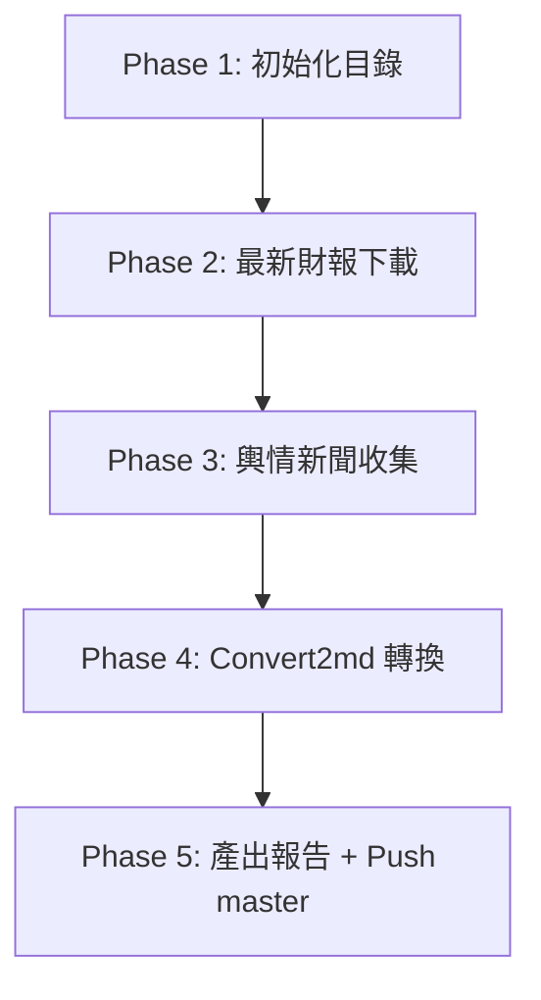
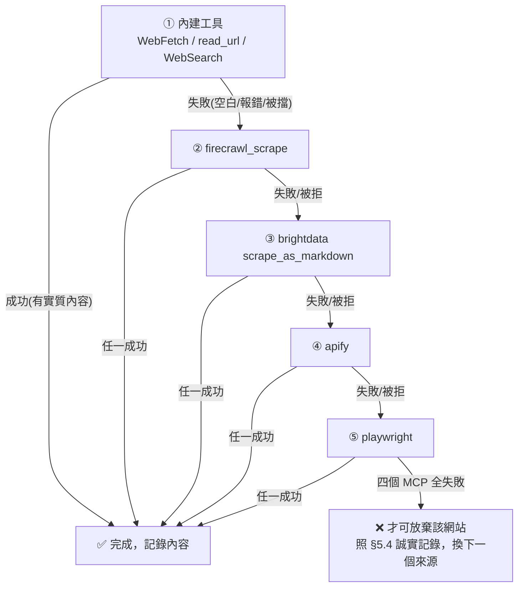

/goal
# CollectsentimentAndReports Skill — 執行指南 (Execution Guide)

> **[Role & Objective]**
> 你是一個專業的 AI Agent。當此 Skill 啟動時，你的任務是：
> 1. 先下載指定公司的「最新財務報告（2 年報 + 1 季報）」。
> 2. 再收集該公司「過去三個月內的社群輿情/新聞」。
> 3. **嚴格禁止** 從 GitHub (a9303001/FinancialReport) 收集任何東西，包含財報和新聞。
>
> 請嚴格遵循本指南的步驟，確保過程不卡死、檔案有效且格式正確。本指南專為所有 AI 模型（包含較輕量的 Gemini Flash、Claude Sonnet）設計，請一步一步執行。

> [!IMPORTANT]
> **全篇只有一套抓取規則：§2「通用抓取規則」。** 任何時候（Phase 2 下載財報、Phase 3 抓輿情）遇到抓不到、空白頁、被擋、JS 動態渲染，都回到 §2 照做，不要在別處另立規則。

---

## 0. 執行參數 (Parameters)
| 參數名稱 | 說明 | 範例 | 若缺失 |
| :--- | :--- | :--- | :--- |
| **`COMPANY_TICKER`** | 股票代碼 | `2881`, `UHS`, `3445`, `02318` | **必填**。立刻詢問使用者。 |
| **`COMPANY_NAME`** | 公司名稱 | `富邦金`, `Universal Health Services` | **必填**。若無，請用代碼先 Google 查出。 |

---

## 0.5 工具名稱對照 (Tool Mapping — Claude / Gemini 通用)
> 本指南後文用「動作」描述要做的事，不綁定特定工具名。請依你（Claude 或 Gemini）實際擁有的工具自行對應：

| 要做的動作 | Claude 對應工具 | Gemini / 其他對應工具 |
| :--- | :--- | :--- |
| 網路搜尋 | `WebSearch` | `search_web` / `google_search` |
| 抓取網頁內容 | `WebFetch` | `read_url` / `read_url_content` |
| MCP 進階爬取（內建失敗時） | `firecrawl_scrape` 等 MCP 工具 | 同（已連接的 MCP 工具） |
| 呼叫 Apify Actor（結構化資料，如 Reddit，見 §2.9） | `mcp__Apify__call-actor` + `mcp__Apify__get-dataset-items` | 同（已連接的 Apify MCP 工具） |
| 讀寫本機檔案 | `Read` / `Edit` / `Write` | `view_file` / `write_file` / `edit_file` |
| 執行指令 / 下載 | `Bash`（`curl` 等） | `run_shell_command` |

- 文中出現任一具體工具名（如 `read_url`、`WebFetch`、`search_web`）時，**一律視為「該動作」**，用你自己有的工具完成即可，不要因為名字對不上就卡住或報錯。
- 「內建工具」= `WebFetch` / `read_url` / `WebSearch` 這類 AI 原生的抓取/搜尋工具。「MCP 工具」= `firecrawl` / `brightdata` / `apify` / `playwright` 這類外接爬取服務。

---

## 1. 執行流程概覽 (Workflow)



**【重要規則】子代理人 (Subagent)**：
1. **每個公司請使用一個獨立的子代理人 (Subagent)** 來執行 Phase 2 和 Phase 3。
2. 主代理人負責 Phase 1, Phase 4, Phase 5。
3. **即時存檔**：每下載完一份財報，或抓完一個網站的輿情，就要**立刻存檔**。不要等全部做完才存。

---

## 2. 通用抓取規則（Universal Fetch Rule）★ 全流程唯一標準

> [!IMPORTANT]
> **這一整節是本 Skill 唯一的抓取準則，Phase 2 與 Phase 3 都套用它。** 不管抓的是財報 PDF 還是雪球貼文，只要「抓不到 / 空白 / 被擋」，就照這裡的 §2.1 黃金規則做。**別處不再重複寫抓取邏輯，一律回到本節。**

### 2.1 🏆 黃金規則（一句話記住）

> **任何網站、任何內容，只要用「內建工具」抓不到（空白、報錯、被擋、只剩選單框架、搜尋回報「網域被封鎖 / user-agent 不可存取」），都不可以馬上放棄，也不可以直接改用 WebSearch 摘要打發 —— 一定要把 `firecrawl` → `brightdata` → `apify` → `playwright` 這四個 MCP 抓取工具「依序」各試過一次。四個 MCP 全部失敗，才可以放棄或改用搜尋摘要。**

**固定順序（每個工具最多試 2 次，失敗就換下一個，不重試同一工具）：**



| 規則 | 內容 |
| :--- | :--- |
| **順序不可跳** | 內建 → firecrawl → brightdata → apify → playwright。中間任一個 MCP 都不可略過（除非該環境確實沒連上某 MCP，才跳過它並在 Phase 5 報告註明「{該 MCP} 未連線」）。 |
| **每工具 2 次** | 同一個工具失敗（含被拒、逾時、空白）**只重試1次**，直接換鏈中下一個。 |
| **單一 URL 上限** | 內建 1 次 + 每個 MCP 各 2 次，整條鏈跑完即止。 |
| **「明確拒絕」也算失敗** | 有些 MCP 會對特定站直接回「we do not support this site」（如 **Firecrawl 平台級不支援 `reddit.com`**）。這**不代表該站抓不到**，要往下一個 MCP 繼續試。 |
| **整條鏈都不支援時的替代路徑** | 若所有 MCP 對某站都不支援（如 Reddit），可改用 MCP 的**搜尋**功能（如 `firecrawl_search`）搜該站內容當替代 —— 這仍算「有嘗試過 MCP」，比只用內建 WebSearch 摘要好。 |

> [!CAUTION]
> **嚴禁對「同一個工具」無限重試。** 一個工具失敗就換下一個工具。也**嚴禁**在沒跑完 MCP 鏈的情況下就用 WebSearch 摘要頂替。若最後真的只能用 WebSearch 摘要，必須在該筆內容加註：「⚠️ MCP 抓取失敗/不可用，以下為 WebSearch 摘要，非原始頁面逐字引述」，這樣 Phase 5 的「MCP 使用紀錄」才對得上實際動作。

### 2.2 什麼叫「抓取失敗 / 抓不到」？（符合任一項就算失敗 → 換 MCP）

- **空白 / JS 動態渲染**：回傳空白、內容極少、只有網頁框架/選單，沒有真正的文字（常見於 §2.3 清單的網站）。
- **網站主動封鎖爬蟲**：內建工具/`WebSearch` 回 `not accessible to our user agent`、`domain not accessible`、`400` 網域封鎖類錯誤（常見於 §2.4 清單的網站）。
- **被防護頁擋**：Cloudflare 驗證頁（`Just a moment...`、`Attention Required!`、`DDoS protection`）、HTTP 403 / 429。

> 上面三種都要照 §2.1 黃金規則**先換 MCP 再試**，不是放棄理由。
> **唯一例外 → 見 §2.5 純網路錯誤**（Read Timeout / EOF / Connection Reset），那類是「零重試、直接換來源」。

### 2.3 已知 JS 動態渲染網站清單（內建工具幾乎必抓空白 → 直接上 MCP）

看到這些網站被內建工具抓成空白是「正常、預期中」的事，**不是放棄理由**。看到空白直接照 §2.1 換 MCP（`firecrawl_scrape` 優先）。

| 網站 | 網域 | 為什麼內建工具常抓不到 |
| :--- | :--- | :--- |
| 雪球 (Xueqiu) | `xueqiu.com` | 內容由前端 JS 動態載入，直接抓常只拿到空白外殼（實戰 SOP 見 §2.7） |
| 股市爆料同學會 (CMoney) | `cmoney.tw` | 頁面是 SSR 殼，`__NUXT__` 內 `articles` 為空陣列，貼文全由前端打 API 載入 → **不要爬頁面，直接打官方 API，SOP 見 §2.8** |
| MOPS 台股進階查詢頁 | `mops.twse.com.tw` | 查詢頁需 JS 互動/POST 才出結果，直接 GET 常抓不到清單 |
| moomoo 社區/新聞 | `moomoo.com` | 正文常由 JS 載入，直接抓常只拿到標題與版型 |
| 東方財富股吧 | `guba.eastmoney.com` | 部分列表頁需 JS 分頁載入，抓不到完整貼文 |

### 2.4 已知會「封鎖爬蟲」的網站清單（要換 MCP，不是放棄）

這些網站對內建工具（含 `WebSearch`）常回「被封鎖 / user-agent 不可存取」。成因跟 §2.3 的 JS 空白頁不同（一個是網站主動封鎖、一個是前端渲染），但**處理方式一樣**：照 §2.1 換 MCP 再試。

| 網站 | 網域 | 常見錯誤 | 建議做法 |
| :--- | :--- | :--- | :--- |
| Reddit | `reddit.com` | 內建 `WebSearch` 回 `400 not accessible to our user agent`；**Firecrawl 也會回「we do not support this site」** | **不要照 §2.1 順序逐一試 firecrawl/brightdata/playwright，直接跳到 Apify Reddit Actor**（已驗證最快最準，SOP 見 §2.9） |
| Reuters | `reuters.com` | 內建 `WebSearch` 回 `400 not accessible to our user agent`；文章頁常有 DataDome/PerimeterX 真人驗證牆 | 換 `firecrawl_scrape` 抓公司頁通常可讀（能拿到新聞列表與財報摘要）；「Load more」翻頁可能被驗證牆擋，取得已載入部分即可 |
| Bloomberg | `bloomberg.com` | 搜尋多半只回股價報價頁，深度文章有付費牆 | 屬付費牆限制、非封鎖；MCP 也難突破付費牆，取得摘要即可並在報告註明「付費牆限制」 |

> [!NOTE]
> **這張表會隨經驗累積增補。每次遇到新的「封鎖爬蟲」或「JS 空白」網站，處理完後把它加進 §2.3 或 §2.4**（網域 + 錯誤樣態 + 有效的替代做法），下次執行才不會重蹈覆轍。

### 2.5 純網路錯誤 → 零重試、直接換來源（不套 MCP 鏈）

以下屬「純網路層斷線」，不是被擋、也不是 JS 渲染，**見到即放棄這個 URL、零重試**，立刻切到搜尋順序中的下一個來源，並刪除殘留臨時檔（如 `.tmp`）：

- 連線逾時超過 10 秒、**Read Timeout**（伺服器有回應但讀取超時）
- **EOF / Connection Reset**（錯誤訊息含 `EOF`、`Connection reset`、`forcibly closed`）
- **任何 Socket / Network Error**（`ECONNREFUSED`、`EHOSTUNREACH` 等）

> [!CAUTION]
> **Read Timeout 與 EOF 是最容易讓 AI Agent 卡死的錯誤。** 遇到必須「見到即放棄、零重試」，**絕對不可**啟動背景下載任務後空等，也不可反覆重試同一個 URL。

### 2.6 請求頻率控制與交錯爬取（避免被封）

> **核心原則：不要連續密集爬同一個網站。**

| 規則 | 說明 |
| :--- | :--- |
| **同網域間隔** | 對同一網域（如 `irbank.net`），兩次請求至少間隔 **3 秒**。 |
| **交錯爬取** | 不要一口氣爬完一站所有頁面。用「A 站 → B 站 → C 站 → A 站」輪流。 |
| **單站上限** | 同一網域單次任務最多爬 **5 個頁面**，超過就停，用已取得資料即可。 |
| **優先用搜尋** | 能用 `search_web` 取得摘要的，就不必逐頁爬，減少無謂 `read_url`。 |

> [!WARNING]
> 「優先用搜尋」只是叫你別對同一頁重複發無謂請求，**不等於可以用搜尋摘要取代抓取**。指定來源（如雪球）內建工具抓空白時，仍要照 §2.1 先跑完 MCP 鏈，不能直接跳到 WebSearch 摘要。

### 2.7 實戰範例：雪球（Xueqiu）抓取 SOP（2026-07-03 驗證有效）

> 這是把 §2.1 黃金規則套在雪球上的具體版本，已驗證有效，直接照做別重複踩坑。

0. 雪球是港股、A 股輿情的核心來源，但因 JS 動態渲染（§2.3），抓取難度高。
1. **直接跳過內建工具**，呼叫 `brightdata scrape_as_markdown` 抓 `https://xueqiu.com/S/{代號}`。（雪球用 brightdata 的成功率最高，故此站可優先跳到 brightdata；其餘 MCP 仍依 §2.1 順序遞補）
2. 若 brightdata 失敗，再依序 `firecrawl_scrape` → `apify` → `playwright`。
3. 若頁面有深度專欄連結（如「一文梳理…」），可再用 brightdata 抓該文章頁補充論述。
4. **只記錄真實存在於頁面上的貼文、連結、時間戳**，不可補充訓練資料知識（見 §5.0 防幻覺）。

### 2.8 實戰範例：股市爆料同學會（CMoney）API 抓取 SOP（2026-07-19 驗證有效）

> **結論先講：不要爬網頁、不要開瀏覽器，直接打 CMoney 官方 API。** 兩支 curl 就能拿到某股票討論區的「全部歷史貼文＋留言」的乾淨 JSON，比任何 MCP 爬蟲都快且完整。此 SOP 於 2026-07-19 在 2249 湧盛實測：一次抓下 294 篇貼文＋567 則留言（2021~2026 全部歷史）。

**背景**：`https://www.cmoney.tw/forum/stock/{股票代號}`（`api.cmoney.tw/forum/...` 是同一頁）是 Nuxt SSR 殼，HTML 裡只有標題與股價 meta，貼文列表是空的（§2.3）。前端實際是先拿「訪客 token」再打 ForumOcean API，我們直接模仿它。

**步驟 1：取得訪客 token（免帳號、免登入）**

```bash
curl -s -X POST "https://www.cmoney.tw/api/identity/token" \
  -H "Content-Type: application/x-www-form-urlencoded" \
  -d "grant_type=guest&client_id=cmstockcommunity-web"
# 回傳 JSON，取其中的 access_token（JWT，效期約 24 小時）
```

**步驟 2：抓貼文列表（cursor 分頁）**

```bash
curl -s "https://www.cmoney.tw/api/mach/api/Article/Stocks/{股票代號}/AllLatest?fetchCount=20" \
  -H "Authorization: Bearer {access_token}" \
  -H "X-Version: 3.0"
```

- 回傳 `{ "articles": [...], "hasNext": true/false, "nextCursor": <數字> }`。
- **分頁方式**：下一頁帶 `&cursor={nextCursor}`，直到 `hasNext=false`。**注意：`skipCount`/`offset` 在這支 API 無效**（會一直回同一頁，曾因此誤以為抓到 300 篇其實是同 20 篇重複——務必用 `cursor` 並以文章 `id` 去重驗證）。
- 型別段（`AllLatest` 位置）可用：`AllLatest`（最新，抓輿情用這個）、`AllHottest`（最熱）、`news`（相關新聞）。填錯會回 400 `不支援的類型: xxx`。
- 每篇文章重點欄位：`id`（文章 ID）、`content.text`（內文）、`content.multiMedia`（附圖）、`createTime`（**毫秒** timestamp）、`commentCount`、`emojiCount`（like/dislike/laugh…）。
- 文章原文網址 = `https://www.cmoney.tw/forum/article/{id}`（寫報告引用來源時用）。

**步驟 3：抓留言（逐篇，選擇性）**

```bash
curl -s "https://www.cmoney.tw/api/mach/api/Article/{文章id}/Comments?fetch=50&offset=0" \
  -H "Authorization: Bearer {access_token}" \
  -H "X-Version: 2.0"
```

- **注意版本不同：留言 API 用 `X-Version: 2.0`**（3.0 會回 UnsupportedApiVersion）；參數名是 `fetch` / `offset`（不是 fetchCount）。
- 只對 `commentCount > 0` 的文章呼叫即可，省請求數。

**常見錯誤對照（照著修，不要換工具重試）**：

| 症狀 | 原因 → 修法 |
| :--- | :--- |
| 回 HTML 而不是 JSON | 打錯路徑。正確 base 是 `www.cmoney.tw/api/mach/api/...`（不是 `/mach/api/...` 也不是 `forumocean.cmoney.tw`） |
| 400 `UnsupportedApiVersion` | 缺 `X-Version` header，或版本錯（文章列表 3.0、留言 2.0） |
| 401（無 body） | 缺 `Authorization: Bearer`，或 token 過期 → 回步驟 1 重拿 |
| 400 `不支援的類型: xxx` | 型別段拼錯 → 用 `AllLatest` / `AllHottest` / `news` |
| 每頁內容都一樣 | 用了 `skipCount` 分頁 → 改用 `cursor`，並以文章 `id` 去重 |

**其他注意**：
- 請求間隔 0.3~0.5 秒即可，未見封鎖；仍遵守 §2.6 頻率原則。
- 美股同學會有對應端點 `.../api/Article/USStocks/{代號}/{型別}`（同一套 token 與 header，未逐一驗證型別值）。
- 抓回的是結構化 JSON，直接依 §5.3 範本整理成 Markdown；`createTime` 記得除以 1000 再轉日期。

### 2.9 實戰範例：Reddit 抓取 SOP（Apify Actor，2026-08-28 驗證有效）

> **結論先講：Reddit 不要照 §2.1 順序逐一試 firecrawl → brightdata → playwright，直接跳到 Apify 的 Reddit Actor。** 內建工具與 Firecrawl 對 `reddit.com` 都明確不支援（§2.4），但 Apify 上的 Reddit 專用 Actor 可以直接用關鍵字＋股票代號搜尋，免登入、無 rate limit、結果乾淨。此 SOP 於 2026-08-28 實測有效：搜尋 `wallstreetbets` 版的 `NVDA` 關鍵字，成功抓到真實貼文與留言（含標題、原文、時間、作者、URL）。

**背景**：`reddit.com` 是英文圈輿情的重要來源（`r/wallstreetbets`、`r/stocks`、`r/investing` 等）。內建 `WebSearch`/`read_url` 對 reddit.com 常回 `400 not accessible to our user agent`；Firecrawl 對 reddit.com 會直接回「we do not support this site」。不需要浪費時間依序試這些工具，改用 Apify 的 Reddit Actor 是目前驗證最有效的做法。

**步驟 1：確認可用的 Reddit Actor**
- 目前驗證有效：`trudax/reddit-scraper-lite`（pay-per-event 計費，約 $0.004 美元/則結果，便宜且不需登入）。
- 若此 Actor 失效或改版，才需要用 Apify 的 Actor 搜尋工具（Claude 是 `mcp__Apify__search-actors`，Gemini 用對應已連接的 Apify MCP 工具）搜關鍵字 `"Reddit"`，換一個評分高、月用量大的替代 Actor。

**步驟 2：呼叫 Actor 搜尋該公司股票的討論**

呼叫方式（Claude 用 `mcp__Apify__call-actor`，Gemini 用對應已連接的 Apify MCP 工具）：

```json
{
  "actor": "trudax/reddit-scraper-lite",
  "input": {
    "searches": ["{COMPANY_TICKER 或公司英文名}"],
    "searchCommunityName": "wallstreetbets",
    "searchPosts": true,
    "sort": "new",
    "maxItems": 10,
    "maxPostCount": 10
  },
  "waitSecs": 45,
  "callOptions": { "maxTotalChargeUsd": 0.1 }
}
```

| 參數 | 說明 |
| :--- | :--- |
| `searches` | 關鍵字陣列。**必須用股票代號（如 `NVDA`）或公司英文全名，絕對不可用「stock」這種泛用字**（原因見下方 ⚠️ 警告，已實測踩雷） |
| `searchCommunityName` | 鎖定 subreddit，可依序試 `wallstreetbets`、`stocks`、`investing`，或該產業專屬版；不填則搜全站，雜訊會變多 |
| `sort` | 填 `"new"` 抓最新貼文（配合本 Skill「近三個月輿情」的範圍）|
| `maxItems` / `maxPostCount` | 控制抓取則數，測試/單次任務用 5~10 即可，避免超支 |
| `callOptions.maxTotalChargeUsd` | **必填，不填會直接報錯**（Apify 對 pay-per-event 型 Actor 要求至少設定費用上限，實測低於 `$0.04` 會報 `Maximum cost per run is less than the allowed minimum`，建議填 `0.1`）|

> [!WARNING]
> ⚠️ **關鍵字絕對不可用泛用詞（如單獨的 "stock"）。** 實測搜尋 `"stock"` 且未鎖定 `searchCommunityName` 時，抓回的是「Toyota Tundra 拖車避震（stock suspension）」「樂團周邊補貨（back in stock）」等完全無關內容——因為 "stock" 在英文口語裡意思很廣（庫存、股票、原廠零件都算），AI 執行本 SOP 時**必須**搭配股票代號或公司全名，並盡量加上 `searchCommunityName` 鎖定財經板，才能抓到真正的股票討論。

**步驟 3：取得結果**

Actor 執行後會回傳 `status`（`SUCCEEDED`/`RUNNING`）與 `datasetId`。不論是否跑完，都可直接用 `datasetId` 呼叫 `mcp__Apify__get-dataset-items`（Gemini 用對應工具）取結果，不必死等：

```json
{ "datasetId": "{回傳的 datasetId}", "clean": true, "fields": "title,communityName,url,createdAt,username,body" }
```

回傳欄位說明：`title`（貼文/留言標題）、`communityName`（所屬 subreddit）、`url`（真實貼文/留言網址）、`createdAt`（發布時間）、`body`（正文或留言內容）、`username`（作者帳號）。**只保留 `title`/`body` 有實質內容、且明確與該公司/代號相關的項目**，依 §5.2 過濾規則排除無關留言（如 `AutoModerator` 的制式公告、單純表情符號回覆）。

**步驟 4：寫入輿情檔案**

依 §5.3 範本，將整理後的結果寫入 `{yyyyMM}_輿情新聞.md` 的 `## [Reddit]` 章節：
- 來源連結：填 `url`（必須是爬取結果中真實存在的網址，不可捏造）
- 發布時間：填 `createdAt`
- 核心觀點：引述 `body` 原文，不可改寫或用訓練資料補充（見 §5.0 防幻覺規則）

**常見錯誤對照（照著修，不要換工具重試）**：

| 症狀 | 原因 → 修法 |
| :--- | :--- |
| `Maximum cost per run is less than the allowed minimum of $0.04` | 沒設定 `callOptions.maxTotalChargeUsd`，或設太低 → 補上 `"maxTotalChargeUsd": 0.1` 之類的值 |
| 抓到大量無關內容（卡車、家具、遊戲周邊等） | 關鍵字太泛用（如單獨用 `"stock"`）→ 換成股票代號 + `searchCommunityName` |
| Actor 一直顯示 `status: "RUNNING"` | 屬正常現象，直接拿回傳的 `datasetId` 呼叫 `get-dataset-items` 也能取得目前已抓到的部分結果，不需要空等或反覆輪詢 |
| 找不到指定 Actor 或 Actor 已下架 | 用 Apify 的 Actor 搜尋工具，關鍵字填 `"Reddit"`，改選 `monthlyUsers` 高、有評分的替代 Actor |

---

## 3. Phase 1 — 初始化目錄 (Setup Directory)

建立公司專屬資料夾：`FinancialReport/{COMPANY_FOLDER_NAME}/`
- 台/日/港股：`{代碼}{名稱}`（例：`FinancialReport/2881富邦金/`）
- 美股：`{代碼}`（例：`FinancialReport/UHS/`）
- **動作**：若資料夾不存在，請自動建立。

---

## 4. Phase 2 — 最新財報搜尋與下載 (Report Retrieval)

> **【執行邏輯】逐份下載、立即存檔**
> 1. 目標：最新的 2 份年報、1 份季報。
> 2. 找到一份就立刻下載並存檔，不要等所有連結找齊。
> 3. **若該期財報已存在資料夾中，直接跳過不下載。**
> 4. **嚴禁**從 GitHub (a9303001/FinancialReport) 下載。
> 5. **抓取遇阻**（空白、被擋、逾時）一律回到 **§2 通用抓取規則** 處理。

### 4.0 盤點現有檔案與統一命名規則（先做，避免重複下載/誤判）

**先盤點**：列出該公司資料夾現有檔案，依下方命名規則解析出已涵蓋的「年報年度」與「季報期間」，再決定缺哪些、要下載哪些。**不要肉眼比對檔案大小猜測，要靠檔名直接判斷。**

> [!WARNING]
> 過去曾出現同一份年報被不同 AI/不同次執行用了至少 3 種命名（如 `{代碼}_annual_{年度}.md`、`{年度}_{代碼}_年報.md`、`{年度}_{代碼}_{申報日期}FE4.md`），導致無法靠檔名判斷「是否已下載」，只能逐檔開啟比對，嚴重浪費時間。**本次起統一規則如下，新建檔案必須遵守；舊檔案不強制改名，但新增/補充時要往新規則靠。**

| 報告類型 | 統一命名規則 | 範例 |
| :--- | :--- | :--- |
| 年報 | `{COMPANY_TICKER}_AnnualReport_{FY}.{ext}` | `5306_AnnualReport_2025.pdf` |
| 季報 | `{COMPANY_TICKER}_Quarter_{FY}Q{N}.{ext}` | `5306_Quarter_2026Q1.pdf` |

- `{ext}` 轉換前為 `pdf`/`html`，轉換後變成 `md`（同檔名只換副檔名，不要額外加時間戳、表單代碼等雜訊）。
- `{FY}` 一律使用財報所屬的**年度/季度**（西元年），不要用申報日期或下載時間戳。

### 4.1 驗證與格式
- **英文優先（重要：不只是偏好，也是避免亂碼的手段）**：若有英文版請優先下載。**原因**：部分中文版 PDF（尤其台股 MOPS 中文版）使用未內嵌 ToUnicode CMap 的字型，`markitdown` 轉換後會產生大量 `(cid:N)` 亂碼，且**無法用 regex 修復**（底層根本沒對應到 Unicode，整段內容報廢）。英文版通常用標準字型，轉換後乾淨。
- **下載後立即試轉換、立刻驗證**：不要等到 Phase 4 才發現問題。下載完一份後**馬上用 `markitdown` 轉一頁/全文試跑**，檢查 `(cid:` 出現次數：
  - 若 `(cid:` 明顯偏高（例如整份 > 50 次），視為**此來源版本無效**（即使檔案大小、公司名稱檢查都通過也一樣），立刻刪除並換下一個來源或改抓英文版，**不要嘗試用 Phase 4 的清理規則去「修」**（那套規則處理的是 XBRL 標籤/SEC iXBRL blob，不是字型缺字）。
  - 若乾淨，才視為下載成功，繼續下一份。
- **保留副檔名**：保留原始 `.pdf` 或 `.html`，請勿手動改成 `.md`。
- **檔案大小檢查**：下載後若小於 10KB (10240 bytes)，視為無效，立刻刪除並換來源。
- **內容檢查**：讀取前 4 頁，若沒出現公司名稱或代碼，視為無效，立刻刪除並換來源。
- **下載逾時**：遭遇 Read Timeout / EOF / Connection Reset 等網路錯誤，照 **§2.5** 處理（零重試、刪臨時檔、換下一個來源）。

### 4.2 搜尋來源與順序 (找到即停，依序尋找)

**台股 (TW)**
1. **MOPS/TWSE 系統**（用 POST 取得檔案。英文版優先：`_AIA.pdf`；季報通常只有中文：`_AI1.pdf`。查詢頁為 JS 動態渲染，見 §2.3）
2. **財報狗**（`https://statementdog.com/analysis/{代碼}/e-report`）
3. **官網 IR 頁面**

**美股 (US)**
1. **官網 IR 頁面**（SEC Filings）
2. **SEC EDGAR**
3. **財報狗**（`https://statementdog.com/analysis/{代碼}/e-report`）
4. **富途牛牛**（`https://www.futunn.com/hk/stock/{代碼}-US/announcement`）

**日股 (JP)**
1. **官網 IR 頁面**（優先找英文 Annual Report）
2. **EDINET**
3. **IR Bank**（`https://irbank.net/{代碼}/ir`）
4. **富途牛牛**（`https://www.futunn.com/hk/stock/{代碼}-JP/announcement`）

**港股 (HK)**（代碼必須補齊 5 碼，如 `02318`）
1. **HKEXnews 披露易**（`https://www1.hkexnews.hk/search/titlesearch.xhtml?lang=en`）
2. **新浪財經**（`https://stock.finance.sina.com.cn/hkstock/notice/{5碼代碼}.html`）
3. **富途牛牛**（`https://www.futunn.com/hk/stock/{5碼代碼}-HK/announcement`）

---

## 5. Phase 3 — 輿情與新聞收集 (Sentiment & News Scrape)

> **【執行邏輯】逐源抓取、立即存檔（Append 模式，每月一檔）**
> 1. 範圍：**過去三個月內**。
> 2. **每月所有來源的輿情/新聞統一存入同一份檔案**：`{yyyyMM}_輿情新聞.md`（`yyyyMM` 為**執行當月**，如 `202608_輿情新聞.md`）。
> 3. 爬完一個網站，**立刻以 Append 模式**將該來源的內容附加到 `{yyyyMM}_輿情新聞.md`。**不要砍掉或覆蓋舊內容；若該來源的 H2 章節已存在，將新內容補充在該章節末尾。**
> 4. **絕對不要**等所有網站爬完才存檔。
> 5. **嚴禁**訪問 `macrotrends.net` 和 GitHub `a9303001/FinancialReport`。
> 6. **抓取遇阻**（空白、被擋、JS 渲染）一律回到 **§2 通用抓取規則** 處理，禁止直接跳過用 WebSearch 摘要打發。
> 7. **找不到符合條件的近期內容時，不要略過不寫**：仍要在 `{yyyyMM}_輿情新聞.md` 該來源章節明確記錄「已搜尋 {來源}，過去三個月內無符合 {公司} 的新內容」，並簡述搜尋方式（哪些關鍵字/頁面）。這樣下次執行才知道這來源**已查過**，不會誤判成「還沒查」而重複嘗試，也能讓 Phase 5 報告如實反映冷門股狀況。

> [!IMPORTANT]
> **「一月一檔」命名規則（強制執行）**
> | 項目 | 說明 |
> | :--- | :--- |
> | **檔名** | `{yyyyMM}_輿情新聞.md`，`yyyyMM` = 執行當月（如 `202608_輿情新聞.md`）|
> | **路徑** | `FinancialReport/{COMPANY_FOLDER_NAME}/{yyyyMM}_輿情新聞.md` |
> | **模式** | **Append（附加）**：新來源的區塊加到檔案末尾；若同來源已有章節，補充在章節末尾 |
> | **舊檔相容** | 執行前先盤點資料夾，若有舊格式（如 `202607_xueqiu.md`）**不強制改名**，但新資料一律存入新格式 |

### ⚠️ 5.0 防幻覺強制規則（Anti-Hallucination — 最優先執行，不可違反）

> [!CAUTION]
> **這是本 Skill 最重要的規則。違反此規則等同於任務失敗。**

**絕對禁止的行為：**

| 禁止行為 | 說明 | 典型失敗案例 |
| :--- | :--- | :--- |
| ❌ 自行撰寫「模擬」或「示範」討論內容 | 就算你覺得「很像真實討論」也不允許 | 用訓練資料以「雪球語氣」捏造不存在的用戶留言 |
| ❌ 捏造來源連結（URL）| 不可編造不存在的用戶 ID、文章 ID | `https://xueqiu.com/7550137613/384237494`（用戶 ID 真實，但文章 ID 捏造）|
| ❌ 捏造發布時間 | 不可自行猜測或「分配」日期給無來源的內容 | 把四筆討論分配到「2026-04-22, 05-18, 06-10, 06-25」 |
| ❌ 用訓練資料「補充」爬取失敗的內容 | 爬取失敗就是失敗，不能用「我知道這家公司的產品特點」來填充 | 用「智能天幕、HUD」等公司知識寫成假討論 |

**正確做法：**
- 爬取成功 → 只記錄**真實存在於網頁上**的內容，原文引述，附上真實 URL。
- 爬取失敗（§2 整條 MCP 鏈都試過）→ **誠實記錄失敗**（見 §5.4），寫明「已嘗試 {工具清單}，均失敗，本次無法取得 {來源} 的真實輿情」。
- **不允許**在失敗後用「讓我來補充一些可能的觀點」來遮掩失敗。

### 5.1 搜尋來源 (Sources)
> 標 ⚠️ 者為 JS 動態渲染或會封鎖爬蟲的網站，抓不到時一律照 **§2 通用抓取規則** 換 MCP，不要當成「這站沒資料」而略過。

- **台股**：鉅亨網, MoneyDJ, 經濟日報, PTT 股市板, Dcard 理財, 股市爆料同學會（✅ 有官方 API，直接照 §2.8 SOP 打 API，不要爬網頁）, 財報狗社群, etc...
- **美股**：Yahoo Finance, Bloomberg（⚠️ 付費牆，見 §2.4）, Reuters（⚠️ 封鎖爬蟲，見 §2.4）, X (Twitter), Reddit（⚠️ 內建工具/Firecrawl 不支援，**直接用 Apify Reddit Actor，SOP 見 §2.9**）, Seeking Alpha, etc...
- **港股**：香港經濟日報, 雪球（⚠️ `xueqiu.com`，只抓討論、不抓財報，SOP 見 §2.7）, moomoo 社區（⚠️ JS 渲染）, 東方財富股吧（⚠️ JS 渲染）, LIHKG, etc...
- **日股**：日本經濟新聞, Yahoo Finance JP 掲示板, note（`https://note.com/search?q={股票代號}`）, 5ch, X (Twitter), etc...

### 5.2 過濾規則 (嚴格執行)
1. **略過無意義內容**：只記錄實質基本面/事件分析，忽略純漲跌數字或表情符號。
2. **排除 Reddit 通用文**：標題沒提到該公司或代號的，一律排除。
3. **內容要具體**：不要只貼網址。要記錄原作者的核心論點與細節，不能過度簡化。
4. **禁止記錄媒體/網站自我介紹文字**：若搜尋結果只是「某新聞網提供即時財經新聞、涵蓋產業股市…」這類描述網站本身的介紹文（而非該公司的具體報導），**直接捨棄，不算一筆有效紀錄**。每筆都必須是「跟該公司股票直接相關」的具體事件、數字或觀點。
5. **每筆記錄必須有真實來源佐證**：必須能在爬取結果中找到對應原文，才能寫入檔案。若爬取結果沒有，就不寫、不補充。

### 5.3 Markdown 存檔範本

**檔名**：`FinancialReport/{COMPANY_FOLDER_NAME}/{yyyyMM}_輿情新聞.md`

> 每月所有來源統一存入同一個檔案，每個來源用 `## [來源名稱]` H2 標題區隔。第一次建立時先寫檔案標頭，後續每個來源用 Append 在末尾加入對應章節。

````markdown
# [{代碼} {公司名稱}] 輿情與新聞整理 ({YYYY}/{MM})

- **分析月份**：YYYY/MM
- **資料範圍**：過去三個月
- **最後更新**：YYYY-MM-DD HH:MM

---

## [雪球 Xueqiu]

- **抓取時間**：YYYY-MM-DD
- **抓取方式**：brightdata scrape_as_markdown（填寫實際成功的工具）
- **抓取結果**：✅ 成功 / ❌ 失敗

### 🎯 [主題] (例如: Q2營收暴增原因討論)
- **來源連結**: [網址連結](URL)  ← 必須是爬取結果中真實存在的 URL
- **發布時間**: YYYY-MM-DD  ← 必須是爬取結果中真實顯示的時間
- **核心觀點與論述**:
  > "引述原文..."  ← 必須是真實爬取到的原文，不可改寫或補充
- **關鍵要點**:
  - 重點A (細節與原因)
  - 重點B (市場看法)

---

## [PTT 股市板]

- **抓取時間**：YYYY-MM-DD
- **抓取方式**：內建工具 read_url_content
- **抓取結果**：✅ 成功

### 🎯 [主題]
...（同上格式）
````

> [!TIP]
> **Append 操作說明**：
> - 若 `{yyyyMM}_輿情新聞.md` **不存在** → 建立新檔，先寫標頭，再加入第一個來源章節。
> - 若 **已存在，且該來源的 H2 章節不存在** → 在檔案末尾 Append 新的 `## [來源名稱]` 章節。
> - 若 **已存在，且該來源的 H2 章節已存在** → 在該章節末尾補充新內容（不重複寫標頭）。

### 5.4 爬取失敗時的標準寫法

若 §2 整條工具鏈均失敗，**必須**在 `{yyyyMM}_輿情新聞.md` 的對應來源章節寫入以下格式，禁止改用 AI 生成內容填充：

````markdown
## [東方財富股吧]

- **抓取時間**：YYYY-MM-DD
- **抓取結果**：❌ 失敗

### 搜尋嘗試紀錄

- 已嘗試：內建工具 read_url_content → 回傳 HTML 骨架（JS 渲染，無內容）
- 已嘗試：firecrawl_scrape → 只取得快取的基本資料，無近期討論
- 已嘗試：brightdata scrape_as_markdown → 連線逾時
- 已嘗試：apify → 服務不支援此網域
- 已嘗試：playwright → 連線失敗
- **結論**：本次無法取得東方財富股吧的真實輿情，非 AI 生成，請下次重新嘗試。
````

---

## 6. Phase 4 — 執行 Convert2md 檔案轉換

當 Phase 2（財報下載）完成後，主代理人必須**自動呼叫 `Convert2md` Skill**。
- 目的：掃描資料夾中的 PDF/HTML，轉為純淨的 Markdown (`.md`)，並清除亂碼（XBRL/iXBRL 標籤、SEC blob）。
- 提醒：字型缺字造成的 `(cid:N)` 亂碼**無法**由此清理修復，應在 §4.1 下載階段就換英文版避開。

---

## 7. Phase 5 — 產出最終狀態報告與推送至儲存庫 (強制 Push to master)

完成 Phase 4 後，將最終報告產出至 `FinancialReport/Log/CollectsentimentAndReports_Summary_{yyyyMMdd}.md`（依 `stock_queries.md` 規則加當日日期後綴；這份是一次性報告、不是累加檔案，所以**要**加日期，跟 §5.3 輿情檔案命名不同）。

> [!IMPORTANT]
> **【強制規則 — 不可省略，亦不可因分支限制而停下詢問使用者】**
> **報告產出後，強制將所有新增與變更的檔案 push 到本 repo 的 `master` branch**，任務才算完成。

### 7.1 MCP 工具使用紀錄（強制記錄，Gemini / Claude 通用）

- 整個執行過程（Phase 1~5），**只要呼叫過任何 MCP server 的工具**（名稱通常帶 `mcp__` 前綴，或 Gemini 端為已連接的 MCP tool），就必須在報告中列出。
- 用**人類可讀名稱**，不要用內部 ID／UUID（不要寫 `83f48fe8-...`，要寫 `Firecrawl`、`Apify`、`Bright Data`、`Playwright`、`GitHub` 等）。
- 每筆需含：**MCP 服務名稱**、**呼叫的工具/函式名稱**、**用途（一句話）**。
- 若本次**完全沒用到任何 MCP**（只用內建工具），需明確寫：「本次未使用 MCP，僅使用內建工具（列出工具名稱）」。
- 目的：讓 Gemini 與 Claude 兩種 AI 都能清楚交接「這次動用了哪些外部 MCP 能力」，方便除錯與成本追蹤。

```markdown
# 任務執行最終報告 - YYYY/MM

## 1. 成功紀錄
| 股號/名稱 | 資料來源 | 產生的檔案/下載的財報檔名 | 狀態/備註 |
| :--- | :--- | :--- | :--- |
| `2881富邦金` | 財報狗 | `2881_AnnualReport_2024.pdf` | 下載成功 |
| `2881富邦金` | PTT、雪球、CMoney | `202608_輿情新聞.md` | 輿情更新成功（三來源合併）|

## 2. 失敗或被擋網站
- **來源**: [網站名稱](URL)
- **原因**: (如 Cloudflare 阻擋、連線逾時、付費牆等)
- **已依 §2 換過的 MCP**: firecrawl / brightdata / apify / playwright（列出實際試過的）

## 3. 資料缺失說明
- 說明為何某些財報或輿情找不到（如冷門股、未發布等）。

## 4. 異常檔案刪除紀錄
- 說明哪些下載檔因 <10KB、沒有公司名稱、或 `(cid:` 亂碼過多而被刪除。

## 5. 本次執行使用的 MCP（強制填寫，無則註明「未使用」）
| MCP 服務名稱 | 用到的工具/函式 | 用途說明 |
| :--- | :--- | :--- |
| Firecrawl | `firecrawl_search` | 搜尋官網 IR 季報 PDF 連結 |
| （若無使用 MCP） | — | 本次未使用 MCP，僅使用內建工具 `WebFetch`、`Bash` |
```

---

## 8. 完整性保護 (Completeness)
- 就算放棄某個網站，也**不要留下空白的檔案**（改用 §5.4 誠實記錄格式）。
- 若某來源被擋，先照 §2 換 MCP；整條鏈都失敗才嘗試下一個替代來源（參考 §4.2 財報搜尋順序或 §5.1 輿情來源）。
