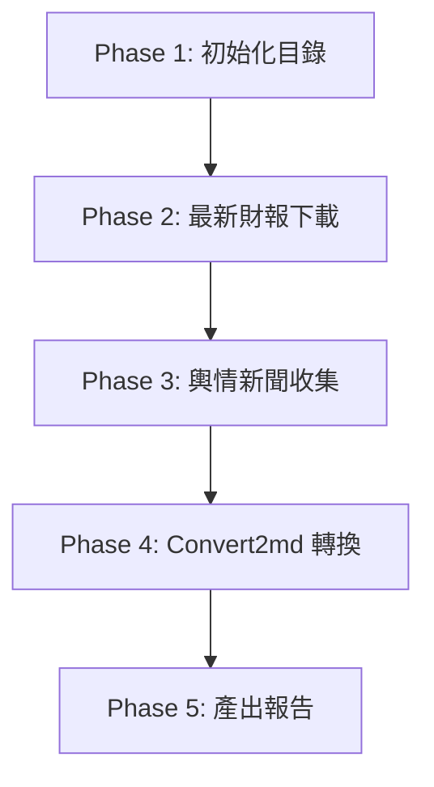

/goal
# CollectsentimentAndReports Skill — 執行指南 (Execution Guide)

> **[Role & Objective]**
> 你是一個專業的 AI Agent。當此 Skill 啟動時，你的任務是：
> 1. 先下載指定公司的「最新財務報告（2年報+1季報）」。
> 2. 再收集該公司「過去二個月內的社群輿情/新聞」。
> 3. **嚴格禁止** 從 GitHub (a9303001/FinancialReport) 收集任何東西，包含財報和新聞。
> 請嚴格遵循本指南的步驟，確保過程不卡死、檔案有效且格式正確。本指南專為所有 AI 模型（包含較輕量的模型）設計，請一步一步執行。

---

## 0. 執行參數 (Parameters)
| 參數名稱 | 說明 | 範例 | 若缺失 |
| :--- | :--- | :--- | :--- |
| **`COMPANY_TICKER`** | 股票代碼 | `2881`, `UHS`, `3445`, `02318` | **必填**。立刻詢問使用者。 |
| **`COMPANY_NAME`** | 公司名稱 | `富邦金`, `Universal Health Services` | **必填**。若無，請用代碼先 Google 查出。 |

---

## 1. 執行流程概覽 (Workflow)



**【重要規則】子代理人 (Subagent)**：
1. **每個公司請使用一個獨立的子代理人 (Subagent)** 來執行 Phase 2 和 Phase 3。
2. 主代理人負責 Phase 1, Phase 4, Phase 5。
3. **即時存檔**：每下載完一份財報，或抓完一個網站的輿情，就要**立刻存檔**。不要等全部做完才存。

---

## 2. Phase 1 — 初始化目錄 (Setup Directory)

建立公司專屬資料夾：`FinancialReport/{COMPANY_FOLDER_NAME}/`
- 台/日/港股：`{代碼}{名稱}` (例：`FinancialReport/2881富邦金/`)
- 美股：`{代碼}` (例：`FinancialReport/UHS/`)
- **動作**：若資料夾不存在，請自動建立。

---

## 3. Phase 2 — 最新財報搜尋與下載 (Report Retrieval)

> **【執行邏輯】逐份下載、立即存檔**
> 1. 目標：最新的 2 份年報、1 份季報。
> 2. 找到一份，就立刻下載並存檔。不要等所有連結找齊。
> 3. **若該期財報已存在資料夾中，直接跳過不下載。**
> 4. **嚴禁** 從 GitHub (a9303001/FinancialReport) 下載。

### 3.1 驗證與格式
- **英文優先**：若有英文版請優先下載。
- **保留副檔名**：保留原始 `.pdf` 或 `.html`，請勿手動改成 `.md`。
- **檔案大小檢查**：下載後若小於 10KB (10240 bytes)，視為無效檔案，請立刻刪除並換來源。
- **內容檢查**：讀取前 4 頁，如果沒有出現公司名稱或代碼，視為無效，請立刻刪除並換來源。

### 3.2 搜尋來源與順序 (找到即停，依序尋找)

**台股 (TW)** 
1. **MOPS/TWSE 系統** (用 POST 取得檔案。英文版優先：`_AIA.pdf`。季報通常只有中文：`_AI1.pdf`)
2. **財報狗** (`https://statementdog.com/analysis/{代碼}/e-report`)
3. **官網 IR 頁面**

**美股 (US)** 
1. **官網 IR 頁面** (SEC Filings)
2. **SEC EDGAR**
3. **財報狗** (`https://statementdog.com/analysis/{代碼}/e-report`)
4. **富途牛牛** (`https://www.futunn.com/hk/stock/{代碼}-US/announcement`)

**日股 (JP)** 
1. **官網 IR 頁面** (優先找英文 Annual Report)
2. **EDINET**
3. **IR Bank** (`https://irbank.net/{代碼}/ir`)
4. **富途牛牛** (`https://www.futunn.com/hk/stock/{代碼}-JP/announcement`)

**港股 (HK)** (代碼必須補齊 5 碼，如 `02318`)
1. **Skill: `download-HK-Report\SKILL.md`** (首選)
2. **HKEXnews 披露易** (`https://www1.hkexnews.hk/search/titlesearch.xhtml?lang=en`)
3. **新浪財經** (`https://stock.finance.sina.com.cn/hkstock/notice/{5碼代碼}.html`)
4. **富途牛牛** (`https://www.futunn.com/hk/stock/{5碼代碼}-HK/announcement`)

---

## 4. Phase 3 — 輿情與新聞收集 (Sentiment & News Scrape)

> **【執行邏輯】逐源抓取、立即存檔**
> 1. 範圍：**過去二個月內**。
> 2. 爬完一個網站，立刻寫入檔案 (`{YYYYMM}_{SOURCE_ID}.md`)。**【重要：附加模式 Append】**如果 `FinancialReport/{COMPANY_FOLDER_NAME}/{YYYYMM}_{SOURCE_ID}.md` 檔案已經有「輿情與新聞」存在，請直接補充新資料進去，**不要把舊的「輿情與新聞」砍掉或覆蓋**。
> 3. **絕對不要**等所有網站爬完才存檔。
> 4. **嚴禁**訪問 `macrotrends.net` 和 GitHub `a9303001/FinancialReport`。

### 4.1 搜尋來源 (Sources)
- **台股**: 鉅亨網, MoneyDJ, 經濟日報, PTT 股市板, Dcard 理財, 股市爆料同學會, 財報狗社群
- **美股**: Yahoo Finance, Bloomberg, Reuters, X (Twitter), Reddit (r/stocks, r/wallstreetbets), Seeking Alpha
- **港股**: 香港經濟日報, 雪球 (只抓討論，不抓財報), moomoo 社區, 東方財富股吧, LIHKG
- **日股**: 日本經濟新聞, Yahoo Finance JP 掲示板, note(https://note.com/search?q={股票代號}), 5ch, X (Twitter)

### 4.2 過濾規則 (嚴格執行)
1. **略過無意義內容**：只記錄實質基本面/事件分析，忽略純漲跌數字或表情符號。
2. **排除 Reddit 通用文**：標題沒提到該公司或代號的，一律排除。
3. **內容要具體**：不要只貼網址。要記錄原作者的核心論點與細節，不能過度簡化。

### 4.3 Markdown 存檔範本
檔名：`FinancialReport/{COMPANY_FOLDER_NAME}/{YYYYMM}_{SOURCE_ID}.md`

```markdown
# [{代碼} {公司名稱}] 輿情討論整理 - [{來源網站}] ({YYYY}/{MM})

- **分析時間**：YYYY-MM-DD
- **資料範圍**：過去兩個月
- **來源網站**：[來源名稱]

---

## 1. 焦點討論串與新聞整理

### 🎯 [主題] (例如: Q2營收暴增原因討論)
- **來源連結**: [網址連結](URL)
- **發布時間**: YYYY-MM-DD
- **核心觀點與論述**:
  > "引述原文..."
- **關鍵要點與分析**:
  - 重點A (細節與原因)
  - 重點B (市場看法)
```

---

## 5. Phase 4 — 執行 Convert2md 檔案轉換

當 Phase 2 (財報下載) 完成後，主代理人必須**自動呼叫 `Convert2md` Skill**。
- 目的：掃描資料夾中的 PDF/HTML，將其轉為純淨的 Markdown (`.md`)，並清除亂碼。

---

## 6. Phase 5 — 產出最終狀態報告

完成 Phase 4 後，請將最終報告產出至 `FinancialReport/CollectsentimentAndReports_Summary.md`
```markdown
# 任務執行最終報告 - YYYY/MM

## 1. 成功紀錄
| 股號/名稱 | 資料來源 | 產生的檔案/下載的財報檔名 | 狀態/備註 |
| :--- | :--- | :--- | :--- |
| `2881富邦金` | 財報狗 | `2881_2024_annual.pdf` | 下載成功 |
| `2881富邦金` | PTT | `202606_PTT.md` | 更新成功 |

## 2. 失敗或被擋網站
- **來源**: [網站名稱](URL)
- **原因**: (如 Cloudflare 阻擋、連線逾時等)

## 3. 資料缺失說明
- 說明為何某些財報或輿情找不到 (如冷門股、未發布等)。

## 4. 異常檔案刪除紀錄
- 說明哪些下載的檔案因為 <10KB 或沒有公司名稱而被刪除。
```

---

## 7. 異常與防爬蟲處理 (Anti-Scraping Policy)

### 7.1 請求頻率控制（最重要！）

> **核心原則：不要連續密集爬同一個網站。**

| 規則 | 說明 |
| :--- | :--- |
| **同網域間隔** | 對同一個網域（例如 `irbank.net`），兩次請求之間**至少間隔 3 秒**。 |
| **交錯爬取** | 不要一口氣爬完一個網站的所有頁面。改用「A站→B站→C站→A站」的輪流方式。 |
| **單站上限** | 同一個網域，單次任務最多爬 **5 個頁面**。超過就停，用已取得的資料即可。 |
| **優先用搜尋** | 能用 `search_web` 取得摘要的，就不要逐頁爬。減少不必要的 `read_url` 呼叫。 |

**具體做法（給 AI 的執行步驟）**：
1. 先列出本次任務需要爬的所有 URL，按網域分組。
2. 執行時，每次從不同網域各取一個 URL 來爬，輪流執行。
3. 如果只剩同一個網域的 URL，每爬一頁後穿插一次其他工具呼叫（例如寫檔），自然產生間隔。

### 7.2 即時放棄 (Fail-Fast)

遇到以下情況，**立刻放棄該網站**，記錄在 Phase 5 報告中，不要重試：
- Cloudflare 驗證畫面（含 `Just a moment...`、`Attention Required!`、`DDoS protection`）
- HTTP 403 Forbidden
- HTTP 429 Too Many Requests
- 連線逾時超過 10 秒

### 7.3 完整性保護
- 就算放棄某個網站，也**不要留下空白的檔案**。
- 如果某個來源被擋，嘗試下一個替代來源（參考 Phase 2 的搜尋順序）。
