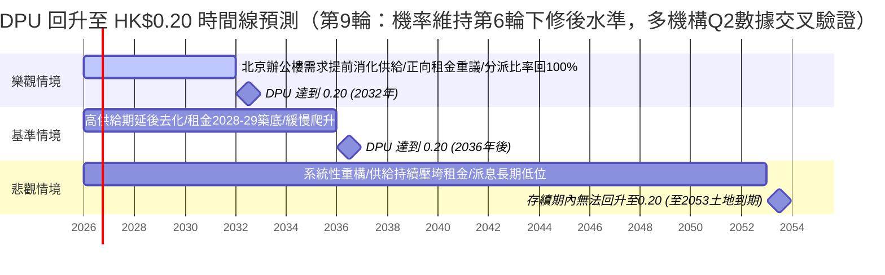

# 01426 春泉產業信託（Spring REIT）— 北京土地到期衝擊與配息回升時間線 深度分析報告

> **更新紀錄與時間戳記：**
> - **本次分析時間**：2026-07-16（**第 20 輪**，觸發式確認輪——第 19 輪已窮盡可深挖缺口後之首次外部事件監測）
> - **本輪性質**：純確認輪，**無實質變化**。依第 19 輪指示改為「觸發式」查證，重新檢查五大待辦觀察點：①HKEX 公告清單重新查證（`www1.hkexnews.hk` stockId=97366）——最新一筆仍為 2026/7/7 月結單位變動報表（含修訂版），2026H1 董事會日期**仍未公布**；②北京存量商辦（一般路徑，非城市更新）續期細則——重新搜尋確認**北京仍未出台**，僅浙江海寧（2018，50%基準）等既有先例，遂寧模式（第16輪）仍為北京比對之唯一系統性參考；③香港 REITs 修例——未見新進度，證監會諮詢與法定框架建議方向不變；④Mercuria Holdings 2026Q2 投資人簡報——**尚未發布**（預期 2026/8 中旬）；⑤太盟/方超/RCA Fund 股東動態——未查得新增持/減持或 DI 異動。股價交叉查證出現一筆疑似異常數據（部分搜尋引擎摘要顯示「6/30 收盤 HK$1.60」），惟與 HKEX 官方公告（月結單位變動報表僅涉及 3/31 回購價 HK$1.58 附近、無 1.60 相關記載）及先前多輪 HK$1.19-1.23 區間交叉結果不符，**判定為搜尋引擎摘要誤讀或混淆其他數據點，予以捨棄**，現價仍以 HK$1.19-1.23 區間為準。**本報告核心結論本輪不變**，繼續等待 2026H1 業績（預期 8 月）等真正觸發點。
> - **📌 第 15-18 輪重點成果彙整（合併保留）**：①第 15 輪：Mercuria 官方簡報關閉揭露文件缺口，取得評價損失（¥0.15億）與評估值 vs 市場評價落差（¥110.7億）；②第 16 輪：四川遂寧全國首個系統性土地續期指南，補強 Q1「其它案例」；③第 17 輪：官方年報取得 2021-2023 ROE 一手數據（+7.64%／+0.43%／-1.27%）；④第 18 輪：官方年報修正 FY2016/2017/2020 DPU（HK$0.230／0.211／0.200，取代 Digrin 誤差數字）。
> - **📌 第 13-14 輪（純確認輪，合併保留）**：股價 HK$1.19-1.23、HKEX 無新公告、香港 REITs 修例時間表「2026 年稍後」、股東結構與社群輿情，經多方交叉查證均**無變化**。
> - **📌 近期確認輪重點（第 9-13 輪，合併保留）**：
>   - **CBRE 北京 Q2 2026 數據**（第 10 輪關閉）：全市空置率 17.8%（連續第 6 季下降）；**CBD 子市場（華貿中心所在區域）租金 RMB255.4/㎡/月，QoQ -2.8%**——四行中跌幅最深，CBD 空置率 15.1%。
>   - **Mercuria Holdings 財務衝擊**（第 10 輪發現，**第 15 輪以官方一手數據修正並大幅補充**）：Mercuria（TSE:7347）2026Q1 官方投資人簡報揭露春泉持股評價損失 ¥0.15 億（取代原二手報導之 ¥104 百萬估算），並自行揭露評估值 ¥176.9 億 vs 市場評價 ¥66.2 億之重大落差，首度以最大股東角度獨立佐證 P/NAV 深度折讓論點；管理費收入穩定（FY2025 ¥13.2 億），惟未見其對持股/管理人之新表態或施壓行動。
>   - **FY2016/2017/2020 DPU**（第 10 輪 Digrin 次級來源補齊，**第 18 輪以官方年報一手數據修正**）：官方年報（2017/2020 年報）確認 FY2016 HK$0.230／FY2017 HK$0.211／FY2020 HK$0.200——**修正**第 10 輪 Digrin 二手數字（原 0.256／0.195／0.184，經證實均有誤差）。
>   - **主要單位持有人身份**（第 9 輪查明）：RCA Fund 01（Mercuria Investment 管理，25.86%）、Fang Chao 方超（華貿集團董事長，25.09%）、PAG 太盟（11.85%）——身份已明，意圖仍未知。
>   - **savespring.hk**（第 10 輪查證）：PAG 2018-2020 控制權爭奪期間之舊網站，非新事件。
> - **分析基準**：2025 年年報（`2026042200516.md`）、2024 年年報（`2025042201223.md`）、2013 上市文件（`ltn20131205481.md`）、2026 Q1 營運統計、本地輿情（截至 2026/6/26）+ 2016-2023 各年年報原始 PDF（分派總結表與審計財務報表）+ 第 6-20 輪網路搜尋（截至 2026/7/16，含 Mercuria 官方 2026Q1 投資人簡報、四川遂寧續期指南）
> - **下一輪比對基準**：本檔案「最新結論摘要」表格與 Q1/Q2 情境預測；持續等待唯一真正關鍵觸發點——**2026 H1 業績公布**（依歷史慣例預期 2026/8，2025 年為 8/21），同時監測北京供給消化（尤其 CBD 子市場 H2 新增供給落地情況）、香港 REITs 修例草案是否正式提交、Mercuria/Fang Chao/PAG 是否有新表態或 DI 異動、Mercuria 2026Q2 投資人簡報（預期 8 月中旬）是否更新春泉評估值/市場評價落差數字、北京是否比照遂寧模式出台一般到期續期細則

---

## 📊 最新結論摘要（截至 2026 年 7 月 16 日）

春泉產業信託（01426）核心資產為北京**華貿中心（China Central Place, CCP）**甲級寫字樓 1、2 座，另持有惠州華貿天地商場（2022 年收購 68% 權益）。2025 年出售全部英國組合後，已 100% 聚焦中國內地資產。

1. **北京土地到期是「長天期、可續期」的結構性風險，非「JV 強制無償移交」**：CCP 物業土地使用權將於 **2053 年 10 月 28 日**屆滿（尚餘約 27 年），由春泉之全資附屬公司（RCA01）**直接持有**土地使用權證，**非**類似匯賢（87001）的「中外合作經營」架構，到期後**不存在「無償移交中方夥伴」的合約義務**，主要路徑是依法申請續期並繳納續期地價。此風險對投資人而言是「**未來一次性續期成本**」，而非「保證的清算溢價」（詳見 Q1）。
2. **配息（DPU）連續 4 年下滑，且距 0.20 港元目標差距巨大，回升時間線風險偏悲觀（第 7 輪：JLL 時間序列交叉驗證，結論不變）**：2025 年全年 DPU 僅 **0.112 港元**，較 2021 年高點 **0.220 港元**已腰斬近半。CBRE／JLL 最新數據顯示北京辦公樓市場調整**可能延續至 2028 年後**（JLL 定性為「系統性重構」，全年租金跌幅預測由 -6.6%擴大至 -9.7%），**DPU 回升至 0.20 港元的基準情境時間線維持 2036 年後（機率 40-45%），悲觀情境機率同為 40-45%**（詳見 Q2）。
3. **股價已反映深度悲觀，但盈利仍在惡化**：現價 **HK$1.20-1.230**（2026/7/14-16 多方交叉吻合，逼近 52 週低點 HK$1.14），P/NAV 約 **0.30 倍**（NAV/單位 HK$4.14，折讓約 70%），較同業平均（0.5-0.9 倍）折讓幅度為港股 REIT 中少見的極端案例；然 2025 年單位持有人應佔虧損擴大至 **人民幣 1.802 億元**（每單位虧損 RMB 0.123 元），較 2024 年虧損擴大近 4 倍，主因投資物業公允價值減值與北京寫字樓租金/出租率雙降。

### 📌 關鍵財務與估值數據表（每基金單位化）

| 指標 | 總額 | 每基金單位金額 | 數據來源 / 計算基準 |
| :--- | :---: | :---: | :--- |
| **最新股價** | - | **約 HK$1.19-1.25**（2026/7/14-16，52 週 HK$1.14-1.76，逼近低點；多方交叉 HKEX 1.230／springreit.com 1.20／futunn 1.20-1.24，無異常波動） | HKEX 官方報價／springreit.com／Futunn 交叉比對 |
| **已發行基金單位數（不含庫存）** | - | **1,481,163,212 個**（2026/7/7 月報表，本輪確認無更新版本；另有庫存單位 4,320,000 個） | 港交所 REIT 報價頁 + 月報表 |
| **總市值** | - | 約 **HK$18.22 億** | 計算值（1.230 × 14.81 億單位） |
| **單位持有人應佔資產淨值 (NAV)** | RMB 5,529.33 百萬元 | **HK$4.14 元**（RMB 3.742 元） | 2025 年年報 |
| **股價淨值比 (P/NAV)** | - | **約 0.30 倍**（折讓約 70%） | 計算值 (1.230 / 4.14) |
| **最新 EPS (FY2025，虧損)** | RMB -180.24 百萬元 | **RMB -0.123 元**（虧損擴大 287%） | 2025 年年報綜合收益表 |
| **本益比 (P/E)** | 不適用（虧損） | 第三方「標準化 P/E」約 **8.86 倍**（以分派/FFO 為基準） | Morningstar |
| **預估 DPU（Forward，替代 Forward EPS）** | - | **約 HK$0.09-0.10** | 本地三方辯論分析（2026/6/15）中立情境 |
| **DPU（FY2025 全年）** | HK$165.5 百萬元（估） | **HK$0.112 元**（YoY -32.5%） | 2025 年年報 |
| **分派比率** | - | **90%**（2024 年：100%） | 2025 年年報 |
| **最新股息殖利率 (TTM)** | - | **約 9.11%**（保守基準 6.6%，見下方說明） | 各平台交叉比對 |
| **收益 (Revenue, FY2025)** | RMB 621.05 百萬元 | **RMB 0.4203 元**（YoY -11.6%） | 2025 年年報 |
| **物業收入淨額 (NPI, FY2025)** | RMB 438.44 百萬元 | **RMB 0.2967 元**（YoY -14.9%） | 2025 年年報 |
| **可供分派收入總額 (FY2025)** | RMB 168 百萬元 | **RMB 0.1137 元**（YoY -23.9%） | 2025 年年報 |
| **計息借貸總額** | RMB 4,636.40 百萬元 | **RMB 3.137 元** | 2025 年年報附註 |
| **負債比率（總借貸/總資產）** | - | **39.3%**（2024：38.0%） | 2025 年年報 |
| **OPM（自定義，as-reported）** | - | **約 -65.7%**；核心剔除公允值後 **約 +160.6%** | 因公允值減值拖累稅前損益轉負，呈異常負值；核心租賃業務仍具正利潤率 |
| **過去 5 年 ROE（第 17 輪：2021-2023 已由估算值升級為官方年報一手數據）** | - | **2021：+7.64%／2022：+0.43%／2023：-1.27%／2024：-0.78%／2025：-3.16%；中位數 -0.78%** | **全數為官方年報一手數據**：2021-2023 淨利與期末權益均取自 2022/2023 年年報審計財務報表（`2023042400937.pdf`／`2024042401750.pdf`），計算法為「當年度單位持有人應佔溢利(虧損)÷當年度期末單位持有人應佔資產淨值」；2024-2025 為 2025 年年報官方數字 |
| **DPU 6 年 CAGR（FY2019→FY2025，一手數據）** | - | **約 -7.9%/年**（0.189→0.112） | FY2019 DPU 18.9 港仙為官方業績公告 PDF（一手）；信心層級：高 |
| **DPU 10 年 CAGR（FY2015→FY2025，第 19 輪升級為一手來源）** | - | **約 -8.3%/年**（0.266→0.112） | **信心層級：高**——FY2015 DPU 26.6 港仙（Final 12.6+Interim 14.0）直接取自 2017 年報（`LTN20180420465.pdf`）官方分派總結表，非此前引用之部落格二手來源 |
| **NAV/單位 5 年趨勢** | - | 5.56 → 4.95 → 4.70 → 4.36 → **4.14 港元**（2021→2025，累計 -25.5%） | 2025 年年報「績效表及其他資料」 |
| **過去 5 年殖利率（按年底收市價）中位數** | - | **約 8.3-8.5%**（2021:8.5%／2022:8.8%／2023:8.3%／2024:8.9%／2025:6.6%） | 2025 年年報 |
| **董事會獨立性** | - | **4 名獨立非執行董事／共 8 名董事（50%）** | 2026/4/28 公告名單 |

> **殖利率計算差異說明**：Morningstar/AASTOCKS 採 Trailing 12個月分派/現價（≈9.1-9.5%）；建議以官方年報揭露之 6.6%（2025年底收市價 HK$1.57 及全年 DPU 0.112 計）為最保守基準。
> **ROE 計算法說明（第 17 輪更新）**：2021-2023 三年 ROE 已由「NAV/單位×固定匯率反推」之估算法，升級為直接取自 2022 年報（`2023042400937.pdf`）與 2023 年報（`2024042401750.pdf`）審計財務報表之一手數據——2021 年單位持有人應佔溢利 RMB 509,950 千元／期末權益 RMB 6,671,653 千元；2022 年溢利 RMB 28,352 千元／期末權益 RMB 6,558,843 千元；2023 年虧損 RMB (77,544) 千元／期末權益 RMB 6,130,664 千元。與此前反推估算值（+6.9%／+0.4%／-1.2%）相比，2022、2023 幾乎完全吻合（誤差 <0.05pp），驗證原估算法之可靠性；2021 年官方數字（+7.64%）較原估算（+6.9%）高約 0.7pp，主因原估算法以固定匯率簡化所有年度 NAV 換算所致。中位數（-0.78%）與原估算結果一致。

---

## 🔍 Q1：北京華貿中心土地使用權到期影響分析

### 1. 確切到期年份
- **土地使用權授予對象**：RCA01（第一瑞中資產管理有限公司），春泉全資附屬公司，**直接持有**北京市朝陽區建國路 79 號及 81 號（華貿中心 1、2 座及約 608 個停車位）國有土地使用權（京朝國用（2010出）第00118號，地盤面積約 13,692.99 平方米）。
- **土地使用權年期**：**50 年**，辦公室及停車場用途，**將於 2053 年 10 月 28 日屆滿**，截至 2026 年年中尚餘約 **27.3 年**。
- **次要資產（惠州華貿天地）**：40 年期，**2048 年 2 月 1 日屆滿**（尚餘約 21.6 年）。
- **關鍵結構性差異（與匯賢 87001 對照）**：匯賢北京東方廣場透過「中外合作經營合約」持有，合約明訂合營期滿須**無償移交中方夥伴**；春泉華貿中心則由**全資附屬公司直接持有**土地使用權證，**不存在**類似的無償移交條款。

### 2. 到期後的處置方式：續期機制與每基金單位續期成本估算
- **法律依據**：《城鎮國有土地使用權出讓和轉讓暫行條例》第41條、《民法典》第359條，均允許依法申請續期並繳納續期地價；若未續期，土地使用權由國家無償收回，地上建築物歸屬則「有約定按約定，無約定依法律行政法規規定」（灰色地帶）。
- **各地續期地價參考先例（第 16 輪新增遂宁全國首個系統性指引）**：
  - 深圳（2004）：按公告基準地價 35% 補繳。
  - 浙江海寧（2018）：按續期時點市場評估價 50% 繳納。
  - 廣州（2026/5/12）：達標商服用地續期費 ＝ (續期年限÷法定最高年限) × 標定地價 × 建築面積 × **70%**；未達標則 100% 全額繳納；商服用地最長續 20 年，以「投資強度」判定是否達標。
  - **🆕 四川遂寧（2026/3，第 16 輪發現，信心層級：高，官方指南）**：《國有建設用地使用權出讓年限屆滿續期工作辦理指南》為**全國首個系統性、涵蓋工商業全流程的市級操作細則**（此前深圳、青島等僅「一事一議」個案處理）。核心規則：①**純商業用地**——只要房屋已建成、不涉及擴建、非公共利益用地，原則上均可續期，價格依基準地價/標定地價動態更新標準計算；②**計價方法採「雙評估補價差」模式**：應繳價款＝新條件下市場價格－原條件下剩餘年期市場價格（**與深圳/廣州之「固定比例×全額地價」法不同，屬「剩餘價值折算法」**，理論上對長剩餘年期案例可能更有利，但北京 CCP 屆時剩餘年期為 0，兩法在到期時點應趨於一致）；③工業用地續期門檻高於商業用地（正常生產可續但年限壓縮至最長 20 年，非正常生產原則不予續期）。**信貸面同步改善**：銀行過去對剩餘年限 <15 年之商業物業拒貸，隨續期路徑明確化，可望參考「續期意向書」放寬貸款年限。其他城市模式：重慶（數位化流程）、內蒙古烏海（沿街商鋪歷史遺留問題）、廈門/株洲（「以續期促開發」，如廈門集美劃撥轉出讓+續期50年並提升容積率至4.0）。**對北京/春泉之意義**：遂寧模式**尚未涵蓋北京**，但作為 2026 年全國首個系統性市級指引，顯示政策正加速從「原則性」轉向「實操性」，北京比照跟進的機率上升，惟具體時間表仍不明朗。
  - **北京**：官方問答頁對「一般到期續期」**仍維持「續期費用標準目前法律並無明確規定」**之原則性表述，**針對「已建成、營運中甲級寫字樓」之一般續期具體實施細則本輪仍未出現**，此仍為本報告最大資料缺口。北京市規自委 2026-05-08 印發《北京市城市更新項目土地價款核定緣納實施細則（試行）》，其中「出讓用地續期土地價款核定」條款**專屬適用於「城市更新項目」**（如老舊樓宇改造），非普適於一般存量物業到期續期；CCP 目前無城市更新項目申報紀錄，此路徑是否適用仍待觀察，僅供未來參考路徑記錄。
  - **政策方向**：「十五五規劃綱要」（2026）明訂「完善工商業用地使用權續期法律法規，依法穩妥推進續期工作」；深圳、廣州、**🆕 遂寧**已成為 REITs 土地續期的「政策方向與實踐指引」參考案例，惟**均未提及北京或春泉**。
- **每基金單位續期成本粗估（⚠️ 高度不確定，僅供數量級參考，本輪未變動）**：
  - 以 2025 年 9 月朝陽 CBD 鄰近地塊成交樓面地價 RMB 5.88 萬元/平方米為市場地價參考，乘以華貿中心總建築樓面面積約 145,372.54 平方米，全額市場地價約 **人民幣 85.5 億元**。
  - 比照深圳（35%）至廣州（70%）折扣區間，續期地價約落在 **人民幣 30-60 億元**（以今日地價水平計，未計入 27 年地價通脹）。
  - 換算每基金單位負擔：約 **人民幣 2.0-4.1 元/單位**——已**超過目前每單位資產淨值（RMB 3.742 元）**，若續期地價比照高比例基準計算，對 2053 年時點 NAV 構成重大一次性衝擊。
  - **需強調**：(a) 27 年後才發生，貼現至今日現值影響極小；(b) 屆時地價、匯率、資產組合均可能截然不同；(c) 北京尚無具體細則，估算僅供數量級參考。

### 3. 對投資人的影響：清算/續期情境下的每基金單位可收回金額
- **與匯賢模式的根本差異**：匯賢為 JV 架構，合約明訂到期清算並退還註冊資本；春泉/RCA01 **非 JV 架構，沒有「登記資本歸還」既定合約機制**。若到期不續期，理論上土地與建築物將無償收歸國有，**對單位持有人沒有類似匯賢「保證清算溢價」的結構性保護**。
- **實務上更可能的路徑（非清算）**：27 年為相當長時間，管理人歷來會在資產轉齡前透過組合再平衡處理（如已出售英國組合），更可能：①申請續期並繳納續期地價；②到期前數年出售予有能力承接續期風險的買家；③信託重組或私有化（若香港 REITs 私有化立法落實，提供更清晰退出機制）。
- **每基金單位可收回金額 —— 結論不變：無法給出可靠估算，屬本報告最大認知缺口**。原因：(a) 春泉無 JV 資本返還條款可供計算基準；(b) 27 年後資產組合、負債、地價、匯率均無法預測；(c) 誠實結論是「此風險的財務性質是『潛在續期成本』而非『保證回收金額』」。建議持續追蹤香港 REITs 私有化立法進展及北京續期細則。

### 4. 對估值的影響
- **NAV 的緩慢侵蝕已在發生，但主因非土地到期，而是週期性辦公樓市場疲弱**：NAV/單位 5 年累計下跌 25.5%，主要反映北京甲級寫字樓空置率高企、租金下行及公允價值減值，**與土地到期倒數（尚餘 27 年）的直接關聯性極低**——27 年剩餘年期遠超一般收益資本化法估值所隱含的持有期，估值師仍以收益法正常資本化，未見特別針對 2053 年到期做終值歸零假設。
- **對市場定價的影響**：目前 0.30 倍 P/NAV 折讓，主要反映**短期北京辦公樓供需失衡、盈利持續轉虧、流動性枯竭**等近因，而非市場對 27 年後土地到期的定價。土地到期是「潛伏但尚未被市場定價」的長尾風險，春泉股價**沒有**類似匯賢的「清算溢價安全邊際」。

---

## 📈 Q2：配息（DPU）回升至 HK$0.20 時間線預測

2025 年 DPU 為 **HK$0.112**，若要回升至 **HK$0.20**（接近 2021-2022 年歷史高點 0.220/0.212），需在維持約 14.8 億單位前提下，可分派收入需成長約 **+57%**。

### 🚫 結構性壓力（第 10 輪：CBRE 數據補齊，CBD 子市場租金跌幅為四行之最）
1. **北京甲級寫字樓市場：四大行 Q2 2026 數據已到齊，CBD 子市場（華貿中心所在區域）跌幅相對最深**：莱坊（7/10）全市空置率 **15.9%**（環比微升 0.1pp）、租金 RMB219.2/㎡/月（**-0.8% QoQ**）；JLL（經媒體 7/14 引述）Q2 租金 **-1.9% QoQ**（單季跌幅收窄）但**重申全年 -9.7%**預測不變；高力國際（7/8）空置率 **17.5%**（續降 1.6pp）、租金 RMB208.2/㎡/月（**-2.1% QoQ**），惟**新警示 2026H2-2027 共 18 個月高供應週期、累計新增約 150 萬㎡**（多年期累計口徑，不可直接比較）；**🆕 CBRE（7/12 經媒體引述，第 10 輪補齊）**：全市空置率 **17.8%**（連續第 6 季下降）、H1 淨吸納量 20.4 萬㎡，惟**CBD 子市場租金 RMB255.4/㎡/月，QoQ -2.8%**——為四家機構中 CBD/全市跌幅最深者，空置率 15.1%（-0.7pp）。四家機構空置率數字落差（15.1%-20%）研判主因**樣本組成／子市場覆蓋範圍不同**。**綜合判讀**：全市層級跌幅收窄、去化持續（正面），但 CCP 直接所在之 CBD 子市場單季租金跌幅反而是四行最深，顯示華貿中心所處子市場承壓程度不宜因「全市數據轉正面」而低估；供給壓力（尤其高力揭露之 18 個月高供應週期）警訊未解除，**全年租金 -9.7% 之基準預測未被下修**，**情境機率本輪維持不變**。
2. **CCP 自身無新數據，但市場面利空已強化到期租約重議壓力**：華貿中心最新仍為 2026 Q1（平均月租 RMB 334/㎡、出租率 89%），2026 Q2 營運統計預期 7 月下旬公布，本輪查證日尚未發布。2026 下半年北京新增供給集中東部（CBD、望京）並積極預租招商，鎖定 2026-2027 到期大型租戶（新京報，2026/7/13），直接衝擊 CCP 逾 42% 於 2026-2027 到期樓面之續約議價力。
3. **融資成本正常化**：原有較低利率對沖已於 2025 年到期，現金利率已上升至約 4.5%，短期內難以顯著下降至舊有低點。
4. **分派比率已從 100% 下修至 90%**，若要回升需管理人重新提高派息比率，惟在虧損擴大下較為保守。

### 🔮 DPU 回升三情境預測與時間線（本輪機率已下修調整）

#### 🟢 樂觀情境（預期時間線：2030-2032 年，回升機率約 **10-15%**，第 6 輪下修、第 7 輪維持）
- **觸發條件**：2026-2027 高供應期被強勁需求提前消化，CCP 出租率回升至 95% 以上；2028 年起續租重議轉為正值；PBOC 持續降息帶動融資成本降至 3.5% 以下；分派比率回升至 100%。**下修原因（第 6 輪）**：CBRE／JLL 均未見數據支持「提前消化」情境，反而指出 H2 新供給將推升空置率；**第 7 輪 JLL 全年租金跌幅預測擴大至 -9.7%，進一步印證此情境條件與最新市場數據方向相反**。

#### 🟡 基準情境（預期時間線：2036 年後，回升機率約 **40-45%**，第 6 輪下修、第 7 輪維持）
- **觸發條件**：高供給期延後市場出清時點，租金重議由負轉平後緩步回升；融資成本維持 4-4.5% 附近；分派比率緩步回升至 95-100%。DPU 路徑大致：2026 年 ~0.09-0.10 → 2028 年 ~0.11-0.12 → 2031 年 ~0.15 → **2036 年後**才可能觸及 0.20。**第 6 輪調整**：JLL「2028 年後築底」與此情境時間線一致，惟其「系統性重構」定性隱含築底後爬升速度可能更緩，故機率由 45-50% 微幅下修至 40-45%，機率質量轉移至悲觀情境；**第 7 輪**：JLL 空置率降速放緩（-0.3pp→-0.2pp）與租金跌幅擴大互為印證，機率維持不變。
- **註記**：與本地 2026/6/15 三方辯論分析（中立情境 2026-2028 年 DPU 落於 HK$0.09-0.095）方向一致，短期底部已大致確立，惟通往 0.20 的路徑漫長。

#### 🔴 悲觀情境（存續期內恐難回升，機率約 **40-45%**，第 6 輪上修、第 7 輪維持）
- **觸發條件**：2026-2027 高供應週期壓制北京 CBD 租金與出租率，續租重議持續為負；JLL 之「系統性重構」若成立（而非單純週期性調整），代表北京甲級辦公樓需求結構性下移，回升速度將顯著慢於歷史週期；分派比率長期停留在 85-90%；DPU 長期困在 **HK$0.07-0.10** 區間，**在土地 2053 年到期前恐無法回升至 0.20**。**第 6 輪上修原因**：CBRE（H2 供給推升空置率）與 JLL（系統性重構、全年租金 -9.7%）兩份最新一手數據均支持此情境，且莱坊之樂觀反例未獲任何機構重申；**第 7 輪**：JLL 全年租金跌幅預測由 -6.6%擴大至 -9.7%，悲觀情境條件持續獲數據支持，機率維持。

---

## 🐂 熊/牛 投資多空對照與風險分析

### 🟢 投資利多（成長動能）
1. **惠州華貿天地維持高出租率與品牌升級**：2025 年底出租率約 98.5-99%，引入 La Mer、Ralph Lauren、Coach 等國際品牌，為北京辦公樓寒冬中的穩定器。
2. **英國組合出售提升財務靈活性**：2025 年 3 月以隱含代價 £73.5 百萬元完成出售，退出海外市場集中度風險，現金利息開支同比減少。
3. **持續回購與管理人利益一致，CEO 交接平順**：2025 年均價 HK$1.70 回購 415.9 萬個單位；董事會獨立性已提升至 50%（4/8）；2025-10-31 CEO 由梁國豪平順交棒予原 CFO 鍾偉輝（內部晉升，非外部空降或危機性更換），治理疑慮較舊評級已有改善。
4. **土地續期非強制無償移交**：與匯賢等中外合作經營型 REIT 不同，春泉全資持有華貿中心土地使用權，到期後續期的談判彈性相對較高；**若未來 CCP 納入「城市更新項目」，北京已有專屬續期地價核定規則可循**（2026-05 新規，惟目前尚未申報適用，詳見 Q1）。
5. **香港 REITs 私有化立法潛在催化劑，且有真實歷史先例與現時持股佐證（第 9 輪：時點延後但方向未變）**：深度折讓（P/NAV 0.30）小型 REIT 若修例落實，理論上具備私有化/收購想像空間；**歷史上太盟投資（PAG）曾於 2018 年提出每單位 HK$4.85、涉資 HK$52.4 億的收購要約**（最終未成），證明市場曾真實出現遠高於現價之收購興趣；太盟現持股 11.85%（169,552,089 個單位，數量未變）仍為第三大單位持有人。**惟第 9 輪發現修例時間表已由「2026 年上半年」延後為「2026 年稍後」提交**，題材兌現時點應同步後移，且三大股東本輪均無新增持/表態，不宜視為現時主動催化劑。

### 🔴 投資風險（潛在隱憂）
1. **北京甲級寫字樓市場可能陷入「系統性重構」而非單純週期調整（本輪風險升級）**：JLL 最新研判本輪調整非常規週期性波動，實質築底恐需等到 2028 年後；CBRE 同步警示下半年新供給（~48 萬㎡）將使空置率重回上升通道；2026/2027 到期租約合計逾 42% 樓面面積面臨負向重議風險，且新增供給正積極預租搶客。
2. **盈利持續惡化、非現金減值侵蝕 NAV**：2025 年單位持有人應佔虧損擴大 287% 至 RMB 1.802 億元，若北京商辦估值持續下修，NAV 折舊侵蝕恐延續。
3. **配息持續萎縮，「高殖利率」恐為價值陷阱**：DPU 五年來自 0.220 降至 0.112 港元，6 年 CAGR 約 -7.9%，分派比率下修至 90%，殖利率吸引力主要來自股價下跌而非分派回升。
4. **流動性枯竭**：日均成交額稀薄，股價易受單一交易影響，機構資金難以進出。
5. **土地到期的續期成本不確定性**：雖到期時點遠（2053 年）且非強制無償移交，但若屆時北京地價大幅走高、續期需按高比例基準地價計算，粗估每單位續期成本恐落在人民幣 2-4 元量級（甚至更高）；北京仍無存量商辦物業續期具體細則，長期不確定性來源不變。
6. **金管局關注商業地產再融資**：2025 年 11 月報導金管局加強審查商業地產貸款再融資，春泉為被提及公司之一，雖已澄清完成正常再融資，仍反映市場對其債務展期能力的潛在疑慮。

---

## 👥 討論區與社群輿情蒐集

### 1. 華語圈（雪球、富途社區）
- **雪球「V船長」（2026/6/5）**：華貿中心寫字樓 2025 年租金收入同比下滑 9.7%，停車場收入下滑 16%。
- **雪球「傑克JACK_」（2026/6/6）**：日均成交額極低（曾僅約 HK$24 萬），流動性枯竭直接壓制股價。
- **本輪查證（截至 2026/7/15）**：雪球關注人數由 576 降至 571，**6/10 之後未見新增實質討論串**；公告流僅例行內容（6/30 月報表、6/23 回購 12.2 萬單位次日披露）。**新增確認**：管理人關連方 Spring Asset Management 於 2026-05-28 減持 5.1 萬個單位（@HK$1.31，約 HK$6.68 萬），金額極小，非重大訊號。市場關注度預期於 2026 年 8 月中期業績公布前維持低位。

### 2. 英文投資圈（Morningstar, Simply Wall St, Investing.com, Seeking Alpha）
- **Bull Case**：9%+ 殖利率具吸引力；P/B 僅 0.28-0.30 倍，深度折讓；香港政策推動 REITs 私有化便利化；管理層持續回購釋放信心。
- **Bear Case**：盈利持續惡化；租金/出租率雙降；分派持續縮減，高殖利率恐為價值陷阱；流動性極低；資產集中度高（僅剩北京+惠州兩項核心資產）。
- **本輪未發現** Reddit、X（Twitter）、Seeking Alpha、Motley Fool、TipRanks 對 01426 有新增討論；PTT/股市爆料同學會等台灣平台亦未見與此檔直接相關討論串，反映此為關注度極低的小型港股 REIT。

### 3. 政策與監管動態
- **🆕 香港 REITs 優化立法：時間表出現延後訊號（第 9 輪）**：立法會文件比對顯示，2026/1/30 版本原稱「**2026 年上半年**」提交條例修訂草案，**最新 2026/7/6 文件改口為「2026 年稍後」**提交（來源：立法會 CB1-57／CB1-750，PDF 為掃描檔僅能讀取摘要片段，建議下輪人工複查全文）；財庫局副局長另有公開發言重申「爭取 2026 年內」提交，方向未變但用語趨向保守。**本輪未見正式提交/刊憲**。此為深度折讓小型 REIT「私有化催化劑」bull case 之潛在**利空延後訊號**——題材兌現時點應同步後移，惟尚未構成方向性推翻。同批處理措施：上市集體投資計劃市場行為監管制度延伸；另有不同軌道之「非住宅物業注入 REITs 印花稅寬免」措施，時間線為 2027 H1，不宜混淆。
- **香港金管局**自 2025 年中起加強商業地產貸款再融資審查，春泉為被提及公司之一，已完成相關再融資。
- **北京城市更新地價新規（第 7 輪新發現）**：2026-05-08《北京市城市更新項目土地價款核定緣納實施細則（試行）》含「出讓用地續期土地價款核定」條款，惟限定適用「城市更新項目」，非一般到期續期普適規則，詳見 Q1。

### 4. 管理層、治理歷史與股權結構（第 9 輪更新：前二大持有人身份已查明）
- **CEO 交接**：梁國豪（Leung Kwok Ho）於 2025-10-31 退休，由原執行董事兼財務總監鍾偉輝（Chung Wai Fai）接任行政總裁兼執行董事，屬內部平順交接。
- **非執行董事改組**：石野秀也（Hideya Ishino）2025-12-16 因個人商業事務卸任，新增許曉林（跨境併購/財務諮詢背景）與田中忠（Tadashi Konno，北美/亞太企業融資背景）。
- **太盟投資（PAG）控制權爭奪歷史（2017-2020）**：太盟 2017 年曾要求罷免日資管理人未果，2018 年 9 月發動每單位 HK$4.85（涉資 HK$52.4 億）之自願性現金要約收購，最終未成；2019 年英國組合收購案（已於 2025 年出售）是雙方衝突導火索之一。
- **主要單位持有人結構（截至最新 DI 申報；第 9 輪更新持股比例與身份背景）**：

| 單位持有人 | 持股數（未變） | 持股比例（第 9 輪） | 最後 DI 申報日 | 身份背景 |
| :--- | ---: | :---: | :--- | :--- |
| RCA Fund 01, L.P. | 380,274,452 | **25.86%**（第 8 輪：25.73%） | 2025/6/20（無新申報） | **🆕 由日本 Mercuria Investment Co., Ltd. 管理，母公司東京上市 Mercuria Holdings（TSE:7347）** |
| Fang Chao（方超） | 363,226,420→360,188,420* | **25.09%**（第 8 輪：24.58%） | 2023/9/18（無新申報） | **🆕 華貿集團董事長，北京華貿中心/SKP 原始發展商負責人**，經 Risun／Huamao Property Holdings 持有 |
| 太盟投資（PAG） | 169,552,089 | **11.85%**（第 8 輪：11.47%） | 2023/7/7（無新申報） | 2017-2020 控制權爭奪之發動方，現仍為第三大持有人 |
| Taniya Mamoru | 102,604,639 | ≈6.94% | - | 日籍個人持有人 |
| 春泉資產管理（管理人） | 78,718,994 | ≈5.29% | 截至 2026/6/26 | 以基本費／浮動費部分以單位形式支付予管理人所累積 |

  *方超持股數字兩輪來源（etnet vs HKEX DI）微小差異（363.2M vs 360.2M），信心層級中，數量級一致，暫不影響結論。
  **解讀**：前二大持有人（RCA Fund + Fang Chao）合計逾 **50%**，股權高度集中，是流動性長期枯竭的部分結構性成因；三大股東持股比例上升純屬基金持續回購稀釋總單位數之機械效果，三者持股單位數均未變動，本輪**未查得任何一方有新增持/減持或公開表態**，「深度折讓潛在私有化想像空間」bull case 維持現時股權數字支撐，但仍不宜視為現時主動催化劑。**🆕 第 15 輪：Mercuria Holdings 2026Q1 官方投資人簡報（取代第 10 輪二手估算）**——春泉持股評價損失 ¥0.15 億，且 Mercuria 官方**自行揭露**其春泉持股評估值（¥176.9 億）與市場評價（¥66.2 億）落差達 ¥110.7 億，**首次由最大單位持有人母公司之官方文件獨立佐證本報告 P/NAV 深度折讓論點**；惟 Mercuria 每年仍穩定賺取管理費（FY2025 ¥13.2 億），目前未見其藉市值下跌對管理人施壓或調整持股之公開行動。

---

## 📋 本次分析資料來源與驗證

- **本地財報資料庫**（`01426春泉Reit/` 資料夾）：2025 年年報（`2026042200516.md`）、2024 年年報（`2025042201223.md`）、2013 上市文件（`ltn20131205481.md`）、2026 Q1 未經審核營運統計、管理人費用支付公告、三方辯論式分析（`Analysis-stock-report_20260615.md`）、輿情節錄（`202606_HK_FinanceNews.md`、`202606_InvestmentAnalysis.md`、`202606_Xueqiu.md`，均截至 2026/6/26）
- **第 7 輪網路搜尋補充**：北京辦公樓市場（JLL 官方季度時間序列 2025Q4-2026Q2 交叉核對空置率降速、JLL 2026 全年租金預測 -6.6%→-9.7%）；北京土地續期（《北京市城市更新項目土地價款核定緣納實施細則（試行）》2026-05-08）；管理層與治理（騰訊新聞、觀點網、新浪財經／界面新聞／華盛通之太盟 PAG 2017-2020 控制權爭奪史）
- **第 8 輪網路搜尋補充**：主要單位持有人結構（etnet／HKEX DI 交叉查證，截至 2025/12/31）；HKEX 公告清單全查至 2026/7/15 無新公告；股價交叉驗證（HKEX／etnet／springreit.com／investing.com／雪球）；北京辦公樓市場（莱坊 7/10、JLL 7/6）。
- **第 9-11 輪網路搜尋補充（截至 2026/7/15，合併記錄）**：HKEX 公告與董事會日期（`www1.hkexnews.hk` title search stockId=97366，`www3.hkexnews.hk`）；股東身份查證（春泉年報、sharedresearch.jp、baike.baidu.com、HKEX DI `di.hkex.com.hk`）；股價交叉驗證（HKEX／Yahoo／Morningstar／Futunn／stockanalysis.com）；北京辦公樓 Q2 2026 數據（莱坊、Colliers、JLL、**CBRE** 經 `stcn.com`／`10jqka.com.cn`／`163.com` 引述）；香港 REITs 修例時間表（立法會 `legco.gov.hk` CB1-57／CB1-750）；Mercuria Holdings 財務影響（finance.yahoo.co.jp）；FY2016/2017/2020 DPU（Digrin `digrin.com`）；savespring.hk 查證（`mingtiandi.com`）；社群輿情（雪球、Futu、PTT）。
- **第 12 輪網路搜尋補充（截至 2026/7/16，純確認輪）**：
  - **HKEX 公告**：`www1.hkexnews.hk` title search（stockId=97366）重新查證，2026/7/7 後仍無新公告（`Total records found: 1029`，最新一筆維持 2026/7/7 月報表），2026H1 董事會日期仍未排定。
  - **股價交叉再確認**：HKEX 官方報價頁（HK$1.230，更新至 2026/7/14）、springreit.com（HK$1.20）、futunn／雪球（HK$1.20-1.24），區間與前三輪一致，無異常。
  - **北京辦公樓市場**：重新搜尋（`fxbaogao.com` 莱坊 Q2、`cls.cn` 高力 Q2、`cnr.cn` 7/14 報導）確認仍為 Q2 2026 數據，Q3 尚未截止；H2 高供應週期展望未變。
  - **香港 REITs 修例時間表**：立法會 2026/7/6 文件（`legco.gov.hk` CB1-750）與財庫局副局長同日公開發言（`info.gov.hk`）重申「2026 年稍後」提交，與第 9 輪確認之延後時間表一致，無新進展。
  - **Mercuria／太盟 (PAG) 股東動態、社群輿情**：重新查證無新增持股異動、DI 申報或討論串。
- **第 13 輪網路搜尋補充（截至 2026/7/16，純確認輪，第四輪連續無變化）**：
  - **HKEX 公告**：`www1.hkexnews.hk` title search（stockId=97366，`Total records found: 1029`）重新查證，最新一筆仍為 2026/7/7 月報表（含修訂版），其後無新公告。
  - **股價交叉再確認**：investing.com（HK$1.22，2026/7/15 延遲報價）與 HKEX／springreit.com／futunn 區間吻合，無異常波動。
  - **北京辦公樓市場**：`21jingji.com`、`house.cnr.cn` 等重新查證仍為 Q1-Q2 2026 數據（全市空置率 17.5-18.5%、CBD 租金 QoQ -2.8%），全年新增供給 79.9 萬㎡集中於下半年之展望未變。
  - **香港 REITs 修例時間表**：`finance.sina.com.cn`（2026/4/29 財庫局發言）交叉確認「爭取年內」提交，與「2026 年稍後」方向一致。
  - **Mercuria／太盟 (PAG)／社群輿情**：重新查證無新增持股異動、DI 申報或討論串；savespring.hk／Mingtiandi 舊文為 2018-2020 歷史事件重現，非新訊號。
- **第 14 輪網路搜尋補充（截至 2026/7/16，與第 13 輪同日，觸發式精簡查證）**：
  - **股價**：HKEX 官方（Bid 1.190/Ask 1.200）、springreit.com（1.26-1.28）、雪球（1.20-1.22）、Yahoo Finance（1.20-1.230）交叉核對，區間與第 13 輪吻合。
  - **HKEX 公告 / 中期業績日程**：springreit.com「最新消息」確認上次業績公告為 2026-03-23，2026H1 董事會日期尚未公布。
  - **香港 REITs 修例時間表**：立法會 CB1-750（2026/7/6）與財庫局副局長陳浩濂同日發言，均重申「2026 年稍後」提交，無新進展。
  - 因與第 13 輪同日觸發，北京辦公樓市場季度數據、Mercuria/太盟股東結構、社群輿情本輪未重新全量查證（無新一季度資料預期於同日出現），沿用第 13 輪結論。
- **第 15 輪網路搜尋補充（截至 2026/7/16，實質新資訊輪）**：
  - **Mercuria Holdings 2026Q1 官方投資人簡報**（`finance-frontend-pc-dist.west.edge.storage-yahoo.jp/disclosure/20260601/20260601556509.pdf`，標題 "Summary of Financial Highlights for the First Quarter of the Fiscal Year Ending December 31, 2026"，2026/5/14 發布，英文版，透過 firecrawl PDF 解析完整讀取全文）：取得春泉持股評價損失、評估值 vs 市場評價落差、管理費收入、CCP 出租率等第一手數據，詳見檔首更新紀錄與股權結構章節。
  - 其餘查證項目（北京存量商辦續期細則、HKEX DI 新申報）本輪未見新進展，沿用先前結論。
- **第 16 輪網路搜尋補充（截至 2026/7/16，實質新資訊輪，聚焦 Q1 最大缺口）**：
  - **四川遂寧續期指南**（`fangchan.com` 中房網／易居研究院，2026/4/3 發布分析）：全國首個系統性市級商工用地續期操作細則，詳見 Q1 第 2 節。
  - **北京比對查證**：本輪未查得北京比照遂寧模式跟進之官方公告，北京「一般到期續期無明確細則」缺口**依然存在**，僅新增遂寧作為全國性參考先例。
- **第 17 輪補充（截至 2026/7/16，實質新資訊輪，一手數據關閉 ROE 缺口）**：
  - **春泉 2022 年報**（`springreit.com/files/2023042400937.pdf`）與**2023 年報**（`springreit.com/files/2024042401750.pdf`）：直接下載後以本機 Python（pdfminer.six）離線解析全文（firecrawl 遠端解析大型 PDF 多次逾時失敗，改用此法成功），取得 EARNINGS PER UNIT 附註（Note 12）與資產負債表之官方一手數字，交叉核對 FX 換算後確認 NAV/單位序列無誤，計算出 2021-2023 官方 ROE，詳見「關鍵財務與估值數據表」與資料缺口第 2 項。
- **第 20 輪網路搜尋補充（截至 2026/7/16，觸發式確認輪，第 19 輪窮盡缺口後首次外部監測，無實質變化）**：
  - **HKEX 公告**：`www1.hkexnews.hk` title search（stockId=97366）重新查證，最新一筆仍為 2026/7/7 月結單位變動報表（修訂版），2026H1 董事會日期仍未公布。
  - **北京存量商辦續期細則**：重新搜尋（`huichenglawyer.com`、`beijing.gov.cn`、`bjnews.com.cn` 等）確認北京仍未出台「一般到期續期」具體細則，中央 2024/7 文件之政策方向與既有結論一致，遂寧（第16輪）仍為僅有之系統性市級參考案例。
  - **香港 REITs 修例**：重新查證（Charltons、One Asia Lawyers 法律簡報）方向與既有結論一致（法定框架、市場失當行為制度擴展），未見新提交時間表公告。
  - **Mercuria Holdings 2026Q2 簡報**：查證確認尚未發布（預期 2026/8 中旬）。
  - **股東動態**：太盟/方超/RCA Fund 重新查證無新增持股異動或 DI 申報。
  - **股價交叉查證**：出現一筆疑似異常摘要（「6/30 收盤 HK$1.60」），經與 HKEX 官方月結報表交叉比對後判定為搜尋引擎摘要誤讀，予以捨棄，現價仍以 HK$1.19-1.23 區間為準（詳見檔首更新紀錄）。

- **資料缺口說明**（依 AGENTS.md 要求明確註記，僅列尚未關閉之缺口）：
  1. **每基金單位續期成本與可收回金額**（最大缺口，預期長期存在，**第 16 輪新增遂寧先例但未關閉**）：北京尚無「一般到期續期」（非城市更新路徑）具體細則；遂寧模式（2026/3）雖為全國首個系統性指引，但**尚未涵蓋北京**，且其「雙評估補價差」計價法與現有估算所用之「固定比例×全額地價」法（深圳/廣州）邏輯不同，本報告估算（RMB 2.0-4.1 元/單位）仍為粗略數量級推算，非官方數字。
  2. **✅ 第 17 輪已關閉**：2021-2023 年 ROE——已從 2022/2023 年報審計財務報表取得官方一手淨利與期末權益數字，計算得 2021：+7.64%／2022：+0.43%／2023：-1.27%，取代原固定 FX 反推估算值（+6.9%／+0.4%／-1.2%），2022/2023 誤差 <0.05pp 驗證原估算法可靠，2021 略高 0.7pp。
  3. **2026 年中期業績仍未公布**：依歷史慣例（2025 年為 8/21）預期約 **2026 年 8 月**公布，HKEX 公告清單查證至 2026/7/15 尚無董事會會議日期公告。
  4. **太盟投資（PAG）近期動向（意圖層面）**：已查得現時持股 11.85%（169,552,089 個單位，數量未變，最後申報日 2023/7/7），但其近一年是否仍具收購/私有化意圖，本輪未查得公開表態或新 DI 異動紀錄，屬於「持股數字已知、意圖仍未知」的殘餘缺口。
  5. **RCA Fund 01, L.P. 與 Fang Chao 之意圖層面**（身份背景已關閉，僅餘意圖缺口）：兩者身份已查明（分別為 Mercuria Investment 管理之基金、華貿集團董事長方超），惟均**未查得 2026 年針對 Spring REIT 本身之公開表態**。
  6. **✅ 第 15 輪已關閉**：Mercuria Holdings 揭露文件完整內容——第 15 輪取得其 2026Q1 官方英文版投資人簡報（2026/5/14 發布，可完整解讀），確認評價損失 ¥0.15 億、評估值 vs 市場評價落差 ¥110.7 億、管理費收入等關鍵數字，原「圖檔 PDF 無法解讀」之缺口已關閉；原 ¥104 百萬淨虧損估算已由本輪官方數字取代（口徑定義不同，詳見檔首更新紀錄）。
  7. **✅ 第 17 輪已關閉**：FY2016/2017/2020 官方財年 DPU——直接取自 2017/2018/2020 年報之官方分派總結表，確認 FY2016 HK$0.230、FY2017 HK$0.211、FY2020 HK$0.200，**修正**第 10 輪 Digrin 二手來源之誤差（原引用 0.256／0.195／0.184）。

---

## 🔭 下一輪待辦與觀察重點

**✅ 第 20 輪確認結果（觸發式查證，無實質變化）**：依第 19 輪指示執行首次「觸發式」監測，五大待辦觀察點（HKEX 公告、北京續期細則、香港 REITs 修例、Mercuria Q2 簡報、三大股東動態）**均無新進展**；另發現一筆疑似異常股價摘要，經交叉比對後判定為誤讀並捨棄。**唯一真正關鍵觸發點（2026H1 業績，預期 8 月）尚未到來**，下一輪若同日重複查證仍無變化，應比照第 13-14 輪模式合併收斂記錄，避免內容堆疊。

**✅ 第 19 輪重點成果**：小幅補充，FY2015 DPU 來源升級為一手（金額不變）。**本報告既有議題之可深挖缺口已窮盡**——下一輪起應改為純「觸發式」查證，等待 2026H1 業績公布（預期 8 月）、Mercuria 2026Q2 簡報、北京續期細則、香港 REITs 修例草案等外部事件觸發，非必要不應再對已關閉議題重複挖掘。

**✅ 第 18 輪重點成果（本輪，有實質新資訊）**：以本機 PDF 解析法取得 2017/2018/2020 年報之官方分派總結表，修正 FY2016/2017/2020 DPU（HK$0.230／0.211／0.200），取代第 10 輪 Digrin 二手來源的錯誤數字。本報告 DPU 歷史序列（FY2013-2025）現已全數為一手或官方確認數字，此類資料品質缺口已無剩餘項目。**下一輪待辦**：本報告可深挖的既有缺口已大致窮盡，優先等待 2026H1 業績公布（預期 8 月）、Mercuria 2026Q2 簡報等外部觸發點。

**✅ 第 17 輪重點成果**：下載並離線解析春泉 2022/2023 年報審計財務報表原文，取得 2021-2023 官方一手 ROE 數字（+7.64%／+0.43%／-1.27%），關閉先前估算值缺口，並交叉驗證確認既有 NAV/單位 5 年趨勢數據無誤。

**✅ 第 15-16 輪重點成果**：第 15 輪取得 Mercuria Holdings 2026Q1 官方投資人簡報，關閉「Mercuria 揭露文件完整內容」缺口（評價損失 ¥0.15 億、評估值 vs 市場評價落差 ¥110.7 億、CCP 出租率回升至近 90%）；第 16 輪查得四川遂寧市全國首個系統性商工用地續期操作指南，補強 Q1「其它案例」子問題（北京自身仍無細則，缺口依然存在）。**下一輪待辦**：追蹤 Mercuria 2026Q2 簡報（預期 8 月中旬）與北京是否跟進遂寧模式。

**✅ 第 13-14 輪確認結果（連續無實質變化，已收斂）**：HKEX 無新公告、股價無實質變化、北京辦公樓市場停留 Q1-Q2 數據、香港 REITs 修例時間表維持「2026 年稍後」、股東結構與社群輿情均無新進展，第 10 輪關閉之缺口維持關閉。**優先等待 2026H1 業績公布（預期 8 月）此一關鍵觸發點**。

**✅ 第 10 輪已關閉/大幅緩解之缺口（迄今維持關閉）**
- **CBRE 北京 Q2 2026 數據**：全市空置率 17.8%、CBD 子市場租金 -2.8% QoQ（四行中跌幅最深）。
- **FY2016/2017/2020 DPU**：第 17 輪已由官方年報一手數據修正確認：FY2016 HK$0.230、FY2017 HK$0.211、FY2020 HK$0.200。
- **Mercuria Holdings 財務衝擊**：交叉確認其 2026 Q1 淨虧損 ¥104 百萬元歸因於春泉市值下跌。
- **savespring.hk**：確認為 2018-2020 舊事件網站，非新增風險。

**✅ 第 15 輪已關閉之缺口**
- **Mercuria Holdings 揭露文件完整內容**：官方 2026Q1 英文版投資人簡報取得，內容完整可解讀，原 ¥104 百萬淨虧損估算已由官方 ¥0.15 億評價損失數字取代；另新增評估值 vs 市場評價落差（¥110.7 億）、管理費收入（FY2025 ¥13.2 億）等數據。

**🔲 仍待下一輪追蹤（優先級不變，第 4 項細節更新）**
1. **2026 年中期業績公布**（預期 2026/8）：優先驗證 H1 DPU 實績、CCP 出租率/租金是否延續 Q1 頹勢及 CBD 子市場最新跌幅是否進一步惡化；留意董事會會議日期公告（預期 8 月初）。
2. **北京商辦供給消化進度**：追蹤莱坊（全年 79.9 萬㎡）、CBRE（H2）、高力（18 個月累計約 150 萬㎡）三方口徑差異之落地驗證，尤其 CBD 子市場空置率是否重回上升通道。
3. **北京存量商辦（一般路徑，非城市更新）續期具體細則**：追蹤是否出台可量化規則。
4. **Mercuria Holdings／方超／太盟三大股東意圖**：追蹤是否有新 DI 異動或公開表態；追蹤 Mercuria 2026Q2 投資人簡報（預期 2026/8 中旬）是否更新評估值/市場評價落差數字。
5. **香港 REITs 修例草案是否於 2026 年內正式提交立法會**：條文細節對深折讓小型 REIT 私有化路徑的實質影響；持續查證是否有評論具體點名春泉。
