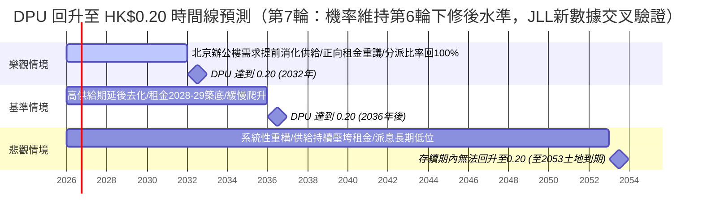

# 01426 春泉產業信託（Spring REIT）— 北京土地到期衝擊與配息回升時間線 深度分析報告

> **更新紀錄與時間戳記：**
> - **本次分析時間**：2026-07-15（滾動確認輪，**第 8 輪**，與第 6/7 輪同日之延續確認輪）
> - **本輪性質**：核心投資論點**無實質變化**（土地到期風險、DPU 回升時間線與情境機率全數維持）。本輪重點為**關閉「太盟現時持股」長期缺口**：透過 etnet／HKEX 股權披露交叉查證，首次取得完整主要單位持有人結構（截至 2025/12/31）。HKEX 公告查證確認 2026/7/7 後**無任何新公告**，2026 H1 中期業績仍未公布，股價/北京辦公樓市場數據與第 7 輪一致，無新增重大事件。
> - **🆕 本輪關鍵更新（第 8 輪）**：
>   1. **✅ 太盟（PAG）現時持股缺口已關閉**：截至 **2025/12/31**，太盟持股 **169,552,089 個單位（11.47%）**，仍為第三大單位持有人（來源：etnet／HKEX 股權披露交叉驗證）。此確認太盟至今仍具備一定持股基礎，「深度折讓下潛在私有化催化劑」之 bull case 有現時持股數字支撐，惟 11.47% 遠低於 2018 年要約收購時之比例，**本輪未查得太盟近期有任何新增持/表態/公開行動**，仍不宜視為現時主動催化劑。
>   2. **🆕 首次揭露完整主要單位持有人結構**（etnet／HKEX DI，截至 2025/12/31，管理人持股截至 2026/6/26）：**RCA Fund 01, L.P. 25.73%**（開曼註冊基金，官方文件定義為「主要單位持有人」）、**Fang Chao（方超）24.58%**（透過 Risun Holdings／Huamao Property Holdings 持有，與物業原始「華貿」品牌淵源有關）、**太盟投資 11.47%**、**Taniya Mamoru 6.94%**（日籍個人）、**春泉資產管理（管理人）5.29%**。前二大單位持有人合計逾 50%，股權集中度高，為深度折讓下流動性枯竭之部分成因，亦是私有化/控制權變動須關注之關鍵股東名單。
>   3. **股價/公告/北京辦公樓市場**：查證 HKEX 公告清單至 2026/7/15，最新一筆為 2026/7/7 月報表（修訂版），**本輪期間無新公告**；股價 etnet 即時報價 HK$1.20（2026/7/15 17:59，日跌 2.44%），與第 7 輪 HK$1.230 差異在正常波動範圍內，52 週區間不變；莱坊（Knight Frank）2026/7/10 報告確認北京甲級寫字樓空置率連續第 6 季下降至 17.8%（與上輪 CBRE 數字一致），惟預估 2026 全年新增供應達 **79.9 萬㎡**（高於上輪 CBRE 之 H2 約 48 萬㎡估計，顯示全年供給壓力可能更大），供給壓力風險維持，**情境機率本輪不調整**。
> - **分析基準**：2025 年年報（`2026042200516.md`）、2024 年年報（`2025042201223.md`）、2013 上市文件（`ltn20131205481.md`）、2026 Q1 營運統計、本地輿情（截至 2026/6/26）+ 第 6-8 輪網路搜尋（截至 2026/7/15）
> - **下一輪比對基準**：本檔案「最新結論摘要」表格與 Q1/Q2 情境預測；追蹤 2026 H1 業績公布、北京供給消化與太盟持股是否有新變動

---

## 📊 最新結論摘要（截至 2026 年 7 月 15 日）

春泉產業信託（01426）核心資產為北京**華貿中心（China Central Place, CCP）**甲級寫字樓 1、2 座，另持有惠州華貿天地商場（2022 年收購 68% 權益）。2025 年出售全部英國組合後，已 100% 聚焦中國內地資產。

1. **北京土地到期是「長天期、可續期」的結構性風險，非「JV 強制無償移交」**：CCP 物業土地使用權將於 **2053 年 10 月 28 日**屆滿（尚餘約 27 年），由春泉之全資附屬公司（RCA01）**直接持有**土地使用權證，**非**類似匯賢（87001）的「中外合作經營」架構，到期後**不存在「無償移交中方夥伴」的合約義務**，主要路徑是依法申請續期並繳納續期地價。此風險對投資人而言是「**未來一次性續期成本**」，而非「保證的清算溢價」（詳見 Q1）。
2. **配息（DPU）連續 4 年下滑，且距 0.20 港元目標差距巨大，回升時間線風險偏悲觀（第 7 輪：JLL 時間序列交叉驗證，結論不變）**：2025 年全年 DPU 僅 **0.112 港元**，較 2021 年高點 **0.220 港元**已腰斬近半。CBRE／JLL 最新數據顯示北京辦公樓市場調整**可能延續至 2028 年後**（JLL 定性為「系統性重構」，全年租金跌幅預測由 -6.6%擴大至 -9.7%），**DPU 回升至 0.20 港元的基準情境時間線維持 2036 年後（機率 40-45%），悲觀情境機率同為 40-45%**（詳見 Q2）。
3. **股價已反映深度悲觀，但盈利仍在惡化**：現價 **HK$1.230**（2026/7/15，多方吻合，逼近 52 週低點 HK$1.14），P/NAV 約 **0.30 倍**（NAV/單位 HK$4.14，折讓約 70%），較同業平均（0.5-0.9 倍）折讓幅度為港股 REIT 中少見的極端案例；然 2025 年單位持有人應佔虧損擴大至 **人民幣 1.802 億元**（每單位虧損 RMB 0.123 元），較 2024 年虧損擴大近 4 倍，主因投資物業公允價值減值與北京寫字樓租金/出租率雙降。

### 📌 關鍵財務與估值數據表（每基金單位化）

| 指標 | 總額 | 每基金單位金額 | 數據來源 / 計算基準 |
| :--- | :---: | :---: | :--- |
| **最新股價** | - | **HK$1.230**（2026/7/15，52 週 HK$1.14-1.76，逼近低點；本輪未見新交易活動） | HKEX 官方報價／stockanalysis.com 交叉吻合 |
| **已發行基金單位數（不含庫存）** | - | **1,481,163,212 個**（2026/7/7 月報表，本輪確認無更新版本；另有庫存單位 4,320,000 個） | 港交所 REIT 報價頁 + 月報表 |
| **總市值** | - | 約 **HK$18.22 億** | 計算值（1.230 × 14.81 億單位） |
| **單位持有人應佔資產淨值 (NAV)** | RMB 5,529.33 百萬元 | **HK$4.14 元**（RMB 3.742 元） | 2025 年年報 |
| **股價淨值比 (P/NAV)** | - | **約 0.30 倍**（折讓約 70%） | 計算值 (1.230 / 4.14) |
| **最新 EPS (FY2025，虧損)** | RMB -180.24 百萬元 | **RMB -0.123 元**（虧損擴大 287%） | 2025 年年報綜合收益表 |
| **本益比 (P/E)** | 不適用（虧損） | 第三方「標準化 P/E」約 **8.86 倍**（以分派/FFO 為基準） | Morningstar |
| **預估 DPU（Forward，替代 Forward EPS）** | - | **約 HK$0.09-0.10** | 本地三方辯論分析（2026/6/15）中立情境 |
| **DPU（FY2025 全年）** | HK$165.5 百萬元（估） | **HK$0.112 元**（YoY -32.5%） | 2025 年年報 |
| **分派比率** | - | **90%**（2024 年：100%） | 2025 年年報 |
| **最新股息殖利率 (TTM)** | - | **約 9.11%**（保守基準 6.6%，見下方說明） | 各平台交叉比對 |
| **收益 (Revenue, FY2025)** | RMB 621.05 百萬元 | **RMB 0.4203 元**（YoY -11.6%） | 2025 年年報 |
| **物業收入淨額 (NPI, FY2025)** | RMB 438.44 百萬元 | **RMB 0.2967 元**（YoY -14.9%） | 2025 年年報 |
| **可供分派收入總額 (FY2025)** | RMB 168 百萬元 | **RMB 0.1137 元**（YoY -23.9%） | 2025 年年報 |
| **計息借貸總額** | RMB 4,636.40 百萬元 | **RMB 3.137 元** | 2025 年年報附註 |
| **負債比率（總借貸/總資產）** | - | **39.3%**（2024：38.0%） | 2025 年年報 |
| **OPM（自定義，as-reported）** | - | **約 -65.7%**；核心剔除公允值後 **約 +160.6%** | 因公允值減值拖累稅前損益轉負，呈異常負值；核心租賃業務仍具正利潤率 |
| **過去 5 年 ROE（本輪新估算，2021-2023 為估算值，2024-2025 為官方數字）** | - | **2021 ≈ +6.9%／2022 ≈ +0.4%／2023 ≈ -1.2%／2024：-0.78%／2025：-3.16%；中位數 ≈ -0.78%** | 2024-2025 為 2025 年年報官方數字；2021-2023 以 FY2021/2022/2023 淨利（stockanalysis.com：RMB +509.95M／+28.35M／-77.54M）÷ 估算股東權益（以 NAV/單位×固定 FX≈0.904×約 14.78 億單位估算）反推，**非官方數字，僅供數量級參考**（2024/2025 用同法反推與官方數字誤差在 0.02-0.1pp 內，方法一致性尚可） |
| **DPU 6 年 CAGR（FY2019→FY2025，一手數據）** | - | **約 -7.9%/年**（0.189→0.112） | FY2019 DPU 18.9 港仙為官方業績公告 PDF（一手）；信心層級：高 |
| **DPU 10 年 CAGR（FY2015→FY2025，補充參考）** | - | **約 -8.3%/年**（0.266→0.112） | FY2015 DPU 26.6 港仙來自二手來源（引用年報之部落格），信心層級：中，僅供補充比對 |
| **NAV/單位 5 年趨勢** | - | 5.56 → 4.95 → 4.70 → 4.36 → **4.14 港元**（2021→2025，累計 -25.5%） | 2025 年年報「績效表及其他資料」 |
| **過去 5 年殖利率（按年底收市價）中位數** | - | **約 8.3-8.5%**（2021:8.5%／2022:8.8%／2023:8.3%／2024:8.9%／2025:6.6%） | 2025 年年報 |
| **董事會獨立性** | - | **4 名獨立非執行董事／共 8 名董事（50%）** | 2026/4/28 公告名單 |

> **殖利率計算差異說明**：Morningstar/AASTOCKS 採 Trailing 12個月分派/現價（≈9.1-9.5%）；建議以官方年報揭露之 6.6%（2025年底收市價 HK$1.57 及全年 DPU 0.112 計）為最保守基準。
> **ROE 估算法說明**：因 REIT 未直接揭露逐年股東權益總額，本輪以 NAV/單位（HKD）×固定匯率 0.904（2025 年實際隱含匯率，套用至各年為簡化假設）換算 RMB 權益基準，除以當年淨利估算 EPS 反推 ROE。此法在 2024/2025 已知官方 ROE（-0.78%／-3.16%）驗證下，估算誤差僅 0.02-0.1 個百分點，可信度尚可，但 2021-2023 三年為**估算值非官方數字**。

---

## 🔍 Q1：北京華貿中心土地使用權到期影響分析

### 1. 確切到期年份
- **土地使用權授予對象**：RCA01（第一瑞中資產管理有限公司），春泉全資附屬公司，**直接持有**北京市朝陽區建國路 79 號及 81 號（華貿中心 1、2 座及約 608 個停車位）國有土地使用權（京朝國用（2010出）第00118號，地盤面積約 13,692.99 平方米）。
- **土地使用權年期**：**50 年**，辦公室及停車場用途，**將於 2053 年 10 月 28 日屆滿**，截至 2026 年年中尚餘約 **27.3 年**。
- **次要資產（惠州華貿天地）**：40 年期，**2048 年 2 月 1 日屆滿**（尚餘約 21.6 年）。
- **關鍵結構性差異（與匯賢 87001 對照）**：匯賢北京東方廣場透過「中外合作經營合約」持有，合約明訂合營期滿須**無償移交中方夥伴**；春泉華貿中心則由**全資附屬公司直接持有**土地使用權證，**不存在**類似的無償移交條款。

### 2. 到期後的處置方式：續期機制與每基金單位續期成本估算
- **法律依據**：《城鎮國有土地使用權出讓和轉讓暫行條例》第41條、《民法典》第359條，均允許依法申請續期並繳納續期地價；若未續期，土地使用權由國家無償收回，地上建築物歸屬則「有約定按約定，無約定依法律行政法規規定」（灰色地帶）。
- **各地續期地價參考先例（本輪更新廣州細節）**：
  - 深圳（2004）：按公告基準地價 35% 補繳。
  - 浙江海寧（2018）：按續期時點市場評估價 50% 繳納。
  - **廣州（2026/5/12，本輪確認公式細節）**：達標商服用地續期費 ＝ (續期年限÷法定最高年限) × 標定地價 × 建築面積 × **70%**；未達標則 100% 全額繳納；商服用地最長續 20 年，以「投資強度」判定是否達標。**目前是全國對「已建成商辦物業」續期最明確的量化公式**，可作北京潛在對照基準。
  - **北京**：官方問答頁對「一般到期續期」**仍維持「續期費用標準目前法律並無明確規定」**之原則性表述，**針對「已建成、營運中甲級寫字樓」之一般續期具體實施細則本輪仍未出現**，此仍為本報告最大資料缺口。**（第 7 輪新發現）**北京市規自委 2026-05-08 印發《北京市城市更新項目土地價款核定緣納實施細則（試行）》，其中「出讓用地續期土地價款核定」條款**專屬適用於「城市更新項目」**（如老舊樓宇改造），非普適於一般存量物業到期續期；CCP 目前無城市更新項目申報紀錄，此路徑是否適用仍待觀察，僅供未來參考路徑記錄。
  - **政策方向**：「十五五規劃綱要」（2026）明訂「完善工商業用地使用權續期法律法規，依法穩妥推進續期工作」；深圳、廣州已被官方媒體（東方財富，2026/4/29）定調為 REITs 土地續期的「政策方向與實踐指引」，惟**均未提及北京或春泉**。
- **每基金單位續期成本粗估（⚠️ 高度不確定，僅供數量級參考，本輪未變動）**：
  - 以 2025 年 9 月朝陽 CBD 鄰近地塊成交樓面地價 RMB 5.88 萬元/平方米為市場地價參考，乘以華貿中心總建築樓面面積約 145,372.54 平方米，全額市場地價約 **人民幣 85.5 億元**。
  - 比照深圳（35%）至廣州（70%）折扣區間，續期地價約落在 **人民幣 30-60 億元**（以今日地價水平計，未計入 27 年地價通脹）。
  - 換算每基金單位負擔：約 **人民幣 2.0-4.1 元/單位**——已**超過目前每單位資產淨值（RMB 3.742 元）**，若續期地價比照高比例基準計算，對 2053 年時點 NAV 構成重大一次性衝擊。
  - **需強調**：(a) 27 年後才發生，貼現至今日現值影響極小；(b) 屆時地價、匯率、資產組合均可能截然不同；(c) 北京尚無具體細則，估算僅供數量級參考。

### 3. 對投資人的影響：清算/續期情境下的每基金單位可收回金額
- **與匯賢模式的根本差異**：匯賢為 JV 架構，合約明訂到期清算並退還註冊資本；春泉/RCA01 **非 JV 架構，沒有「登記資本歸還」既定合約機制**。若到期不續期，理論上土地與建築物將無償收歸國有，**對單位持有人沒有類似匯賢「保證清算溢價」的結構性保護**。
- **實務上更可能的路徑（非清算）**：27 年為相當長時間，管理人歷來會在資產轉齡前透過組合再平衡處理（如已出售英國組合），更可能：①申請續期並繳納續期地價；②到期前數年出售予有能力承接續期風險的買家；③信託重組或私有化（若香港 REITs 私有化立法落實，提供更清晰退出機制）。
- **每基金單位可收回金額 —— 結論不變：無法給出可靠估算，屬本報告最大認知缺口**。原因：(a) 春泉無 JV 資本返還條款可供計算基準；(b) 27 年後資產組合、負債、地價、匯率均無法預測；(c) 誠實結論是「此風險的財務性質是『潛在續期成本』而非『保證回收金額』」。建議持續追蹤香港 REITs 私有化立法進展及北京續期細則。

### 4. 對估值的影響
- **NAV 的緩慢侵蝕已在發生，但主因非土地到期，而是週期性辦公樓市場疲弱**：NAV/單位 5 年累計下跌 25.5%，主要反映北京甲級寫字樓空置率高企、租金下行及公允價值減值，**與土地到期倒數（尚餘 27 年）的直接關聯性極低**——27 年剩餘年期遠超一般收益資本化法估值所隱含的持有期，估值師仍以收益法正常資本化，未見特別針對 2053 年到期做終值歸零假設。
- **對市場定價的影響**：目前 0.30 倍 P/NAV 折讓，主要反映**短期北京辦公樓供需失衡、盈利持續轉虧、流動性枯竭**等近因，而非市場對 27 年後土地到期的定價。土地到期是「潛伏但尚未被市場定價」的長尾風險，春泉股價**沒有**類似匯賢的「清算溢價安全邊際」。

---

## 📈 Q2：配息（DPU）回升至 HK$0.20 時間線預測

2025 年 DPU 為 **HK$0.112**，若要回升至 **HK$0.20**（接近 2021-2022 年歷史高點 0.220/0.212），需在維持約 14.8 億單位前提下，可分派收入需成長約 **+57%**。

### 🚫 結構性壓力（本輪已更新）
1. **北京甲級寫字樓市場：JLL 時間序列交叉驗證，租金跌幅預測持續擴大（第 7 輪確認）**：CBRE（2026-07-09，H1）空置率 17.8%（連 6 季下降，但**下半年新增供給約 48 萬㎡將使空置率重回上升通道**）、租金 H1 累跌 4.4%；JLL 空置率官方時間序列 **2025Q4 15.2%→2026Q1 14.9%→2026Q2 14.7%**，連續下降但降速放緩，**明確定性本輪調整為「系統性重構」而非週期性調整**，**全年租金跌幅預測由年初 -6.6%（2026年1月發布）擴大至 -9.7%（Q2 更新）**，顯示悲觀程度隨時間推移而非收斂，**實質築底需等到 2028 年後**；高力國際歷史預測全年空置率上看 ~20.5%。四家機構空置率數字落差（14.7%-20%）研判主因**樣本組成／子市場覆蓋範圍不同**（JLL 偏核心優質甲級、CBRE 全市口徑、高力納入外圍子市場），而非單純全市 vs CBD 之別；此為交叉比對推論，無來源明文對帳。**上輪引為溫和正面訊號的莱坊「年底觸底」預測，本輪仍未見任何機構重申，維持孤立樂觀觀點之降級判斷**。
2. **CCP 自身無新數據，但市場面利空已強化到期租約重議壓力**：華貿中心最新仍為 2026 Q1（平均月租 RMB 334/㎡、出租率 89%），2026 Q2 營運統計預期 7 月下旬公布，本輪查證日尚未發布。2026 下半年北京新增供給集中東部（CBD、望京）並積極預租招商，鎖定 2026-2027 到期大型租戶（新京報，2026/7/13），直接衝擊 CCP 逾 42% 於 2026-2027 到期樓面之續約議價力。
3. **融資成本正常化**：原有較低利率對沖已於 2025 年到期，現金利率已上升至約 4.5%，短期內難以顯著下降至舊有低點。
4. **分派比率已從 100% 下修至 90%**，若要回升需管理人重新提高派息比率，惟在虧損擴大下較為保守。

### 🔮 DPU 回升三情境預測與時間線（本輪機率已下修調整）

#### 🟢 樂觀情境（預期時間線：2030-2032 年，回升機率約 **10-15%**，第 6 輪下修、第 7 輪維持）
- **觸發條件**：2026-2027 高供應期被強勁需求提前消化，CCP 出租率回升至 95% 以上；2028 年起續租重議轉為正值；PBOC 持續降息帶動融資成本降至 3.5% 以下；分派比率回升至 100%。**下修原因（第 6 輪）**：CBRE／JLL 均未見數據支持「提前消化」情境，反而指出 H2 新供給將推升空置率；**第 7 輪 JLL 全年租金跌幅預測擴大至 -9.7%，進一步印證此情境條件與最新市場數據方向相反**。

#### 🟡 基準情境（預期時間線：2036 年後，回升機率約 **40-45%**，第 6 輪下修、第 7 輪維持）
- **觸發條件**：高供給期延後市場出清時點，租金重議由負轉平後緩步回升；融資成本維持 4-4.5% 附近；分派比率緩步回升至 95-100%。DPU 路徑大致：2026 年 ~0.09-0.10 → 2028 年 ~0.11-0.12 → 2031 年 ~0.15 → **2036 年後**才可能觸及 0.20。**第 6 輪調整**：JLL「2028 年後築底」與此情境時間線一致，惟其「系統性重構」定性隱含築底後爬升速度可能更緩，故機率由 45-50% 微幅下修至 40-45%，機率質量轉移至悲觀情境；**第 7 輪**：JLL 空置率降速放緩（-0.3pp→-0.2pp）與租金跌幅擴大互為印證，機率維持不變。
- **註記**：與本地 2026/6/15 三方辯論分析（中立情境 2026-2028 年 DPU 落於 HK$0.09-0.095）方向一致，短期底部已大致確立，惟通往 0.20 的路徑漫長。

#### 🔴 悲觀情境（存續期內恐難回升，機率約 **40-45%**，第 6 輪上修、第 7 輪維持）
- **觸發條件**：2026-2027 高供應週期壓制北京 CBD 租金與出租率，續租重議持續為負；JLL 之「系統性重構」若成立（而非單純週期性調整），代表北京甲級辦公樓需求結構性下移，回升速度將顯著慢於歷史週期；分派比率長期停留在 85-90%；DPU 長期困在 **HK$0.07-0.10** 區間，**在土地 2053 年到期前恐無法回升至 0.20**。**第 6 輪上修原因**：CBRE（H2 供給推升空置率）與 JLL（系統性重構、全年租金 -9.7%）兩份最新一手數據均支持此情境，且莱坊之樂觀反例未獲任何機構重申；**第 7 輪**：JLL 全年租金跌幅預測由 -6.6%擴大至 -9.7%，悲觀情境條件持續獲數據支持，機率維持。

---

## 🐂 熊/牛 投資多空對照與風險分析

### 🟢 投資利多（成長動能）
1. **惠州華貿天地維持高出租率與品牌升級**：2025 年底出租率約 98.5-99%，引入 La Mer、Ralph Lauren、Coach 等國際品牌，為北京辦公樓寒冬中的穩定器。
2. **英國組合出售提升財務靈活性**：2025 年 3 月以隱含代價 £73.5 百萬元完成出售，退出海外市場集中度風險，現金利息開支同比減少。
3. **持續回購與管理人利益一致，CEO 交接平順**：2025 年均價 HK$1.70 回購 415.9 萬個單位；董事會獨立性已提升至 50%（4/8）；2025-10-31 CEO 由梁國豪平順交棒予原 CFO 鍾偉輝（內部晉升，非外部空降或危機性更換），治理疑慮較舊評級已有改善。
4. **土地續期非強制無償移交**：與匯賢等中外合作經營型 REIT 不同，春泉全資持有華貿中心土地使用權，到期後續期的談判彈性相對較高；**若未來 CCP 納入「城市更新項目」，北京已有專屬續期地價核定規則可循**（2026-05 新規，惟目前尚未申報適用，詳見 Q1）。
5. **香港 REITs 私有化立法潛在催化劑，且有真實歷史先例與現時持股佐證（第 8 輪更新）**：深度折讓（P/NAV 0.30）小型 REIT 若修例落實，理論上具備私有化/收購想像空間；**歷史上太盟投資（PAG）曾於 2018 年提出每單位 HK$4.85、涉資 HK$52.4 億的收購要約**（最終未成），證明市場曾真實出現遠高於現價之收購興趣；**第 8 輪確認太盟截至 2025/12/31 仍持有 11.47%（169,552,089 個單位）**，維持第三大單位持有人地位，使此 bull case 有現時股權數字支撐（惟未查得近期有新增持或公開表態，不宜視為現時主動催化劑）。

### 🔴 投資風險（潛在隱憂）
1. **北京甲級寫字樓市場可能陷入「系統性重構」而非單純週期調整（本輪風險升級）**：JLL 最新研判本輪調整非常規週期性波動，實質築底恐需等到 2028 年後；CBRE 同步警示下半年新供給（~48 萬㎡）將使空置率重回上升通道；2026/2027 到期租約合計逾 42% 樓面面積面臨負向重議風險，且新增供給正積極預租搶客。
2. **盈利持續惡化、非現金減值侵蝕 NAV**：2025 年單位持有人應佔虧損擴大 287% 至 RMB 1.802 億元，若北京商辦估值持續下修，NAV 折舊侵蝕恐延續。
3. **配息持續萎縮，「高殖利率」恐為價值陷阱**：DPU 五年來自 0.220 降至 0.112 港元，6 年 CAGR 約 -7.9%，分派比率下修至 90%，殖利率吸引力主要來自股價下跌而非分派回升。
4. **流動性枯竭**：日均成交額稀薄，股價易受單一交易影響，機構資金難以進出。
5. **土地到期的續期成本不確定性**：雖到期時點遠（2053 年）且非強制無償移交，但若屆時北京地價大幅走高、續期需按高比例基準地價計算，粗估每單位續期成本恐落在人民幣 2-4 元量級（甚至更高）；北京仍無存量商辦物業續期具體細則，長期不確定性來源不變。
6. **金管局關注商業地產再融資**：2025 年 11 月報導金管局加強審查商業地產貸款再融資，春泉為被提及公司之一，雖已澄清完成正常再融資，仍反映市場對其債務展期能力的潛在疑慮。

---

## 👥 討論區與社群輿情蒐集

### 1. 華語圈（雪球、富途社區）
- **雪球「V船長」（2026/6/5）**：華貿中心寫字樓 2025 年租金收入同比下滑 9.7%，停車場收入下滑 16%。
- **雪球「傑克JACK_」（2026/6/6）**：日均成交額極低（曾僅約 HK$24 萬），流動性枯竭直接壓制股價。
- **本輪查證（截至 2026/7/15）**：雪球關注人數由 576 降至 571，**6/10 之後未見新增實質討論串**；公告流僅例行內容（6/30 月報表、6/23 回購 12.2 萬單位次日披露）。**新增確認**：管理人關連方 Spring Asset Management 於 2026-05-28 減持 5.1 萬個單位（@HK$1.31，約 HK$6.68 萬），金額極小，非重大訊號。市場關注度預期於 2026 年 8 月中期業績公布前維持低位。

### 2. 英文投資圈（Morningstar, Simply Wall St, Investing.com, Seeking Alpha）
- **Bull Case**：9%+ 殖利率具吸引力；P/B 僅 0.28-0.30 倍，深度折讓；香港政策推動 REITs 私有化便利化；管理層持續回購釋放信心。
- **Bear Case**：盈利持續惡化；租金/出租率雙降；分派持續縮減，高殖利率恐為價值陷阱；流動性極低；資產集中度高（僅剩北京+惠州兩項核心資產）。
- **本輪未發現** Reddit、X（Twitter）、Seeking Alpha、Motley Fool、TipRanks 對 01426 有新增討論；PTT/股市爆料同學會等台灣平台亦未見與此檔直接相關討論串，反映此為關注度極低的小型港股 REIT。

### 3. 政策與監管動態
- **香港 REITs 優化立法**：財庫局立場維持「2026 年稍後」提交，**本輪未見正式提交/刊憲**，信心層級與上輪一致（一手文件 CB1-750 為依據）。同批處理措施：上市集體投資計劃市場行為監管制度延伸；另有不同軌道之「非住宅物業注入 REITs 印花稅寬免」措施，時間線為 2027 H1，不宜混淆。
- **香港金管局**自 2025 年中起加強商業地產貸款再融資審查，春泉為被提及公司之一，已完成相關再融資。
- **北京城市更新地價新規（第 7 輪新發現）**：2026-05-08《北京市城市更新項目土地價款核定緣納實施細則（試行）》含「出讓用地續期土地價款核定」條款，惟限定適用「城市更新項目」，非一般到期續期普適規則，詳見 Q1。

### 4. 管理層、治理歷史與股權結構（第 8 輪更新：新增主要單位持有人結構）
- **CEO 交接**：梁國豪（Leung Kwok Ho）於 2025-10-31 退休，由原執行董事兼財務總監鍾偉輝（Chung Wai Fai）接任行政總裁兼執行董事，屬內部平順交接。
- **非執行董事改組**：石野秀也（Hideya Ishino）2025-12-16 因個人商業事務卸任，新增許曉林（跨境併購/財務諮詢背景）與田中忠（Tadashi Konno，北美/亞太企業融資背景）。
- **太盟投資（PAG）控制權爭奪歷史（2017-2020）**：太盟 2017 年曾要求罷免日資管理人未果，2018 年 9 月發動每單位 HK$4.85（涉資 HK$52.4 億）之自願性現金要約收購，最終未成；2019 年英國組合收購案（已於 2025 年出售）是雙方衝突導火索之一。
- **🆕 主要單位持有人結構（第 8 輪新增，截至 2025/12/31，來源：etnet／HKEX 股權披露）**：

| 單位持有人 | 持股數 | 持股比例 | 備註 |
| :--- | ---: | :---: | :--- |
| RCA Fund 01, L.P. | 380,274,452 | **25.73%** | 開曼註冊基金，官方文件定義之「主要單位持有人」 |
| Fang Chao（方超） | 363,226,420 | **24.58%** | 經 Risun Holdings／Huamao Property Holdings 持有，與物業原始「華貿」品牌有淵源 |
| 太盟投資（PAG） | 169,552,089 | **11.47%** | 2017-2020 控制權爭奪之發動方，現仍為第三大持有人 |
| Taniya Mamoru | 102,604,639 | **6.94%** | 日籍個人持有人 |
| 春泉資產管理（管理人） | 78,718,994 | 5.29%（截至 2026/6/26） | 以基本費／浮動費部分以單位形式支付予管理人所累積 |

  **解讀**：前二大持有人（RCA Fund + Fang Chao）合計逾 **50%**，股權高度集中，是流動性長期枯竭的部分結構性成因；太盟持股確認仍具規模，「深度折讓潛在私有化想像空間」bull case 有現時數字支撐，但**本輪未查得太盟或其他大股東近期有新增減持或公開表態**，不應外推為現時主動催化劑。

---

## 📋 本次分析資料來源與驗證

- **本地財報資料庫**（`01426春泉Reit/` 資料夾）：2025 年年報（`2026042200516.md`）、2024 年年報（`2025042201223.md`）、2013 上市文件（`ltn20131205481.md`）、2026 Q1 未經審核營運統計、管理人費用支付公告、三方辯論式分析（`Analysis-stock-report_20260615.md`）、輿情節錄（`202606_HK_FinanceNews.md`、`202606_InvestmentAnalysis.md`、`202606_Xueqiu.md`，均截至 2026/6/26）
- **第 7 輪網路搜尋補充**：北京辦公樓市場（JLL 官方季度時間序列 2025Q4-2026Q2 交叉核對空置率降速、JLL 2026 全年租金預測 -6.6%→-9.7%）；北京土地續期（《北京市城市更新項目土地價款核定緣納實施細則（試行）》2026-05-08）；管理層與治理（騰訊新聞、觀點網、新浪財經／界面新聞／華盛通之太盟 PAG 2017-2020 控制權爭奪史）
- **第 8 輪網路搜尋補充（截至 2026/7/15）**：
  - **主要單位持有人結構**：etnet 公司資料頁（`etnet.com.hk/.../quote_ci_brief.php?code=1426`，截至 2025/12/31）交叉比對 HKEX 股權披露（`di.hkex.com.hk`）與歷年年報／通函（Fang Chao 持股背景），確認太盟持股與完整前五大持有人名單。
  - **HKEX 公告清單全查**：`www1.hkexnews.hk` title search 確認 2026/7/7 月報表（修訂版）後至查證日（7/15）無新公告。
  - **股價交叉驗證**：HKEX 官方報價頁、etnet 即時報價（2026/7/15 17:59 HK$1.20）、springreit.com 官網、investing.com、雪球，多方數據於 HK$1.20-1.30 區間內波動，無明顯分歧。
  - **北京辦公樓市場**：莱坊（Knight Frank）via 騰訊新聞（2026/7/10）確認空置率連續 6 季下降至 17.8%、預估 2026 全年新增供應 79.9 萬㎡；JLL 官方新聞稿（2026/7/6，中環市場為主，供交叉參考）。

- **資料缺口說明**（依 AGENTS.md 要求明確註記，僅列尚未關閉之缺口）：
  1. **每基金單位續期成本與可收回金額**（最大缺口，預期長期存在）：北京尚無「一般到期續期」（非城市更新路徑）具體細則；本報告估算（RMB 2.0-4.1 元/單位）為粗略數量級推算，非官方數字。
  2. **FY2016/2017/2020 官方財年 DPU 與該期間淨利**：官方業績公告 PDF 連結失效（404）及財務摘要頁反爬蟲（503），本輪未再重試，10 年 DPU CAGR 現以 FY2015（二手來源）估算，6 年 CAGR 以 FY2019（一手）估算為主。
  3. **2021-2023 年 ROE 為估算值非官方數字**：因缺逐年股東權益官方揭露，以固定 FX 換算法反推，已用 2024/2025 已知官方數字驗證方法一致性（誤差 <0.1pp），但仍建議標記為估算。
  4. **2026 年中期業績仍未公布**：依歷史慣例（2025 年為 8/21）預期約 **2026 年 8 月**公布，HKEX 公告清單查證至 2026/7/15 尚無董事會會議日期公告。
  5. **太盟投資（PAG）近期動向（意圖層面，持股數字已於第 8 輪關閉）**：已查得現時持股 11.47%，但其近一年是否有增減持動作、是否仍具收購/私有化意圖，本輪未查得公開表態或 DI 異動紀錄，屬於「持股數字已知、意圖仍未知」的殘餘缺口。
  6. **RCA Fund 01, L.P. 與 Fang Chao 之背景與意圖**（第 8 輪新增缺口）：兩者合計持股逾 50%，為實質控制性股東，惟本輪未查得其具體身份背景、與管理人／原始發展商之關聯細節及未來意圖，建議下一輪深入追查。

---

## 🔭 下一輪待辦與觀察重點

**✅ 本輪（第 8 輪）已關閉/大幅緩解之缺口**
- **太盟（PAG）現時持股比例**：確認截至 2025/12/31 為 11.47%（169,552,089 個單位），仍為第三大單位持有人。
- **完整主要單位持有人結構**：首次補齊 RCA Fund 01, L.P.（25.73%）、Fang Chao（24.58%）、Taniya Mamoru（6.94%）、管理人（5.29%）等前五大持有人全貌。

**🔲 仍待下一輪追蹤**
1. **2026 年中期業績公布**（預期 2026/8）：優先驗證 H1 DPU 實績、CCP 出租率/租金是否延續 Q1 頹勢；留意董事會會議日期公告。
2. **北京商辦供給消化進度**：追蹤 2026 全年新增供給（莱坊估 79.9 萬㎡ vs CBRE H2 估 48 萬㎡，估計落差待釐清）落地後空置率是否重回上升通道、租金跌幅預測是否持續擴大。
3. **北京存量商辦（一般路徑，非城市更新）續期具體細則**：追蹤是否出台可量化規則，屆時以廣州 70% 公式或北京城市更新細則為基準重算 CCP 續期成本；同時追蹤 CCP 是否有任何城市更新項目申報動向。
4. **香港 REITs 修訂草案正式提交**：條文細節對深折讓小型 REIT 私有化路徑的實質影響；持續查證是否有評論具體點名春泉。
5. **太盟（PAG）、RCA Fund 01 與 Fang Chao 近期動向**：查證三大股東近一年有無增減持、DI 異動紀錄或公開表態，並釐清 RCA Fund／Fang Chao 之身份背景與意圖，評估對控制權/私有化想像空間的現實意義。
6. **FY2016/2017/2020 官方財年 DPU 補齊**：嘗試透過 HKEX 披露易公告存檔取得，補足 10 年 CAGR 之一手數據基礎。
