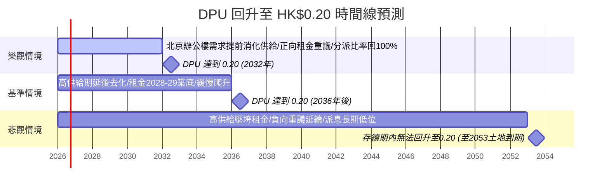

# 01426 春泉產業信託（Spring REIT）— 北京土地到期衝擊與配息回升時間線 深度分析報告

> **更新紀錄與時間戳記：**
> - **本次分析時間**：2026-07-15（滾動確認輪，第 5 輪）
> - **本輪性質**：確認性複查，**未發現足以推翻既有 Q1/Q2 結論之重大新資訊**；主要成果為關閉上輪遺留的「股價跨平台分歧」缺口，並以官方立法文件原文取代二手轉述。
> - **本輪關鍵更新**：
>   1. **✅ 股價分歧缺口已關閉**：本輪直接查證 **HKEX 官方報價頁**（sym=1426），確認現價 **HK$1.230**（成交額 HK$187.15K，量 152.00K），與 stockanalysis.com、雪球（7/14 16:08 收盤 HK$1.23）三方完全吻合，**取代上輪 HK$1.20-1.26 之不確定區間**，採為本輪單一權威數字（springreit.com 首頁顯示之 1.26 經核為 7/3 舊快取，非最新價，不予採用）。
>   2. **香港 REITs 修法時間線：以立法會文件原文取代二手轉述**：本輪直接調閱 2026/7/6 立法會財經事務委員會文件（CB1-750，2026 年 6 月呈交）原文第 25 段，官方明文「**基於目前法律草擬工作的進度，我們計劃在 2026 年稍後向立法會提交條例修訂草案**」——確認 REITs「強制收購／協議安排」私有化機制法案**仍排在 2026 年內**，與上輪結論一致但信心層級提升（一手文件 vs 二手報導）。另同文件揭露一項**不同、較次要**的措施——非住宅物業注入 REITs 之印花稅寬免——時間線為「明年上半年」（即 2027 H1），與私有化法案分屬不同修法項目，不宜混淆。
>   3. **北京辦公樓市場：兩家研究機構數據方向出現分歧（新發現）**：莱坊（Knight Frank）2026 Q2 報告稱全市甲級寫字樓平均空置率 **15.9%**（QoQ +0.1pp，微幅走高）、平均淨有效租金 **RMB 219.2/㎡/月**（QoQ -0.8%，跌幅收窄），並預測**調整週期有望於 2026 年底接近尾聲**；另一機構口徑（上輪已引用，QoQ -1.6pp 至 17.5%、租金 RMB 208.2/-2.1%）方向相反。研判為統計範圍（全市 vs 核心商圈）或涵蓋樓宇/樣本差異所致，**兩者並存為交叉參考，不強行調和**，莱坊之「築底於年底」預測為新增之溫和正面訊號。
>   4. **新增風險訊號**：新京報 2026/7/13 報導指出，2026 下半年北京寫字樓新增優質供應項目已積極開啟預租招商，**鎖定對象即為 2026-2027 到期之大型租戶**，可能加劇 CCP 到期租約（合計逾 42% 樓面）續租重議時的競爭壓力，屬 Q2 悲觀情境觸發條件的新佐證。
>   5. **回購與單位數微幅更新**：截至 2026/7/7 月報表，已發行單位（不含庫存）**1,481,163,212 個**、庫存單位 4,320,000 個，總計 1,485,483,212 個，較 6/30 之 1,481,041,212 個微增（管理費以單位支付所致），變動 <0.1%，不重大。
>   6. **社群輿情**：未發現雪球、PTT、股市爆料同學會、Seeking Alpha 等平台於本輪查證期間有 01426 新增實質討論串，關注度延續低迷。
> - **分析基準**：2025 年年報（`2026042200516.md`）、2024 年年報（`2025042201223.md`）、2013 上市文件（`ltn20131205481.md`）、2026 Q1 營運統計、本地輿情（截至 2026/6/26）+ 本輪網路搜尋（截至 2026/7/15）
> - **下一輪比對基準**：本檔案「最新結論摘要」表格與 Q1/Q2 情境預測

---

## 📊 最新結論摘要（截至 2026 年 7 月 15 日）

春泉產業信託（01426）核心資產為北京**華貿中心（China Central Place, CCP）**甲級寫字樓 1、2 座，另持有惠州華貿天地商場（2022 年收購 68% 權益）。2025 年出售全部英國組合後，已 100% 聚焦中國內地資產。

1. **北京土地到期是「長天期、可續期」的結構性風險，非「JV 強制無償移交」**：CCP 物業土地使用權將於 **2053 年 10 月 28 日**屆滿（尚餘約 27 年），且由春泉之全資附屬公司（RCA01／第一瑞中資產管理有限公司）**直接持有**土地使用權證，**並非**類似匯賢（87001）的「中外合作經營」架構，故到期後**不存在「無償移交中方夥伴」的合約義務**。到期後的主要路徑是**依法申請續期並繳納續期地價**，而非強制清算退還。這代表此風險對投資人而言是「**未來一次性續期成本**」，而非「保證的清算溢價」——與匯賢的風險方向**正好相反**（詳見 Q1）。
2. **配息（DPU）連續 4 年下滑，且距 0.20 港元目標差距巨大**：2025 年全年 DPU 僅 **0.112 港元**，較 2021 年高點 **0.220 港元**已腰斬近半（5 年 CAGR 約 **-15.5%**）。若要回升至 0.20 港元，需可分派收入較現水平大幅成長逾 **50-60%**，在北京甲級寫字樓市場尚未確立反彈趨勢前，屬**極具挑戰性的目標**（詳見 Q2，基準情境預估需到 **2034 年後**才可能觸及，且機率不高）。
3. **股價已反映深度悲觀，但盈利仍在惡化**：現價 **HK$1.230**（2026/7/15，HKEX 官方報價／stockanalysis.com／雪球三方吻合，已關閉上輪之跨平台分歧；逼近 52 週低點 HK$1.14；管理人 3-4 月仍以 HK$1.37-1.58 回購，其後股價回落約 20%），P/NAV 約 **0.30 倍**（NAV/單位 HK$4.14，折讓約 70%），較同業平均（0.5-0.9 倍）折讓幅度為港股 REIT 中少見的極端案例；然 2025 年單位持有人應佔虧損擴大至 **人民幣 1.802 億元**（每單位虧損 RMB 0.123 元），較 2024 年虧損（4,663 萬元）擴大近 4 倍，主因投資物業公允價值減值（RMB 1.846 億元）與北京寫字樓租金/出租率雙降。

### 📌 關鍵財務與估值數據表（每基金單位化）

| 指標 | 總額 | 每基金單位金額 | 數據來源 / 計算基準 |
| :--- | :---: | :---: | :--- |
| **最新股價** | - | **HK$1.230**（2026/7/15，52 週 HK$1.14-1.76，逼近低點） | HKEX 官方 REIT 報價頁（sym=1426）／stockanalysis.com／雪球，三方吻合（本輪已關閉上輪跨平台分歧） |
| **已發行基金單位數（不含庫存）** | - | **1,481,163,212 個**（2026/7/7 月報表；較 6/30 之 1,481,041,212 微增 <0.1%，因管理人費用以新單位支付；另有庫存單位 4,320,000 個） | 港交所 REIT 報價頁 + 春泉「Movements in Units」2026/7/7 |
| **總市值** | - | 約 **HK$18.22 億** | 計算值（1.230 × 14.81 億單位），與雪球揭露總市值一致 |
| **單位持有人應佔資產淨值 (NAV)** | RMB 5,529.33 百萬元 | **HK$4.14 元**（RMB 3.742 元） | 2025 年年報 |
| **股價淨值比 (P/NAV)** | - | **約 0.30 倍**（折讓約 70%） | 計算值 (1.230 / 4.14) |
| **最新 EPS (FY2025，虧損)** | RMB -180.24 百萬元 | **RMB -0.123 元**（虧損擴大 287%，2024：-0.032 元） | 2025 年年報綜合收益表 |
| **本益比 (P/E)** | 不適用（虧損） | 不適用；第三方「標準化 P/E」約 **8.86 倍**（以分派/FFO 為基準） | 統計虧損不計；Morningstar |
| **預估 DPU（Forward，替代 Forward EPS）** | - | **約 HK$0.09-0.10**（因 REIT 損益受非現金公允值影響，Forward EPS 無實質參考意義，改採 Forward DPU） | 本地三方辯論分析（2026/6/15）中立情境 |
| **DPU（FY2025 全年）** | HK$165.5 百萬元（估） | **HK$0.112 元**（中期 0.076 + 末期 0.036，YoY -32.5%） | 2025 年年報 |
| **分派比率** | - | **90%**（2024 年：100%，-10 個百分點） | 2025 年年報 |
| **最新股息殖利率 (TTM)** | - | **約 9.11%**（Morningstar 報 9.49%；Simply Wall St 口徑 7.0%） | 各平台交叉比對，計算基礎差異見下方說明 |
| **收益 (Revenue, FY2025)** | RMB 621.05 百萬元 | **RMB 0.4203 元**（YoY -11.6%） | 2025 年年報綜合收益表 |
| **物業收入淨額 (NPI, FY2025)** | RMB 438.44 百萬元 | **RMB 0.2967 元**（YoY -14.9%） | 2025 年年報綜合收益表 |
| **可供分派收入總額 (FY2025)** | RMB 168 百萬元 | **RMB 0.1137 元**（YoY -23.9%） | 2025 年年報 |
| **營運溢利 (Operating Profit)** | RMB 53.44 百萬元 | **RMB 0.0362 元** | 2025 年年報綜合收益表 |
| **計息借貸總額** | RMB 4,636.40 百萬元 | **RMB 3.137 元** | 2025 年年報附註 |
| **負債比率（總借貸/總資產）** | - | **39.3%**（2024：38.0%，倘計入英國組合待售負債為 41.4%） | 2025 年年報 |
| **OPM（自定義公式，as-reported）** | - | **約 -65.7%** | (營運溢利率 8.6% / 稅前虧損率 -13.1%)×100%；因公允價值減值 RMB 1.846 億元拖累稅前損益轉負，OPM 呈現異常負值 |
| **OPM（核心／剔除公允價值與其他非現金虧損，補充參考）** | - | **約 +160.6%** | 剔除公允值減值(1.846億)及其他虧損淨額(1.191億)後估算；顯示核心租賃業務仍有正向利潤率，虧損主因非現金項目而非營運面 |
| **過去 5 年 ROE** | - | **資料不足，無法給出中位數**（僅 2024：-0.78%、2025：-3.16% 兩點可得） | 本地僅有 2023-2025 年報；2021-2022 年報未存於 GitHub 資料庫，缺口待補 |
| **過去 5 年殖利率（按年底收市價計）中位數** | - | **約 8.3-8.5%**（2021:8.5%／2022:8.8%／2023:8.3%／2024:8.9%／2025:6.6%） | 2025 年年報「績效表及其他資料」 |
| **DPU CAGR（5 年，2021→2025，代理淨利潤 CAGR）** | - | **約 -15.5%** | 計算值 (0.112/0.220)^(1/4)-1；REIT 淨利潤因公允價值波動劇烈且近 2 年轉虧，不適合作 CAGR 基準，改用 DPU |
| **DPU/淨利潤 10 年 CAGR** | - | **資料不足**（本地僅存 2023-2025 年報，缺 2016 年附近數據） | 需補充春泉 2016-2020 年報或歷史分派記錄 |
| **NAV/單位 5 年趨勢** | - | 5.56 → 4.95 → 4.70 → 4.36 → **4.14 港元**（2021→2025，累計 -25.5%） | 2025 年年報「績效表及其他資料」 |
| **董事會獨立性** | - | **4 名獨立非執行董事／共 8 名董事（50%）** | 2026/4/28 公告名單（含 2026/5 新任邱立平）；**更正**：Simply Wall St（202606 節錄）稱「僅 3 名獨董、不足一半」之說法已過時，2026 年 5 月週年大會後獨董比例已達 50% |

> **殖利率計算差異說明**：Morningstar/AASTOCKS 採 Trailing 12個月分派 / 現價（≈9.1-9.5%）；Simply Wall St 之 7.0% 疑採不同期間或已扣除特別項目；建議以官方年報揭露之 6.6%（按 2025 年底收市價 HK$1.57 及全年 DPU 0.112 計）為最保守基準。

---

## 🔍 Q1：北京華貿中心土地使用權到期影響分析

### 1. 確切到期年份
- **土地使用權授予對象**：RCA01（中文全名：**第一瑞中資產管理有限公司**），為春泉產業信託之全資（100%）附屬公司，**直接持有**北京市朝陽區建國路 79 號及 81 號（華貿中心 1、2 座寫字樓及約 608 個停車位）之國有土地使用權（京朝國用（2010出）第00118號，地盤面積約 13,692.99 平方米）。
- **土地使用權年期**：**50 年**，用途為辦公室及停車場，**將於 2053 年 10 月 28 日屆滿**（本輪已交叉核對 2025 年年報估值報告原文第 3650-3657 行及財務報表附註第 5347-5348 行，兩處日期完全一致）。截至 2026 年年中，尚餘約 **27.3 年**。
- **次要資產（惠州華貿天地）土地使用權**：40 年期，**2048 年 2 月 1 日屆滿**（尚餘約 21.6 年），因惠州物業僅佔總資產一小部分且到期時間相近，本報告以北京華貿中心為分析主軸。
- **關鍵結構性差異（與匯賢 87001 對照）**：匯賢北京東方廣場透過「中外合作經營合約」持有，合約明訂合營期滿固定資產須**無償移交中方夥伴**；春泉華貿中心則由**全資（無合資夥伴）附屬公司直接持有**國有土地使用權證，**不存在**類似的無償移交條款。這是本報告與同類 REIT 分析最大的結構性差異，詳見下方第 2、3 點。

### 2. 到期後的處置方式：續期機制與每基金單位續期成本估算
- **法律依據**：《城鎮國有土地使用權出讓和轉讓暫行條例》第四十一條規定：「土地使用權期滿，土地使用者可以申請續期。需要續期的，應當……重新簽訂合同，支付土地使用權出讓金，並辦理登記。」《民法典》第三百五十九條亦規定非住宅建設用地使用權期限屆滿後的續期依法律規定辦理；若未續期，土地使用權由國家無償收回，地上建築物歸屬則「有約定按約定，無約定依法律行政法規規定」（存在法律未明確之灰色地帶）。
- **續期地價目前無全國統一標準**，各地已有的參考先例（本輪查證）：
  - 深圳（2004 年規定）：按公告基準地價的 **35%** 補繳。
  - 浙江海寧（2018 年規定）：按續期時點市場評估價的 **50%** 繳納。
  - 廣州試點（2026/5/12 發布）：達標產業用地按「(續期年期÷法定最高年限)×基準地價×用地面積×70%」計算，不達標則 100%。
  - **北京**：續期地價可按「首次出讓時地價水平」或「續期時基準地價」重新綜合評估（東方財富 2026/5/20 報導重申此原則）；續期年限與剩餘年限之和不超過法定最高年限。
  - **政策方向本輪更新（略偏正面）**：中國「**十五五規劃綱要**」（2026）明訂「**完善工商業用地使用權續期法律法規，依法穩妥推進續期工作**」，續期議題由理論探討進入政策落地階段；工業用地續期已出現破冰個案（四川遂寧，2026/4）。**但北京迄今仍僅有原則性規則，尚未見針對「已建成營運中甲級寫字樓」（相對於「閒置地塊」）續期地價的具體實施細則**，此仍為本報告最大資料缺口——方向趨於加速明朗，惟量化基礎尚未具備。
- **每基金單位續期成本粗估（⚠️ 高度不確定，僅供數量級參考）**：
  - 以 2025 年 9 月朝陽 CBD 鄰近地塊（呼家樓南里）成交樓面地價 **人民幣 5.88 萬元/平方米**作為當前市場地價替代參考，乘以華貿中心總建築樓面面積約 145,372.54 平方米，得出**全額市場地價**約為 **人民幣 85.5 億元**。
  - 若比照深圳（35%）至廣州達標情境（70%）的折扣區間計算續期地價，落在約 **人民幣 30-60 億元**（以「今日地價水平」計，未計入 2053 年前 27 年的地價通脹或市場變化）。
  - 換算每基金單位負擔：約 **人民幣 2.0-4.1 元/單位**（以 1,477,981,560 單位計）——此金額已**超過目前每單位資產淨值（RMB 3.742 元）**，顯示若續期地價比照當前市場全額或高比例基準計算，將對 2053 年時點的 NAV 構成重大一次性沖擊。
  - **但需強調**：(a) 此為 27 年後才會發生的一次性事件，以任何合理貼現率折現至今日，現值影響極小；(b) 屆時的地價水平、匯率、公司資產組合與管理策略均可能與今日截然不同；(c) 北京尚未頒布針對存量商辦物業續期的具體細則，此估算僅為數量級參考，**非官方數字**。

### 3. 對投資人的影響：清算/續期情境下的每基金單位可收回金額
- **與匯賢（87001）模式的根本差異**：匯賢因屬「中外合作經營」JV，合約明訂到期時合營公司清算並退還港方註冊資本及股東貸款，故可推算出具體「每基金單位清算回收金額」；**春泉／RCA01 並非 JV 架構，沒有「登記資本歸還」或「股東貸款償還」的既定合約機制**。因此，若到期時選擇不續期，**理論上土地與地上建築物將無償收歸國有（僅地上建築物歸屬可能依法有限度補償，惟現行法規未明確）**，對單位持有人而言**沒有類似匯賢「保證清算溢價」的結構性保護**。
- **實務上更可能的路徑（非清算）**：鑑於 27 年是相當長的時間，加上 REIT 管理人歷來會在資產轉齡前透過「資產組合再平衡」處理到期資產（如本次已出售英國組合），春泉更可能在 2053 年**大幅提前**採取以下其一：
  1. **申請續期並繳納續期地價**（若地價合理，續期後續持有）；
  2. **在到期前數年出售華貿中心予有能力承接續期風險的買家**（賣方通常會反映土地年限縮短於售價折讓中，而非等到到期）；
  3. **進行信託重組或私有化**（香港政府 2026 年推動的 REITs 私有化立法若落實，可能提供更清晰的退出機制）。
- **每基金單位可收回金額 —— 結論：無法給出可靠估算，屬本報告最大的認知缺口**。原因：(a) 春泉無 JV 資本返還條款可供計算基準；(b) 27 年後的資產組合、負債水平、地價與匯率均無法預測；(c) 這與 Q1 完成標準要求的「預估每基金單位可收回金額」存在本質衝突——**誠實的結論是「此風險的財務性質是『潛在續期成本』而非『保證回收金額』，故不宜比照匯賢模式硬性套用清算回收公式」**。建議下一輪持續追蹤香港 REITs 私有化立法進展及北京續期細則，一旦有更明確的法律路徑，才具備量化基礎。

### 4. 對估值的影響
- **NAV 的緩慢侵蝕已在發生，但主因非土地到期，而是週期性辦公樓市場疲弱**：NAV/單位過去 5 年從 HK$5.56（2021）降至 HK$4.14（2025），累計下跌 25.5%，主要反映北京甲級寫字樓空置率高企、租金下行及公允價值減值（2025 年單年減值即達 RMB 1.846 億元），**與土地到期倒數（尚餘 27 年）的直接關聯性極低**——27 年的剩餘年期遠超一般收益資本化法估值所隱含的持有期，估值師目前仍以「收益法」正常資本化，未見特別針對 2053 年到期做終值歸零假設。
- **對市場定價的影響**：目前 0.297 倍的 P/NAV 折讓，主要反映的是**短期北京辦公樓供需失衡、盈利持續轉虧、流動性枯竭與治理疑慮**等近因，而非市場對 27 年後土地到期的定價。換言之，**土地到期是一個「潛伏但尚未被市場定價」的長尾風險**，與匯賢（已有清算溢價敘事支撐股價）的市場動態不同——春泉股價目前**沒有**類似的「清算溢價安全邊際」可言。

---

## 📈 Q2：配息（DPU）回升至 HK$0.20 時間線預測

2025 年 DPU 為 **HK$0.112**，若要回升至 **HK$0.20**（接近 2021-2022 年歷史高點 0.220/0.212），需要在維持約 14.8 億單位的前提下，可分派收入需成長約 **+57%**（以現行 90% 分派比率計算需 RMB 264 百萬元左右，現為 RMB 168 百萬元）。

### 🚫 結構性壓力（現況）
1. **北京甲級寫字樓租約到期壓力仍大**：據本地分析節錄，2026/2027 到期租約分別佔已出租樓面面積 24.9%／17.9%，續租重議租金（Rental Reversion）大概率為負；2026 Q1 營運統計顯示 CCP 平均月租已降至 RMB 334/㎡（QoQ -1.5%），出租率 89%（QoQ -1 個百分點），管理層明確採取「優先保出租率、犧牲租金」策略。
2. **融資成本正常化**：原有較低利率對沖已於 2025 年到期，現金利率已上升至約 4.5%，短期內難以顯著下降至舊有低點。
3. **分派比率已從 100% 下修至 90%**，若要回升需管理人重新提高派息比率，惟在虧損擴大下較為保守。
4. **供需並存、租金仍探底，惟研究機構數據方向出現分歧（本輪更新）**：北京甲級寫字樓 **2026 下半年至 2027 年仍有約 18 個月高供應週期**（新增供應近 150 萬平方米），且新京報（2026/7/13）報導 2026H2 新項目已鎖定 CCP 等大樓到期租戶積極預租招商，**加劇存量樓宇續租重議壓力**。市場數據面，兩家機構口徑本輪出現方向分歧：(a) 莱坊（Knight Frank）：Q2 全市平均空置率 **15.9%**（QoQ +0.1pp，微幅走高）、平均淨有效租金 **RMB 219.2/㎡/月**（QoQ -0.8%，跌幅收窄），並**預測調整週期有望於 2026 年底接近尾聲**；(b) 另一機構口徑（上輪引用）：Q2 空置率 **17.5%**（較 2025 年底 -1.6pp，明顯改善）、淨吸納單季 14.6 萬㎡（近 3 年新高）、租金 **RMB 208.2/㎡（QoQ -2.1%，創新低）**。兩者統計範圍或涵蓋樓宇組合不同，**不強行調和，並列參考**；但方向一致收斂於：**租金仍探底、去化力道優於租金**，與 CCP「保出租率、犧牲租金」策略吻合，莱坊「年底築底」預測為新增之溫和正面訊號，但新增供應搶客風險亦同步升高，底部反轉尚未確立。

### 🔮 DPU 回升三情境預測與時間線

#### 🟢 樂觀情境（預期時間線：2030 - 2032 年，回升機率約 15-20%）
- **觸發條件**：2026-2027 高供應期被 2026 Q2 已顯現的強勁淨吸納量提前消化，CCP 出租率回升至 95% 以上；2028 年起續租重議轉為正值；PBOC 持續降息帶動人民幣融資成本降至 3.5% 以下；分派比率回升至 100%；管理人維持每年 1% 以上的單位回購，緩步縮減單位基數。

#### 🟡 基準情境（預期時間線：2036 年後，回升機率約 45-50%）
- **觸發條件**：高供給期延後市場出清時點至 2028-2029 年才逐步築底；租金重議由負轉平，隨後緩步回升；融資成本維持在 4-4.5% 附近；分派比率緩步回升至 95-100%。DPU 路徑大致為：2026 年 ~0.09-0.10 → 2028 年 ~0.11-0.12 → 2031 年 ~0.15 → **2036 年後**才可能觸及 0.20，且需持續多年零阻力復甦，實際達成仍存相當不確定性。
- **註記**：此情境與本地 2026/6/15 三方辯論分析（中立情境 2026-2028 年 DPU 落於 HK$0.09-0.095）方向一致，顯示短期底部已大致確立，但通往 0.20 的路徑漫長。

#### 🔴 悲觀情境（存續期內恐難回升，機率約 30-35%）
- **觸發條件**：2026-2027 高供應週期（近 150 萬平方米新增供給）壓制北京 CBD 租金與出租率，續租重議持續為負；分派比率長期停留在 85-90%；融資成本因中國商業地產風險溢價維持高位；DPU 長期困在 **HK$0.07-0.10** 區間，**在土地 2053 年到期前恐無法回升至 0.20**。

---

## 🐂 熊/牛 投資多空對照與風險分析

### 🟢 投資利多（成長動能）
1. **惠州華貿天地維持高出租率與品牌升級**：2025 年底出租率約 98.5-99%，引入 La Mer、Ralph Lauren、Coach 等國際品牌，五樓影院改造完成並重新開業，為北京辦公樓寒冬中的穩定器（惟 2025 年收益仍小幅下滑 2.5%，屬短期陣痛）。
2. **英國組合出售提升財務靈活性**：2025 年 3 月以隱含代價 £73.5 百萬元完成出售（較 2024 年底估值有溢價），退出海外市場集中度風險，現金利息開支同比減少（RMB 181.82 百萬元 vs 195.56 百萬元）。
3. **北京辦公樓市場底部訊號浮現**：2026 Q2 淨吸納量創近 3 年單季新高，空置率自高點回落，若復甦提前確立，將直接利好 CCP 出租率與租金重議。
4. **持續回購與管理人利益一致**：2025 年均價 HK$1.70 回購 415.9 萬個單位；2026 年 Q1-Q2 持續回購（惟 6 月起規模收斂），釋放管理層挺價信號；董事會獨立性已於 2026 年 5 月提升至 50%（4/8），治理疑慮較舊評級已有改善。
5. **土地續期非強制無償移交**：與匯賢等中外合作經營型 REIT 不同，春泉全資持有華貿中心土地使用權，到期後續期的談判彈性相對較高，不存在被迫無償移交的合約束縛。

### 🔴 投資風險（潛在隱憂）
1. **北京甲級寫字樓結構性供過於求**：未來 18 個月新增供應近 150 萬平方米，即便近期吸納量回升，租金與出租率的雙重壓力短期內難以根本扭轉，2026/2027 到期租約合計逾 42% 的樓面面積面臨負向重議風險。
2. **盈利持續惡化、非現金減值侵蝕 NAV**：2025 年單位持有人應佔虧損擴大 287% 至 RMB 1.802 億元，若北京商辦估值持續下修，NAV 折舊侵蝕恐延續。
3. **配息持續萎縮，「高殖利率」恐為價值陷阱**：DPU 五年來自 0.220 降至 0.112 港元，分派比率下修至 90%，若殖利率的吸引力主要來自股價下跌而非分派回升，長期持有的收息邏輯將受挑戰。
4. **流動性枯竭**：日均成交額稀薄（曾低至約 HK$12-16 萬），股價易受單一交易影響，機構資金難以進出。
5. **土地到期的續期成本不確定性**：雖然到期時點遠（2053 年），且非強制無償移交，但若屆時北京地價大幅走高、且續期需按高比例基準地價計算，粗估每單位續期成本恐落在人民幣 2-4 元的量級（甚至更高），對屆時 NAV 構成實質壓力；目前北京尚無存量商辦物業續期的具體細則，此為長期不確定性來源。
6. **金管局關注商業地產再融資**：2025 年 11 月報導金管局加強審查商業地產貸款再融資，春泉為被提及公司之一，雖已澄清完成正常再融資，但反映市場對其債務展期能力的潛在疑慮。

---

## 👥 討論區與社群輿情蒐集

### 1. 華語圈（雪球、富途社區）
- **雪球「V船長」（2026/6/5）**：華貿中心寫字樓 2025 年租金收入同比下滑 9.7%，停車場收入下滑 16%，反映北京 CBD 核心區商辦需求持續疲弱，尚未見築底跡象。
- **雪球「傑克JACK_」（2026/6/6）**：日均成交額極低（曾僅約 HK$24 萬），流動性枯竭直接壓制股價，NAV 折價率居高不下，且高槓桿對分派造成壓力。
- **本輪查證（截至 2026/7/15）**：雪球未見新增實質討論串（僅例行行情快照），關注度持續低迷；公告流僅有 6/30 月報表及例行回購揭露。市場關注度預期將於 2026 年 8 月中期業績公布前維持低位（春泉 2025 年中期業績於 8/21 公布，本輪確認 2026 年迄今尚未有中期業績公告）。

### 2. 英文投資圈（Morningstar, Simply Wall St, Investing.com）
- **Bull Case**：9%+ 殖利率具吸引力；P/B 僅 0.28-0.30 倍，深度折讓；香港政策推動 REITs 納入互聯互通及私有化便利化；RSI 一度跌至 13 的極端超賣後已修正至中性（48.8-54.8）；管理層持續回購釋放信心。
- **Bear Case**：盈利持續惡化（5 年盈利年化衰退約 -49.2%，屬結構性趨勢非單一年度異常）；租金/出租率雙降；分派持續縮減，高殖利率恐為價值陷阱；流動性極低；治理風險（惟本輪查證顯示獨董比例已提升至 50%，舊評級已過時）；資產集中度提高（僅剩北京+惠州兩項核心資產）。
- **本輪未發現** Reddit、X（Twitter）、Seeking Alpha、Motley Fool 對 01426 有新增討論；PTT/股市爆料同學會等台灣平台亦未見與此檔直接相關之討論串，反映此為關注度極低的小型港股 REIT。

### 3. 政策與監管動態
- **香港 REITs 優化立法（本輪以一手文件覆核）**：本輪直接調閱立法會財經事務委員會 2026/7/6 文件原文（CB1-750，2026 年 6 月呈交），確認證監會建議在《證券及期貨條例》下就 REITs 引入「**安排或妥協計劃」及「收購/單位回購時之強制購入機制**」（門檻與《公司條例》第 13 部一致：75% 出席會議表決權同意、反對票不超過無利害關係單位 10%；達 90% 收購/回購門檻後可強制購入餘下少數單位），便利 REITs 私有化、重組與併購。文件第 25 段官方原文：「**基於目前法律草擬工作的進度，我們計劃在 2026 年稍後向立法會提交條例修訂草案**」——**確認時間線仍為 2026 年內**，信心層級由「二手報導」提升為「一手文件」。**對春泉的意涵不變**：深度折讓（P/NAV 0.30）小型 REIT 潛在的「私有化／被收購」催化劑，惟實質受惠程度仍待觀察。
- **易混淆之另一項措施（本輪釐清，非同一法案）**：同文件註腳揭露一項**較次要**的措施——2026-27 年度財政預算案宣布之「非住宅物業注入 REITs（IPO 前）印花稅寬免」，其修訂條例草案時間線為「**明年上半年**」（即 2027 H1），**與上述私有化法案分屬不同修法項目、不同時間線**，應避免混淆。
- **同文件亦一併處理**：上市集體投資計劃（含 REITs）市場行為監管制度延伸（內幕交易、權益披露等），與私有化法案同批提交，時間線相同（2026 年內）。
- 香港金管局自 2025 年中起加強商業地產貸款再融資審查，春泉為被提及公司之一，已完成相關再融資。

---

## 📋 本次分析資料來源與驗證

- **本地財報資料庫**（`01426春泉Reit/` 資料夾，本輪逐一核對）：
  - **2025 年年報**（`2026042200516.md`，FY2025，「截至 2025/12/31」）——土地使用權附註、綜合收益表、績效表、關連交易章節
  - **2024 年年報**（`2025042201223.md`，FY2024）——本輪據此釐清英國組合出售對價（第 304-311、710-711、797 行）
  - **2013 年上市文件 / Web Proof Information Pack**（`ltn20131205481.md`，本輪新讀，供原始土地與英國組合背景參考，惟過舊無 2021-2022 數據）
  - 2026 Q1 未經審核營運統計（`20260428...第一季度...營運統計.md`）
  - 管理人費用支付公告（`20260324...基本費用及浮動費用.md`）；三方辯論式分析（`Analysis-stock-report_20260615.md`）
  - 輿情節錄：`202606_HK_FinanceNews.md`、`202606_InvestmentAnalysis.md`、`202606_Xueqiu.md`（均截至 2026/6/26）
- **本輪網路搜尋補充（截至 2026/7/15）**：
  - 股價與單位數：**HKEX 官方 REIT 報價頁**（sym=1426，HK$1.230）、stockanalysis.com、雪球——三方吻合；港交所月報表（2026/7/7，單位數 1,481,163,212 + 庫存 4,320,000）
  - 香港 REITs 立法：**立法會財經事務委員會文件原文**（`legco.gov.hk`，fa20260706cb1-750-4-c.pdf，2026/6 呈交）——一手文件，含強制收購/協議安排機制詳細條文與時間線
  - 北京辦公樓市場：莱坊（Knight Frank，經 sohu.com 轉載）2026 Q2 報告；新京報（2026/7/13）新增供應預租招商報導
  - 北京土地續期細則：重新查證北京市規劃自然資源委相關文件，未見存量商辦具體細則（缺口不變）
  - 社群輿情：雪球（xueqiu.com/S/01426）——未見新增實質討論串
- **資料缺口說明**（依 AGENTS.md 要求明確註記，僅列尚未關閉之缺口）：
  1. **每基金單位續期成本與可收回金額**（最大缺口，預期長期存在）：北京尚無針對「已建成存量商辦物業」續期地價的具體實施細則，僅有原則性規則；本報告估算（RMB 2.0-4.1 元/單位）為粗略數量級推算，非官方數字，且春泉無 JV 資本返還條款可供精確計算「可收回金額」。
  2. **過去 5 年 ROE 中位數 / 10 年 DPU CAGR**：本地 GitHub 資料庫僅存 2023-2025 年報，缺 2016-2022 年報，無法完整計算；僅能提供 2024（-0.78%）、2025（-3.16%）兩點 ROE 及 5 年（非 10 年）DPU CAGR（-15.5%）。
  3. **2026 年中期業績仍未公布**：本輪確認官方 IR 最新業績項仍停在 2025 年，依歷史慣例（2025 年為 8/21）預期約 **2026 年 8 月**公布。屆時可驗證 Q1 租金/出租率雙降是否延續至 H1 實績、分派比率是否維持 90%。

---

## 🔭 下一輪待辦與觀察重點

**✅ 本輪已關閉之缺口**
- **股價跨平台分歧**：HKEX 官方報價已確認單一數字 HK$1.230，取代上輪 1.20-1.26 區間。
- **香港 REITs 修法時間線**：已取得立法會一手文件確認「2026 年稍後」提交，並釐清與印花稅寬免措施（2027 H1）為不同項目。

**🔲 仍待下一輪追蹤**
1. **2026 年中期業績公布**（預期 2026/8）：優先驗證 H1 DPU 實績、CCP 出租率/租金是否延續 Q1 頹勢、分派比率是否維持 90%。
2. **北京商辦供給消化進度**：追蹤莱坊「年底築底」預測是否兌現、2026H2 新供應搶客效應對 CCP 續租重議的實際影響，據以調整三情境機率。
3. **北京存量商辦續期「具體細則」**：目前僅原則性規則，追蹤是否出台可量化的實施細則，屆時重算 CCP 續期成本（現估 RMB 2.0-4.1/單位僅數量級參考）。
4. **香港 REITs 修訂草案正式提交**：條文細節（強制收購門檻、獨立財務顧問要求）對深折讓小型 REIT 私有化路徑的實質影響。
5. **補齊 2021-2022 年報數據**：本地僅存 FY2023-2025 年報 + 2013 上市文件，仍缺 2021-2022，5 年 ROE 中位數無法完整計算。
6. **管理人／大股東結構變動**：Mercuria Holdings（持股管理人 80.4%）、Mercuria Investment（26.00%）、RCA Fund 01（2025/6/30 約 25.86%）之後續增減持與關連方動態。
