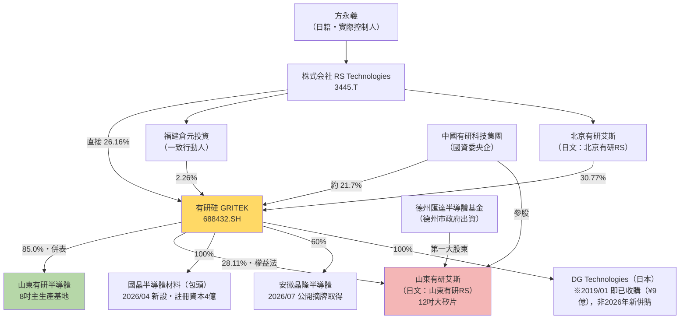
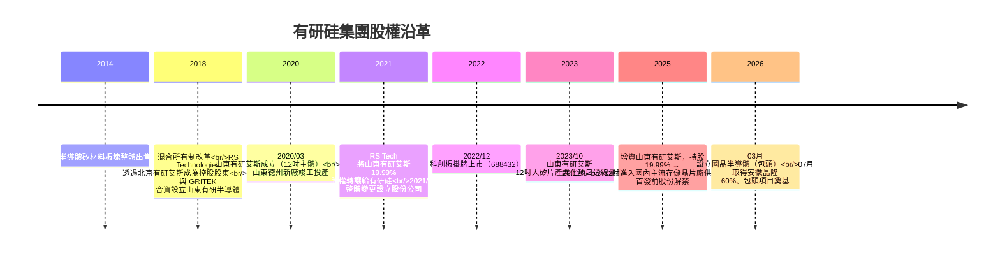

# 有研硅（688432.SH）vs 山東有研RS／山東有研艾斯 — 關係釐清與基本面分析

> **報告日期**：2026-07-25（本輪依基準檔 `hourAnalysisResult.md` 完成一致性校正）
> **分析標的**：有研半導體矽材料股份公司（GRITEK, 688432.SH）／山東有研半導體材料有限公司／山東有研艾斯半導體材料有限公司
> **主要資料來源**：有研硅 2025 年年度報告（cninfo, 2026-03-26）、2026 年一季報（2026-04）、2025 年半年報（2025-08-14）、2026-002 減持公告（2026-01-17）、2024-055 關聯交易公告（2024-12-13）、**RS Technologies FY2025 有価証券報告書「関係会社の状況」（2026-03-26）**、**RS FY2025 決算說明資料（2026-02-13）**、雪球／搜狐證券行情（2026-07-24）
> **免責聲明**：本文為公開資料整理，非投資建議。
>
> **⚠ 幣別與每股化基準（與基準檔 §4.3 一致）**：本文金額除特別註明外均為**人民幣（CNY）**；每股化除數 = 有研硅總股本 **12.503 億股**（125,030.19 萬股，來源：搜狐證券／雪球 2026-07-24，全流通）。跨幣別換算採 **CNY/JPY = 24.19（2026-07-24）**。

---

## 一、核心結論

你問的兩個名字，其實是「**母公司（上市主體）**」vs「**子公司／參股公司（工廠主體）**」的關係，而且中間還卡了一個「**日文譯名 vs 中文原名**」的陷阱。

### 1.1 關鍵陷阱一：「有研RS」＝「有研艾斯」

RS Technologies（3445.T，東證上市）在**日文法定揭露**中，把中國關係企業的「**艾斯**」二字直接寫成「**RS**」。

例如 RS Tech 2021 年決算說明資料原文列示為「**北京有研RS半導体科技有限公司**」，對應的中文工商登記名稱正是「**北京有研艾斯半導體科技有限公司**」。

| 你看到的寫法 | 實際中文登記名稱 |
|---|---|
| 山東有研 **RS** 半導体材料有限公司（日文） | 山東有研 **艾斯** 半導體材料有限公司 |
| 有研硅 | 有研半導體矽材料股份公司（GRITEK, 688432.SH） |

### 1.2 關鍵陷阱二：德州有「兩家」名字很像的公司

| 公司 | 產品 | 會計處理 |
|---|---|---|
| **山東有研半導體材料有限公司**（山東GRITEK） | 8 吋 | **控股子公司，併入合併報表** |
| **山東有研艾斯半導體材料有限公司**（山東有研艾斯） | 12 吋 | **參股公司，權益法，不併表** |

### 1.3 一句話總結

> **有研硅是台上的上市公司；山東有研半導體是它「養活自己」的 8 吋金雞母；山東有研艾斯（日文＝山東有研RS）是它「押未來」的 12 吋燒錢賭注，而且只認列 28.11% 的虧損，不併表。**

### 1.4 額外提醒：別跟這些搞混

- **有研新材（600206.SH）** — 有研新材料股份有限公司（2014 年已將半導體矽材料業務整體出售給有研集團）
- **有研粉材（688456.SH）** — 有研粉末新材料股份有限公司

---

## 二、三者定位對照表

| 項目 | 有研硅（688432.SH） | 山東有研半導體 | 山東有研艾斯（＝日文「山東有研RS」） |
|---|---|---|---|
| 性質 | **上市公司主體** | 控股子公司（**併入合併報表**） | 參股公司（**權益法，不併表**） |
| 全名 | 有研半導體矽材料股份公司（GRITEK） | 山東有研半導體材料有限公司 | 山東有研艾斯半導體材料有限公司 |
| 成立時間 | 2001/06（2021/06 整體變更為股份公司） | 2018/08（RS Tech 與 GRITEK 合資設立） | 2020/03/11 |
| 地點 | 北京（總部）＋北京順義、山東德州（生產基地） | 山東德州 | 山東德州天衢新區 |
| 主力產品 | 矽拋光片、刻蝕設備用矽材料、區熔單晶及矽片、半導體潔淨管閥件 | **8 吋**拋光片、大尺寸刻蝕設備用矽材料（主生產基地） | **12 吋**集成電路用大矽片（測試片／拋光片／外延片） |
| 註冊資本 | **12.50 億人民幣**（RS 有報：1,250 百万人民元；搜狐：125,030 萬元） | 20.03 億人民幣 | **27.41 億人民幣**（RS 有報：2,741 百万人民元；有研硅年報揭露 27.42 億，差異 0.04%，屬四捨五入） |
| 有研硅持股 | — | **85.0%**（✅ 已確認，來源：RS FY2025 有報「関係会社の状況」，餘 15% 為其他股東） | 19.99% → **2025 年初增資至 28.11%**（RS 有報記為 28.1%） |
| 其他主要股東 | RS Technologies 集團議決權 **57.1%**（含間接 30.9%）／**經濟持分 41.96%**；含一致行動人倉元投資合計控制 59.19% → **2026/02 減持後降至 56.19%**；中國有研集團約 21.7% | RS Tech 透過有研硅間接持有 85.0% | 德州匯達半導體股權投資基金（原 60.02%，德州市政府出資）、中國有研科技集團 |
| 損益狀況 | 上市公司帳面獲利 | **獲利**（貢獻主要利潤） | **虧損中**（產能爬坡期） |

---

## 三、股權結構圖



> **RS 對有研硅「經濟持分」的還原計算（與基準檔 §3.2 一致）**：
> ```
> 直接持分 = 議決權 57.1% − 間接 30.9% = 26.2%
> 間接持分 = 51.0%（RS 持北京有研艾斯）× 30.9%（北京有研艾斯持有研硅）= 15.76%
> 經濟持分（FY2025 末）= 26.2% + 15.76% = 41.96%
> 2026/02 出售 1,250 萬股（總股本 1.0%）後 → 經濟持分約 40.96%、議決權約 56.1%
> ```
> 因此三種常見數字**互不矛盾，僅口徑不同**：**57.1%／56.1% = 議決權（合併認列基礎）**；**41.96%／40.96% = 經濟持分（算 EPS 用）**；中國股權登記口徑的 **30.84%（直接）＋2.66%（一致行動人）** 為 2022 年舊資料。

### 3.1 沿革時間軸



---

## 四、FY2025 財務數據對照（含每股化）

> **每股化計算基準：有研硅總股本 12.503 億股**（125,030.19 萬股，2026-07-24 已全流通；✅ 本輪校正，舊版誤用 12.48 億股）

### 4.1 有研硅（合併報表，2025 年報，2026-03-26 發布）

| 項目 | 金額 | **每股換算** | YoY |
|---|---|---|---|
| 營業收入 | 10.05 億元 | **0.80 元/股** | +0.93% |
| 利潤總額 | 2.87 億元 | **0.23 元/股** | — |
| 歸母淨利 | 2.09 億元 | **0.17 元/股（EPS）** | −10.14% |
| 扣非歸母淨利 | 1.30 億元 | **0.10 元/股** | −20.55% |
| 經營活動現金流淨額 | 2.74 億元 | **0.22 元/股** | +19.54% |
| 研發投入 | 0.924 億元 | **0.074 元/股** | +18.05%（占營收 9.19%，2024 年為 7.86%） |
| 綜合毛利率 | 36.72% | — | +0.05 pp |
| 現金股利 | 每 10 股派 0.55 元（含稅） | **0.055 元/股** | — |

**營收結構（2025 年）**：半導體拋光片 6.16 億元（**0.49 元/股**，佔 61.30%）／刻蝕設備用矽材料 2.99 億元（**0.24 元/股**，佔 29.74%）／其他 0.66 億元（6.56%）／其他業務 0.24 億元（2.40%）。〔來源：搜狐證券「主營構成」〕

### 4.2 單季營收（2025 年，單位：萬元）

| Q1（1-3月） | Q2（4-6月） | Q3（7-9月） | Q4（10-12月） |
|---|---|---|---|
| 23,082.44 | 26,009.06 | 25,565.14 | 25,867.93 |

### 4.2b 2026 年一季報（✅ 本輪補齊，原列為資料缺口）

| 項目 | 2026 Q1 | **每股換算** | YoY |
|---|---|---|---|
| 營業總收入 | 3.139 億元（313,895,704.59 元） | **0.251 元/股** | **+18.04%** |
| 歸母淨利 | 5,017.89 萬元 | **0.040 元/股（EPS）** | **−1.24%** |
| 持續經營淨利（含少數股東） | 5,912.49 萬元 | 0.047 元/股 | −1.09% |
| 每股淨資產 | — | **3.61 元** | +2.38% |
| 總資產報酬率 | 1.11% | — | — |

> **判讀**：營收成長由 FY2025 的 +0.93% 大幅加速至 **+18.04%**（前期基數 2.659 億元），但「增收不增利」尚未解決（歸母淨利仍 −1.24%）。營收轉強是本輪最重要的正面變化。

### 4.2c 最新行情（2026-07-24，雪球）

| 項目 | 數值 | 項目 | 數值 |
|---|---|---|---|
| 收盤價 | **36.82 元（−9.87%）** | 總市值＝流通值 | **460.36 億元** |
| 日內高／低 | 40.98／36.80 | PE（動／TTM／靜） | **229.4／220.6／220.0 倍** |
| 52 週高／低 | **60.78／11.17 元** | PBR | **10.20 倍** |
| 每股收益（TTM） | 0.17 元 | 殖利率（TTM） | 0.15% |

近 10 日收盤（元）：49.10（07/13）→ 48.38（07/14）→ 41.46（07/15）→ 36.96（07/16）→ 38.88（07/17）→ 42.27（07/20）→ **46.51（07/21）**→ 43.31（07/22）→ 40.85（07/23）→ **36.82（07/24）**。〔來源：搜狐證券融資融券逐日收盤，07/21 數值與證券之星獨立來源一致〕

> ⚠ **估值警訊**：PE(TTM) 220.6 倍、PBR 10.20 倍，而 FY2025 歸母淨利年減 10.14%、Q1 仍小減 1.24%。此估值**無法用基本面解釋**，屬題材投機。換算日圓後總市值 = 460.36 億元 × 24.19 = **11,136 億日圓**，RS 的 40.96% 經濟持分名目價值 4,561 億日圓（詳見基準檔 §3.5 的雙向試算）。

### 4.3 兩家山東公司（年報「主要控股參股公司分析」揭露）

| 項目 | 山東有研半導體（子公司） | 山東有研艾斯（參股） |
|---|---|---|
| 註冊資本 | 20.03 億元 | 27.42 億元 |
| 總資產 | 36.28 億元（**每股 2.90 元**） | 27.26 億元（每股 2.18 元） |
| 淨資產 | 31.93 億元（**每股 2.55 元**） | 23.83 億元（按 28.11% 歸屬 ≈ 6.70 億 → **每股 0.54 元**） |
| 營業收入 | 9.34 億元（**每股 0.75 元**） | 2.08 億元 |
| 營業利潤 | 2.83 億元 | **−1.75 億元** |
| 淨利潤 | **2.51 億元（每股 0.20 元）** | **−1.75 億元**（按 28.11% ≈ −0.49 億 → **每股 −0.039 元**） |

> **註 1**：山東有研半導體 2025 年數據為含山東研晶石英科技的合併財務報表數據。
> **註 2**：山東有研艾斯每股歸屬數字為本文按持股比例的簡易估算；權益法實際認列須經投資時公允價值基礎調整與會計政策統一調整，會與此估算有差異。

### 4.4 這張表最重要的一件事 ⭐

**山東有研半導體單體淨利 2.51 億元（每股 0.20 元）＞ 有研硅整體歸母淨利 2.09 億元（每股 0.17 元）。**

也就是說：**上市公司帳上的利潤，其實 100% 以上來自 8 吋的山東有研半導體**，母公司本體 ＋ 12 吋的山東有研艾斯合計是拖累項。

這是理解這檔股票最關鍵的結構性事實。

---

## 五、核心利多（成長動能）

| # | 利多事件／計畫 | 對財務的潛在影響（※） |
|---|---|---|
| 1 | **12 吋產能階梯放量（✅ 本輪校正口徑）**：設計產能 10 萬片/月 → 有研硅 2025/10 投關記錄表稱「2025 年底提升至 15 萬片/月」；但 **RS FY2025 決算說明資料（2026/02/13）揭露現況為月產 11 萬枚**，官方路徑為 **11 萬（現況）→ 15 萬（2026）→ 25 萬枚/月（2028 年中）**，長期目標 30 萬片/月 | 兩來源不衝突：15 萬片為**設計／年底目標**，11 萬枚為 RS 認列的**實際運轉產能**（認證階段稼動率未滿）。第二階段落地等於再造一個公司規模；但**併表前僅透過持分法影響投資損益** |
| 2 | **12 吋已切入存儲大廠供應鏈**：公司 2025/10/13 互動易表示，山東有研艾斯已進入國內主流存儲晶片製造商供應鏈並實現供貨 | 從「試產」轉「認證通過」的里程碑，直接影響虧損收斂速度與有研硅投資損益 |
| 3 | **8 吋創新高**：2025 年 8 吋矽片產銷量創歷史新高；紅磷超低阻、區熔濾波、MCz 等產品銷量取得突破；區熔單晶產銷量大幅提高 | 支撐毛利率在成熟製程降價下仍微升 0.05 pp 至 36.72% |
| 4 | **技術降本與產品結構優化** | 抵消刻蝕材料業務毛利率下滑，是 2025 年毛利率守住的主因 |
| ~~5~~ | ~~DG Technologies 併購（2026/01 完成）~~ | **【2026-07-25校正】經查證此為誤植：DG Technologies 實為 RS Technologies 於 2019/01 即已100%收購之既有子公司（原始收購價¥9億），並非2026年新併購事實，本項移除。** |
| 6 | **國晶半導體材料（包頭）**：2026/03 公告設立全資子公司，註冊資本 4 億人民幣（≈ 90.84 億日圓）；2026/07/01 於包頭稀土高新區奠基 | RS Tech 揭露主要目的為**降低電費等基礎設施成本**；規劃約 5 萬平方公尺單晶廠房，達產後年產 1,000 噸以上集成電路用大尺寸單晶 |
| 7 | **安徽晶隆半導體 60%**（2026/07/06–07 公告，透過公開摘牌取得）：對價 **4.507 億元**（≈ 109.0 億日圓，RS 每股 410 円）；保證金 1.35 億元＋餘款 3.15 億元已付清，交割後納入合併報表 | 切入外延片（epitaxial wafer），與 prime wafer 業務綜效。**⚠ 4.507 億元 ≈ 有研硅 FY2025 歸母淨利（2.09 億元）的 2.2 倍**，屬大額支出，商譽與整合風險需追蹤 |
| 8 | **AI 驅動高端矽片需求**：2026 年 7 月半導體矽片概念股大漲，信越化學、SUMCO、環球晶等國際大廠漲價預期為催化 | 產業景氣轉折的外部順風 |
| 9 | **綠電降本**：山東有研半導體光伏發電二期（2.07MW）2025/06 併網；一期＋二期全年發電 563.93 萬度，占總用電量 4.38%，減排 CO₂ 3,491.29 噸 | 小幅降低製造成本，並具 ESG 揭露價值 |

---

## 六、核心風險（潛在隱憂）

| # | 風險起因與對象 | 具體損害程度 |
|---|---|---|
| 1 | **12 吋長期失血，且持股上升＝虧損認列放大** | 2025 年初持股 19.99% → 28.11%，直接導致當年投資虧損比上年**多認列 1,685.25 萬元**，是歸母淨利 −10.14% 的主因。持股越多、爬坡越久，EPS 稀釋越重 |
| 2 | **12 吋控制權不在自己手上** | 山東有研艾斯第一大股東為德州匯達基金（原持股 60.02%，德州市政府出資），有研硅僅 28.11%。IPO 問詢回覆曾提及未來取得控制權的安排，但**目前仍未併表**，屬治理與整合的重大不確定性 |
| 3 | **成熟製程價格戰** | 2025 年扣非淨利 −20.55%；公司自述傳統成熟製程市場價格承壓、費用端增長，**主業盈利階段性承壓**。營收僅 +0.93% ≈ 零成長 |
| 4 | **外資控股 + 央企參股的特殊結構** | 控股股東為日本 RS Technologies（含一致行動人合計控制 59.19%），實控人方永義為日籍。在中國半導體「自主可控」政策框架下，屬結構性政策風險 |
| 5 | **控股股東合規紀錄** | RS Technologies 曾因有價證券報告虛假記載被日本金融廳處以 600 萬日圓罰款（公司回應稱在日本法下不至構成重大違法） |
| 6 | **大股東減持已實際執行完畢（✅ 本輪由「計畫」更新為「已完成」）** | 2026/01/17 公告減持計畫（控股股東及一致行動人合計持有 740,055,400 股 = 59.19%，反推總股本 12.503 億股，與 §4 每股化基準一致；首發前股份 2025/11/10 起解禁）→ **2026/02/11–14 執行完畢**：RS Technologies 出脫 **1,250 萬股（1.0%）套現約 34 億日圓**（RS 官方現金流規劃揭露）、福建倉元投資出脫 2%；大宗交易成交價僅 **12.83–13.08 元**。合計控制比 59.19% → **56.19%**。**⚠ 控股股東在 13 元附近出貨，而 2026/07/24 市價為 36.82 元（＝成交價的 2.8 倍），為最強的內部人估值訊號** |
| 7 | **政府補助依賴** | IPO 報告期政府補助分別為 854.17 萬、990.43 萬、3,768.52 萬、4,359.99 萬元，占當期利潤總額比例達 5.77%、7.90%、33.10%、180%+（遷址德州後顯著提升）。**獲利品質需打折看待** |
| 8 | **股份支付費用大增** | 2025 年確認股份支付費用 1,898.90 萬元（上年 635.52 萬元），增加 1,263.38 萬元，為歸母淨利下滑的第二大原因 |
| 9 | **重大資產重組終止** | 2025 年曾簽署《股權收購意向協議》，後因部分商業條款未達成一致而**終止**（公告 2025-018／022／023）。反映外延擴張執行風險 |
| 10 | **估值極端波動** | 2026 年 5–7 月股價在半導體矽片題材下多次 20cm 漲停（7/1 漲 14.59%、7/7 觸及 20cm 漲停），公司並發布股票交易異常波動公告。短期評價已明顯脫離基本面 |
| 11 | **出口與地緣政治** | 公司自述出口市場受地緣政治影響持續低迷；產品銷往美國、日本、韓國、中國台灣等地 |

---

## 七、搜尋過程與資料缺口（強制揭露）

### 7.1 ✅ 成功找到的資料

| 文件 | 日期 | 來源 |
|---|---|---|
| **2026 年第一季度報告（最新季報）** | 2026-04 | 新浪財經公告原文（stockid=688432, id=12252734）＋騰訊新聞 |
| **2025 年年度報告（最新年報，222 頁）** | 2026-03-26 | 巨潮資訊網 cninfo |
| **RS Technologies FY2025 有価証券報告書（第 16 期，118 頁）** | 2026-03-26 | EDINET（本地 `3445_AnnualReport_2025.md`）→ 提供「関係会社の状況」持股比例一次資料 |
| **RS Technologies FY2025 決算說明資料（60 頁）** | 2026-02-13 | TDnet／Yahoo 開示 → 提供 SGRS 實際產能、中國 8 吋／12 吋市占目標 |
| 安徽晶隆 60% 股權收購完成公告（對價 4.507 億元） | 2026-07-06／07 | 上交所公告／股票通、同花順 |
| 2025 年年度報告摘要 | 2026-03-26 | cninfo |
| 2025 年半年度報告（169 頁） | 2025-08-14 | cninfo |
| 2026-002 控股股東及一致行動人減持股份計劃公告 | 2026-01-17 | 證券日報信披平台 |
| 2024-055 與關聯方共同向參股公司增資暨關聯交易公告 | 2024-12-13 | 東方財富 PDF |
| IPO 審核中心意見落實函回覆報告 | 2022-06-21 | 新浪財經 |
| RS Technologies（3445.T）2021 年 12 月期決算說明會資料 | 2022-02-24 | JPX / rs-tec.jp |
| RS Technologies TDnet 揭露：設立國晶半導體材料（包頭） | 2026-03-19 | 東京證券交易所 TDnet |
| RS Technologies 取得安徽晶隆 60% M&A 揭露 | 2026-07 | 日本 M&A センター |

### 7.2 ⚠️ 資料缺口與可能原因

**✅ 本輪（2026-07-25）已補齊的舊缺口**

| 原缺口項目 | 補齊結果 | 來源 |
|---|---|---|
| 有研硅持有山東有研半導體的精確持股比例 | **85.0%**（餘 15% 為其他股東） | RS FY2025 有価証券報告書「関係会社の状況」 |
| 最新股價、PE、市淨率、總市值 | **36.82 元／PE(TTM) 220.64／PBR 10.20／市值 460.36 億元**（2026-07-24）；並取得近 10 日逐日收盤 | 雪球＋搜狐證券（兩來源在 07/21 = 46.51 元互相驗證） |
| 2026 Q1 季報明細 | **營收 3.139 億元（+18.04%）、歸母淨利 5,017.89 萬元（−1.24%）、每股淨資產 3.61 元** | 新浪公告原文＋騰訊新聞 |
| 總股本（每股化除數） | **12.503 億股**（可由「740,055,400 股 = 59.19%」反推驗證） | 搜狐證券／雪球／2026-002 公告 |
| GitHub 財報庫 `a9303001/FinancialReport` | **已可存取**；`3445RS/` 內含 RS 年報 ×2、季報 ×1、輿情 ×6 與本檔，均已交叉驗證。**repo 內目前無獨立的 `[688432]有研硅` 資料夾**（有研硅資料集中於本檔） | 本地檔案系統 |
| 社群輿情（雪球） | 取得 2026-07-24 當日雪球逐字貼文樣本（「今天跌十個點過分了吧」「尾盤放量下跌」「最後一跌，準備拉伸了吧」「這是龍頭股，反彈就是 20cm，大家蹲下來先」）→ **判讀：純題材／技術面投機情緒，零基本面討論** | 雪球 SH688432 討論區 |

**⚠ 仍存在的缺口**

| 缺口項目 | 可能原因與下一步 |
|---|---|
| **5 年 ROE 中位數、5 年殖利率中位數、5 年／10 年淨利 CAGR、負債比率、OPM（自定義）** | 公司 2022/12 才上市，公開可查完整年度序列僅 2019 年起（IPO 報告期）；**10 年 CAGR 資料本質性不足**。下一輪以 IPO 招股書報告期（2019–2021）＋2022–2025 年報拼接 7 年序列，先算 5 年區間 |
| **山東有研艾斯（SGRS）2026 上半年虧損收斂進度** | SGRS 非上市，僅在有研硅半年報「主要參股公司分析」揭露。**有研硅 2026 半年報預計 2026/08 下旬發布**，屆時補 |
| **有研硅帳上現金／有息負債明細** | 用於拆解 RS 合併「淨現金 733 億日圓」中屬少數股東的比例（基準檔 §3.5 保留條件）。下一輪抓 cninfo 年報資產負債表 |
| **中國 8 吋拋光片分廠市占的第三方驗證** | RS 稱有研硅中國內 8 吋市占 18%（「RST 調べ」自家調查），中國無公開分廠 8 吋市占統計。可由「25 萬片/月 ÷ 18% ⇒ 中國 8 吋總量約 139 萬片/月」反推後找第三方總量資料驗證 |
| **東方財富股吧、淘股吧系統性輿情樣本** | 本輪僅取得雪球樣本。下一輪擴大平台覆蓋 |

---

## 八、投資邏輯總結

買 688432 等於買到：

> **100% 的 8 吋現金流 ＋ 28.11% 的 12 吋期權**

- **8 吋（山東有研半導體）**：已成熟、單體淨利 2.51 億元（每股 0.20 元），是目前**唯一**的利潤來源，但面臨成熟製程降價壓力
- **12 吋（山東有研艾斯／日文山東有研RS）**：2025 年淨虧 1.75 億元，產能 15 萬片/月爬坡中，已切入存儲大廠供應鏈。**目前是負貢獻（每股約 −0.039 元）**

**⚠ 12 吋的競爭現實（本輪新增）**：SGRS 以 10 萬片/月產能，在中國 7 家成規模 12 吋廠中**排名最後**（中國內產能占比僅 **3.4%**）：

| 廠商 | 現有產能（萬片/月） | 中國內占比 |
|---|---|---|
| 西安奕材 | 71 | 24.15% |
| 中環領先 | 70 | 23.81% |
| 上海新昇（滬硅產業） | 65 | 22.11% |
| 立昂微 | 30 | 10.20% |
| 上海超硅 | 28 | 9.52% |
| 中欣晶圓 | 20 | 6.80% |
| **山東有研艾斯（SGRS）** | **10** | **3.40%** |

〔來源：觀研報告網彙整各公司年報／招股書，2025-08-13〕。同時全球前五大（信越化學、SUMCO、環球晶圓、Siltronic、SK Siltron）2024 年 12 吋月均出貨 684 萬片、佔全球 **79.08%**。RS 官方目標為 2028 年 25 萬片/月、中國 12 吋市占 **7%**——意即**必須在同業也在擴產的情況下把份額翻倍**，執行難度高。

**三大變數**：
1. 12 吋能否轉正（虧損收斂速度）——目前 RS 認列的持分法投資損失仍在擴大（FY2024 6.85 億→FY2025 10.82 億日圓→2026 Q1 2.70 億，前年同期 2.10 億）
2. 有研硅能否取得山東有研艾斯控制權並併表
3. RS Technologies 解禁後的減持節奏——**首輪已於 2026/02 執行完畢（13 元附近出貨）**，需觀察是否有第二輪

---

*本文僅為公開資料整理，非投資建議。所有數據請以公司正式公告與年報原文為準。*