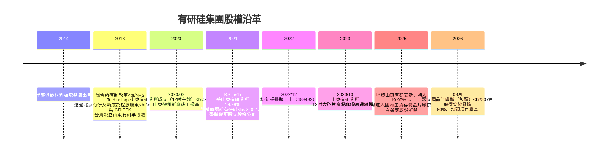

# 有研硅（688432.SH）vs 山東有研RS／山東有研艾斯 — 關係釐清與基本面分析

> **報告日期**：2026-07-25
> **分析標的**：有研半導體矽材料股份公司（GRITEK, 688432.SH）／山東有研半導體材料有限公司／山東有研艾斯半導體材料有限公司
> **主要資料來源**：有研硅 2025 年年度報告（cninfo, 2026-03-26）、2025 年半年報（2025-08-14）、2026-002 減持公告（2026-01-17）、2024-055 關聯交易公告（2024-12-13）、RS Technologies（3445.T）日文決算說明資料與 TDnet 揭露
> **免責聲明**：本文為公開資料整理，非投資建議。

---

## 一、核心結論

你問的兩個名字，其實是「**母公司（上市主體）**」vs「**子公司／參股公司（工廠主體）**」的關係，而且中間還卡了一個「**日文譯名 vs 中文原名**」的陷阱。

### 1.1 關鍵陷阱一：「有研RS」＝「有研艾斯」

RS Technologies（3445.T，東證上市）在**日文法定揭露**中，把中國關係企業的「**艾斯**」二字直接寫成「**RS**」。

例如 RS Tech 2021 年決算說明資料原文列示為「**北京有研RS半導体科技有限公司**」，對應的中文工商登記名稱正是「**北京有研艾斯半導體科技有限公司**」。

| 你看到的寫法 | 實際中文登記名稱 |
|---|---|
| 山東有研 **RS** 半導体材料有限公司（日文） | 山東有研 **艾斯** 半導體材料有限公司 |
| 有研硅 | 有研半導體矽材料股份公司（GRITEK, 688432.SH） |

### 1.2 關鍵陷阱二：德州有「兩家」名字很像的公司

| 公司 | 產品 | 會計處理 |
|---|---|---|
| **山東有研半導體材料有限公司**（山東GRITEK） | 8 吋 | **控股子公司，併入合併報表** |
| **山東有研艾斯半導體材料有限公司**（山東有研艾斯） | 12 吋 | **參股公司，權益法，不併表** |

### 1.3 一句話總結

> **有研硅是台上的上市公司；山東有研半導體是它「養活自己」的 8 吋金雞母；山東有研艾斯（日文＝山東有研RS）是它「押未來」的 12 吋燒錢賭注，而且只認列 28.11% 的虧損，不併表。**

### 1.4 額外提醒：別跟這些搞混

- **有研新材（600206.SH）** — 有研新材料股份有限公司（2014 年已將半導體矽材料業務整體出售給有研集團）
- **有研粉材（688456.SH）** — 有研粉末新材料股份有限公司

---

## 二、三者定位對照表

| 項目 | 有研硅（688432.SH） | 山東有研半導體 | 山東有研艾斯（＝日文「山東有研RS」） |
|---|---|---|---|
| 性質 | **上市公司主體** | 控股子公司（**併入合併報表**） | 參股公司（**權益法，不併表**） |
| 全名 | 有研半導體矽材料股份公司（GRITEK） | 山東有研半導體材料有限公司 | 山東有研艾斯半導體材料有限公司 |
| 成立時間 | 2001/06（2021/06 整體變更為股份公司） | 2018/08（RS Tech 與 GRITEK 合資設立） | 2020/03/11 |
| 地點 | 北京（總部）＋北京順義、山東德州（生產基地） | 山東德州 | 山東德州天衢新區 |
| 主力產品 | 矽拋光片、刻蝕設備用矽材料、區熔單晶及矽片、半導體潔淨管閥件 | **8 吋**拋光片、大尺寸刻蝕設備用矽材料（主生產基地） | **12 吋**集成電路用大矽片（測試片／拋光片／外延片） |
| 註冊資本 | 約 12.47 億人民幣 | 20.03 億人民幣 | 27.42 億人民幣 |
| 有研硅持股 | — | 控股（>50%，精確比例見「資料缺口」） | 19.99% → **2025 年初增資至 28.11%** |
| 其他主要股東 | RS Technologies 合計控制 59.19%；中國有研集團約 21.7% | RS Tech 亦有間接持份 | 德州匯達半導體股權投資基金（原 60.02%，德州市政府出資）、中國有研科技集團 |
| 損益狀況 | 上市公司帳面獲利 | **獲利**（貢獻主要利潤） | **虧損中**（產能爬坡期） |

---

## 三、股權結構圖

### 3.1 沿革時間軸

---

## 四、FY2025 財務數據對照（含每股化）

> **每股化計算基準：有研硅總股本 12.48 億股**（流通 A 股約 5.08 億股）

### 4.1 有研硅（合併報表，2025 年報，2026-03-26 發布）

| 項目 | 金額 | **每股換算** | YoY |
|---|---|---|---|
| 營業收入 | 10.05 億元 | **0.81 元/股** | +0.93% |
| 利潤總額 | 2.87 億元 | **0.23 元/股** | — |
| 歸母淨利 | 2.09 億元 | **0.17 元/股（EPS）** | −10.14% |
| 扣非歸母淨利 | 1.30 億元 | **0.10 元/股** | −20.55% |
| 經營活動現金流淨額 | 2.74 億元 | **0.22 元/股** | +19.54% |
| 研發投入 | 0.924 億元 | **0.074 元/股** | +18.05%（占營收 9.19%，2024 年為 7.86%） |
| 綜合毛利率 | 36.72% | — | +0.05 pp |
| 現金股利 | 每 10 股派 0.55 元（含稅） | **0.055 元/股** | — |

### 4.2 單季營收（2025 年，單位：萬元）

| Q1（1-3月） | Q2（4-6月） | Q3（7-9月） | Q4（10-12月） |
|---|---|---|---|
| 23,082.44 | 26,009.06 | 25,565.14 | 25,867.93 |

### 4.3 兩家山東公司（年報「主要控股參股公司分析」揭露）

| 項目 | 山東有研半導體（子公司） | 山東有研艾斯（參股） |
|---|---|---|
| 註冊資本 | 20.03 億元 | 27.42 億元 |
| 總資產 | 36.28 億元（**每股 2.91 元**） | 27.26 億元（每股 2.18 元） |
| 淨資產 | 31.93 億元（**每股 2.56 元**） | 23.83 億元（按 28.11% 歸屬 ≈ 6.70 億 → **每股 0.54 元**） |
| 營業收入 | 9.34 億元（**每股 0.75 元**） | 2.08 億元 |
| 營業利潤 | 2.83 億元 | **−1.75 億元** |
| 淨利潤 | **2.51 億元（每股 0.20 元）** | **−1.75 億元**（按 28.11% ≈ −0.49 億 → **每股 −0.039 元**） |

> **註 1**：山東有研半導體 2025 年數據為含山東研晶石英科技的合併財務報表數據。
> **註 2**：山東有研艾斯每股歸屬數字為本文按持股比例的簡易估算；權益法實際認列須經投資時公允價值基礎調整與會計政策統一調整，會與此估算有差異。

### 4.4 這張表最重要的一件事 ⭐

**山東有研半導體單體淨利 2.51 億元（每股 0.20 元）＞ 有研硅整體歸母淨利 2.09 億元（每股 0.17 元）。**

也就是說：**上市公司帳上的利潤，其實 100% 以上來自 8 吋的山東有研半導體**，母公司本體 ＋ 12 吋的山東有研艾斯合計是拖累項。

這是理解這檔股票最關鍵的結構性事實。

---

## 五、核心利多（成長動能）

| # | 利多事件／計畫 | 對財務的潛在影響（※） |
|---|---|---|
| 1 | **12 吋產能實質放量**：截至 2025 年底，山東有研艾斯 12 吋矽片產能已達 **15 萬片/月**，長期目標 30 萬片/月，技術水平規劃達 28–7nm | 第二階段（240 萬片/年）若落地，等於再造一個公司規模；但併表前僅影響投資損益 |
| 2 | **12 吋已切入存儲大廠供應鏈**：公司 2025/10/13 互動易表示，山東有研艾斯已進入國內主流存儲晶片製造商供應鏈並實現供貨 | 從「試產」轉「認證通過」的里程碑，直接影響虧損收斂速度與有研硅投資損益 |
| 3 | **8 吋創新高**：2025 年 8 吋矽片產銷量創歷史新高；紅磷超低阻、區熔濾波、MCz 等產品銷量取得突破；區熔單晶產銷量大幅提高 | 支撐毛利率在成熟製程降價下仍微升 0.05 pp 至 36.72% |
| 4 | **技術降本與產品結構優化** | 抵消刻蝕材料業務毛利率下滑，是 2025 年毛利率守住的主因 |
| ~~5~~ | ~~DG Technologies 併購（2026/01 完成）~~ | **【2026-07-25校正】經查證此為誤植：DG Technologies 實為 RS Technologies 於 2019/01 即已100%收購之既有子公司（原始收購價¥9億），並非2026年新併購事實，本項移除。** |
| 6 | **國晶半導體材料（包頭）**：2026/03 公告設立全資子公司，註冊資本 4 億人民幣（≈ 90.84 億日圓）；2026/07/01 於包頭稀土高新區奠基 | RS Tech 揭露主要目的為**降低電費等基礎設施成本**；規劃約 5 萬平方公尺單晶廠房，達產後年產 1,000 噸以上集成電路用大尺寸單晶 |
| 7 | **安徽晶隆半導體 60%**（2026/07 透過 GRITEK 公開摘牌取得） | 切入外延片（epitaxial wafer），與 prime wafer 業務綜效 |
| 8 | **AI 驅動高端矽片需求**：2026 年 7 月半導體矽片概念股大漲，信越化學、SUMCO、環球晶等國際大廠漲價預期為催化 | 產業景氣轉折的外部順風 |
| 9 | **綠電降本**：山東有研半導體光伏發電二期（2.07MW）2025/06 併網；一期＋二期全年發電 563.93 萬度，占總用電量 4.38%，減排 CO₂ 3,491.29 噸 | 小幅降低製造成本，並具 ESG 揭露價值 |

---

## 六、核心風險（潛在隱憂）

| # | 風險起因與對象 | 具體損害程度 |
|---|---|---|
| 1 | **12 吋長期失血，且持股上升＝虧損認列放大** | 2025 年初持股 19.99% → 28.11%，直接導致當年投資虧損比上年**多認列 1,685.25 萬元**，是歸母淨利 −10.14% 的主因。持股越多、爬坡越久，EPS 稀釋越重 |
| 2 | **12 吋控制權不在自己手上** | 山東有研艾斯第一大股東為德州匯達基金（原持股 60.02%，德州市政府出資），有研硅僅 28.11%。IPO 問詢回覆曾提及未來取得控制權的安排，但**目前仍未併表**，屬治理與整合的重大不確定性 |
| 3 | **成熟製程價格戰** | 2025 年扣非淨利 −20.55%；公司自述傳統成熟製程市場價格承壓、費用端增長，**主業盈利階段性承壓**。營收僅 +0.93% ≈ 零成長 |
| 4 | **外資控股 + 央企參股的特殊結構** | 控股股東為日本 RS Technologies（含一致行動人合計控制 59.19%），實控人方永義為日籍。在中國半導體「自主可控」政策框架下，屬結構性政策風險 |
| 5 | **控股股東合規紀錄** | RS Technologies 曾因有價證券報告虛假記載被日本金融廳處以 600 萬日圓罰款（公司回應稱在日本法下不至構成重大違法） |
| 6 | **大股東減持壓力** | 2026/01/17 公告：控股股東及一致行動人合計持有 740,055,400 股（59.19%），首發前股份**已於 2025/11/10 起解禁**，並已披露減持計畫。屬實質籌碼面利空 |
| 7 | **政府補助依賴** | IPO 報告期政府補助分別為 854.17 萬、990.43 萬、3,768.52 萬、4,359.99 萬元，占當期利潤總額比例達 5.77%、7.90%、33.10%、180%+（遷址德州後顯著提升）。**獲利品質需打折看待** |
| 8 | **股份支付費用大增** | 2025 年確認股份支付費用 1,898.90 萬元（上年 635.52 萬元），增加 1,263.38 萬元，為歸母淨利下滑的第二大原因 |
| 9 | **重大資產重組終止** | 2025 年曾簽署《股權收購意向協議》，後因部分商業條款未達成一致而**終止**（公告 2025-018／022／023）。反映外延擴張執行風險 |
| 10 | **估值極端波動** | 2026 年 5–7 月股價在半導體矽片題材下多次 20cm 漲停（7/1 漲 14.59%、7/7 觸及 20cm 漲停），公司並發布股票交易異常波動公告。短期評價已明顯脫離基本面 |
| 11 | **出口與地緣政治** | 公司自述出口市場受地緣政治影響持續低迷；產品銷往美國、日本、韓國、中國台灣等地 |

---

## 七、搜尋過程與資料缺口（強制揭露）

### 7.1 ✅ 成功找到的資料

| 文件 | 日期 | 來源 |
|---|---|---|
| **2025 年年度報告（最新，222 頁）** | 2026-03-26 | 巨潮資訊網 cninfo |
| 2025 年年度報告摘要 | 2026-03-26 | cninfo |
| 2025 年半年度報告（169 頁） | 2025-08-14 | cninfo |
| 2026-002 控股股東及一致行動人減持股份計劃公告 | 2026-01-17 | 證券日報信披平台 |
| 2024-055 與關聯方共同向參股公司增資暨關聯交易公告 | 2024-12-13 | 東方財富 PDF |
| IPO 審核中心意見落實函回覆報告 | 2022-06-21 | 新浪財經 |
| RS Technologies（3445.T）2021 年 12 月期決算說明會資料 | 2022-02-24 | JPX / rs-tec.jp |
| RS Technologies TDnet 揭露：設立國晶半導體材料（包頭） | 2026-03-19 | 東京證券交易所 TDnet |
| RS Technologies 取得安徽晶隆 60% M&A 揭露 | 2026-07 | 日本 M&A センター |

### 7.2 ⚠️ 資料缺口與可能原因

| 缺口項目 | 可能原因與建議 |
|---|---|
| **有研硅持有山東有研半導體的精確持股比例** | 該數字揭露在年報「合併範圍」附註（PDF 第 100+ 頁），搜尋引擎未索引該段落。目前僅能確認年報明確稱其為「**控股子公司**」且納入合併報表（即 >50%）。**建議直接下載 cninfo 年報 PDF 全文搜尋「山東有研半導體」附註段落** |
| **最新股價、PE、市淨率、總市值** | 檢索到互相矛盾的第三方數據：巨丰財經（2026-05-15）顯示總市值 130.75 億、PE 57.96（隱含股價約 10.5 元）；雪球頁面標題顯示 46.14 元。2026 年 7 月半導體矽片概念連續漲停，**第三方平台快照時間點不一致，無法確認即時價位**，故本文不引用具體 PE／股價 |
| **2026 Q1 季報明細** | 已發布（股東數據更新至 2026-03-31），但搜尋未取得完整財務明細 |
| **5 年 ROE 中位數、5 年殖利率中位數、5 年／10 年淨利 CAGR、負債比率、OPM（自定義）** | 公司 2022/12 才上市，公開可查的完整年度財務序列僅 2019 年起（IPO 報告期）；**10 年 CAGR 資料不足**。5 年區間需逐年報表拆解，本次未執行完整計算 |
| **GitHub 財報庫 `a9303001/FinancialReport`** | 本次工作環境無 GitHub 連接器／clone 權限，未能存取。**建議確認 repo 是否存在 `[688432]有研硅` 資料夾**，內含年報／季報／輿情彙整可補強本分析 |
| **社群輿情（雪球、東方財富股吧、PTT 等）** | 僅取得零星片段（雪球用戶抱怨波動、與紫金礦業比較的情緒性發言），**未取得系統性輿情樣本**，不足以做多空觀點統計 |

---

## 八、投資邏輯總結

買 688432 等於買到：

> **100% 的 8 吋現金流 ＋ 28.11% 的 12 吋期權**

- **8 吋（山東有研半導體）**：已成熟、單體淨利 2.51 億元（每股 0.20 元），是目前**唯一**的利潤來源，但面臨成熟製程降價壓力
- **12 吋（山東有研艾斯／日文山東有研RS）**：2025 年淨虧 1.75 億元，產能 15 萬片/月爬坡中，已切入存儲大廠供應鏈。**目前是負貢獻（每股約 −0.039 元）**

**三大變數**：
1. 12 吋能否轉正（虧損收斂速度）
2. 有研硅能否取得山東有研艾斯控制權並併表
3. RS Technologies 解禁後的減持節奏

---

*本文僅為公開資料整理，非投資建議。所有數據請以公司正式公告與年報原文為準。*