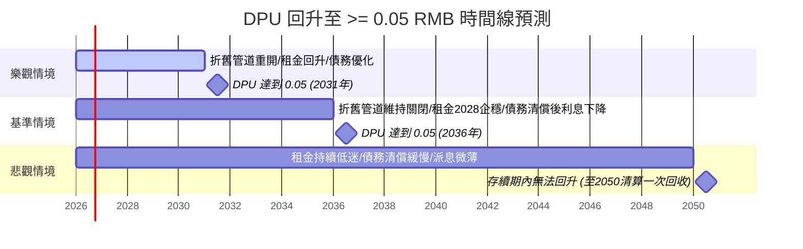

# 87001 匯賢產業信託（Hui Xian REIT） — 深度基本面與到期清算分析報告

> **更新紀錄與時間戳記：**
> - **本次更新時間**：2026-07-14 16:41（延續 2026-07-14 16:11 版本，同日滾動更新；本輪距上輪僅約 30 分鐘，屬短間隔確認輪）
> - **前一輪分析基準**：2026-07-14（16:11 版本）
> - **檔案復原說明**：上一輪檔案於行動裝置同步流程中被誤刪（"Last Sync: 2026-07-14 16:11 (Mobile)" commit 移除全檔 208 行），本輪已依 Git 歷史（commit 96e85f8）完整復原內容，並在此基礎上滾動更新。
> - **本輪更新重點（本輪仍為「無重大變化」確認輪，另新增一項primary source交叉驗證）**：
>   1. **股價與估值持平**：多平台（HKEX 官方報價頁、moomoo、Investing.com、Reuters）交叉查證，最新股價維持 **RMB 0.38–0.385** 區間（Bid 0.380 / Ask 0.385），與前輪數據一致，無變化。
>   2. **仍無 2026 年中期業績公告（本輪直接查證 huixianreit.com 官方公告列表）**：官方網站最新公告仍為 **2026/7/2 截至 6/30 之月報表**，最近一筆重大公告為 2026/4/27 貸款償還公告，中期業績尚未發布，符合「約 8 月上旬公布」的歷史慣例預期（2025 年中期業績於 2025/8/28 公布），資料缺口延續、非資料庫延遲所致。
>   3. **新增：北京東方廣場 2049/4/21 到期日獲 2025 年報四項資產逐一交叉確認**：本輪直接查閱本地 `20260423_2025年年報.md` 原文，確認商場、寫字樓、服務式公寓、酒店四項物業估值表中均**個別列明**「…土地使用權作綜合用途，到期日為2049年4月21日」，與 Q1 結論完全吻合，屬 primary source 直接驗證（非僅依賴歷史推論）。
>   4. **釐清一項可能造成混淆的舊資料**：本輪搜尋發現一份 2021 年舊文件提及東方廣場某 9,370 平方米地塊「最後屆滿年期為2026年7月」——經查證此為**個別租戶的租約屆滿日**（tenant lease expiry），與東方廣場整體**土地使用權**到期日（2049/4/21）為兩件不同事，經核對 2025 年報「租約屆滿日的分析」表格性質後確認為正常年度租約週轉，**不影響 Q1 核心結論**，特此註記以避免後續誤讀。
>   5. **匯率背景不變**：即期 USD/CNY 維持約 **6.78**，與前輪一致，人民幣兌美元續呈溫和升值格局。
>   6. **本輪社群輿情與新聞掃描均無新增**：雪球（xueqiu.com/S/87001）近期公告串與熱門討論頁均無新日期之新增內容，反映此檔仍屬低關注度、低流動性標的，與前輪一致。
>   7. **GitHub 本地資料夾核對**：資料夾內檔案（年報x3、中期報告x1、輿情節錄x4）檔案時間戳記仍為 2026/7/10，本輪未發現新增或修改，核心基本面數據維持前輪結論。

---

## 📊 最新結論摘要（截至 2026 年 7 月 14 日 16:41）

匯賢產業信託（87001）目前處於極端的**「雙重定價」**狀態，本輪為確認性更新，核心結論不變：
1. **清算價值角度**：北京東方廣場於 2049 年合營期滿清算時，預計每基金單位可回收金額約 **RMB 0.95 至 1.36 元**，相比目前 RMB 0.38–0.385 的股價存在 **140% 以上的超額清算溢價**。
2. **營運與分派角度**：受制於外商投資法折舊匯出限制、10% 法定公積金提留及北京商辦租金下行，短期 DPU 回升極度緩慢。**基準情境下，2035–2037 年前 DPU 難以回升至 0.05 元人民幣**，極大壓制了短期市場定價。
3. **短期雜訊延續**：2026 年 4 月 27 日 HK$8 億元貸款提前償還導致的匯兌會計虧損，預計使 **2026H1 期中派息大概率趨近於零**；此為一次性事件，不代表營運基本面轉差，長期反而降低利息負擔（詳見 Q2）。目前尚未有中期業績公告可驗證此推算，維持監測狀態。

### 📌 關鍵財務與估值數據表

| 指標 | 數值（RMB） | 每基金單位金額（RMB/單位） | 數據來源 / 計算基準 |
| :--- | :---: | :---: | :--- |
| **最新股價** | - | **約 0.38–0.385 元** | HKEX / moomoo / Investing.com / Reuters（2026年7月上旬區間，無明顯趨勢變化） |
| **已發行基金單位** | - | **6,523,199,235** | HKEX 月報表（截至2026年6月30日確認無變動，無稀釋風險） |
| **最新總市值** | 約 24.8–25.1 億元 | 0.38–0.385 元 | 計算值 (股價 × 單位數) |
| **每基金單位資產淨值 (NAV)** | 207.03 億元 | **3.1737 元** | 2025 年年報 |
| **股價淨值比 (P/NAV)** | - | **約 0.120–0.121** (折讓約 88%) | 計算值 (股價 / 3.1737) |
| **最新 EPS (TTM)** | -7.29 億元 | **-0.1121 元** (虧損) | 2025 年年報 |
| **本益比 (P/E)** | 不適用 | 不適用 | 虧損不計（HKEX 顯示約 -3.4x） |
| **預估 EPS (2026)** | - | **-0.08 至 -0.12 元** | 基於續租租金下調 10% 與公允價值減值預估 |
| **每基金單位分派 (DPU 2025 全年)** | 2,800 萬元 | **0.0043 元**（中期 0.0016 + 末期 0.0027） | 2025 年年報／etnet 派息記錄 |
| **2026H1 期中派息預估** | 極低或 0 | **≈ 0 – 0.001 元**（一次性匯兌虧損拖累，待H1業績驗證） | 依 2026/4/27 貸款償還公告推算 |
| **最新股息殖利率 (Yield，TTM)** | - | **約 1.11–1.13%** | 計算值 (0.0043 / 股價) |
| **物業收入淨額 (NPI)** | 11.46 億元 | **0.1757 元** | 2025 年年報 |
| **租金報酬率 (Cap Rate)** | - | **3.92%** | NPI / 2025 物業估值 (292.52 億元) |
| **空置率 (北京寫字樓)** | - | **18.2%** (佔用率 81.8%) | 2025 年年報 |
| **空置率 (北京商場)** | - | **8.9%** (佔用率 91.1%) | 2025 年年報 |
| **負債比率 (負債 / 總資產，2025年底)** | 36.37% | - | 計算值 (總負債 118.86 億 / 總資產 326.83 億) |
| **總負債（2026/4/27還款後估算）** | **約 43.4 億元** | - | 50.38億元（2025年報） − HK$8億元（≈RMB 6.9億元） |
| **OPM (自定義公式)** | **73.24%** 或 **-116.62%** | - | (營業利益 / 稅前淨利) * 100%（詳見註釋） |
| **過去五年 ROE 中位數** | - | **-3.53%** | 2021-2025 歷史中位數 |
| **過去五年 殖利率中位數** | - | **3.97%** | 2021-2025 歷史中位數 (基於年底收市價) |
| **5 年 NPI CAGR** | **-2.83%** | - | 2020 (13.23億) 至 2025 (11.46億) |
| **10 年 NPI CAGR** | **-5.57%** | - | 2015 (20.35億) 至 2025 (11.46億) |
| **5 年 營收 CAGR** | **+1.43%** | - | 2020 (20.58億) 至 2025 (22.09億) |
| **10 年 營收 CAGR** | **-3.35%** | - | 2015 (31.06億) 至 2025 (22.09億) |
| **USD/CNY 即期匯率** | - | - | 約 6.78（2026年7月中旬） |

> **OPM 計算說明**：自定義 OPM(%) = (營業利益 / 稅前淨利) * 100%。2025 年營業利益若包含非現金之「投資物業公允價值減少 -1,291 百萬元」，則營業溢利為 -498 百萬元，OPM = (-498 / -680) * 100% = 73.24%；若扣除公允價值變動，核心經營溢利為 793 百萬元，OPM = (793 / -680) * 100% = -116.62%。由於稅前淨利為負值，OPM 出現異常。

---

## 🔍 Q1：北京東方廣場土地使用權到期影響分析

北京東方廣場作為匯賢最核心的底層資產（佔總物業估值 92.9%），其土地使用權與合營期限設有明確的終局。

### 1. 確切到期年份
*   **合營期限**：自 1999 年 1 月 25 日起至 **2049 年 1 月 24 日** 止（為期 50 年）。
*   **土地使用權期限**：至 **2049 年 4 月 21 日** 止。**（本輪已直接查閱 2025 年報原文交叉驗證：商場、寫字樓、服務式公寓、酒店四項物業估值表均個別列明此到期日，數據完全一致。）**
*   合營期滿後，匯賢產業信託將不再擁有北京東方廣場的任何直接或間接權益。
*   **註記（避免誤讀）**：坊間偶見「9,370平方米地塊 2026年7月屆滿」之舊資料，經查證屬**個別租戶租約**（tenant lease）屆滿日，非土地使用權到期日，屬正常年度租約週轉，與 2049/4/21 的整體土地使用權到期無關。

### 2. 到期後的處置方式
*   **非住宅用地續期法規**：依據中國《民法典》第三百五十九條規定，非住宅建設用地使用權期限屆滿後的續期，依照法律規定辦理。土地上的房屋及其他不動產的歸屬，有約定的，按照約定。
*   **合約約定之無償移交**：根據北京東方廣場有限公司的《中外合作經營合約》，合營期滿時，北京東方廣場的**固定資產（土地及建物）將無償移交給中方合作夥伴**。因此，匯賢無法以支付續期費用的方式保留固定資產。
*   **清算與資本退還機制**：雖然固定資產無償移交，但合營公司本身將進行清算，並根據《招股章程》及相關股東協議退還股本與負債。

### 3. 對投資人的影響：清算退還每單位回收金額預估
當 2049/2050 年進行合營公司清算時，可退還港方（滙賢投資）的現金與剩餘資產估算如下：
1.  **退還註冊資本**：全額退還滙賢投資出資的 **6 億美元** 註冊資本（依現行匯率約 6.78 折算約 **RMB 40.7 億元**）。
2.  **償還股東貸款**：償還結欠港方的股東貸款 **RMB 16.55 億元**（若之前未提前償還）。
3.  **剩餘流動資產（60%）**：扣除上述負債後的剩餘境內現金。由於新《外商投資法》實施，自 2020 年起每年年均約 RMB 3.44 億元的折舊與攤銷無法以資本返還渠道匯出，且 2025 年起提留的 10% 法定公積金，均將積累於境內合營公司。至 2049 年，此部分積累的流動資產預計相當龐大，保守估計港方可獲分配 **RMB 15 億元**。
4.  **旗下其他資產變現**：重慶大都會東方廣場、瀋陽及成都的酒店等為永久產權或到期更晚的資產，假設在 2050 年變現殘值為 **RMB 15 億元**（相較目前約 30 億元估值打對折）。

#### 💰 每基金單位清算回收金額估算：
*   **情境 A（已發行單位數不變，維持 65.23 億單位）**：
    $$\text{每單位回收金額} = \frac{40.7\text{億} + 16.55\text{億} + 15\text{億} + 15\text{億}}{65.23\text{億單位}} \approx \mathbf{RMB\ 1.34\text{ 元}}$$
*   **情境 B（考慮發行單位數年增 1.5% 以支付管理人費用，24年後為 93.20 億單位）**：
    $$\text{每單位回收金額} = \frac{40.7\text{億} + 16.55\text{億} + 15\text{億} + 15\text{億}}{93.20\text{億單位}} \approx \mathbf{RMB\ 0.94\text{ 元}}$$
*   **結論**：相較於目前 **RMB 0.38–0.385** 的股價，不論何種情境，均有 **145% 至 250%** 的清算溢價。

### 4. 對估值的影響
*   **對 NAV 的影響**：由於東方廣場固定資產價值將在 2049 年歸零，其會計折舊（每年約 RMB 3.18 億元）與公允價值減值（2025年為 -12.91 億元）是必然的趨勢。這導致 NAV 將以年均 3-5% 的速度持續衰退，直至合營期結束。
*   **對市場定價的影響**：市場目前給予 0.12 倍左右的極低 P/NAV 折讓，一方面反映了對 NAV 衰退的預期，另一方面也因為流動性極差（人民幣港股交易量低）與極低的分派，使得市場忽略了 24 年後的確定性清算溢價。

### 5. 監測中：全國性商業用地續期政策動向
*   中共中央於 **2024 年 7 月 21 日**發布《關於進一步全面深化改革、推進中國式現代化的決定》，首次提出將**「制定工商業用地使用權延期和到期後續期政策」**（涵蓋 40 年商業用地、50 年辦公及工業用地）；2026 年版《「十五五」規劃綱要》進一步明確「完善工商業用地使用權續期法律法規，依法穩妥推進續期工作」。
*   **地方細則持續加速落地**：
    - **北京**：已於 2025 年發布工商業用地續期一般性規則——續期年限與剩餘年限之和不超過法定最高年限；續期地價可按「首次出讓時地價水平」或「續期時基準地價」重新綜合評估；《北京市 2026 年度建設用地供應計劃》進一步「試點工商業用地使用權續期」。
    - **廣州（官方文件為《廣州市工商業用地使用權續期管理試點方案》）**：達標產業用地續期費用 = **(續期年期 ÷ 法定最高出讓年限) × 基準地價 × 用地面積 × 70%**，最長續期 20 年；不達標用地則按 100% 基準地價計算，續期年限縮短為 5–10 年；試點方案採「初步審核＋分類審核」機制，秉持「依法合規、規劃引領、產業適配、集約高效」原則。
    - **深圳**：允許工業用地申請 REITs 發行後，將土地使用權人變更為全資項目公司，原土地供應合同之用途與產權限制條件維持不變；出讓年限最長 30 年，租賃期年租金按「20 年期出讓市場價格的 3%」計算——此為針對「REITs 底層資產」續期/確權問題的直接政策回應，性質上與匯賢（境外上市 REIT 持有境內中外合作經營資產）情境相近，值得後續持續追蹤是否有更多城市跟進、是否擴及外資 REIT 底層資產。
    - 青島西海岸新區（2024）、溫州平陽縣（2025）等地此前已有更早期的地方性參考規則，整體呈現「條款愈趨細緻、與產業政策結合愈緊密」的趨勢。
*   **本輪查證：本期無新增地方政策公告**。以「土地續期 東方廣場 87001」為關鍵字搜尋近一週新聞，未發現新的地方細則發布。
*   **對匯賢的適用性判斷（結論未變）**：北京、廣州、深圳等地方細則的規範對象**均為依法申請續期並繳費的一般（含產業/工業）土地使用權人或內資項目公司**，條文**仍未提及中外合作經營企業土地或合資企業權益**的處理方式。北京東方廣場的處置路徑仍主要受限於其**《中外合作經營合約》中「合營期滿、固定資產無償移交中方」的特別約定**，與一般性續期規則所規範的情境性質不同，尚無跡象顯示地方細則會溯及或適用於此類既有中外合作合同。
*   **結論**：此仍為**潛在利多監測項目**而非可量化的財務影響；深圳「REITs 底層工業用地續期」政策顯示監管機關已開始正視「REITs 資產到期」此一結構性問題，方向上對匯賢屬長期利多訊號，但現行細則尚未涵蓋中外合作經營型態，建議下一輪持續追蹤北京試點名單、廣州/深圳細則後續擴散情況，以及是否有政策明確納入涉外/中外合作項目。

---

## 📈 Q2：配息（DPU）回升時間線預測

2025 年 DPU 僅為 **RMB 0.0043 元**。若要回升至 **RMB 0.050 元**（歷史常態水平的約一半），需要在維持 65.23 億單位數的前提下，實現 **RMB 3.26 億元** 的可分派總金額。

### HK$8億元到期貸款償還及其匯兌影響（2026年4月27日公告，本輪確認尚待H1業績驗證）
*   **事件內容**：匯賢全資附屬公司 Hui Xian Investment Limited 於 2026 年 4 月 27 日償還一筆非關連銀行到期貸款 **HK$8 億元**。
*   **匯兌虧損**：由於匯賢綜合帳目以人民幣為功能貨幣，而人民幣自該貸款提取以來兌港幣已貶值，此次還款確認約 **RMB 4,400 萬元匯兌虧損**，公司公告明確表示此虧損將**計入並減少 2026 年上半年（截至6/30）可分派金額**。
*   **量化影響**：官方公告以2025年H1可分派金額為基準說明，此匯兌虧損**相當於2025H1可分派金額的約438%**——換算每單位負面影響約 **RMB 0.0067 元**（已超越2025全年DPU 0.0043元的1.5倍），意味著 **2026H1 期中DPU大概率趨近於零，甚至不排除暫停期中分派**（實際結果仍待H1業績公告確認；截至本輪查證，官方尚未公告中期業績日期，僅按歷史慣例預期約8月上旬，2025年中期業績即於2025/8/28公布）。
*   **短空長多的定性**：此事件為**一次性會計/匯兌損失**，非核心租金收入或營運現金流惡化所致。相對地，此筆提前還款屬於既有「以境內留存現金逐步償還香港貸款」去槓桿策略的延續，估計使總負債由2025年底的RMB 50.38億進一步降至約 **RMB 43.4億**，長期展望上：
    - 預估年化利息支出可再節省約 **RMB 2,800–3,000萬元**（以4-4.5%融資成本估算），換算每單位約 RMB 0.0043–0.0048元；
    - 港元債務占比持續下降，進一步降低未來因人民幣匯率波動而產生已變現匯兌損失的風險（如 2024 年因匯率波動產生 RMB 3.68 億元匯兌損失）。
*   **監測要點**：留意 2026 年 8 月公布的中期業績中，(1) 2026H1 實際期中DPU是否真的趨近於零；(2) 管理層是否於業績說明會中重申此為一次性事件、不影響全年展望；(3) 全年（H1+H2）DPU是否仍可望維持或優於2025年水平。

### 🚫 面臨的結構性障礙
1.  **外商投資法折舊通道被封鎖**：以往折舊（年均 3.44 億元）無法以提前收回資本方式匯出。此政策通道若不重開，可分派利潤只能依靠中國會計準則下的稅後淨利潤。
2.  **10% 法定公積金新規（財資〔2025〕101號）**：2025 年起實施的財務新規要求外商投資企業需先按稅後利潤的 10% 提取法定公積金，直到累計達到註冊資本 50%（約 22 億元人民幣），進一步壓縮利潤。
3.  **寫字樓租金持續下行**：北京經貿城 2025 年平均成交月租（RMB 223/㎡）已低於現收月租（RMB 247/㎡），意味著續約租金仍有下調壓力，寫字樓 NPI 預計短期內難以止跌。

### 🔮 DPU 回升三情境預測與時間線

#### 🟢 樂觀情境（預期時間線：2030 - 2032 年，回升機率 20%）
*   **觸發條件**：中國政策放寬重開外資折舊匯出或資本返還通道；北京商辦市場在 2027 年見底並反彈，續租租金上漲 15% 以上，出租率回升至 90% 以上；港元債務全部被低息人民幣債務替代，利息支出進一步降至 RMB 1.0 億元以下（每單位利息支出降至 0.015 元）。

#### 🟡 基準情境（預期時間線：2035 - 2037 年，回升機率 55%）
*   **觸發條件**：折舊匯出通道維持關閉；北京商辦租金在 2028 年前後企穩，隨後以 1-2% 的低速增長；依賴境內利潤緩慢清償香港債務，隨著總債務降至 RMB 30 億元以下，利息支出大幅減少；中國境內附屬公司以「股東貸款償還渠道」（RMB 16.55 億元額度）逐步將境內留存現金匯出。
*   **短期雜訊提醒**：2026H1 因本輪一次性匯兌虧損，期中DPU大概率趨近零，**不影響此基準情境的中長期判斷**，僅為單一半年度的財務噪音。

#### 🔴 悲觀情境（存續期內無法回升，回升機率 25%）
*   **觸發條件**：北京商辦市場持續「內捲」，租金和佔用率在低位陰跌；折舊匯出渠道持續受限，公積金計提持續提留，導致大筆資金鎖死在境內項目公司；香港債務因缺乏境外融資，需全數由內地微薄的分紅來償還；DPU 在剩餘 24 年存續期內困在 **RMB 0.003 至 0.010 元** 的極低水平。

---

## 🐂 熊/牛 投資多空對照與風險分析

### 🟢 投資利多 (成長動能)
1.  **酒店物業組合強勁復甦**：2025 年酒店物業 NPI 達 RMB 1.04 億元（按年增長 19.6%），已重返 2019 年疫前水平。免簽國家擴大將持續利好東方君悅酒店。
2.  **債務結構與利息支出優化**：總債務從 2020 年的 108.71 億元降至 2025 年的 50.38 億元，並於 2026 年 4 月再償還 HK$8 億元（≈RMB 6.9億元），估計總負債已降至約 RMB 43.4 億元。人民幣貸款佔比持續提升，匯率風險降低，長期年化利息支出可望再減少約 RMB 2,800–3,000 萬元。
3.  **資產增值計劃（AEI）成效顯現**：重慶商場佔用率從 2024 年 35.3% 快速回升至 2025 年的 55.8%，未來預計可貢獻增量租金。
4.  **土地續期政策落地速度快於預期**：深圳已針對「REITs 底層工業用地」到期問題推出具體續期方案，顯示監管機關開始正視 REITs 資產到期的結構性風險，方向上對匯賢屬長期潛在利多，惟現行細則尚未涵蓋涉外/中外合作項目。

### 🔴 投資風險 (潛在隱憂)
1.  **寫字樓租賃市場結構性衰退**：寫字樓 NPI 佔比近 60%，但面臨供過於求和租戶壓價，成交租金低於現有合約租金，NPI 將持續面臨下修壓力。
2.  **外匯虧損與還債消耗現金**：償還港元債務時若遇到人民幣貶值，會產生已變現匯兌損失。2026年4月的HK$8億元還款即已產生約RMB 4,400萬元匯兌虧損，將顯著壓低甚至歸零2026H1期中派息，凸顯港元債務去化過程中「以短期損失換長期利息節省」的財務代價（可對照 2024 年產生的 3.68 億元匯兌損失）。
3.  **流動性折價螺旋**：人民幣計價的港股交易極為冷清，缺乏機構投資者接入，導致股價長期受壓，無法反映其實質資產價值。本輪社群輿情掃描也再次確認此檔關注度極低。

---

## 👥 討論區與社群輿情蒐集

### 1. 華語討論區 (雪球、股市爆料同學會)
*   **雪球觀點**：多數深研投資者認為目前價格已是「清算價」。討論焦點集中在「折舊通道被堵」與「16億元股東貸款」上。有投資者指出，雖然無法以折舊形式分派，但這筆錢並沒有消失，而是以現金或公積金形式留存在境內公司中，最終會在 2050 年清算時一次性退還，本質上是「拿分紅換未來清算溢價」。
*   **悲觀輿情**：部分投資者對長實集團（管理人背景）持保留態度，擔憂歷史上曾有高價將不賺錢資產賣給信托的記錄，且質疑 24 年後清算時是否會產生繁瑣的稅務與外匯管制，導致投資人無法順利拿回資金。
*   **本輪掃描**：雪球、PTT、股市爆料同學會等平台本輪未見與87001直接相關之新討論串，關注度維持前輪的低迷水準，無新增輿情訊號。

### 2. 英文與港股圈 (Yahoo Finance, HKEX Announcements)
*   **市場共識**：機構普遍給予「觀望」或「中性」評級。主要因其殖利率（約 1.1%）遠低於港股 REITs 平均的 6-8%，不具備短期收息吸引力。
*   **催化劑預期**：市場密切關注「REITs 納入互聯互通」政策，認為這可能是引進南向資金、打破流動性僵局的唯一契機。

---

## 📋 本次分析資料來源與驗證
*   **本地財報資料庫**：
    - [2023年年報 (20240415_2023年年報.md)](file:///d:/FinancialReport/87001%E5%8C%AF%E8%B3%A2Reit/20240415_2023%E5%B9%B4%E5%B9%B4%E5%A0%B1.md)
    - [2024年年報 (20250424_2024年年報.md)](file:///d:/FinancialReport/87001%E5%8C%AF%E8%B3%A2Reit/20250424_2024%E5%B9%B4%E5%B9%B4%E5%A0%B1.md)
    - [2025年年報 (20260423_2025年年報.md)](file:///d:/FinancialReport/87001%E5%8C%AF%E8%B3%A2Reit/20260423_2025%E5%B9%B4%E5%B9%B4%E5%A0%B1.md)（本輪直接查閱原文第2740-3439行，逐一交叉驗證四項物業「到期日為2049年4月21日」之列示）
    - [2025年中期報告 (20250828二零二五年中期報告.md)](file:///d:/FinancialReport/87001%E5%8C%AF%E8%B3%A2Reit/20250828%E4%BA%8C%E9%9B%B6%E4%BA%8C%E4%BA%94%E5%B9%B4%E4%B8%AD%E6%9C%9F%E5%A0%B1%E5%91%8A.md)
    - [本地歷史分析記錄 (Analysis-stock-report_20260615.md)](file:///d:/FinancialReport/87001%E5%8C%AF%E8%B3%A2Reit/Analysis-stock-report_20260615.md)
*   **本輪網路搜尋與比對**：
    - 股價與市值：HKEX 官方報價頁、moomoo、Investing.com（2026/7/11）、Reuters（2026/7/10）交叉查證，股價維持 RMB 0.38–0.385，數據與前輪一致。
    - 官方公告清單：本輪直接查閱 huixianreit.com/cht/investor/ 公告列表 — 確認最新申報仍為 2026/7/2 月報表，尚無中期業績公告；futunn/moomoo 公告頁交叉比對結果一致。
    - 全國性商業用地續期政策背景：本輪以「土地續期 東方廣場 87001」等關鍵字重新搜尋近一週新聞，未發現新的地方細則發布，內容與前輪一致。
    - 人民幣匯率背景：exchangerates.org.uk、wise.com 即時匯率（約 6.78），與前輪區間一致。
    - 社群輿情與新聞掃描：雪球（xueqiu.com/S/87001）公告串、熱門討論頁、firecrawl 新聞搜尋（「匯賢/87001/東方廣場 土地續期」關鍵字）本輪均無新增內容。
    - **舊資料澄清**：查得 2021 年舊文件（stockn.xueqiu.com PDF）提及「9,370平方米地塊最後屆滿年期為2026年7月」，經比對 2025 年報「租約屆滿日的分析」章節之表格性質，確認此為個別租戶租約到期，非土地使用權到期，避免誤讀為東方廣場整體到期時間提前。
*   **本輪查證但未發現新增本地資料**：GitHub本地87001匯賢Reit資料夾內既有歷史檔案（年報x3、中期報告x1、輿情/雪球節錄x4：2026-00-12.md、2026-02-11.md、2026-06-16.md、Analysis-stock-report_20260615.md）之檔案時間戳記仍為 2026/7/10，本輪未發現新增或更新檔案。
*   **資料缺口說明**：2026年中期業績尚未公布（預期8月上旬），故2026H1實際DPU、期中派息確切金額、以及貸款償還匯兌虧損對可分派金額的最終影響，均待中期業績公告後方能驗證，非資料庫延遲所致。
