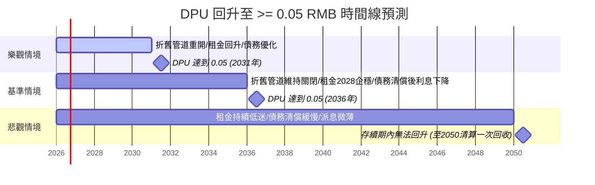

# 87001 匯賢產業信託（Hui Xian REIT） — 深度基本面與到期清算分析報告

> **更新紀錄與時間戳記：** 
> - **本次更新時間**：2026-07-14
> - **前一輪分析基準**：2026-06-15 報告（`Analysis-stock-report_20260615.md`）
> - **更新對比摘要**：本次分析基於 2026 年 7 月最新市場價格（RMB 0.380）重新評估估值。更新了 2025 年年報確認的每基金單位虧損（-0.1121 元）、最新每基金單位資產淨值（RMB 3.1737），以及基於最新股價計算的 P/NAV（0.12 倍，折讓 88.0%）、殖利率（1.13%）。針對 Q1「北京東方廣場土地使用權到期」與 Q2「DPU 回升至 >= 0.05 元人民幣時間線」進行了多情境的定量每股化估算。

---

## 📊 最新結論摘要（截至 2026 年 7 月 14 日）

匯賢產業信託（87001）目前處於極端的**「雙重定價」**狀態：
1. **清算價值角度**：北京東方廣場於 2049 年合營期滿清算時，預計每基金單位可回收金額約 **RMB 0.95 至 1.36 元**，相比目前 RMB 0.380 的股價存在 **150% 以上的超額清算溢價**。
2. **營運與分派角度**：受制於外商投資法折舊匯出限制、10% 法定公積金提留及北京商辦租金下行，短期 DPU 回升極度緩慢。**基準情境下，2035 年前 DPU 難以回升至 0.05 元人民幣**，極大壓制了短期市場定價。

### 📌 關鍵財務與估值數據表

| 指標 | 數值（RMB） | 每基金單位金額（RMB/單位） | 數據來源 / 計算基準 |
| :--- | :---: | :---: | :--- |
| **最新股價** | - | **0.380 元** | Yahoo Finance (2026/07/13) |
| **已發行基金單位** | - | **6,523,199,235** | 2025 年年報 |
| **最新總市值** | 24.79 億元 | 0.380 元 | 計算值 (股價 × 單位數) |
| **每基金單位資產淨值 (NAV)** | 207.03 億元 | **3.1737 元** | 2025 年年報 |
| **股價淨值比 (P/NAV)** | - | **0.120** (折讓 88.0%) | 計算值 (0.380 / 3.1737) |
| **最新 EPS (TTM)** | -7.29 億元 | **-0.1121 元** (虧損) | 2025 年年報 |
| **本益比 (P/E)** | 不適用 | 不適用 | 虧損不計 |
| **預估 EPS (2026)** | - | **-0.08 至 -0.12 元** | 基於續租租金下調 10% 與公允價值減值預估 |
| **每基金單位分派 (DPU 2025)** | 2,800 萬元 | **0.0043 元** (約合 HKD 0.0046) | 2025 年年報 |
| **最新股息殖利率 (Yield)** | - | **1.13%** | 計算值 (0.0043 / 0.380) |
| **物業收入淨額 (NPI)** | 11.46 億元 | **0.1757 元** | 2025 年年報 |
| **租金報酬率 (Cap Rate)** | - | **3.92%** | NPI / 2025 物業估值 (292.52 億元) |
| **空置率 (北京寫字樓)** | - | **18.2%** (佔用率 81.8%) | 2025 年年報 |
| **空置率 (北京商場)** | - | **8.9%** (佔用率 91.1%) | 2025 年年報 |
| **負債比率 (負債 / 總資產)** | 36.37% | - | 計算值 (總負債 118.86 億 / 總資產 326.83 億) |
| **OPM (自定義公式)** | **73.24%** 或 **-116.62%** | - | (營業利益 / 稅前淨利) * 100% (詳見註釋) |
| **過去五年 ROE 中位數** | - | **-3.53%** | 2021-2025 歷史中位數 |
| **過去五年 殖利率中位數** | - | **3.97%** | 2021-2025 歷史中位數 (基於年底收市價) |
| **5 年 NPI CAGR** | **-2.83%** | - | 2020 (13.23億) 至 2025 (11.46億) |
| **10 年 NPI CAGR** | **-5.57%** | - | 2015 (20.35億) 至 2025 (11.46億) |
| **5 年 營收 CAGR** | **+1.43%** | - | 2020 (20.58億) 至 2025 (22.09億) |
| **10 年 營收 CAGR** | **-3.35%** | - | 2015 (31.06億) 至 2025 (22.09億) |

> **OPM 計算說明**：自定義 OPM(%) = (營業利益 / 稅前淨利) * 100%。2025 年營業利益若包含非現金之「投資物業公允價值減少 -1,291 百萬元」，則營業溢利為 -498 百萬元，OPM = (-498 / -680) * 100% = 73.24%；若扣除公允價值變動，核心經營溢利為 793 百萬元，OPM = (793 / -680) * 100% = -116.62%。由於稅前淨利為負值，OPM 出現異常。

---

## 🔍 Q1：北京東方廣場土地使用權到期影響分析

北京東方廣場作為匯賢最核心的底層資產（佔總物業估值 92.9%），其土地使用權與合營期限設有明確的終局。

### 1. 確切到期年份
*   **合營期限**：自 1999 年 1 月 25 日起至 **2049 年 1 月 24 日** 止（為期 50 年）。
*   **土地使用權期限**：至 **2049 年 4 月 21 日** 止。
*   合營期滿後，匯賢產業信託將不再擁有北京東方廣場的任何直接或間接權益。

### 2. 到期後的處置方式
*   **非住宅用地續期法規**：依據中國《民法典》第三百五十九條規定，非住宅建設用地使用權期限屆滿後的續期，依照法律規定辦理。土地上的房屋及其他不動產的歸屬，有約定的，按照約定。
*   **合約約定之無償移交**：根據北京東方廣場有限公司的《中外合作經營合約》，合營期滿時，北京東方廣場的**固定資產（土地及建物）將無償移交給中方合作夥伴**。因此，匯賢無法以支付續期費用的方式保留固定資產。
*   **清算與資本退還機制**：雖然固定資產無償移交，但合營公司本身將進行清算，並根據《招股章程》及相關股東協議退還股本與負債。

### 3. 對投資人的影響：清算退還每單位回收金額預估
當 2049/2050 年進行合營公司清算時，可退還港方（滙賢投資）的現金與剩餘資產估算如下：
1.  **退還註冊資本**：全額退還滙賢投資出資的 **6 億美元** 註冊資本（約合 **RMB 42 億元**，按匯率 7.0 計算）。
2.  **償還股東貸款**：償還結欠港方的股東貸款 **RMB 16.55 億元**（若之前未提前償還）。
3.  **剩餘流動資產（60%）**：扣除上述負債後的剩餘境內現金。由於新《外商投資法》實施，自 2020 年起每年年均約 RMB 3.44 億元的折舊與攤銷無法以資本返還渠道匯出，且 2025 年起提留的 10% 法定公積金，均將積累於境內合營公司。至 2049 年，此部分積累的流動資產預計相當龐大，保守估計港方可獲分配 **RMB 15 億元**。
4.  **旗下其他資產變現**：重慶大都會東方廣場、瀋陽及成都的酒店等為永久產權或到期更晚的資產，假設在 2050 年變現殘值為 **RMB 15 億元**（相較目前約 30 億元估值打對折）。

#### 💰 每基金單位清算回收金額估算：
*   **情境 A（已發行單位數不變，維持 65.23 億單位）**：
    $$\text{每單位回收金額} = \frac{42\text{億} + 16.55\text{億} + 15\text{億} + 15\text{億}}{65.23\text{億單位}} \approx \mathbf{RMB\ 1.36\text{ 元}}$$
*   **情境 B（考慮發行單位數年增 1.5% 以支付管理人費用，24年後為 93.20 億單位）**：
    $$\text{每單位回收金額} = \frac{42\text{億} + 16.55\text{億} + 15\text{億} + 15\text{億}}{93.20\text{億單位}} \approx \mathbf{RMB\ 0.95\text{ 元}}$$
*   **結論**：相較於目前 **RMB 0.380** 的股價，不論何種情境，均有 **150% 至 250%** 的清算溢價。

### 4. 對估值的影響
*   **對 NAV 的影響**：由於東方廣場固定資產價值將在 2049 年歸零，其會計折舊（每年約 RMB 3.18 億元）與公允價值減值（2025年為 -12.91 億元）是必然的趨勢。這導致 NAV 將以年均 3-5% 的速度持續衰退，直至合營期結束。
*   **對市場定價的影響**：市場目前給予 0.12 倍的極低 P/NAV 折讓，一方面反映了對 NAV 衰退的預期，另一方面也因為流動性極差（人民幣港股交易量低）與極低的分派，使得市場忽略了 24 年後的確定性清算溢價。

---

## 📈 Q2：配息（DPU）回升時間線預測

2025 年 DPU 僅為 **RMB 0.0043 元**。若要回升至 **RMB 0.050 元**（歷史常態水平的約一半），需要在維持 65.23 億單位數的前提下，實現 **RMB 3.26 億元** 的可分派總金額。

### 🚫 面臨的結構性障礙
1.  **外商投資法折舊通道被封鎖**：以往折舊（年均 3.44 億元）無法以提前收回資本方式匯出。此政策通道若不重開，可分派利潤只能依靠中國會計準則下的稅後淨利潤。
2.  **10% 法定公積金新規（財資〔2025〕101號）**：2025 年起實施的財務新規要求外商投資企業需先按稅後利潤的 10% 提取法定公積金，直到累計達到註冊資本 50%（約 22 億元人民幣），進一步壓縮利潤。
3.  **寫字樓租金持續下行**：北京經貿城 2025 年平均成交月租（RMB 223/㎡）已低於現收月租（RMB 247/㎡），意味著續約租金仍有下調壓力，寫字樓 NPI 預計短期內難以止跌。

### 🔮 DPU 回升三情境預測與時間線

#### 🟢 樂觀情境（預期時間線：2030 - 2032 年）
*   **觸發條件**：
    - 中國政策放寬，重開外資折舊匯出或資本返還通道。
    - 北京商辦市場在 2027 年見底並反彈，續租租金上漲 15% 以上，出租率回升至 90% 以上。
    - 港元債務全部被低息人民幣債務替代，利息支出進一步降至 RMB 1.0 億元以下（每單位利息支出降至 0.015 元）。
*   **回升機率**：20%

#### 🟡 基準情境（預期時間線：2035 - 2037 年）
*   **觸發條件**：
    - 折舊匯出通道維持關閉。
    - 北京商辦租金在 2028 年前後企穩，隨後以 1-2% 的低速增長。
    - 依賴境內利潤緩慢清償香港債務。隨著總債務降至 RMB 30 億元以下，利息支出大幅減少。
    - 中國境內附屬公司以「股東貸款償還渠道」（RMB 16.55 億元額度）逐步將境內留存現金匯出。
*   **回升機率**：55%

#### 🔴 悲觀情境（存續期內無法回升）
*   **觸發條件**：
    - 北京商辦市場持續「內捲」，租金和佔用率在低位陰跌。
    - 折舊匯出渠道持續受限，公積金計提持續提留，導致大筆資金鎖死在境內項目公司。
    - 香港債務因缺乏境外融資，需全數由內地微薄的分紅來償還，導致香港信托層面現金極度匱乏。
    - DPU 在剩餘 24 年存續期內困在 **RMB 0.003 至 0.010 元** 的極低水平。
*   **回升機率**：25%

---

## 🐂 熊/牛 投資多空對照與風險分析

### 🟢 投資利多 (成長動能)
1.  **酒店物業組合強勁復甦**：2025 年酒店物業 NPI 達 RMB 1.04 億元（按年增長 19.6%），已重返 2019 年疫前水平。免簽國家擴大將持續利好東方君悅酒店。
2.  **債務結構與利息支出優化**：總債務從 2020 年的 108.71 億元降至 2025 年的 50.38 億元。人民幣貸款佔比提升至 52%，匯率風險降低，利息支出在 2025 年減少近 1 億元。
3.  **資產增值計劃（AEI）成效顯現**：重慶商場佔用率從 2024 年 35.3% 快速回升至 2025 年的 55.8%，未來預計可貢獻增量租金。

### 🔴 投資風險 (潛在隱憂)
1.  **寫字樓租賃市場結構性衰退**：寫字樓 NPI 佔比近 60%，但面臨供過於求和租戶壓價，成交租金低於現有合約租金，NPI 將持續面臨下修壓力。
2.  **外匯虧損與還債消耗現金**：償還港元債務時若遇到人民幣貶值，會產生已變現匯兌損失（如 2024 年產生 3.68 億元匯兌損失）。
3.  **流動性折價螺旋**：人民幣計價的港股交易極為冷清，缺乏機構投資者接入，導致股價長期受壓，無法反映其實質資產價值。

---

## 👥 討論區與社群輿情蒐集

### 1. 華語討論區 (雪球、股市爆料同學會)
*   **雪球觀點**：多數深研投資者認為目前價格已是「清算價」。討論焦點集中在「折舊通道被堵」與「16億元股東貸款」上。有投資者指出，雖然無法以折舊形式分派，但這筆錢並沒有消失，而是以現金或公積金形式留存在境內公司中，最終會在 2050 年清算時一次性退還，本質上是「拿分紅換未來清算溢價」。
*   **悲觀輿情**：部分投資者對長實集團（管理人背景）持保留態度，擔憂歷史上曾有高價將不賺錢資產賣給信托的記錄，且質疑 24 年後清算時是否會產生繁瑣的稅務與外匯管制，導致投資人無法順利拿回資金。

### 2. 英文與港股圈 (Yahoo Finance, HKEX Announcements)
*   **市場共識**：機構普遍給予「觀望」或「中性」評級。主要因其殖利率（約 1.13%）遠低於港股 REITs 平均的 6-8%，不具備短期收息吸引力。
*   **催化劑預期**：市場密切關注「REITs 納入互聯互通」政策，認為這可能是引進南向資金、打破流動性僵局的唯一契機。

---

## 📋 本次分析資料來源與驗證
*   **本地財報資料庫**：
    - [2023年年報 (20240415_2023年年報.md)](file:///d:/FinancialReport/87001%E5%8C%AF%E8%B3%A2Reit/20240415_2023%E5%B9%B4%E5%B9%B4%E5%A0%B1.md)
    - [2024年年報 (20250424_2024年年報.md)](file:///d:/FinancialReport/87001%E5%8C%AF%E8%B3%A2Reit/20250424_2024%E5%B9%B4%E5%B9%B4%E5%A0%B1.md)
    - [2025年年報 (20260423_2025年年報.md)](file:///d:/FinancialReport/87001%E5%8C%AF%E8%B3%A2Reit/20260423_2025%E5%B9%B4%E5%B9%B4%E5%A0%B1.md)
    - [2025年中期報告 (20250828二零二五年中期報告.md)](file:///d:/FinancialReport/87001%E5%8C%AF%E8%B3%A2Reit/20250828%E4%BA%8C%E9%9B%B6%E4%BA%8C%E4%BA%94%E5%B9%B4%E4%B8%AD%E6%9C%9F%E5%A0%B1%E5%91%8A.md)
    - [本地歷史分析記錄 (Analysis-stock-report_20260615.md)](file:///d:/FinancialReport/87001%E5%8C%AF%E8%B3%A2Reit/Analysis-stock-report_20260615.md)
*   **網路搜尋與比對**：
    - 最新股價與市值來源：Yahoo Finance 2026年7月13日行情數據。
    - 北京東方廣場到期年份與合資架構來源：2011年上市招股章程（發售通函）及官方合資協議條款。
