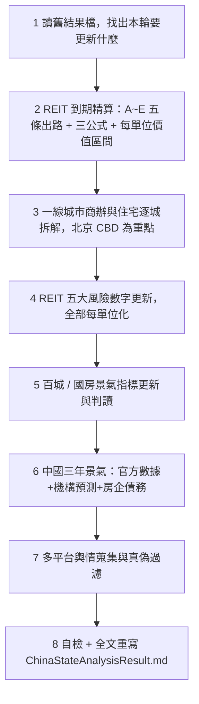

/goal
使用 latest claude OPUS model

# Routines — 中國房地產景氣 × 港股中國物業 REIT 投資判斷（初級分析師版）

> **本文件排序原則：越重要的資訊越上面。** 第 1 章（物件到期）是全報告的勝負手，第 6 章以後是規則與工具，供隨時回查。

---

## 0. 三分鐘導讀

### 0.1 這份報告最終只回答一句話

> **以現價買進、並長抱持有中國內地物業的港股 REIT，划不划算？**
> 答案必須是一個**數字對比**：`每單位價值區間（三情境）` vs `現價` → 明確寫出 **高估／合理／低估**，寫在第 1.3 節。

### 0.2 一句話心法（初級分析師必背）

> 買美國、日本的 REIT，你買的是「**永久產權（Freehold）＋租金**」；
> 買中國物業的港股 REIT，你買的是「**一段有到期日的現金流**」。
> 所以看到 8%～12% 的高殖利率，第一個要問的不是「配息穩不穩」，而是「**這筆錢是租金，還是在退還你的本金？**」

### 0.3 四個子問題（依重要性排序，也就是本文件的章節順序）

| 排序 | 要回答的問題 | 為什麼這題會決定 REIT 賺不賺錢 | 產出章節 |
|:--:|---|---|:--:|
| **1** | **REIT 手上的物件到期後怎麼辦？** | 中國土地**有年限**。到期怎麼處理，直接決定「資產最後值錢還是歸零」。**這是本報告的最重點，決定買賣結論。** | **第 1 章** |
| 2 | **一線城市（尤其北京 CBD）景氣如何？** | 兩檔標的核心資產都在**北京**。全國均值對它們沒有意義，**北京 CBD 甲級寫字樓就是這兩檔的損益表**。 | 第 2 章 |
| 3 | **REIT 自身的財務與治理風險？** | 商辦通縮、匯率利率剪刀差、LTV 逼近上限，任一爆掉都會直接砍掉分派。 | 第 3 章 |
| 4 | **總體房市（百城指標、三年景氣）往哪走？** | 房地產鏈約占中國 GDP 與地方財政 20%～25%，是租金的**背景水位**；領先 REIT 租金與估值 2～4 個季度。 | 第 4、5 章 |

### 0.4 分析標的

- **主標的（只做個別 REIT，不做 REIT ETF）**：`01426` 春泉產業信託（Spring REIT）、`87001` 匯賢產業信託（Hui Xian REIT）。
- **對照組**：其他持有中國物業的港股 REIT，如 `00405` 越秀房託。
- **主結果檔**：`AnalysisResult/ChinaStateAnalysisResult.md`（每輪**全文重寫**，不是往後追加）。
- **強制遵守**：`AGENTS.md`（個股分析規則、REIT 分析規則、每股化、利多風險並重、中文回覆）。
- **讀者設定**：**入行 1～2 年的初級股票分析師**。名詞第一次出現要附英文＋一句白話；能用表格就不要寫長篇文章。

---

# 【最重點】第 1 章：REIT 物件「到期」後的後續處理方式

> 這一章沒有數字，整份報告就沒有價值。第 1.1～1.3 節必須出現實際數字。

## 1.1 兩檔標的的到期時間軸（先看地雷在哪，本機檔案已核實，每輪需覆核）

### ① `87001` 匯賢產業信託 — 典型的「B：無償移交，終值歸零」

| 項目 | 日期／數字 | 說明 |
|---|---|---|
| **合營期屆滿（真正的經濟終點）** | **2049-01-24** | 北京東方廣場公司合營期 1999-01-25 起算；屆滿後固定資產**無償歸中方**，土地要不要續期已與匯賢無關 |
| 北京土地使用權屆滿 | 2049-04-21 | 比合營期晚，但**不影響結論** |
| 重慶大都會東方廣場 | 2044-08-30 | 比北京**更早**到期 |
| 瀋陽物業 | 2042-07-01 | **最早到期的一筆（第一顆地雷）** |
| 北京東方廣場每單位估值 | 約 **RMB 3.9283/單位**（2026-06-30） | 占物業估值近九成 |
| **每年剛性折減** | 約 **RMB 0.175/單位/年** `(估)` | `3.9283 ÷ 22.4 年`，尚未計入租金續跌造成的額外重估 |
| 續期可能性 | 🔴 **極低** | 合資文件：需境內夥伴同意＋董事會一致同意＋當局批准；境內夥伴同意＝放棄無償拿到整座東方廣場 |

- **關鍵新發展**：公司已在 2026 半年報**首度明講**「北京東方廣場權益價值將於剩餘期間逐步遞減，並於 2049 年合營期屆滿時**等於零**」，並開始**不再全額加回**未變現估值虧損。**官方等於承認了 NAV 剛性下折。**
- **結論的正確講法**：「P/NAV 打一二折」是**假便宜**，因為 NAV 裡近九成會歸零；真正屬於投資人的終值必須用「清算條款可回收的部分」重算，再折現。

### ② `01426` 春泉產業信託 — 典型的「A：可續期，但要補錢（金額未知）」

| 項目 | 日期／數字 | 說明 |
|---|---|---|
| 惠州物業 | **2048-02-01** | 🔴 比北京**早 5 年 8 個月**到期，**最早到期、最容易被忽略的地雷** |
| 北京華貿中心 1、2 座（辦公及停車） | **2053-10-28**（50 年期） | 主力資產 |
| 續期成本 | **未反映在 NAV** | 估值報告明文假設「毋須再付任何額外土地出讓金」 |
| 極端情境（皆無法續期） | 每單位僅剩帳上現金 | 必須算給投資人看：`帳上現金 ÷ 單位數`，並與現價對比 |

## 1.2 到期的五條出路 A～E（每一條都要算成「每單位多少錢」）

| 出路 | 機制 | 對投資人的財務結果 | 必算公式（每單位） |
|---|---|---|---|
| **A. 續期，補繳土地出讓金** | 到期前向政府申請續期，補錢換年限 | 一次性巨額資本支出 → 可能被迫**削減分派**或**折價供股**稀釋 | `預估續期地價總額 ÷ 在外流通單位數` |
| **B. 合營期屆滿，資產無償移交中方** | 中外合資／BOT 架構，期滿房子歸中方合營夥伴 | **終值＝0**。過去的高股息本質上是「退還本金（Return of Capital）」→ **殖利率陷阱（Yield Trap）** | 年折減 ＝ `(該物業帳面值 ÷ 剩餘年限) ÷ 單位數` |
| **C. 到期前提早出售物業** | 趁剩餘年限還長、買家還願意給價時處分 | 換回現金、避開歸零；但賣在房市低谷＝**永久失去未來現金流** | `預估處分淨額 ÷ 單位數`，並與現價比較 |
| **D. 被收購／私有化下市** | 大股東或第三方以折價收購全部單位 | 提前實現價值，通常有溢價，但價格由大股東主導 | `收購價 vs 每單位清算價值` |
| **E. 清算，按合約比例返還** | 依合資文件條款分錢（如註冊資本返還＋剩餘資產分成） | 拿回的是「合約寫的」，不是「帳上的 NAV」 | `(可回收現金 ＋ 註冊資本返還 ＋ 分成) ÷ 單位數` |

> **判斷 A 還是 B 的關鍵問句**：「**對方（境內合營夥伴／政府）有什麼誘因讓你續期？**」如果對方只要等就能無償拿到整棟樓，**續期的經濟誘因是零**。此時投資決策上應**假設無法續期**（走 B），而不是樂觀假設走 A。

## 1.3 三個必算公式 → 每單位價值區間 vs 現價（**買賣結論寫在這裡**）

```text
① 每年剛性折減（每單位）  = (該物業帳面價值 ÷ 剩餘年限) ÷ 在外流通單位數
② 續期補繳成本（每單位）  = 預估續期地價總額 ÷ 在外流通單位數
                            〔可用「公告基準地價 × 35%」作為地方前例錨點，標 (估)〕
③ 到期回收終值（每單位）  = (可回收現金 + 契約返還 + 分成) ÷ 單位數，再以合理折現率折現至今
```

用 ①②③ 跑三情境（**續期成功／無法續期／提前處分**），做出**每單位價值區間**，最後與**現價**比較，明確回答：**現價到底貴還是便宜。**

## 1.4 為什麼會這樣：中國物業 REIT 是「有終點的現金流」

中國土地全部國有，你買到的是**有年限的土地使用權（Land Use Rights）**：

| 用途 | 法定年限 | 本報告標的 |
|---|:--:|---|
| 住宅 | 70 年 | — |
| 工業 | 50 年 | — |
| **商業／綜合** | **40～50 年** | ✅ 春泉、匯賢皆屬此類 |

**所以 NAV（資產淨值）會有「剛性下折」**：房子還在，但「還能用幾年」一年比一年少，估值就得一年一年往下折，直到歸零或續期為止。**這種下折跟房市好壞無關，它必然發生。**

## 1.5 法律底層：到期到底怎麼算？（2026 年現況）

- **《民法典》第 359 條**：**住宅**建設用地使用權期滿**自動續期**，費用依法律行政法規辦理；**非住宅**（＝商辦）期滿後的續期，「**依照法律規定辦理**」。
- 🔴 **關鍵風險點**：截至目前，**非住宅用地到期續期的全國性實施細則仍未出台**——續多久、按什麼標準補錢、地價怎麼評估，**法律上是空白**。這不是「未來的小問題」，這是「金額無法估算的大問題」。
- **地方前例（可作為推估錨點）**：深圳 2004 年《到期房地產續期規定》——不改變用途者續期，**補繳地價約為公告基準地價的 35%**，一次性支付。可用此比例做敏感度測試，但**必須標示 `(估)` 並說明是類比地方前例**。
- **估值報告的陷阱**：多數估值師在報告中**明文假設「毋須再支付額外土地出讓金」**（春泉即為一例）。也就是說——**續期成本根本沒有被反映在 NAV 裡**。你看到的每單位淨值，是「假設不用補錢」的樂觀版本。

## 1.6 「到期倒數」檢查清單（每輪逐項打勾）

- [ ] 每一項物業的**到期日**都查到了？（不只主力資產，**最早到期的那筆才是第一顆地雷**）
- [ ] 距今**剩餘年限**算了嗎？
- [ ] 公司**開始認列剛性減值了嗎**？（未認列＝未來一次痛，已認列＝年年痛）
- [ ] 續期成本**有沒有被寫進 NAV**？（多半沒有）
- [ ] 到期走 A～E 哪一條？**對方的誘因**支持這個判斷嗎？
- [ ] 高殖利率是**真租金**還是**退還本金**？

---

# 第 2 章：一線城市房地產景氣（商辦優先，北京 CBD 為重中之重）

**為什麼排第二**：兩檔標的的核心資產都在**北京**（春泉＝北京華貿中心寫字樓；匯賢＝北京東方廣場）。**北京 CBD 的甲級寫字樓景氣，就是這兩檔的損益表。**

## 2.1 商辦面（**對 REIT 最關鍵，優先度高於住宅**）

| 城市／子市場 | 甲級寫字樓空置率 | 較上季 | 平均租金（RMB/㎡/月） | 未來 12～24 個月新增供給 | 對標的的影響 |
|---|---|---|---|---|---|
| **北京 CBD**（春泉、匯賢所在） |  |  |  |  |  |
| 上海 |  |  |  |  |  |
| 深圳 |  |  |  |  |  |
| 重慶（匯賢大都會東方廣場） |  |  |  |  |  |

- 空置率參考水位：北京、上海 CBD 已在 **15%～20%+**；深圳部分逾 **25%**。
- **續租租金調整率（Rental Reversion）比空置率更痛**：目前多為 **−5% ～ −20%**，且要送 3～6 個月免租期。

## 2.2 住宅面（來源：NBS 70 城原始頁，必須回官網核對，不可抄二手摘要）

| 城市 | 新房環比 | 新房同比 | 二手環比 | 二手同比 | 二手成交套數 | 一句話判讀 |
|---|---|---|---|---|---|---|
| 北京 |  |  |  |  |  |  |
| 上海 |  |  |  |  |  |  |
| 廣州 |  |  |  |  |  |  |
| 深圳 |  |  |  |  |  |  |

## 2.3 分析重點

- **城市內部也會分化**：豪宅／核心學區 vs 外圍遠郊；CBD 甲級 vs 非核心園區。要說清楚錢往哪流。
- **「老破小」與收儲**：核心市區老舊小戶型總價跌到租售比 2.5%～3.5% 時，會出現價格底（Cap Rate Floor）；同時追蹤地方國企收儲進度。
- 🟢 利多 Top 3 ／ 🔴 風險 Top 3 必列。

---

# 第 3 章：REIT 自身的五大風險（每輪都要更新數字，全部每單位化）

| # | 風險 | 一句話白話 | 要抓的數字 |
|:--:|---|---|---|
| 1 | **商辦供過於求 × 租金通縮** | 大樓太多、租客縮編，續租只能降價還要送免租期 | 空置率、續租租金調整率（−5%～−20%）、免租期月數、NPI 年增率 |
| 2 | **幣別 × 利率雙重剪刀差** | 收租收 RMB，欠債欠 HKD/USD；內地降息、港美高息，兩頭夾殺 | RMB 與 HKD/USD 債務占比、有效融資成本、利息保障倍數、匯兌損益 |
| 3 | **LTV 逼近 50% 法定上限** | 房子被估值師調降 → 分母縮小 → 借貸比率被動飆升 | 借貸比率現值、距 50% 的緩衝（百分點）、公允價值變動金額（每單位化） |
| 4 | **跨境匯出 × 預扣稅** | 錢從內地匯到香港要先扣 **10% 預扣稅**，還要過外管局（SAFE）流程 | 實際稅負、匯出時滯、資金留存內地比重 |
| 5 | **外部管理與治理** | 管理費按資產規模（AUM）抽成，抽得再多也跟股東報酬無關；還可能**發新單位抵付管理費**稀釋你 | 管理費計算基礎、以單位抵付的比例、管理人自身持股、大股東質押與自由流通量 |

> **LTV 被動破表的三種解法，每一種都痛**：①扣留／停止配息還債 ②折價供股（永久稀釋）③賤賣核心物業（永久失去現金流）。

---

# 第 4 章：百城景氣指標與國房景氣指數（房市體溫計）

**要交出的判斷**：體溫計現在幾度、方向往上還往下、離「景氣線」多遠。

## 4.1 固定要做的表

| 指標 | 最新值 | 環比 | 同比 | 上期值 | 發布日 | 判讀 |
|---|---|---|---|---|---|---|
| 百城**新建**住宅均價（RMB/㎡） |  |  |  |  |  |  |
| 百城**二手**住宅均價（RMB/㎡） |  |  |  |  |  |  |
| 百城漲／跌城市家數 |  | — | — |  |  |  |
| 50 城住宅平均租金（RMB/㎡/月） |  |  |  |  |  |  |
| **國房景氣指數**（2012=100） |  |  | — |  |  | 對照 95／105 兩條線 |

## 4.2 判讀原則（初級分析師最容易搞混的地方）

- **新房漲、二手跌 ≠ 市場回暖**：新房均價常因「高總價的核心區案量占比上升（結構效應）」被拉高，二手跌才是真實需求在退。**兩者背離時，以二手為準。**
- **看「漲跌城市家數」比看均價重要**：92:8 這種懸殊比，代表這是**全國性下行**，只有極少數核心城市例外。
- **租金同比為負的訊號**：租金是不動產的「本業收入」。**房價可以靠政策撐，租金撐不了**——租金續跌代表 REIT 的收入端沒有支撐。
- **國房景氣指數長期低於 95**：代表開發商仍在收縮，未來 2～3 年新增供給會減少（中期利多），但短期代表投資與拿地意願仍弱（短期利空）。

## 4.3 基準參考值（**每輪必須重新查證，不可直接沿用**）

- 2026 年 7 月（中指研究院，2026-08-01 發布）：百城新建住宅均價 **RMB 17,229/㎡**（環比 **+0.26%**、同比 **+2.09%**）；百城二手住宅均價 **RMB 12,584/㎡**（環比 **−0.44%**，跌幅較上月**擴大** 0.02 個百分點），**8 個城市漲、92 個城市跌**，核心城市中上海續漲；50 城住宅平均租金 **RMB 34.01/㎡/月**（環比 +0.13%、同比 −2.62%）。
- **國房景氣指數**：本輪若查不到最新值，填 `N/A` 並說明（常見原因：NBS 發布時點落後、部分月份併月公布）。

---

# 第 5 章：中國未來三年房地產景氣（2026–2028，背景水位）

**要交出的判斷**：三年是「L 型底部橫盤」、「緩步修復」還是「二次下探」？並給出信心度（高／中／低）。

**必查清單**

1. **官方數據**：NBS 房地產開發投資、商品房銷售面積／金額年增率（近 36 個月），判斷降幅是否持續收窄。
2. **機構預測區間**：Fitch、UBS、Goldman Sachs、Reuters Poll 的年度銷售金額與房價預測，**列成表格並註明發布日**；不同機構分歧時要說明分歧原因。
3. **房企債務（信用風險傳導）**：
   - 萬科（`000002.SZ` / `02202.HK`）：公開債展期與兌付進度、國資（深圳地鐵）支援金額、最新盈警或損益。**注意：「零違約」與「巨額虧損」可以同時成立**——展期解決的是「流動性」，不是「獲利能力」。
   - 碧桂園（`02007.HK`）、恒大（`03333.HK`）：重組／清算進度與市場隔離效果。
4. **政策**：收儲（地方國企收購存量商品房轉保障房）、白名單融資、限購與信貸鬆綁；**每一條都要找到一手官方公告**，找不到就標為未證實。
5. **結構性因素**：人口與新生兒數、城鎮化率、改善型需求 vs 剛性需求的比重變化。

**輸出格式**：三年逐年情境表（樂觀／基準／保守，各給機率與觸發條件）＋ 🟢 利多 Top 3 ／ 🔴 風險 Top 3。

---

# 第 6 章：不可違反的鐵則（Invariants）

| 項目 | 規則 | 初級分析師最常犯的錯 |
|---|---|---|
| **每股（每單位）化 ⭐** | 只要出現絕對金額（億元），**強制**換算 `÷ 最新在外流通單位數` | 「減值 9.07 億」聽不出痛，「每單位 −RMB 0.1391」才有感。 |
| **禁用全國均值代表一線** | 北京、上海、廣州、深圳**必須逐城拆開**列出 | 用全國 −3% 推論北京 CBD，結論必錯。 |
| **政策防偽** | 政策利多必須有一手官方公告（gov.cn／住建部／人行）；查無者標 `⚠️ 未經官方證實（不可採信）` | 自媒體「史詩級救市組合拳」照抄進報告。 |
| **來源優先序** | 官方（NBS 國家統計局／人行／住建部）＞ 國際投行（Fitch／UBS／Goldman）＞ 專業機構（中指研究院／中原／克而瑞／高力／戴德梁行）＞ 媒體 ＞ 論壇 | 引用二手摘要卻不回官網原始頁核對，數字方向會抄錯。 |
| **利多風險並重** | 每章都要同時列 🟢 利多 與 🔴 風險（各至少 3 點） | 只講故事不講風險。 |
| **透明度標記** | 資料逾 6 個月標 `(舊)`；自行推估標 `(估)`；查不到填 `N/A` 並說明原因 | 把估算值寫成官方數據。 |
| **幣別** | 中國標 **RMB**、香港標 **HKD**、跨國標 **USD**；換算要附 `HKD/RMB`、`USD/HKD` 與**取價日** | 寫「賺了 9 億」卻不寫幣別，等於沒寫。 |
| **時間跨度** | 回顧近 3 年 ＋ 展望未來 3 年 | 拿單月數據當趨勢。 |
| **檔案路徑** | 只讀寫本 repo（本機鏡像 `d:\FinancialReport\`）內的檔案 | 寫到暫存資料夾，下一輪就找不到。 |

---

# 第 7 章：執行流程（8 步）



**Step 1**：讀 `AnalysisResult/ChinaStateAnalysisResult.md`，列出上一輪結論，標記本輪有哪些**新數據發布**（NBS 月報、中指月報、REIT 中報／年報、公司公告）。
**Step 2（最重點，先做）**：對應第 1 章。**先讀本機資料再上網**——`01426春泉Reit/`、`87001匯賢Reit/` 內有年報、中期業績公告與既有分析檔，**優先使用**（零延遲、資料完整）；不足再上 HKEXnews／公司 IR。三公式必須跑出實際數字。
**Step 3～4**：對應第 2、3 章，把商辦數據與五大風險數字全部更新並每單位化。
**Step 5～6**：對應第 4、5 章，**所有官方數據一律回官網原始頁核對**，禁止只採信媒體摘要。
**Step 7**：輿情平台——雪球、富途/moomoo、東方財富股吧、LIHKG、PTT 房產板、Reddit、Seeking Alpha；同時檢查本機公司資料夾內既有的輿情檔。**要分辨「真實市場反饋」與「情緒噪音／假消息」並標可信度。**
**Step 8**：自檢後全文覆寫結果檔。

**Step 8 自檢清單（依重要性排序）**

- [ ] **第 1 章的三個公式都跑出實際數字、給出每單位價值區間並與現價比較了？**
- [ ] 所有金額都換算成**每單位**了？
- [ ] 每章都有 🟢 利多 與 🔴 風險？
- [ ] 未證實傳言都標記了？
- [ ] 資料逾 6 個月標 `(舊)`、推估標 `(估)`、查無標 `N/A`？
- [ ] 專有名詞第一次出現有附英文＋一句白話？

---

# 第 8 章：結果檔骨架（`AnalysisResult/ChinaStateAnalysisResult.md`）

```markdown
# 中國房地產景氣 × 港股中國物業 REIT 投資判斷

> 更新時間：YYYY-MM-DD hh:mm:ss（第 X 輪）
> 分析範圍：REIT 物件到期｜一線城市｜REIT 五大風險｜百城與國房景氣指標｜中國三年景氣
> 基準匯率：HKD/RMB = X.XXXX｜USD/HKD = X.XXXX（取價日：YYYY-MM-DD）
> 讀者：初級股票分析師

## 一、結論與投資建議（3 點，買賣結論寫最前面）＋ 免責聲明
## 二、30 秒執行摘要（表格：主題 / 一句話結論 / 信心度 / 較上輪變化 / 依據）

## 三、REIT 物件到期後續處理方式（核心章）
  3.1 87001 匯賢：2049 無償移交時間軸、每單位年折減、清算可回收終值
  3.2 01426 春泉：2048 惠州／2053 北京、續期成本每單位試算、極端情境現金底
  3.3 五條出路 A~E 對照表與各標的歸屬判斷
  3.4 三情境每單位價值區間 vs 現價（**買賣結論的計算過程**）
  3.5 中國土地年限制度與 NAV 剛性下折
  3.6 法律現況：民法典 359 條與非住宅細則空白、深圳 35% 前例
  3.7 到期倒數檢查清單結果

## 四、一線城市房地產景氣
  4.1 一線商辦表（空置率／租金／新增供給），北京 CBD 為重點
  4.2 北上廣深住宅逐城表（NBS 原始頁）
  4.3 城市內部分化與老破小、收儲互動
  4.4 🟢 利多 ／ 🔴 風險

## 五、REIT 五大風險數字更新（商辦通縮／幣別利率／LTV／預扣稅／治理）

## 六、百城與國房景氣指標
  6.1 指標總表（新房／二手／漲跌家數／租金／國房景氣指數）
  6.2 判讀：新房與二手背離代表什麼、租金為何是關鍵
  6.3 對 REIT 的傳導路徑與時間差

## 七、中國房地產未來三年景氣（2026–2028）
  7.1 總體走勢判斷（L 型／修復／下探，含機率）
  7.2 機構預測彙整表（Fitch / UBS / Goldman / Reuters）
  7.3 房企債務進度（萬科、碧桂園、恒大）
  7.4 政策與傳言真偽核實
  7.5 🟢 利多 Top 3 ／ 🔴 風險 Top 3

## 八、社群輿情整理（平台 / 風向 / 多空 / 查證評估）
## 九、與上一輪的結論異動（含「數據修正」要標 🔧）
## 十、資料取得狀態（項目 / 取得與否 / 來源 / 日期 / 缺漏原因）
## 十一、⚠️ 待查與資料缺口
## 十二、下一輪追蹤項目與數據發布時程
```

---

# 第 9 章：對話框回覆格式

```text
✅ 中國房市 × 港股中國 REIT 分析 — YYYY-MM-DD hh:mm:ss
- 【結論】每單位價值區間 vs 現價：<高估／合理／低估>
- REIT 到期精算：
  * 87001 匯賢：2049-01-24 無償移交（剩 XX.X 年）｜年折減 RMB X.XXX/單位｜清算終值 RMB X.XX/單位 vs 現價 RMB X.XXX
  * 01426 春泉：惠州 2048-02-01／北京 2053-10-28｜續期成本 HK$X.XX~X.XX/單位｜無法續期底線 HK$X.XXX/單位
- 一線商辦：北京 CBD 空置率 XX.X%（較上季 X.X pp）｜續租租金調整率 −X%～−XX%
- REIT 風險：借貸比率 XX.X%（距 50% 上限 X.X pp）｜NPI 年增率 X.X%
- 百城指標：新房 RMB X,XXX/㎡（環比 +X.XX%）｜二手 RMB X,XXX/㎡（環比 −X.XX%）｜漲跌家數 X:XX｜國房景氣指數 XX.X
- 中國三年景氣：<L型築底/修復/下探>，機構預測區間 X%~Y%｜萬科債務 <狀態>
- 資料取得：官方 X/Y 項｜機構預測 X/Y 家｜REIT 財報 X/2 家
- 與上輪異動：X 項強化、Y 項修正｜主結果檔已覆寫
- 自檢：到期章三公式 ✅｜每單位化 ✅｜利多風險並重 ✅｜傳言查證 ✅｜說人話 ✅
```

---

# 附錄 A：8 個必看指標速查表（工具區，隨時回查）

| # | 指標 | 誰發布／多久一次 | 白話怎麼看 | 對 REIT 的意義 |
|:--:|---|---|---|---|
| 1 | **續租租金調整率**（Rental Reversion） | REIT 財報／仲介行 | 舊租約到期換新租約，租金是漲還是跌。目前多為 **−5% ～ −20%**，且要送 3～6 個月免租期 | REIT 收入衰退的**主因**，比空置率更痛 |
| 2 | **甲級寫字樓空置率**（Vacancy Rate） | 高力（Colliers）／戴德梁行／世邦魏理仕 | 北京、上海 CBD 已在 15%～20%+；深圳部分逾 25% | **直接**決定 REIT 的出租率與議價能力 |
| 3 | **租售比 / 資本化率**（Rental Yield / Cap Rate） | 自行計算：年租金 ÷ 物業價格 | 住宅租售比回到 2.5%～3.5% 時，長租買盤會進場撐住價格底 | 估值師定 Cap Rate → 直接影響 NAV |
| 4 | **NBS 70 城房價指數** | NBS／每月中旬（2026 年起改以 **2025 年為基期**） | 分「新建商品住宅」與「二手住宅」，各有環比／同比 | 逐城拆解一線的唯一官方權威來源 |
| 5 | **二手房成交量（套數）** | 各地房管局／中原、貝殼 | **量先於價**：成交量回升通常領先房價 1～2 季 | 最早的落底訊號 |
| 6 | **百城價格指數**（China Index Academy 100-City Index） | 中指研究院／**每月月初**發布上月 | 新房均價受建商促銷干擾；**二手房均價才是真實供需**。看「環比%」與「漲跌城市家數」 | 房價 → 財富效應 → 商場消費 → 零售租金 |
| 7 | **國房景氣指數**（Real Estate Climate Index） | NBS／每月與開發投資同步 | 2012 = 100。**95～105＝適度景氣；>105＝過熱；<95＝偏冷** | 開發端收縮 → 地方財政緊 → 招商與新增供給節奏 |
| 8 | **開發投資 / 銷售面積 年增率** | NBS／每月 | 判斷是「L 型築底」還是「續探」 | 決定三年展望的主基調 |

**兩個必背小抄**

- **環比（MoM）vs 同比（YoY）**：環比＝跟上個月比，看**轉折**（領先）；同比＝跟去年同月比，看**趨勢**（確認）。當二手房「環比由負轉正、同比仍為負」，標準解讀是「**跌幅收窄、正在築底**」，不是「已經反轉」。
- **NPI（Net Property Income，物業收入淨額）**：租金收入扣掉物業直接開支後的錢，是 REIT 能拿去配息的源頭。NPI 掉 → DPU（每單位分派）掉。

---

# 附錄 B：白話名詞對照表

| 名詞 | 英文 | 一句話白話 |
|---|---|---|
| 資產淨值 | NAV (Net Asset Value) | 資產減負債後的帳面價值；**有到期日的資產，NAV 會被高估** |
| 土地出讓金 | Land Premium | 向政府取得土地使用權要付的錢；**續期時要再付一次，且多半沒算進 NAV** |
| 殖利率陷阱 | Yield Trap | 看起來配很高，其實是在把你的本金還給你 |
| 每單位分派 | DPU (Distribution Per Unit) | REIT 每一個單位配給你的錢，等於股票的每股股利 |
| 物業收入淨額 | NPI (Net Property Income) | 租金扣掉物業開支後的錢，配息的源頭 |
| 借貸比率 | Gearing Ratio / LTV | 總計息負債 ÷ 總資產；香港 REIT 法定上限 **50%** |
| 續租租金調整率 | Rental Reversion | 舊約換新約，租金漲跌幾 % |
| 資本化率 | Cap Rate | 年淨租金 ÷ 物業價值；估值師用它決定房子值多少 |
| 折價供股 | Rights Issue | 打折向股東要錢，你不掏錢就被稀釋 |
| 預扣稅 | Withholding Tax | 錢匯出中國前先被扣掉的稅（一般 10%） |
