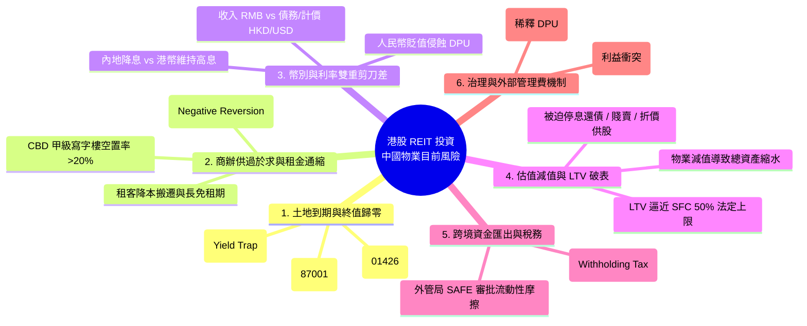
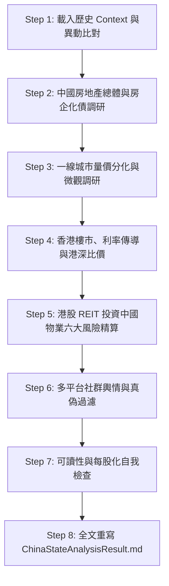

/goal
使用 latest claude OPUS model

# Routines — 中國 / 香港房地產景氣與 港股REIT投資中國物業風險 深度分析（初級分析師指南版）
> **目標與產出**：全面評估中港未來三年房市走向、一線城市量價分化、香港利率傳導機制，以及**「透過港股個別 REIT（非 ETF）投資中國房地產之目前全方位風險」**。
> **主結果檔**：`AnalysisResult/ChinaStateAnalysisResult.md`（每輪執行皆全文重寫，非追加）。強制遵守 `AGENTS.md` 規範。
> **教學定位**：本文件為**「初級股票分析師」**量身打造，將宏觀房地產數據、房企債務、匯率利率傳導、商辦供需通縮與複雜的 REIT 土地到期折減邏輯，轉化為直觀易懂的 SOP 與實戰判讀指南。

---

## 0. 給初級分析師的核心觀念導讀（Why This Matters）

身為股票分析師，為什麼要花時間追蹤「中港房市」與「透過港股 REIT 投資中國物業」？
1. **房地產是中港經濟與股市的「週期之母」**：房地產鏈占中國 GDP 與地方財政約 20%~25%，牽動銀行資產品質、原物料（鋼鐵水泥）、消費（家電家具）與整體股市估值乘數。
2. **「全國均值」會殺人，必須看「城市微觀分化」**：中國三四線城市深陷庫存去化泥淖，但一線核心區（北上廣深）二手房成交量往往先於價格築底。以全國平均看一線會得出過度悲觀的錯誤結論；以一線看全國則會忽視整體庫存壓力。
3. **香港樓市是「聯匯制度下 Fed 利率的溫度計」**：港幣掛鉤美元，金管局（HKMA）無自主貨幣政策，Fed 升降息直接傳導至 HIBOR 與按揭利率，進而決定香港地產股與 REITs 的估值折讓。
4. **透過港股 REIT 投資中國物業的「致命特殊性」**：海外 REIT（如美股、日股）多持有永久產權（Freehold），但中國物業僅有有限年期（商業 40 年/工業 50 年）。投資人常被表面高殖利率（8%~12%）吸引，卻忽視了「土地到期資產歸零」、「商辦租金通縮」、「港幣高息 vs 人民幣貶值雙重剪刀差」與「LTV 破表被動去槓桿」等致命結構性風險！

---

## 1. 執行參數與核心不可違反原則 (Parameters & Invariants)

| 項目 | 規則與標準 | 初級分析師注意事項（避免犯錯） |
|---|---|---|
| **檔案路徑** | 限定讀寫 `d:\FinancialReport\` | 不得寫入暫存資料夾或路徑外檔案。 |
| **幣別標註** | 中國標 **RMB**，香港標 **HKD**，美股/跨國標 **USD** | 必須註明 `HKD/RMB`、`USD/HKD`、`USD/RMB` 匯率與取價日期，嚴禁無幣別裸奔。 |
| **時間跨度** | **回顧近 3 年歷史 + 展望未來 3 年** | 觀察趨勢不能只看單月波動，需拉出 3 年週期看拐點。 |
| **數據權威度** | 官方統計（NBS/RVD/PBOC/HKMA）> 國際投行（Goldman/UBS/Fitch）> 專業機構（中指/中原/克而瑞）> 媒體 > 網路論壇 | 引用數據必須標註出處與發布日。 |
| **防偽查核** | 政策利多必須有一手官方來源（國務院 gov.cn、住建部、人行） | 自媒體內容農場常炒作「史詩級救市組合拳」，查無官方公告強制標註 `⚠️ 未經官方證實（不可採信）`。 |
| **城市分化** | **嚴禁以全國均值概括一線城市** | 必須拆解：北京、上海、廣州、深圳之新房/二手房環比（MoM）與同比（YoY）。 |
| **利多風險並重** | 每個章節均須同步列出 🟢 利多 與 🔴 風險（Top 3） | 嚴禁單向看多或盲目看空，必須客觀呈現雙向驅動力。 |
| **數據每股化 ⭐** | 具體財務絕對金額（億元）強制換算為「每單位/每股金額」 | 計算公式：`總金額 ÷ 最新在外流通總單位數`，讓投資人知道對手中 1 股的實質影響。 |
| **透明度標記** | 數據逾 6 個月標 `(舊)`；推估標 `(估)`；查無填 `N/A` | 嚴禁把估算值當成官方已實現數據。 |
| **REIT 範圍** | **僅分析個別 REIT（重點標的：01426 春泉、87001 匯賢），不包含 REIT ETF** | 深入至底層物業租約、空置率、融資結構、到期年限與減值模型。 |

---

## 2. 關鍵指標解讀與底層邏輯（Junior Analyst's Toolkit）

初級分析師在研讀或撰寫報告時，必須掌握以下四大分析板塊之底層經濟邏輯：

### 2.1 房價與總體經濟指標
1. **環比（MoM, Month-on-Month）vs 同比（YoY, Year-on-Year）**：
   - **環比**：與上個月比。反應**最新邊際變化與轉折點**（領先訊號）。
   - **同比**：與去年同期比。反應**長期趨勢與基期效應**（確認趨勢）。
   - *實戰心法*：當二手房環比由負轉正（例如 +0.2%），即使同比仍為負（例如 −3.5%），通常代表市場正在「跌幅收窄、築底修復」。
2. **一手新房 vs 二手房**：
   - **二手房價格更能反映真實市場供需**，因為新房受地方政府限價、建商促銷贈送裝潢等干擾；二手房是買賣雙方真金白銀搏殺出的價格。
3. **老破小（Old Dilapidated Small Housing）與租售比（Rental Yield）**：
   - 指核心市區 2000 年前建成的老舊小戶型。當總價大幅下跌後，租金回報率（租售比）回升至 2.5%~3.5%，會吸引長租買盤與剛需，形成「資產價格底線（Cap Rate Floor）」。
4. **收儲政策（Government Inventory Buyback）**：
   - 地方國企以成本價收購房企未售出的存量商品房，改建為「保障性租賃住房」，核心目的是消化庫存、救房企現金流並提供社會住宅。
---

### 2.3 透過港股個別 REIT 投資中國房地產之「六大維度風險」深度拆解（重點必修）

當投資人透過港交所掛牌的個別房地產信託基金（如 01426 春泉產業信託、87001 匯賢產業信託、00405 越秀房產信託等）投資中國內地物業時，初級分析師必須逐一審查以下**六大實質風險**：



#### ① 風險一：土地使用權到期與資產終值歸零風險（Terminal Value & Land Lease Expiry）
- **核心邏輯**：中國土地全屬國有，商業物業土地使用權年限僅為 **40 年**（工業 50 年、住宅 70 年）。不同於歐美日本 REIT 享有永久產權（Freehold），中國物業 REIT 本質上是「有期限的現金流折現」。
- **兩大到期型態對比**：
  - **型態 A：BOT 模式到期無償移交（Zero Terminal Value Transfer）—— 典型代表：`87001 匯賢產業信託`**
    - *物業*：北京東方廣場（合約到期日 **2049 年 1 月 24 日**）。
    - *機制*：合約期滿後，物業全部所有權無償歸還中方合資夥伴，匯賢取回資產為 **0 RMB**。
    - *財務後果*：資產淨值（NAV）必須在剩餘年限內逐年直線減值至 0。若每年不認列減值，過去的高股息本質上就是「退還本金（Return of Capital）」，投資人面臨巨大的**本金歸零陷阱（Yield Trap）**。
    - *精算公式*：`每年直線減值每股金額 = (該物業帳面價值 ÷ 剩餘年限) ÷ 在外流通單位數`。
  - **型態 B：可申請續期但需補繳巨額出讓金（Land Premium Renewal）—— 典型代表：`01426 春泉產業信託`**
    - *物業*：北京華貿中心商務樓（土地到期日約 **2053 年**）。
    - *機制*：土地使用權到期時需向政府申請續期並補繳土地出讓金。
    - *財務後果*：未來面臨巨額資本支出（Capex），若缺乏足夠現金儲備，將迫使 REIT 大幅削減分派或進行股權融資（供股稀釋）。
    - *精算公式*：`每單位潛在補繳成本 = 預估續期地價總額 ÷ 在外流通單位數`。

#### ② 風險二：寫字樓/商辦嚴重供過於求與租金通縮（Oversupply & Rental Deflation）
- **核心邏輯**：內地一線城市（北京、上海、深圳）過去幾年迎來甲級寫字樓新增供應高峰，疊加科技大廠（互聯網企業）與金融機構降本增效、縮減租賃面積或遷往非核心園區。
- **指標判讀**：
  - **空置率（Vacancy Rate）**：北京/上海 CBD 寫字樓空置率已攀升至 15%~20%+，深圳部分區域甚至突破 25%。
  - **續租租金調整率（Rental Reversion Rate）**：呈現 **−5% 至 −20% 顯著負增長**，業主必須提供 3~6 個月超長免租期（Rent-free Period）以留住租客。
  - **物業收入淨額（NPI）下滑**：直接打擊可分派收入（Distributable Income）。

#### ③ 風險三：幣別與利率「雙重剪刀差」錯配（Currency & Interest Rate Mismatch）
- **資產與負債幣別錯配**：
  - REIT 的底層物業租金收入為 **人民幣（RMB）**。
  - 若 REIT 在香港發行是以 **港幣（HKD）** 計價交易，或借入 **港幣/美元（USD）債務**，當人民幣對港幣貶值時，折算出的每單位分派（DPU）與以港幣計價的 NAV 將會遭受匯率侵蝕。
- **利率環境分歧（剪刀差）**：
  - **內地環境**：人行持續降息（LPR 調降），市場無風險利率走低。
  - **香港/離岸環境**：港幣利率跟隨美聯儲（Fed）維持在相對高檔（HIBOR 仍處於歷史偏高水平）。
  - *實戰殺傷力*：若 REIT 借入大量港幣/美元浮動利率貸款，將面臨「內地租金向下掉、離岸利息支出向上飆」的致命擠壓，導致利息保障倍數（Interest Coverage Ratio）急劇惡化。

#### ④ 風險四：資產重估減值引發槓桿率（LTV）破表與融資危機（LTV Spikes & Refinancing Covenants）
- **香港證監會（SFC）法定紅線**：依據香港《房地產投資信託基金守則》，REIT 的借貸比率（Gearing Ratio / LTV）**上限為 50%**。
- **被動破表連鎖反應**：
  $$\text{借貸比率 (LTV)} = \frac{\text{總計息負債}}{\text{總資產（物業評估總值）}}$$
  當租金下跌導致獨立評估師下調物業公允價值（Fair Value Loss）時，分母（總資產）萎縮，LTV 會被動飆升逼近 50% 上限。
- **防禦手段與代價**：
  1. **扣留可分派收入**：減少甚至暫停配息，將現金用於償還銀行貸款。
  2. **折價供股（Rights Issue）**：以大幅折讓價向市場股東要錢還債，造成每股淨值與每股分派的永久性稀釋。
  3. **賤賣核心物業**：在房市低谷被迫變現資產，永久損失未來現金流。

#### ⑤ 風險五：跨境資金調度摩擦與 10% 預扣稅（Cross-Border Cash Repatriation & Withholding Tax）
- **稅務成本**：中國物業產生的股息或利潤匯出境外時，需扣繳 **10% 企業所得稅預扣稅（Withholding Tax）**。
- **外匯管制與審批時滯**：資金從內地項目公司匯至香港信託層面需符合國家外匯管理局（SAFE）的合規備案，遇到市場流動性緊張時，資金跨境調度靈活性遠不如純本地物業 REIT。

#### ⑥ 風險六：外部管理體制與潛在利益衝突（External Management & Agency Conflicts）
- **收費機制錯位**：香港多數 REIT 採取外部管理架構（External Asset Manager），管理費多按「物業資產總值（AUM）」或「物業淨收入（NPI）」的固定百分比收取，而非掛鉤「二級市場股東總回報（Total Shareholder Return）」。
- **單位抵付管理費（Unit-dilution）**：部分 REIT 管理人選擇以發行新基金單位（Units）代替現金收取管理費，持續增加在外流通總單位數，悄悄稀釋現有投資人的每股分派（DPU）。

---

## 3. 執行流程（Step-by-Step Execution Workflow）



### Step 1: 載入 Context 與上一輪比對
- 讀取既有 `AnalysisResult/ChinaStateAnalysisResult.md` 與 `AnalysisResult/HkStateResult.md`。
- 提煉上一輪核心結論，鎖定本輪有哪些**最新數據發布（如 NBS 70城單月、最新 CCL 指數、萬科公告、REIT 最新中報/年報）**。

### Step 2: 中國房市展望（宏觀、房企、政策）
- **宏觀供需**：判斷目前處於「L型底部築底」還是「持續下探」，檢視 NBS 房地產開發投資、銷售面積同比數據。
- **機構預測**：彙整惠譽（Fitch）、高盛（Goldman）、瑞銀（UBS）、路透（Reuters）的年度預測區間。
- **重點房企債務**：
  - 萬科（000002.SZ / 02202.HK）：追蹤 2026 年到期公開債展期進度、兌付狀況、深圳地鐵國資支援與管理層策略。
  - 碧桂園（02007.HK）/ 恒大（03333.HK）：重組進展與市場隔離效果。
- **政策與傳言**：驗證收儲、白名單貸款落實情況；對網路自媒體未證實政策進行闢謠核實。

### Step 3: 一線城市房價走勢（北上廣深）
- 製表呈現：北京、上海、廣州、深圳之新房環比/同比、二手房環比/同比、二手房成交套數。
- 分析城市內部結構分化（豪宅盤 vs 外圍盤、學區房 vs 遠郊盤）。
- 追蹤「老破小」租售比與政府收儲保障房之互動關係。

### Step 4: 香港樓市與利率傳導分析
- 取得最新 CCL 點位（週頻）、RVD 指數（月頻），計算年內累計漲跌幅。
- 連線 CME FedWatch，推導 Fed 利率決策對香港 HIBOR 及新造按揭利率之傳導路徑。
- 評估撤辣後一手新盤去化速度與二手中介成交量。
- 港深對比：引用 Numbeo 房價所得比與深圳共有產權房（五折買房）政策，評估北上置業對港樓之替代效應。

### Step 5: 港股 REIT 投資中國物業之六大風險專項精算（重點執行）
- **標的一：01426 春泉產業信託（Spring REIT）**
  - *底層物業*：北京華貿中心商務樓（約佔資產主體）+ 惠州商場 + 英國汽車保修廠。
  - *風險審查*：
    1. 土地到期日：2053 年（剩餘約 27 年），推估續期補繳地價每單位負擔（HK$/單位）。
    2. 北京 CBD 寫字樓續租租金跌幅與出租率變化。
    3. 借貸幣別（美元/港幣債務比重）與有效融資成本。
    4. Gearing Ratio（LTV）最新水準距 50% 上限之緩衝空間。
- **標的二：87001 匯賢產業信託（Hui Xian REIT）**
  - *底層物業*：北京東方廣場（東方新天地零售、寫字樓、東方君悅大酒店、服務公寓）+ 重慶大都會東方廣場 + 瀋陽/成都物業。
  - *風險審查*：
    1. 土地與合約到期日：**2049 年 1 月 24 日到期無償移交中方**（剩餘約 22 年）。
    2. 減值認列：檢視最新財報之公允價值減值金額（如 2026H1 減值 9.07 億 RMB），計算每年每單位直線減值壓力（RMB/單位），分析 NAV 下折軌跡。
    3. 分派可持續性：檢視公司是否停止全額加回減值，評估每單位分派（DPU）是否出現結構性下行。
    4. 酒店業務（東方君悅）復甦對寫字樓租金下滑之抵銷能力。

### Step 6: 多市場輿情蒐集與過濾
- 跨市場平台調研：雪球（xueqiu）、富途/moomoo、LIHKG（連登）、PTT 房產板、Reddit 等。
- 區分「真實市場反饋」（如看房人流增加、屋主降價空間）與「情緒化噪音/假消息」，提煉多空觀點並標記可信度。

### Step 7: 可讀性與品質自檢（初級分析師把關）
- [ ] **說人話**：專有名詞首次出現有無附英文全名與一句話白話解釋？
- [ ] **每股化**：所有重要財務金額、土地續期成本、減值金額有無換算每股/每單位？
- [ ] **多空平衡**：每個主題有無明確標註 🟢 利多 與 🔴 風險？
- [ ] **真偽標記**：有無未證實傳言被誤當作真實政策？
- [ ] **REIT 風險覆蓋**：是否完整涵蓋土地到期、商辦通縮、幣別利率剪刀差、LTV 上限、預扣稅與外部治理六大維度？

### Step 8: 全文重寫結果檔
- 將完整分析成果覆寫至 `AnalysisResult/ChinaStateAnalysisResult.md`。

---

## 4. 結果檔結構骨架 (`AnalysisResult/ChinaStateAnalysisResult.md`)

```markdown
# 中國 / 香港房地產景氣深度分析（含一線城市房價 · 港股 REIT 投資中國物業風險）

> **更新時間**：YYYY-MM-DD hh:mm:ss（第 X 輪深度研究報告）  
> **分析範圍**：中國房地產三年展望｜一線城市房價走勢｜香港房價走勢｜港股 REIT 投資中國物業風險  
> **基準匯率**：HKD/RMB = X.XXXX｜USD/HKD = X.XXXX｜USD/RMB = X.XXXX（取價日：YYYY-MM-DD）  
> **目標讀者**：初級股票分析師（用語白話易懂，專有名詞首次出現附英文全名與概念解讀）  

---

## 一、執行摘要（給初級分析師的 30 秒重點）
| 主題 | 一句話結論 | 信心度 | 較上一輪變化 | 主要依據 |
|---|---|---|---|---|
（涵蓋中國房市、萬科債務、一線城市、香港 CCL、Fed 利率、REIT 六大風險等 10 項核心判斷）

---

## 二、與上一輪之結論異動
| 項目 | 上一輪結論 | 本輪結論 | 異動原因 |
|---|---|---|---|

---

## 三、資料取得狀態
| 資料項目 | 是否取得 | 來源 | 版本/日期 | 缺漏說明 |
|---|:---:|---|---|---|

---

## 四、中國房地產未來三年展望（2026-2028）
### 4.1 總體市場走勢判斷（L型築底特徵、量先於價）
### 4.2 主要機構預測彙整（Fitch / UBS / Goldman Sachs / Reuters 共識）
### 4.3 房企債務與處置進度（萬科公開債展期與國資支持、碧桂園/恒大現況）
### 4.4 政策環境分析與真偽核實（收儲、白名單、自媒體傳言闢謠）
### 4.5 庫存去化進度與各線城市消化週期
### 4.6 人口與結構性因素（少子化、改善型剛需）
### 4.7 投資利多與風險（條列 🟢 利多 與 🔴 風險）

---

## 五、中國一線城市過去三年房價走勢（北上廣深）
### 5.1 逐城市房價走勢表（NBS 70 城新房/二手房環比與同比、成交套數）
### 5.2 數據背後的故事（為什麼二手房成交量是領先指標）
### 5.3 城市分化深入剖析（北京、上海、廣州、深圳各自驅動因子）
### 5.4 老破小投資追蹤與政策收儲互動（租售比 2.5%~3.5% 築底效應）

---

## 六、香港過去三年房價走勢與未來展望
### 6.1 香港住宅樓價走勢表（CCL 領先指數 vs RVD 官方指數）
### 6.2 指標背後的故事（CCL 創高/橫盤之結構性歸因）
### 6.3 利率與供需驅動機制（Fed 利率路徑、HIBOR、按揭供款壓力拆解）
### 6.4 港深房價比較與北上置業影響（Numbeo 房價所得比、深圳共有產權房）
### 6.5 投資利多與風險（條列 🟢 利多 與 🔴 風險）

---

## 七、透過港股 REIT 投資中國物業之風險全面剖析（重點財務精算）
### 7.1 六大核心風險維度總覽（土地到期、商辦通縮、幣別利率剪刀差、LTV 50% 破表、預扣稅、外部治理）
### 7.2 土地使用權到期專題（無償移交歸零 vs 補繳出讓金續期）
### 7.3 01426 春泉產業信託深度試算（北京華貿中心 2053 到期、續期每單位成本、商辦租金跌幅、LTV 緩衝）
### 7.4 87001 匯賢產業信託深度試算（北京東方廣場 2049 到期歸零風險、減值進度、NAV 剛性下折、DPU 斷崖風險）
### 7.5 給分析師的「港股中國 REIT 防雷與選品檢驗清單」

---

## 八、社群輿情整理（多市場視角）
| 平台 | 關注焦點 / 討論風向 | 多空傾向 | 查證評估 / 實質影響 |
|---|---|:---:|---|

---

## 九、⚠️ 待查與資料缺口
| 缺口項目 | 目前狀態 | 影響評估 | 預計追蹤方式 |
|---|---|---|---|

---

## 十、結論與免責聲明
（以 3 點濃縮給投資人的實戰配置建議 + 風險揭露）

---

## 十一、下一輪追蹤項目
（條列下一輪需要持續追蹤的 5 大催化劑與數據發布時程）
```

---

## 5. 對話框回覆格式規範

每輪分析完成後，請於對話框輸出精簡扼要的成果摘要：

```text
✅ China/HK Real Estate & REIT Risk Analysis — YYYY-MM-DD hh:mm:ss
- 資料取得：官方統計 X/Y 項｜機構預測 X/Y 家｜REIT 財報 X/2 家
- 中國房地產：市場判斷（L型築底/分化）、機構預測區間 X%~Y%｜萬科債務狀態（零逾期/展期進展）
- 一線城市：新房/二手房環比最強 <城市> (+X.X%)｜二手成交破景氣線 <城市>
- 香港房價：CCL 最新 XXX.XX 點（年內累計 +XX.XX%）｜Fed 利率路徑預期與下次 FOMC <日期>
- 港股中國 REIT 風險精算：
  * 01426 春泉：土地剩餘 XX 年（續期成本預估 HK$X.XX/單位）｜LTV XX%（距 50% 警戒線緩衝 X.X%）
  * 87001 匯賢：2049 到期無償歸零（剩餘 XX 年）｜年均直線減值 RMB X.XX/單位｜NAV 下折至 RMB X.XXXX
- 與上一輪異動：X 項結論強化、Y 項推翻｜主結果檔：AnalysisResult/ChinaStateAnalysisResult.md（已更新）
- 自檢結果：說人話 ✅｜數據每股化 ✅｜利多風險並重 ✅｜傳言查證闢謠 ✅｜REIT 六大風險覆蓋 ✅
```
