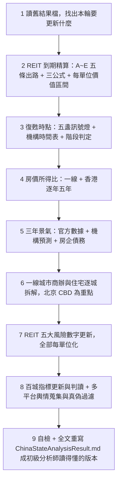

/goal
使用 latest claude OPUS model

# Routines — 中國房地產景氣 × 港股中國物業 REIT 投資判斷（初級分析師版）

> **本文件唯一排序原則：越重要的資訊，放越上面。**
> 第 1～3 章是「會改變買賣決策」的內容，第 4～7 章是判斷依據，第 8 章以後是規則與工具，供隨時回查。
> **每一輪的最後一個動作，一定是「全文重寫」結果檔**（不是往後追加），並且要重寫到**入行 1～2 年的初級股票分析師讀得懂**為止。

---

## 0. 三分鐘導讀

### 0.1 這份報告最終只回答兩句話

> **Q1（買不買）**：以現價買進、並長抱持有中國內地物業的港股 REIT，划不划算？
> → 必須是一個**數字對比**：`每單位價值區間（三情境）` vs `現價` → 明確寫 **高估／合理／低估**。寫在**第 1.3 節**。
>
> **Q2（什麼時候買）**：中國房地產**什麼時候復甦**？
> → 必須給出**季度級的時間點 ＋ 機率 ＋ 五盞訊號燈的現況**。寫在**第 2 章**。

### 0.2 一句話心法（初級分析師必背）

> 買美國、日本的 REIT，你買的是「**永久產權（Freehold）＋租金**」；
> 買中國物業的港股 REIT，你買的是「**一段有到期日的現金流**」。
> 所以看到 8%～12% 的高殖利率，第一個要問的不是「配息穩不穩」，而是「**這筆錢是租金，還是在退還你的本金？**」

### 0.3 六個子問題（依重要性排序，也就是本文件的章節順序）

| 排序 | 要回答的問題 | 為什麼這題會決定賺不賺錢 | 產出章節 |
|:--:|---|---|:--:|
| **1** | **REIT 手上的物件到期後怎麼辦？** | 中國土地**有年限**。到期怎麼處理，直接決定「資產最後值錢還是歸零」。**這決定買不買。** | **第 1 章** |
| **2** | **中國房地產什麼時候復甦？** | 決定「現在買，還是等」。復甦時點錯判一年，報酬率差距可以是一倍。**這決定什麼時候買。** | **第 2 章** |
| 3 | **房價所得比降到可以買的水位了嗎？** | 復甦的**第一個前提**是「一般人買得起」。房價所得比（Price-to-Income Ratio）是唯一能跨城市、跨市場比較的估值錨。 | 第 3 章 |
| 4 | **未來三年（2026–2028）景氣往哪走？** | 房地產鏈約占中國 GDP 與地方財政 20%～25%，是租金的**背景水位**；領先 REIT 租金與估值 2～4 個季度。 | 第 4 章 |
| 5 | **一線城市（尤其北京 CBD）景氣如何？** | 兩檔標的核心資產都在**北京**。全國均值對它們沒有意義，**北京 CBD 甲級寫字樓就是這兩檔的損益表**。 | 第 5 章 |
| 6 | **REIT 自身的財務與治理風險？** | 商辦通縮、匯率利率剪刀差、LTV 逼近上限，任一爆掉都會直接砍掉分派。 | 第 6 章 |

### 0.4 分析標的與檔案

- **主標的（只做個別 REIT，不做 REIT ETF）**：`01426` 春泉產業信託（Spring REIT）、`87001` 匯賢產業信託（Hui Xian REIT）。
- **對照組**：其他持有中國物業的港股 REIT，如 `00405` 越秀房託、`01503` 招商局商業房託。
- **主結果檔**：`AnalysisResult/ChinaStateAnalysisResult.md`（**每輪全文重寫**）。
- **強制遵守**：`AGENTS.md`（個股分析規則、REIT 分析規則、每股化、利多風險並重、中文回覆）。
- **讀者設定**：**入行 1～2 年的初級股票分析師**。名詞第一次出現要附英文＋一句白話；能用表格就不要寫長篇文章。

---

# 【最重點】第 1 章：REIT 物件「到期」後的後續處理方式

> 這一章沒有數字，整份報告就沒有價值。第 1.1～1.3 節必須出現實際數字。

## 1.1 兩檔標的的到期時間軸（先看地雷在哪，本機檔案已核實，每輪需覆核）

### ① `87001` 匯賢產業信託 — 典型的「B：無償移交，終值歸零」

| 項目 | 日期／數字 | 說明 |
|---|---|---|
| **合營期屆滿（真正的經濟終點）** | **2049-01-24** | 北京東方廣場公司合營期 1999-01-25 起算；屆滿後固定資產**無償歸中方**，土地要不要續期已與匯賢無關 |
| 北京土地使用權屆滿 | 2049-04-21 | 比合營期晚，但**不影響結論** |
| 重慶大都會東方廣場 | 2044-08-30 | 比北京**更早**到期 |
| 瀋陽物業 | 2042-07-01 | **最早到期的一筆（第一顆地雷）** |
| 北京東方廣場每單位估值 | 約 **RMB 3.9283/單位**（2026-06-30） | 占物業估值近九成 |
| **每年剛性折減** | 約 **RMB 0.175/單位/年** `(估)` | `3.9283 ÷ 22.4 年`，尚未計入租金續跌造成的額外重估 |
| 續期可能性 | 🔴 **極低** | 合資文件：需境內夥伴同意＋董事會一致同意＋當局批准；境內夥伴同意＝放棄無償拿到整座東方廣場 |

- **關鍵發展**：公司已在 2026 半年報**首度明講**「北京東方廣場權益價值將於剩餘期間逐步遞減，並於 2049 年合營期屆滿時**等於零**」，並開始**不再全額加回**未變現估值虧損。**官方等於承認了 NAV 剛性下折。**
- **結論的正確講法**：「P/NAV 打一二折」是**假便宜**，因為 NAV 裡近九成會歸零；真正屬於投資人的終值必須用「清算條款可回收的部分」重算，再折現。

### ② `01426` 春泉產業信託 — 典型的「A：可續期，但要補錢（金額未知）」

| 項目 | 日期／數字 | 說明 |
|---|---|---|
| 惠州物業 | **2048-02-01** | 🔴 比北京**早 5 年 8 個月**到期，**最早到期、最容易被忽略的地雷** |
| 北京華貿中心 1、2 座（辦公及停車） | **2053-10-28**（50 年期） | 主力資產 |
| 續期成本 | **未反映在 NAV** | 估值報告明文假設「毋須再付任何額外土地出讓金」 |
| 極端情境（皆無法續期） | 每單位僅剩帳上現金 | 必須算給投資人看：`帳上現金 ÷ 單位數`，並與現價對比 |

## 1.2 到期的五條出路 A～E（每一條都要算成「每單位多少錢」）

| 出路 | 機制 | 對投資人的財務結果 | 必算公式（每單位） |
|---|---|---|---|
| **A. 續期，補繳土地出讓金** | 到期前向政府申請續期，補錢換年限 | 一次性巨額資本支出 → 可能被迫**削減分派**或**折價供股**稀釋 | `預估續期地價總額 ÷ 在外流通單位數` |
| **B. 合營期屆滿，資產無償移交中方** | 中外合資／BOT 架構，期滿房子歸中方合營夥伴 | **終值＝0**。過去的高股息本質上是「退還本金（Return of Capital）」→ **殖利率陷阱（Yield Trap）** | 年折減 ＝ `(該物業帳面值 ÷ 剩餘年限) ÷ 單位數` |
| **C. 到期前提早出售物業** | 趁剩餘年限還長、買家還願意給價時處分 | 換回現金、避開歸零；但賣在房市低谷＝**永久失去未來現金流** | `預估處分淨額 ÷ 單位數`，並與現價比較 |
| **D. 被收購／私有化下市** | 大股東或第三方以折價收購全部單位 | 提前實現價值，通常有溢價，但價格由大股東主導 | `收購價 vs 每單位清算價值` |
| **E. 清算，按合約比例返還** | 依合資文件條款分錢（如註冊資本返還＋剩餘資產分成） | 拿回的是「合約寫的」，不是「帳上的 NAV」 | `(可回收現金 ＋ 註冊資本返還 ＋ 分成) ÷ 單位數` |

> **判斷 A 還是 B 的關鍵問句**：「**對方（境內合營夥伴／政府）有什麼誘因讓你續期？**」如果對方只要等就能無償拿到整棟樓，**續期的經濟誘因是零**。此時投資決策上應**假設無法續期**（走 B），而不是樂觀假設走 A。

## 1.3 三個必算公式 → 每單位價值區間 vs 現價（**買賣結論寫在這裡**）

```text
① 每年剛性折減（每單位）  = (該物業帳面價值 ÷ 剩餘年限) ÷ 在外流通單位數
② 續期補繳成本（每單位）  = 預估續期地價總額 ÷ 在外流通單位數
                            〔優先用廣州 2026-04-15 官方公式，見 1.5；標 (估)〕
③ 到期回收終值（每單位）  = (可回收現金 + 契約返還 + 分成) ÷ 單位數，再以合理折現率折現至今
```

用 ①②③ 跑三情境（**續期成功／無法續期／提前處分**），做出**每單位價值區間**，最後與**現價**比較，明確回答：**現價到底貴還是便宜。**

> **⚠️ 給初級分析師的重要提醒（每輪都要重講一次）**：在 10% 的折現率下，20 年後的一次性事件，現值只有幾分錢。**所以「到期」殺傷力不在 DCF，而在三件事**：
> ① **NAV 這個錨不能用了**（分母裡有一大塊會歸零）；② **它決定對手方有沒有誘因跟你談**；③ **每年的剛性折減會直接吃掉你的報酬**。

## 1.4 為什麼會這樣：中國物業 REIT 是「有終點的現金流」

中國土地全部國有，你買到的是**有年限的土地使用權（Land Use Rights）**：

| 用途 | 法定年限 | 本報告標的 |
|---|:--:|---|
| 住宅 | 70 年 | — |
| 工業 | 50 年 | — |
| **商業／綜合** | **40～50 年** | ✅ 春泉、匯賢皆屬此類 |

**所以 NAV（資產淨值）會有「剛性下折」**：房子還在，但「還能用幾年」一年比一年少，估值就得一年一年往下折，直到歸零或續期為止。**這種下折跟房市好壞無關，它必然發生。**

## 1.5 法律底層：到期到底怎麼算？（2026 年現況）

- **《民法典》第 359 條**：**住宅**建設用地使用權期滿**自動續期**；**非住宅**（＝商辦）期滿後的續期，「**依照法律規定辦理**」。
- **「依照法律規定」實務上指**：依《城市房地產管理法》第 22 條與《土地管理法》，採**申請報批模式**——權利人**至遲於屆滿前 1 年**報請原出讓機關批准；除因公共利益需收回外原則上應批准，並**重新簽訂出讓合同、支付土地出讓金**。→ 🟢 **續期在法律上是「原則准許」的，但要再付一次錢。**
- 🔴 **關鍵風險點**：**全國性的計價實施細則仍未出台**——補多少錢、地價怎麼評估，法律上是空白。
- 🟢 **首選定價錨（2026 年起改用）**：**廣州市《工商業用地使用權續期管理試點方案》（2026-04-15）**
  `續期費用 =（續期年期 ÷ 法定最高出讓年限）× 該用途法定最高年限標定地價 × 建築面積`；投資強度達標者按 **70%** 計收。
  **注意基準是「建築面積」不是「土地面積」**，用錯會低估 2～3 倍。
- 🔧 **禁用的錯誤錨點**：深圳 2004 年《到期房地產續期規定》的「補繳基準地價 **35%**」——該規定**只適用行政劃撥用地**，春泉、匯賢皆為**出讓**用地，**不適用**；且實例中實付僅市值 0.7%。**本報告不得再引為錨點。**
- **估值報告的陷阱**：多數估值師明文假設「毋須再支付額外土地出讓金」（春泉即為一例）。**續期成本根本沒被反映在 NAV 裡。**

## 1.6 「到期倒數」檢查清單（每輪逐項打勾）

- [ ] 每一項物業的**到期日**都查到了？（不只主力資產，**最早到期的那筆才是第一顆地雷**）
- [ ] 距今**剩餘年限**算了嗎？
- [ ] 公司**開始認列剛性減值了嗎**？（未認列＝未來一次痛，已認列＝年年痛）
- [ ] 續期成本**有沒有被寫進 NAV**？（多半沒有）
- [ ] 到期走 A～E 哪一條？**對方的誘因**支持這個判斷嗎？
- [ ] 高殖利率是**真租金**還是**退還本金**？

---

# 第 2 章：中國房地產「什麼時候復甦」（決定進場時點）

> **要交出的判斷**：一個**季度級的時間點**（例：2027 年 H1）＋**機率**＋**五盞訊號燈現況**＋**還缺哪一盞**。
> **不准只寫「持續觀察」**。沒有時間點，這章就是白寫。

## 2.1 先定義清楚：什麼叫「復甦」？（初級分析師最常含糊的地方）

**復甦不是一個點，是四個階段。每一輪都要明確講出「現在在第幾階段」。**

| 階段 | 名稱 | 白話定義 | 判斷指標（要同時成立） |
|:--:|---|---|---|
| **①** | **量的底**（成交量落底） | 賣得掉了，但還在降價賣 | 一線二手**成交套數**同比連 3 個月正成長 |
| **②** | **價的底**（價格止跌） | 不用再降價了 | 一線二手**價格環比**連 6 個月 ≥ 0，且同比跌幅收斂至 −1% 內 |
| **③** | **開發端的底**（供給落底） | 建商敢重新拿地、開工了 | 開發投資年增率降幅**連 2 季收窄**、到位資金年增率轉正、土地出讓金止跌 |
| **④** | **租金的底**（REIT 真正受惠） | 房東能漲租了 | 50 城住宅租金**同比轉正**、甲級商辦**續租租金調整率**由負轉正 |

> 🔑 **對本報告兩檔 REIT 而言，只有階段 ④ 才算真復甦。** 階段 ①② 只是住宅市場的事，**跟 REIT 的租金收入沒有直接關係**，中間還隔了 2～4 個季度的傳導時間差。**不要看到一線房價止跌就喊 REIT 要漲。**

## 2.2 復甦五盞訊號燈（每輪逐盞更新 🟢／🟡／🔴）

| # | 訊號燈 | 為什麼它是必要條件 | 轉綠的門檻 | 資料來源 |
|:--:|---|---|---|---|
| **1** | **房價所得比回到可負擔區間** | 買不起就不可能有需求。這是所有復甦的**前提** | 一線降到 **20 倍以下**、香港降到 **12 倍以下** | 見第 3 章 |
| **2** | **量先於價：一線二手成交量** | 量永遠領先價 1～2 季 | 同比連 **3** 個月正成長 | 各市房管局網簽 |
| **3** | **價格站穩：一線二手環比** | 確認買方不再殺價 | 環比連 **6** 個月 ≥ 0 | NBS 70 城 |
| **4** | **開發端資金回流** | 建商沒錢＝供給端無法正常化，地方財政也起不來 | 到位資金年增率**轉正**、國內貸款降幅收斂至 −10% 內 | NBS 開發經營月報 |
| **5** | **租金止跌（REIT 專屬）** | REIT 的收入端；房價可以靠政策撐，**租金撐不了** | 50 城租金**同比轉正**；甲辦續租租金調整率 > 0 | 中指研究院、REIT 財報 |

**輸出規定**：本章必須有一張「五盞燈現況表」＋一句話結論，格式如
`目前 X 綠 / Y 黃 / Z 紅 → 判定處於階段 ②，REIT 受惠時點推估 20XX 年 HX，信心度：中`

## 2.3 機構的復甦時點預測（必查，每輪更新並註明發布日）

必須以表格列出至少下列機構的**時間點**（不是只有百分比），並說明**分歧原因**：

| 機構 | 發布日 | 全國觸底時點 | 一線分城時點 | 對本報告的意義 |
|---|---|---|---|---|
| 高盛（Goldman Sachs） | | | | |
| 摩根士丹利（Morgan Stanley） | | | | |
| 惠譽（Fitch Ratings） | | | | |
| 瑞銀（UBS） | | | | |

> **⚠️ 強制查核項**：機構會**改口**。同一家機構的看空／看多報告可能只隔幾個月，**必須查到最新一份**，並在結果檔標 🔧 說明改口內容與日期。引用過期預測是本報告最容易犯的錯。

## 2.4 歷史對照（給時間感的錨）

- 全球過去 22 次房市危機，從**高點到落底**平均約 **6 年**。中國全國房價高點在 **2021 年**。
- 本輪必須算出並寫明：**距離高點已經幾年？** 依歷史平均推算的落底年份是哪一年？
- **但要提醒**：中國的特殊性在於「人口負成長 ＋ 地方財政依賴土地」，**歷史平均可能偏樂觀**。

## 2.5 🟢 支持提早復甦 Top 3 ／ 🔴 拖延復甦 Top 3

必列，各至少 3 點，每點要有數字。

---

# 第 3 章：房價所得比（一線城市 × 香港，過去五年逐年）

> **這一章回答**：房子跌了這麼多，**到底買得起了沒？** 這是第 2 章「復甦」的第一個前提，也是唯一能跨城市、跨市場比較的估值錨。

## 3.1 先講定義（不講清楚，數字就是廢的）

**房價所得比（Price-to-Income Ratio，PIR）＝ 一間房的總價 ÷ 一個家庭一年的收入**
白話：**不吃不喝幾年才買得起一間房。**

🔴 **但這個指標最大的坑是：每家機構的算法都不一樣，數字可以差一倍。** 引用時**一定要註明口徑**，且**同一列表格只能用同一個口徑**。

| 口徑 | 公式 | 常見數值（一線） | 特性 |
|---|---|:--:|---|
| **Demographia（中位數倍數 Median Multiple）** | 中位數房價 ÷ 中位數家庭**稅前**年所得 | 香港 14～23 | 🟢 **國際標準**，跨市場可比；用中位數，不受豪宅拉抬 |
| **麟評／中指（百城口徑）** | 城市新房均價 × 套均面積 ÷ 城鎮居民家庭年可支配收入 | 26～35 | 用**均價**，容易被高總價案量拉高 |
| **諸葛找房口徑** | 二手均價 × 人均住房面積 ÷ 人均可支配收入 | 30～37 | 用二手，較貼近真實供需 |
| **Numbeo（網友回報）** | 使用者自填 | 25～30 | ⚠️ **樣本非隨機**，只能當交叉參考，不可當主要依據 |

## 3.2 固定要做的表：逐年五年（**每輪必須重查**）

**表 A — 香港（Demographia 中位數倍數，單一口徑，可跨年比較）**

| 年度 | 2021 | 2022 | 2023 | 2024 | 2025 | 五年變化 |
|---|---:|---:|---:|---:|---:|---:|
| 香港中位數倍數 | | | | | | |
| 全球排名 | | | | | | |

**表 B — 中國一線城市（逐年，同一列必須同一口徑，缺口填 `N/A`）**

| 城市 | 2021 | 2022 | 2023 | 2024 | 2025 | 口徑／來源 |
|---|---:|---:|---:|---:|---:|---|
| 北京 | | | | | | |
| 上海 | | | | | | |
| 廣州 | | | | | | |
| 深圳 | | | | | | |
| 一線平均 | | | | | | |
| 全國百城平均（對照） | | | | | | |

## 3.3 判讀原則（必寫）

- **國際警戒線**：一般認為 **6～8 倍**為合理、**> 10 倍**即偏高。**一線城市長期在 20 倍以上，是全球極端值。**
- **下降的原因決定意義完全不同**：
  - 「**收入漲得比房價快**」→ 🟢 健康的改善，代表真實購買力上升。
  - 「**房價跌得比收入快**」→ 🟡 被動改善，代表**資產在縮水**，財富效應是負的。
  **必須明確講出目前是哪一種。** 2022 年以後的中國屬於後者。
- **香港 vs 一線不可直接相減**：口徑不同（中位數 vs 均價、稅前 vs 可支配）。要比較，只能比**下降幅度（%）**與**方向**。
- **與 REIT 的關聯**：房價所得比是**住宅**指標，對商辦 REIT 是**間接**影響——路徑是「可負擔性改善 → 交易量回升 → 財富效應 → 零售消費 → 商場租金」，時間差 **2～4 個季度**。**不要寫成直接因果。**

## 3.4 🟢 利多 ／ 🔴 風險

必列，各至少 3 點。

---

# 第 4 章：中國未來三年房地產景氣（2026–2028）

**要交出的判斷**：三年是「L 型底部橫盤」、「緩步修復」還是「二次下探」？並給出**機率**與**信心度**。

## 4.1 必查清單

1. **官方數據（NBS 國家統計局）**：房地產開發投資、商品房銷售面積／金額年增率（近 36 個月），判斷降幅是**收窄**還是**擴大**。
   > ⚠️ **必須把「銷售端」與「開發端」分開講。** 兩端經常方向相反（銷售磨底、開發續探），混在一起講必然誤導。
2. **機構預測區間**：Fitch、UBS、Goldman Sachs、Morgan Stanley、Reuters Poll 的年度銷售金額與房價預測，**列成表格並註明發布日**；分歧時要說明分歧原因。
3. **房企債務（信用風險傳導）**：
   - 萬科（`000002.SZ` / `02202.HK`）：公開債展期與兌付進度、國資（深圳地鐵）支援金額、最新盈警或損益。**注意：「零違約」與「巨額虧損」可以同時成立**——展期解決的是「流動性」，不是「獲利能力」。**還要看輸血方自己有沒有在流血。**
   - 碧桂園（`02007.HK`）、恒大（`03333.HK`）：重組／清算進度與市場隔離效果。
4. **政策**：收儲（地方國企收購存量商品房轉保障房）、白名單融資、限購與信貸鬆綁；**每一條都要找到一手官方公告**，找不到就標為未證實。
5. **結構性因素**：人口與新生兒數、城鎮化率、改善型需求 vs 剛性需求的比重變化。

## 4.2 輸出格式

三年逐年情境表（樂觀／基準／保守，**各給機率與觸發條件**）＋ 🟢 利多 Top 3 ／ 🔴 風險 Top 3。

---

# 第 5 章：一線城市房地產景氣（商辦優先，北京 CBD 為重中之重）

**為什麼排在住宅前面**：兩檔標的的核心資產都在**北京**（春泉＝北京華貿中心寫字樓；匯賢＝北京東方廣場）。**北京 CBD 的甲級寫字樓景氣，就是這兩檔的損益表。**

## 5.1 商辦面（**對 REIT 最關鍵**）

| 城市／子市場 | 甲級寫字樓空置率 | 較上季 | 平均租金（RMB/㎡/月） | 未來 12～24 個月新增供給 | 對標的的影響 |
|---|---|---|---|---|---|
| **北京 CBD**（春泉、匯賢所在） |  |  |  |  |  |
| 上海 |  |  |  |  |  |
| 深圳 |  |  |  |  |  |
| 重慶（匯賢大都會東方廣場） |  |  |  |  |  |

- **不同機構口徑不可互減**（高力 Colliers／JLL／戴德梁行／RET 的空置率定義不同）。**本報告固定以高力國際為基準口徑**，其餘並列對照。
- **續租租金調整率（Rental Reversion）比空置率更痛**：目前多為 **−5% ～ −20%**，且要送 3～6 個月免租期。
- **供給消化年數**必算：`未來新增供給 ÷ 近期年化淨吸納量`，標 `(估)`。這個數字直接決定租金還要跌多久。

## 5.2 住宅面（來源：NBS 70 城原始頁，必須回官網核對，不可抄二手摘要）

| 城市 | 新房環比 | 新房同比 | 二手環比 | 二手同比 | 二手成交套數 | 一句話判讀 |
|---|---|---|---|---|---|---|
| 北京 |  |  |  |  |  |  |
| 上海 |  |  |  |  |  |  |
| 廣州 |  |  |  |  |  |  |
| 深圳 |  |  |  |  |  |  |

> **口徑衝突處理原則**：NBS 70 城（網簽備案、核心城區為主、同質可比）與中指百城（掛牌＋成交、涵蓋外圍、均價）常常方向相反。**兩個都要列，並說明「核心區在漲、外圍在跌」的真相，不可只挑對自己論點有利的那個。**

## 5.3 分析重點

- **城市內部也會分化**：豪宅／核心學區 vs 外圍遠郊；CBD 甲級 vs 非核心園區。要說清楚錢往哪流。
- **「老破小」與收儲**：核心市區老舊小戶型總價跌到租售比 2.5%～3.5% 時，會出現價格底（Cap Rate Floor）；同時追蹤地方國企收儲進度。
- 🟢 利多 Top 3 ／ 🔴 風險 Top 3 必列。

---

# 第 6 章：REIT 自身的五大風險（每輪都要更新數字，全部每單位化）

| # | 風險 | 一句話白話 | 要抓的數字 |
|:--:|---|---|---|
| 1 | **商辦供過於求 × 租金通縮** | 大樓太多、租客縮編，續租只能降價還要送免租期 | 空置率、續租租金調整率（−5%～−20%）、免租期月數、NPI 年增率 |
| 2 | **幣別 × 利率雙重剪刀差** | 收租收 RMB，欠債欠 HKD/USD；內地降息、港美高息，兩頭夾殺 | RMB 與 HKD/USD 債務占比、有效融資成本、利息保障倍數、匯兌損益、**真實避險覆蓋率**（不可只抄管理層宣稱值） |
| 3 | **LTV 逼近 50% 法定上限** | 房子被估值師調降 → 分母縮小 → 借貸比率被動飆升 | 借貸比率現值、距 50% 的緩衝（百分點）、公允價值變動金額（每單位化）、**再跌 15% 的敏感度** |
| 4 | **跨境匯出 × 預扣稅** | 錢從內地匯到香港要先扣 **10% 預扣稅**，還要過外管局（SAFE）流程 | 實際稅負、匯出時滯、資金留存內地比重 |
| 5 | **外部管理與治理** | 管理費按資產規模（AUM）抽成，抽得再多也跟股東報酬無關；還可能**發新單位抵付管理費**稀釋你 | 管理費計算基礎、以單位抵付的比例、管理人自身持股、大股東質押與自由流通量 |

> **LTV 被動破表的三種解法，每一種都痛**：①扣留／停止配息還債 ②折價供股（永久稀釋）③賤賣核心物業（永久失去現金流）。

---

# 第 7 章：百城景氣指標（房市體溫計）

**要交出的判斷**：體溫計現在幾度、方向往上還往下。

## 7.1 固定要做的表

| 指標 | 最新值 | 環比 | 同比 | 上期值 | 發布日 | 判讀 |
|---|---|---|---|---|---|---|
| 百城**新建**住宅均價（RMB/㎡） |  |  |  |  |  |  |
| 百城**二手**住宅均價（RMB/㎡） |  |  |  |  |  |  |
| 百城**新房**漲／平／跌城市家數 |  | — | — |  |  |  |
| 百城**二手**漲／跌城市家數 |  | — | — |  |  |  |
| 50 城住宅平均租金（RMB/㎡/月） |  |  |  |  |  |  |

> 🔧 **本規格已於本版移除「國房景氣指數（Real Estate Climate Index）」**。原因：NBS 自 2025 年起已不在月度新聞稿中列示該指數，連續多輪查證皆為 `N/A`，維持該欄位只會製造假缺口。**若未來 NBS 恢復發布，再議是否重新納入。**

## 7.2 判讀原則（初級分析師最容易搞混的地方）

- **新房漲、二手跌 ≠ 市場回暖**：新房均價常因「高總價的核心區案量占比上升（結構效應）」被拉高，二手跌才是真實需求在退。**兩者背離時，以二手為準。**
- **看「漲跌城市家數」比看均價重要**：92:8 這種懸殊比，代表這是**全國性下行**，只有極少數核心城市例外。
- **租金同比為負的訊號**：租金是不動產的「本業收入」。**房價可以靠政策撐，租金撐不了**——租金續跌代表 REIT 的收入端沒有支撐。**這也是第 2 章的第 5 盞訊號燈。**
- **環比（MoM）看轉折，同比（YoY）看趨勢**：二手「環比由負轉正、同比仍為負」＝「跌幅收窄、正在築底」，**不是「已經反轉」**。

## 7.3 對 REIT 的傳導路徑與時間差（必畫）

住宅價格轉折 → REIT 租金反應約 **2～4 個季度**；租金轉折 → 估值報告反應約 **1～2 個季度**（估值師每半年做一次）。
**所以現在看到的 REIT 減值，反映的是一年前的租金。最新的供給潮還沒進到帳上。**

---

# 第 8 章：不可違反的鐵則（Invariants）

| 項目 | 規則 | 初級分析師最常犯的錯 |
|---|---|---|
| **每股（每單位）化 ⭐** | 只要出現絕對金額（億元），**強制**換算 `÷ 最新在外流通單位數` | 「減值 9.07 億」聽不出痛，「每單位 −RMB 0.1391」才有感。 |
| **禁用全國均值代表一線** | 北京、上海、廣州、深圳**必須逐城拆開**列出 | 用全國 −3% 推論北京 CBD，結論必錯。 |
| **口徑必須標註 ⭐** | 房價所得比、空置率、房價指數都有多種口徑。**同一列表格只能用同一口徑**，跨口徑只能比「變化幅度」不能比「絕對值」 | 把 Demographia 的 14.1 跟麟評的 26.1 放在同一列比大小。 |
| **機構預測必須查最新** | 同一家機構會改口。引用前先查是否有更新版本，有改口就標 🔧 | 沿用半年前的預測，結論整個作廢。 |
| **政策防偽** | 政策利多必須有一手官方公告（gov.cn／住建部／人行）；查無者標 `⚠️ 未經官方證實（不可採信）` | 自媒體「史詩級救市組合拳」照抄進報告。 |
| **來源優先序** | 官方（NBS／人行／住建部）＞ 國際投行（Fitch／UBS／Goldman／MS）＞ 專業機構（中指／麟評／諸葛／高力／戴德梁行／Demographia）＞ 媒體 ＞ 論壇 | 引用二手摘要卻不回官網原始頁核對，數字方向會抄錯。 |
| **利多風險並重** | 每章都要同時列 🟢 利多 與 🔴 風險（各至少 3 點） | 只講故事不講風險。 |
| **透明度標記** | 資料逾 6 個月標 `(舊)`；自行推估標 `(估)`；查不到填 `N/A` 並說明原因 | 把估算值寫成官方數據。 |
| **幣別** | 中國標 **RMB**、香港標 **HKD**、跨國標 **USD**；換算要附 `HKD/RMB`、`USD/HKD` 與**取價日** | 寫「賺了 9 億」卻不寫幣別，等於沒寫。 |
| **時間跨度** | 回顧近 **5 年**（房價所得比）＋ 近 3 年（景氣）＋ 展望未來 3 年 | 拿單月數據當趨勢。 |
| **檔案路徑** | 只讀寫本 repo（本機鏡像 `d:\FinancialReport\`）內的檔案 | 寫到暫存資料夾，下一輪就找不到。 |

---

# 第 9 章：執行流程（9 步）



**Step 1**：讀 `AnalysisResult/ChinaStateAnalysisResult.md`，列出上一輪結論，標記本輪有哪些**新數據發布**（NBS 月報、中指月報、REIT 中報／年報、公司公告、機構改口）。
**Step 2（最重點，先做）**：對應第 1 章。**先讀本機資料再上網**——`01426春泉Reit/`、`87001匯賢Reit/` 內有年報、中期業績公告與既有分析檔，**優先使用**（零延遲、資料完整）；不足再上 HKEXnews／公司 IR。三公式必須跑出實際數字。
**Step 3**：對應第 2 章。五盞燈逐盞更新，機構時間表**必須查到最新一份**（會改口）。
**Step 4**：對應第 3 章。房價所得比五年逐年，香港用 Demographia、一線標明口徑。
**Step 5～7**：對應第 4、5、6 章，**所有官方數據一律回官網原始頁核對**，禁止只採信媒體摘要。
**Step 8**：對應第 7 章＋輿情。輿情平台——雪球、富途/moomoo、東方財富股吧、LIHKG、PTT 房產板、Reddit、Seeking Alpha；同時檢查本機公司資料夾內既有的輿情檔。**要分辨「真實市場反饋」與「情緒噪音／假消息」並標可信度。**
**Step 9（每輪必做，不可省略）**：自檢後**全文覆寫**結果檔，並以「初級分析師讀得懂」為驗收標準重寫一次。

**Step 9 自檢清單（依重要性排序）**

- [ ] **第 1 章的三個公式都跑出實際數字、給出每單位價值區間並與現價比較了？**
- [ ] **第 2 章給出了明確的復甦季度時間點＋機率＋五盞燈現況？**（不准只寫「持續觀察」）
- [ ] **第 3 章的房價所得比是五年逐年、且每一列都標了口徑？**
- [ ] 所有金額都換算成**每單位**了？
- [ ] 每章都有 🟢 利多 與 🔴 風險？
- [ ] 機構預測都確認過**沒有更新版本**？有改口的都標 🔧 了？
- [ ] 未證實傳言都標記了？
- [ ] 資料逾 6 個月標 `(舊)`、推估標 `(估)`、查無標 `N/A`？
- [ ] 專有名詞第一次出現有附英文＋一句白話？
- [ ] **全文重寫過，而不是在舊文上補丁？**

---

# 第 10 章：結果檔骨架（`AnalysisResult/ChinaStateAnalysisResult.md`）

> **排序原則同本文件：結論在最上面，工具與附錄在最下面。**

```markdown
# 中國房地產景氣 × 港股中國物業 REIT 投資判斷

> 更新時間：YYYY-MM-DD hh:mm:ss（第 X 輪）
> 分析範圍：REIT 物件到期｜復甦時點｜房價所得比｜三年景氣｜一線城市｜REIT 五大風險｜百城指標
> 基準匯率：HKD/RMB = X.XXXX｜USD/HKD = X.XXXX（取價日：YYYY-MM-DD）
> 讀者：初級股票分析師

## 一、結論與投資建議（買賣結論 ＋ 進場時點，寫最前面）＋ 免責聲明
## 二、30 秒執行摘要（表格：主題 / 一句話結論 / 信心度 / 較上輪變化 / 依據）

## 三、REIT 物件到期後續處理方式（核心章，決定「買不買」）
  3.1 87001 匯賢：2049 無償移交時間軸、每單位年折減、清算可回收終值
  3.2 01426 春泉：2048 惠州／2053 北京、續期成本每單位試算、極端情境現金底
  3.3 五條出路 A~E 對照表與各標的歸屬判斷
  3.4 三情境每單位價值區間 vs 現價（**買賣結論的計算過程**）
  3.5 中國土地年限制度與 NAV 剛性下折
  3.6 法律現況：民法典 359 條、廣州 2026 官方續期公式、深圳 35% 為何不適用
  3.7 到期倒數檢查清單結果

## 四、什麼時候復甦？（決定「什麼時候買」）
  4.1 復甦四階段定義與目前所在階段
  4.2 五盞訊號燈現況表
  4.3 機構復甦時點預測彙整（含改口紀錄）
  4.4 歷史對照與時間錨
  4.5 🟢 支持提早復甦 ／ 🔴 拖延復甦

## 五、房價所得比（一線城市 × 香港，五年逐年）
  5.1 口徑說明（為何數字會差一倍）
  5.2 表 A：香港 Demographia 五年逐年
  5.3 表 B：中國一線城市五年逐年（標明口徑）
  5.4 判讀：是「收入漲」還是「房價跌」造成的改善？
  5.5 🟢 利多 ／ 🔴 風險

## 六、中國房地產未來三年景氣（2026–2028）
  6.1 總體走勢判斷（銷售端 vs 開發端要分開講，含機率）
  6.2 機構預測彙整表（Fitch / Goldman / MS / UBS / Reuters）
  6.3 房企債務進度（萬科、碧桂園、恒大）
  6.4 政策與傳言真偽核實
  6.5 🟢 利多 Top 3 ／ 🔴 風險 Top 3

## 七、一線城市房地產景氣
  7.1 商辦表（空置率／租金／新增供給／供給消化年數），北京 CBD 為重點
  7.2 北上廣深住宅逐城表（NBS 原始頁）＋ 口徑衝突拆解
  7.3 城市內部分化與老破小、收儲互動
  7.4 🟢 利多 ／ 🔴 風險

## 八、REIT 五大風險數字更新（商辦通縮／幣別利率／LTV／預扣稅／治理）

## 九、百城指標
  9.1 指標總表（新房／二手／漲跌家數／租金）
  9.2 判讀：新房與二手背離代表什麼、租金為何是關鍵
  9.3 對 REIT 的傳導路徑與時間差

## 十、社群輿情整理（平台 / 風向 / 多空 / 查證評估）
## 十一、與上一輪的結論異動（含「數據修正」要標 🔧）
## 十二、資料取得狀態（項目 / 取得與否 / 來源 / 日期 / 缺漏原因）
## 十三、⚠️ 待查與資料缺口
## 十四、下一輪追蹤項目與數據發布時程
## 附錄：必看指標速查表 ＋ 白話名詞對照表
```

---

# 第 11 章：對話框回覆格式

```text
✅ 中國房市 × 港股中國 REIT 分析 — YYYY-MM-DD hh:mm:ss
- 【買不買】每單位價值區間 vs 現價：<高估／合理／低估>
- 【何時買】復甦判定：階段 <①量底／②價底／③開發底／④租金底>｜五盞燈 X綠/Y黃/Z紅
  * REIT 受惠時點推估：20XX 年 HX（信心度：高/中/低）
- REIT 到期精算：
  * 87001 匯賢：2049-01-24 無償移交（剩 XX.X 年）｜年折減 RMB X.XXX/單位｜清算終值 RMB X.XX/單位 vs 現價 RMB X.XXX
  * 01426 春泉：惠州 2048-02-01／北京 2053-10-28｜續期成本 HK$X.XX~X.XX/單位｜無法續期底線 HK$X.XXX/單位
- 房價所得比：香港 XX.X 倍（五年 −XX%）｜一線平均 XX.X 倍｜深 XX / 京 XX / 滬 XX / 穗 XX
- 一線商辦：北京 CBD 空置率 XX.X%（較上季 X.X pp）｜續租租金調整率 −X%～−XX%｜供給消化需 X.X 年
- REIT 風險：借貸比率 XX.X%（距 50% 上限 X.X pp）｜NPI 年增率 X.X%
- 百城指標：新房 RMB X,XXX/㎡（環比 +X.XX%）｜二手 RMB X,XXX/㎡（環比 −X.XX%）｜漲跌家數 X:XX
- 三年景氣：銷售端 <L型/修復/下探>｜開發端 <收窄/擴大>｜機構區間 X%~Y%
- 資料取得：官方 X/Y 項｜機構預測 X/Y 家｜REIT 財報 X/2 家
- 與上輪異動：X 項強化、Y 項修正｜主結果檔已全文重寫
- 自檢：到期三公式 ✅｜復甦時間點 ✅｜房價所得比五年 ✅｜每單位化 ✅｜口徑標註 ✅｜利多風險並重 ✅｜說人話 ✅
```

---

# 附錄 A：必看指標速查表（工具區，隨時回查）

| # | 指標 | 誰發布／多久一次 | 白話怎麼看 | 對 REIT 的意義 |
|:--:|---|---|---|---|
| 1 | **續租租金調整率**（Rental Reversion） | REIT 財報／仲介行 | 舊租約到期換新租約，租金是漲還是跌。目前多為 **−5% ～ −20%**，且要送 3～6 個月免租期 | REIT 收入衰退的**主因**，比空置率更痛 |
| 2 | **甲級寫字樓空置率**（Vacancy Rate） | 高力（Colliers）／戴德梁行／JLL | 北京、上海 CBD 已在 15%～20%+；深圳部分逾 25%。**各家口徑不同，不可互減** | **直接**決定 REIT 的出租率與議價能力 |
| 3 | **房價所得比**（Price-to-Income Ratio） | Demographia（年度）／麟評、諸葛（年度） | 不吃不喝幾年買得起一間房。國際合理區 6～8 倍 | 復甦的**第一個前提**；決定住宅需求何時回來 |
| 4 | **租售比 / 資本化率**（Rental Yield / Cap Rate） | 自行計算：年租金 ÷ 物業價格 | 住宅租售比回到 2.5%～3.5% 時，長租買盤會進場撐住價格底 | 估值師定 Cap Rate → 直接影響 NAV |
| 5 | **NBS 70 城房價指數** | NBS／每月中旬（2026 年起改以 **2025 年為基期**） | 分「新建商品住宅」與「二手住宅」，各有環比／同比 | 逐城拆解一線的唯一官方權威來源 |
| 6 | **二手房成交量（套數）** | 各地房管局／中原、貝殼 | **量先於價**：成交量回升通常領先房價 1～2 季 | 最早的落底訊號（復甦第 2 盞燈） |
| 7 | **百城價格指數**（China Index Academy 100-City Index） | 中指研究院／**每月月初**發布上月 | 新房均價受建商促銷干擾；**二手房均價才是真實供需**。看「環比%」與「漲跌城市家數」 | 房價 → 財富效應 → 商場消費 → 零售租金 |
| 8 | **開發投資 / 銷售面積 年增率** | NBS／每月 | 判斷是「L 型築底」還是「續探」。**銷售端與開發端要分開看** | 決定三年展望的主基調 |
| 9 | **50 城住宅租金** | 中指研究院／每月 | **同比轉正**才是 REIT 真正的復甦訊號 | 復甦第 5 盞燈，REIT 收入端的直接對照 |

**兩個必背小抄**

- **環比（MoM）vs 同比（YoY）**：環比＝跟上個月比，看**轉折**（領先）；同比＝跟去年同月比，看**趨勢**（確認）。當二手房「環比由負轉正、同比仍為負」，標準解讀是「**跌幅收窄、正在築底**」，不是「已經反轉」。
- **NPI（Net Property Income，物業收入淨額）**：租金收入扣掉物業直接開支後的錢，是 REIT 能拿去配息的源頭。NPI 掉 → DPU（每單位分派）掉。

---

# 附錄 B：白話名詞對照表

| 名詞 | 英文 | 一句話白話 |
|---|---|---|
| 房價所得比 | PIR (Price-to-Income Ratio) | 不吃不喝幾年才買得起一間房；**口徑不同，數字可以差一倍** |
| 中位數倍數 | Median Multiple | Demographia 的房價所得比算法，用中位數，**國際間唯一可比的口徑** |
| 資產淨值 | NAV (Net Asset Value) | 資產減負債後的帳面價值；**有到期日的資產，NAV 會被高估** |
| 土地出讓金 | Land Premium | 向政府取得土地使用權要付的錢；**續期時要再付一次，且多半沒算進 NAV** |
| 殖利率陷阱 | Yield Trap | 看起來配很高，其實是在把你的本金還給你 |
| 每單位分派 | DPU (Distribution Per Unit) | REIT 每一個單位配給你的錢，等於股票的每股股利 |
| 物業收入淨額 | NPI (Net Property Income) | 租金扣掉物業開支後的錢，配息的源頭 |
| 借貸比率 | Gearing Ratio / LTV | 總計息負債 ÷ 總資產；香港 REIT 法定上限 **50%** |
| 續租租金調整率 | Rental Reversion | 舊約換新約，租金漲跌幾 % |
| 淨吸納量 | Net Absorption | 一段期間內「新增被租走的面積」；**除新增供給＝要幾年才消化得完** |
| 資本化率 | Cap Rate | 年淨租金 ÷ 物業價值；估值師用它決定房子值多少 |
| 折價供股 | Rights Issue | 打折向股東要錢，你不掏錢就被稀釋 |
| 預扣稅 | Withholding Tax | 錢匯出中國前先被扣掉的稅（一般 10%） |