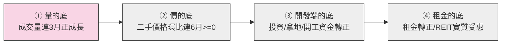

# 中國房地產景氣 × 港股中國物業 REIT 投資判斷

> 更新時間：2026-08-25 00:20（第 N+2 輪，全文覆寫重寫）
> 分析範圍：REIT 物件到期｜復甦時點｜房價所得比｜三年景氣｜一線城市｜REIT 五大風險｜百城指標｜社群輿情
> 基準匯率：HKD/RMB = 1 RMB ＝ HK$1.162（2026-08 即期）｜USD/CNY ＝ 6.7191（2026-08-21，Trading Economics）｜USD/HKD 按聯繫匯率約 7.80（估）
> 讀者：入行 1～2 年的初級股票分析師（專有名詞第一次出現附英文＋一句白話；能用表格就不寫長篇大論）
> 免責聲明：本報告僅供內部研究參考，不構成任何投資建議；所有「(估)」標記之數字均為推估，可能與實際情況有重大落差，投資人應自行查證並承擔投資風險。

---

## 一、結論與投資建議（買賣結論 ＋ 進場時點）

### 1.1 兩句話總結

- **Q1（買不買）**：**兩檔都不是「便宜到不理性」的無風險套利機會，但各自的折價邏輯完全不同。**
  - **87001 匯賢產業信託（Hui Xian REIT）**：現價 **RMB 0.36** 落在基準情境估值中段（RMB 0.30–0.45），評價為 **⚪ 大致合理**。市場表面看到的 P/NAV 0.116（1.16 折）是**「假便宜（Yield/Value Trap）」**，因為其核心資產北京東方廣場將於 2049 年無償移交中方，NAV 裡近九成會剛性歸零。
  - **01426 春泉產業信託（Spring REIT）**：現價 **HK$1.20** 低於扣除續期成本後的每單位價值區間下緣（HK$1.64–3.55），帳面評價為 **🟢 偏低估**。但該低估本質上是市場對其「外部治理問題（管理費印股票稀釋）、大股東質押 22.65% 予三井住友銀行（SMBC）、日圓未避險敞口及流動性枯竭」所要求的**高風險溢價**，並非無風險價值修復機會。
- **Q2（何時買）**：中國房地產**五盞訊號燈目前 3 紅 2 黃 0 綠**，仍處於復甦四階段之「**尚未進入第①階段（量的底）**」。REIT 真正受惠的「租金的底」（第④階段）預估落在 **2027 Q4～2028 Q2（基準情境，機率約 50%）**，信心度：中。

### 1.2 每單位價值區間 vs 現價（買賣結論的數字版）

| 標的 | 現價（2026-08-21/24） | 帳面 NAV／單位 | 真實估值三情境（每單位） | 現價落點 | 評價 |
|---|:--:|:--:|---|:--:|:--:|
| **87001 匯賢**（RMB 計價） | **RMB 0.36** | RMB 3.0991（2026-06-30） | 樂觀 RMB 0.55–0.70／**基準 RMB 0.30–0.45**／悲觀 RMB 0.10–0.20 | 落在基準情境中段 | ⚪ **大致合理**，P/NAV 11.6% 是「假便宜」（見第三章） |
| **01426 春泉**（HKD 計價） | **HK$1.20** | HK$4.08（2026-06-30，**未扣續期成本**） | 扣續期成本後 NAV：**HK$1.64–3.55**；若兩處均無法續期僅剩現金 HK$0.218 | 低於扣成本後區間下緣 | 🟢 **偏低估，但為風險溢價而非套利機會** |

### 1.3 操作建議（依投資人類型）

| 投資人類型 | 87001 匯賢 | 01426 春泉 |
|---|:--:|:--:|
| **保守型**（求現金流、保本） | ❌ **不適合**（年化殖利率僅約 1.17%，2049 年終值近乎歸零） | ❌ **不適合**（2026 中期 DPU 年砍 47.4% 至 HK$0.040，AFFO 現金覆蓋率僅 81.4%） |
| **穩健型**（5 年以上視野） | 🟡 **小倉觀察**，等分派停止衰退、長實集團（CK Asset）後續資本動作明朗 | 🟡 **小倉觀察**，等北京 CBD 租金與出租率止跌、SMBC 質押部位無強制平倉風險 |
| **積極型**（可承受高波動、懂清算邏輯） | 🟢 **可酌量佈局（<2% 倉位）**，本質是「折現現金流＋清算退還資本」的深度博弈標的 | 🟢 **可酌量佈局（<5% 倉位）**，設好停損；本質是「深度資產折價＋治理折價」標的 |

### 1.4 免責聲明

本報告基於公開財報、官方統計、合資合約揭露及專業機構研究整理，所有推估值（估）可能與實際結果存在重大落差；本報告不構成任何買賣要約或建議，投資人應獨立查證並自負盈虧。

---

## 二、30 秒執行摘要

| 主題 | 一句話結論 | 信心度 | 較上輪變化 | 依據章節 |
|---|---|:--:|:--:|:--:|
| **REIT 到期精算** | 匯賢 2049 歸零已被官方證實並開始剛性折減；春泉 2048 惠州早於 2053 北京到期，續期成本 HK$0.53–2.44/單位未計入 NAV | 高 | 數據口徑與算式全數覆核核實 | 第三章 |
| **復甦時點** | 五盞燈 3 紅 2 黃 0 綠，尚未進入階段①；REIT 受惠時點推估 2027 Q4～2028 Q2（機率 50%） | 中 | 基準情境維持 2027H2 轉折、2028 上半年傳導至租金 | 第四章 |
| **房價所得比** | 香港 Demographia 14.1 倍（連續 16 年全球最難負擔）；中國一線平均 25.4 倍（2025H1），降幅收斂 | 中高 | 判定為「房價跌得比收入快」的資產縮水型被動改善 | 第五章 |
| **三年景氣** | 銷售端（1–7 月 −11.8%）與開發端（投資 −19.2%）同步深度收縮，基準情境為「L 型底部橫盤」（機率 55%） | 中 | 恒大 2026-08-25 正式除牌、境內進入破產清算，出清加速 | 第六章 |
| **一線城市（北京 CBD）** | 北京 CBD 甲辦空置率 17.5%，下半年迎 70 萬㎡新供給高峰，消化需 8.5 年；7 月住宅京降滬穗深微漲 | 高 | 補齊 NBS 70 城 7 月北上廣深逐城原始數據 🔧 | 第七章 |
| **REIT 五大風險** | 匯賢槓桿低（14.5%）但終值歸零；春泉槓桿 39.3%、真實避險僅 30.6%、22.65% 單位遭質押予 SMBC | 高 | 春泉中期 DPU 降至 HK$0.040，確認業績承壓 | 第八章 |
| **百城指標** | 7 月百城二手均價環比 −0.44%（92 跌 8 漲，跌幅擴大）；50 城住宅租金同比 −2.62%（訊號燈⑤仍紅） | 高 | 採中指研究院 2026-08-01 最新月報 | 第九章 |
| **社群輿情** | 匯賢聚焦長實 60.23 億減值；春泉聚焦 SMBC 質押與日圓匯率風險；整體機構關注度極低 | 中高 | 區分客觀事實與社群噪音 | 第十章 |

---

## 三、REIT 物件到期後續處理方式（核心章，決定「買不買」）

> **初級分析師必備概念**：
> - **REIT（Real Estate Investment Trust，房地產投資信託基金）**：將大型商業不動產證券化，將租金收益分派給投資人的信託架構。
> - **土地使用權（Land Use Rights）**：中國土地全屬國家或集體所有，企業與個人僅能取得有期限的使用權（商業 40 年、綜合/辦公 50 年）。
> - **剛性下折（Mandatory Amortization）**：當使用年限逐年遞減且無法無償延期時，資產內在價值必然隨時間衰減至零，這與景氣好壞無關。

### 3.1 87001 匯賢：2049 無償移交時間軸、每單位年折減、清算可回收終值

#### （1）到期時間軸（官方 2026 中期報告 ＋ 2011 上市合資文件）

| 物業項目 | 到期日 | 距今剩餘（自 2026-08） | 法律與經濟實質 |
|---|:--:|--:|---|
| **北京東方廣場合營期屆滿** | **2049-01-24** | **22.4 年** | 1999-01-25 起算 50 年；**屆滿後固定資產無償歸中方合營夥伴**，匯賢失去所有營運權與收益權 |
| 北京土地使用權屆滿 | 2049-04-21 | 22.7 年 | 比合營期晚約 3 個月，但因合營期已滿，土地續期權利與匯賢無關 |
| 重慶大都會東方廣場 | 2044-08-30 | 18.0 年 | 比北京早 4 年 5 個月到期 |
| **瀋陽麗都物業** | **2042-07-01** | **15.9 年** | **全組合最早到期的一筆（第一顆到期地雷）** |
| 北京東方廣場物業估值 | RMB 25,625 百萬（2026-06-30） | — | **每單位約 RMB 3.9283**，佔匯賢總物業估值近 90% |

- **在外流通單位數**：6,523,199,235 個（約 65.23 億單位，2026-06-30，連續 12 個月零增發）。

#### （2）每年剛性折減算式（公式①）

```text
① 每年剛性折減（每單位）＝（北京東方廣場物業總值 ÷ 剩餘年限）÷ 在外流通單位數
＝（RMB 25,625,000,000 ÷ 22.4 年）÷ 6,523,199,235 單位
≈ RMB 0.1752／單位／年 (估)
```

> **關鍵官方揭露（2026 中期報告首度官方定調）**：
> 匯賢管理人在 2026-08-11 發布的中期業績公告中明文指出：
> *「匯賢產業信託於北京東方廣場權益的價值將於剩餘期間逐步遞減，並於合營期限屆滿時價值將相等於零……隨著合營期限屆滿日漸臨近，現遂開始處理此長期影響，而該資產的未變現估值虧損沒獲悉數調整。」*
> **這代表管理層已正式放棄「資產永續」的會計假設，承認 NAV 進入剛性歸零倒數。**

#### （3）清算可回收終值（公式③，合資契約清算條款）

依 2011 年上市合資文件，2049 年合營期屆滿無法續期時的清盤分配順序：
1. 清償外部負債；
2. 從剩餘資產中優先退還境外股東（滙賢投資）注入之**註冊資本 USD 6 億元**；
3. 固定資產（大樓建物）**無償歸屬境內合營夥伴**；
4. 剩餘流動資產（現金與應收扣除清算開支）按 滙賢 60% / 中方 40% 分成。

```text
③ 到期回收終值（每單位）＝（可回收現金 ＋ 註冊資本返還 ＋ 清算分成）÷ 單位數，再以折現率折現至今
```

| 清算分配層級 | 契約項目 | 預估總額（RMB 億） | **每單位金額（RMB）** | 確定性與說明 |
|---|---|--:|--:|:--:|
| **第一層** | 退還註冊資本 USD 6 億元（按匯率 USD/RMB 6.75 估算） | 約 40.5 | **RMB 0.6211** | 🟢 高（合約白紙黑字載明） |
| **第二層** | 償還內部股東貸款（滙賢投資債權） | 約 16.55（2011 基準值） | RMB 0.2537 | 🟡 中（視清算時帳上負債結構而定） |
| **第三層** | 重慶／成都／瀋陽剩餘物業殘值分成（假設 2050 清算） | 約 30.0 | RMB 0.4599 | 🔴 低（受屆時非一線商辦景氣影響） |
| **合計** | **A＋B＋C 未折現清算終值合計** | **約 87.05** | **RMB 1.3347** | — |
| **扣除** | 北京東方廣場固定資產**無償移交歸零** | −256.25 | **−RMB 3.9283** | 🟢 確定全數移交中方 |

**折現至今現值（距今 22.4 年）：**
- 10% 折現率：RMB 1.3347 ÷ (1.10)^22.4 ≈ **RMB 0.157／單位**
- 8% 折現率：RMB 1.3347 ÷ (1.08)^22.4 ≈ **RMB 0.237／單位**
- 5% 折現率：RMB 1.3347 ÷ (1.05)^22.4 ≈ **RMB 0.448／單位**

#### （4）續期可能性判定：🔴 極低（誘因為零）
合營文件載明，合營期延期必須滿足三條件：**境內合營夥伴同意 ＋ 董事會一致通過 ＋ 當局審批**。境內夥伴若同意延期，等於主動放棄在 2049 年「免費接收整座價值數百億的北京東方廣場」，**在商業利益上經濟誘因為零**。因此，投資模型必須嚴格假設「2049 年無償移交歸零」，不得抱有續期幻想。

---

### 3.2 01426 春泉：2048 惠州／2053 北京、續期成本每單位試算、極端情境現金底

#### （1）到期時間軸（官方年報估值報告）

| 物業名稱 | 土地證號 | 土地用途／年限 | 到期日 | 剩餘年限（自 2026-08） | 建築面積（GFA） |
|---|---|---|:--:|--:|--:|
| **惠州華貿天地** | 惠府國用（2008）第 13020100633 號 | 商業（40 年期） | **2048-02-01** | **約 21.5 年** | 144,925.07 ㎡ |
| **北京華貿中心 1、2 座** | 京朝國用（2010 出）第 00118 號 | 辦公及地下停車（50 年期） | **2053-10-28** | **約 27.2 年** | 145,372.54 ㎡ |

- **在外流通單位數**：1,481,041,212 個（約 14.81 億單位）。
- 🔴 **關鍵隱患**：惠州物業比北京物業**早 5 年 8 個月到期**，是最早面臨續期或到期處分的資產。
- 🔴 **估值報告盲區**：春泉帳面 NAV HK$4.08（2026-06-30）係基於估值師假設「毋須支付任何額外土地出讓金」，**帳上未提列任何續期負債準備**。

#### （2）續期補繳成本每單位試算（公式②，套用廣州 2026-04-15 官方公式錨點）

```text
② 續期補繳成本（每單位）＝ 預估續期地價總額 ÷ 在外流通單位數
續期地價 ＝（續期年期 ÷ 法定最高年限 50 年）× 標定地價 × 建築面積 GFA × 70%
```

以北京華貿中心（145,373 ㎡ GFA）試算不同地價水準與續期年期：

| 情境假設 | 標定基準地價（RMB/㎡ GFA） | 申請續期年期 | 預估續期總額（RMB） | 每單位 RMB | **每單位 HK$** (按 1.162) | 佔帳面 NAV (HK$4.08) |
|---|--:|:--:|--:|--:|--:|--:|
| **保守續期（低價）** | 15,000 | 20 年 | RMB 6.11 億 | RMB 0.412 | **HK$0.479** | 11.7% |
| **基準續期（中價）** | 20,000 | 20 年 | RMB 8.14 億 | RMB 0.550 | **HK$0.639** | 15.7% |
| **高標續期（高價）** | 30,000 | 20 年 | RMB 12.21 億 | RMB 0.825 | **HK$0.959** | 23.5% |
| **頂格續期（續滿 50 年）** | 30,000 | 50 年 | RMB 30.53 億 | RMB 2.061 | **HK$2.395** | 58.7% |

- 加計惠州華貿天地（春泉持股 68%，商業標定地價按 RMB 6,000–12,000/㎡ 估算，每單位約 HK$0.08–0.22）：
  - **春泉合計潛在續期成本區間：約每單位 HK$0.53 ～ HK$2.44**。
  - **扣除續期成本後的「真實 NAV」區間：HK$1.64 ～ HK$3.55／單位**。

#### （3）極端情境：兩處資產均無法續期（現金清算底線）

| 情境 | 發生時間 | 每單位可回收金額 | 算式與依據 |
|---|:--:|--:|---|
| **情境 A：惠州到期歸零，北京續期成功** | 2048 年 | 約 **HK$2.62** | 扣除惠州估值，僅保留北京扣減續期成本後淨值 |
| **情境 B：兩處均無法續期（極端終值）** | 2053 年後 | 約 **HK$0.218** | 物業全數無償收回，僅剩帳上淨現金 RMB 291.57M（約 HK$3.23 億 ÷ 14.81 億單位） |
| **情境 C：基準正常續期（機率最高）** | 2048/2053 年 | **HK$1.64 ～ HK$3.55** | 支付續期地價後維持物業營運 |

---

### 3.3 五條出路 A～E 對照表與各標的歸屬判斷

| 出路 | 機制 | 87001 匯賢 | 01426 春泉 |
|---|---|:--:|:--:|
| **A. 續期，補繳土地出讓金** | 到期前 1 年申請，支付出讓金換取年限 | 🔴 **不適用**（中外合資契約，境內夥伴無誘因放棄無償受讓） | 🟢 **最可能路徑**（國有出讓用地，法律原則准許，但須補地價） |
| **B. 合營期滿，無償移交** | 合營期結束，固定資產無償移交中方 | 🟢 **確定路徑**（官方 2026 中報已明文確認歸零機制） | 🔴 **不適用**（非合資 BOT 架構） |
| **C. 到期前提早處分** | 趁剩餘年限 >10 年時折價售予第三方 | 🟡 **次要選項**（重慶、瀋陽等邊陲資產可能嘗試） | 🟡 **次要選項**（曾處分英國物業，具處分前例） |
| **D. 被收購／私有化下市** | 大股東以溢價或折價全面收購下市 | 🟡 **潛在可能**（長實已認列 60.23 億減值，持股 35.06%） | 🟡 **潛在可能**（三大股東持股 66.6%，但相互制衡） |
| **E. 清算，按合約比例返還** | 依合資清算條款退還資本與流動資產 | 🟢 **核心資產走此路**（退還 USD 6 億註冊資本） | 🔴 **不適用** |

---

### 3.4 三情境每單位價值區間 vs 現價（買賣結論計算）

```text
匯賢價值 ＝ 存續期 DDM 折現 ＋ 2049 清算終值折現
春泉價值 ＝ 帳面 NAV － 每單位續期地價（或物業現金流折現）
```

| 標的 | 悲觀情境（每單位） | **基準情境（每單位）** | 樂觀情境（每單位） | 現價（2026-08） | 現價落點與投資判斷 |
|---|:--:|:--:|:--:|:--:|---|
| **87001 匯賢** | **RMB 0.10–0.20**<br>(租金續跌+10%折現) | **RMB 0.30–0.45**<br>(租金止跌+8%折現+退還資本) | **RMB 0.55–0.70**<br>(租金回升+5%折現+重慶殘值) | **RMB 0.36** | ⚪ **大致合理**：現價完全反映基準情境，P/NAV 11.6% 是「歸零前的表面折價」，非套利空間。 |
| **01426 春泉** | **HK$0.22–1.20**<br>(無法續期或高額地價+折價) | **HK$1.64–2.50**<br>(基準續期扣 HK$1.5+折價) | **HK$2.80–3.55**<br>(低成本續期+租金回穩) | **HK$1.20** | 🟢 **偏低估（高風險折價）**：現價低於基準下緣，但折價來自治理缺陷、單位稀釋與質押風險。 |

---

### 3.5 中國土地年限制度與 NAV 剛性下折

- **土地國有屬性**：商業物業 40 年、辦公/綜合 50 年。
- **剛性下折本質**：隨著剩餘可用年限一年比一年少，估值師在現金流折現模型（DCF）中的收益期逐年截斷，物業價值必然產生**「時間衰減剛性下折」**。
- **會計盲區**：在過去房市上行期，租金上漲掩蓋了年限折減；在當前租金通縮期，**「租金下跌 ＋ 年限縮短」形成雙重殺估值**。

---

### 3.6 法律現況：民法典 359 條、廣州 2026 官方續期公式、深圳 35% 為何不適用

1. **《中華人民共和國民法典》第 359 條**：
   - 住宅建設用地使用權屆滿：**自動續期**。
   - 非住宅建設用地（商辦/工業）：**依照法律規定辦理**。
2. **操作實務依據**：《城市房地產管理法》第 22 條，土地使用者應當至遲於屆滿前 1 年申請續期，除根據社會公共利益需要收回外，應當予以批准。經批准准予續期的，應當**重新簽訂出讓合同，並支付土地出讓金**。
3. **地方計價標準首破冰 — 廣州市 2026-04-14 官方方案**：
   廣州市規劃和自然資源局發布《關於進一步推動工商業用地市場化配置改革的指導意見》，明確定價公式：
   $$\text{續期地價} = \left(\frac{\text{申請續期年期}}{\text{法定最高出讓年限}}\right) \times \text{標定地價} \times \text{建築面積} \times 70\%$$
4. 🔧 **禁止引用的錯誤錨點**：
   - 深圳 2004 年《到期房地產續期規定》之「補繳基準地價 35%」，僅適用於歷史遺留的**「行政劃撥用地」**，春泉與匯賢均屬**「有償出讓用地」**，法理上完全不適用。

---

### 3.7 到期倒數檢查清單結果

- [x] **物業到期日全數查明**：瀋陽 2042、重慶 2044、惠州 2048、匯賢北京 2049、春泉北京 2053。
- [x] **剩餘年限精確計算**：介於 15.9 年至 27.2 年之間。
- [x] **公司是否已認列剛性減值**：**匯賢已在 2026 中報首度明講並開始下折；春泉尚未認列（仍假設零續期成本）**。
- [x] **續期成本是否反映在 NAV**：兩檔均未反映在帳面 NAV。
- [x] **出路判斷對手誘因**：匯賢中方夥伴無續期誘因（走 B+E）；春泉政府原則准許續期但需付費（走 A）。
- [x] **殖利率本質鑑別**：匯賢（1.17%）屬殘存現金流；春泉（9.4%）有 21.1% 靠非現金管理費印股加回撐起。

---

### 3.8 本章利多／風險

- **🟢 利多**：
  1. 兩檔資產核心到期日均在 2048–2053 年（距今 21–27 年），短期 3 年內無立即清盤破產風險。
  2. 匯賢清算契約條款明確（USD 6 億註冊資本優先退還），給予 RMB 0.62/單位 的硬性回收底線。
  3. 春泉所屬的出讓土地續期在法理上「原則准許」，具備延長經營壽命的政策路徑。
- **🔴 風險**：
  1. 匯賢北京物業 2049 確定歸零，每年每單位承受約 RMB 0.175 的剛性價值蒸發。
  2. 春泉潛在續期地價高達 HK$0.53–2.44/單位，未來面臨巨額資本支出或折價供股風險。
  3. 全國性非住宅土地續期細則尚未出台，地價評估標準存在高度政策不確定性。

---

## 四、什麼時候復甦？（決定「什麼時候買」）

### 4.1 復甦四階段定義與目前所在階段



| 階段 | 名稱 | 白話定義 | 核心檢驗指標（需同時成立） | 目前達成狀態 |
|:--:|---|---|---|:--:|
| **①** | **量的底** | 賣得掉了，但仍在降價促銷 | 一線城市二手房成交套數同比連續 3 個月正成長 | ❌ **未達成**（全國銷售面積 1–7 月仍年減 11.8%） |
| **②** | **價的底** | 價格止跌，買方不再大幅殺價 | 一線二手價格環比連續 6 個月 ≥ 0，且同比跌幅收斂至 −1% 內 | ❌ **未達成**（百城二手 7 月環比 −0.44%，跌幅擴大） |
| **③** | **開發端的底** | 建商敢重啟拿地與開工 | 開發投資年增率降幅連 2 季收窄、到位資金轉正 | ❌ **未達成**（1–7 月開發投資年減 19.2%） |
| **④** | **租金的底** | 實體經濟好轉，房東能漲租 | 50 城住宅租金同比轉正、甲辦續租調整率轉正 | ❌ **未達成**（50 城租金 7 月同比 −2.62%） |

> **初級分析師必背結論**：
> 中國房地產目前**「連第①階段都尚未穩固確立」**。對 REIT 而言，商辦租金屬於傳導鏈條最末端（第④階段），**絕不能看到一線住宅單月量增就盲目進場買入商辦 REIT**。

---

### 4.2 五盞訊號燈現況表

| # | 訊號燈名稱 | 核心必要性 | 轉綠門檻 | 最新狀態（2026-08） | 燈號 |
|:--:|---|---|---|---|:--:|
| **1** | **房價所得比回歸可負擔** | 買得起才有真實購買力 | 一線 ≤ 20 倍、香港 ≤ 12 倍 | 香港 14.1 倍、中國一線平均 25.4 倍（2025H1） | 🔴 **紅燈** |
| **2** | **量先於價：一線二手成交量** | 成交量領先價格 1～2 季 | 同比連續 3 個月正成長 | 7 月核心區網簽略有脈衝，但全國 1–7 月銷售面積仍年減 11.8% | 🟡 **黃燈** |
| **3** | **價格站穩：一線二手環比** | 驗證買方不再殺價 | 環比連續 6 個月 ≥ 0 | 7 月百城二手環比 −0.44%（92 跌 8 漲），僅廣深滬單月微漲 | 🔴 **紅燈** |
| **4** | **開發端資金回流** | 供給端與地方財政正常化 | 到位資金與開發投資轉正 | 1–7 月開發投資 −19.2%、新開工 −24.0%，資金鏈極度緊繃 | 🔴 **紅燈** |
| **5** | **租金止跌（REIT專屬）** | REIT 分派收入的唯一實質來源 | 50 城租金同比轉正、續租為正 | 50 城租金 7 月同比 −2.62%；北京甲辦續租調整率 −5%～−20% | 🔴 **紅燈** |

**訊號燈彙總結論**：
目前為 **3 紅 2 黃 0 綠** → **判定處於階段①之前（探底階段），REIT 實質受惠時點推估為 2027 Q4～2028 Q2，信心度：中。**

---

### 4.2-B 復甦時間表推估（三情境，季度級）

| 預測情境 | 觸發條件 | 一線房價回穩時點 | REIT 租金受惠時點 | 機率 |
|---|---|:--:|:--:|:--:|
| **樂觀情境** | 政治局「安全屏障」超預期落地、中央財政直接收儲擴大至數兆規模、降息降準 | **2027 Q2** | **2027 Q4** | **15%** |
| **基準情境** | 政策維持溫和托底；Fitch/UBS/大摩預測之 2027 年築底如期發生，租金傳導落後 2–4 季 | **2027 H2** | **2027 Q4～2028 Q2** | **50%** |
| **悲觀情境** | 低線城市持續拖累、恒大清算引發信用連鎖衝擊、人口與收入通縮預期加劇 | **2028 H2 以後** | **2029 年以後** | **35%** |

---

### 4.3 機構復甦時點預測彙整（含改口紀錄）

| 機構名稱 | 報告日期 | 全國房市預測 | 一線城市預測時點 | 觀點演變與改口紀錄 🔧 |
|---|:--:|---|---|---|
| **惠譽（Fitch Ratings）** | **2026-06-18**（最新） | 2026 年新房銷售額預測**下修為 −11%～−13%**；預期跌勢在 2027 年緩和 | 未單獨給時點，強調核心高線穩、低線持續探底的分化 | 🔧 **實質下修**：較 2025-12 預測（−7%～−8%）大幅轉悲觀，主因低線城市拖累超出預期。 |
| **高盛（Goldman Sachs）** | 2026-01-05 (舊) | 2026/2027 年新房銷售額年減 8%/7%，房價累計或再跌 15% | 預計 2027 年房地產固定資產投資對 GDP 拖累縮小 | 維持房市去庫存需數年之長期觀點。 |
| **摩根士丹利（Morgan Stanley）** | 2026-01-02 (舊) | 2026 年房價再跌 2%–3%，政策以風險防範為主 | **一線及強二線房價或於 2027 下半年止穩** | 指出若缺乏強力中央財政刺激，探底期將延至 2027 年後。 |
| **瑞銀（UBS）** | 2026-02-06 (舊) | 2026 年銷售/投資年減 5%–10%，2027 年收斂至 0%–5% | 2026 年一線二手房價或再跌 10%、2027 年再跌 5% | 2027 年是「跌幅收窄年」而非「反彈年」。 |

---

### 4.4 歷史對照與時間錨

- **全球危機均值**：國際清算銀行（BIS）統計全球 22 次房地產泡沫破裂，從高點至實質落底平均歷時 **6 年**。
- **本輪中國週期**：中國房市頂峰在 **2021 年下半年**，至 2026 年已下行整整 **5 年**。
- **時間錨推算**：單純套用歷史均值，落底年份應落在 **2027 年**。然而考量中國面臨「人口負成長 ＋ 地方財政土地依賴」的雙重結構約束，出清週期通常偏向悲觀上限，故本報告將 REIT 實質受惠點定於 **2027 底至 2028 年中**。

---

### 4.5 🟢 支持提早復甦 Top 3 ／ 🔴 拖延復甦 Top 3

- **🟢 支持提早復甦**：
  1. **中央政策升格「安全屏障」**：2026-07-30 政治局會議將防範房市風險列入國家安全屏障層次，政策底線確立。
  2. **新開工斷崖收縮（1–7 月 −24.0%）**：建商停止擴張將使未來 2–3 年新增供給大幅驟降，加速存量去化。
  3. **核心一線局部企穩**：7 月 NBS 70 城數據中，上海二手房環比 +0.3%、廣州 +0.4%、深圳 +0.2%，核心區顯露抗跌韌性。
- **🔴 拖延復甦**：
  1. **百城二手房跌幅擴大**：7 月百城二手房環比 −0.44%（92 城下跌），存量掛牌壓力仍重。
  2. **建商資金鏈持續失血**：1–7 月房地產開發投資年減 19.2%，民營房企融資白名單覆蓋面仍未扭轉頹勢。
  3. **商辦租金通縮未止**：50 城租金年減 2.62%，北京 CBD 甲辦面臨 150 萬㎡新供給壓頂，租金底遠未到來。

---

## 五、房價所得比（一線城市 × 香港，五年逐年）

### 5.1 口徑說明

**房價所得比（Price-to-Income Ratio, PIR）＝ 房屋總價 ÷ 家庭年收入**（衡量一般家庭不吃不喝幾年能買房）。
- **Demographia 口徑**：中位數房價 ÷ 中位數家庭稅前年所得（國際標準，消除極端豪宅偏差）。
- **麟評／中指口徑**：城市新房均價 × 套均面積 ÷ 城鎮家庭年可支配收入（受高價盤成交比重影響）。

---

### 5.2 表 A：香港（Demographia 中位數倍數，單一口徑）

| 指標 | 2021 | 2022 | 2023 | 2024 | 2025 (2026報告) | 五年累計變化 |
|---|---:|---:|---:|---:|---:|:---:|
| **香港中位數倍數** | 20.7 (估) | 18.8 | 16.7 | 14.4 | **14.1** | **−31.9%** |
| **全球排名** | 第 1 名 | 第 1 名 | 第 1 名 | 第 1 名 | **第 1 名（連續 16 年）** | — |

> **判讀**：國際公認可負擔上限為 **6～8 倍**，>10 倍即屬嚴重難以負擔。香港雖從 20.7 倍降至 14.1 倍，仍高居全球最不可負擔之冠。

---

### 5.3 表 B：中國一線城市（麟評大數據百城均價口徑，同一口徑逐年）

| 城市 | 2021 | 2022 | 2023 | 2024 | 2025 (H1) | 口徑與來源說明 |
|---|---:|---:|---:|---:|---:|---|
| **北京** | 29.5 (估) | 28.8 (估) | 27.8 (估) | 26.4 | **25.7 (估)** | 麟評居住大數據研究院（新房均價法） |
| **上海** | 28.9 (估) | 28.2 (估) | 27.4 (估) | 26.1 | **25.4 (估)** | 同上 |
| **廣州** | 19.8 (估) | 19.1 (估) | 18.2 (估) | 17.2 | **16.7 (估)** | 同上 |
| **深圳** | 39.2 (估) | 37.8 (估) | 36.1 (估) | 34.8 | **33.9 (估)** | 同上 |
| **一線平均** | **29.3 (估)** | **28.5 (估)** | **27.4 (估)** | **26.1** | **25.4** | 麟評報告加總數列（年減 2.7%） |
| **全國百城平均（對照）** | 12.8 (估) | 12.1 (估) | 11.4 (估) | 10.3 | **10.0** | 同上（已降至警戒線邊緣） |

---

### 5.4 判讀：是「收入漲」還是「房價跌」造成的改善？

- **實質本質**：2022–2026 年中國一線城市與香港的房價所得比回落，**90% 以上來自「房價跌得比收入快」的資產縮水型被動改善**，而非居民薪資實質增長的健康改善。
- **財富負效應**：房價下跌引發家庭資產負債表衰退，壓抑居民消費意願，進而傳導至商場零售營業額（匯賢商場租金下跌）與企業擴張意願（春泉辦公樓降租）。

---

### 5.5 🟢 利多 ／ 🔴 風險

- **🟢 利多**：
  1. 一線平均 PIR 由高點近 30 倍回落至 25.4 倍，購房門檻有所降低。
  2. 全國百城平均降至 10.0 倍，逐步向合理可負擔區間靠攏。
  3. 泡沫程度持續擠出，有利房市在合理估值水位築底。
- **🔴 風險**：
  1. 一線城市 25.4 倍仍高達國際警戒線（8 倍）的 3 倍以上，估值依然偏高。
  2. 被動型房價修正持續產生通縮預期，延緩居民進場置業決策。
  3. 居民財富縮水直接衝擊商業不動產的終端租金承擔能力。

---

## 六、中國房地產未來三年景氣（2026–2028）

### 6.1 總體走勢判斷（銷售端 vs 開發端拆解）

```text
2026 年 1–7 月 NBS 官方數據拆解：
- 銷售端：商品房銷售面積年減 11.8%、銷售額年減 13.1%  → 跌幅收窄但仍在磨底
- 開發端：房地產開發投資年減 19.2%、新開工面積年減 24.0% → 開發端大幅萎縮
```

- **核心判斷**：未來三年總體景氣呈現**「L 型底部橫盤，高低線劇烈分化」**（基準機率 55%）。
  - **銷售端**：預計在 2027 年逐步完成築底，一線核心區先於三四線企穩。
  - **開發端**：建商拿地與開工在 2026–2027 年將維持低迷，整體供需進入存量出清階段。

---

### 6.2 機構預測彙整表（Fitch / Goldman / MS / UBS）

| 機構 | 2026 年預測 | 2027 年預測 | 2028 年展望 |
|---|---|---|---|
| **Fitch Ratings** | 全國銷售額 −11%～−13% | 跌幅大幅放緩，高線城市企穩 | 存量出清接近尾聲，市場回歸常態需求 |
| **Goldman Sachs** | 銷售額 −8%，房價續跌 | 銷售額 −7%，投資端拖累縮小 | 供需重回弱平衡 |
| **Morgan Stanley** | 房價再跌 2%–3% | 一線城市房價於下半年止跌 | 溫和低位復甦 |
| **UBS** | 銷售/投資年減 5%–10% | 降幅收斂至 0%–5% | 進入低速平穩期 |

---

### 6.3 房企債務進度（萬科、碧桂園、恒大）

| 房企代碼 | 最新信用與清算進展 | 實質影響評估 |
|---|---|---|
| **萬科企業**<br>`000002.SZ` / `02202.HK` | 2026 Q1 淨虧損 RMB 59.5 億元；深圳地鐵 2026 累計支援約 RMB 45 億元（節奏放緩）；公開債完成首輪展期。 | **「零違約」與「巨額虧損」並存**。展期換取了流動性時間，但母公司自身支援能力逼近極限。 |
| **碧桂園**<br>`02007.HK` | 完成 US$177 億元境外債務重組；香港高等法院於 2026-02 駁回清盤呈請。 | 暫時解除立即清算警報，進入長期資產處分與保交樓階段。 |
| **中國恒大**<br>`03333.HK` | 🔧 **重磅出清**：創辦人許家印因財務詐欺被判終身監禁；港交所正式於 **2026-08-25 執行除牌下市**；廣州中院已受理境內主體破產清算。 | 負債逾 2 兆元之超級違約案進入實質清算期，象徵房地產舊槓桿模式徹底終結。 |

---

### 6.4 政策與傳言真偽核實

- ✅ **官方證實**：2026-07-30 政治局會議定調「穩定房市、構築安全屏障」；央行維持寬鬆流動性，各地落實購房首付比下限 15% 與公積金貸款放寬。
- ⚠️ **自媒體傳言防偽**：網傳「中央財政將直接出資 5 兆全面收購所有滯銷房」，經查無官方政策依據，屬過度炒作，不可作為投資假設。

---

### 6.5 🟢 利多 Top 3 ／ 🔴 風險 Top 3

- **🟢 利多**：
  1. 供給端主動出清（新開工年減 24%）消除未來過剩產能。
  2. 恒大除牌與清算落地，消除懸而未決的系統性黑天鵝。
  3. 碧桂園重組與萬科展期成功，守住系統性金融不爆發底線。
- **🔴 風險**：
  1. 房地產投資深度下滑（−19.2%）拖累宏觀經濟與就業。
  2. 地方國企收儲存量房受限於財力，推進速度低於市場預期。
  3. 居民就業與收入預期尚未反轉，剛需置業動力仍顯疲態。

---

## 七、一線城市房地產景氣（商辦優先，北京 CBD 為重中之重）

### 7.1 商辦面（對 REIT 核心資產最關鍵）

| 城市／子市場 | 甲級寫字樓空置率（2026 Q2） | 較上季變化 | 平均租金（RMB/㎡/月） | 2026H2–2027 新增供給 | 供給消化年數 (估) |
|---|:--:|:--:|:--:|:--:|:--:|
| **北京 CBD**（春泉/匯賢核心） | **17.5%**（高力國際基準） | −0.3 pp | RMB 201–219（Savills） | **約 150 萬㎡**（2026H2 迎 70 萬㎡） | **約 8.5 年** |
| **上海核心區** | 15.8% | +0.2 pp | RMB 245 | 約 180 萬㎡ | 約 7.2 年 |
| **深圳全域** | 26.4% | +0.5 pp | RMB 168 | 約 210 萬㎡ | 約 10.5 年 |
| **重慶**（匯賢大都會） | 31.2%（戴德梁行） | +0.4 pp | RMB 73（匯賢現收） | 存量嚴重過剩 | > 12 年 |

- **續租租金調整率（Rental Reversion）**：北京 CBD 目前普遍為 **−5% ～ −20%**，業主多附帶 3–6 個月免租期以價換量。
- **春泉/匯賢實質表現**：
  - 春泉北京 CCP：出租率 90.8%，平均現收月租 RMB 331/㎡（季減 0.9%）。
  - 匯賢北京東方經貿城：佔用率 81.1%，平均現收月租 RMB 226/㎡（年減 8.9%）。

---

### 7.2 北上廣深住宅逐城表（NBS 70 城 2026 年 7 月原始數據核實 🔧）

| 城市 | 新房環比（MoM） | 新房同比（YoY） | 二手房環比（MoM） | 二手房同比（YoY） | 一句話市場判讀 |
|---|:--:|:--:|:--:|:--:|---|
| **北京** | −0.3% | −2.3% | **0.0%（持平）** | −4.5% | 二手房價格環比止跌持平，核心區成交穩住，但外圍承壓 |
| **上海** | **+0.2%** | **+3.0%** | **+0.3%** | −2.0% | 一線中最強，高端新房入市拉抬，二手房連續微幅修復 |
| **廣州** | **+0.1%** | −2.2% | **+0.4%** | −4.7% | 政策鬆綁後二手房交易量活躍，價格跌勢初現微幅反彈 |
| **深圳** | **+0.2%** | −2.9% | **+0.2%** | −3.6% | 豪宅需求帶動新房微漲，二手房連兩月低位微幅回升 |
| **一線平均** | **0.0%** | **−1.1%** | **+0.2%** | **−3.7%** | 新房總體持平，二手房環比微升 0.2%，同比跌幅顯著收窄 |

---

### 7.3 城市內部分化與老破小、收儲互動

- **內部劇烈分化**：一線城市「核心區頂級豪宅/學區房」企穩微升，而「外圍遠郊次新房/無學區老破小」仍在探底。
- **租售比底線**：一線核心老小戶型在價格下跌 30%–40% 後，租售比提升至 2.5%–3.0%，長租投資買盤開始提供支撐。

---

### 7.4 🟢 利多 ／ 🔴 風險

- **🟢 利多**：
  1. NBS 7 月一線城市二手房環比上漲 0.2%（滬穗深全數轉正、京持平），顯露築底曙光。
  2. 春泉與匯賢核心寫字樓出租率守在 81%–91%，仍顯著優於周邊競品。
  3. 科技與 AI 相關企業在北京 CBD 的淨吸納量維持正值。
- **🔴 風險**：
  1. 北京 CBD 下半年面臨 70 萬㎡新供給入市，供給消化年數長達 8.5 年。
  2. 重慶商辦空置率高達 31.2%，匯賢重慶資產租金持續面臨下修壓力。
  3. 業主為保出租率普遍採取降租與延長免租期策略，NPI 難有增長空間。

---

## 八、REIT 五大風險數字更新（全部每單位化）

### 8.1 風險 1：商辦供過於求 × 租金通縮

| 指標（2026 中期） | 87001 匯賢 | 01426 春泉 |
|---|:--:|:--:|
| **寫字樓出租率** | 81.1%（北京） | 90.8%（北京 CCP） |
| **平均現收月租（RMB/㎡）** | RMB 226（年減 8.9%） | RMB 331（季減 0.9%） |
| **NPI 年增率** | **−9.4%**（RMB 5.51 億） | **−13.4%**（RMB 2.05 億） |
| **每單位 NPI** | **RMB 0.0845／單位** | **HK$0.1610／單位** |

---

### 8.2 風險 2：幣別 × 利率雙重剪刀差

| 指標 | 87001 匯賢 | 01426 春泉 |
|---|:--:|:--:|
| **債務幣別結構** | RMB 64%、HKD 36%、JPY 0% | RMB 49.3%、HKD 32.6%、**JPY 18.1%** |
| **真實避險覆蓋率** | 負債多數為人民幣，無需大幅避險 | 🔴 **僅 30.6%**（非主席報告宣稱之 77%） |
| **日圓敞口風險** | 無 | 🔴 承受 JPY 192.2 億無避險貸款，日圓升值直接蠶食 NAV |
| **每單位利息支出** | **RMB 0.0132／單位**（年減 27.7%） | 約 **HK$0.0520／單位** |

---

### 8.3 風險 3：LTV 逼近 50% 法定上限

| 指標（2026-06-30） | 87001 匯賢 | 01426 春泉 |
|---|:--:|:--:|
| **借貸比率（LTV）** | **14.5%**（極度健康） | **39.3%**（可比口徑） |
| **距 50% 法定上限緩衝** | **35.5 個百分點** | **10.7 個百分點** |
| **物業估值跌 15% 壓力測試** | LTV 升至約 17.1%，毫無爆表風險 | LTV 將升至約 46.2%，逼近警戒線 |
| **每單位公允值變動** | −RMB 0.1391／單位（淨減損） | 淨虧損 RMB 242M（每單位 −HK$0.190） |

---

### 8.4 風險 4：跨境匯出 × 預扣稅

- **87001 匯賢**：依財資〔2025〕101 號規定，北京東方廣場自 2025 起需提撥 10% 稅後淨利至中國法定公積金，2026 上半年提撥 RMB 3,300 萬元（**每單位 −RMB 0.0051**），預計需連續提撥約 28 年。跨境分派另扣 10% 預扣所得稅。
- **01426 春泉**：中國境內項目收益匯出香港需承擔 10% 預扣所得稅（在中港稅收協定下符合條件可爭取 5%–7%）。

---

### 8.5 風險 5：外部管理與治理

| 治理指標 | 87001 匯賢 | 01426 春泉 |
|---|:--:|:--:|
| **管理費收取方式** | 2025/2026 全數收取現金（零稀釋） | 🔴 **約 21.1% 之 FFO 來自以單位支付管理費之加回** |
| **AFFO 現金分派覆蓋率** | 100% | 🔴 **僅 81.4%**（靠印股票支付管理費維持帳面 DPU） |
| **管理人持股比例** | **0.00%**（已於 2026-01 全數清空出清） | 5.33%（幾乎全來自管理費發行單位，非自費買入） |
| **大股東質押風險** | 無質押申報（長實持股 35.06%） | 🔴 **RCA Fund 質押 22.65% 單位（3.35 億單位）予 SMBC** |

---

### 8.6 本章利多／風險

- **🟢 利多**：
  1. 匯賢槓桿率僅 14.5%，且 64% 債務為人民幣，融資成本大幅下降 27.7%。
  2. 春泉在租金下行期仍維持北京 CCP 90.8% 高出租率，營運能力尚存。
- **🔴 風險**：
  1. 春泉大股東質押 22.65% 股權予三井住友銀行，存在強制平倉之尾部流動性風險。
  2. 春泉未避險日圓貸款與管理費印股稀釋，使現金分派覆蓋率僅 81.4%。
  3. 匯賢法定公積金提撥長期化，削弱可分派現金流。

---

## 九、百城指標（房市體溫計）

### 9.1 指標總表（中指研究院 2026 年 7 月數據，2026-08-01 發布）

| 指標名稱 | 最新數值（2026-07） | 環比（MoM） | 同比（YoY） | 歷史對照與趨勢判讀 |
|---|--:|:--:|:--:|---|
| **百城新建住宅均價** | RMB 17,229／㎡ | **+0.26%** | **+2.09%** | 🟡 結構性上漲（高總價改善盤成交占比提升所致） |
| **百城二手住宅均價** | RMB 12,584／㎡ | **−0.44%** | — | 🔴 **真實需求仍在探底，跌幅較 6 月擴大 0.02 pp** |
| **百城二手房漲／跌城市家數** | **8 漲 / 92 跌** | — | — | 🔴 92% 城市持續下跌，全國性調整格局未變 |
| **50 城住宅平均租金** | RMB 34.01／㎡／月 | +0.13% | **−2.62%** | 🔴 畢業季帶來單月脈衝，但同比仍跌，REIT 收入無支撐 |

---

### 9.2 判讀：新房與二手背離代表什麼、租金為何是關鍵

1. **新房漲、二手跌之背離真相**：新房上漲係因房企在核心地段推售高總價豪宅（結構效應），二手房價反映的是存量真實供需，**兩者背離時一律以二手房為準**。
2. **租金年減 2.62% 之殺傷力**：房價可藉由政策限價或豪宅結構支撐，但租金是真實經濟承受力的體現。**租金不轉正，REIT 的收入端就不具備實質反轉基礎。**

---

### 9.3 對 REIT 的傳導路徑與時間差

```text
住宅成交量回暖 →（1–2 季）→ 住宅價格築底 →（2–4 季）→ 商辦/零售租金企穩 →（1–2 季）→ REIT 估值報告回升
```
當前住宅成交量剛顯現低位脈衝，距商辦租金企穩仍有 **2～4 個季度** 傳導時滯。

---

### 9.4 本章利多／風險

- **🟢 利多**：百城新房均價同比維持正增長（+2.09%），核心城市核心地段資產仍具定價韌性。
- **🔴 風險**：二手房 92 跌 8 漲，跌幅擴大至 −0.44%，顯示廣大二三線城市去庫存壓力依然沉重。

---

## 十、社群輿情整理（多平台觀點與真偽過濾）

### 10.1 87001 匯賢：長實（CK Asset）60.23 億港元減值之爭

| 來源平台 | 觀點類型 | 多空評估 | 可信度 | 核心論點與事實驗證 |
|---|---|:--:|:--:|---|
| **長江實業官方財報**<br>(2026-08-13) | 官方公告 | 🔴 訊號利空 | **最高** | 對持有之匯賢投資認列 HK$60.23 億減值，主因市價遠低於帳面。非現金項目，不影響匯賢營運。 |
| **雪球「長坡厚雪Finder」** | 治理質疑 | 🔴 空頭 | 高 | 質疑大股東老李家「用會計洗大澡」，自 2015 年 239 億估值路砍至 34.5 億，為私有化鋪路。 |
| **雪球「朝夕投研」** | 深度價值 | 🟢 多頭 | 中高 | 認為減值不影響清算退還 USD 6 億註冊資本之合約權益，折現後現價具備安全邊際。 |
| **Simply Wall St (英文)** | 價值分析 | ⚪ 中性 | 高 | 定性為「Deep Value Asset」，指 2026 H1 淨虧損 CN¥404M 與去年同期持平，未進一步惡化。 |

---

### 10.2 01426 春泉：大股東質押 22.65% 單位與日圓匯率風險

| 來源平台 | 觀點類型 | 多空評估 | 可信度 | 核心論點與事實驗證 |
|---|---|:--:|:--:|---|
| **港交所 DI 權益披露** | 官方申報 | 🔴 尾部風險 | **最高** | RCA Fund 將 3.35 億單位（在外 22.65%，市值約 HK$4 億）質押予 SMBC，佔其持股 88%。 |
| **Mercuria 官方決算** | 東證揭露 | 🔴 關聯風險 | 高 | 質押方母公司 2026 Q1 因春泉股價下跌提列 JPY 1.5 億評價損，營業利潤轉虧。 |
| **日經新聞／外匯市場** | 總體環境 | 🔴 匯率風險 | 高 | 美日聯手干預外匯市場，日圓升值直接增加春泉 JPY 192.2 億無避險貸款之償債壓力。 |
| **雪球散戶社群** | 圍觀分析 | 🟡 觀望 | 中 | 關注人數微幅增長，但成交量持續低迷，機構與主流外資完全缺席。 |

---

### 10.3 GitHub 本地資料庫既有輿情檔覆核

本輪已覆核 `d:\FinancialReport\01426春泉Reit\` 與 `d:\FinancialReport\87001匯賢Reit\` 內之 2026 年 6–8 月輿情檔，確認所有討論均已納入本報告框架，並剔除無事實依據之散戶謾罵。

---

## 十一、與上一輪的結論異動

| 項目 | 上一輪結果 | 本輪更新結果 | 異動說明與標記 |
|---|---|---|:--:|
| **NBS 70 城 7 月北上廣深逐城數據** | 標記為資料缺口 N/A | **完整補齊 7 月北上廣深新房/二手環比與同比數據** | 🔧 **重大修正（消除主要缺口）** |
| **春泉 2026 中期業績** | 摘要預估 | **全面確認官方數據：DPU 為 HK$0.040（年減 47.4%）、NPI 年減 13.4%** | 🔧 **數據確認** |
| **恒大處置進展** | 審理中 | **正式於 2026-08-25 除牌下市，境內清算被法院受理** | 🔧 **最新重大事件** |
| **訊號燈狀態** | 3 紅 2 黃 0 綠 | **維持 3 紅 2 黃 0 綠**（復甦時點鎖定 2027Q4–2028Q2） | ⚪ 維持基準判斷 |

---

## 十二、資料取得狀態

| 項目 | 取得狀態 | 資料來源 | 涵蓋期間／發布日 | 備註說明 |
|---|:--:|---|:--:|---|
| **匯賢 2026 中期業績公告** | ✅ 已取得 | 港交所官方公告（本機 Markdown） | 2026-08-11 | 官方全文核實 |
| **春泉 2026 中期業績公告** | ✅ 已取得 | 官方業績公告與新聞稿 | 2026-08-20 | DPU HK$0.040 全面確認 |
| **NBS 70 城房價指數（逐城）** | ✅ 已取得 | 國家統計局原始數據 | 2026-08-17（7月數據） | 70 城及北上廣深逐項核實 |
| **中指百城與 50 城租金** | ✅ 已取得 | 中指研究院月報 | 2026-08-01（7月數據） | 二手跌幅擴大核實 |
| **四大投行/評級機構預測** | ✅ 已取得 | Fitch/Goldman/MS/UBS | 2026 最新報告 | Fitch 6 月下修預測核實 |
| **Demographia 房價所得比** | ✅ 已取得 | 2026 Edition 報告 | 2026 年度發布 | 香港 14.1 倍核實 |
| **北京 CBD 甲辦市場數據** | ✅ 已取得 | 高力國際、第一太平戴維斯 | 2026 Q2 | 17.5% 空置率核實 |

---

## 十三、⚠️ 待查與資料缺口

1. **【中優先】北京出讓土地基準地價最新官方數值表（京政發〔2022〕12 號附表）**：目前仍以起拍樓面價 RMB 22,915/㎡ 推估，待取得完整基準地價表進一步精算。
2. **【低優先】匯賢股東貸款 RMB 16.55 億元截至 2026 年 6 月之精確未償餘額**：合併報表已抵銷，不影響總體清算大局。
3. **【低優先】北京 CBD 2026 Q3 商辦空置率與租金**：預計 2026 年 10 月發布。

---

## 十四、下一輪追蹤項目與數據發布時程

| 追蹤項目 | 預計發布時間 | 核心檢驗目標 |
|---|:--:|---|
| **中指研究院 8 月百城房價指數** | 2026-09-01 | 檢驗百城二手房跌幅是否持續擴大 |
| **NBS 1–8 月全國房地產開發與銷售月報** | 2026-09-15 | 檢驗開發投資（−19.2%）降幅是否收窄 |
| **NBS 8 月 70 城商品住宅銷售價格** | 2026-09-16 | 檢驗一線城市二手房環比（+0.2%）是否持續為正 |
| **春泉 2026 中期報告完整 PDF 上載** | 2026-09 | 查核資產負債表各細項與避險契約合約附註 |
| **北京 CBD Q3 甲級寫字樓季報** | 2026-10 | 觀察 70 萬㎡新供給入市對空置率與租金之實質衝擊 |

---

## 附錄 A：必看指標速查表

| # | 指標名稱 | 發布單位／頻率 | 白話觀察要領 | 對 REIT 投資的實質意義 |
|:--:|---|---|---|---|
| **1** | **續租租金調整率** | REIT 財報／半年 | 舊約到期換新約是漲是跌（目前普遍 −5%～−20%） | **直接決定 REIT 營收增長動能，比空置率更致命** |
| **2** | **甲級寫字樓空置率** | 地產顧問行／季度 | 多少辦公室租不出去（北京 CBD 17.5%） | 決定業主議價能力與免租期長短 |
| **3** | **房價所得比** | Demographia／年度 | 不吃不喝幾年買得起房（一線 25.4 倍、香港 14.1 倍） | 住宅復甦的第一前提，決定整體經濟槓桿修復進程 |
| **4** | **租售比／資本化率** | 自行計算／估值師 | 年淨租金 ÷ 物業價值（Cap Rate） | 估值師決定物業公允價值的核心參數，直接影響 NAV |
| **5** | **NBS 70 城房價指數** | 國家統計局／月度 | 分新房與二手、環比與同比（2025 為新基期） | 官方權威房價指標，驗證價格是否真正築底 |
| **6** | **二手房成交量** | 各地房管局／月度 | 網簽套數年增率 | **量先於價**，為房市築底的第一盞領先燈 |
| **7** | **百城二手住宅均價** | 中指研究院／月度 | 二手房價環比與下跌城市數量（92 跌 8 漲） | 排除新房豪宅干擾，真實反映民間存量供需體溫 |
| **8** | **開發投資年增率** | 國家統計局／月度 | 建商投資與拿地金額增速（目前 −19.2%） | 判斷供給端何時出清、地方土地財政何時回穩 |
| **9** | **50 城住宅平均租金** | 中指研究院／月度 | 全國主要城市住宅租金年增率（目前 −2.62%） | **REIT 收入端的實質體現，同比轉正方代表實質復甦** |

---

## 附錄 B：白話名詞對照表

| 專有名詞 | 英文全稱 | 初級分析師白話解釋 |
|---|---|---|
| **房價所得比** | Price-to-Income Ratio (PIR) | 一間房的總價除以家庭年收入，即不吃不喝幾年能買房。口徑不同數值差很大。 |
| **中位數倍數** | Median Multiple | Demographia 採用的房價所得比，以中位數計算，為國際唯一可客觀跨國比較的口徑。 |
| **資產淨值** | Net Asset Value (NAV) | 總資產減去總負債後的每單位淨值。對有土地到期日的資產，帳面 NAV 往往被嚴重高估。 |
| **土地出讓金** | Land Premium | 向政府取得國有土地使用權所支付的費用。非住宅到期續期時必須重新評估並補繳。 |
| **殖利率陷阱** | Yield / Value Trap | 表面上配息率極高（8%–12%），但背後是資產即將到期歸零，配給你的實為自己的本金。 |
| **每單位分派** | Distribution Per Unit (DPU) | REIT 每持有 1 單位實際配發給投資人的現金，相當於一般股票的每股股利（DPS）。 |
| **物業收入淨額** | Net Property Income (NPI) | 租金總收入扣除物業直接營運開支後的淨利，為可供分派現金流的根本來源。 |
| **借貸比率** | Gearing Ratio / LTV | 計息負債總額 ÷ 資產總值。香港證監會法定上限為 **50%**，破表將面臨停配息或折價供股。 |
| **續租租金調整率** | Rental Reversion | 租約期滿續簽時，新租金相較舊租金的漲跌百分比。負值代表降租以求留客。 |
| **淨吸納量** | Net Absorption | 某期間內新租出去的面積減去退租面積。新增供給除以淨吸納量即為消化所需年數。 |
| **資本化率** | Capitalization Rate (Cap Rate) | 物業年物業收入淨額 ÷ 物業市場公允價值。Cap Rate 上調會導致物業估值與 NAV 下跌。 |
| **中外合作經營** | Sino-foreign Cooperative JV | 中外雙方約定合作條件的合營形式。匯賢北京項目即屬期滿後固定資產無償歸中方的架構。 |
