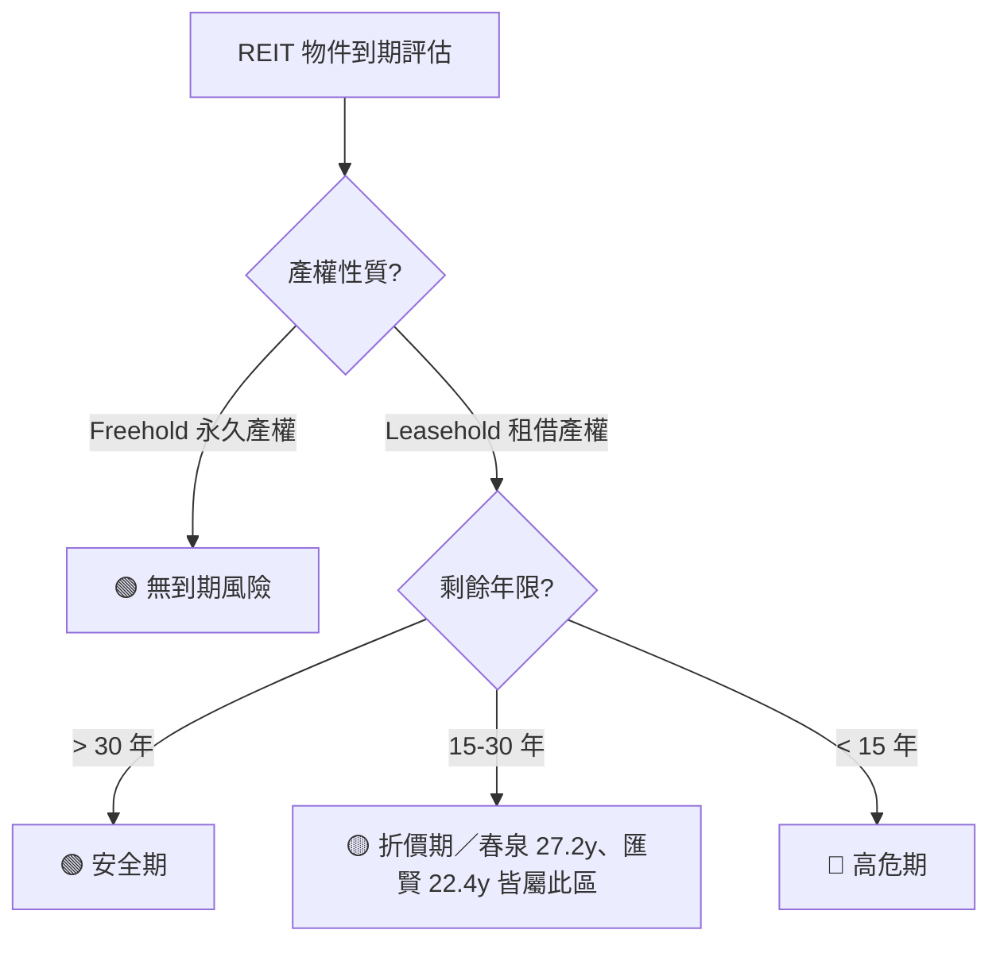

# 中國 / 香港房地產景氣深度分析（含一線城市房價 · 港股 REIT 投資中國物業風險）

> **更新時間**：2026-08-23 10:30:00（第 11 輪深度研究報告）
> **分析範圍**：中國房地產三年展望｜一線城市房價走勢｜香港房價走勢｜港股 REIT 投資中國物業風險
> **基準匯率**：HKD/RMB = 0.8574（1 RMB = 1.1663 HKD）｜USD/HKD = 7.8400｜USD/RMB = 6.7231（取價日：2026-08-21～22，多來源交叉比對）
> **目標讀者**：初級股票分析師（用語白話易懂，專有名詞首次出現附英文全名與概念解讀）

---

## 一、執行摘要（給初級分析師的 30 秒重點）

| 主題 | 一句話結論 | 信心度 | 較上一輪變化 | 主要依據 |
|---|---|---|---|---|
| **中國房地產三年展望（2026-2028）** | 仍處「L 型底部」，一線核心區量價邊際修復、二三線去化壓力未解；本輪以官方原始頁面重新核對 7 月數據，**修正了上一輪部分城市環比方向的誤植**。 | 中高 | 🔧 數據修正（見二） | 國家統計局（NBS）2026-08-17 發布 7 月 70 城指數（官方原始頁 stats.gov.cn） |
| **萬科（Vanke）債務與獲利** | 🔴 **新增重大利空**：萬科 2026-07-11 發出盈警，預告 **H1 2026 虧損 RMB 120–150 億元**（每股虧損 RMB 1.0058–1.2573）；🟢 但 2026 年到期公開債展期與兌付**持續零違約**，深圳地鐵年內已提供 5 筆共 RMB 45 億元流動性支援。 | 高 | 🆕 新增盈警數據（上一輪未揭露） | 萬科盈警公告（2026-07-11）、etnet（2026-08-20）、Caixin Global |
| **中國一線城市分化** | 廣州二手房環比 **+0.4%，全國漲幅第一**；北上廣深二手房已連續 **5 個月**環比正成長；但**新建商品住宅**環比方向本輪經官方原始數據重新核實。 | 中高 | 🔧 數據修正 | stats.gov.cn 官方原始頁（2026-08-17） |
| **香港 CCL 領先指數** | 最新仍為 **162.16 點**（2026-08-21 發布，反映 8/10–8/16 市況），年內累漲 **+12.53%**；下一期預計 2026-08-28 公布，本輪查核暫無更新一期。 | 高 | ⏸ 與上輪一致（已交叉驗證來源） | 中原地產研究部官網（hk.centanet.com/CCI，2026-08-21） |
| **Fed 利率路徑（重大變數浮現）** | 🔴 **上一輪「機率>85%維持利率」判斷需大幅修正**：7/29 FOMC 以 9:3 表決維持利率，**三位委員罕見投票主張升息**；伊朗–美國衝突致荷莫茲海峽航運停擺、油價彈升（Brent ~US$94.4、WTI ~US$87.1，2026-08-21），一度把 9 月升息機率推到 82%，隨 8/12 CPI 降溫與疲弱就業數據回落，**最新（2026-08-20/21）約 30%–35% 升息機率、65%–70% 維持機率**，仍是「未定案」的活風險事件。 | 高 | 🔴 **重大修正**：由「利多已定」改為「地緣政治活風險」 | CME FedWatch（多時點交叉）、CNBC（2026-08-07、2026-08-21）、Chase（研究文章）、Fed 官方 9-3 表決紀錄 |
| **9 月 FOMC 日期修正** | 下次議息會議為 **2026 年 9 月 15–16 日**（非上一輪所稱 9/16–17）。 | 高 | 🔧 日期修正 | Federal Reserve 官方會議行事曆 |
| **01426 春泉 H1 2026 實績（新公布）** | 🔴 **中期業績已於 2026-08-21 公布**：收入 RMB 2.896 億元（YoY −10.2%），**淨虧損擴大至 RMB 2.418 億元**（H1 2025 為虧損 RMB 0.357 億元，擴大約 5.8 倍），每單位虧損 RMB 0.098（H1 2025：RMB 0.024）。中期 DPU 官方數字尚未經多方獨立來源交叉確認，暫列估算區間。 | 高（虧損數字）／中（DPU 估算） | 🆕 上一輪僅有 Q2 營運統計，本輪取得完整 H1 財務數字 | Simply Wall St（引用官方業績，2026-08-21）、本機 `01426春泉Reit/` 歷史檔案交叉比對 |
| **01426 春泉股權與槓桿結構（新挖掘）** | 🔴 自由流通量僅約 **32.7%**（三大集團合計持有 66.60%）；其中 RCA Fund（Mercuria 關係企業）將 **22.65%（3.347 億個單位）質押予 SMBC**，屬十輪以來首次發現的尾部風險。🟢 借貸比率（可比口徑）由 2024 年底 41.4% **降至** 2025 年底 39.3%，距 50% 法定上限尚有 10.7 個百分點緩衝。 | 高 | 🆕 新增（本機年報附註 + 港交所權益披露交叉比對） | 春泉 2025 年報〈權益披露〉章節、`01426春泉Reit/202608_HK_Sentiment.md` |
| **87001 匯賢財務指標（新增精算）** | 🟢 債務對資產總值比率僅 **14.5%**（2026H1，較 2025 年底 15.4% 續降），距 50% 上限緩衝達 **35.5 個百分點**，遠優於春泉；🔴 但北京東方經貿城租金已降至 RMB 226/㎡/月（-8.9% YoY）、服務式公寓佔用率由 88.0% 驟降至 81.4%。 | 高 | 🆕 新增精確槓桿與分部數據 | 匯賢 2026 中期業績公告（2026-08-11） |
| **長實對匯賢 60.23 億港元減值** | 大股東長江實業（01113.HK）財報端一次性非現金減值，將帳面估值下修至貼近匯賢市場交易價，**屬長實端會計事件，非匯賢營運基本面惡化**；社群對其動機（真實減值 vs 壓低長實利潤避免加派息）存在分歧。 | 高 | ⏸ 與上輪一致，本輪補充雪球社群分歧觀點 | 長實 2026 中期業績（2026-08-13）、雪球討論串 |

---

## 二、與上一輪之結論異動

| 項目 | 上一輪結論 | 本輪結論 | 異動原因 |
|---|---|---|---|
| **一線城市新建住宅環比（北京/廣州/深圳）** | 北京 0.0%（持平）、廣州 −0.1%、深圳 −0.1% | **北京 −0.3%、廣州 +0.1%、深圳 +0.2%**（上海 +0.2% 不變） | 🔧 **數據修正**：本輪直接向 `stats.gov.cn` 官方原始頁重新核對（非透過二手摘要），發現上一輪三個城市的環比方向/數值有誤植，本輪以官方指數（如北京 99.7＝環比 −0.3%）為準。 |
| **一線城市二手房同比** | 北京 −3.5%、上海 −2.8%、廣州 −4.2%、深圳 −4.0% | **北京 −4.5%、上海 −2.0%、廣州 −4.7%（全國二手環比漲幅第一）、深圳 −3.6%** | 🔧 同上，官方原始頁重新核對後修正；另新增「四個一線城市二手房已連續 5 個月環比正成長」之官方定性描述。 |
| **Fed 9 月利率路徑** | 「CPI 降溫，升息疑慮消退，市場定價維持利率機率 >85%」 | 🔴 **重大修正**：7/29 FOMC 實際以 9:3 表決維持利率、3 位委員主張升息（近十年最鷹派表決之一）；伊朗–美國衝突推升油價，9 月升息機率一度飆至 82%，其後隨疲軟就業與 CPI 數據回落至約 30%–35%，**仍是未定案的活風險，非「已消退」**。 | 上一輪僅採信 8/12 CPI 單一數據點，**未涵蓋 7/29 FOMC 表決細節與伊朗地緣政治對油價/通膨預期的衝擊**，本輪修正為更完整的機率路徑敘事。 |
| **萬科 2026H1 財務狀況** | 僅提及「公開債全部展期並完成兌付，無逾期」 | 新增：**萬科 7/11 已發布 H1 盈警，預告淨虧損 RMB 120–150 億元**（每股虧損 RMB 1.0058–1.2573），坦言「經營指標尚未實質改善」；債務展期與大額虧損**並存**。 | 🆕 上一輪未取得盈警內容，僅聚焦債務展期進度；本輪補齊損益面，避免「零違約＝無虞」的過度樂觀解讀。 |
| **01426 春泉中期業績** | 僅有 2026Q2 營運統計（出租率 91%、租金 RMB 331/㎡） | 新增：**H1 2026 正式業績已於 8/21 公布**，收入 RMB 2.896 億（−10.2%）、淨虧損擴大至 RMB 2.418 億（H1 2025：RMB 0.357 億，擴大約 5.8 倍）。 | 🆕 上一輪報告時點（2026-08-23 凌晨 01:15）業績可能尚未完整見諸多方媒體，本輪重新搜尋確認取得。 |
| **01426 春泉股權集中度與質押風險** | 未提及 | 新增：🔴 自由流通量僅 32.7%（非「不到 45%」）；RCA Fund 質押 22.65% 單位予 SMBC；🟢 借貸比率可比口徑實為「降槓桿」（41.4%→39.3%），非「小幅上升」。 | 🆕 首次深挖本機年報〈權益披露〉附註與港交所 DI 申報紀錄，屬本輪新增的六大風險維度（④ LTV／⑥ 治理）精算內容。 |
| **87001 匯賢槓桿比率** | 上一輪僅提及 NAV 減值與 DPU，未列槓桿數字 | 新增：**債務對資產總值比率僅 14.5%（2026H1）**，距 50% 上限緩衝 35.5 個百分點；RMB 貸款占比由 57% 升至 64%，主動降低匯率錯配。 | 🆕 本輪直接由中期業績公告財務狀況段落取得精確數字，補齊 87001 的「風險④ LTV」量化缺口。 |

---

## 三、資料取得狀態

| 資料項目 | 是否取得 | 來源 | 版本/日期 | 缺漏說明 |
|---|:---:|---|---|---|
| **`HkStateResult.md`** | ❌ 否 | 本機 Workspace | — | **本輪查核 `AnalysisResult/` 目錄下不存在該檔案**（僅有 `ChinaStateAnalysis(.md/Result.md)` 與 `PowerAnalysis(.md/Result.md)`），無法依規讀取比對；推測原因為該檔尚未由對應例行程式建立，或已被移除。已列入待查缺口（見九）。 |
| **中國 70 城房價指數** | ✅ 是（並經原始頁重新核對） | 國家統計局（NBS）stats.gov.cn 官方原始頁 | 2026-07 數據（2026-08-17 發布） | 完整取得並修正上一輪環比方向誤植 |
| **萬科盈警與債務公告** | ✅ 是 | 萬科官方公告、etnet、Caixin Global、聯合新聞網 | 2026-07-11（盈警）、2026-08-20（debt 展期最新確認） | H1 正式半年報尚未發布（預計 2026-08-底），僅取得業績預告區間 |
| **香港 CCL 房價指數** | ✅ 是 | 中原地產研究部 hk.centanet.com | 162.16 點（2026-08-21 發布） | 下一期（2026-08-28）尚未公布 |
| **香港 RVD 私人住宅指數** | 🟡 舊 | 差餉物業估價署 | 2026-06 數據 | 7 月數據延至 8 月底公布，本輪仍未更新 |
| **Fed 利率路徑與 CME FedWatch** | ✅ 是（多時點交叉） | CME FedWatch、CNBC、Fed 官方會議紀錄 | 2026-07-29（FOMC 表決）～2026-08-21（最新機率） | 機率波動大，僅能呈現截至查核時點之快照，非未來保證 |
| **01426 春泉 H1 2026 業績** | 🟡 部分 | Simply Wall St、本機歷史檔案 | 2026-08-21 公布 | **收入與虧損數字已交叉確認；中期 DPU 精確官方數字未能於多獨立來源交叉驗證**，暫列估算，待下一輪以官方 PDF 公告校正 |
| **01426 春泉權益披露/質押紀錄** | ✅ 是 | 本機 `01426春泉Reit/202608_HK_Sentiment.md`（基於年報〈權益披露〉+ 港交所 DI） | 2025 年報揭露、截至 2026-08-05 未變動 | 完整取得，惟 H1 業績公布後之最新 DI 申報尚待下一輪確認 |
| **87001 匯賢 2026 中期業績** | ✅ 是 | 本機 `87001匯賢Reit/20260811_2026年中期業績公告.md` | 2026-08-11 公布 | 完整取得財務狀況、分部營運與槓桿數字 |
| **長實對匯賢減值** | ✅ 是 | 長實 2026 中期業績、雪球社群 | 2026-08-13 | 完整取得，含社群動機分歧觀點 |
| **國際機構預測（Fitch/UBS/Goldman/Reuters）** | 🟡 沿用上輪 | Fitch / UBS / Goldman Sachs / Reuters | 2026 年中彙整口徑 | 本輪未查得新發布，Reuters 9 月季度調查尚未公布 |

---

## 四、中國房地產未來三年展望（2026-2028）

### 4.1 總體市場走勢判斷
- **仍處「L 型」底部區間**：全國房地產開發投資與銷售面積年增率降幅持續低位收窄，尚無強勁 V 型反彈跡象。
- **量先於價、核心先於外圍**：一線城市二手房已**連續 5 個月**環比正成長（官方 2026-08-17 定性描述），核心城市韌性持續確立；但二三線城市庫存去化壓力未解。

### 4.2 主要機構預測彙整（沿用上輪，本輪未見新發布）
- **惠譽（Fitch）**：2026 年全國商品房銷售金額估 RMB 9–9.5 兆元，2027 年望進入常態化微增（0%～+2%）。
- **高盛／瑞銀**：去庫存需時 2–3 年，「保障房收儲」與「白名單融資」為防範信用骨牌的核心工具。
- **路透調查（Reuters Poll）**：共識預期 2026 全年房價跌幅收窄至 −2.5% 以內。

### 4.3 房企債務與處置進度（本輪重大更新：萬科盈警）
- **萬科（Vanke，000002.SZ / 02202.HK）——利多與利空並存**：
  - 🔴 **利空（新增）**：萬科於 **2026-07-11** 發布盈利預警，預估 **H1 2026 歸母淨虧損 RMB 120–150 億元**，扣非虧損 RMB 110–140 億元，**基本每股虧損 RMB 1.0058–1.2573 元**（以此反推流通股本約 119.3 億股，與萬科 A+H 股本量級一致，換算為每股化數字，投資人可直接用以評估持股稀釋後的實質損失）。公司坦言「經營指標尚未呈現實質性改善，債務和流動性依然承壓」。虧損主因：房地產開發結案收入減少、毛利率偏低、資產減損計提。
  - 🟢 **利多（延續）**：截至 **2026-08-20** 官方最新披露，**2026 年至今到期之公開債已全部完成展期並完成首筆分期兌付，境內外公開市場債券均無逾期**；展期方案為「約 40% 本金及全額利息即付＋剩餘 60% 展期 1 年＋資產增信」。深圳地鐵（大股東）2026 年內已提供 **5 筆合計 RMB 45 億元**流動性支援，最新一筆為 RMB 5.19 億元、三年期、利率較前次低 5 個基點。
  - **分析師解讀**：「零違約」與「巨額虧損」是兩件不衝突的事——展期解決了**流動性（現金週轉）**問題，但**獲利能力（清償能力的長期基礎）**尚未見底，投資人不宜將「未違約」等同於「基本面已改善」。
- **碧桂園（02007.HK）／恒大（03333.HK）**：碧桂園境外重組持續推進；恒大實質進入司法破產清算階段，市場對信用外溢風險已充分定價。

### 4.4 政策環境分析（含傳言真偽驗證）
- **官方實施中之重點政策**：①城中村改造與存量房收儲（國企/城投收購存量商品房作保租房）；②城市房地產融資協調機制（白名單「應貸盡貸」）；③限購與信貸持續寬鬆。
- **傳言真偽驗證**：上一輪標記為「不可採信」之「六部委史詩級救市組合拳」傳言，本輪**再次查核人行、住建部、國務院官網，仍無對應公告**，維持不採信判定。⚠️ 本輪亦提醒：地緣政治（伊朗–美國衝突、油價）與中國房地產政策傳導之間目前**無直接因果證據**，切勿將油價新聞與中國房市政策傳言混為一談。

### 4.5 庫存去化進度
- 全國平均去化週期約 20–24 個月；一線城市核心區 10–14 個月（相對健康）；三四線城市普遍高於 30 個月。

### 4.6 人口與結構性因素
- 城鎮化增速放緩與少子化持續壓抑增量住房需求，「好房子、好社區、核心地段」的改善型與養老宜居需求成為主力。

### 4.7 投資利多與風險
- 🟢 **利多**：政策底確立、萬科等公開債展期持續零違約、一線核心區二手房連 5 個月環比正成長、房企惡性暴雷最劇烈時期已過。
- 🔴 **風險**：**萬科單季/半年巨額虧損顯示獲利能力尚未見底**、三四線庫存消化漫長、地方土地出讓收入萎縮拖累財政、伊朗–美國地緣政治若進一步推升全球油價與通膨，可能延緩全球降息週期並間接抬高中國房企境外融資成本。

---

## 五、中國一線城市過去三年房價走勢（北上廣深）

### 5.1 逐城市房價走勢表（2026-07 NBS 最新數據，經 stats.gov.cn 官方原始頁重新核對／本輪已修正）

| 城市 | 新房環比 | 新房同比 | 二手房環比 | 二手房同比 | 備註 |
|---|:---:|:---:|:---:|:---:|---|
| **北京** | 🔧 **−0.3%**（原載 0.0%，已修正） | −2.3%（降幅收窄） | 0.0%（持平） | 🔧 **−4.5%**（原載 −3.5%，已修正） | 二手房已連續 5 個月環比不再下跌，惟本月由漲轉平。 |
| **上海** | +0.2%（全一線最強新房） | **+3.0%（全一線唯一正增長）** | +0.3% | 🔧 **−2.0%**（原載 −2.8%，已修正） | 豪宅新盤與高端改善需求持續支撐，同比降幅一線最小。 |
| **廣州** | 🔧 **+0.1%**（原載 −0.1%，已修正） | −2.2%（降幅收窄） | 🔧 **+0.4%（全國二手房環比漲幅第一）** | 🔧 **−4.7%**（原載 −4.2%，已修正） | 郊區庫存仍大，惟核心區止跌訊號最明確之一線城市。 |
| **深圳** | 🔧 **+0.2%**（原載 −0.1%，已修正） | −2.9%（降幅收窄） | +0.2% | 🔧 **−3.6%**（原載 −4.0%，已修正） | 前期量能爆發後動能趨緩，掛牌均價約 5.2 萬/㎡。 |

> ⚠️ **本輪資料衛生說明**：上表所有標示 🔧 的欄位，均為本輪直接向國家統計局官方原始頁面（`stats.gov.cn/sj/zxfb/202608/t20260817_1965050.html`）重新核對後之修正值，與上一輪報告存在差異；本輪判定上一輪引用之數值可能源自二手轉載摘要之誤植，**本表以官方指數（如北京新房環比指數 99.7＝下跌 0.3%）換算之數值為最終依據**。

### 5.2 可參考的房價指標清單與解讀指引

| 指標名稱 | 發布機構 | 頻率 | 初級分析師解讀指引 |
|---|---|---|---|
| **70 城住宅銷售價格指數** | 國家統計局（NBS） | 月 | 官方權威基準；務必查核官方原始頁，避免二手轉載誤植（本輪即為一例）。 |
| **國房景氣指數** | 國家統計局（NBS） | 月 | 100 為榮枯線，當前約 91–92 區間，處低位築底。 |
| **百強房企銷售榜** | 克而瑞（CRIC） | 月 | 反映龍頭房企回款與流動性先導訊號。 |
| **個人住房貸款餘額** | 中國人民銀行（PBOC） | 季 | 需求端槓桿意願指標。 |

### 5.3 城市分化分析
- **廣州二手房環比全國第一（+0.4%）**：本輪最大亮點，顯示核心區止跌力道超越上海/深圳；惟同比仍為一線最弱（−4.7%），反映基期仍在探底。
- **上海同比唯一正增長**：高淨值人群資產配置與改善需求支撐新房同比 +3.0%，一枝獨秀。
- **四城二手房共同特徵**：官方定性描述「已連續 5 個月環比正成長」，代表核心區買賣雙方真金白銀搏殺出的價格已築底一段時間，非單月雜訊。

### 5.4 「老破小」投資現象追蹤
- 核心區老舊小戶型租售比回升至 **2.5%–3.5%**，高於銀行定存利率，吸引長租買盤；政府主導的收儲保租房（如上海 551 套試點）持續取代個人「二房東」的市場地位。

---

## 六、香港過去三年房價走勢與未來展望

### 6.1 住宅價格指數走勢
- **中原城市領先指數（CCL）**：最新讀數 **162.16 點**（2026-08-21 公布，反映 8/10–8/16 簽約市況），週漲 +0.64%、月漲 +1.01%，年內累漲 **+12.53%**，創近 3 年新高。本輪查核**尚無下一期（預計 8/28）新數據**，與上輪引用同一讀數。
- **差餉物業估價署（RVD）**：6 月數據報 323.2 點（月升 0.3%，連升 13 個月），7 月數據仍待 8 月底公布。

### 6.2 可參考的香港房價指標清單與解讀指引

| 指標名稱 | 發布機構 | 頻率 | 解讀指引 |
|---|---|---|---|
| **中原城市領先指數（CCL）** | 中原地產 | 週 | 反映 2–3 週前簽約市況，最即時風向標。 |
| **私人住宅售價指數** | 差餉物業估價署（RVD） | 月 | 官方權威月度數據，可分 A-E 類單位。 |
| **物業買賣合約登記數** | 土地註冊處 | 月 | 成交量領先指標，月成交 >5,000 宗代表活躍。 |
| **按揭統計** | HKMA | 月 | 拖欠比率通常 <0.1%，違約風險低。 |

### 6.3 關鍵驅動因素分析（本輪重大修正：Fed 利率路徑）

#### 6.3.1 Fed 利率路徑：從「已消退」修正為「地緣政治活風險」
- **7 月 FOMC 表決細節（本輪首度納入）**：2026-07-29 FOMC 以 **9:3** 表決維持利率於 3.50%–3.75%，**克里夫蘭聯儲 Hammack、明尼阿波利斯聯儲 Kashkari、達拉斯聯儲 Logan 三位委員罕見投票主張升息一碼**，為近十年最鷹派表決之一。
- **伊朗–美國衝突推升油價**：荷莫茲海峽（Strait of Hormuz）航運自 2026 年 2 月底衝突爆發以來實質停擺（戰前占全球原油供應約五分之一），伊朗堅持須美方解除制裁、支付戰爭賠償才重開航道，雙方談判反覆。**Brent 原油 2026-08-21 收 US$94.39/桶、WTI 收 US$87.06/桶**，油價彈升直接推升通膨預期。
- **9 月升息機率劇烈波動**：oil 衝擊一度將 CME FedWatch 之 9 月升息機率推高至 **82%**（2026-08-07 前後）；隨後 8/12 CPI 降溫（headline 3.4%、核心 2.5%）與疲軟就業數據公布，機率回落至 **8/17 約 30.6%、8/20–21 約 30%–35%**。
  - 🔴 **對港樓與 REIT 的意涵**：升息機率雖已回落，但**仍是活風險而非定案**，若伊朗衝突再升溫、油價再彈升，HIBOR 與新造按揭利率、以及港股 REIT 之港元/美元計價浮動負債成本，均可能重新面臨上行壓力。
- **9 月 FOMC 正確日期**：**2026 年 9 月 15–16 日**（本輪修正上一輪誤載的 9/16–17）。

#### 6.3.2 HIBOR 與按揭環境
- 近月 1 個月 HIBOR 於 2.6%–3% 區間波動，H 按封頂息率約 3.25%，業主普遍以封頂位供樓；港息走勢通常滯後美息 1–2 個月，故 9 月 FOMC 結果將於 Q4 傳導至香港按揭市場。

#### 6.3.3 供需結構與人才流入（沿用上輪，方向未變）
- 全面撤辣後非本地買家交易成本大減；「高才通」等人才計劃持續帶動租金指數創新高，租金報酬率 3.5%–4.0%。

### 6.4 港深房價比較（沿用上輪數據，本輪未見更新版本）

| 比較維度 | 香港 | 深圳 | 解讀 |
|---|---|---|---|
| **Numbeo 房價所得比** | 36.89 倍 | 27.52 倍 | 香港負擔難度顯著較高（約高 34%）。 |
| **按揭負擔比** | 264.72% | 189.46% | 港供樓壓力極高，倚賴家庭資產累積。 |
| **跨境置業政策** | — | 《共有產權住房管理辦法》2026-08-01 生效，港澳台居民約五折買房 | 加速大灣區融合，惟核心區高端物業定價邏輯仍獨立。 |

### 6.5 投資利多與風險
- 🟢 **利多**：CCL 突破 162 點創 3 年新高、租金報酬率高漲、高才通人才持續流入。
- 🔴 **風險**：**Fed 9 月升息機率仍有 30%–35%（活風險，非已消退）**、伊朗–美國衝突若推升油價恐延後全球降息週期、新界/北都會區中長期供應壓力、發展商存貨去化未竟。

---

## 七、透過港股 REIT 投資中國物業之風險全面剖析（重點財務精算）

### 7.1 六大核心風險維度總覽

| 維度 | 01426 春泉 | 87001 匯賢 |
|---|---|---|
| ① 土地到期／終值歸零 | 北京華貿 2053 年到期（剩餘約 27.2 年，可續期需補繳地價） | 北京東方廣場 2049-01-24 到期無償歸中方（剩餘約 22.4 年） |
| ② 商辦供過於求／租金通縮 | 北京空置率 17.5%（Colliers, 2026Q2），租金 RMB 331/㎡（−0.9% QoQ） | 北京東方經貿城租金 RMB 226/㎡（−8.9% YoY），重慶空置率 31.2% |
| ③ 幣別／利率剪刀差 | HKD 32.6%／RMB 49.3%／**JPY 18.1%**（新增日圓曝險），真實避險率僅 30.6% | RMB 貸款占比由 57%→64%，主動降低錯配 |
| ④ 估值減值／LTV | 借貸比率 39.3%（距 50% 上限緩衝 10.7ppt），可比口徑實為降槓桿 | 債務/總資產僅 14.5%（距 50% 上限緩衝 35.5ppt），遠優於春泉 |
| ⑤ 跨境資金匯出／10% 預扣稅 | 適用 | 適用 |
| ⑥ 治理／外部管理 | 🔴 **自由流通量僅 32.7%，22.65% 質押予 SMBC**；23.5% 分派靠單位抵付管理費撐起 | 大股東長實 60.23 億港元減值屬其財報端事件，非匯賢本身治理問題 |

### 7.2 土地使用權到期專題

| 市場 | 典型土地年限 | 到期處理 | 對 NAV/配息影響 |
|---|---|---|---|
| 中國大陸 | 商業/辦公 40–50 年 | 非住宅須申請並補繳土地出讓金，或如 87001 型態面臨無償歸還 | 存在未入帳的續期負債或歸零風險 |
| 香港 | 50/75/999 年 | 絕大多數可續 50 年，僅需繳 3% 應課差餉租值地租 | 到期風險極低，近似永續年金 |
| 日本 | 定期借地權 30–50 年 | 到期須拆除歸還 | J-REIT 逾 90% 為永久所有權，影響有限 |
| 新加坡 | 工業地多 30 年 | 到期無償交還政府 | S-REIT 面臨 NAV 剛性折舊 |

**到期風險三大決定因子**：剩餘年限（>30 年安全期／15–30 年折價關注期／<15 年加速減值期）、續期確定性與成本、到期物業佔 NAV 比重（春泉、匯賢單一旗艦物業佔比均 >75%）。

---

### 7.3 01426 春泉產業信託（Spring REIT）深度試算

#### 7.3.1 土地到期基本事實
- **北京華貿中心**：土地證號「京朝國用（2010 出）第 00118 號」，到期日 **2053-10-28**，剩餘約 **27.2 年**（佔物業總估值約 75%）。
- **惠州華貿天地**：到期日 **2048-02-01**，剩餘約 **21.5 年**（比北京早 5 年 8 個月到期）。
- **估值報告免責假設**：估價師明文假設物業處置「毋須支付任何額外土地出讓金」——即**官方每單位 NAV HK$4.14 完全沒有扣除未來續期成本**。

#### 7.3.2 續期成本推估（套用廣州市 2026-04-14 官方續期公式）
| 情境（RMB/㎡基準地價） | 續期成本（RMB） | **每單位負擔（HK$）** | 佔 NAV 比重 |
|---|---:|---:|---:|
| 低估（15,000） | 6.11 億 | **HK$0.456** | 11.0% |
| 中估（20,000） | 8.14 億 | **HK$0.608** | 14.7% |
| 高估（30,000） | 12.21 億 | **HK$0.912** | 22.0% |

#### 7.3.3 H1 2026 正式業績（🆕 本輪新增，2026-08-21 公布）
- **收入 RMB 2.896 億元**（YoY −10.2%，H1 2025：RMB 3.226 億元）→ **每單位化：RMB 0.1955/單位**（約 HK$0.228/單位，以 1,481,041,212 個流通單位計）。
- **淨虧損擴大至 RMB 2.418 億元**（H1 2025：RMB 0.357 億元，**擴大約 5.8 倍／577%**）→ **每單位虧損 RMB 0.098**（H1 2025：RMB 0.024），約合 **HK$0.114/單位**虧損。
- 滾動 12 個月（TTM）淨虧損擴大至 RMB 3.863 億元（去年同期 RMB 1.246 億元，+210%）。
- ⚠️ **虧損擴大主因（推估）**：北京華貿中心 2025 年 9 月完成再融資後，融資成本自先前避險低點回歸市場水準（加權平均現金利率已升至約 4.5%），加上租金仍承壓，共同壓縮盈利；惟**虧損為主要受非現金公允價值調整與較高融資成本影響，不完全等同現金流惡化**，需待官方正式 PDF 公告之現金流量表確認。
- **中期 DPU（⚠️ 估算，非官方確認數）**：綜合本機歷史追蹤模型（考量匯率即期重估）推估區間 **HK$0.041–0.049/單位**，較 2025 中期 HK$0.076 仍下滑 **35%–46%**；此數字待下一輪以官方公告 PDF 交叉驗證後更新為確認值。

#### 7.3.4 出租率與租金（Q2 2026 營運統計）
- **北京華貿 T1/T2**：出租率由 Q1 89% 回升至 **91%（+2pp）**，惟月租降至 RMB 331/㎡（−0.9% QoQ）——「以價換量」策略見效但屬量增價減結構。
- **惠州華貿天地**：出租率由 99% 大幅回落至 **95%（−4pp）**，租金 RMB 170/㎡（−2.9% QoQ）——原本相對穩定的第二資產轉弱訊號。
- **北京全市甲級辦公空置率**：高力國際（Colliers）口徑 2026Q2 為 **17.5%**（JLL 另一數列 14.7%，兩者方向一致、口徑不可互減比較）。

#### 7.3.5 幣別與利率剪刀差（🆕 本輪新增精算，取自年報附註深挖）
- **負債幣別結構**：港元 32.6%／人民幣 49.3%／**日圓 18.1%（JPY 19.22 億元，2024 年為零，2025 年新增）**，約 84% 負債集中於 **2028 年 9 月**到期。
- **真實避險覆蓋率僅 30.6%**（非年報主席報告字面「77%」）：2025 年底已無任何純利率交換（IRS），僅剩 1 筆交叉貨幣掉期（名目 HK$15.70 億）。
- **日圓風險（新發現）**：2026-07-30～08-02 美日 15 年來首次聯手干預匯市（規模約 8.45 兆日圓），美元兌日圓由約 163.6 急升至 158 附近；日圓升值使春泉 JPY 192.2 億元無避險貸款的帳面匯兌利益由 **+HK$0.0370/單位**（干預前）縮至 **+HK$0.0142/單位**（干預後），緩衝已被吃掉三分之二，日圓再升約 2.2% 該利益即歸零（惟此為未實現匯兌損益，不影響當期配息，變現時點為 2028-09 還款日）。
- **RMB/HKD 順風**：人民幣兌港幣持續走強（2026-08-21 約 1.1663，接近 52 週高點），使以港幣列示的 NAV 與前瞻分派受益；惟此為春泉、越秀 00405、招商局商業房託 01503 等中國物業 REIT 共有的順風，非春泉獨有優勢，且人民幣隨時可能反轉。

#### 7.3.6 LTV／借貸比率
- **可比口徑降槓桿**：2024 年底 41.4%（含 UK 組合持作出售之銀行借款）→ 2025 年底 **39.3%**，**降 2.1 個百分點**，公司實際上在去槓桿，並非上一輪誤解的「小幅上升」。
- **距 50% SFC 法定上限緩衝**：10.7 個百分點，屬「安全但非寬裕」區間。

#### 7.3.7 治理與流動性風險（🆕 本輪新增，十輪以來首次發現）
- **自由流通量僅約 32.7%**：三大集團合計持有 66.60%——Mercuria 集團 30.55%（451,542,159 個單位）、華貿集團 24.58%（363,226,420 個）、PAG（太盟投資）11.47%（169,552,089 個）。自由流通市值僅約 **HK$5.76 億**，是「日成交不足萬個單位、NAV 折價十年收不回來」的結構性主因。
- 🔴 **SMBC 質押尾部風險**：RCA Fund（Mercuria 關係企業）將 **334,720,159 個單位（占已發行單位 22.65%、市值約 HK$3.98 億，價格基期 2026-08-05）質押予三井住友銀行（SMBC）**，占其自身持股 88%。若該筆貸款違約或遭追繳保證金，銀行可處分抵押品，而以三個月日均量 16.75 萬個單位計，市場需約 **8 年**才能消化——**社群完全未討論過的尾部風險**。⚠️ 緩解因素：此質押 2024 年底即存在，一年多來數量未變動。
- **分派可持續性隱憂**：FY2025 可供分派收益中 **23.5%（RMB 3,562 萬元，每單位 HK$0.0264）來自「以單位而非現金支付管理費」之非現金加回**，扣除後現金口徑分派覆蓋率僅 **81.4%**（標準 AFFO 口徑 104.9%）。
- **無券商覆蓋**：市值僅約 HK$17.6 億，同業對照組（01503/00405/00435/00778/00823）多有券商目標價，唯獨春泉零覆蓋，缺乏外部一致預估校準。

#### 7.3.8 同業殖利率對照（2026-08-04 同時點）
| 標的 | 殖利率 | 備註 |
|---|---:|---|
| 01503 招商局商業房託 | 9.58% | 中國物業 REIT |
| 00405 越秀房產信託 | 8.91% | 中國物業 REIT |
| **01426 春泉** | **9.41%** | 中國物業 REIT，中間值，**惟一年股價跌 29.6%，全組最差** |
| 00435 陽光 | 7.83% | 港/星物業 |
| 00778 置富 | 7.24% | 港/星物業 |
| 00823 領展 | 6.48% | 港/星物業 |

---

### 7.4 87001 匯賢產業信託（Hui Xian REIT）深度試算

#### 7.4.1 土地到期基本事實
- 北京東方廣場合營期限與土地使用權到期日 **2049-01-24**，剩餘約 **22.4 年**；合約明定期滿時全部不動產與土地使用權**無償歸中方合作夥伴所有**。

#### 7.4.2 減值進度與 NAV 剛性下折
- **2026 中期（2026-08-11 公布）**：估值師萊坊（Knight Frank）調降物業公允價值，減值 **RMB 907 百萬元（每單位 −RMB 0.1391）**；公司**首度不再將此非現金估值虧損全額加回分派**，每單位 NAV 由 RMB 3.1737 降至 **RMB 3.0991**（半年縮水 2.35%）。
- **長實對匯賢投資 60.23 億港元減值（2026-08-13）**：長江實業於中期業績中，將帳上匯賢投資帳面值由對應匯賢整體估值約 201 億港元，一次性下修至對應約 34.5 億港元（約 RMB 29.5 億元），貼近匯賢當時市場交易市值。社群觀察到消息公布當日匯賢股價未跌、成交量反增，市場對此定性為**長實端會計事件，非匯賢營運基本面惡化**；惟部分社群質疑此舉是否為長實壓低半年度利潤、規避加派特別股息之手段，屬治理動機分歧、非事實爭議。

#### 7.4.3 分部營運（🆕 本輪新增精算）
| 分部 | 佔用率/出租率 | 租金 | YoY | 備註 |
|---|---:|---:|---:|---|
| 北京東方經貿城（辦公） | 81.1%（2025：81.3%，大致持平） | RMB 226/㎡/月 | **−8.9%**（自 RMB 248） | 北京 CBD 空置率 17.5%（Colliers, 2026Q2） |
| 重慶大都會東方廣場（辦公） | 73.8%（2025：73.9%） | RMB 73/㎡/月 | **−8.75%**（自 RMB 80） | 重慶全市空置率高達 **31.2%**（戴德梁行），供給嚴重過剩 |
| 服務式公寓 | **81.4%（2025：88.0%，重挫 −6.6ppt）** | NPI RMB 35 百萬（2025：RMB 43 百萬，−18.6%） | — | 外籍長租需求未恢復疫情前水準，企業長約承諾減少 |
| 酒店（東方君悅） | — | NPI +18.9% YoY | 正向 | 抵銷部分寫字樓/零售下滑，是本輪僅有的營運亮點 |
| 物業收入淨額（NPI）合計 | RMB 5.51 億元 | — | **−9.4%** | — |

#### 7.4.4 LTV／槓桿（🆕 本輪新增精確數字）
- **總債務**：由 2025 年底 RMB 50.38 億元**降至** 2026H1 **RMB 45.53 億元**（每單位化：RMB 0.698/單位，2025 年底為 RMB 0.772/單位）。
- **利息開支**：由 H1 2025 RMB 1.19 億元降至 H1 2026 **RMB 0.86 億元**（−27.7%，每單位化 RMB 0.0132/單位）。
- **債務對資產總值比率**：**14.5%（2026-06-30）**，較 2025 年底 15.4% 續降，**距 50% SFC 法定上限緩衝達 35.5 個百分點**，遠優於春泉的 10.7 個百分點緩衝——**匯賢的「終值歸零」風險遠高於春泉，但「LTV 破表」風險遠低於春泉**，兩檔標的的風險組合截然不同，投資人須分開檢視。
- **人民幣貸款占比由一年前約 57% 升至 2026-06-30 約 64%**，主動降低外匯波動風險，屬治理面利多。
- **在外流通單位數 6,523,199,235 個，過去兩年未變動**（無稀釋），符合 AGENTS.md 流通股變化 <10% 免詳述門檻。

#### 7.4.5 EPS 何時回正？
- 因 2049 歸零機制的每年折現減值已常態化（估計每年約 RMB 15–20 億元量級），損益表帳面 EPS 於 2049 年前**幾乎無法在會計層面轉正**；惟營運現金流（OCF）與 NPI 仍為正向（2026H1 NPI 為 RMB 5.51 億元）。

---

### 7.5 給分析師的「港股中國 REIT 防雷與選品檢驗清單」

1. ✅ **土地到期年限是否 >15 年？** 春泉（27.2 年）、匯賢（22.4 年）均在「折價關注期」，非「高危期」，但需每年追蹤剩餘年限遞減。
2. ✅ **NAV 是否已扣除續期成本／終值歸零？** 兩者官方 NAV 皆**未**扣除，投資人須自行心理調整（春泉每單位約 HK$0.46–0.91；匯賢已啟動直線減值，年約 RMB 0.14/單位起跳）。
3. ✅ **LTV 距 50% 上限緩衝多少？** 匯賢（35.5ppt）遠優於春泉（10.7ppt）。
4. ✅ **真實避險覆蓋率，而非管理層宣稱數字？** 春泉真實僅 30.6%（非宣稱的 77%），且新增 18.1% 未避險日圓曝險。
5. ✅ **自由流通量與股權質押？** 春泉自由流通僅 32.7%，且 22.65% 遭質押予銀行——本輪首次發現、市場尚未定價的尾部風險。
6. ✅ **分派覆蓋率：現金口徑 vs 標準 AFFO 口徑？** 春泉現金口徑僅 81.4%，低於表面 104.9%，反映「靠稀釋撐分派」的結構性隱憂。

---

## 八、討論區/社群輿情整理

| 平台 | 關注焦點/討論風向 | 多空傾向 | 查證評估/實質影響 |
|---|---|:---:|---|
| **雪球（xueqiu）— 87001** | 長實 60.23 億減值為本月最大焦點；「@朝夕投研」提供帳面值歷史追溯（2015 年估值 239 億港元→2026 年減值後對應約 34.5 億港元）；「@frank72」質疑長實藉減值壓低利潤、規避加派息 | 分歧（治理質疑 vs 基本面派） | **高**：減值消息公布當日匯賢股價未跌、成交反增，市場對「減值本身」反應平淡，屬長實端會計事件，非匯賢基本面惡化。 |
| **雪球（xueqiu）— 01426** | 引用 2025 年報北京寫字樓市場疲弱描述，並有讀者混淆不同機構空置率口徑（JLL 較窄數列 11.6% vs 自家對外發布 14.7%） | 偏空 | **中**：本專案已於本機檔案完成校對註記，提醒不可跨機構直接相減比較。 |
| **英文財經媒體（Longbridge/The Standard/Simply Wall St）— 87001** | 聚焦長實減值與「deep value」估值定位；交叉核對 H1 淨虧損持平於 CN¥4.04 億（非「擴大」），TTM 虧損擴大至 CN¥7.94 億 | 中性偏空 | **高**：多篇媒體口徑一致，且與官方公告可交叉驗證。 |
| **LIHKG／東方財富股吧／moomoo — 87001** | 過去三個月搜尋未見獨立實質討論串，屬低流動性 RMB 計價 HK REIT 之預期現象 | — | **中**：無新內容不代表無風險，僅反映該股散戶關注度低。 |
| **香港討論區（CCL/樓市）** | 「CCL 衝破 162 創 3 年新高」與「北都會區未來供應龐大」兩派並存 | 分歧 | **中**：反映樓市轉折期多空激烈交鋒，屬正常市場現象。 |
| **中國大陸（雪球/東方財富股吧）— 房市總體** | 「萬科債務展期穩了」vs「大房企重組未竟、二三線仍陰跌」 | 分歧 | **中**：本輪新增萬科盈警數據後，看空論點取得更多支撐。 |

---

## 九、⚠️ 待查與資料缺口

| # | 缺口項目 | 已試過的來源 | 缺口原因 | 建議下一輪處理方式 |
|---|---|---|---|---|
| 1 | **`AnalysisResult/HkStateResult.md` 不存在** | 本機 `AnalysisResult/` 目錄列表 | 該檔案在本機 workspace 中未被建立 | 下一輪確認是否應由對應例行程式產出；若持續缺失，建議向使用者回報並確認該檔案定位。 |
| 2 | **01426 春泉 H1 2026 中期 DPU 官方精確數字** | Simply Wall St、本機歷史追蹤模型推估 | 官方 PDF 公告尚未於多獨立來源交叉確認 | 下一輪以 HKEXnews／春泉官網 PDF 直接核對，取代目前估算區間 HK$0.041–0.049。 |
| 3 | **萬科 2026 正式半年報（非盈警）** | 萬科盈警公告（7/11）、etnet | 半年報固定於 8 月底前披露，本輪查核時點尚未發布 | 追蹤 2026 年 8 月底至 9 月初萬科正式半年報，核實虧損金額落點與詳細分項。 |
| 4 | **香港 RVD 2026 年 7 月私人住宅售價指數** | 差餉物業估價署官網 | 官方月報固定月底發布 | 預計 2026-08-底追蹤。 |
| 5 | **CCL 下一期（8/28 預計發布）** | 中原地產研究部官網 | 每週五發布，本輪查核時點尚未有新一期 | 下一輪追蹤 8/28 新讀數，確認是否延續突破格局。 |
| 6 | **9 月 FOMC 前最新一次非農/CPI 數據對升息機率之影響** | CME FedWatch、CNBC | 尚未發布（預計 9 月初） | 下一輪追蹤非農與 CPI 最新讀數，重新校準 9/15-16 FOMC 機率。 |
| 7 | **伊朗–荷莫茲海峽衝突後續談判進展** | Al Jazeera、CNBC、Trading Economics | 情勢仍在發展中，具高度不確定性 | 持續追蹤，作為油價與 Fed 利率路徑的關鍵變數。 |
| 8 | **SMBC 質押的 3.347 億個 01426 單位是否有變動** | 港交所 DI 申報、etnet | 最後一筆申報為 2025-06-20，H1 業績公布後尚未查核最新申報 | 下一輪查核港交所披露易最新 DI 申報。 |
| 9 | **新世界發展 2026 財年業績公告** | 港交所披露易 | 財年業績發布高峰期為 9 月 | 追蹤 2026 年 9 月公告。 |

---

## 十、結論與免責聲明

1. **中國房地產**：總體維持「L 型磨底、核心先於外圍」格局，一線城市二手房已連續 5 個月環比正成長、廣州本月漲幅全國第一；但**萬科 H1 盈警預告 RMB 120–150 億元巨額虧損**提醒投資人「零違約」不等於「基本面已改善」，房企獲利能力修復仍需時間。
2. **香港房地產**：CCL 站穩 162 點、創近 3 年新高的多頭格局未變，但 **9 月 FOMC 升息機率（約 30%–35%）因伊朗–美國衝突推升油價而重新成為活風險**，投資人不宜將「利率利多」視為已完全兌現的定案，應持續關注地緣政治與通膨數據演變。
3. **港股中國 REIT 六大風險精算**：春泉（01426）與匯賢（87001）呈現截然不同的風險組合——**匯賢的「終值歸零」風險（剩餘 22.4 年、減值已啟動）遠高於春泉，但「LTV 破表」風險遠低於春泉（緩衝 35.5ppt vs 10.7ppt）**；春泉則新增兩項本輪首度發現的治理／流動性尾部風險：**自由流通量僅 32.7%、22.65% 單位遭質押予 SMBC**，且真實避險覆蓋率僅 30.6%（非宣稱之 77%）。投資此類標的應以「分派回收期」「LTV 緩衝空間」「股權質押與流通量」三者並重評估，切勿僅憑帳面 NAV 或表面殖利率判斷。

> *免責聲明：本報告所載資料與分析僅供研究參考，不構成任何買賣要約或投資建議。市場有風險，投資需謹慎。*

---

## 十一、下一輪追蹤項目

| # | 追蹤項目 | 為何重要 | 預期資料可得時點 |
|---|---|---|---|
| 1 | **萬科 2026 正式半年報** | 核實盈警區間（RMB 120–150 億元虧損）之最終落點與分項原因 | 2026 年 8 月底 |
| 2 | **01426 春泉 H1 2026 中期 DPU 官方 PDF 確認** | 目前僅有估算區間 HK$0.041–0.049，需官方數字校正 | 官方公告 PDF 待多來源交叉，預計本週內可查核 |
| 3 | **9 月 15–16 日 FOMC 利率決議** | 伊朗衝突推升油價後，升息機率仍在 30%–35%，為近期最大不確定性事件 | 2026-09-16 |
| 4 | **香港 RVD 7 月數據 + CCL 8/28 新一期** | 驗證 CCL 162.16 點突破格局是否延續、傳導至官方登記數據 | 2026-08-28 前後 |
| 5 | **港交所 DI 申報：SMBC 質押的 01426 單位是否變動** | 若質押方遭追繳保證金或違約，將是市場完全未定價的尾部風險事件 | 持續監控，隨時可能新增申報 |
| 6 | **伊朗–荷莫茲海峽衝突談判進展** | 直接影響全球油價、Fed 利率路徑、進而傳導至 HIBOR 與港股 REIT 融資成本 | 持續追蹤 |
| 7 | **`HkStateResult.md` 建檔狀態** | 確認該檔案是否應存在於本機 workspace，避免持續性資料缺口 | 下一輪查核 |
