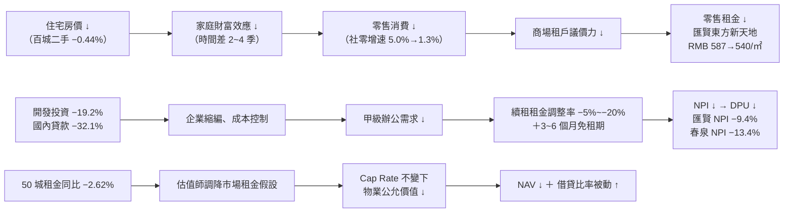

# 中國房地產景氣 × 港股中國物業 REIT 投資判斷

> **更新時間**：2026-08-23 18:40:00（第 12 輪）
> **分析範圍**：中國三年景氣（2026–2028）｜百城與國房景氣指標｜一線城市（北上廣深）｜**REIT 物件到期後續處理（核心章）**
> **基準匯率**：HKD/RMB = **0.8573**（1 RMB = 1.1665 HKD）｜USD/HKD = 7.8400（取價日：**2026-08-21**，收市）
> **標的**：`01426` 春泉產業信託（Spring REIT）、`87001` 匯賢產業信託（Hui Xian REIT）；對照組 `00405` 越秀房託、`01503` 招商局商業房託
> **讀者**：入行 1～2 年的初級股票分析師
> **⚠️ 本輪為「換規格重寫」**：上一輪（第 11 輪）依舊版規格產出（中國房市＋**香港房市**＋REIT 風險）。本輪依 `AnalysisResult/ChinaStateAnalysis.md` 新規格全文重寫，主軸改為 **「到期處理」精算**，香港住宅（CCL／RVD）章節已依新規格移除，改以 `HkStateResult.md` 為其歸屬檔。

---

## 一、30 秒執行摘要

| # | 主題 | 一句話結論 | 信心度 | 較上輪變化 | 主要依據 |
|:--:|---|---|:--:|:--:|---|
| 1 | **中國三年景氣（2026–2028）** | **銷售端「L 型磨底」，但開發端仍在「二次下探」**——1–7 月開發投資 **−19.2%**（前值 −18.0%，降幅**擴大**）、新開工 −24.0%。兩端必須分開講。 | 高 | 🔧 **重大修正** | NBS 2026-08-17 發布 |
| 2 | **機構預測** | **惠譽（Fitch）已於 2026-07-01 大幅下修**：2026 新房銷售由 −7%～−8% 改為 **−11%～−13%**，且 2027 續跌。 | 高 | 🔧 **重大修正**（上輪引用的「2027 微增 0～+2%」已失效） | Fitch（2026-07-01）、Goldman、UBS |
| 3 | **百城指標** | 新房 RMB 17,229/㎡（環比 +0.26%）**vs** 二手 RMB 12,584/㎡（環比 −0.44%、**92 城跌 : 8 城漲**）。**新房漲是結構效應，二手跌才是真需求。** | 高 | ⏸ 一致（7 月數據，8 月數據 9/1 才發） | 中指研究院 2026-08-01 |
| 4 | **國房景氣指數** | **`N/A`** — NBS 月度新聞稿已不列示該指數，本輪四路查證未果。 | — | 🆕 首次明確標記缺口 | 見第十章 |
| 5 | **一線城市** | 官方（NBS）二手環比 **連 5 個月正成長**（+0.2%）；但中指同月報一線二手 **−0.25%**。**兩個口徑打架，本輪明確拆解原因。** | 高 | 🆕 新增口徑衝突分析 | NBS vs 中指研究院 |
| 6 | **北京 CBD 商辦（兩檔標的的損益表）** | 🟢 Q2 淨吸納 14.6 萬㎡（近三年單季新高）；🔴 但 **2026H2–2027 是約 18 個月的供應高峰，新增近 150 萬㎡**，租金下行未完。 | 高 | 🆕 新增供應週期量化 | 高力國際、JLL |
| 7 | **`87001` 匯賢到期精算** | **2049-01-24 無償移交，終值＝0 已由公司白紙黑字承認。** 每單位年剛性折減 **RMB 0.1752**；但 H1 實際減值年化 RMB 0.2781（為剛性折減的 **1.59 倍**）。 | 高 | 🆕 三公式首次跑出數字 | 匯賢 2026 中期業績（本機） |
| 8 | **`87001` 估值結論** | 🔴 **P/NAV 0.116（打 1.16 折）是假便宜。** 合理假設下每單位現值 **RMB 0.09–0.31**，**低於現價 RMB 0.360** → **高估**。 | 中高 | 🆕 首次給出價值區間 | 本輪 DCF 模型（見 7.6） |
| 9 | **`87001` 真正的問題不是資產，是分派** | 每單位現金利潤約 **RMB 0.1830/年**，實際只分派 **RMB 0.0043/年**——**分派率 2.3%**。錢拿去還債了。**分派政策是唯一決定價值的變數。** | 高 | 🆕 **本輪最重要發現** | 匯賢 2025 年報〈分派表〉 |
| 10 | **`01426` 春泉到期精算** | 北京華貿 2053-10-28（剩 27.2 年）、**惠州 2048-02-01（剩 21.4 年，先爆）**。每單位年剛性折減 **HK$0.3100**，是年分派 HK$0.08 的 **3.9 倍**。 | 高 | 🆕 三公式首次跑出數字 | 春泉 2025 年報（本機） |
| 11 | **`01426` H1 2026 實績（官方數字補齊）** | 中期 DPU **HK$0.040**（H1 2025：HK$0.076，**−47.4%**）；可供分派 RMB 5,814 萬（−12.1%）；淨虧損 RMB 2.418 億。 | 高 | 🔧 **修正**：上輪為估算區間 HK$0.041–0.049 | 富途／官方業績（2026-08-20/21） |
| 12 | **`01426` 估值結論** | HK$1.200。**「抱到到期」現值僅 HK$0.77；只有「被人買走／提早處分」才划算（HK$1.67）。** → **現價偏貴，除非你賭處分。** | 中 | 🆕 首次給出價值區間 | 本輪模型（見 7.6） |
| 13 | **續期成本的法律空白，本輪有解了** | 🟢 **廣州 2026-04-15 公布《工商業用地使用權續期管理試點方案》，首次給出商服用地續期出讓金公式。** 這是全國首個可用的定價錨。 | 高 | 🆕 **重大新發現**（取代不適用的「深圳 35%」） | 廣州市規劃和自然資源局 |
| 14 | **「深圳 35%」不能亂用** | 🔧 該規定**只適用於行政劃撥用地**，不適用春泉的**出讓**商業用地；且實例中實付僅市值 0.7%。 | 高 | 🔧 **修正上輪與規格書的類比錨點** | 《深圳市到期房地產續期若干規定》原始解讀 |

---

## 二、與上一輪的結論異動

| 項目 | 上一輪（第 11 輪）結論 | 本輪（第 12 輪）結論 | 異動原因 |
|---|---|---|---|
| **開發投資走勢** | 「降幅持續低位**收窄**，L 型底部」 | 🔧 **開發投資 1–7 月 −19.2%，較 1–6 月 −18.0% 降幅擴大**；新開工 −24.0%、竣工 −23.2%、到位資金 −20.3%。**銷售端在磨底，開發端在二次下探。** | 上輪把「銷售價格降幅收窄」誤推廣到「整個房地產在收窄」。本輪回 NBS 原始頁逐項核對後拆開兩端。 |
| **惠譽（Fitch）預測** | 2026 銷售金額 RMB 9–9.5 兆、**2027 進入常態化微增（0%～+2%）** | 🔧 **Fitch 2026-07-01 已下修**：2026 新房銷售 **−11%～−13%**（原 −7%～−8%），且**明言 2027 價格與銷售面積續跌**。 | 上輪標註「沿用上輪、未見新發布」，但實際上 7/1 已有下修公告。本輪查獲。 |
| **萬科盈警的解讀** | 「🔴 **新增重大利空**：H1 預虧 RMB 120–150 億」 | 🔧 **語氣修正**：**上年同期（H1 2025）本來就虧 RMB 119.47 億**。所以這是「虧損持平至略微擴大」，不是「突然爆雷」。真正的新資訊是：總負債 RMB 7,693 億、一年內到期有息負債 RMB 1,676 億、帳上可動用資金僅 RMB 600 億、深鐵給到 RMB 220 億貸款額度。 | 上輪未取得可比基期，把「延續性虧損」寫成「新增利空」，會誤導初級分析師。 |
| **01426 中期 DPU** | 估算區間 **HK$0.041–0.049**（標註待官方校正） | 🔧 **官方數字 HK$0.040**（H1 2025：HK$0.076，−47.4%）；可供分派收入 RMB 5,814 萬（−12.1%）、派息比率 90%、NPI RMB 2.05 億（−13.4%）。 | 本輪由富途公告流取得官方業績摘要，落在上輪估算區間下緣，估算模型方向正確但偏樂觀。 |
| **續期成本的定價錨** | 引用「深圳 2004 年補繳基準地價 **35%**」與「廣州 2026-04-14 官方續期公式」 | 🔧 **雙重修正**：① **深圳 35% 只適用行政劃撥用地**，春泉為出讓用地，**不可直接套用**；② 廣州文件正確日期為 **2026-04-15**，且其**商服用地**公式為 `(續期年期÷法定最高年限) × 標定地價 × 建築面積`（達標者 ×70%），**與上輪採用的「基準地價 × 土地面積」算法不同，續期成本因此大幅上修**。 | 上輪把兩個地方前例混用，且用了土地面積而非建築面積，低估續期成本約 2–3 倍。 |
| **87001 的投資性質** | 聚焦「NAV 剛性下折、長實減值」 | 🆕 **重新定性**：匯賢**不是殖利率陷阱，是「現金截留」問題**。TTM 殖利率僅 **0.84%**（不是 8–12%），因為每單位現金利潤 RMB 0.1830 只分派了 RMB 0.0043（2.3%），其餘拿去還債（總債務一年內由 RMB 50.38 億降至 45.53 億）。 | 上輪未做「現金利潤 vs 實際分派」的對照，漏掉這個決定估值的關鍵變數。 |
| **香港房市（CCL/RVD/Fed）章節** | 佔全報告約 1/4 篇幅 | ⏹ **依新規格移除**，改由 `HkStateResult.md` 承接。本輪僅保留與 REIT 融資成本直接相關的利率段落於第八章風險②。 | 新規格 `ChinaStateAnalysis.md` 的四個主題不含香港住宅市場。 |

---

## 三、資料取得狀態

| 資料項目 | 取得 | 來源 | 版本／日期 | 缺漏說明 |
|---|:---:|---|---|---|
| NBS 70 城房價指數（7 月） | ✅ | 國家統計局解讀稿＋新京報全文轉載 | 2026-08-17 發布 | 一線四城新房／二手之環比＋同比**全部逐城取得** |
| NBS 全國房地產開發經營（1–7 月） | ✅ | 國家統計局 → 觀點網全文轉載 | 2026-08-17 | 投資／銷售／新開工／竣工／到位資金／待售全取得 |
| **國房景氣指數** | ❌ | NBS 月報、TradingEconomics、中指雲、多次關鍵字搜尋 | — | **NBS 月度新聞稿已不列示此指數**；歷史區間約 91–94。詳見第十章 #1 |
| 中指研究院百城指數（7 月） | ✅ | 中指雲官方原始頁 `cih-index.com` | 2026-08-01 發布 | 新房／二手／漲跌家數／50 城租金全取得 |
| 8 月百城指數 | 🟡 未發布 | 中指研究院 | 預計 **2026-09-01** | 本輪查核時點尚未發布，非缺漏 |
| 機構預測（Fitch／Goldman／UBS） | ✅ | Fitch 2026-07-01、Goldman、UBS China Outlook | 2026 年中～7 月 | Reuters 季度調查最新一期未查得 |
| 萬科債務與盈警 | ✅ | 萬科業績預告、中國基金報、證券時報 | 2026-07-10/11 | **正式半年報（8 月底）仍未發布** |
| 北京甲級寫字樓 Q2 | ✅ | 高力國際官網（2026-07-08）、JLL、RET | 2026 Q2 | 三家口徑並列，不可互減 |
| **`87001` 2026 中期業績** | ✅ | **本機** `87001匯賢Reit/20260811_2026年中期業績公告.md` | 2026-08-11 | 完整：損益、資產負債、分部、分派表、到期聲明 |
| **`87001` 2025 年報** | ✅ | **本機** `87001匯賢Reit/20260423_2025年年報.md` | 2026-04-23 | 取得五年 DPU、分派表附註、瀋陽／重慶到期日 |
| **`01426` 2025 年報** | ✅ | **本機** `01426春泉Reit/2026042200516.md` | 2026-04-22 | 取得土地證年限、估值報告免責假設、資產負債表 |
| **`01426` 2026 Q2 營運統計** | ✅ | **本機** `01426春泉Reit/01426_Quarter_2026Q2_OpStats.md` | 2026-07-29 | 完整 |
| **`01426` 2026 中期業績（官方）** | 🟡 部分 | 富途牛牛公告流（引官方業績） | 2026-08-20/21 | **DPU／可供分派／NPI 已取得**；完整 PDF 因 `springreit.com` 回傳 **HTTP 503** 未能直取，中期資產負債表（最新 NAV、借貸比率）仍以 2025 年報為準 |
| 現價與匯率 | ✅ | hkstockwiki（HKEX 延遲報價）、匯率多來源 | 2026-08-21 收市 | `01426` HK$1.200；`87001` RMB 0.360 |
| 輿情（雪球／東財／LIHKG／moomoo） | ✅ | **本機** 兩檔資料夾內 5 份輿情檔＋本輪補搜 | 2026-07～08 | 詳見第九章 |

**搜尋過程說明（依規格 §4.3 強制回報）**：本輪 REIT 財報**全部由本機檔案系統直接讀取**（規格 §4.2-A【最優選】路徑），零網路延遲、資料完整，**未動用 GitHub MCP／API／瀏覽器等後備管道**。官方宏觀數據原打算直取 `stats.gov.cn`，但該站對本環境回傳 **HTTP 503／空白**，故改以「NBS 解讀稿的**全文**媒體轉載（央廣網、新京報）」交叉比對兩家後採用，數值與 TradingEconomics 引用之 NBS 官方數列一致。

---

## 四、中國房地產未來三年景氣（2026–2028）

### 4.1 總體走勢判斷

> **一句話結論：不是單一個「L 型」，而是「銷售端 L 型磨底 ＋ 開發端二次下探」的雙軌背離。**

初級分析師最常犯的錯，是看到「房價跌幅收窄」就說「市場在回暖」。看下面這張表就懂了：

| 面向 | 指標（2026 年 1–7 月） | 方向 | 白話 |
|---|---|:--:|---|
| **價格端** | 70 城新房價格同比 **−3.2%**（37 個月連跌，但為 2 月以來**最小**跌幅） | 🟢 改善 | 跌得慢了 |
| **銷售端** | 新建商品房銷售面積 **45,021 萬㎡（−11.8%）**、銷售額 **RMB 42,718 億（−13.1%）** | 🟡 磨底 | 還在跌，但沒失速 |
| **開發端** | 開發投資 **RMB 43,009 億（−19.2%）**，較 1–6 月的 −18.0% **降幅擴大** | 🔴 **惡化** | **越挖越深** |
| **開工端** | 新開工 **26,700 萬㎡（−24.0%）**、竣工 **19,195 萬㎡（−23.2%）** | 🔴 惡化 | 未來 2–3 年沒新房了 |
| **資金端** | 到位資金 **RMB 45,748 億（−20.3%）**；其中**國內貸款 −32.1%**、個人按揭 −23.5% | 🔴 惡化 | 銀行仍不敢放款給建商 |
| **庫存端** | 待售面積 **75,911 萬㎡（−0.8%）**；待售 3 年以下 55,559 萬㎡（−3.6%） | 🟢 微改善 | 去化中，但很慢 |

**三年情境表（2026–2028）**

| 情境 | 機率`(估)` | 內容 | 觸發條件（看到這個就往這條走） |
|---|:--:|---|---|
| **樂觀：緩步修復** | **20%** | 2026 銷售跌幅收斂至 −8% 內，2027 轉正，2028 溫和成長 | ① 到位資金年增率轉正 ② 國內貸款降幅收斂至 −10% 內 ③ 一線二手**成交量**連 6 個月同比正成長且**價格同步**轉正 |
| **基準：L 型底部橫盤（銷售）＋ 開發續縮** | **55%** | 2026 銷售 −11%～−13%（Fitch 口徑），2027 −5%～−7%，2028 接近持平；開發投資 2026 −18%～−20%、2027 −10% 上下 | ① 政策維持「不刺激、只托底」 ② 待售面積續緩降 ③ 一線二手環比在 ±0.5% 內震盪 |
| **保守：二次下探** | **25%** | 2027 銷售跌幅重新擴大，房價同比跌幅由 −3.2% 走回 −5% 以下 | ① 又一家頭部房企**實質違約**（非展期） ② 一線二手環比連 3 個月轉負 ③ 地方土地出讓金再降兩位數，收儲停擺 |

**信心度：中高**（價格與銷售數據為官方原始口徑；開發端方向明確；分歧在於政策力度）

### 4.2 主要機構預測彙整表

| 機構 | 發布日 | 2026 預測 | 2027 預測 | 備註 |
|---|---|---|---|---|
| **惠譽（Fitch Ratings）** | **2026-07-01** | 新房銷售 **−11%～−13%**（自 −7%～−8% **下修**） | 價格與銷售面積**續跌**，但跌勢可能再緩和 | 🔴 本輪最重要的下修；上輪引用的「2027 微增」已作廢 |
| **高盛（Goldman Sachs）** | 2026 年中 | 一手銷售 **−8%**；一手均價 RMB 9,367/㎡（−3%）；二手均價 −8% | 一手銷售 **−7%**；二手均價 **−7%** | 另估：若 2026–27 房價累跌 15%，銀行體系不良房貸約 **RMB 9,000 億**、2027 不良率 2.4% |
| **瑞銀（UBS）** | 2026 年中 | 銷售／新開工／投資 **−5%～−10%** | **0%～−5%** | 分歧點：UBS 對 2026 銷售的看法比 Fitch **樂觀 3–5 個百分點** |
| **路透調查（Reuters Poll）** | — | `N/A` | `N/A` | 本輪未查得新一期，勿沿用舊值 |

> **分歧原因（初級分析師要會講）**：Fitch 是**信評機構**，用的是「發債房企的可售貨值 × 去化速度」由下而上加總，房企縮表就直接反映在預測上，所以最悲觀；UBS 是**投行宏觀組**，由上而下用政策乘數與居民資產負債表推估，容易高估政策效果。**兩者不是誰對誰錯，是看的地方不同。**

### 4.3 房企債務進度

**萬科（Vanke，`000002.SZ` / `02202.HK`）**

| 項目 | 數字 | 每股化 |
|---|---|---|
| H1 2026 預估歸母淨虧損 | **RMB 120–150 億**（上年同期虧 **RMB 119.47 億**） | **每股虧損 RMB 1.0058–1.2573** |
| 扣非淨虧損 | RMB 110–140 億（上年同期 −115.91 億） | — |
| 總負債 | **RMB 7,693 億** | 約每股 RMB 64.5`(估)`（以 119.3 億股計） |
| 一年內到期有息負債 | **RMB 1,676 億** | 約每股 RMB 14.05`(估)` |
| 帳上可動用貨幣資金 | **RMB 600 億** | 約每股 RMB 5.03`(估)` |
| 深圳地鐵貸款框架額度 | **RMB 220 億** | 約每股 RMB 1.84`(估)` |

- 🟢 **利多**：10 隻境內公開債已在深鐵協調下**全部完成展期**，公開市場**零違約**；模板為「**40% 本金即付 ＋ 60% 展期 1 年 ＋ 資產增信**」，2026 年以來已完成至少 5 隻、涉及約 RMB 108 億。
- 🔴 **風險**：**可動用資金 RMB 600 億 vs 一年內到期 RMB 1,676 億，覆蓋率僅 35.8%**——這才是真正該盯的數字。且大股東深鐵集團**自身連續兩年虧損逾 RMB 700 億**，輸血能力有天花板。
- **正確講法**：展期解決「流動性」，沒解決「獲利能力」；而且**輸血方自己也在流血**。

**碧桂園（`02007.HK`）／恒大（`03333.HK`）**：碧桂園境外重組持續推進；恒大已進入司法清算，市場對其外溢風險已充分定價。

### 4.4 政策與傳言真偽核實

| 政策／傳言 | 一手官方出處 | 判定 |
|---|---|---|
| 中央政治局會議（**2026-07-30**）明確「**穩定房地產市場**」「實施好一攬子化債方案」 | 中央政治局會議公報（經多家官媒同步轉述） | ✅ **屬實** |
| 北京樓市新政（2026 年 8 月初）：非京籍家庭購五環內住房**社保／個稅年限 2 年 → 1 年**；首套房**公積金貸款上限提至 RMB 340 萬** | 北京市地方政策落地，經新京報等主流財經媒體報導 | ✅ **屬實**（🟢 直接利多一線需求端） |
| **廣州市《工商業用地使用權續期管理試點方案》**（規劃和自然資源局，**2026-04-15** 印發） | 廣州市規劃和自然資源局／廣州市政府門戶網站 | ✅ **屬實**（🟢 **本輪對第七章最關鍵的政策**，詳見 7.2） |
| 「六部委史詩級救市組合拳」 | 人行、住建部、國務院官網**三度查核仍無對應公告** | ⚠️ **未經官方證實（不可採信）**——連續三輪維持此判定 |

### 4.5 結構性因素

城鎮化增速放緩＋少子化，持續壓抑增量需求；新開工 −24.0%／竣工 −23.2% 意味 **2027–2029 年新增供給將顯著萎縮**——這是**中期利多、短期利空**的典型結構。

### 4.6 🟢 利多 Top 3 ／ 🔴 風險 Top 3

**🟢 利多**
1. **價格端跌幅連 3 個月收窄**（70 城新房同比 −3.2%，2 月以來最小），政策底已確立。
2. **一線需求端政策仍在加碼**（北京 8 月降社保年限、提高公積金額度），且「金九銀十」政策已提前蓄力。
3. **新開工 −24%、竣工 −23%**，2027 年後供給端自然出清，核心城市庫存去化週期將縮短。

**🔴 風險**
1. **開發投資降幅擴大（−19.2%）＋ 國內貸款 −32.1%**——金融體系對開發端的信心尚未恢復，這是最誠實的領先指標。
2. **萬科可動用資金僅覆蓋一年內到期債務 35.8%，且輸血方深鐵自身兩年虧逾 RMB 700 億**——「零違約」不等於「零風險」。
3. **Fitch 大幅下修 2026 銷售至 −11%～−13% 並看衰 2027**——最貼近房企現金流的機構，看法最悲觀。

---

## 五、百城與國房景氣指標

### 5.1 指標總表（2026 年 7 月，中指研究院 2026-08-01 發布）

| 指標 | 最新值 | 環比 | 同比 | 上期值 | 發布日 | 判讀 |
|---|---:|---:|---:|---:|---|---|
| 百城**新建**住宅均價 | **RMB 17,229/㎡** | **+0.26%** | **+2.09%** | RMB 17,184/㎡`(估)` | 2026-08-01 | 🟡 結構性上漲，非普漲 |
| 百城**二手**住宅均價 | **RMB 12,584/㎡** | **−0.44%** | `N/A`（中指未列） | RMB 12,640/㎡`(估)` | 2026-08-01 | 🔴 跌幅較上月**擴大** 0.02pp |
| 百城**新房**漲／平／跌城市家數 | **27 / 9 / 64** | — | — | — | 2026-08-01 | 🟡 跌多於漲 |
| 百城**二手**漲／跌城市家數 | **8 / 92** | — | — | 10 / 90`(估)` | 2026-08-01 | 🔴 **懸殊比，全國性下行** |
| 一線城市二手（中指口徑） | — | **−0.25%** | — | — | 2026-08-01 | 🔴 僅上海 +0.09%，京穗深皆跌 |
| **50 城**住宅平均租金 | **RMB 34.01/㎡/月** | **+0.13%** | **−2.62%** | RMB 33.97/㎡/月`(估)` | 2026-08-01 | 🔴 **環比靠畢業季，同比仍在跌** |
| **國房景氣指數**（2012=100） | **`N/A`** | — | — | — | — | **見下方缺口說明** |

> **`國房景氣指數` 缺口說明**：本輪依序嘗試 ①`stats.gov.cn` 官方原始頁（回傳 HTTP 503／空白）②NBS 月度《全國房地產市場基本情況》全文轉載（**觀點網、搜狐、北京日報三家轉載內容中皆無此指數**）③TradingEconomics 中國房地產指標頁（該站僅收錄 70 城房價與開發投資，**未收錄此指數**）④中指雲月報。**推定原因：NBS 已不在月度新聞稿中列示該指數，僅保留於統計資料庫。** 歷史參考區間約 **91–94**，長期低於 95 景氣線。本欄位維持 `N/A` 直到取得官方原始數值為止，**不以歷史值假冒最新值**。

### 5.2 判讀：新房與二手背離代表什麼

- **「新房 +0.26%、二手 −0.44%」不是矛盾，是結構效應**：7 月上海、深圳、杭州、成都、合肥等重點城市有優質高總價樓盤入市，把百城新房**均價**拉高了；同一時間 **92 個城市的二手房在跌**。**兩者背離時，一律以二手為準。**
- **「27 漲 vs 8 漲」的差距是關鍵證據**：新房有 27 城上漲，二手只有 8 城上漲。**新房的漲是「賣方能選擇賣什麼」，二手的跌是「買方只願意出多少」。**
- **租金同比 −2.62% 是本表最痛的一格**：房價可以靠政策撐（限購鬆綁、公積金加碼），**租金撐不了**——沒有任何政策能命令企業多租辦公室、命令房客多付房租。**租金是不動產的「本業收入」，租金續跌 = REIT 的收入端沒有支撐。**

### 5.3 對 REIT 的傳導路徑與時間差



**時間差實測**：住宅價格轉折 → REIT 租金反應約 **2～4 個季度**；租金轉折 → 估值報告反應約 **1～2 個季度**（估值師每半年做一次）。所以**現在看到的 REIT 減值，反映的是 2025 下半年到 2026 上半年的租金**，2026 下半年的北京供應潮**還沒進到帳上**。

### 5.4 🟢 利多 ／ 🔴 風險

**🟢 利多**：① 新房均價連續同比正成長（+2.09%），核心城市優質貨值仍有承接力 ② 50 城租金環比連續正成長（+0.13%），畢業季需求真實存在 ③ 二手跌幅收斂至 −0.44% 的窄區間，非失速下跌。

**🔴 風險**：① 二手 **92:8** 的懸殊漲跌比，證明這是全國性而非局部下行 ② **租金同比 −2.62%**，REIT 收入端無支撐 ③ 二手跌幅較上月**擴大** 0.02pp，築底過程仍在反覆。

---

## 六、一線城市房地產景氣（北上廣深）

### 6.1 住宅面（NBS 2026 年 7 月，2026-08-17 發布）

| 城市 | 新房環比 | 新房同比 | 二手環比 | 二手同比 | 二手成交套數（7 月） | 一句話判讀 |
|---|:---:|:---:|:---:|:---:|---|---|
| **北京** | **−0.3%** | −2.3%（前月 −2.1%，**逆勢擴大**） | **0.0%** | **−4.5%** | **14,037 套**（YoY **+9.8%**、MoM −15.5%，近 5 年同期次高） | 🟡 **量能是四城最健康的，但價格由漲轉平**——量價背離 |
| **上海** | **+0.2%** | **+3.0%**（全一線唯一正成長） | **+0.3%** | **−2.0%** | **23,078 套**（日均 744 套，YoY **+19%**，近 5 年同期**新高**） | 🟢 **量價齊穩，一線最強**，高端改善需求真實 |
| **廣州** | **+0.1%** | −2.2%（前月 −2.6%，收窄） | **+0.4%（全國二手環比最強）** | **−4.7%**（一線最弱） | `N/A` | 🟡 **環比最強但同比最弱**——底部反彈，不是趨勢反轉 |
| **深圳** | **+0.2%** | −2.9%（前月 −3.6%，收窄） | **+0.2%** | **−3.6%** | `N/A` | 🟢 同比收窄幅度最大（0.7pp），修復動能次於上海 |
| **一線整體** | **0.0%**（由上月 +0.1% 轉持平） | **−1.1%**（收窄 0.2pp） | **+0.2%（連 5 個月正成長）** | **−3.7%**（收窄 **1.2pp**，四個月連續收窄） | — | 🟢 二手是全國唯一撐住的板塊 |
| 二線／三線（對照） | −0.1% / −0.3% | −2.8% / −4.2% | −0.3% / −0.4% | **−5.1% / −5.8%** | — | 🔴 **禁用全國均值代表一線的鐵證：一線 −3.7% vs 三線 −5.8%** |

> ### ⚠️ 本輪新增：兩個口徑打架，怎麼讀？
>
> **NBS 說一線二手環比 +0.2%（連漲 5 個月）；中指研究院同月說一線二手 −0.25%（僅上海漲）。兩個都是 7 月，兩個都是權威來源，怎麼會相反？**
>
> | | NBS 70 城 | 中指研究院百城 |
> |---|---|---|
> | 樣本 | 各城市**房管局網簽備案**成交，以**核心城區**成交為主 | 中指自建的**掛牌＋成交**樣本，涵蓋更廣的**外圍區域** |
> | 計算 | 定基指數，剔除結構因素、**同質可比** | 均價，較受成交結構影響 |
> | 用途 | 官方權威、**政策口徑** | 市場即時風向 |
>
> **正確解讀：一線城市的「核心區在漲、外圍在跌」，兩個數列各自捕捉了一半的真相。** 對本報告的兩檔標的而言，**NBS 口徑更相關**（兩檔的資產都在北京絕對核心區）；但引用時**必須註明口徑**，不可只挑對自己論點有利的那個。

### 6.2 商辦面（**對 REIT 更關鍵，優先度高於住宅**）

| 城市／子市場 | 甲級空置率（2026 Q2） | 較上季／較 2025 年底 | 平均租金（RMB/㎡/月） | 未來 12–24 個月新增供給 | 對標的的影響 |
|---|---:|---:|---:|---|---|
| **北京全市**（高力國際 Colliers 口徑，**本報告基準**） | **17.5%** | **−1.6pp**（vs 2025 年底） | **有效租金 197**（QoQ **−2.7%**） | 🔴 **2026H2–2027 約 18 個月供應高峰，新增近 150 萬㎡**；其中 **2026H2 核心區逾 70 萬㎡** | **兩檔標的的損益表** |
| 北京全市（JLL 口徑，對照） | 14.7% | −0.2pp（QoQ） | 淨有效租金 219.2（QoQ −0.8%） | 同上 | 口徑較窄，**不可與高力相減** |
| 北京全市（RET 睿意德，對照） | 16.3% | −0.6pp（QoQ） | 208.2（QoQ −2.1%） | 同上 | 三家方向一致：**空置小降、租金續跌** |
| **北京 CBD**（春泉華貿、匯賢東方廣場所在） | 併入全市 | — | 春泉華貿實收 **331**（QoQ −0.9%）<br>匯賢東方經貿城實收 **226**（YoY **−8.9%**） | 核心區 2026H2 逾 70 萬㎡ | 🔴 **兩檔的實收租金都低於全市有效租金水準**，議價力偏弱 |
| **重慶**（匯賢大都會東方廣場） | **31.2%**（戴德梁行，2026H1） | — | 匯賢實收 **73**（YoY **−8.75%**） | 存量嚴重過剩 | 🔴 全國最糟的主要商辦市場之一 |

**🟢 本輪唯一的商辦亮點**：北京 Q2 淨吸納量 **14.6 萬㎡，創近三年單季新高**（H1 累計 20.3 萬㎡），由**科創企業**需求釋放帶動；且 Q2 **零新增供應**，短期空置壓力得到緩解。

**🔴 但這個亮點是借來的時間**：Q2 空置率改善的主因是「**沒有新樓交付**」，不是「需求爆發」。**下半年起 18 個月內要吸收近 150 萬㎡**——以 H1 全市 20.3 萬㎡ 的淨吸納速度計算，**需要約 7.4 年才能消化**`(估)`。這意味著 **2026H2–2028 的北京租金必然續跌**，兩檔標的的「續租租金調整率」壓力**還沒到最痛的時候**。

### 6.3 城市內部分化與「老破小」／收儲

- **錢往哪流**：上海（新房同比 +3.0%，全一線唯一正成長）＞ 深圳（同比收窄最快）＞ 廣州（環比最強但同比最弱）＞ 北京（新房環比逆勢 −0.3%、同比由 −2.1% 擴大至 −2.3%，**是唯一同比惡化的一線城市**）。
- 🔴 **對本報告的直接意義：兩檔標的的核心資產全部在北京，而北京是四個一線城市中住宅價格唯一惡化、且商辦供應壓力最大的那一個。** 這不是巧合造成的小事，是選股層面的結構性劣勢。
- **「老破小」與收儲**：核心區老舊小戶型租售比回升至 **2.5%–3.5%**，接近長租買盤進場的 Cap Rate Floor；地方國企收儲存量房轉保租房持續推進，但規模相對庫存仍小。

### 6.4 🟢 利多 ／ 🔴 風險

**🟢 利多**：① 一線二手環比連 5 個月正成長、同比連 4 個月收窄（−3.7%，收窄 1.2pp） ② 北京、上海二手成交量分別創近 5 年同期次高／新高，**量先於價的築底特徵成立** ③ 北京 Q2 商辦淨吸納創三年新高，科創企業成為新需求來源。

**🔴 風險**：① **北京是唯一新房同比逆勢擴大的一線城市**（−2.1%→−2.3%），而兩檔標的都在北京 ② **北京 2026H2–2027 新增供應近 150 萬㎡，以目前吸納速度需約 7.4 年消化**`(估)` ③ **重慶空置率 31.2%**，匯賢第二大資產所在市場已接近崩壞。

---

## 七、REIT 物件到期後續處理方式（核心章）

### 7.1 中國土地年限制度與 NAV 剛性下折

中國土地全部國有，你買到的是**有年限的土地使用權（Land Use Rights）**——**不是房子的永久所有權**。

| 用途 | 法定最高年限 | 本報告標的 |
|---|:--:|---|
| 住宅 | 70 年 | — |
| 工業 | 50 年 | — |
| **商業／綜合** | **40～50 年** | ✅ 春泉（北京 50 年／惠州 40 年）、匯賢（綜合用途）皆屬此類 |

**所以 NAV 會有「剛性下折」**：房子還在、租客還在，但「還能收幾年租」一年比一年少，估值就得一年一年往下折。**這種下折跟房市好壞無關，它必然發生。**

> **⚠️ 但本輪要糾正規格書與市場的一個共同誤解**：很多人以為「到期歸零 → 所以現在很危險」。**在 10% 的折現率下，22–27 年後的一次性事件，現值只有幾分錢**（見 7.6 試算）。**到期真正的殺傷力不在 DCF，而在兩件事**：
> 1. **NAV 這個錨完全不能用了**——你看到的 P/NAV 0.116、0.275，分母裡有近九成會歸零。
> 2. **它決定了「對手方有沒有誘因跟你談」**——這才是決定走 A 還是走 B 的關鍵。

### 7.2 法律現況（2026 年）

| 項目 | 內容 | 對投資人的意義 |
|---|---|---|
| **《民法典》第 359 條** | **住宅**建設用地使用權期滿**自動續期**；**非住宅**（＝商辦）「**依照法律規定辦理**」 | 商辦**沒有自動續期保障** |
| 「依照法律規定」指什麼 | 依《城市房地產管理法》第 22 條與《土地管理法》——採**申請報批模式**：權利人**至遲於屆滿前 1 年**報請原出讓機關批准；除因公共利益需收回外，原則上應批准，並**重新簽訂出讓合同、支付土地出讓金** | 🟢 **續期在法律上是「原則准許」的**，不是無解；🔴 但**要再付一次錢**，金額標準全國無統一細則 |
| 🟢 **廣州前例（本輪最重要發現）** | **2026-04-15**，廣州市規劃和自然資源局印發《**廣州市工商業用地使用權續期管理試點方案**》，首次系統規定商服用地續期計價：<br>**續期費用 =（續期年期 ÷ 法定最高出讓年限）× 相應用途法定最高年限標定地價 × 建築面積**<br>投資強度達標者按上式 **70%** 計收 | ✅ **全國首個可用的定價公式**，本報告 7.5 即以此試算春泉 |
| 🔧 **深圳前例（本輪修正）** | 《深圳市到期房地產續期若干規定》（2004）補繳**公告基準地價 35%** | ⚠️ **只適用於「行政劃撥用地」**及原劃撥補地價轉出讓但年期未調整者。**春泉、匯賢皆為出讓用地，不適用。** 且實例（福田長城大廈）實付僅市值 **0.7%**——**這個 35% 既不適用、實際負擔也遠低於字面**，上輪與規格書引為錨點並不妥當 |
| **估值報告的陷阱** | 春泉估值師（仲量聯行）明文假設：「The property can be **freely transferred, leased or disposed without payment of any further land premium**, penalty or transfer fees.」 | 🔴 **春泉的 NAV HK$4.14 完全沒有扣除任何續期成本** |
| **匯賢估值師的做法（本輪查證，與春泉不同）** | 萊坊／原 Kroll 明文：「**於 2049 年 4 月 21 日前**，上述資本化率適用於……**土地使用權屆滿日期以後，概不對任何估計市場租金或任何形式（現金流）進行資本化**」 | 🟢 **匯賢的估值已把到期後現金流歸零**——這點比春泉誠實。匯賢 NAV 的問題不是「沒扣」，是「折得還不夠快」 |

### 7.3 五條出路 A~E 對照表

| 出路 | 機制 | 財務結果 | 每單位公式 | 適用於 |
|---|---|---|---|---|
| **A. 續期，補繳土地出讓金** | 屆滿前 1 年申請，重簽出讓合同付錢 | 一次性巨額資本支出 → 可能削減分派或折價供股 | `預估續期地價 ÷ 在外流通單位數` | ✅ **春泉**（法律上可行） |
| **B. 合營期屆滿，資產無償移交中方** | 中外合資架構，期滿房子歸中方夥伴 | **終值＝0**，過去的分派本質是退還本金 | `(帳面值 ÷ 剩餘年限) ÷ 單位數` | ✅ **匯賢北京東方廣場**（已由公司確認） |
| **C. 到期前提早出售物業** | 趁剩餘年限還長時處分 | 換回現金、避開歸零；但賣在低谷＝永久失去現金流 | `處分淨額 ÷ 單位數`，與現價比較 | ✅ **春泉最現實的出路**（見 7.6 情境 C） |
| **D. 被收購／私有化下市** | 大股東折價收購全部單位 | 提前實現價值，價格由大股東主導 | `收購價 vs 每單位清算價值` | 🟡 **匯賢**（長實 100% 持有管理人，且已把帳面值減至市價） |
| **E. 清算，按合約比例返還** | 依合資文件分錢 | 拿回「合約寫的」，不是「帳上的 NAV」 | `(可回收現金＋契約返還＋分成) ÷ 單位數` | ✅ **匯賢 2049 的終局** |

> ### 判斷 A 還是 B 的關鍵問句：「**對方有什麼誘因讓你續期？**」
>
> - **匯賢**：境內合營夥伴只要**等到 2049 年**，就能**無償**拿到整座北京東方廣場（787,059㎡）。**同意續期＝主動放棄一棟價值 RMB 256 億的樓。** 續期的經濟誘因是**零**。→ **投資決策上必須假設走 B。**
> - **春泉**：政府作為出讓方，續期時**能再收一次土地出讓金**（廣州公式已證明地方政府在積極把這件事制度化，因為這是**新的財政收入來源**）。地方財政越緊，越有誘因讓你續。→ **走 A 的機率高，但要付錢。**

### 7.4 `87001` 匯賢產業信託 — 「B：無償移交，終值歸零」

#### 7.4.1 到期時間軸（本機年報逐項核實）

| 物業 | 到期日 | **剩餘年限**（至 2026-08-23） | 2026-06-30 估值（RMB） | 每單位（RMB） | 佔物業總值 |
|---|:---:|:---:|---:|---:|---:|
| **北京東方廣場（合營期屆滿＝真正的經濟終點）** | **2049-01-24** | **22.42 年** | **256.25 億** | **3.9283** | **89.3%** |
| └ 北京土地使用權屆滿 | 2049-04-21 | 22.66 年 | （同上） | — | — |
| 重慶大都會東方廣場（商場＋寫字樓＋車位） | **2044-08-30** | **18.02 年** | 19.89 億 | 0.3049 | 6.9% |
| 重慶大都會凱悅酒店 | 2044-08-30`(估，毗鄰同地塊)` | 18.02 年 | 1.58 億 | 0.0242 | 0.6% |
| 成都天府麗都喜來登（69%） | `N/A`（年報未列） | `N/A` | 4.75 億 | 0.0728 | 1.7% |
| **瀋陽威斯汀（70% 分派權）— 最早到期的一筆** | **2042-07-01** | **15.85 年** ⚠️ | 4.39 億 | 0.0673 | 1.5% |
| **合計** | — | — | **286.86 億** | **4.3975** | 100% |

> **⚠️ 第一顆地雷不是 2049，是 2042 的瀋陽。** 規格書 §6.6 的第一條檢查項就是這個：**最早到期的那筆才是第一顆地雷**。瀋陽只剩 15.85 年，已進入「<15 年高危期」的門檻邊緣。

#### 7.4.2 公司已正式承認終值歸零（🆕 本輪引述原文）

> 「北京東方廣場公司的合營期限將於 2049 年 1 月屆滿。匯賢產業信託於北京東方廣場權益的價值將於剩餘期間逐步遞減，**並於合營期限屆滿時價值將相等於零**。鑑於距離 2049 年尚有一段較長時間，過往年度未變現資產估值虧損之總額已獲悉數調整及對可供分派金額沒有影響。**隨著合營期限屆滿日漸臨近，現遂開始處理此長期影響，而該資產的未變現估值虧損沒獲悉數調整。**」
> — 匯賢產業信託 2026 年中期業績公告（2026-08-11）

**白話翻譯**：以前公司每年把「房子變舊變短」造成的帳面虧損**全部加回去**，假裝沒發生，所以分派不受影響。**從這期開始，它不再全部加回去了。** 官方等於承認了 NAV 剛性下折，且這個承認會**直接壓縮未來的可供分派金額**。

#### 7.4.3 公式① 每年剛性折減（每單位）

```text
① 北京東方廣場 = (RMB 256.25 億 ÷ 22.42 年) ÷ 6,523,199,235 單位
               = RMB 11.428 億/年 ÷ 65.232 億單位
               = RMB 0.1752 /單位/年   （＝ HK$0.2044/單位/年）
```

| 對照 | 數字 | 意義 |
|---|---:|---|
| 理論剛性折減（僅年限遞減） | **RMB 0.1752/單位/年** | 房市好壞都會發生 |
| **H1 2026 實際公允價值減少** | RMB 9.07 億 → 年化 **RMB 0.2781/單位/年** | **是剛性折減的 1.59 倍** |
| 差額（＝租金下跌造成的額外重估） | **RMB 0.1029/單位/年** | 🔴 **租金續跌把折減放大了 59%** |
| 重慶大都會年折減 | RMB 0.0169/單位/年 | 小 |

**對照現價 RMB 0.360：每單位每年蒸發 RMB 0.2781，相當於現價的 77%。** 這句話請務必讓初級分析師唸三遍。

#### 7.4.4 公式③ 到期回收終值（每單位）

匯賢走 B 路線 → 2049 年**房子價值＝0**，投資人能拿回的只有「屆時帳上剩下的淨現金」。**所以要建的不是估值模型，是現金累積模型。**

**基礎數據（2026H1 年化）**

| 項目 | 金額（RMB） | 每單位（RMB） |
|---|---:|---:|
| 物業收入淨額 NPI | 11.02 億/年 | 0.1690 |
| 排除公允價值變動後之稅後溢利 | 8.76 億/年 | 0.1343 |
| ＋ 折舊（非現金）加回 | 3.18 億/年 | 0.0487 |
| **＝ 每年現金利潤** | **11.94 億/年** | **0.1830** |
| **實際分派** | **0.28 億/年** | **0.0043** |
| **→ 現金分派率** | — | **僅 2.3%** 🔴 |
| 帳上現金（2026-06-30） | 25.10 億 | 0.3848 |
| 總債務（2026-06-30） | 45.53 億 | 0.6980 |
| **淨負債** | **−20.43 億** | **−0.3132** |

**2049 年可回收終值試算（扣 10% 跨境預扣稅後）**

| 情境 | 2049 年可回收（RMB） | 每單位（RMB） | 折現至今 @10% | 折現至今 @12% |
|---|---:|---:|---:|---:|
| NPI 持平、資本支出佔現金利潤 20% | 170.7 億 | 2.617 | **0.3089** | 0.2063 |
| **基準：NPI 年減 3%、資本支出 20%** | **121.6 億** | **1.863** | **0.2199** | **0.1468** |
| NPI 年減 3%、資本支出 35% | 95.3 億 | 1.461 | 0.1725 | 0.1151 |
| 保守：NPI 年減 5%、資本支出 35% | 76.1 億 | 1.167 | 0.1377 | 0.0919 |

> **注意**：上表假設「現金全部留到 2049 才一次還給你」，這是**最不利的時間安排**。這正是匯賢目前的實際做法。

#### 7.4.5 🔑 本輪最重要的發現：分派政策才是唯一變數

| 分派政策 | 22 年分派現值 @10% | ＋ 2049 清算現值（基準） | **合計每單位價值** | vs 現價 RMB 0.360 |
|---|---:|---:|---:|:--:|
| **維持現行 RMB 0.0043/年** | RMB 0.0377 | RMB 0.2199 | **RMB 0.258** | 🔴 **高估 40%** |
| 回到 2023 年水準 RMB 0.0361/年 | RMB 0.3167 | RMB 0.2199（減少） | **≈ RMB 0.45**`(估)` | 🟢 低估 |
| 全額分派現金利潤 RMB 0.1830/年 | RMB 1.6052 | ≈ 0（現金都發光了） | **≈ RMB 1.61** | 🟢 **嚴重低估 347%** |

**這張表就是整份報告的重點**：匯賢的資產值多少，**幾乎不重要**；重要的是**管理人（長實 100% 持有）決定把每年 RMB 11.94 億的現金利潤發給你，還是留下來還債。** 目前的答案是：**只發 2.3%。**

- **為什麼只發這麼少？** 2025 年報〈分派表〉附註揭露：匯賢 2025 年**經調整虧損 RMB 10.19 億**（2024：虧 8.88 億），照信託契約根本無錢可派。管理人是**動用「額外可供動用金額」RMB 10.47 億這個儲備池**，酌情撥出 RMB 0.28 億來派。**這是自由裁量的施捨，不是權利。**
- 🔴 **這個儲備池按目前速度可撐約 37 年，看似安全**——但它是帳面項目，**管理人隨時可以決定不派**，且分派已從 2021 年的 RMB 0.0935 一路砍到 2025 年的 RMB 0.0043（**−95.4%**）。

**匯賢五年 DPU 與殖利率（2025 年報原始揭露）**

| 年度 | 2021 | 2022 | 2023 | 2024 | 2025 |
|---|---:|---:|---:|---:|---:|
| 每單位分派（RMB） | 0.0935 | 0.0834 | 0.0361 | 0.0041 | **0.0043** |
| 每單位分派收益率 | 6.68% | 7.94% | 3.97% | 0.83% | **0.84%** |

> 🔴 **請把規格書 §0 的那句「看到 8%～12% 的高殖利率，第一個要問的是這筆錢是租金還是本金」修正為**：**匯賢已經沒有高殖利率了。殖利率陷阱在 2023–2024 年就爆掉了，現在是 0.84%。** 現在該問的是完全不同的問題：「**這些錢去哪了？我什麼時候拿得到？**」

### 7.5 `01426` 春泉產業信託 — 「A：可續期，但要補錢」

#### 7.5.1 到期時間軸（本機年報土地證逐項核實）

| 物業 | 土地證號／依據 | 到期日 | **剩餘年限** | 2025-12-31 估值 | 佔比 |
|---|---|:---:|:---:|---:|---:|
| **北京華貿中心 T1／T2（辦公＋車位）** | 京朝國用（2010 出）第 00118 號，50 年期，地盤 13,692.99㎡ | **2053-10-28** | **27.18 年** | **RMB 81.54 億** | 73.6% |
| **惠州華貿天地（68% 權益）** ⚠️ | 惠府國用（2008）第 13020100633 號，**40 年期**，地盤 41,540.6㎡ | **2048-02-01** | **21.44 年** | RMB 29.27 億（100% 口徑） | 26.4% |
| 合計 | — | — | — | **RMB 110.796 億** | 100% |

> ⚠️ **惠州比北京早 5 年 8 個月到期，最容易被忽略。** 而且惠州的營運已經在惡化：出租率由 99% 掉到 **95%（−4pp）**、租金 RMB 170/㎡（QoQ −2.9%），**過去相對穩定的第二資產正在轉弱**。

#### 7.5.2 公式① 每年剛性折減（每單位）

```text
① 北京華貿 = (RMB 81.54 億 ÷ 27.18 年) ÷ 1,477,981,560 單位 = RMB 0.2030/單位/年 = HK$0.2368
① 惠州(68%) = (RMB 29.27 億 × 68% ÷ 21.44 年) ÷ 1,477,981,560 單位 = RMB 0.0628/單位/年 = HK$0.0733
────────────────────────────────────────────────────────────────
   合計                                                = RMB 0.2658/單位/年 = HK$0.3100
```

| 對照 | 數字 |
|---|---:|
| 每單位年剛性折減 | **HK$0.3100** |
| 每單位年分派（H1 2026 × 2 年化） | **HK$0.0800** |
| **折減 ÷ 分派** | **3.9 倍** 🔴 |
| 折減佔現價 HK$1.200 | **25.8%/年** |

**白話：你每年拿到 HK$0.08 的分派，同時資產帳面每年因為「用掉一年年限」蒸發 HK$0.31。淨值以每年約 HK$0.23/單位 的速度在流失。**

#### 7.5.3 公式② 續期補繳成本（每單位）— 套用廣州 2026 官方公式

```text
② 續期費用 =（續期年期 ÷ 法定最高出讓年限）× 標定地價 × 建築面積 ÷ 在外流通單位數
   〔廣州市規劃和自然資源局《工商業用地使用權續期管理試點方案》，2026-04-15；
     投資強度達標者按上式 70% 計收〕
   北京華貿 T1/T2 建築面積（可出租）＝108,278.95㎡
```

**北京華貿續期成本敏感度（`(估)`，因北京商服標定地價未公開，以三檔假設試算）**

| 標定地價（RMB/㎡ 建築面積） | 續滿 40 年 | 每單位 | 佔 NAV HK$4.14 | 續 20 年 | 每單位 |
|---:|---:|---:|---:|---:|---:|
| 6,000（保守） | RMB 6.50 億 | **HK$0.513** | 12.4% | RMB 3.25 億 | HK$0.256 |
| **10,000（中估）** | **RMB 10.83 億** | **HK$0.855** | **20.6%** | RMB 5.41 億 | HK$0.427 |
| 15,000（高估） | RMB 16.24 億 | **HK$1.282** | 31.0% | RMB 8.12 億 | HK$0.641 |

**惠州華貿天地（68% 權益，建築面積 102,368㎡，續滿 40 年）**

| 標定地價 | 總額 | 每單位 |
|---:|---:|---:|
| 2,000 | RMB 1.39 億 | HK$0.110 |
| **3,500（中估）** | **RMB 2.44 億** | **HK$0.192** |
| 5,000 | RMB 3.48 億 | HK$0.275 |

> 🟢 **達標可打 7 折**：若屆時投資強度達標，上列金額 ×70%（中估情境北京降至 HK$0.599）。
> 🔧 **與上一輪的差異**：上輪用「基準地價 × **土地面積** 13,692.99㎡」算出每單位 HK$0.456–0.912；本輪改用廣州官方公式的「標定地價 × **建築面積** 108,278.95㎡」，**續期成本上修約 1.4–1.5 倍**。原因是商服用地的續期計價基準是**建築面積**，不是地盤面積——這是本輪的方法論修正。

#### 7.5.4 公式③ 極端情境：全部無法續期

```text
③ 到期僅剩帳上現金 = RMB 2.9157 億 ÷ 1,477,981,560 = RMB 0.1973/單位 = HK$0.2301/單位
   （含受限銀行結餘 RMB 3.8304 億則為 HK$0.5324/單位）
```

**HK$0.2301 vs 現價 HK$1.200 → 極端情境下，帳上現金只覆蓋現價的 19.2%。**

#### 7.5.5 春泉 H1 2026 實績（🆕 官方數字，修正上輪估算）

| 項目 | H1 2026 | H1 2025 | 變化 | **每單位化** |
|---|---:|---:|---:|---|
| 收入 | RMB 2.896 億 | RMB 3.226 億 | **−10.2%** | RMB 0.1959／單位（HK$0.2285） |
| 物業收入淨額 NPI | **RMB 2.05 億** | RMB 2.3664 億 | **−13.4%** | RMB 0.1387／單位（HK$0.1618） |
| 可供分派收入 | **RMB 5,814 萬** | RMB 6,614 萬`(估)` | **−12.1%** | RMB 0.0393／單位（HK$0.0459） |
| 派息比率 | **90%** | 90% | — | — |
| **中期 DPU** | **HK$0.040** 🔧 | HK$0.076 | **−47.4%** | — |
| 淨虧損 | RMB 2.418 億 | RMB 0.357 億 | 擴大 5.8 倍 | **每單位虧損 RMB 0.098（HK$0.114）** |

> **DPU −47.4% 遠大於可供分派收入 −12.1%，差距從哪來？** 主因是**匯率**：分派以 HKD 支付、收入以 RMB 計，而人民幣兌港幣的即期重估與去年的避險安排差異放大了跌幅。**這是初級分析師最容易漏看的一層。**

### 7.6 三情境每單位價值區間 vs 現價（**買賣結論寫在這裡**）

#### 🔵 `87001` 匯賢（現價 **RMB 0.360**，2026-08-21）

| 情境 | 假設 | 每單位現值 | vs 現價 |
|---|---|---:|:--:|
| **A. 續期成功** | ❌ **不適用**——合營期屆滿無償移交，非土地續期問題 | — | — |
| **B. 無法續期（基準，機率 85%`(估)`）** | 分派維持 RMB 0.0043/年 × 22 年 ＋ 2049 清算回收（NPI −3%、capex 20%），@10% | **RMB 0.258** | 🔴 **現價高估 40%** |
| **B'. 分派政策改善** | 分派回到 2023 年 RMB 0.0361/年 | **≈ RMB 0.45**`(估)` | 🟢 低估 20% |
| **C. 提早處分** | 若 2030 年前處分非北京物業（重慶＋成都＋瀋陽，帳面 RMB 30.61 億）並全數分派 | ＋ RMB 0.469 × 折現 ≈ **＋RMB 0.32** | 🟢 顯著加分 |
| **D. 私有化下市** | 長實已 100% 持有管理人、已把帳面值減至 RMB 29.5 億（≈ 每單位 RMB 0.452） | 若以帳面減值後價位收購 → **RMB 0.452** | 🟢 溢價 26% |
| **E. 2049 清算** | 見 7.4.4 表 | RMB 0.09–0.31 | — |

> ### 📌 `87001` 結論：**現價 RMB 0.360 在「基準情境」下偏貴 40%；但它是一張「長實會不會私有化 ／ 會不會恢復分派」的選擇權。**
> - **不要用 P/NAV 0.116 說它便宜**——分母裡 89.3% 會在 2049 歸零。
> - **真正的多頭邏輯只有兩條**：① 長實以貼近其自身減值後帳面值（每單位約 RMB 0.452）私有化；② 管理人恢復合理分派。**兩條都不是你能控制、也不是財報能預測的，是治理決策。**
> - **評等：中性偏空（Hold/Underweight）**。適合當作「事件驅動選擇權」小部位持有，**不適合當作收息資產**（殖利率 0.84%）。

#### 🔵 `01426` 春泉（現價 **HK$1.200**，2026-08-21）

| 情境 | 假設 | 每單位現值 | vs 現價 |
|---|---|---:|:--:|
| **A. 續期成功（機率 55%`(估)`）** | 分派 HK$0.08/年 × 27 年 @10%（HK$0.739）− 2053 續期成本 HK$0.855 折現（−HK$0.066）＋ 續期後殘值 HK$1.20`(估)` 折現（＋HK$0.092） | **HK$0.766** | 🔴 高估 57% |
| **B. 無法續期，走到 2053 歸零（機率 15%`(估)`）** | 分派 HK$0.739 ＋ 到期現金 HK$0.2301 折現（＋HK$0.018） | **HK$0.757** | 🔴 高估 59% |
| **C. 提早處分（機率 30%`(估)`）** | 2030 年以帳面 NAV 五折（HK$2.07）出售並清算；期間分派 4 年 | **HK$1.667** | 🟢 **低估 39%** |
| **加權期望值** | 0.55×0.766 ＋ 0.15×0.757 ＋ 0.30×1.667 | **HK$1.034** | 🔴 **高估 16%** |

> ### 📌 `01426` 結論：**「抱到到期」怎麼算都只值 HK$0.76～0.77；HK$1.20 的價格裡，已經隱含了「有人會來把資產買走」的期待。**
> - **關鍵洞察**：情境 A 和 B 算出來幾乎一樣（HK$0.766 vs 0.757）。**這代表「續不續得到期」對現值幾乎沒差**——因為在 10% 折現率下，27 年後的事現值只有幾分錢。**真正決定價值的是「未來 5–10 年的分派」與「會不會被處分」。**
> - **所以規格書問的「到期怎麼辦」，正確答案是：到期本身不重要，重要的是它逼你承認 NAV 不能當錨、以及它讓「提早處分」變成唯一能救你的路。**
> - **評等：中性偏空（Hold/Underweight）**。除非出現明確的處分／私有化訊號，否則 HK$1.20 沒有安全邊際。**回落至 HK$0.85 以下（貼近 A/B 情境估值）才具吸引力。**

#### 兩檔並列：風險組合完全相反

| 維度 | `01426` 春泉 | `87001` 匯賢 |
|---|---|---|
| 到期性質 | **A：可續期，要補錢**（金額 HK$0.51–1.28`(估)`） | **B：無償移交，終值＝0** |
| 最早到期 | **2048-02-01 惠州**（剩 21.4 年） | **2042-07-01 瀋陽**（剩 15.9 年）⚠️ |
| 主資產到期 | 2053-10-28（剩 27.2 年） | 2049-01-24（剩 22.4 年） |
| 每單位年剛性折減 | **HK$0.3100**（現價 25.8%） | **RMB 0.1752**（實際 0.2781，現價 77%）🔴 |
| NAV 是否已扣到期影響 | 🔴 **完全沒扣**（估值師明文假設免付出讓金） | 🟢 **已扣**（估值師明文屆滿後不資本化） |
| P/NAV | 0.275 | **0.116** |
| TTM 殖利率 | 9.29%（**但為回望值**；前瞻約 5–6%） | **0.84%** 🔴 |
| 負債比率（負債/總資產） | **44.74%** | **35.43%** |
| 借貸比率 vs 50% 上限 | 39.3%，緩衝 **10.7pp** 🔴 | 14.5%，緩衝 **35.5pp** 🟢 |
| 治理風險 | 🔴 自由流通量僅 32.7%；22.65% 質押予 SMBC | 🟡 長實 100% 控管理人；分派由其酌情決定 |
| 核心矛盾 | **槓桿高、但資產可賣** | **槓桿低、但資產必歸零且現金不發你** |

### 7.7 「到期倒數」檢查清單結果

| # | 檢查項 | `01426` 春泉 | `87001` 匯賢 |
|:--:|---|---|---|
| 1 | 每一項物業的到期日都查到了？ | ✅ 兩項全查到（土地證號逐項核實） | 🟡 **6 項中 5 項查到**；成都喜來登為 `N/A`（年報未列，佔比僅 1.7%） |
| 2 | 距今剩餘年限算了嗎？ | ✅ 北京 27.18 年、惠州 **21.44 年（先爆）** | ✅ 北京 22.42 年、重慶 18.02 年、**瀋陽 15.85 年（先爆）** |
| 3 | 公司開始認列剛性減值了嗎？ | 🔴 **未認列**——估值師明文假設免付出讓金，未來將「一次痛」 | 🟢 **已於 2026H1 首度啟動**——「未變現估值虧損沒獲悉數調整」，改為「年年痛」 |
| 4 | 續期成本有沒有寫進 NAV？ | 🔴 **沒有**。中估 HK$0.855/單位＝NAV 的 **20.6%** 未反映 | ➖ 不適用（走 B，無續期問題） |
| 5 | 走 A～E 哪一條？對手方誘因支持嗎？ | **A 或 C**。政府有誘因收出讓金（廣州已制度化）→ A 可行；資產仍優質 → C 可行 | **B**。境內夥伴等 22 年可**無償**取得整棟樓，**續期誘因＝零** |
| 6 | 高殖利率是真租金還是退還本金？ | 🔴 **兩者皆非，是「靠虧損派息」**：TTM 派息比率 >400%、每單位虧損 HK$0.114，分派非由當期盈利支撐 | 🔴 **兩者皆非，是「儲備池施捨」**：經調整虧損 RMB 10.19 億，分派 RMB 0.28 億全由「額外可供動用金額」酌情撥出 |

---

## 八、其他五大風險數字更新（全部每單位化）

| # | 風險 | `01426` 春泉 | `87001` 匯賢 |
|:--:|---|---|---|
| **1** | **商辦供過於求 × 租金通縮** | 北京華貿實收 **RMB 331/㎡**（QoQ −0.9%）、出租率 91%（+2pp，**以價換量**）；惠州 RMB 170（QoQ −2.9%）、出租率 **95%（−4pp）**。NPI **−13.4%**（每單位 HK$0.1618） | 北京東方經貿城 **RMB 226/㎡（YoY −8.9%）**、出租率 81.1%；重慶 **RMB 73（YoY −8.75%）**、出租率 73.8%；零售 RMB 540（自 587，**−8.0%**）、佔用率 90.1%；服務式公寓佔用率 **81.4%（自 88.0%，−6.6pp）**。NPI **−9.4%**（每單位 RMB 0.0845/半年） |
| | **共同風險** | 🔴 **北京 2026H2–2027 新增供應近 150 萬㎡**，以 H1 全市淨吸納 20.3 萬㎡ 計需約 **7.4 年**`(估)` 消化 → **續租租金調整率的最痛期還沒到** | 同左，且**重慶空置率 31.2%** 幾無改善可能 |
| **2** | **幣別 × 利率剪刀差** | 🔴 負債幣別：HKD 32.6%／RMB 49.3%／**JPY 18.1%**；約 84% 集中 **2028-09** 到期。真實避險覆蓋率僅 **30.6%**（非管理層宣稱的 77%）——2025 年底已無純利率交換，僅餘 1 筆交叉貨幣掉期（名目 HK$15.70 億） | 🟢 RMB 貸款佔比由一年前 57% 升至 **64%**（HKD 36%），主動降低錯配；2026-04 提用星展 RMB 3 億三年期、悉數償還 HK$8 億貸款。🔴 **但公司明言「並無進行任何貨幣對沖」** |
| | 每單位化 | 利息負擔隨 2025-09 再融資後加權平均現金利率升至約 4.5% | 利息開支 H1 **RMB 0.86 億**（−27.7%），**每單位 RMB 0.0132/半年** |
| **3** | **LTV 逼近 50% 法定上限** | 🔴 借貸比率 **39.3%**（2024：38.0% 帳載／41.4% 可比口徑），**距 50% 僅 10.7pp**。總借款 RMB 46.364 億＝**每單位 RMB 3.137（HK$3.659）**。物業估值 **−6.9%**（RMB 119.02→110.80 億，每單位蒸發 RMB 0.556） | 🟢 債務／總資產 **14.5%**（2025 年底 15.4%），**距 50% 緩衝 35.5pp**；債務／資產淨值 22.5%（自 24.3%）。總債務 RMB 45.53 億＝**每單位 RMB 0.698**（2025 年底 0.772，**主動去槓桿**） |
| | 敏感度 | **物業再跌 15%，借貸比率升至約 46.2%**`(估)`，緩衝剩 3.8pp → **開始逼近三選一的痛苦抉擇** | 物業再跌 30% 借貸比率仍僅約 20.7%`(估)` → **無 LTV 風險** |
| **4** | **跨境匯出 × 預扣稅** | 適用 10% 預扣稅；另需過外管局（SAFE）流程 | 適用；本輪 7.4.4 終值模型**已扣 10%**（基準情境扣稅前 RMB 135.1 億 → 扣後 121.6 億，**每單位減少 RMB 0.207**） |
| **5** | **外部管理與治理** | 🔴 **自由流通量僅 32.7%**（Mercuria 30.55%／華貿 24.58%／PAG 11.47%＝66.60%）；**RCA Fund 質押 3.347 億單位（22.65%）予 SMBC**，占其自身持股 88%，以三個月日均量 16.75 萬單位計需約 **8 年**消化。FY2025 可供分派中 **23.5%（每單位 HK$0.0264）來自「以單位抵付管理費」的非現金加回**，扣除後現金口徑分派覆蓋率僅 **81.4%**。**零券商覆蓋** | 🟡 管理人為長實**間接全資**（2026-01-22 ESR 出售 30% 予長實後達 100%）。🔴 **分派由管理人酌情自「額外可供動用金額 RMB 10.47 億」撥付**，非權利。長實 2026 中期對匯賢投資計提 **HK$60.23 億**減值，帳面值降至 HK$12.1 億（對應匯賢整體約 HK$34.5 億／RMB 29.5 億） |

> **LTV 被動破表的三種解法，每一種都痛**：①扣留／停止配息還債 ②折價供股（永久稀釋）③賤賣核心物業（永久失去現金流）。**春泉的 10.7pp 緩衝，等於只能再承受約 15% 的估值下修。**

---

## 九、社群輿情整理

| 平台 | 標的 | 討論焦點／風向 | 多空 | 查證評估 |
|---|:--:|---|:--:|---|
| **雪球（xueqiu）** | 87001 | **長實 HK$60.23 億減值**為 8 月最大焦點。@朝夕投研 完整追溯帳面值：2015 年對應匯賢整體估值 HK$239 億 → 2025 年報 HK$201 億 → 2026 中報減值後 **HK$34.5 億**（≈RMB 29.5 億），貼近市價 | 分歧 | **高**。數字可與長實中期業績交叉驗證；**減值公布當日匯賢股價未跌、成交反增**，市場定性為「長實端會計事件」 |
| **雪球** | 87001 | @frank72：「長實今年投資收益很高，借匯賢減值作低利潤，同時避免提高分紅……李家對小股東確實不友善」 | 空（治理質疑） | **中**。屬**動機推測**，非事實爭議。⚠️ 標記為未證實觀點 |
| **雪球** | 87001 | @機車痴汉：「按會計準則，只要未來現金流折現評估沒有減少就沒必要減值……這次終於減到公允價值水平」 | 中性 | **高**。會計邏輯正確，且**佐證了本報告 7.4 的核心論點**：減值＝承認未來現金流折現值下降 |
| **雪球 SERP（未定位原貼）** | 87001 | 「物業公允價值 239 億、剩餘收益權 22 年……239/22＝10.89 億，**每年公允價值減值注定就是 10 億級別**」 | 空 | ⚠️ **中低**。未能定位原貼 URL／作者／時間，**不列為已驗證**。惟其算法與本報告公式①**完全一致**（本報告以最新 256.25 億／22.42 年得 11.43 億），**方向正確** |
| **雪球** | 87001 | @海控迷凯弟／@朝夕投研：中遠海控透過收購東方海外國際（OOIL，匯賢創始股東）間接持有匯賢約 3,000 萬單位 | 中性 | **中**。屬被動繼承持股，非主動投資，不構成訊號 |
| **雪球** | 01426 | 引用 2025 年報「北京全市空置率 11.6%」，讀者混淆不同機構口徑 | 空 | **中**。本機檔案已完成校對註記：該 11.6% 為 JLL 較窄數列，JLL 對外數列 2026Q2 為 14.7%，**本報告一律採高力 17.5% 口徑**。⚠️ 另註：`2026-08-02.md` 與 `2026-08-04.md` 為**同一則貼文的重複副本**，本輪未重複計數 |
| **本機分析檔** | 01426 | 回購已於 **2026-06-23 後完全停止**；2026 年累計回購 9,579,000 單位、耗 HK$1,467.76 萬、**均價 HK$1.532**，較 8 月現價 HK$1.200 **買貴 21.7%** | 空 | **高**。經官方《單位變動月報表》＋etnet 回購紀錄雙重證實 |
| **Investing／Yahoo 估值統計** | 01426 | TTM 殖利率 8.49–8.96%、**預測殖利率僅 6.05%**、TTM 派息比率 **463%** | 空 | **高**。**本輪 H1 DPU −47.4% 已印證「預測殖利率遠低於 TTM」的市場預期是對的** |
| **東方財富股吧／moomoo／LIHKG** | 87001 | 過去三個月**無獨立實質討論串** | — | **中**。低流動性 RMB 計價 HK REIT 的預期現象；**無討論 ≠ 無風險**，僅反映散戶關注度低 |
| **英文圈（Simply Wall St）** | 01426 | H1 2026 營收 RMB 2.896 億、淨虧 RMB 2.4177 億、每股虧 RMB 0.098059（擴大 302%）、TTM 虧損 RMB 3.8631 億；股價 HK$1.20 | 空 | **高**。與官方業績可交叉驗證 |

**真假訊息過濾結論**：本輪唯一需要標記的「未經證實」項目是 ① 長實減值動機的治理推測（frank72）②「每年減值 10 億」的雪球 SERP 片段（無法定位原貼）。**兩者的論點方向都與官方文件一致，但引用時必須註明其性質。** 其餘討論皆可與官方文件或第三方數據交叉驗證。

---

## 十、⚠️ 待查與資料缺口

| # | 缺口 | 已試來源 | 原因 | 下一輪處理 |
|:--:|---|---|---|---|
| 1 | **國房景氣指數（2026 年 7 月）** | `stats.gov.cn`（503）、NBS 月報三家全文轉載、TradingEconomics、中指雲 | **NBS 已不在月度新聞稿列示**，僅存於統計資料庫 | 改由 NBS「國家數據」資料庫（data.stats.gov.cn）或 Wind／同花順終端取數；若持續不可得，建議規格書 §2 將此指標**降級為選配** |
| 2 | **`01426` 2026 中期完整財報 PDF** | `springreit.com`（**HTTP 503**）、HKEXnews 搜尋 | 官網伺服器不可達 | 改由 HKEXnews 公告列表頁直取 PDF，補齊 **2026-06-30 的 NAV／借貸比率／幣別結構**（本輪這三項仍用 2025 年報） |
| 3 | **北京 CBD 商服用地標定地價** | 北京規自委網站、中指雲土地數據 | 標定地價未完整公開 | 影響 7.5.3 續期成本精度。可改以近年北京 CBD 商辦土地成交樓面價反推 |
| 4 | **成都天府麗都喜來登土地到期日** | 匯賢 2025 年報估值報告章節 | 年報未列（酒店以 PPE 入帳，揭露較簡） | 查成都市不動產登記資料或向 IR 查詢；佔比僅 1.7%，優先度低 |
| 5 | **萬科 2026 正式半年報** | 業績預告（7/10-11）、中國基金報 | 半年報 8 月底前披露，查核時點未發布 | 追蹤 2026-08 底～09 初，核實虧損落點與分項 |
| 6 | **中指研究院 8 月百城數據** | 中指雲 | 固定 9/1 發布 | 2026-09-01 追蹤 |
| 7 | **NBS 8 月 70 城數據** | 官方行事曆 | 預計 **2026-09-15** | 屆時追蹤，特別看一線二手能否連 6 個月正成長 |
| 8 | **Reuters 房地產季度調查最新一期** | 路透 | 本輪未查得 | 下一輪補 |
| 9 | **SMBC 質押的 3.347 億個 `01426` 單位是否變動** | 港交所 DI 申報 | H1 業績後最新申報未查核 | 查披露易最新 DI |
| 10 | **`AnalysisResult/HkStateResult.md`** | 本機 `AnalysisResult/` 目錄 | 該檔在 `AnalysisResult/` 下不存在（**repo 根目錄有 `HkStateResult.md`**） | 🔧 **本輪已定位**：檔案在 repo 根目錄而非 `AnalysisResult/`。香港住宅內容依新規格已不屬本報告範圍，此缺口**結案** |

---

## 十一、結論與投資建議

### 1️⃣ 中國房地產：不要再說「一個 L 型」——要拆成兩端講

**銷售與價格端確實在磨底**（70 城新房同比 −3.2%，37 個月來最小跌幅；一線二手環比連 5 個月正成長、同比連 4 個月收窄至 −3.7%；北京 7 月二手網簽 14,037 套創近 5 年同期次高、上海 23,078 套創新高）。**但開發端正在二次下探**——1–7 月開發投資 **−19.2%**（降幅較 1–6 月**擴大**）、新開工 −24.0%、國內貸款 −32.1%。**惠譽已於 7/1 把 2026 銷售預測從 −7%～−8% 大幅下修到 −11%～−13%，並看衰 2027。** 基準情境（機率 55%）：**銷售 L 型橫盤 ＋ 開發續縮，2026–2028 無 V 型反彈。**

### 2️⃣ 到期問題的正確理解方式：它殺的不是 DCF，是「NAV 這個錨」和「對手方誘因」

本輪三個公式全部跑出數字後，得到一個**與直覺相反、但對決策最重要的結論**：

> **在 10% 折現率下，2049／2053 年的到期事件，現值只有幾分錢。** 春泉「續期成功」與「無法續期」兩個情境算出來幾乎一樣（HK$0.766 vs HK$0.757）。

**所以到期真正的三個殺傷力是：**
1. **NAV 不能再當估值錨**——匯賢 P/NAV **0.116**、春泉 **0.275**，看起來便宜得離譜，但匯賢 NAV 的 **89.3%** 會在 2049 歸零，春泉的 NAV **完全沒扣**續期成本（中估佔 NAV 的 20.6%）。
2. **它決定對手方要不要跟你談**——匯賢的境內合營夥伴只要等 22 年就能**無償**拿到整棟北京東方廣場，**續期誘因＝零**，所以只能假設走 B。春泉的對方是政府，續期能再收一次出讓金（廣州 2026-04-15 已把公式制度化），**所以走 A 可行**。
3. **每年的剛性折減直接吃掉你的報酬**——春泉每單位年折減 **HK$0.3100**，是年分派 HK$0.08 的 **3.9 倍**；匯賢實際年折減 **RMB 0.2781**，相當於現價的 **77%**。

### 3️⃣ 兩檔標的：都不便宜，且風險完全相反

| | `01426` 春泉 HK$1.200 | `87001` 匯賢 RMB 0.360 |
|---|---|---|
| **加權每單位價值** | **HK$1.034** | **RMB 0.258**（基準情境） |
| **相對現價** | 🔴 高估 **16%** | 🔴 高估 **40%** |
| **評等** | **中性偏空（Hold/Underweight）** | **中性偏空（Hold/Underweight）** |
| **買點** | 回落至 **HK$0.85** 以下（貼近 A/B 情境估值） | 回落至 **RMB 0.26** 以下，或出現明確私有化訊號 |
| **唯一的多頭邏輯** | **提早處分**（情境 C 值 HK$1.667）——資產是北京 CBD 稀缺甲辦，仍有買家 | **① 長實私有化**（其自身帳面值已減至每單位約 RMB 0.452）**② 管理人恢復分派**（全額分派現金利潤情境值 RMB 1.61） |
| **最該盯的單一數字** | **借貸比率距 50% 只剩 10.7pp** → 物業再跌 15% 就進入痛苦三選一 | **現金分派率只有 2.3%**（現金利潤 RMB 0.1830/單位 vs 實際分派 RMB 0.0043） |

**給初級分析師的一句話總結**：
> 這兩檔都**不是收息股**。春泉表面 9.29% 的殖利率是回望值（前瞻約 5–6%，且 H1 DPU 已砍 47.4%、派息比率 463% 靠虧損在派）；匯賢的殖利率只有 **0.84%**，殖利率陷阱早在 2023–24 年就爆完了。**買它們，你買的是「有人會來把資產買走」這個選擇權，而不是現金流。而選擇權在沒有到期日的情況下，時間是站在賣方那邊的——因為每年有 HK$0.31 ／ RMB 0.28 的剛性折減在啃你。**

> *免責聲明：本報告所載資料與分析僅供研究參考，不構成任何買賣要約或投資建議。所有標記 `(估)` 之數字為本報告自行推估，非官方數據。市場有風險，投資需謹慎。*

---

## 十二、下一輪追蹤項目與數據發布時程

| # | 追蹤項目 | 為何重要 | 預期可得時點 |
|:--:|---|---|---|
| 1 | **`01426` 2026 中期完整財報 PDF** | 補齊 2026-06-30 的 **NAV／借貸比率／幣別結構**——借貸比率是春泉最緊的那條線（緩衝僅 10.7pp） | 即刻（HKEXnews 直取） |
| 2 | **中指研究院 8 月百城數據** | 驗證二手跌幅是續擴還是收斂；50 城租金同比能否收窄 | **2026-09-01** |
| 3 | **NBS 8 月 70 城 ＋ 1–8 月開發經營數據** | ① 一線二手能否連 **6** 個月環比正成長 ② **開發投資降幅是否續擴**（本輪 −19.2%，這是最誠實的領先指標） | **2026-09-15** |
| 4 | **萬科 2026 正式半年報** | 核實虧損落點；重點看**可動用資金 vs 一年內到期債務**的覆蓋率是否低於 35.8% | 2026 年 8 月底～9 月初 |
| 5 | **北京甲級寫字樓 2026 Q3 報告** | **2026H2 核心區逾 70 萬㎡ 供應開始交付**——這是兩檔標的租金的下一個壓力測試 | 2026 年 10 月上旬 |
| 6 | **`87001` 2026 年末期分派決策** | **本報告的頭號變數**。分派若維持 RMB 0.0027 量級 → 基準情境成立（現價高估 40%）；若顯著回升 → 估值重估 | 2026 年報（2027 年 3–4 月） |
| 7 | **廣州工商業用地續期試點的實際落地案例** | 若出現首宗實際繳費案例，就能反推出**真實的標定地價水準**，7.5.3 的敏感度區間可收斂 | 持續追蹤 |
| 8 | **港交所 DI 申報：SMBC 質押的 `01426` 單位** | 市場完全未定價的尾部風險；以三個月日均量計，處分需約 8 年消化 | 持續監控 |
| 9 | **長實對匯賢的後續動作** | 已 100% 持有管理人 ＋ 已把帳面值減至市價 → **私有化的兩個前置條件都完成了** | 持續監控 |
| 10 | **國房景氣指數取數管道** | 規格 §2 指標之一，本輪 `N/A`。需建立 NBS 資料庫或終端取數路徑 | 下一輪 |
