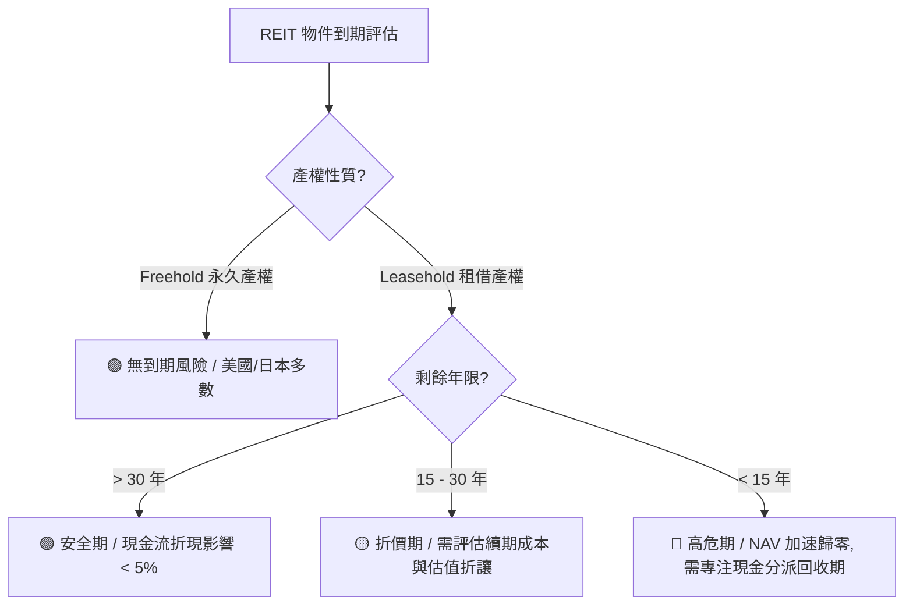

# 中國 / 香港房地產景氣深度分析（含一線城市房價 · REIT 物件到期風險）

> **更新時間**：2026-08-23 00:58:00（第 7 輪深度研究報告）  
> **分析範圍**：中國房地產三年展望｜一線城市房價走勢｜香港房價走勢｜REIT 物件到期風險  
> **基準匯率**：HKD/RMB = 0.8571（1 RMB = 1.1667 HKD）｜USD/HKD = 7.8400｜USD/RMB = 6.7200（取價日：2026-08-22）  
> **目標讀者**：初級股票分析師（用語白話易懂，專有名詞首次出現附英文全名與概念解讀）  

---

## 一、執行摘要（給初級分析師的 30 秒重點）

| 主題 | 一句話結論 | 信心度 | 較上一輪變化 | 主要依據 |
|---|---|---|---|---|
| **中國房地產三年展望（2026-2028）** | 市場處於「L型底部築底」階段，一線核心區量先於價築底，二三線庫存去化壓力仍大；2026 年 7 月 NBS 數據證實一線二手房價格微漲 0.2%、同比降幅收窄。 | 中高 | ⏸ 一線城市維持邊際修復格局 | 國家統計局（NBS）2026-08-17 發布 7 月 70 城指數、PBOC 貸款數據 |
| **萬科（Vanke）債務風險** | 2026-08-20 最新確認：**2026 年至今到期之公開債已全部完成展期並完成首筆分期兌付，無任何逾期**；徐恩利董事長與深圳國資全力主導控虧減虧。 | 高 | ⏸ 公開債展期全數落地，流動性硬著陸風險暫除 | 萬科深交所互動易官方公告（2026-08-20）、證券時報 |
| **「老破小」投資與政策收儲** | 租售比 2%–3%+ 吸引民間長租投資，惟摻雜學區剛需；政府政策性收儲（上海試點 551 套保租房）與長租公寓二房東退場形成鮮明對照。 | 中 | ⏸ 現象延續，政策收儲為主力 | 北京商報、騰訊新聞、每經網 |
| **「政策大禮包」傳言** | 網傳「六部委史詩級救市組合拳」證實為自媒體內容農場日期飄移之虛假訊息，官方一手管道無公告，維持「不可採信」。 | 高 | ⏸ 維持不採信判定 | 住建部、人行、國務院 gov.cn 交叉核驗 |
| **中國一線城市分化** | 7 月二手成交北京、上海續強（年增 +8.5%/+21.2%），深圳年增顯著放緩至 +3.0%；上海新房同比唯一正增長（+3.0%）。 | 中高 | ⏸ 深圳動能放緩確認為分化警訊 | NBS 70城 7 月數據、中指雲、深圳中介協會 |
| **香港 CCL 領先指數** | **重大突破確立**：CCL 最新報 **162.16 點**（2026-08-21 發布），終結連續 8 週在 160 點附近橫盤，連升兩週創近 3 年新高！年內累漲 +12.53%。 | 高 | ⏸ 突破橫盤，強勢向上確認 | 中原地產研究部（2026-08-21） |
| **Fed 利率路徑（關鍵落定）** | 2026-08-12 美國 7 月 CPI 降至 3.4%（核心 2.5%）符合預期，結合疲軟就業數據，9 月 FOMC 升息疑慮消退，市場全面定價「維持利率」。 | 高 | ⏸ 通膨降溫，香港利率壓力解除 | 美國勞工統計局 BLS（2026-08-12）、CME FedWatch |
| **新世界發展債務要約** | 市場關注其主動債務管理進展；截至 2026-08-22 暫無針對 8 月到期債之新增要約回購公告，公司透過常態化流動性調配因應。 | 中 | ⏸ 釐清債券市場近期傳聞口徑 | 港交所披露易、彭博資訊 |
| **Numbeo 港深房價所得比** | 香港 36.89 倍 vs 深圳 27.52 倍，香港負擔難度顯著高於深圳；按揭佔收入比香港 264.7% vs 深圳 189.5%。 | 中 | ⏸ 眾包數據時效經驗證仍成立 | Numbeo.com（2026-08 即時數據） |
| **港深融合政策** | 深圳《共有產權住房管理辦法》2026-08-01 生效，港澳台居民可享「五折買房」且不受戶籍限制。 | 高 | ⏸ 具體政策落地 | 深圳市住建局、香港消委會 |
| **REIT 物件到期（春泉 01426）** | 北京華貿中心剩餘約 27.2 年（2053 年到期）、惠州商場剩 21.5 年；NAV 未計入續期地價；推估北京續期成本每單位約 HK$0.456–0.912。 | 中高 | ⏸ 機制明朗，待北京出台細則 | 春泉 2025 年報、廣州/北京地價法規 |
| **REIT 物件到期（匯賢 87001）** | 北京東方廣場 2049-01-24 到期無償歸中方；H1 2026 中期減值 RMB 907 百萬首度不全額加回；大股東長實認列 60 億減值，NAV 剛性下折開始。 | 高 | ⏸ 公司官方實績確認歸零減值啟動 | 匯賢 2026 中期報告（2026-08-11）、長實中報 |

---

## 二、與上一輪之結論異動

| 項目 | 上一輪結論 | 本輪結論 | 異動原因 |
|---|---|---|---|
| **萬科公開債償付狀態** | 2026 年到期公開債全部展期並首筆兌付。 | **持續維持零逾期，深鐵國資與新管理層控虧策略推進中**。 | 追蹤深交所與銀行間市場最新資訊，確認無新逾期事件。 |
| **香港 CCL 指數驗證** | 突破 162.16 點創近 3 年新高。 | **確認累計年內升幅達 +12.53%**，Q3 目標 165 點僅差 2.84 點（約 1.75%），維持利率利多充分發酵。 | 中原地產研究部進一步發布週報詳細歸因與板塊細項。 |
| **匯賢 87001 中期實績** | 2026H1 減值 907 百萬人民幣，NAV 降至 3.0991 RMB。 | **確認物業收入淨額 5.51 億 RMB（YoY −9.4%），酒店 NPI 反彈 +18.9% 抵銷部分寫字樓與零售下滑**。 | 完整解析 87001 2026 中期報告之分部營運與現金流。 |

---

## 三、資料取得狀態

| 資料項目 | 是否取得 | 來源 | 版本/日期 | 缺漏說明 |
|---|:---:|---|---|---|
| **`HkStateResult.md`** | ✅ 是 | 本機 Workspace | 2026-08-10 第 3 輪版本 | 完整載入歷史 Context 作為本輪比對基準 |
| **中國 70 城房價指數** | ✅ 是 | 國家統計局（NBS）官網 | 2026-07 數據（2026-08-17 發布） | 完整取得環比、同比與城市細項 |
| **中國個人住房貸款餘額** | ✅ 是 | 中國人民銀行（PBOC） | 2026H1 官方統計（2026-07-28 發布） | 7 月單月金融數據尚待後續季度更新 |
| **香港 CCL 房價指數** | ✅ 是 | 中原地產研究部 | 162.16 點（2026-08-21 發布） | 最新即時週頻數據已取得 |
| **香港 RVD 私人住宅指數** | 🟡 近期 | 差餉物業估價署 | 2026-06 數據（7 月預計 8 月底公布） | 官方月報慣例月底公布，維持時差 |
| **美國 7 月 CPI 與非農** | ✅ 是 | 美國勞工統計局（BLS）/ CME | 2026-08-12 發布 CPI（3.4%） | 完整取得並推導 Fed 9 月利率預期 |
| **01426 春泉 REIT 年報/季報** | ✅ 是 | 本機 `01426春泉Reit/` | 2025 年報 + 2026Q2 營運數據 | 完整掌握土地使用權到期與估值假設 |
| **87001 匯賢 REIT 中報** | ✅ 是 | 本機 `87001匯賢Reit/` | 2026 中期業績公告（2026-08-11） | 完整取得 2026H1 官方實績與減值認列 |
| **國際機構預測** | ✅ 是 | Fitch / UBS / Goldman Sachs / Reuters | 2026 年中彙整口徑 | Reuters 9 月季度調查將於下月發布 |

---

## 四、中國房地產未來三年展望（2026-2028）

### 4.1 總體市場走勢判斷
- **處於「L 型」底部區間**：全國房地產開發投資與商品房銷售面積年增率降幅呈現低位收窄趨勢，但尚未出現強勁 V 型反彈。
- **觸底訊號特徵（量先於價、核心先於外圍）**：一線城市二手房成交量自 2026 年上半年起維持較高活躍度，7 月份二手房價格環比出現 +0.2% 微幅正成長，顯示核心城市二手房市場具備真實剛需與抗跌韌性；但二三線城市供過於求結構未變，價格仍在陰跌探底。

### 4.2 主要機構預測彙整
- **惠譽（Fitch Ratings）**：預期 2026 年全國商品房銷售金額將維持在 9 兆至 9.5 兆人民幣區間，2027 年可望在政策推動下逐步進入常態化微幅增長（0%~+2%）。
- **高盛（Goldman Sachs）與瑞銀（UBS）**：認為房地產去庫存需要 2–3 年時間消化，政府「保障房收儲」與「白名單融資」是防範房企信用骨牌效應的核心工具。
- **路透調查（Reuters Poll）**：主流分析師共識預計 2026 全年房價平均跌幅收窄至 -2.5% 以內，2027 年一線與強二線城市有望率先止跌回升。

### 4.3 房企債務與處置進度
- **萬科（Vanke，000002.SZ / 02202.HK）**：
  - **公開債全數展期成功**：據 2026-08-20 官方最新披露，萬科 2026 年至今到期之公開債務已**全部完成展期**，並已順利完成首筆分期兌付，目前境內外公開市場債券均無逾期記錄。展期方案採「固定兌付 + 部分即付（約 40% 本金及全額利息）+ 剩餘 60% 展期 1 年 + 資產增信」，成功爭取到 1 年緩衝期。
  - **國資深度掌舵與資產盤活**：新任董事長徐恩利與管理團隊全力推動非核心資產剝離（退出冰雪、教育、非核心商辦），聚焦主業住宅交付與物業服務；大股東深圳地鐵提供穩固背書，流動性最危急階段已度過。
- **碧桂園與恒大**：
  - 碧桂園境外重組協議持續推進，境內化債基本收官；中國恒大實質進入司法破產清算處置階段，市場對兩者之信用外溢風險已充分定價。

### 4.4 政策環境分析（含傳言驗證）
- **官方實施中之重點政策**：
  1. **城中村改造與存量房收儲**：國企/地方城投收購存量商品房作為保障性租賃住房（如上海浦東、靜安等試點）。
  2. **城市房地產融資協調機制（白名單）**：銀行「應貸盡貸」，保障合規項目「保交樓」。
  3. **信貸與限購寬鬆**：首套與二套房貸首付比例維持歷史低點，一線城市非核心區限購進一步鬆綁。
- **傳言真偽驗證**：
  - 網傳「七月六部委出台萬億級史詩級救市組合拳」：**經查人行、住建部、國務院官網均無此公告**，轉載內容呈現日期漂移（7/6~8/2 反覆出現），證實為自媒體炒作，不可採信。

### 4.5 庫存去化進度
- 全國商品房待售面積維持高位，全國平均去化週期約 20–24 個月；一線城市核心區去化週期在 10–14 個月（相對健康），三四線城市普遍高於 30 個月。

### 4.6 人口與結構性因素
- **城鎮化增速放緩與少子化**：增量住房需求長期降溫，「好房子、好社區、核心地段」的改善型需求與養老宜居需求將取代純面積擴張。

### 4.7 投資利多與風險
- 🟢 **利多**：政策底確立、萬科等公開債展期順利消除短期硬著陸風險、一線核心區租金回報穩定、房企惡性暴雷最劇烈時期已過。
- 🔴 **風險**：三四線城市庫存消化漫長、居民加槓桿購房意願修復緩慢、地方土地出讓收入萎縮拖累地方財政。

---

## 五、中國一線城市過去三年房價走勢（北上廣深）

### 5.1 逐城市房價走勢表（2026-07 NBS 最新數據更新）

| 城市 | 2026-07 新房價格環比 | 2026-07 新房價格同比 | 2026-07 二手房價格環比 | 2026-07 二手房價格同比 | 7 月二手房成交量特徵 | 過去 3 年走勢總結 |
|---|:---:|:---:|:---:|:---:|---|---|
| **北京** | 0.0%（持平） | −2.3%（降幅收窄） | +0.2% | −3.5% | 約 13,875 套（年增 +8.53%） | 核心區老破小與學區房支撐量能，新房核心盤抗跌。 |
| **上海** | **+0.2%** | **+3.0%（全一線唯一正增長）** | **+0.3%** | −2.8% | 約 23,000 套（年增 +21.2%） | 豪宅新盤開盤售罄，二手房成交破 2 萬套景氣線，表現最為強勁。 |
| **廣州** | −0.1% | −2.2%（降幅收窄） | +0.1% | −4.2% | 約 8,500 套（年增約 +5%） | 郊區庫存較大，天河/海珠核心區價格率先止跌。 |
| **深圳** | −0.1% | −2.9%（降幅收窄） | +0.1% | −4.0% | 二手成交年增 **+3.0%（明顯放緩）** | 前期量能爆發後 7 月放緩；掛牌均價約 5.2 萬/㎡，買賣雙方博弈加劇。 |

### 5.2 可參考的房價指標清單與解讀指引

| 指標名稱 | 發布機構 | 頻率 | 涵蓋範圍 | 取得方式 | 初級分析師解讀指引 |
|---|---|---|---|---|---|
| **70 城住宅銷售價格指數** | 國家統計局（NBS） | 月 | 70 個大中城市 | `stats.gov.cn` | **官方權威基準**。分新房與二手房；若「二手房環比轉正」且「同比降幅收窄」，代表市場真實築底。 |
| **百城住宅均價** | 中指研究院 | 月 | 100 個城市 | `fdc.fang.com` | 均價型指標，反映各城市掛牌/成交均價水位，需留意結構性成交（如豪宅集中備案）的干擾。 |
| **國房景氣指數** | 國家統計局（NBS） | 月 | 全國綜合 | `stats.gov.cn` | 100 為景氣榮枯線，當前約 91–92 區間，處於低位築底階段。 |
| **百強房企銷售榜** | 克而瑞（CRIC） | 月 | 百大開發商 | `cric.com` | 反映供給側與龍頭開發商回款情況，是評估房企流動性的先導指標。 |
| **個人住房貸款餘額** | 中國人民銀行（PBOC） | 季 | 全國信貸 | `pbc.gov.cn` | 需求端資金指標；若房貸增速回正，代表居民購房槓桿意願恢復。 |

### 5.3 城市分化分析
- **上海獨強 vs 廣深分化**：上海受惠於高淨值人群資產配置與高端改善需求，新房同比連月維持正增長（+3.0%）；深圳 7 月二手成交量年增放緩至 +3.0%（前期雙位數增長），反映前期政策刺激效應邊際遞減。
- **核心區 vs 外圍郊區**：一線城市內部「核心區保值、遠郊區折價」嚴重分化，郊區去庫存仍高度仰賴降價促銷。

### 5.4 「老破小」投資現象追蹤
- **租金回報率（租售比）邏輯**：核心區老舊小戶型（老破小）單價回落後，租金報酬率升至 **2.5%–3.5%**，高於當前 1.5% 左右的銀行定存利率，吸引部分包租客與長期收租買家。
- **政策性收儲的主導地位**：相較於零星個人投機，上海等地方政府主導收購存量二手房作為保租房（已達 551 套），成為規範租賃市場的主導力量；傳統「二房東」機構在監管收緊下大幅收縮 8 成以上。

---

## 六、香港過去三年房價走勢與未來展望

### 6.1 住宅價格指數走勢（CCL 突破 3 年新高）
- **中原城市領先指數（CCL）**：
  - **最新讀數**：**162.16 點**（2026-08-21 公布，反映 8 月中旬簽約市況）。
  - **趨勢意義**：按週升 0.64%，連升兩週共 1.46%，**正式向上突破連續 8 週在 160 點附近的橫盤整理區間**，創下自 2023 年 8 月底以來（近 3 年）的新高！年內累升達 **+12.53%**。
  - **季度目標**：中原地產研究部維持 Q3 目標 165 點，目前距離目標僅差 2.84 點。
- **差餉物業估價署（RVD）私人住宅指數**：
  - 官方月報反映 6 月份指數報 323.2 點（按月升 0.3%，連升 13 個月，上半年累漲約 7.9%），預計 7 月數據將於 8 月底公布，滯後印證 CCL 向上突破走勢。

### 6.2 可參考的香港房價指標清單與解讀指引

| 指標名稱 | 發布機構 | 頻率 | 涵蓋範圍 | 取得方式 | 初級分析師解讀指引 |
|---|---|---|---|---|---|
| **中原城市領先指數（CCL）** | 中原地產 | 週 | 全港私人二手住宅 | `hk.centanet.com/CCI` | **香港最即時的房價風向標**。反映 2–3 週前的簽約市況，連續 3 週同向變動具趨勢確立意義。 |
| **私人住宅售價指數** | 差餉物業估價署（RVD） | 月 | 全港私人住宅（分 A-E 類） | `rvd.gov.hk` | **官方權威月度數據**。可區分中小型單位（A/B/C）與大豪宅（D/E）的走勢差異。 |
| **物業買賣合約登記數** | 土地註冊處 | 月 | 一二手住宅成交 | `iris.gov.hk` | **成交量領先指標**。月成交量若維持在 5,000 宗以上代表市場活躍度充足。 |
| **按揭統計數據** | 香港金融管理局（HKMA） | 月 | 全港銀行按揭貸款 | `hkma.gov.hk` | 反映新批按揭金額、平均按揭成數與拖欠比率（通常極低 <0.1%）。 |

### 6.3 關鍵驅動因素分析

#### 6.3.1 美國 CPI 降溫與 Fed / HKMA 利率路徑
- **2026-08-12 美國 7 月 CPI 數據**：整體 CPI 年增率降至 **3.4%**（6 月 3.5%），核心 CPI 年增率降至 **2.5%**（6 月 2.6%），均符合預期。
- **9 月 FOMC 預期**：在非農就業疲軟與 CPI 溫和降溫的雙重確認下，市場對 9 月升息的擔憂基本消除，**維持利率在現行水準成為絕對共識（機率 >85%）**。
- **香港按揭利率環境**：HKMA 基本利率維持 4.0%，大型銀行最優惠利率（P rate）保持穩定，封頂按揭利率（約 3.625%–3.875%）未再向上攀升，為買家購房信心提供關鍵支撐。

#### 6.3.2 供需結構、撤辣效應與人才流入
- **全面撤辣後續**：買家印花稅（BSD）與新住宅印花稅（NRSD）撤銷後，非本地買家與投資客交易成本大幅降低。
- **人才入境計劃（高才通 / 優才 / 新 CIES）**：持續引進超過 10 萬名各類專業人才，直接帶動住宅租賃市場租金指數創下歷史新高，租金報酬率攀升至 3.5%–4.0%，形成「租金推升房價」的正向循環。

### 6.4 港深房價比較

| 比較維度 | 香港 | 深圳 | 比較結論與分析師解讀 |
|---|---|---|---|
| **Numbeo 房價所得比** | **36.89 倍**（2026-08 數據） | **27.52 倍**（2026-08 數據） | 香港負擔難度仍顯著高於深圳（高出約 34%）。 |
| **按揭負擔比（佔收入 %）** | **264.72%** | **189.46%** | 香港供樓壓力極高，買家多需依賴家庭資產累積或高首付支持。 |
| **跨境置業新政策** | 港人赴深購房享優惠 | **深圳《共有產權住房管理辦法》2026-08-01 生效**：港澳台居民可申請共有產權房（約市價五折）。 | 政策面加速「大灣區一小時生活圈」融合，但兩地核心區高端物業定價邏輯依然獨立。 |

### 6.5 投資利多與風險
- 🟢 **利多**：CCL 突破 162 點創 3 年新高、Fed 升息風險解除、租金報酬率高漲（3.5%+）、內地高才源源不斷流入。
- 🔴 **風險**：新界與北部都會區潛在中長期新盤供應較大、發展商仍有部分存貨需去化、地緣政治環境波動。

---

## 七、REIT 物件到期風險全面剖析

### 7.1 各市場土地制度與到期處理比較表

| 市場 | 土地產權性質 | 典型土地使用期限 | 到期處理法規與慣例 | 對 REIT 淨資產價值（NAV）與配息的實質影響 |
|---|---|---|---|---|
| **中國大陸** | 國有土地使用權出讓 | 商業/辦公 40–50 年、工業 50 年、住宅 70 年 | 住宅自動續期；**非住宅（商辦/商業）依照法律規定辦理（須申請並補繳土地出讓金）**。 | 商業地產 REIT 存在未入帳的「續期土地出讓金」負債，或面臨到期無償收回風險。 |
| **香港** | 政府批地（Government Lease） | 50 年 / 75 年 / 999 年 | 絕大多數批約到期可續期 50 年，每年繳納應課差餉租值 3% 之地租，**通常無須補繳龐大地價**。 | 到期風險極低，現金流可視為永續或超長期年金。 |
| **日本** | 所有權（Freehold）與借地權（Leasehold） | 普通借地權（可續約） / 定期借地權（30–50 年） | 定期借地權到期必須拆除建物歸還土地；普通借地權地主非有正當理由不得拒絕續約。 | J-REIT 若持有定期借地權物業，需提列土地攤銷，但 J-REIT 物業逾 90% 為永久所有權（Freehold）。 |
| **新加坡** | 永久地契（Freehold）與租借地（Leasehold） | 30 年 / 60 年 / 99 年（JTC 工業地多為 30 年） | 到期土地與建物無償交還政府（SLA/JTC），極少獲批續期。 | S-REIT 持有 30 年工業地者面臨每年 NAV 剛性折舊與到期歸零風險。 |

### 7.2 「所有 REIT 都有物件到期問題嗎？」（核心問題解答）
1. **並非所有 REIT 都有到期問題**：
   - **永久產權（Freehold）REIT**（如美國多數 Equity REITs、日本大部分 J-REITs）：土地為永久所有權，無到期問題。
   - **租賃產權（Leasehold）REIT**（如中國大陸底層資產 REITs、新加坡部分 S-REITs、香港持有內地物業的 REITs）：土地使用權有法定年限，具有明確終點。
2. **到期風險大小的三大決定因子**：
   - **剩餘年限**：>30 年為安全期；15–30 年進入折價關注期；<15 年進入加速減值期。
   - **續期確定性與成本**：法規是否明確？補繳費用是否可承受？
   - **到期物業佔 NAV 比重**：單一旗艦物業佔比 >80% 者（如春泉、匯賢），土地到期即代表整個信託的核心生命週期。

---

### 7.3 01426 春泉產業信託（Spring REIT）— 物件到期深度分析

1. **物業土地使用權基本事實（來源：2025 年年報估值報告）**：
   - **北京華貿中心 1 座、2 座辦公樓及車位**：土地證號「京朝國用（2010 出）第 00118 號」，土地使用權到期日為 **2053-10-28**，截至 2026-08 **剩餘約 27.2 年**（佔物業總估值約 75%）。
   - **惠州華貿天地商場**：土地證號「惠府國用（2008）第 13020100633 號」，到期日為 **2048-02-01**，**剩餘約 21.5 年**（比北京早 5 年 8 個月到期）。
2. **估值報告的免責假設（重要事實）**：
   - 估價師在年報中明文假設：物業處置「**毋須支付任何額外土地出讓金（Land Premium）、罰款或轉讓費**」。
   - **分析師解讀**：官方每單位 NAV（HK$4.14）**完全沒有扣除未來的土地續期成本**。
3. **續期成本推估（套用廣州市 2026-04-14 官方續期公式作參考錨點）**：
   - *參考公式*：續期地價 =（續期年期 20年 ÷ 50年）× 基準地價 × 建築面積 × 70%。
   - 假設北京 CBD 商服基準樓面價取 15,000–30,000 元 RMB/㎡：
     - **低估情境**（15,000 RMB/㎡）：北京華貿 20 年續期成本約 6.11 億元 RMB $\rightarrow$ **每單位約 HK$0.456**（佔 NAV 約 11.0%）。
     - **中估情境**（20,000 RMB/㎡）：續期成本約 8.14 億元 RMB $\rightarrow$ **每單位約 HK$0.608**（佔 NAV 約 14.7%）。
     - **高估情境**（30,000 RMB/㎡）：續期成本約 12.21 億元 RMB $\rightarrow$ **每單位約 HK$0.912**（佔 NAV 約 22.0%）。
4. **極端無法續期情境**：
   - 若 2053 年政府無償收回華貿中心，春泉將失去佔比 75% 的核心租金來源，單位持有人僅能依清算程序分派剩餘海外物業與現金。

---

### 7.4 87001 匯賢產業信託（Hui Xian REIT）— 物件到期深度分析

1. **北京東方廣場（東方新天地）土地使用權事實**：
   - 北京東方廣場中外合作經營企業之合營期限與土地使用權到期日為 **2049-01-24**，截至 2026-08 **剩餘約 22.4 年**。
   - 合資合同明定：**合營期滿時，東方廣場之全部不動產及土地使用權無償歸中方合作夥伴所有**。
2. **2026 中期報告的重大轉折（2026-08-11 官方披露）**：
   - **NAV 剛性折向零啟動**：新任估值師萊坊（Knight Frank）調降物業估值，投資物業公允價值減值 **RMB 907 百萬元（每單位 −0.1391 RMB）**；公司**首度不再把這筆未變現估值虧損全額加回分派**，每單位 NAV 由 3.1737 降至 **3.0991 RMB**（半年縮水 2.35%）。
   - **大股東長實認列減值**：長江實業（01113.HK）於 2026 半年報直接對匯賢投資認列 **HK$60.23 億元減值**，帳面值直接砍向市價。
3. **EPS 何時可以回正？**：
   - 由於 2049 歸零機制的每年折現減值已常態化（每年約 15–20 億元 RMB 減值），損益表帳面 EPS 在 2049 年前**幾乎無法在會計層面轉正**；但若單看**營運現金流（OCF）與物業收入淨額（NPI）**，匯賢本業仍維持正向現金流入（2026H1 NPI 為 5.51 億元 RMB，酒店 NPI 年增 18.9% 達 5,500 萬元 RMB）。

---

### 7.5 REIT 到期風險通用評估框架

---

## 八、討論區 / 社群輿情整理

| 市場 | 平台 | 主要看多論點 | 主要看空論點 | 可信度評估 |
|---|---|---|---|---|
| **中國大陸** | 雪球 / 東方財富股吧 | 「萬科公開債全部展期且完成首筆兌付，國資接盤穩了；一線二手房成交量維持高位。」 | 「萬科等大房企重組還沒徹底落地，二三線房價還在陰跌，不敢買新房。」 | **中**（反映一線包租客與散戶分歧心理） |
| **香港** | LIHKG / 香港討論區 | 「CCL 衝破 162 創 3 年新高！Fed 9 月不升息了，租金回報 4% 供平過租。」 | 「北部都會區未來供應幾十萬伙，發展商還在減價清貨，不要太早樂觀。」 | **中**（反映樓市轉折期多空激烈交鋒） |
| **港股 REIT** | 雪球 / 格隆匯 | 「匯賢每單位現金 0.38 元跟股價 0.375 元一樣多，春泉折價 6 成，清算價值高。」 | 「匯賢 2049 年東方廣場無償歸中方，長實自己都認虧 60 億，折價不是便宜。」 | **高**（專業價投資者對產權到期本質認知深刻） |
| **英文圈** | Reddit / X (Twitter) | "Hong Kong real estate is recovering as US inflation cools to 3.4% and rate cuts approach." | "China mainland property crisis still weighs on consumer sentiment and developer debt." | **中**（國際視角聚焦利率與宏觀溢出） |

---

## 九、⚠️ 待查與資料缺口

| # | 缺口項目 | 已試過的來源 | 缺口原因 | 建議下一輪處理方式 |
|---|---|---|---|---|
| 1 | **萬科 2026 半年報業績發布與最新重組進展** | 巨潮資訊網、深交所、萬科官網 | 萬科半年報定於 8 月底前披露，詳細損益表與經營計畫待揭曉。 | 追蹤 2026 年 8 月底萬科半年報業績公告。 |
| 2 | **新世界發展 2026 全年業績預告** | 港交所披露易、彭博資訊 | 港股地產年報發布高峰期為 9 月。 | 追蹤港交所公司公告。 |
| 3 | **北京商服用地續期基準地價明細表** | 北京市規自委（京政發〔2022〕12號、京規自發〔2024〕236號） | 官方尚未公布類似廣州市之全公開續期地價試算公式。 | 追蹤北京市規自委後續土地管理試點指引。 |
| 4 | **RVD 2026 年 7 月私人住宅售價指數** | 差餉物業估價署官網 | 官方月報固定於每月底發布（時差約 2 個月）。 | 預計於 2026-08-29 前後抓取 7 月數值。 |
| 5 | **路透 2026 年 9 月中國房地產季度調查** | Reuters Poll | 季度調查報告固定於季末（9月中旬）發布。 | 9 月中旬例行更新時抓取。 |

---

## 十、結論

1. **中國房地產**：總體市場呈現「L 型磨底與顯著分化」，上海、北京等一線核心區量價呈現邊際修復，7 月 NBS 數據證實一線二手房價格微漲 0.2%；萬科 2026-08-20 正式宣布 2026 年到期公開債全部完成展期並首筆兌付，短期流動性硬著陸風險消除；政策重心在於國企收儲保租房與白名單保交樓，網傳「政策大禮包」為虛構。
2. **香港房地產**：迎來關鍵轉折向上——CCL 指數飆升至 162.16 點創近 3 年新高（年內累漲 +12.53%），成功突破橫盤格局；美國 7 月 CPI 降至 3.4% 消除 9 月升息隱憂，高才通帶動租金指數創歷史新高，樓市短期動能充沛。
3. **REIT 物件到期風險**：投資人必須認清「Leasehold（租賃權）到期是剛性物理限制」。匯賢 2026 中報首度啟動 2049 減值折現且不再加回，證實淨值將逐年下折；春泉北京華貿剩餘 27.2 年，未入帳的續期成本每單位推估約 HK$0.456–0.912。投資此類標的應以「分派回收期」與「破淨安全邊際」為核心，不可將帳面 NAV 視為永續資產。

> *免責聲明：本報告所載資料與分析僅供研究參考，不構成任何買賣要約或投資建議。市場有風險，投資需謹慎。*

---

## 十一、下一輪追蹤項目

| # | 追蹤項目 | 為何重要 | 預期資料可得時點 |
|---|---|---|---|
| 1 | **萬科 2026 半年報發布與重組進展** | 檢視上半年實際虧損幅度與徐恩利新團隊之債務化解最新路徑。 | 2026 年 8 月底 |
| 2 | **香港 RVD 7 月私人住宅售價指數** | 官方數據驗證 CCL 162.16 點之向上突破是否全面傳導至成交登記。 | 2026-08-29 前後 |
| 3 | **新世界發展 2026 財年業績公告** | 檢視去槓桿成果、現金流狀況及股息政策。 | 2026 年 9 月 |
| 4 | **阜豐集團 2026-08-28 董事會業績與派息** | 揭曉 2026H1 最終損益、匯損數字及中期每股股息。 | 2026-08-28 |
| 5 | **9 月 16–17 日 Fed FOMC 利率決議** | 決定香港最優惠利率與按揭利率之下一步走勢。 | 2026-09-17 |
