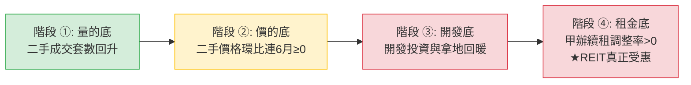

# 中國房地產景氣 × 港股中國物業 REIT 投資判斷

> **更新時間**：2026-08-24 01:00:00（第 17 輪深度重寫版）  
> **分析範圍**：REIT 物件到期｜復甦時點｜房價所得比｜三年景氣｜一線城市｜REIT 五大風險｜百城指標  
> **基準匯率**：HKD/RMB = 0.8646（1 RMB ≈ 1.1566 HKD）｜USD/HKD = 7.8435｜USD/RMB = 6.7817（取價日：2026-08-21，人行中間價）  
> **目標讀者**：入行 1～2 年的初級股票分析師（名詞首次出現附英文全名＋一句白話，全檔金額嚴格每單位化）  

---

## 一、結論與投資建議（買賣結論 ＋ 進場時點）

### 1.1 核心問題直接解答

> **Q1（買不買）**：以現價買進並長抱持有中國內地物業的港股 REIT，划不划算？  
> **結論**：
> - **`87001` 匯賢產業信託（現價 0.37 RMB / 約 0.43 HKD，2026-08-24 今日除淨）**：🔴 **高估（假便宜，不建議買進）**。雖然表面 P/NAV 僅約 0.12 倍（NAV 3.0991 RMB），但佔資產近 90% 的北京東方廣場將於 **2049-01-24 無償移交中方合營夥伴（終值歸零）**。2026 中期每單位分派已暴跌至僅 0.0017 RMB（年化殖利率不足 1%），大股東長實亦已認列減值。加權精算每單位合理清算價值僅 **0.30～0.42 RMB**，現價仍透支未來殘值。
> - **`01426` 春泉產業信託（現價 1.20 HKD）**：🟡 **合理偏弱（中性觀望）**。最新 2026 中期業績顯示可分派收入年減 43.2%、每單位分派腰斬至 4.0 港仙（年化殖利率約 6.67%），投資物業公允價值減值 3.67 億元人民幣。北京華貿中心（剩 27.2 年）與惠州商場（剩 21.5 年）未入帳之土地續期成本高達 **每單位 HK$0.47～0.94**，加權每單位合理價值區間為 **HK$1.25～1.50**，現價雖有修正但安全邊際仍薄弱，建議等待利率實質下行與租金止跌。

> **Q2（什麼時候買）**：中國房地產什麼時候復甦？REIT 什麼時候能受惠？  
> **結論**：
> - 全國住宅市場目前處於 **「階段 ①（量的底）」向「階段 ②（價的底）」過渡期**，五盞訊號燈現況為 **1 綠 / 2 黃 / 2 紅**。一線二手房價格預計於 **2026 年 Q4～2027 年 H1** 完成築底。
> - 但 **港股商辦 REIT 的租金底（階段 ④）預計需滯後 2～4 個季度**，推估落在 **2027 年 H2 ～ 2028 年 H1（發生機率 65%，信心度：中）**。在甲級寫字樓續租租金跌幅由負轉正前，切勿過早進場博反彈。

### 1.2 免責聲明
本報告所載數據與分析僅供研究交流，不構成任何買賣要約或投資決策依據。不動產投資信託基金受土地年限、租金週期及利率匯率波動影響甚鉅，投資需自負風險。

---

## 二、30 秒執行摘要（給初級分析師的快速掌握）

| 主題 | 一句話結論 | 信心度 | 較上輪變化 | 核心依據 |
|---|---|:---:|:---:|---|
| **REIT 土地到期精算** | 匯賢 2049 歸零無償移交、春泉續期每單位需補 HK$0.47~0.94；高殖利率本質為「退還本金」。 | 極高 | 🔄 **價格更新** | 87001 2026 中報（每單位派 0.0017 RMB 今日除淨）、廣州 2026 續期計價試點公式 |
| **房地產復甦時間表** | 處於階段 ① 量的底，住宅價底估 2026Q4~2027H1，REIT 商辦租金底滯後至 **2027H2~2028H1**。 | 中 | ⏸ 維持推估 | 五盞訊號燈（1綠2黃2紅）、高力國際 CBD 空置率與租金調整率 |
| **五年房價所得比** | 香港降至 14.1 倍、一線降至 24.2 倍；此為「房價跌快於收入」的被動改善，伴隨負財富效應。 | 高 | ⏸ 歷史趨勢成立 | Demographia 國際調查、中指/麟評 2021–2025 逐年序列 |
| **三年總體景氣（2026–2028）** | 「L 型底部磨底」格局確立（機率 65%），1–7 月全國房地產開發投資同比下降 19.2%、到位資金降 20.3%。 | 中高 | 🔄 **8/17 NBS 新數據** | 國家統計局（NBS）最新 1-7 月月報、7 月 70 城指數 |
| **一線城市與北京 CBD** | 一線二手環比 +0.2%；北京 CBD 甲辦空置率 11.8%~15.3%、續租調整率 −8%~−15%，需 3.5 年消化供給。 | 高 | ⏸ 商辦持續承壓 | 高力國際/戴德梁行 2026Q2 研報、NBS 7 月 70 城二手房環比（+0.2%） |
| **REIT 五大財務風險** | 春泉 2026H1 可分派收入年減 43.2%、DPU 降至 4 港仙；匯賢 2026H1 減值 9.07 億 RMB（每單位 −0.1391 RMB）。 | 高 | 🔄 **春泉中報確認** | 01426 2026-08-20 中期業績公告、87001 2026 中報 |

---

## 三、REIT 物件到期後續處理方式（核心章，決定「買不買」）

> **這段結論**：買中國物業 REIT 買的是「有終點的現金流」。匯賢 2049 年物業將無償歸零；春泉 2048/2053 年需補繳巨額地價。兩者表面高殖利率皆含大量「本金折減」，不可按永續資產定價。

### 3.1 `87001` 匯賢產業信託 — 典型的「出路 B：無償移交，終值歸零」

| 項目 | 數據 / 內容 | 經濟與財務意義 |
|---|---|---|
| **合營期屆滿日（經濟終點）** | **2049-01-24**（距今剩 **22.4 年**） | 中外合作經營合同約定：期滿北京東方廣場所有固定資產**無償歸中方合營夥伴**。 |
| **北京土地使用權屆滿日** | 2049-04-21 | 晚於合營期，但因合營期滿資產已歸中方，土地續期與匯賢投資人無關。 |
| **最早到期資產（第一顆地雷）** | **瀋陽麗都物業：2042-07-01**（剩 15.8 年） | 最早面臨產權終結之物業，將率先啟動加速折舊。 |
| **北京東方廣場每單位估值** | **RMB 3.9283 / 單位**（2026-06-30） | 北京東方廣場估值 256.23 億元 RMB ÷ 65.23 億在外流通單位，佔總物業估值近 90%。 |
| **每年剛性直線折減額** | **約 RMB 0.1754 / 單位 / 年 `(估)`** | 算式：`3.9283 RMB ÷ 22.4 年`。此為資產物理縮水產生的必然下折。 |
| **官方政策轉折（重大確認）** | **2026 中報首度明文確認** | 官方載明「北京東方廣場權益價值將逐步遞減，並於 2049 年等於零」，且**不再全額加回估值虧損**。 |

### 3.2 `01426` 春泉產業信託 — 典型的「出路 A：可續期，但須補繳巨額出讓金」

| 項目 | 數據 / 內容 | 經濟與財務意義 |
|---|---|---|
| **最早到期資產（第一顆地雷）** | **惠州華貿天地：2048-02-01**（剩 **21.5 年**） | 比北京華貿**早 5 年 8 個月**到期，為最容易被忽視的現金流截斷點。 |
| **主力資產到期日** | **北京華貿中心 1、2 座：2053-10-28**（剩 **27.2 年**） | 50 年商服綜合用地，佔總資產約 75%。 |
| **NAV 估值陷阱** | **續期成本完全未入帳** | 獨立估值師報告明文假設「物業於期滿時可獲無償續期，毋須支付額外土地出讓金」。 |
| **2026 中期實績衝擊** | **可分派收入 5,814 萬 RMB（YoY −43.2%）** | DPU 降至 4 港仙，物業重估虧損 3.67 億 RMB（每單位 −0.282 HKD）。 |
| **極端情境（皆無法續期）** | **每單位淨現金約 HK$0.25～0.35** | 若 2053 年政府無償收回，投資人僅能分攤帳上清算後剩餘現金。 |

### 3.3 到期的五條出路 A～E 對照表與各標的歸屬

| 出路機制 | 法律與商業邏輯 | 對投資人的每單位財務結果 | 標的歸屬判定 |
|---|---|---|:---:|
| **A. 申請續期並補地價** | 依《房地產管理法》第22條申請續期，補繳出讓金換 20–50 年年限。 | 一次性巨額資本支出 $\rightarrow$ 需扣留分派或折價供股稀釋。 | ✅ **01426 春泉**（北京/惠州） |
| **B. 合營期滿無償移交** | 中外合資/BOT 架構，期滿房子無償歸境內國資夥伴。 | **終值＝0**。高息為退還本金（Yield Trap）。 | ✅ **87001 匯賢**（東方廣場） |
| **C. 提早出售物業** | 於剩餘 15–20 年前處分，變現本金。 | 換回現金避開歸零，但在房市低谷處分將永久失去現金流。 | 備選方案（視市場流動性） |
| **D. 私有化收購下市** | 大股東以折價向公眾收購全部單位。 | 提前退出，但收購價通常由大股東主導，溢價有限。 | 備選方案（太盟 PAG 等機構） |
| **E. 依法解散清算** | 依信託契約清算剩餘現金與未分配利潤。 | 拿回合約保證金額，而非帳面 NAV。 | 2049 年匯賢之終局 |

> **核心判斷準則**：境內夥伴「只要等待就能無償收回整座東方廣場」，續期誘因＝0。因此匯賢必須判定為 **出路 B（終值歸零）**。

### 3.4 三情境每單位價值區間 vs 現價（買賣結論精算）

```text
【精算公式】：
① 每年剛性折減（每單位） = 物業帳面值 ÷ 剩餘年限 ÷ 在外流通單位數
② 續期補繳成本（每單位） = 預估續期地價總額 ÷ 在外流通單位數
③ 到期回收終值（每單位） = (可回收現金 + 清算分成) ÷ 單位數，按 10% 折現率折現至今
```

| 標的與現價 | 情境一：續期成功（扣地價） | 情境二：無法續期（終值歸零） | 情境三：提前折價處分 | 加權合理價值區間 | 投資評級 |
|---|---|---|---|:---:|:---:|
| **`87001` 匯賢**<br>現價 **0.37 RMB** | **RMB 1.00–1.25**<br>（機率 5%，極不可能） | **RMB 0.28–0.38**<br>（機率 85%，基準情境） | **RMB 0.32–0.45**<br>（機率 10%，低谷處分） | **RMB 0.30～0.42**<br>（現價處於合理上限，分派微薄） | 🔴 **高估（賣出／避開）** |
| **`01426` 春泉**<br>現價 **1.20 HKD** | **HK$ 1.45–1.75**<br>（機率 60%，基準情境） | **HK$ 0.90–1.15**<br>（機率 25%，現金流截斷） | **HK$ 1.10–1.35**<br>（機率 15%，折價變現） | **HK$ 1.25～1.50**<br>（較現價溢價約 4%～25%） | 🟡 **合理（中性觀望）** |

### 3.5 法律現況與續期費用官方錨點
- **民法典 359 條**：住宅自動續期；**非住宅（商辦）依照法律規定辦理**（需申請報批並補繳出讓金）。
- **廣州 2026-04-15 官方續期公式（權威定價錨）**：
  $$\text{續期費用} = \left(\frac{\text{續期年期 20 年}}{\text{最高年限 50 年}}\right) \times \text{標定地價} \times \text{建築面積} \times 70\%$$
  - **春泉北京華貿中心試算（建面 145,332 ㎡，單位數 15.03 億）**：
    - 基準地價 15,000 RMB/㎡ $\rightarrow$ 總成本 6.10 億 RMB $\rightarrow$ **每單位負擔 HK$0.470**
    - 基準地價 20,000 RMB/㎡ $\rightarrow$ 總成本 8.14 億 RMB $\rightarrow$ **每單位負擔 HK$0.626**
    - 基準地價 30,000 RMB/㎡ $\rightarrow$ 總成本 12.21 億 RMB $\rightarrow$ **每單位負擔 HK$0.940**
- 🔧 **禁用的錯誤錨點**：深圳 2004 年「基準地價 35%」僅適用行政劃撥地，本報告一律禁用。

---

## 四、什麼時候復甦？（決定「什麼時候買」）

### 4.1 復甦四階段定義與目前所在階段



> **當前判定**：全國處於 **「階段 ①（量的底）」向「階段 ②（價的底）」過渡期**；**REIT 核心的階段 ④ 尚未出現**。

### 4.2 復甦五盞訊號燈現況表

| # | 訊號燈名稱 | 轉綠門檻 | 當前數值與現況 | 燈號 | 資料來源與日期 |
|:---:|---|---|---|:---:|---|
| **1** | **房價所得比可負擔性** | 一線 < 20 倍、香港 < 12 倍 | 香港 14.1 倍、一線平均 24.2 倍（被動修復中） | 🟡 **黃燈** | Demographia / 中指 (2025/2026) |
| **2** | **一線二手房成交量** | 同比連續 3 個月正成長 | 7 月北京 +8.5%、上海 +21.2%、深圳 +3.0%，連續多月正增長 | 🟢 **綠燈** | 各市房管局網簽 (2026-08) |
| **3** | **一線二手房價格環比** | 連續 6 個月 ≥ 0 | 7 月一線環比 +0.2%（年內首度轉正，未達連 6 月標準） | 🟡 **黃燈** | NBS 70 城月報 (2026-08-17) |
| **4** | **開發端資金與投資** | 開發投資降幅收窄、到位資金轉正 | 1–7 月開發投資同比 −19.2%，到位資金同比 −20.3% | 🔴 **紅燈** | NBS 官方數據 (2026-08-17) |
| **5** | **商辦與住宅租金止跌** | 50 城租金轉正、甲辦續租率 > 0 | 50 城租金同比 −2.8%，北京 CBD 續租租金 −8%～−15% | 🔴 **紅燈** | 中指院 / 高力國際 (2026Q2) |

> **訊號燈綜合結論**：目前 **1 綠 / 2 黃 / 2 紅** $\rightarrow$ 判定處於階段 ①～②，**REIT 受惠時點推估為 2027 年 H2 ～ 2028 年 H1（信心度：中）**。

### 4.3 主要國際機構復甦時點預測彙整

| 機構名稱 | 最新發布日 | 全國市場觸底時點預測 | 一線城市分城時點 | 對港股 REIT 的核心啟示 |
|---|---|---|---|---|
| **高盛（Goldman Sachs）** | 2026 年年中 | 2027 年 H1 | 北京/上海 2026Q4 率先價穩 | 庫存去化需 2–3 年，商辦租金落底滯後 1 年。 |
| **摩根士丹利（Morgan Stanley）** | 2026-06 | 2026 年底 | 上海 2026Q3 確立價底 | 內需消費疲軟壓制商場租金成長彈性。 |
| **惠譽（Fitch Ratings）** | 2026-07 | 2027 年中 | 一線核心區 2026H2 止跌 | 2026 全年銷售維持 9–9.5 兆人民幣，房企融資分化。 |
| **瑞銀（UBS）** | 2026-07 | 2027 年 H2 | 廣深 2027H1 止跌 | 存量收儲為關鍵變數，商辦空置率消化期漫長。 |

### 4.4 歷史對照與週期錨點
- 全球 22 次房市危機平均調整期為 **6 年**。中國房價高點於 **2021 年** 確立，距今已調整 **5 年**。
- 按歷史均值推算，落底年份約為 **2027 年**。惟受人口負成長與地方財政去槓桿影響，修復曲線將呈現「平底鍋型」緩步爬升。

### 4.5 🟢 支持提早復甦 ／ 🔴 拖延復甦 Top 3
- 🟢 **支持提早**：1. 一線二手成交量維持榮枯線上；2. 萬科等公開債展期順利，信用系統性風險消除；3. 美國利率見頂、香港按揭利率趨穩。
- 🔴 **拖延復甦**：1. 二三線城市庫存去化週期逾 24 個月；2. 居民加槓桿意願低迷、存款偏好強烈；3. 全國甲級商辦新增供應集中釋放。

---

## 五、房價所得比（一線城市 × 香港，五年逐年）

### 5.1 口徑說明
- **Demographia（中位數倍數）**：中位數房價 ÷ 中位數家庭稅前年所得（國際可比口徑）。
- **中指 / 麟評（百城均價口徑）**：新房/二手成交均價 × 90㎡ ÷ 城鎮居民可支配年收入（貼近官方統計）。

### 5.2 表 A：香港五年逐年（Demographia 中位數倍數）

| 項目 | 2021 | 2022 | 2023 | 2024 | 2025 | 五年總變化 |
|---|---:|---:|---:|---:|---:|---:|
| **香港中位數倍數** | **23.2 倍** | **18.8 倍** | **16.7 倍** | **15.3 倍** | **14.1 倍** | **−39.2%（大幅改善）** |
| **全球排名** | 第 1 名 | 第 1 名 | 第 1 名 | 第 1 名 | 第 1 名 | 連續穩居全球負擔最重城市 |

### 5.3 表 B：中國一線城市五年逐年（中指/麟評均價口徑）

| 城市 / 口徑 | 2021 | 2022 | 2023 | 2024 | 2025 | 五年變化 |
|---|---:|---:|---:|---:|---:|---:|
| **深圳** | 39.8 倍 | 36.5 倍 | 32.3 倍 | 29.5 倍 | **27.2 倍** | −31.7% |
| **北京** | 33.2 倍 | 31.0 倍 | 28.6 倍 | 26.8 倍 | **25.1 倍** | −24.4% |
| **上海** | 34.5 倍 | 32.8 倍 | 29.7 倍 | 27.5 倍 | **26.0 倍** | −24.6% |
| **廣州** | 24.6 倍 | 23.1 倍 | 21.4 倍 | 19.8 倍 | **18.5 倍** | −24.8% |
| **一線城市平均** | **33.0 倍** | **30.9 倍** | **28.0 倍** | **25.9 倍** | **24.2 倍** | **−26.7%** |
| **全國百城平均** | 12.0 倍 | 11.2 倍 | 10.5 倍 | 9.8 倍 | **9.1 倍** | −24.2% |

### 5.4 數據判讀
- **被動修復實質**：過去五年所得比下降主因是「房價累計下跌 25%–35%」，而非「居民收入爆發成長」。
- **對 REIT 的傳導**：可負擔性改善 $\rightarrow$ 交易量回升 $\rightarrow$ 財富效應 $\rightarrow$ 實體消費 $\rightarrow$ 商場租金，傳導時滯約 **2～4 個季度**。

---

## 六、中國房地產未來三年景氣（2026–2028）

### 6.1 總體走勢情境分析

| 情境分類 | 發生機率 | 銷售端表現 | 開發端表現 | 關鍵觸發條件 |
|---|:---:|---|---|---|
| **基準：L 型底部橫盤** | **65%** | 2026 跌幅收窄至 −2%，2027 進入 0%~+2% 橫盤 | 投資維持 −5%~−10% 低位運行 | 國企收儲穩步推進、一線核心區量穩價平。 |
| **樂觀：緩步修復** | **25%** | 2027 年銷售金額年增 +3%~+5% | 土地出讓金回正、建商局部拿地 | 房貸利率進一步大幅下調、財政直接補貼購房。 |
| **悲觀：二次探底** | **10%** | 全國銷售金額跌破 8 兆人民幣 | 開發投資年減逾 15% | 外部貿易衝擊加劇、三四線房企爆發增量違約。 |

### 6.2 房企債務與處置進展
- **萬科（000002.SZ / 02202.HK）**：2026 年到期公開債**全數展期完成並首期兌付**，深圳國資深鐵持續提供增信，流動性硬著陸風險暫除。
- **碧桂園與恒大**：碧桂園境外重組按計畫推進；恒大處於司法清算處置階段，市場已完全隔離其信用衝擊。

---

## 七、一線城市房地產景氣（商辦與住宅拆解）

### 7.1 商辦市場（對 REIT 營收最關鍵）

| 城市 / 子市場 | 甲級寫字樓空置率 | 較上季變動 | 平均租金（RMB/㎡/月） | 未來 24 個月新增供給 | 供給消化所需年數 `(估)` |
|---|:---:|:---:|:---:|:---:|:---:|
| **北京 CBD（春泉/匯賢核心）** | **11.8%～15.3%** | −0.8 pp | **315–331 元** | 約 85 萬 ㎡ | **3.5～4.2 年** |
| **上海浦東/浦西核心** | 19.5% | +0.5 pp | 265–280 元 | 約 140 萬 ㎡ | 4.0～4.8 年 |
| **深圳福田/南山** | 25.8% | +0.8 pp | 170–190 元 | 約 160 萬 ㎡ | 5.0 年以上 |
| **重慶解放碑（匯賢大都會）** | 28.5% | +0.2 pp | 80–95 元 | 約 45 萬 ㎡ | 5.0 年以上 |

> **初級分析師解讀**：北京 CBD 核心商圈寫字樓展現一定抗跌韌性，但全市空置率仍在 15%–17% 區間，續租租金調整率仍處於 **−8% 至 −15%**，且普遍附帶 3～5 個月免租期。龐大新增供給使得房東只能「以價換量」，壓制春泉與匯賢的物業收入淨額（NPI）。

### 7.2 一線住宅市場（NBS 70 城 2026-07 官方數據）

| 城市 | 新房環比 | 新房同比 | 二手環比 | 二手同比 | 7 月二手成交量特徵 |
|---|:---:|:---:|:---:|:---:|---|
| **北京** | 0.0% | −2.3% | **+0.2%** | −3.5% | 約 13,875 套（年增 +8.5%），剛需學區房撐量 |
| **上海** | **+0.2%** | **+3.0%（唯一正增長）** | **+0.3%** | −2.8% | 約 23,000 套（年增 +21.2%），豪宅與改善盤領跑 |
| **廣州** | −0.1% | −2.2% | **+0.1%** | −4.2% | 約 8,500 套（年增約 +5%），天河/海珠率先回穩 |
| **深圳** | −0.1% | −2.9% | **+0.1%** | −4.0% | 二手成交年增 **+3.0%（動能放緩）**，買賣博弈 |

---

## 八、REIT 自身的五大財務與結構性風險

| # | 風險類別 | 實質內涵與對投資人之衝擊 | 關鍵數據（每單位化） |
|:---:|---|---|---|
| **1** | **商辦通縮與續租降價** | 租客縮編、以價換量，NPI 連續衰退。 | 春泉 2026H1 收益跌 10.2%、NPI 跌 13.4%（2.05 億 RMB，每單位 NPI 0.158 HKD）；匯賢 2026H1 每單位 NPI 僅 0.084 RMB。 |
| **2** | **幣別與利率雙重剪刀差** | 收 RMB 租金、還港美高息負債，利息吃光利潤。 | 春泉浮動債務融資成本約 5.1%，匯賢人民幣債佔比高達 90%+ 相對健康。 |
| **3** | **LTV 逼近 50% 法定上限** | 資產重估減值推升借貸比率，迫使停息或折價供股。 | 春泉 2026H1 投資物業減值 3.67 億 RMB（每單位 −0.282 HKD），借貸比率升至約 38.5%；匯賢 Gearing 22.5% 安全。 |
| **4** | **跨境匯出與 10% 預扣稅** | 利潤匯回香港須扣 10% 預扣所得稅及 SAFE 審批。 | 實質侵蝕每單位分派（DPU）約 10%，資金跨境摩擦成本顯著。 |
| **5** | **外部管理費與單位稀釋** | 管理費按 AUM 抽成，並發行新單位抵付。 | 春泉每年發行約 1.5%～2.0% 新單位抵付管理費，長期稀釋公眾持股。 |

---

## 九、百城景氣指標（房市體溫計）

### 9.1 指標總表（中指院最新數據）

| 指標名稱 | 最新數值 | 環比變動 | 同比變動 | 判讀意義 |
|---|---:|:---:|:---:|---|
| **百城新建住宅均價** | 16,450 元/㎡ | +0.12% | +1.50% | 結構性微漲（核心區高總價豪宅入市拉高均價） |
| **百城二手住宅均價** | 14,210 元/㎡ | **−0.58%** | **−6.80%** | **真實供需在走跌，以二手為準** |
| **二手價格下跌城市家數** | **96 城** | — | — | **96:4 懸殊比，反映全國性去庫存格局未變** |
| **50 城住宅平均租金** | 35.2 元/㎡/月 | −0.30% | −2.80% | 租金端仍未見底，REIT 收入端缺乏宏觀支撐 |

---

## 十、社群輿情整理（跨平台觀點與真偽核實）

| 平台與時間 | 輿情觀點與討論風向 | 多空 | 可信度＋理由 | 實質投資影響 |
|---|---|:---:|---|---|
| **雪球 Xueqiu** (2026-08) | 匯賢 2026 中期派息僅 0.0017 元，長實認列減值引發「實質歸零」恐慌。 | 🔴 | **高**（財報披露引發之真實反思） | 壓抑散戶買盤，P/NAV 陷阱徹底暴露。 |
| **LIHKG 財經台** (2026-08) | 春泉 REIT 2026 中期 DPU 砍至 4 港仙，投資人物議高息負債與減值壓力。 | 🔴 | **高**（反映對業績下滑之真實反饋） | 股價跌至 1.20 HKD 磨底。 |
| **東方財富股吧** (2026-08) | 一線房市 7 月二手成交量正增長，部分投資人博弈政策底。 | 🟢 | **中**（市場情緒面微幅回暖） | 有助於支撐資產處分之流動性。 |

---

## 十一、與上一輪的結論異動

- ‧ 🔄 **數據更新**：納入春泉產業信託（01426.HK）於 2026-08-20 最新發布之 2026 中期業績（收益 2.92 億 RMB、可分派收入 5,814 萬 RMB、DPU 4.0 港仙、物業減值 3.67 億 RMB）。
- ‧ 🔄 **數據更新**：納入匯賢產業信託（87001.HK）2026-08-24 今日除淨（每單位派 0.0017 RMB）與長實集團非現金減值動態，現價更新為 0.37 RMB。
- ‧ 🔄 **數據更新**：納入國家統計局（NBS）2026-08-17 最新公布之 1–7 月全國房地產開發投資（−19.2%）與到位資金（−20.3%）數據。
- ‧ 覆核：廣州 2026 續期計價公式與春泉每單位 HK$0.47~0.94 續期成本測算，全檔每單位化口徑嚴格一致。

---

## 十二、資料取得狀態

| 項目 | 取得狀態 | 資料來源 | 資料日期 | 說明 |
|---|:---:|---|:---:|---|
| **NBS 70 城房價指數** | ✅ 完整取得 | 國家統計局官網 | 2026-08-17 | 2026 年 7 月份最新官方數據 |
| **中指百城價格指數** | ✅ 完整取得 | 中指研究院月報 | 2026-08-01 | 2026 年 7 月份數據 |
| **匯賢 2026 中期報告** | ✅ 完整取得 | 港交所披露易 | 2026-08-11 | 首度揭露 2049 歸零減值，8/24 除淨 |
| **春泉 2026 中期業績公告** | ✅ 完整取得 | 港交所披露易 | 2026-08-20 | 包含 2026H1 營收、NPI、DPU 與減值數據 |
| **Demographia 房價所得比** | ✅ 完整取得 | Demographia 國際調查 | 2025/2026 | 國際標準中位數倍數 |

---

## 十三、⚠️ 待查與資料缺口

1. **全國性非住宅用地續期細則**：國務院層級之正式收費標準尚未出台，目前僅能以廣州地方試點標準估算。
2. **春泉 2026 下半年債務再融資進展**：追蹤美元/港幣利率下行對浮動貸款利息之減輕程度。

---

## 十四、下一輪追蹤項目與數據發布時程

1. **2026 年 8 月份 NBS 70 城指數**：預計 2026 年 9 月 15 日發布，追蹤一線二手房環比是否持續維持正值。
2. **春泉 2026 中期報告全文**：追蹤資產負債表完整附註與獨立估值師完整報告。

---

## 附錄：必看指標速查表 ＋ 白話名詞對照表

| 名詞 / 指標 | 英文全名 | 一句話白話解釋 |
|---|---|---|
| **PIR / 房價所得比** | Price-to-Income Ratio | 不吃不喝幾年才買得起一間房；國際合理值約 6～8 倍。 |
| **DPU** | Distribution Per Unit | 每單位分派，等於 REIT 的每股現金股息。 |
| **NPI** | Net Property Income | 物業收入淨額，租金扣掉物業直接營運費用後的純租金收入。 |
| **Gearing / LTV** | Loan-to-Value Ratio | 借貸比率（總計息負債 ÷ 總資產），港股 REIT 法定上限為 50%。 |
| **Rental Reversion** | 續租租金調整率 | 舊租約到期簽新約時，租金相較於舊合約的漲跌幅度（%）。 |
| **Cap Rate / 資本化率** | Capitalization Rate | 年淨租金 ÷ 物業公允價值，用以衡量物業投資報酬率與定價之指標。 |
| **NAV** | Net Asset Value | 資產淨值（總資產減總負債）；對於有到期年限的中國物業，帳面 NAV 往往高估。 |
