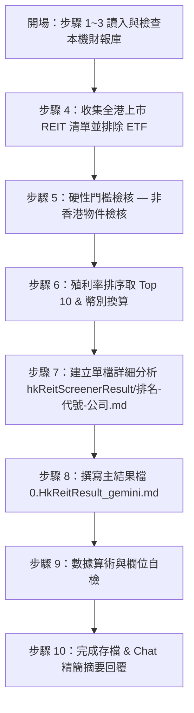

/goal
# 香港 REIT 殖利率前 10 名篩選與分析（HK REIT Screener · Gemini 版）
> **規格檔**：`Routines_HkReit_gemini.md`（每次執行前必讀）
> **主結果檔**：`hkReitScreenerResult/0.HkReitResult_gemini.md`
> **個股詳細檔**：`hkReitScreenerResult/<排名>-<代號>-<公司>.md`（每家 Top 10 REIT 獨立一檔）
---

## 1. 核心參數與不可違反原則 (Invariants)

### 1.1 執行參數表
| 參數 | 規範值 | 說明 |
| :--- | :--- | :--- |
| **語言** | 繁體中文 | 專有名詞首次出現附英文，如：`分派收益率（Distribution Yield）` |
| **市場與標的** | 香港上市之 REITs | 僅限香港交易所上市之房地產投資信託基金（REITs），**嚴禁納入 REIT ETF** 或普通地產開發股 |
| **榜單容量** | **Top 10** | 按最新殖利率由高至低嚴格排序，選出前 10 名；不足 10 名照實列出，嚴禁湊數 |
| **非香港物件門檻** | **必須含有非香港物件** | REIT 必須持有至少一座位於香港以外（如中國大陸、新加坡、澳洲、英國、歐美等）之不動產物件 |
| **幣別規範** | **港幣（HKD）為主，87001 特例** | 若財務數據單位為人民幣（RMB），強制按最新匯率轉為港幣（HKD）。**唯一例外：87001（匯賢產業信託）維持人民幣（RMB）** |
| **時間格式** | `YYYY-MM-DD_hh:mm:ss` | 結果檔與摘要時間戳記 |

> ⭐️ **核心目標**：產出 `hkReitScreenerResult/0.HkReitResult_gemini.md`（主結果檔）以及 `hkReitScreenerResult/<排名>-<代號>-<公司>.md`（Top 10 個股詳細分析檔），深入分析香港殖利率前 10 名且持有非香港物業的 REIT。

### 1.2 核心不可違反原則
1. **讀寫路徑規範**：
   - 主結果檔路徑：`d:\FinancialReport\hkReitScreenerResult\0.HkReitResult_gemini.md`
   - REIT 詳細檔路徑：`d:\FinancialReport\hkReitScreenerResult\<排名>-<代號>-<公司>.md`（排名補零，如 `01-87001-匯賢產業信託.md` 或 `02-0405-越秀房產信託基金.md`）。
   - 所有讀寫操作一律限定於 `d:\FinancialReport\hkReitScreenerResult\` 目錄下。
2. **REIT ETF 嚴格排除**：本任務只分析單一 REIT 實體，絕對不可包含任何 REIT ETF 或相關追蹤基金。
3. **殖利率由高到低排序**：主表格與詳細檔排序必須嚴格依據最新殖利率（Dividend Yield / Distribution Yield）從高至低排列。
4. **非香港物件硬性過濾**：凡物業 100% 位於香港、無任何非香港物業的 REIT，一律剔除於 Top 10 榜單之外，並於「五、不符條件/落榜清單」註記原因。
5. **REIT 中文名稱強制顯示**：所有表格與標題中的 REIT 名稱必須以繁體中文呈現（如：領展房產基金、越秀房產信託基金、匯賢產業信託、春泉產業信託等）。
6. **幣別轉換規則**：
   - 一般情況：若原始財報或數據單位為人民幣（RMB），必須依最新匯率換算為港幣（HKD），並標註 `(HKD)`。
   - **唯一例外**：代號 `87001`（匯賢產業信託）為人民幣計價與派息之 REIT，**必須保留人民幣（RMB）單位**，並明確標註 `(RMB)`。
7. **主表格必備 7 大欄位**：
   - 股價（Share Price）
   - 殖利率（Dividend Yield）
   - 租金報酬率（Rental Yield / Gross Cap Rate）
   - 負債比率（Debt Ratio / LTV / Gearing Ratio）
   - 股價淨值比（P/B Ratio / Price-to-NAV）
   - 物件區域（Property Region / Location）
   - 投資標的（Investment Target / Property Type）
   - 投資物件數目（Number of Investment Properties）
8. **一體化撰寫（Atomic REIT Entry）**：進入 Top 10 的 REIT，必須立即建立/更新對應的 `hkReitScreenerResult\<排名>-<代號>-<公司>.md` 檔案，包含完整的基本面分析、租務結構、物業分佈與風險利多。
9. **落榜與非 Top 10 檔案清理**：未進入 Top 10 或落榜的 REIT，其對應之詳細分析檔案必須從 `hkReitScreenerResult\` 目錄中刪除。

---

## 2. 標準執行流程 (Execution Workflow)

分為四大階段、共 10 個標準步驟：



### 階段一：開場與資料庫掃描（步驟 1 ~ 3）
- **步驟 1 — 讀入規格**：讀取 `Routines_HkReit_gemini.md`。
- **步驟 2 — 讀取本機財報與資料庫**：
  - 檢查本機 GitHub 財報庫 `d:\FinancialReport\`（如 `01426春泉Reit`、`87001匯賢Reit` 等）之年報、季報與輿情檔案。
  - 讀取主結果檔 `hkReitScreenerResult/0.HkReitResult_gemini.md`（若不存在則依 §5 骨架新建）。
- **步驟 3 — 標的清單盤點**：
  - 盤點香港交易所上市之所有 REITs 標的（如：0823 領展房產基金、0405 越秀房產信託基金、0778 置富產業信託、0808 陽光房產基金、0878 招商局商業房託、1426 春泉產業信託、2778 冠君產業信託、87001 匯賢產業信託、0435 順豐房託等）。

---

### 階段二：過濾、排序與數據處理（步驟 4 ~ 6）
- **步驟 4 — 排除非 REIT 標的與 REIT ETF**：
  - 嚴格剔除所有 REIT ETF（如 2837、3188 等 ETF 類產品）及一般地產開發商股票。
- **步驟 5 — 非香港物件門檻查驗**：
  - 檢查各 REIT 物業組合（Portfolio）：
    - **通過**：持有至少 1 座位於香港以外（中國大陸、新加坡、澳洲、英國等）的不動產物業。
    - **剔除**：物業 100% 位於香港（如純香港商辦/商場 REIT），列入「五、不符條件/落榜清單」。
- **步驟 6 — 殖利率計算、幣別換算與 Top 10 排序**：
  - 計算最新殖利率：$\text{殖利率} = \frac{\text{近一年每單位分派 (DPU)}}{\text{最新單位收盤價}} \times 100\%$。
  - 幣別換算：
    - 查驗原始數據幣別。若為人民幣（RMB），使用最新匯率換算為港幣（HKD）。
    - **特例**：`87001`（匯賢產業信託）保持人民幣（RMB）數據與幣別標註。
  - 排序：按殖利率**由高至低**排列，擷取前 10 名。

---

### 階段三：詳細分析與結果生成（步驟 7 ~ 8）
- **步驟 7 — 單檔 REIT 深度分析檔撰寫**：
  - 對 Top 10 中的每一檔 REIT，於 `hkReitScreenerResult\<排名>-<代號>-<公司>.md` 撰寫完整個股分析（依 §4 規格），必須涵蓋：
    - 基本面與一句話定位
    - 必備 7 大數據（股價、殖利率、租金報酬率、負債比率、P/B、物件區域、投資標的、物件數目）
    - 投資利多（成長動能）與投資風險（利空）
    - 物件分佈細節與非香港物件比例
    - 管理公司評估、租戶結構與 WALE
    - 財務數據每股/每單位化（DPU, NAV per unit）
    - 年報季報驗證與網路輿情整理
- **步驟 8 — 更新主結果檔**：
  - 更新 `hkReitScreenerResult/0.HkReitResult_gemini.md`，填入「三、香港 REIT 殖利率前 10 名總覽表」及「四、個股詳細索引」。

---

### 階段四：自檢與摘要輸出（步驟 9 ~ 10）
- **步驟 9 — 欄位與品質自檢**：
  - 驗證主表格 7 大必備欄位無缺漏。
  - 驗證名稱皆為中文。
  - 驗證 87001 幣別為 RMB，其餘為 HKD。
  - 驗證 Top 10 皆具備非香港物件。
  - 清理非 Top 10 之殘留詳細檔案。
- **步驟 10 — 最終存檔與 Chat 摘要**：
  - 儲存所有檔案。
  - 於 Chat對話框回覆精簡執行摘要（依 §6 格式）。

---

## 3. 篩選規則與指標定義 (Screening Rules & Metrics)

### 3.1 六大篩選與數據處理規則 (Screening Rules)

| # | 規則項目 | 詳細說明與標準 |
| :-: | :--- | :--- |
| **1** | **排除 REIT ETF** | 僅分析單一 REIT 實體，絕對不含任何 REIT ETF 產品 |
| **2** | **Top 10 殖利率排序** | 按最新殖利率（Distribution Yield）從高至低排序，擷取前 10 名 |
| **3** | **主表格必填欄位** | 表格必須包含：股價、租金報酬率、負債比率、股價淨值比、物件區域、投資標的、投資物件數目（詳見 §3.2） |
| **4** | **REIT 名稱顯示中文** | REIT 名字必須統一顯示為繁體中文（如：領展房產基金、越秀房產信託基金、匯賢產業信託等） |
| **5** | **必須含有非香港物件** | 強制要求 REIT 物業組合中必須包含非香港（如中國大陸、新加坡、澳洲、英國等）地區的不動產 |
| **6** | **幣別換算與 87001 特例** | 人民幣財務數據轉港幣（HKD）；**87001（匯賢產業信託）為唯一例外，維持人民幣（RMB）** |

---

### 3.2 必備指標定義與計算公式

| 指標名稱 | 英文名稱 / 代碼 | 計算公式 / 取得方式 | 單位 / 標註 |
| :--- | :--- | :--- | :--- |
| **股價** | Share Price / Unit Price | 最新交易日單位收盤價 | HKD（87001 為 RMB） |
| **殖利率** | Dividend / Distribution Yield | $\frac{\text{近一年每單位派息 (DPU)}}{\text{最新單位股價}} \times 100\%$ | % |
| **租金報酬率** | Rental Yield / Gross Cap Rate | $\frac{\text{年租金總收入}}{\text{物業總估值（或總資產）}} \times 100\%$ | % |
| **負債比率** | Asset Gearing Ratio / LTV | $\frac{\text{總借貸金額（或總負債）}}{\text{總資產}} \times 100\%$ | %（警示：$>45\%$ 槓桿偏高） |
| **股價淨值比** | P/B Ratio / Price-to-NAV | $\frac{\text{最新單位股價}}{\text{每單位淨資產值 (NAV per unit)}}$ | 倍 (x) |
| **物件區域** | Property Region / Location | 主要物業所在城市或國家分佈 | 文字（如：香港、北京、廣州、新加坡、澳洲） |
| **投資標的** | Property Type / Asset Class | 物業主要用途與類別 | 文字（如：商辦、零售商場、物流工業、綜合體） |
| **投資物件數目** | Number of Investment Properties| 持有之不動產物業項目總數 | 個（如：130 個物業） |

---

## 4. 個股（REIT）詳細區塊撰寫規格 (REIT Detail Specification)

每一個進入 Top 10 的 REIT，其獨立檔案 `hkReitScreenerResult\<排名>-<代號>-<公司>.md` 必須包含以下標準結構：

```markdown
# 第 N 名：<代號> <REIT 中文名稱> (<英文名稱>)
> **最後更新日期**：YYYY-MM-DD
> **計價幣別**：HKD（87001 為 RMB）

## 一、一句話定位與核心摘要
- **一句話定位**：<描述其物業類型、核心區域與市場地位，限 100~300 字>
- **非香港物業亮點**：<列出其在非香港地區（如中國大陸、新加坡、澳洲、英國等）的主要物業與占比>

## 二、必備七大核心數據表
| 項目 | 數值 | 說明 / 來源 |
| :--- | :--- | :--- |
| **最新股價** | <金額> | <幣別 HKD/RMB, 日期> |
| **殖利率** | <XX.X%> | 近一年每單位派息 <DPU> ÷ 股價 |
| **租金報酬率** | <XX.X%> | 年租金收入 ÷ 物業總估值 |
| **負債比率 (LTV)** | <XX.X%> | 總借貸 ÷ 總資產（門檻 <50%） |
| **股價淨值比 (P/B)** | <X.XX 倍> | 股價 ÷ 每單位 NAV |
| **物件區域** | <區域分佈> | 香港 (XX%)、中國大陸 (XX%)、海外 (XX%) |
| **投資標的** | <物業類型> | 商辦 / 零售 / 物流 / 綜合 |
| **投資物件數目** | <XX 個> | 總計物業數量 |

## 三、投資利多（成長動能）
1. <利多一：物業收購、租金逆勢調升、降本增效成果等，附財務影響>
2. <利多二：非香港區域經濟復甦或租金回升>
3. <利多三：再融資成本控制與高續租率>

## 四、投資風險（潛在隱憂）
1. <風險一：高息環境下利息支出增加對 DPU 的壓迫>
2. <風險二：空置率（空租率）上升或租金檢討向下調整風險>
3. <風險三：匯率波動風險（如人民幣對港幣貶值影響派息）>

## 五、物業組合與非香港物件分析
| 物業名稱 | 所在城市/國家 | 物業類型 | 可出租面積 (NLA) | 租金/收益貢獻比重 |
| :--- | :--- | :--- | :--- | :--- |
| <物業 A> | <香港/北京/上海...> | <商辦/零售/物流> | <平方呎/平方米> | <XX.X%> |
| <物業 B (非港)> | <廣州/新加坡/雪梨...>| <商辦/零售/物流> | <平方呎/平方米> | <XX.X%> |

## 六、管理公司評估與租務結構
- **管理公司**：<REIT 管理公司名稱與背景>
- **出租率 / 空租率**：出租率 <XX.X%>（空租率 <XX.X%>）
- **加權平均租約期 (WALE)**：<X.X 年>
- **主要租戶**：前五大租戶名稱與租金收入占比

## 七、財報驗證與輿情整理
- **年報/季報來源**：<GitHub 本地數據庫 d:\FinancialReport\ / 披露易 / 官方 IR>
- **每單位財務數據**：最新每單位分派 DPU <金額>｜每單位 NAV <金額>
- **社群與市場輿情**：<PTT / 雪球 / Seeking Alpha / 富途同學會論壇利多利空觀點>
```

---

## 5. 結果檔標準結構骨架 (Result Document Skeleton)

主結果檔 `hkReitScreenerResult/0.HkReitResult_gemini.md` **必須包含以下 7 個 `## ` 大標題**：

```markdown
# 香港 REIT 殖利率前 10 名篩選與分析結果（Gemini 版）
> 更新日期：YYYY-MM-DD hh:mm:ss
> 篩選條件：香港上市 REIT（排除 ETF）、殖利率排序 Top 10、必須包含非香港物件、人民幣數據轉港幣（87001 保持 RMB）

## 一、執行摘要
- **篩選標的**：香港上市 REITs（已排除 REIT ETF 與地產股）
- **非香港物件過濾**：通過 X 檔｜剔除純香港物業 X 檔
- ** Top 10 榜單狀況**：已完成 10 / 10 檔
- **幣別處理**：87001 保持人民幣（RMB），其餘 9 檔統一換算為港幣（HKD）
- **詳細分析檔**：收錄於 `hkReitScreenerResult/<排名>-<代號>-<公司>.md`

## 二、修正紀錄 (Self-Fix Log) (只保留最新 5 筆)
| # | 標的 | 錯誤內容 | 修正後 | 依據來源 | 修正日期 |
| :-: | :-- | :-- | :-- | :-- | :-- |

## 三、香港 REIT 殖利率前 10 名總覽表
> 表格嚴格按殖利率由高至低排序。幣別說明：87001 為 RMB，其餘為 HKD。

| 排名 | 代號 | REIT 中文名稱 | 股價 | 殖利率 | 租金報酬率 | 負債比率 | 股價淨值比 | 物件區域 | 投資標的 | 投資物件數目 | 幣別 | 詳細分析連結 |
| :-: | :-- | :-- | :-: | :-: | :-: | :-: | :-: | :-- | :-- | :-: | :-: | :-- |
| 1 | 87001 | 匯賢產業信託 | X.XX | XX.X% | XX.X% | XX.X% | X.XX | 北京/重慶/成都 | 綜合/商辦/酒店 | X 個 | RMB | [01-87001-匯賢產業信託.md](file:///d:/FinancialReport/hkReitScreenerResult/01-87001-匯賢產業信託.md) |
| 2 | 0405 | 越秀房產信託基金 | X.XX | XX.X% | XX.X% | XX.X% | X.XX | 廣州/上海/武漢/杭州 | 商辦/零售/酒店 | X 個 | HKD | [02-0405-越秀房產信託基金.md](file:///d:/FinancialReport/hkReitScreenerResult/02-0405-越秀房產信託基金.md) |
| ... | ... | ... | ... | ... | ... | ... | ... | ... | ... | ... | ... | ... |

## 四、Top 10 REIT 個股詳細索引
| 排名 | 代號與中文名稱 | 殖利率 | 一句話定位 | 非香港物業亮點 | 最後更新 |
| :-: | :-- | :-: | :-- | :-- | :-: |

## 五、不符條件 / 落榜 REIT 清單
| 代號 | REIT 中文名稱 | 不符原因 / 落榜說明 |
| :-- | :-- | :-- |
| <代號> | <名稱> | 100% 純香港物業（無非香港物件）/ 殖利率未進前 10 |

## 六、⚠️ 待查與資料缺口
| 代號 | REIT 中文名稱 | 待查項目 | 已試過的來源 | 說明 |
| :-- | :-- | :-- | :-- | :-- |

## 七、下一輪待辦
- **待更新之數據與物業組合**：...
- **下一輪覆核重點**：...
```

---

## 6. 對話框回覆格式規範 (Chat Response Format)

每一輪執行完畢後，在 Chat 對話框中**僅能回傳以下精簡摘要**，嚴禁貼出完整 Markdown 內容或大表格：

```text
✅ HK REIT Screener(gemini) — YYYY-MM-DD_hh:mm:ss
- 完成任務：香港 REIT 殖利率前 10 名篩選與分析
- 門檻檢核：排除 REIT ETF ✅｜非香港物件檢核 ✅（純港物業已剔除 X 檔）
- 幣別處理：87001 保持 RMB ✅｜其餘 9 檔已轉換為 HKD ✅
- 主結果檔：hkReitScreenerResult/0.HkReitResult_gemini.md（已更新）
- 詳細檔案：Top 10 專屬 md 檔案全數建立完成（10 / 10 檔）
- 表格必備欄位：股價、殖利率、租金報酬率、負債比率、P/B、物件區域、投資標的、投資物件數目全數齊全 ✅
```
