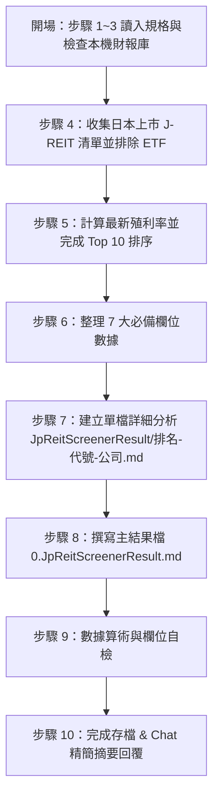

/goal
# 日本 REIT 殖利率前 10 名篩選與分析（JP REIT Screener · Gemini 版）
> **規格檔**：`Routines_JPReit_gemini.md`（每次執行前必讀）
> **主結果檔**：`JpReitScreenerResult/0.JpReitScreenerResult.md`
> **個股詳細檔**：`JpReitScreenerResult/<排名>-<代號>-<公司>.md`（每家 Top 10 REIT 獨立一檔）
---

## 1. 核心參數與不可違反原則 (Invariants)

### 1.1 執行參數表
| 參數 | 規範值 | 說明 |
| :--- | :--- | :--- |
| **語言** | 繁體中文 | 專有名詞首次出現附英文/日文原名，如：`分配金殖利率（Distribution Yield / 分配金利回り）` |
| **市場與標的** | 日本上市之 J-REITs | 僅限東京證券交易所（TSE）上市之不動產投資信託（J-REITs），**嚴禁納入 REIT ETF** 或普通地產開發商股票（如三井不動產、三菱地所等） |
| **榜單容量** | **Top 10** | 按最新殖利率（分配金利回り）由高至低嚴格排序，選出前 10 名；不足 10 名照實列出，嚴禁湊數 |
| **REIT 中文名稱** | **強制顯示中文** | 所有表格與標題中的 REIT 名稱必須以繁體中文呈現（如：日本大樓基金、日本都市網購、產業法商、日本物流投資等） |
| **幣別規範** | **日圓（JPY / 円）** | 財務數據與單位價格一律使用日圓（JPY / 円），標註格式如 `150,000 JPY` 或 `15 萬日圓` |
| **時間格式** | `YYYY-MM-DD_hh:mm:ss` | 結果檔與摘要時間戳記 |

> ⭐️ **核心目標**：產出 `JpReitScreenerResult/0.JpReitScreenerResult.md`（主結果檔）以及 `JpReitScreenerResult/<排名>-<代號>-<公司>.md`（Top 10 個股詳細分析檔），深入分析日本殖利率前 10 名的 J-REITs。

### 1.2 核心不可違反原則
1. **讀寫路徑規範**：
   - 主結果檔路徑：`d:\FinancialReport\JpReitScreenerResult\0.JpReitScreenerResult.md`
   - REIT 詳細檔路徑：`d:\FinancialReport\JpReitScreenerResult\<排名>-<代號>-<公司>.md`（排名補零，如 `01-8951-日本大樓基金.md` 或 `02-3269-日本都市網購.md`）。
   - 所有讀寫操作一律限定於 `d:\FinancialReport\JpReitScreenerResult\` 目錄下。
2. **REIT ETF 嚴格排除**：本任務只分析單一 J-REIT 實體，絕對不可包含任何 REIT ETF（如 TSE 1343、1555 等 ETF 產品）或地產開發股。
3. **殖利率由高到低排序**：主表格與詳細檔排序必須嚴格依據最新殖利率（Distribution Yield / 分配金利回り）從高至低排列。
4. **REIT 中文名稱強制顯示**：所有表格、標題與索引中的 REIT 名稱必須以繁體中文呈現（如：日本大樓基金、日本都市網購、產業法商、日本物流投資法人等）。
5. **幣別規範**：一律以日圓（JPY）計價與呈現，標註格式如 `JPY` 或 `日圓`。
6. **主表格必備 7 大欄位**（🔴 硬性規定）：
   - 股價（Share Price / 投資口價格）
   - 殖利率（Distribution Yield / 分配金利回り）
   - 租金報酬率（Rental Yield / NOI Cap Rate）
   - 負債比率（Debt Ratio / LTV）
   - 股價淨值比（P/B Ratio / Price-to-NAV / NAV倍率）
   - 物件區域（Property Region / Location）
   - 投資標的（Investment Target / Asset Type）
   - 投資物件數目（Number of Investment Properties / 物件數）
7. **一體化撰寫（Atomic REIT Entry）**：進入 Top 10 的 REIT，必須立即建立/更新對應的 `JpReitScreenerResult\<排名>-<代號>-<公司>.md` 檔案，包含完整的基本面分析、租務結構、物業分佈與風險利多。
8. **落榜與非 Top 10 檔案清理**：未進入 Top 10 或落榜的 REIT，其對應之詳細分析檔案必須從 `JpReitScreenerResult\` 目錄中刪除。

---

## 2. 標準執行流程 (Execution Workflow)

分為四大階段、共 10 個標準步驟：



### 階段一：開場與資料庫掃描（步驟 1 ~ 3）
- **步驟 1 — 讀入規格**：讀取 `Routines_JPReit_gemini.md`。
- **步驟 2 — 讀取本機財報與資料庫**：
  - 檢查本機 GitHub 財報庫 `d:\FinancialReport\` 之相關 J-REIT 年報、決算簡信與輿情檔案。
  - 讀取主結果檔 `JpReitScreenerResult/0.JpReitScreenerResult.md`（若不存在則依 §5 骨架新建）。
- **步驟 3 — 標的清單盤點**：
  - 盤點東京證券交易所上市之所有 J-REITs 標的（如：8951 日本大樓基金、8952 日本都市網購、3269 興和不動產 REIT、8953 日本物流、3281 GLP J-REIT、3283 日本專業物流、8954 歐力士 J-REIT、8960 聯合都市投資法人等）。

---

### 階段二：過濾、排序與數據處理（步驟 4 ~ 6）
- **步驟 4 — 排除非 REIT 標的與 REIT ETF**：
  - 嚴格剔除所有 REIT ETF（如 TSE 1343、1555、2528 等 ETF 類產品）及一般地產開發商股票（如 8801 三井不動產、8802 三菱地所）。
- **步驟 5 — 殖利率計算與排序**：
  - 計算最新殖利率：$\text{殖利率} = \frac{\text{近一年每口預計/實際分配金 (Annual DPU)}}{\text{最新投資口收盤價}} \times 100\%$。
  - 排序：按殖利率**由高至低**排列，擷取前 10 名。
- **步骤 6 — 必備 7 大欄位數據收集與整理**：
  - 收集 Top 10 J-REIT 的 7 大必備欄位：股價、租金報酬率（NOI Yield）、負債比率（LTV）、股價淨值比（NAV 倍率）、物件區域（如東京都心、首都圈、地方都市）、投資標的（如物流、商辦、住宅、商業設施、飯店）、投資物件數目。

---

### 階段三：詳細分析與結果生成（步驟 7 ~ 8）
- **步驟 7 — 單檔 REIT 深度分析檔撰寫**：
  - 對 Top 10 中的每一檔 J-REIT，於 `JpReitScreenerResult\<排名>-<代號>-<公司>.md` 撰寫完整個股分析（依 §4 規格），必須涵蓋：
    - 基本面與一句話定位
    - 必備 7 大數據（股價、殖利率、租金報酬率、負債比率、P/B、物件區域、投資標的、物件數目）
    - 投資利多（成長動能）與投資風險（利空）
    - 物件組合分佈細節與區域占比
    - 管理公司評估、租務結構與加權平均租約期（WALE）
    - 財務數據每口化（DPU, NAV per unit）
    - 年報決算報告驗證與網路輿情整理
- **步驟 8 — 更新主結果檔**：
  - 更新 `JpReitScreenerResult/0.JpReitScreenerResult.md`，填入「三、日本 REIT 殖利率前 10 名總覽表」及「四、個股詳細索引」。

---

### 階段四：自檢與摘要輸出（步驟 9 ~ 10）
- **步驟 9 — 欄位與品質自檢**：
  - 驗證主表格 7 大必備欄位無缺漏（股價、租金報酬率、負債比率、股價淨值比、物件區域、投資標的、投資物件數目）。
  - 驗證名稱皆為中文。
  - 驗證數據皆按殖利率由高至低排列。
  - 清理非 Top 10 之殘留詳細檔案。
- **步驟 10 — 最終存檔與 Chat 摘要**：
  - 儲存所有檔案。
  - 於 Chat 對話框回覆精簡執行摘要（依 §6 格式）。

---

## 3. 篩選規則與指標定義 (Screening Rules & Metrics)

### 3.1 四大篩選與數據處理規則 (Screening Rules)

| # | 規則項目 | 詳細說明與標準 |
| :-: | :--- | :--- |
| **1** | **排除 REIT ETF** | 僅分析單一 J-REIT 實體，絕對不含任何 REIT ETF 產品（如 TSE 1343、1555 等） |
| **2** | **Top 10 殖利率排序** | 按最新分配金殖利率（Distribution Yield）從高至低排序，擷取前 10 名 |
| **3** | **主表格必填 7 大欄位** | 表格必須包含：股價、租金報酬率、負債比率、股價淨值比、物件區域、投資標的、投資物件數目（詳見 §3.2） |
| **4** | **REIT 名稱顯示中文** | REIT 名字必須統一顯示為繁體中文（如：日本大樓基金、日本都市網購、產業法商、日本物流投資等） |

---

### 3.2 必備指標定義與計算公式

| 指標名稱 | 英文 / 日文代碼 | 計算公式 / 取得方式 | 單位 / 標註 |
| :--- | :--- | :--- | :--- |
| **股價** | Unit Price / 投資口価格 | 最新交易日每投資口收盤價 | JPY (円) |
| **殖利率** | Distribution Yield / 分配金利回り | $\frac{\text{近一年每口分配金 (DPU)}}{\text{最新投資口股價}} \times 100\%$ | % |
| **租金報酬率** | NOI Yield / Gross Cap Rate | $\frac{\text{年淨營業收益 (NOI) 或年租金收入}}{\text{取得價格總額或物業估值}} \times 100\%$ | % |
| **負債比率** | Debt Ratio / LTV (Loan to Value) | $\frac{\text{有利子負債總額（或總負債）}}{\text{總資產}} \times 100\%$ | %（警示：$>50\%$ 槓桿偏高） |
| **股價淨值比** | P/B Ratio / Price-to-NAV / NAV倍率 | $\frac{\text{最新投資口股價}}{\text{每口淨資產值 (NAV per unit)}}$ | 倍 (x) |
| **物件區域** | Property Region / Location | 主要物業所在地理區域分佈 | 文字（如：東京都心 5 區、首都圈、關西圈、地方主要都市） |
| **投資標的** | Property Type / Asset Class | 物業主要用途與類別 | 文字（如：物流設施、商辦、住宅、商業設施、飯店、綜合型） |
| **投資物件數目** | Number of Properties / 物件数 | 持有之不動產物業項目總數 | 個（如：115 個物業） |

---

## 4. 個股（REIT）詳細區塊撰寫規格 (REIT Detail Specification)

每一個進入 Top 10 的 J-REIT，其獨立檔案 `JpReitScreenerResult\<排名>-<代號>-<公司>.md` 必須包含以下標準結構：

```markdown
# 第 N 名：<代號> <REIT 中文名稱> (<英文/日文原名>)
> **最後更新日期**：YYYY-MM-DD
> **計價幣別**：JPY (日圓)

## 一、一句話定位與核心摘要
- **一句話定位**：<描述其物業類型、核心區域與市場地位，限 100~300 字>
- **核心優勢亮點**：<列出其主要資產品質、贊助商背景（如三井不動產、三菱地所、野村不動產等）與租金收益特色>

## 二、必備七大核心數據表
| 項目 | 數值 | 說明 / 來源 |
| :--- | :--- | :--- |
| **最新股價** | <金額 JPY> | 最新交易日收盤價 |
| **殖利率** | <XX.X%> | 近一年每口分配金 <DPU> ÷ 股價 |
| **租金報酬率** | <XX.X%> | NOI Yield / 年租金收入 ÷ 物業估值 |
| **負債比率 (LTV)** | <XX.X%> | 有利子負債 ÷ 總資產（門檻 <50%） |
| **股價淨值比 (P/B)** | <X.XX 倍> | 股價 ÷ 每口 NAV |
| **物件區域** | <區域分佈> | 東京都心 5 區 (XX%)、首都圈 (XX%)、地方都市 (XX%) |
| **投資標的** | <物業類型> | 物流設施 / 商辦 / 住宅 / 商業 / 飯店 / 綜合 |
| **投資物件數目** | <XX 個> | 總計物業數量 |

## 三、投資利多（成長動能）
1. <利多一：贊助商管線物業注入、租金調升、物業更新增效等，附財務影響>
2. <利多二：核心區域租務需求強勁與出租率維持高檔>
3. <利多三：再融資成本控制與長期固定利率債務比率>

## 四、投資風險（潛在隱憂）
1. <風險一：日本央行升息環境下利息支出上升風險>
2. <風險二：特定物業租戶退租或空置率上升風險>
3. <風險三：物業修繕費用（CapEx）增加對分配金 (DPU) 的稀釋>

## 五、物業組合與主要區域分析
| 物業名稱 | 所在城市/區域 | 物業類型 | 可出租面積 (NLA) | 租金/取得價格比重 |
| :--- | :--- | :--- | :--- | :--- |
| <物業 A> | <東京都心/千代田區...> | <商辦/物流/住宅> | <坪/平方米> | <XX.X%> |
| <物業 B> | <大阪/名古屋/福岡...>  | <商辦/物流/住宅> | <坪/平方米> | <XX.X%> |

## 六、管理公司評估與租務結構
- **贊助商與管理公司**：<資產管理公司名稱與贊助商背景（如 Mitsui, Mitsubishi, Nomura 等）>
- **出租率 / 空租率**：出租率 <XX.X%>（空租率 <XX.X%>）
- **加權平均租約期 (WALE)**：<X.X 年>
- **主要租戶**：前五大租戶名稱與租金收入占比

## 七、財報驗證與輿情整理
- **決算/財報來源**：<GitHub 本地數據庫 d:\FinancialReport\ / IR Bank / Ullet / JAPAN-REIT / 官方 IR>
- **每口財務數據**：最新每口分配金 DPU <金額 JPY>｜每口 NAV <金額 JPY>
- **社群與市場輿情**：<minkabu.jp / Yahoo Finance JP / 5ch / Seeking Alpha / PTT 論壇利多利空觀點>
```

---

## 5. 結果檔標準結構骨架 (Result Document Skeleton)

主結果檔 `JpReitScreenerResult/0.JpReitScreenerResult.md` **必須包含以下 7 個 `## ` 大標題**：

```markdown
# 日本 REIT 殖利率前 10 名篩選與分析結果（Gemini 版）
> 更新日期：YYYY-MM-DD hh:mm:ss
> 篩選條件：日本上市 J-REIT（排除 ETF）、殖利率排序 Top 10、全日圓（JPY）計價

## 一、執行摘要
- **篩選標的**：東京證券交易所上市 J-REITs（已排除 REIT ETF 與地產開發股）
- **Top 10 榜單狀況**：已完成 10 / 10 檔
- **幣別處理**：全數統一為日圓（JPY / 円）
- **詳細分析檔**：收錄於 `JpReitScreenerResult/<排名>-<代號>-<公司>.md`

## 二、修正紀錄 (Self-Fix Log) (只保留最新 5 筆)
| # | 標的 | 錯誤內容 | 修正後 | 依據來源 | 修正日期 |
| :-: | :-- | :-- | :-- | :-- | :-- |

## 三、日本 REIT 殖利率前 10 名總覽表
> 表格嚴格按殖利率由高至低排序。計價幣別為日圓（JPY）。

| 排名 | 代號 | REIT 中文名稱 | 股價 (JPY) | 殖利率 | 租金報酬率 | 負債比率 | 股價淨值比 | 物件區域 | 投資標的 | 投資物件數目 | 詳細分析連結 |
| :-: | :-- | :-- | :-: | :-: | :-: | :-: | :-: | :-- | :-- | :-: | :-- |
| 1 | 8951 | 日本大樓基金 | XXX,XXX | XX.X% | XX.X% | XX.X% | X.XX | 東京都心/首都圈 | 商辦 | XX 個 | [01-8951-日本大樓基金.md](file:///d:/FinancialReport/JpReitScreenerResult/01-8951-日本大樓基金.md) |
| 2 | 3269 | 日本都市網購 | XXX,XXX | XX.X% | XX.X% | XX.X% | X.XX | 首都圈/地方都市 | 商業/物流 | XX 個 | [02-3269-日本都市網購.md](file:///d:/FinancialReport/JpReitScreenerResult/02-3269-日本都市網購.md) |
| ... | ... | ... | ... | ... | ... | ... | ... | ... | ... | ... | ... |

## 四、Top 10 REIT 個股詳細索引
| 排名 | 代號與中文名稱 | 殖利率 | 一句話定位 | 核心優勢亮點 | 最後更新 |
| :-: | :-- | :-: | :-- | :-- | :-: |

## 五、不符條件 / 落榜 REIT 清單
| 代號 | REIT 中文名稱 | 不符原因 / 落榜說明 |
| :-- | :-- | :-- |
| <代號> | <名稱> | REIT ETF 產品 / 殖利率未進前 10 |

## 六、⚠️ 待查與資料缺口
| 代號 | REIT 中文名稱 | 待查項目 | 已試過的來源 | 說明 |
| :-- | :-- | :-- | :-- | :-- |

## 七、下一輪待辦
- **待更新之數據與物業組合**：...
- **下一輪覆核重點**：...
```

---

## 6. 對話框回覆格式規範 (Chat Response Format)

每一輪執行完畢後，在 Chat 對話框中**僅能回傳以下精簡摘要**，嚴禁貼出完整 Markdown 內容或大表格：

```text
✅ JP REIT Screener(gemini) — YYYY-MM-DD_hh:mm:ss
- 完成任務：日本 REIT 殖利率前 10 名篩選與分析
- 門檻檢核：排除 REIT ETF ✅｜日圓 (JPY) 計價 ✅
- 主結果檔：JpReitScreenerResult/0.JpReitScreenerResult.md（已更新）
- 詳細檔案：Top 10 專屬 md 檔案全數建立完成（10 / 10 檔）
- 表格必備欄位：股價、殖利率、租金報酬率、負債比率、P/B、物件區域、投資標的、投資物件數目全數齊全 ✅
```
