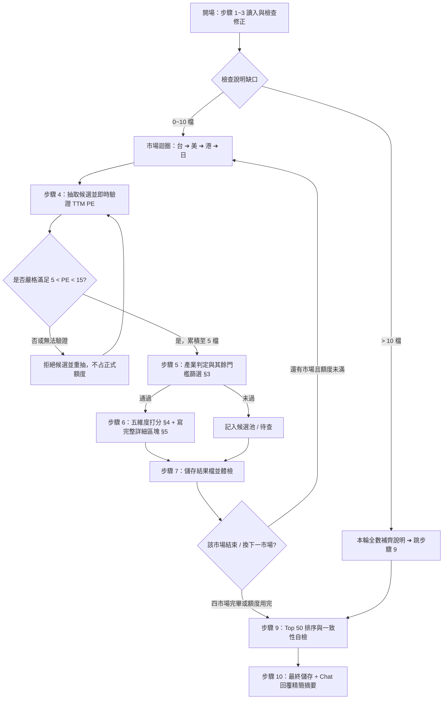

/goal
# 全市場選股篩選（Stock Screener · Gemini 版）
> **規格檔**：`Routines_StkScreener_gemini.md`（每次執行前必讀）
> **輸出檔**：`Routines_StkScreenerResult_gemini.md`（讀寫同一檔）
---

## 1. 核心參數與不可違反原則 (Invariants)
### 1.1 執行參數表
| 參數 | 規範值 | 說明 |
| :--- | :--- | :--- |
| **語言** | 繁體中文 | 專有名詞首次出現附英文，如：`營業利益率（Operating Margin）` |
| **每輪總額度** | **20 檔** | 補說明 + 初篩 + 深度分析合計上限（= 4 個交易所 × 5 檔） |
| **市場抽樣** | **各交易所 5 檔合格樣本** | 台股 5 檔 → 美股 5 檔 → 港股 5 檔 → 日股 5 檔（順序固定，合計 20 檔）；每檔在列入抽樣名單前必須先確認 **$5.0 < \text{TTM PE} < 15.0$** |
| **榜單容量** | **Top 50** | 依總分排序，不足 50 照實列，嚴禁湊數 |
| **精度規範** | 子項 2 位 → 維度 1 位 → 加總 | 各子項算至小數第 2 位；各維度四捨五入至第 1 位；總分由 5 維度直接相加 |
| **市場順序** | 台股 → 美股 → 港股 → 日股 | 循序執行，一個市場完整完成才換下一個 |
| **時間格式** | `YYYY-MM-DD_hh:mm:ss` | 結果檔與摘要時間戳記 |

> ⭐️ **核心目標**：最關鍵產出為結果檔「四、個股詳細」中每一檔的完整分析區塊（入榜理由 + 優點 + 缺點與風險）。排名總覽表為附產物。

### 1.2 核心不可違反原則
1. **讀寫路徑唯一**：所有讀寫操作一律限定於 `d:\FinancialReport\`，不得讀寫外部或臨時目錄。
2. **覆蓋防護機制**：讀取結果檔若遇失敗，嚴禁用空骨架覆蓋！必須先確認檔案狀態。
3. **即時查錯重算**：讀取結果檔時，若發現數字、分類或算術不符公式，必須立即在檔案中更正並記錄於「二、修正紀錄」（只保留最新 5 筆）。
4. **一體化撰寫（Atomic Stock Entry）**：通過門檻的股票，**必須立即完成「評分」與「個股詳細區塊（①~⑦）」**，嚴禁先批量評分事後再補。
5. **資料誠實原則**：查不到數據一律標記 `資料缺漏` 並計 0 分，嚴禁捏造或臆測。
6. **結構嚴格鎖定**：結果檔必須嚴格維持 **7 個 `## ` 大標題**，不可增減、重複或錯位。
7. **市場抽樣 PE 強制合格**：所有被計入「市場抽樣」的股票，TTM PE 必須嚴格滿足 **$5.0 < \text{TTM PE} < 15.0$**。PE 等於 5.0 或 15.0、PE 無法驗證、EPS 小於等於 0、資料過期或來源互相衝突者，均不得列入該交易所的 5 檔樣本，必須立即重抽，直到該交易所湊足 5 檔合格樣本。
8. **重抽不占正式額度**：因 PE 不合格或無法驗證而被拒絕的候選標的，只計入「重抽紀錄」，不計入每交易所 5 檔與每輪 20 檔正式額度。不得以「嘗試次數已滿」為理由接納不合格標的。若可用資料來源皆失敗，必須中止該市場並標記資料缺口，不得放寬 PE 邊界。
9. **市佔敘述必須具名**（🔴 最常被違反）：凡描述公司地位者，一律禁止只寫「龍頭企業」「行業領先」「市場地位卓越」「市佔率居區域前列」等空泛說法。**必須指名「哪一項產品／服務」在「哪一個市場範圍」排名第幾、市佔率多少、資料來源與日期，並列出主要競爭對手與其市佔率**（詳見 §5.1）。違反者視同 `資料缺漏`，市場地位維度計 0 分並記入「六、待查」。

---

## 2. 標準執行流程 (Execution Workflow)

分為三大階段、共 10 個標準步驟：



### 階段一：開場與健康檢查（步驟 1 ~ 3）
- **步驟 1 — 讀入狀態**：
  1. 讀取本規格檔。
  2. 讀取結果檔 `Routines_StkScreenerResult_gemini.md`（若不存在則以 §6 骨架新建）。
  3. 讀取「一、執行摘要」之 Checkpoint 與「七、下一輪待辦」清單。
- **步驟 2 — 檢查與自修 (Self-Fix)**：
  - 檢查總覽表「三」與詳細區塊「四」的數值是否 100% 一致。
  - 對「四」的所有區塊進行全鏈算術驗算：`⑥ 數據代入 §4 公式 → ⑦ 子項分 → 各維度分 → 總分`。
  - 若有錯誤，以公式計算結果為準直接修改檔案，並將修改記錄填入「二、修正紀錄」。
- **步驟 3 — 處理待補說明（優先於抽新股）**：
  - 計算缺口 =「三」排名筆數 −「四」個股詳細區塊數。
  - 若缺口 > 10 檔：本輪 20 檔額度**全部用於補齊說明**（至少補 10 檔），不抽新股，完成後直接跳至步驟 9。
  - 若缺口 1~10 檔：優先補完缺口，剩餘額度分配給新市場抽樣（各交易所抽樣上限仍為 5 檔，額度不足時依 台 → 美 → 港 → 日 順序遞減）。
  - 若缺口 = 0：全數額度用於新市場抽樣（台 5 ＋ 美 5 ＋ 港 5 ＋ 日 5）。
  - **既有榜單的市佔敘述稽核**：若「四、個股詳細」中任一檔的 ⑤ 市佔敘述僅有空泛說法（如「龍頭」「居區域前列」）而未指名產品／市場／名次／市佔率，視同說明缺口，須優先補齊，並記入「二、修正紀錄」。

---

### 階段二：市場迴圈（步驟 4 ~ 8）
固定市場順序：**台股 → 美股 → 港股 → 日股**。必須完整完成一個市場的「抽樣→篩選→評分→寫說明→存檔」後，才可切換至下一個市場。

- **步驟 4 — PE 合格抽樣（每個交易所最終 5 檔）**：
  1. 優先從「七、下一輪待辦」抽取該市場股票；不足者再從該市場隨機抽取候選。
  2. 避開三種標的：① 本輪已成為正式樣本 ② 已在「三、Top 50」③ 已在「五、候選池」。
  3. 每抽出一檔候選，必須立刻取得最新收盤價與近四季 EPS，計算 $\text{TTM PE}=\text{最新收盤價}\div\text{近四季 EPS}$，不得直接採用未標日期或口徑不明的網站 PE。
  4. 僅當資料在 5 個交易日內、EPS 大於 0，且 **$5.0 < \text{TTM PE} < 15.0$** 時，才加入該市場正式抽樣名單。
  5. 下列情況一律拒絕並立即重抽：$\text{PE} \le 5.0$、$\text{PE} \ge 15.0$、EPS 小於等於 0、PE 缺漏、資料過期、計算口徑不明、來源衝突尚未釐清。
  6. 重複「抽取 → 驗證 → 接受或拒絕」直到該交易所正式名單完整達到 5 檔；被拒絕者不得占用 5 檔名額或每輪 20 檔額度。
  7. 建立內部重抽紀錄：`市場｜候選代號｜TTM PE｜資料日期｜拒絕原因`。結果檔只需在「一、執行摘要」記錄各市場重抽次數，避免污染 Top 50 與候選池。
  8. 若所有可用來源均無法驗證足夠標的，停止該市場並在「六、待查」記錄來源與原因；**不可**改用 PE 邊界值、過期值或未驗證值湊足 5 檔。
- **步驟 5 — 產業判定與門檻初篩**：
  - 判定產業類別：`一般企業` / `銀行` / `金控` / `保險` / `REIT`。
  - 依 §3 進行六道門檻查驗：
    - **全數通過** ➔ 進入步驟 6。
    - **PE 門檻未通過或在步驟 5 重驗時失效** ➔ 從正式樣本移除並回到步驟 4 重抽，直到該交易所仍有 5 檔 PE 合格樣本。
    - **其他任一門檻未通過** ➔ 淘汰，不補抽遞補。
    - **市佔或財報數據不足** ➔ 記入「六、待查清單」。
- **步驟 6 — 即時評分與個股詳細撰寫（單檔閉環）**：
  - 對通過門檻的股票，**立即**執行以下兩項工作（嚴禁批量評分後延遲撰寫）：
    1. 依 §4 公式計算五維度分數與總分。
    2. 依 §5 模板完整撰寫個股詳細區塊（含 ①~⑦ 全部內容）。
  - 標準執行順序：`標的 A 評分 ➔ 標的 A 寫說明 ➔ 標的 B 評分 ➔ 標的 B 寫說明`。
- **步驟 7 — 單市場儲存與中途體檢**：
  - 將新增或更新之個股資料寫入結果檔。
  - 體檢要點：`## ` 大標題剛好 7 個、子項與總分算術無誤、三與四數據完全一致、排名無重複。
- **步驟 8 — 市場推進**：
  - 若 20 檔額度未用完且仍有市場未執行，前進至下一個市場（回到步驟 4）；若額度用完，前進至步驟 9。

---

### 階段三：收尾與自檢驗證（步驟 9 ~ 10）
- **步驟 9 — 排名整合與一致性自檢**：
  1. **去重**：同一公司若多地上市，僅保留主要上市地原股（排除重複項目）。
  2. **Top 50 重排序**：依總分由高至低重新排列「三、Top 50 排名總覽」，更新名次編號。同分排序規則見 §4.3。
  3. **指標檢驗**：計算完成度指標並填入「一、執行摘要」：
     - $A$ =「三」排名筆數
     - $B$ =「四」個股詳細區塊數
     - $C$ =「四」中 ①②③ 齊全之完整區塊數
     - $D$ =「四」中 ⑤ 市佔敘述符合 §5.1 具名要求（產品／市場範圍／名次／市佔率／競爭對手／來源日期六項齊全）之區塊數
     - **合格條件**：$B \ge A - 10$ 且 $C = B$ 且 $D = B$（若 $C < B$ 或 $D < B$ 必須當場補齊殘缺內容）。
  4. **PE 全樣本稽核**：逐檔檢查本輪四個交易所正式樣本（各 5 檔、合計 20 檔）；任何一檔不滿足 $5.0 < \text{TTM PE} < 15.0$，該市場 Checkpoint 不得標示完成，必須回到步驟 4 重抽並重驗。
  4-1. **市佔敘述稽核（禁用詞掃描）**：對「三」與「四」全文掃描下列禁用詞——`龍頭`、`領先`、`領頭`、`卓越`、`居前列`、`名列前茅`、`優秀標的`、`具備高度行業競爭優勢`。命中處若未同時附上「產品／服務名稱 + 市場範圍 + 名次 + 市佔率 + 來源日期」，一律當場改寫為具名敘述並記入「二、修正紀錄」；本輪改寫筆數需寫入「一、執行摘要」。
  5. **填寫「七、下一輪待辦」**（每輪必填，不得留空）：列出待補說明、下一輪預計抽樣股票、待驗證項目及未完成市場。
- **步驟 10 — 最終存檔與摘要回報**：
  - 將最終結果寫入 `Routines_StkScreenerResult_gemini.md`。
  - 再次讀取結果檔驗證無損（確認日期為當天、區塊數未減少、大標題 7 個）。
  - **對話框回覆規範**：僅輸出精簡摘要（格式見 §7），**嚴禁在 Chat 中輸出完整檔案內容或大表格**。

---

## 3. 硬性門檻與資料時效規範 (Gatekeeping & Data Quality)

### 3.1 六道硬性門檻（步驟 5 使用，必須全部通過才可評分）

| # | 門檻項目 | 判定標準與資料來源 | 未達標處理 |
| :-: | :--- | :--- | :--- |
| **1** | **市佔前 3 名（須具名）** | 滿足下列其一（須引述 Gartner、IDC、Statista、產業公會或年報之第三方數據，不採信公關行銷宣傳）：<br>• **A. 產業整體市佔前 3 名**<br>• **B. 核心主力產品／服務市佔前 3 名**<br>🔴 **判定時必須同時寫出**：①具體產品或服務名稱 ②市場範圍（全球／區域／單一國家）③名次 ④市佔率% ⑤第 1~3 名競爭對手及其市佔率 ⑥來源機構與報告日期。六項缺任一項即視為未通過。 | 查無資料或無法具名到「產品 + 市場範圍 + 名次」者，標記 `⚠️ 市佔資料不足` 並記入「六、待查」；未達標則剔除 |
| **2** | **PE 估值區間** | **$5.0 < \text{TTM PE} < 15.0$**（嚴格不含邊界；最新收盤價 ÷ 近四季 EPS；EPS $\le 0$ 視為不符） | PE $\le 5.0$、PE $\ge 15.0$ 或無法驗證者均剔除；若屬市場抽樣名單，必須重抽遞補 |
| **3** | **營業利益率** | **最近完整年度與 TTM 營業利益率皆 $> 10.0\%$**（兩者皆須達標） | 任一項 $\le 10\%$ 即剔除 |
| **4** | **財務安全指標** | 依產業別適用專屬指標（見 §3.2 表格） | 指標未達標即剔除 |
| **5** | **排除普通股 ADR** | 排除普通股 ADR（但原股合格、或 ADR 特別股如 `PBR.A` 視為合格） | 命中則剔除 |
| **6** | **排除美國 OTC** | 僅接受 NYSE、NASDAQ、NYSE American 上市標的；排除 Pink Sheet / OTC | 命中則剔除 |
> 註：ETF、封閉式基金（CEF）一律排除。
---

### 3.2 產業專屬財務安全門檻（取代門檻 4）

| 產業別 | 適用指標 | 通過門檻 | 說明與警示 |
| :--- | :--- | :--- | :--- |
| **一般企業** | 負債比率 (Debt Ratio) | **$< 70.0\%$** | 負債總額 ÷ 資產總額 |
| **銀行業** | 資本適足率 (CAR) + CET1 | **$\text{CAR} \ge 10.5\%$ 且 $\text{CET1} \ge 7.0\%$** | 嚴禁誤套一般負債比 |
| **金控業** | 集團法定資本適足率 | **$\ge 100.0\%$** | 嚴禁誤套銀行單體 CAR |
| **保險業** | 資本適足率 (RBC / SMR / SCR) | **台灣 $\text{RBC} \ge 200\%$ / 日本 $\text{SMR} \ge 200\%$ / 歐洲 $\text{SCR} \ge 150\%$** | 依註冊地監理標準判定 |
| **REIT** | 貸款價值比 (LTV) | **$< 50.0\%$** | 45%~50% 須加註 `⚠️ 槓桿偏高` |

---

### 3.3 資料時效與過期標記
- **股價 / PE**：必須為 $\le 5$ 個交易日內之最新數據，過期必須重新取得。
- **PE 計算口徑**：一律使用 TTM PE，公式為「最新收盤價 ÷ 近四季稀釋 EPS 合計」。若只能取得基本 EPS，必須明確標註並優先尋找稀釋 EPS 交叉驗證。
- **PE 邊界判定**：採未四捨五入原始值判定是否滿足 $5.0 < \text{TTM PE} < 15.0$；畫面顯示值可四捨五入至 2 位，但不得用四捨五入後數字改變合格結果。
- **PE 一致性驗證**：優先以公司財報或交易所 EPS 搭配最新收盤價自行計算；網站直接提供的 PE 僅作交叉檢查。若差異超過 5%，須釐清 EPS 口徑、股價日期或公司行動後才可納入抽樣。
- **季報數據**：距季末 $\le 6$ 個月（過期標記 `⚠️ 財報逾期`）。
- **年報數據**：距年度結束 $\le 15$ 個月（過期標記 `⚠️ 年報逾期`）。
- **監理指標**：距公告日 $\le 12$ 個月（過期標記 `⚠️ 監理指標偏舊`）。
- **市佔資料**：距報告日 $\le 24$ 個月（$> 36$ 個月視為資料缺漏）。

---

## 4. 五維度評分系統 (Scoring Engine) — 滿分 100

> 數學輔助定義：
> - $\text{clamp}(\text{min}, \text{max}, x) = \max(\text{min}, \min(\text{max}, x))$
> - 計算順序：**子項分數（保留 2 位小數） ➔ 各維度分數（四捨五入至第 1 位小數） ➔ 5 維度直接相加得出總分**。

### 4.1 五維度計算公式表

| 維度名稱 | 權重 | 子項拆解與計算公式 |
| :--- | :---: | :--- |
| **一、市場地位** | **25 分** | 1. **名次基準分**（3 選 1）：第 1 名 = **18 分**、第 2 名 = **14 分**、第 3 名 = **10 分**<br>2. **市佔率加成**：$\min(4.0, \text{市佔率\%} \times 0.1)$<br>3. **護城河加分**（0~3 分）：具備「高轉換成本、網路效應、規模經濟、特許獨佔」每項 1 分，上限 **3.0 分**<br>🔴 **計分前提**：名次與市佔率必須來自 §5 ⑤-1 已具名之「產品／服務 + 市場範圍 + 來源日期」；只有「龍頭」「領先」而無具名數據者，第 1、2 子項一律計 **0 分**。護城河每加 1 分，必須在 ⑤-3 附對應的量化證據，否則該項不得計分。 |
| **二、成長性** | **25 分** | 1. **5 年淨利潤 CAGR**：$\text{clamp}(0, 15.0, \text{5年CAGR\%} \times 0.75)$<br>2. **10 年淨利潤 CAGR**：$\text{clamp}(0, 10.0, \text{10年CAGR\%} \times 0.50)$<br>*（註：若無 10 年數據但有 $\ge 7$ 年數據可替代並標註；$< 7$ 年則此項計 0 分）* |
| **三、獲利品質** | **20 分** | 1. **自定義 OPM 分數**：$\max(0, 8.0 - |\text{OPM\%} - 100| \times 0.1)$，其中 $\text{OPM\%} = \frac{\text{營業利益率}}{\text{稅前淨利率}} \times 100\%$<br>2. **營業利益率分數**：$\min(6.0, \text{營業利益率\%} \times 0.20)$<br>3. **5 年 ROE 中位數分數**：$\text{clamp}(0, 6.0, \text{5年ROE\%} \times 0.30)$ |
| **四、估值** | **20 分** | 1. **PE 估值分數**：$12.0 \times \frac{15.0 - \text{PE}}{10.0}$（PE=5 得 12 分滿分；PE=15 得 0 分）<br>2. **5 年殖利率中位數分數**：$\min(8.0, \text{5年殖利率\%} \times 1.60)$（殖利率 $\ge 5\%$ 即拿 8 分滿分） |
| **五、財務安全** | **10 分** | **依產業五選一**：<br>• **一般企業**：$10.0 \times \frac{70.0 - \text{負債比\%}}{70.0}$<br>• **銀行業**：$\text{clamp}(0, 10.0, (\text{CAR\%} - 10.5) \times 2.0)$<br>• **金控業**：$\text{clamp}(0, 10.0, \frac{\text{集團適足率\%} - 100}{5.0})$<br>• **保險業**：$\text{clamp}(0, 10.0, \frac{\text{RBC\%} - 200}{15.0})$（日本SMR/歐洲SCR依同比例換算）<br>• **REIT**：$10.0 \times \frac{50.0 - \text{LTV\%}}{50.0}$ |

---

### 4.2 缺失值與特殊情況處理原則
1. **資料缺失**：任何子項若查無公開數據，該子項一律給 **0 分**，並標註 `資料缺漏：<項目>`。嚴禁主觀臆測。
2. **OPM 分母無效**：若稅前淨利率 $\le 0$，OPM 子項計 **0 分**，標註 `OPM 不適用`。
3. **數據來源與幣別**：所有引用數據均須標註來源與日期；提及財務絕對金額時，強制換算每股金額（依最新流通在外股數計算）。
4. **財務安全維度標註**：分數拆解中需寫明公式類型與代入數值，例如：`財務安全 6.2（REIT／LTV 19.0%）` 或 `財務安全 4.5（一般／負債比 38.2%）`。

### 4.3 同分排序優先順序 (Tie-Breaker)
當兩檔股票總分完全相同時，依下列順序判定名次先後：
1. **PE 較低者優先**
2. **5 年淨利潤 CAGR 較高者優先**
3. **財務安全維度得分較高者優先**
4. **股票代號升冪排序（字母/數字由小到大）**

---

## 5. 個股詳細區塊撰寫規格 (Stock Detail Specification)

所有進入「四、個股詳細」的股票，必須完整包含下列 **① 至 ⑦** 全部子區塊（其中 ⑤ 另含 ⑤-1、⑤-2、⑤-3 三張必填子表）：

```markdown
### 第 N 名：<代號> <公司名稱> — 總分 XX.X / 100（<市場>／<產業別>）
- **本區塊最後更新**：YYYY-MM-DD
- **一句話定位**：<必須點名「什麼產品／服務」在「什麼市場」排第幾，限 20~40 字。例：全球海上原油開採龍頭中的成本最低者，中國海域原油產量市佔第 1（約 57%）。嚴禁寫「港股優秀標的，具備高度行業競爭優勢」這類無資訊量句子>

**① 為什麼能進 Top 50**（必須列出 3 點，每點明確點名得分最高或最具優勢的維度與具體分數）
1. <點名維度 1 與分數，並具名產品與市場，如：市場地位拿 24.0/25 — 中國海域原油產量排名第 1、市佔 57.0%（CNOOC 2025 年報），第 2 名中石化僅 21%>
2. <點名維度 2 與分數，如：成長性拿 21.4/25，5 年淨利 CAGR 達 22.5%>
3. <點名維度 3 與分數，如：獲利品質拿 19.2/20，營益率 38.5% 且 OPM 95.8%>

**② 優點（買它的理由）**（3 至 5 點，每點必須包含「事實論述 + 具體數據 + 來源與日期」）
| # | 優點 | 具體數字 | 來源 / 日期 |
| :-: | :--- | :--- | :--- |
| 1 | <優點描述> | <數據> | <來源, YYYY-MM-DD> |
| 2 | <優點描述> | <數據> | <來源, YYYY-MM-DD> |
| 3 | <優點描述> | <數據> | <來源, YYYY-MM-DD> |

**③ 缺點與風險（不買它的理由）**（3 至 5 點，每點必須具體，嚴禁「無明顯風險」等空泛描述）
| # | 缺點 / 風險 | 具體數字或事件 | 來源 / 日期 |
| :-: | :--- | :--- | :--- |
| 1 | <風險描述> | <數據或具體事件> | <來源, YYYY-MM-DD> |
| 2 | <風險描述> | <數據或具體事件> | <來源, YYYY-MM-DD> |
| 3 | <風險描述> | <數據或具體事件> | <來源, YYYY-MM-DD> |

**④ 什麼情況會被踢出榜單**（列出 2 至 3 條具體出榜量化觸發條件）
- <例：TTM PE 升破 15.0 倍（目前為 X.X 倍，尚有 XX% 緩衝空間）>
- <例：營業利益率跌破 10.0%（目前為 XX.X%）>

**⑤ 硬性門檻查驗**：PE X.XX ✅｜營業利益率 XX.X% ✅｜<安全指標名稱> XX.X% ✅｜非普通股 ADR ✅｜非 OTC ✅

**⑤-1 市佔定位（🔴 必填，禁止空泛描述）**：以下表格六個欄位全部必填，缺一即視為 `資料缺漏`
| 主力產品 / 服務 | 市場範圍 | 排名 | 市佔率 | 統計口徑 | 來源 / 日期 |
| :--- | :--- | :-: | :-: | :--- | :--- |
| <具體產品或服務名稱，非「本業」「主要業務」> | <全球 / 亞太 / 中國 / 台灣 / 日本…> | 第 X 名 | XX.X% | <營收 / 出貨量 / 產能 / 保費 / 資產> | <機構, YYYY-MM-DD> |
| <第二項主力產品（如有，可多列）> | … | 第 X 名 | XX.X% | … | … |

**⑤-2 競爭格局（🔴 必填）**：列出同一市場範圍下前 3 名及本公司位置，並說明差距
| 排名 | 公司 | 市佔率 | 與本公司差距 |
| :-: | :--- | :-: | :--- |
| 1 | <公司名> | XX.X% | <領先/落後 X.X 個百分點> |
| 2 | <公司名> | XX.X% | … |
| 3 | <公司名> | XX.X% | … |

**⑤-3 為什麼它能排在這個名次（競爭優勢來源，2~4 點）**：每點必須是「可驗證的機制 + 量化證據」，不可只寫「品牌強」「技術好」
- <例：成本優勢 — 桶油完全成本 28.5 美元，低於 Shell 的 34.2 美元與 PetroChina 的 41.0 美元（各公司 2025 年報，2026-03-26）>
- <例：規模經濟 — 產能 320 萬噸為第 2 名的 1.8 倍，單位折舊較同業低 22%（公司 2025 年報）>
- <例：轉換成本 — 客戶導入認證期 18 個月，前十大客戶平均合作 12 年，留存率 97%（2025 法說會）>
- <例：特許 / 獨佔 — 持有 XX 海域專屬開採權至 2045 年（政府公告，2024-06-01）>

**⑥ 財務數據**：最新 EPS <金額/每股>｜預估 EPS <金額/每股>｜5 年 ROE 中位數 XX.X%｜5 年殖利率中位數 XX.X%｜OPM XX.X%｜5 年淨利 CAGR XX.X%｜10 年淨利 CAGR XX.X%（各項附來源與日期；REIT 另附股價淨值比、租金報酬率、空租率）

**⑦ 分數拆解**：市場地位 XX.X（名次分 XX + 市佔 XX + 護城河 XX）｜成長性 XX.X（5年 XX.XX + 10年 XX.XX）｜獲利品質 XX.X（OPM XX.XX + 營益率 XX.XX + ROE XX.XX）｜估值 XX.X（PE XX.XX + 殖利率 XX.XX）｜財務安全 XX.X（<產業別>／<指標值>）
- **總分驗算**：XX.X + XX.X + XX.X + XX.X + XX.X = **XX.X**
```

### 5.1 市佔敘述具名規範（🔴 全檔通用，違反即不合格）

**核心要求**：任何提及公司地位的句子，都必須回答「**哪個產品／服務**、在**哪個市場範圍**、排**第幾名**、市佔**多少%**、**贏過誰**、**憑什麼**」六個問題。只寫「龍頭企業」而不回答這六個問題者，一律視為未完成。

**禁用詞清單（單獨出現即不合格）**：
`龍頭`、`領先`、`領頭`、`卓越`、`居前列`、`名列前茅`、`優秀標的`、`行業代表`、`具備高度行業競爭優勢`、`市佔率居區域前列`、`市場獨佔或領頭地位`。
> 例外：上述用詞若**緊接**具體的「產品 + 市場範圍 + 名次 + 市佔率 + 來源」，可以保留作為修飾語。

**改寫對照範例**：
| ❌ 不合格寫法 | ✅ 合格寫法 |
| :--- | :--- |
| 「港股該行業龍頭代表標的，市場地位卓越。」 | 「中國海域原油產量排名第 1，市佔 57.0%（依 2025 年產量口徑，公司年報 2026-03-26）；第 2 名中石化 21.0%、第 3 名中石油 18.0%，領先幅度 36 個百分點。」 |
| 「市場獨佔或領頭地位 — 產品與服務市佔率居區域前列」 | 「亞洲—美西線貨櫃航運運力排名第 2，市佔 8.4%（Alphaliner，2026-07-01）；第 1 名馬士基 14.2%、第 3 名達飛 7.9%。」 |
| 「技術實力領先同業」 | 「28nm 以下車用 MCU 全球出貨量第 3、市佔 11.5%（IC Insights，2026-05）；憑 AEC-Q100 認證與車廠 5 年設計導入週期形成轉換成本。」 |
| 「品牌力強大」 | 「中國運動鞋服零售額排名第 2、市佔 23.0%（歐睿 Euromonitor，2025-12）；僅次於 Nike 的 25.1%，領先第 3 名 adidas 的 9.8%。」 |

**多角化公司的處理**：若公司無單一主導產品，須就**營收占比最高的前 2 項業務**分別列出名次與市佔率（⑤-1 表格多列一行），並在 ⑤-3 說明哪一項業務才是評分所依據的市佔來源。

**查無第三方市佔資料時**：不得改寫成模糊描述充數，必須在 ⑤-1 標記 `⚠️ 市佔資料不足`、市場地位維度之「名次基準分」與「市佔率加成」計 0 分，並將該檔記入「六、待查」。

### 5.2 品質檢驗標準
| 欄位 | ✅ 合格範例 | ❌ 不合格範例 |
| :--- | :--- | :--- |
| **一句話定位** | 「中國海域原油產量市佔第 1（57%），桶油成本全球最低者之一」 | 「港股優秀標的，具備高度行業競爭優勢與財務防禦性」 |
| **① 入榜理由** | 「市場地位拿 24.0/25，全球伺服器電源市佔第 1、達 60%」 | 「公司基本面相當優秀」／「該行業龍頭代表標的」 |
| **② 優點** | 「桶油成本 28.5 美元（2025 年報，2026-03-26）」 | 「成本控制良好」 |
| **③ 缺點與風險** | 「財務安全維度得分僅 4.5/10，負債比達 62.8%」 | 「有一定財務風險」 |
| **④ 出榜條件** | 「PE 升破 15.0，股價需再上漲 81%」 | 「未來若營運轉差則調整」 |
| **⑤-1 市佔定位** | 「車用 MCU｜全球｜第 3｜11.5%｜出貨量｜IC Insights, 2026-05」 | 「產品與服務市佔率居區域前列」 |
| **⑤-2 競爭格局** | 「1 Nike 25.1%／2 本公司 23.0%／3 adidas 9.8%」 | 「主要競爭對手為國內外同業」 |
| **⑤-3 優勢來源** | 「產能為第 2 名的 1.8 倍，單位折舊低 22%」 | 「規模經濟與品牌優勢明顯」 |

---

## 6. 結果檔標準結構骨架 (Result Document Skeleton)

結果檔 `Routines_StkScreenerResult_gemini.md` **必須且只能包含以下 7 個 `## ` 大標題**：

```markdown
# 全市場選股篩選結果（Gemini）
> 更新日期：YYYY-MM-DD hh:mm:ss
> 篩選條件：市佔前3 ∪ 產品市佔前3、嚴格 5<PE<15（不含邊界）、營業利益率>10%、財務安全（一般 負債比<70%／銀行 CAR≥10.5%／金控 集團資本適足率≥100%／保險 RBC≥200%／REIT LTV<50%）、排除普通股 ADR 與 OTC（ADR 特別股不排除）

## 一、執行摘要
- **本次抽樣**：台 5／美 5／港 5／日 5（合計 X / 20 檔；每個交易所各 5 檔，僅計入已驗證 $5<\text{TTM PE}<15$ 的正式樣本）
- **PE 重抽紀錄**：台 X 次／美 X 次／港 X 次／日 X 次；最終正式樣本 PE 稽核：`✅ 全數嚴格介於 5 與 15 之間`
- **Checkpoint 完成度**：`✅台股 ✅美股 ⬜港股 ⬜日股`
- **本次額度使用**：補說明 Z 檔｜初篩 X 檔｜門檻通過 Y 檔｜深度分析 Y 檔（合計 ≤ 20）
- **結果**：新入榜 X 檔｜落榜 X 檔｜修正 X 處
- **榜單**：X / 50 檔（未滿 50 註明「尚在建置中」）
- **說明完成度**：A=XX　B=XX　C=XX　D=XX（D = ⑤ 市佔具名合格數，須 = B）
- **市佔敘述改寫**：本輪改寫 X 處空泛描述（禁用詞掃描結果：`✅ 0 處殘留` / `⚠️ 尚餘 X 處`）
- **候選池**：X 檔

## 二、修正紀錄 (Self-Fix Log) (只保留最新 5 筆)
| # | 標的 | 錯誤內容 | 修正後 | 依據來源 | 修正日期 |
| :-: | :-- | :-- | :-- | :-- | :-- |

## 三、Top 50 排名總覽
> 「市佔定位」欄位格式固定為 `<產品/服務>｜<市場範圍>｜第 X 名｜XX.X%`，嚴禁填入「龍頭」「居前列」等空泛字樣。

| 排名 | 代號 | 公司 | 市佔定位（產品｜市場｜名次｜市佔率） | PE | 營益率 | 5年CAGR | ✅ 最大優點 | ⚠️ 最大缺點 | 產業別 | 獲利品質 | 估值 | 市場地位 | 成長性 | 安全指標值 | 市場 | 財務安全 | 總分 | 說明 |
| :-: | :-- | :-- | :-- | :-: | :-: | :-: | :-- | :-- | :-: | :-: | :-: | :-: | :-: | :-- | :-: | :-: | :-: | :-: |

## 四、個股詳細
（按排名順序完整收錄各檔個股詳細區塊，格式嚴格遵循 §5 規範）

## 五、通過門檻但未進 Top 50 的候選池
| 代號 | 公司 | 市場 | 總分 | 卡在哪個維度（帶具體分數） |
| :-- | :-- | :-: | :-: | :-- |

## 六、⚠️ 待查 / 資料不足清單
| 代號 | 公司 | 市場 | 卡關項目 | 已試過的來源 | 推測原因 |
| :-- | :-- | :-: | :-- | :-- | :-- |

## 七、下一輪待辦（🔴 每輪必填）
- **待補個股說明**（最優先）：（代號 + 名次）
- **下一輪要分析的股票**（每個交易所各列 5 檔，僅為候選名單，執行時仍須通過即時 $5<\text{TTM PE}<15$ 驗證，不合格就重抽）：
  - 台股：…（5 檔）
  - 美股：…（5 檔）
  - 港股：…（5 檔）
  - 日股：…（5 檔）
- **待改寫之空泛市佔敘述**：（代號 + 名次 + 目前寫法）
- **下一輪要做的工作**：（如：補齊 10 年 CAGR、重驗某檔門檻等）
- **未跑完的市場**：…

```

---

## 7. 對話框回覆格式規範 (Chat Response Format)

每一輪執行完畢後，在 Chat 對話框中**僅能回傳以下精簡摘要**，嚴禁貼出完整 Markdown 內容或大表格：

```text
✅ StkScreener(gemini) — YYYY-MM-DD_hh:mm:ss
- 完成市場：台/美/港/日（Checkpoint ✅✅✅✅）
- 額度使用：補說明 X 檔 + 新分析 Y 檔（合計 Z / 20）
- PE 抽樣稽核：正式樣本 20 / 20 檔（各交易所 5 檔）皆符合 5 < TTM PE < 15 ✅｜重抽 X 次
- 結果：新入榜 X 檔｜落榜 X 檔｜修正 X 處（其中算術重算 X 處）
- 榜單：X / 50 檔（尚在建置中）
- 說明完成度：A=XX　B=XX　C=XX　D=XX
- 市佔具名稽核：禁用詞殘留 0 處 ✅｜本輪改寫 X 處
- 算術重驗：已重算 X 檔，加總全部對上 ✅
- 下一輪待辦：…
```
