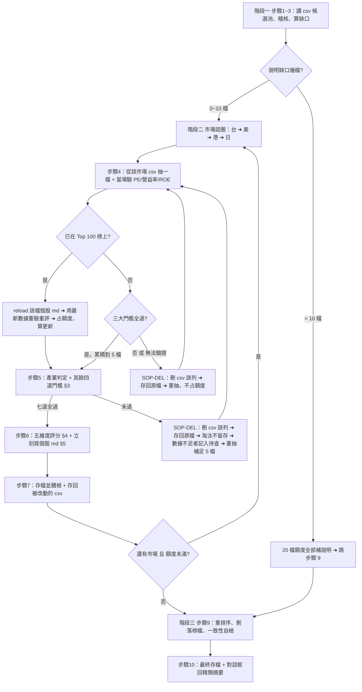

/goal
# 全市場選股篩選（Stock Screener · Gemini 版）

> **本檔為執行規格書，每次執行前必須完整讀完再動作。**
>
> | 項目 | 路徑 |
> | :--- | :--- |
> | 規格檔（本檔） | `Routines_StkScreener_gemini.md` |
> | 主結果檔 | `StkScreenerResult\0.StkScreenerResult_gemini.md` |
> | 個股詳細檔 | `StkScreenerResult\<排名>-<代號>-<公司>.md` |
> | **抽樣母體（唯一來源）** | `StkScreenerResult\*.csv`（該目錄底下所有 csv 股票列表，見 §1.4） |
>
> **檔名規則（唯一標準，不得自創其他格式）**：排名補零至 2 位，第 100 名用 3 位。
> 範例：`01-0883-中國海洋石油.md`、`57-MET-MetLife.md`、`100-OXY-Occidental Petroleum.md`。
> ❌ 不可寫成 `TOP01-...`、`1-...`、`0883-中國海洋石油.md`。

---

## 0. 快速執行卡（TL;DR）

每一輪固定做這 10 件事，順序不可跳：

```
1. 讀本規格檔
2. 讀主結果檔 0.StkScreenerResult_gemini.md
3. 讀 StkScreenerResult\ 底下所有 .csv → 唯一抽樣母體（§1.4）
4. 稽核本輪指定的 20 檔（5 輪循環，詳見步驟 2）
5. 算「說明缺口」→ 依步驟 3 分配額度（缺口 >10 全補 / 1~10 先補再抽 / 0 全抽新股）
6. 從 csv 抽樣（台→美→港→日）→ 當場驗 §3.1 七道門檻 → **任一道未過就立刻跑 SOP-DEL：刪該列 → 存回原 csv → 再重抽**（§1.4）；已在榜上則重跑（原則 13）
7. 七道全過 → 即時評分 + 即時寫個股 md（嚴禁批量後補）
8. 每做完一個市場就存檔一次（含被改動的 csv）
9. 重排 Top 100 → 重新命名檔案 → 刪除所有落榜檔（原則 10）→ 一致性自檢
10. 存檔 + 對話框只回傳 §7 精簡摘要
```

**本輪最重要的產出**：每一檔 Top 100 個股的 `StkScreenerResult\<排名>-<代號>-<公司>.md`，內含完整的 ①~⑦ 區塊（入榜理由 + 優點 + 缺點與風險 + 具名市佔）。主結果檔只是索引與總覽。

---

## 1. 執行參數與不可違反原則

### 1.1 執行參數表

| 參數 | 規範值 | 說明 |
| :--- | :--- | :--- |
| **語言** | 繁體中文 | 專有名詞首次出現附英文，如：`營業利益率（Operating Margin）` |
| **抽樣母體** | **只有 `StkScreenerResult\` 底下的所有 `.csv`** | 🔴 唯一來源。禁止自行想標的、禁止用網路排行榜或記憶中的名單補抽（見 §1.4） |
| **每輪總額度** | **20 檔** | 補說明 + 初篩 + 深度分析合計上限（= 4 個市場 × 5 檔） |
| **市場順序** | 台股 → 美股 → 港股 → 日股 | 循序執行，一個市場完整做完才換下一個 |
| **每市場配額** | **各 5 檔合格樣本** | 「合格」= 已驗證通過 §3.1 七道硬性門檻（其中 PE／營益率／ROE 三道於抽樣當下先驗，見 §1.3） |
| **榜單容量** | **Top 100** | 依總分由高到低排序；不足 100 檔就照實列，**嚴禁湊數** |
| **計算精度** | 子項 2 位 → 維度 1 位 → 相加 | 子項算到小數第 2 位；各維度四捨五入到第 1 位；總分 = 5 個維度分數直接相加 |
| **時間格式** | `YYYY-MM-DD_hh:mm:ss` | 結果檔與摘要的時間戳記 |

### 1.2 十三條不可違反原則

| # | 原則 | 內容 |
| :-: | :--- | :--- |
| 1 | **路徑鎖定** | 所有讀寫一律只在 `FinancialReport\StkScreenerResult\` 目錄底下，不得寫到其他地方 |
| 2 | **覆蓋防護** | 讀取結果檔若失敗，**嚴禁用空骨架覆蓋**，必須先確認檔案狀態 |
| 3 | **即時查錯重算** | 讀檔時發現數字、分類或算術跟公式對不上，當場在檔案內更正，並寫進「二、修正紀錄」（只留最新 5 筆） |
| 4 | **一體化撰寫** | 通過門檻進 Top 100 的股票，**當下就要建立/更新個股 md 並寫完 ①~⑦**，嚴禁先批量評分事後再補寫 |
| 5 | **資料誠實** | 查不到的數據一律標 `資料缺漏` 並計 0 分，**嚴禁捏造或臆測** |
| 6 | **結構鎖定** | 主結果檔必須**剛好 6 個 `## ` 大標題**，不可增減、重複或錯位。沒有候選池專章：通過門檻但沒進 Top 100 的直接淘汰不留存 |
| 7 | **三大門檻強制合格** | 任何列入「市場抽樣」的股票都必須嚴格滿足 §1.3 三大門檻。數據卡在邊界值、任一項無法驗證、EPS ≤ 0、資料過期、來源互相衝突 → 一律不得列入，必須立刻重抽 |
| 8 | **重抽不占額度** | 因 PE / 營益率 / ROE 不合格或無法驗證而被拒的標的，只記進「重抽紀錄」，**不占**每市場 5 檔與每輪 20 檔額度。**不得**以「試太多次了」為由放行不合格標的。若所有來源都失敗，中止該市場並標記資料缺口，**不得放寬門檻** |
| 9 | **市佔敘述必須具名**（🔴 最常違反） | 必須指名產品、市場範圍、名次、市佔率%、來源日期、競爭對手。違反 = `資料缺漏`，市場地位計 0 分（完整規範與禁用詞見 §5.1） |
| 10 | **落榜檔自動刪除**（🔴 硬性） | 個股若沒進 Top 100 或從 Top 100 掉出，必須**立即刪除**其 `<排名>-<代號>-<公司>.md`。`StkScreenerResult\` 底下**不得殘留**任何非 Top 100 的個股檔 |
| 11 | **抽樣母體鎖定 CSV**（🔴 硬性） | 候選標的**只能**來自 `StkScreenerResult\*.csv`。嚴禁自行發想、憑記憶或用外部排行榜補抽。csv 抽乾照步驟 4 第 9 點處理（§1.4） |
| 12 | **不合格即刪即存即重抽**（🔴 硬性） | **§3.1 七道門檻任一道未過（含查不到、無法驗證、剛好卡邊界）→ 當場執行 SOP-DEL：① 從它來源的那個 csv 刪掉該列 ② 立刻存回原檔 ③ 才可以再抽下一檔**。三個動作必須在同一檔標的上一次做完，**嚴禁**「先記著、等這個市場跑完再一起刪」。細則見 §1.4 SOP-DEL；刪除須記入「二、修正紀錄」與「一、執行摘要」 |
| 13 | **抽到榜上股票要重跑分析** | 已在 Top 100 的標的**不可跳過**：reload → 重驗門檻 → 重評分 → 重寫 ①~⑦。占額度，算「更新」（流程見步驟 4 第 8 點） |


### 1.3 三大門檻（抽樣當下先驗）

這三道只是**為了省時間而提前驗**的快篩，不是另一套標準；判定不合格的後果與 §3.1 其餘四道**完全相同**。

| 門檻 | 通過條件 | 對應 §3.1 |
| :--- | :--- | :-: |
| **PE** | `5.0 < TTM PE < 15.0`（不含邊界；EPS ≤ 0 視為不符） | 第 2 道 |
| **營業利益率** | 最近完整年度 **> 10.0%** 且 TTM **> 10.0%** | 第 3 道 |
| **ROE** | 5 年中位數 **> 10.0%** 且 最新／TTM **> 10.0%** | 第 4 道 |

> 任一項未達標、無法驗證、資料過期 → **立刻執行 §1.4 SOP-DEL（刪列 → 存回 → 重抽）**，不占額度（原則 7、8、12）。完整七道門檻見 §3.1。

### 1.4 抽樣母體：StkScreenerResult 底下的 CSV 股票列表（🔴 唯一來源）

**讀取範圍**：每輪開場時列出並讀完 `StkScreenerResult\` 底下**所有** `.csv`（不限檔名、不限數量），全部併起來當成本輪的候選池。除此之外**沒有任何其他抽樣來源**。

**市場歸屬判定**（依序判斷，第一個命中就採用）：

| 判定依據 | 規則 |
| :--- | :--- |
| 1. csv 內的市場／交易所欄位 | 有 `market` / `exchange` / `市場` / `交易所` 之類欄位就直接採用 |
| 2. 檔名 | 檔名含 `TW`/`台` → 台股；`US`/`美` → 美股；`HK`/`港` → 港股；`JP`/`日` → 日股 |
| 3. 股票代號格式 | 4 位純數字 → 台股（`2330`）｜4 位數字且檔案標日 → 日股（`9101`）｜5 位數字含前導 0 → 港股（`00700`）｜純英文字母 → 美股（`AAPL`） |

> 台股與日股同為 4 位數字時，以 csv 欄位或檔名為準；兩者都判不出來 → 該列標為 `市場不明`，本輪跳過不抽，並記入「五、待查」（**不刪 csv**，因為這是歸類問題不是門檻不合格）。

**欄位要求**：至少要能取得「股票代號」。公司名稱、市場欄位有就用，沒有就自己查補。csv 欄位名稱不統一屬正常，靠語意對應即可，**不要因為欄位名對不上就重寫使用者的 csv 結構**。

**🔴 SOP-DEL：不合格 → 刪列 → 存回 → 重抽（唯一處理程序，全檔共用）**

觸發條件：抽出的標的在 **§3.1 七道硬性門檻的任何一道**被擋下（含資料查不到、無法驗證、口徑不明、來源衝突、剛好等於邊界值）。
一旦觸發，**就地**依序做完 6 個動作，做完才准抽下一檔：

| 步驟 | 動作 | 硬性要求 |
| :-: | :--- | :--- |
| **D1** | 確認來源 | 認明這一檔是從**哪一個 csv** 抽出來的（抽樣當下就要記住，見步驟 4 第 1 點） |
| **D2** | 定位該列 | 用**股票代號完全比對**找到那一列。⚠️ 不可用公司名稱模糊比對、不可依猜測或順序刪除、**嚴禁整批清空** |
| **D3** | 刪整列 | 只刪這一列，其他列**一個字元都不准動**（含空白、引號、欄位順序） |
| **D4** | 存回原檔 | **寫回它原本那個 csv 的原路徑**。❌ 不可另存新檔、❌ 不可搬到別的 csv、❌ 不可合併成總表、❌ 不可新建 csv |
| **D5** | 驗證寫回 | 重讀該 csv 確認：表頭完好、總列數剛好少 1、被刪代號查無、其他列內容不變 |
| **D6** | 記錄 + 重抽 | 寫一筆 `<代號> 從 <csv 檔名> 移除 — 卡在第 X 道門檻` 進「二、修正紀錄」，然後**才回步驟 4 重抽**。被拒標的**不占**額度 |

**格式保存（🔴 最容易出錯，寫回前先確認）**：各 csv 格式不一致，必須**沿用該檔原本的樣子**，不得統一風格。

| csv | 表頭第一欄 | 引號 | 備註 |
| :--- | :--- | :--- | :--- |
| `TW.csv` | `代號` | **無引號**（裸欄位） | 欄位數最多，末欄「主要業務」為長文字 |
| `US.csv` | `代碼` | **無引號** | 代號為英文字母 |
| `hk.csv` | `"代碼"` | **每欄都加雙引號** | 代號為 5 位含前導 0，前導 0 不可被吃掉 |
| `jp.csv` | `"代碼"` | **每欄都加雙引號** | 數值含千分位逗號（如 `"1,861"`），必須靠引號保護 |

> 上表為目前實際狀況（供參）；每輪仍以實際列目錄與讀檔結果為準。若出現新 csv，一律「原樣讀入、原樣寫回」。
> 🔴 **禁止用會改寫格式的方式整檔重寫**（例如把裸欄位加上引號、把引號拿掉、改編碼、改換行、重排欄位、把 `"1,861"` 變成 `1861`）。最安全的做法是**以行為單位處理文字**：讀進所有行 → 移除代號相符的那一行 → 其餘行原樣寫回。

**失敗處理**：若 csv 唯讀或寫入失敗 → **不得**因此放行該標的，門檻判定照舊有效，仍要重抽；把「待刪列」記入「五、待查」與「六、下一輪待辦」的「待刪 csv 列」，下輪重試。

**唯一例外**：僅「市場歸屬判不出來」不算門檻不合格 → 該列**保留**在 csv，只記入「五、待查」。

**候選池耗盡**：某市場的 csv 標的全部抽完或全部被刪、湊不滿 5 檔 → **停掉該市場**，在「一、執行摘要」與「五、待查」寫明 `<市場> csv 候選池耗盡（剩餘 X 檔）`，並在「六、下一輪待辦」請使用者補充 csv。**不得**改用外部標的遞補。

---

## 2. 標準執行流程

分三大階段、共 10 個步驟。



### 階段一：開場與健康檢查（步驟 1~3）

**步驟 1 — 讀入狀態**
1. 讀本規格檔。
2. 讀主結果檔 `StkScreenerResult\0.StkScreenerResult_gemini.md`（不存在就用 §6 骨架新建）。
3. 讀「一、執行摘要」的 Checkpoint 與「六、下一輪待辦」。
4. **列出並讀取 `StkScreenerResult\` 底下所有 `.csv`**，依 §1.4 建立四個市場的候選池，並記下各市場剩餘檔數（要寫進「一、執行摘要」）。
   - 一個 `.csv` 都找不到 → **本輪不得抽任何新股**，只做稽核與補說明，並在「六、下一輪待辦」寫明「缺 csv 候選池，請補入 `StkScreenerResult\*.csv`」。

**步驟 2 — 自我修正 + Top 100 分批稽核（🔴 每輪必做 20 檔）**

不必每輪查全部 100 檔，改用 **5 輪循環分批稽核**：

| 輪次 | 稽核區間 |
| :-: | :--- |
| 第 1 輪 | TOP 1 ~ 20 |
| 第 2 輪 | TOP 21 ~ 40 |
| 第 3 輪 | TOP 41 ~ 60 |
| 第 4 輪 | TOP 61 ~ 80 |
| 第 5 輪 | TOP 81 ~ 100 → 下一輪回到第 1 輪 |

稽核兩件事：
1. 「三、Top 100 排名總覽」該區間 20 檔的數值，跟對應個股 md **是否 100% 一致**。
2. 對這 20 檔做全鏈算術重算：`⑥ 財務數據 → 代入 §4 公式 → ⑦ 子項分 → 維度分 → 總分`。

發現數值不符、分類錯誤或算術不合公式 → **以公式算出來的結果為準**直接改檔，並記入「二、修正紀錄」（只留最新 5 筆）。

**步驟 3 — 處理待補說明（優先於抽新股）**

```
說明缺口 = 「三、Top 100 排名總覽」的筆數 − StkScreenerResult\ 底下實際存在的個股 md 檔數
```

| 缺口 | 本輪 20 檔額度怎麼分配 |
| :--- | :--- |
| **> 10 檔** | 全部拿去補個股 md（至少補 10 檔），**不抽新股**，補完直接跳步驟 9 |
| **1 ~ 10 檔** | 先補滿缺口，剩餘額度才拿去抽新股（各市場上限仍為 5 檔，額度不夠時依 台→美→港→日 順序遞減） |
| **= 0** | 全部拿去抽新股（台 5 + 美 5 + 港 5 + 日 5） |

**另外要查**：個股 md 的 ⑤ 市佔敘述若只有空泛說法（「龍頭」「居區域前列」）而沒指名產品／市場／名次／市佔率 → **視同說明缺口**，須優先補齊並記入「二、修正紀錄」。

---

### 階段二：市場迴圈（步驟 4~8）

市場順序固定：**台股 → 美股 → 港股 → 日股**。必須完整跑完一個市場的「抽樣 → 篩選 → 評分 → 寫說明 → 存檔」，才可以換下一個市場。

**步驟 4 — 從 CSV 候選池抽樣（每市場最終湊滿 5 檔）**

1. **只從 §1.4 建立的該市場 csv 候選池隨機抽取**。禁止自行想標的、禁止用網路排行榜或記憶名單補抽（原則 11）。抽出時要記住它來自**哪一個 csv 檔**（後面刪列要寫回同一檔）。
2. **只避開一種標的**：本輪已經抽過（已成為正式樣本或已被刪除）的。
   🔴 **已在 Top 100 榜上的不再跳過**：改走第 8 點的「榜上股票重跑」流程。
3. 每抽一檔，**立刻**取得最新收盤價、EPS、營業利益率、ROE。自己算：`TTM PE = 最新收盤價 ÷ 近四季 EPS`。
4. 只有在「資料在 5 個交易日內 + EPS > 0 + §1.3 三大門檻全過」時，才收進正式抽樣名單，續走步驟 5 驗剩下四道門檻。
5. **一律拒絕、立刻跑 SOP-DEL（刪列 → 存回 → 重抽）**的情況：
   - §3.1 七道門檻任一項未達標（含剛好等於邊界值）
   - EPS ≤ 0
   - 關鍵數據缺漏 / 查不到
   - 資料過期
   - 計算口徑不明
   - 來源互相衝突且尚未釐清
6. **CSV 刪列動作（🔴 每拒絕一檔就做一次，嚴禁累積到最後一起刪）**：完整照 §1.4 **SOP-DEL** 的 D1~D6 做完（含 D5 重讀驗證）。
   ⏱ **時序硬性規定**：`判定不合格 → 刪列 → 存回原檔 → 驗證 → 才准抽下一檔`。**不准**在還沒存回 csv 之前就先抽下一檔，也不准把多檔的刪除動作合併成一次寫入。
7. 重複「抽取 → 驗證 → 收下 或 SOP-DEL 後重抽」，直到該市場正式名單湊滿 5 檔。被拒的**不占**名額。
8. **抽到已在 Top 100 榜上的股票（🔴 必做，不可跳過）**：
   1. **reload** 該檔既有的 `StkScreenerResult\<排名>-<代號>-<公司>.md`，讀完現有 ①~⑦。
   2. 用**最新**數據重驗 §3.1 七道門檻、重算 §4 五維度分數。
   3. 重寫 ①~⑦（含更新「本區塊最後更新」日期），並同步更新「三、Top 100 排名總覽」該列。
   4. 重驗**未過**門檻 → 該檔踢出 Top 100、刪掉它的個股 md（原則 10）、並對它跑 **SOP-DEL** 從來源 csv 刪列存回（第 6 點）。
   5. 這種檔**占**本輪額度（該市場 5 檔之一），統計上算「更新」不算「新入榜」。
9. 若該市場 csv 候選池抽乾仍湊不滿 5 檔 → **停掉該市場**，在「一、執行摘要」與「五、待查」記 `<市場> csv 候選池耗盡`。**不可**用邊界值、過期值、未驗證值或外部標的硬湊。
10. 記錄重抽軌跡：`市場｜來源 csv｜候選代號｜被哪道門檻擋下｜資料日期｜拒絕原因｜是否已從 csv 移除`。結果檔只需在「一、執行摘要」寫各市場重抽次數與 csv 移除筆數，不要污染 Top 100。

**步驟 5 — 產業判定與七道門檻**

1. 先判定產業類別：`一般企業` / `銀行` / `金控` / `保險` / `REIT`。
2. 依 §3.1 逐條查驗七道門檻：

| 結果 | 處理 |
| :--- | :--- |
| 七道全過 | 進入步驟 6 |
| 任一門檻未過（市佔／PE／營益率／ROE／財務安全／ADR／OTC 皆同） | 淘汰 → **立刻跑 §1.4 SOP-DEL：刪 csv 該列 → 存回原檔 → 驗證** → 回步驟 4 重抽補足 5 檔 |
| 數據不足（等同門檻 1 或 5 未過） | 視為未過：同上跑 SOP-DEL，並記入「五、待查清單」 |

**步驟 6 — 即時評分與個股詳細撰寫（單檔閉環）**

對七道門檻全過的股票，**立刻**做完這三件事再處理下一檔：
1. 依 §4 公式算五維度分數與總分。
2. 依 §5 模板寫完個股 md（①~⑦ 全部要有）。**榜上重跑**：整份改寫成最新內容（步驟 4 第 8 點），更新「本區塊最後更新」日期。
3. 到主結果檔「四、個股詳細」更新該檔的連結與摘要。

✅ 正確順序：`A 評分 → 寫 01-A.md → B 評分 → 寫 02-B.md`
❌ 錯誤順序：`A 評分 → B 評分 → C 評分 → …最後才一起補寫 md`

**步驟 7 — 單市場存檔與中途體檢**

寫入個股 md 與主結果檔後，體檢五點：
- 主結果檔 `## ` 大標題**剛好 6 個**
- 子項分與總分算術無誤
- 「三」與「四」的數據完全一致
- 排名沒有重複
- 本市場被拒標的**每一檔**都已跑完 SOP-DEL（D1~D6）：csv 已存回原檔、表頭與格式完好、被刪代號重讀查無、沒有「待刪但還沒刪」的殘留

**步驟 8 — 市場推進**

額度未用完且還有市場沒跑 → 回步驟 4 換下一個市場；額度用完 → 前進步驟 9。

---

### 階段三：收尾與自檢（步驟 9~10）

**步驟 9 — 排名整合、落榜檔清理、一致性自檢**

1. **去重**：同一家公司多地上市時，只保留主要上市地的原股。
2. **重排序與重新命名**：依總分由高到低重排「三、Top 100 排名總覽」，更新名次，並同步改 `StkScreenerResult\` 底下的檔名前綴（`01`~`100`）。
3. **落榜檔案強制刪除（🔴 關鍵）**：掃描 `StkScreenerResult\` 底下所有 `<排名>-<代號>-<公司>.md`，**凡不在最新 Top 100 榜上的一律立刻刪除**。
   ⚠️ **刪除對象只限個股 `.md`**。`0.StkScreenerResult_gemini.md` 與**所有 `.csv` 候選池檔案一律不得刪除**（csv 只能依原則 12 刪「列」，不能刪「檔」）。
4. **完成度指標**（算完填入「一、執行摘要」）：

   | 代號 | 定義 |
   | :-: | :--- |
   | **A** | 「三、Top 100 排名總覽」的排名筆數 |
   | **B** | `StkScreenerResult\` 底下 Top 100 個股 md 的檔案數 |
   | **C** | 個股 md 中 ①②③ 三區塊齊全的檔案數 |
   | **D** | 個股 md 中 ⑤ 市佔敘述符合 §5.1 六項具名要求的檔案數 |

   **合格條件**：`B ≥ A − 10` 且 `C = B` 且 `D = B`。若 `C < B` 或 `D < B`，**當場補齊**殘缺內容。

5. **三大門檻全樣本稽核**：逐檔複查本輪四市場的 20 檔正式樣本。只要有任一檔不滿足三大門檻，該市場 Checkpoint **不得標記完成**，必須對該檔跑 SOP-DEL 後回步驟 4 重抽重驗。
5-1. **CSV 刪列收尾稽核（🔴 硬性）**：比對「本輪被門檻擋下的標的清單」與「實際已從 csv 移除的代號」——
   - 兩者必須**完全一致**；有落差就當場補做 SOP-DEL。
   - 重讀四個 csv，確認：表頭仍在、格式（引號／分隔符／編碼／換行）與改動前一致、沒有任何正式樣本被誤刪。
   - 把「本輪 csv 移除筆數（分市場）＋各市場剩餘候選數」寫進「一、執行摘要」。
6. **市佔敘述稽核（禁用詞掃描）**：依 §5.1 禁用詞清單掃描「三」總覽與全部個股 md，命中處若缺具名數據，**當場改寫**並記入「二、修正紀錄」；改寫筆數寫進「一、執行摘要」。
7. **分批稽核標註**：確認本輪已完成指定區間（如 TOP 1~20）的稽核，並註明下一輪區間（如 TOP 21~40）。
8. **填「六、下一輪待辦」**（每輪必填，不得留空）：待補說明、下一輪稽核區間、待改寫的空泛市佔敘述、待驗證項目、未跑完的市場。

**步驟 10 — 最終存檔與回報**

1. 最終結果寫入 `StkScreenerResult\0.StkScreenerResult_gemini.md`。
2. 再讀一次驗證無損：日期是當天、區塊數沒變少、`## ` 大標題 6 個、Top 100 個股檔連結都有效。
3. **對話框只輸出 §7 的精簡摘要**，嚴禁貼出完整檔案內容或大表格。

---

## 3. 硬性門檻與資料時效

### 3.1 七道硬性門檻（步驟 5 使用，全部通過才可評分）

> 🔴 **本節的共同後果（原則 12）**：抽樣標的只要下表**任一道未通過**（含資料查不到、無法驗證、剛好卡邊界值），一律**當場執行 §1.4 SOP-DEL**：
> **① 從它來源的那個 csv 刪掉該列 → ② 立刻存回原 csv → ③ 重讀驗證 → ④ 才回步驟 4 重抽**。
> 目的是讓這檔日後**不再進候選池**，不必重複浪費額度查同一檔。
> ⚠️ 不分是哪一道門檻擋下的、不分是抽樣當下先驗的三大門檻（§1.3）還是步驟 5 才驗的其餘四道，處理方式**完全相同**。
> 例外：僅「市場歸屬判不出來」（§1.4）不算門檻不合格，該列**保留**在 csv，只記入「五、待查」。

| # | 門檻 | 判定標準 | 未達標處理 |
| :-: | :--- | :--- | :--- |
| **1** | **市佔前 3 名（須具名）** | 滿足下列**任一**即可（須引述 Gartner、IDC、Statista、Euronitor、產業公會或公司年報等第三方數據，**不採信公關行銷宣傳**）：<br>• **A.** 產業整體市佔前 3 名<br>• **B.** 核心主力產品／服務市佔前 3 名<br>🔴 判定時**必須同時寫出六項**：①具體產品或服務名稱 ②市場範圍（全球／區域／單一國家）③名次 ④市佔率 % ⑤第 1~3 名競爭對手及其市佔率 ⑥來源機構與報告日期。**缺任一項即視為未通過** | 查無資料或無法具名到「產品 + 市場範圍 + 名次」→ 標 `⚠️ 市佔資料不足` 並記入「五、待查」；未達標則剔除 |
| **2** | **PE 估值區間** | `5.0 < TTM PE < 15.0`（嚴格不含邊界；= 最新收盤價 ÷ 近四季 EPS；EPS ≤ 0 視為不符） | PE ≤ 5.0、PE ≥ 15.0 或無法驗證 → 剔除；若屬市場抽樣名單須重抽遞補 |
| **3** | **營業利益率** | 最近完整年度 **> 10.0%** 且 TTM **> 10.0%**（兩者皆須達標） | 任一項 ≤ 10.0% → 剔除 |
| **4** | **ROE** | 5 年 ROE 中位數 **> 10.0%** 且 最新／TTM ROE **> 10.0%** | 任一項 ≤ 10.0% → 剔除 |
| **5** | **財務安全指標** | 依產業別套用專屬指標（見 §3.2） | 指標未達標 → 剔除；指標查不到 → 標 `資料缺漏`、財務安全維度計 0 分，並記入「五、待查」 |
| **6** | **排除 ADR 普通股** | 標的不得為外國公司在美掛牌的 **ADR 普通股**（ADR **特別股不排除**，可保留） | 判定為 ADR 普通股 → 剔除 |
| **7** | **排除 OTC** | 必須在正規交易所掛牌（NYSE／NASDAQ／TWSE／TPEx／HKEX／TSE 等）；OTC、Pink Sheets、粉單、店頭轉讓 → 不合格 | 判定為 OTC → 剔除 |

> 上表**每一列的「剔除」都等同觸發 §1.4 SOP-DEL**（刪 csv 該列 → 存回原檔 → 驗證 → 重抽），不是只把它跳過而已。


### 3.2 財務安全指標（依產業五選一）

| 產業別 | 指標 | 通過門檻 |
| :--- | :--- | :--- |
| **一般企業** | 負債比率 = 總負債 ÷ 總資產 | **< 70.0%** |
| **銀行** | 資本適足率（CAR） | **≥ 10.5%** |
| **金控** | 集團資本適足率 | **≥ 100%** |
| **保險** | RBC（美國）／SMR（日本）／SCR（歐洲，依同比例換算） | **≥ 200%** |
| **REIT** | LTV（貸款價值比） | **< 50.0%** |

> 同一檔股票只套用一種指標，且必須與 §4.1「五、財務安全」用的公式一致。

### 3.3 資料時效規範

| 資料類型 | 可接受時效 | 逾期處理 |
| :--- | :--- | :--- |
| **股價 / PE** | ≤ 5 個交易日 | 逾期 → 重新取價，不得使用 |
| **財報數據**（EPS、營益率、ROE、負債比等） | 最新已公布的年報／季報；TTM 須含最近四季 | 只有更舊的資料 → 標註 `管理指標偏舊`，並在「五、待查」記錄 |
| **市佔資料** | ≤ 24 個月 | 24~36 個月 → 可用但須註明報告日期；**> 36 個月 → 視為 `資料缺漏`**，市場地位維度計 0 分 |

> 所有引用數據都必須標註**來源機構 + 日期**。REIT 另需附股價淨值比、租金報酬率、空租率。

---

## 4. 五維度評分系統 — 滿分 100

### 4.0 通用規則

```
clamp(min, max, x) = max(min, min(max, x))      // 把 x 夾在 min 與 max 之間

計算順序：子項分（保留小數 2 位）→ 各維度分（四捨五入到小數 1 位）→ 總分 = 5 個維度分數直接相加
```

| 維度 | 配分 |
| :--- | :-: |
| 一、市場地位 | 25 |
| 二、成長性 | 25 |
| 三、獲利品質 | 20 |
| 四、估值 | 20 |
| 五、財務安全 | 10 |
| **合計** | **100** |

### 4.1 一、市場地位（25 分）

```
子項 1  名次基準分（三選一）：  第 1 名 = 18.0 ｜ 第 2 名 = 14.0 ｜ 第 3 名 = 10.0
子項 2  市佔率加成：            min(4.0, 市佔率% × 0.1)
子項 3  護城河加分：            每具備一項 +1.0，上限 3.0
                                （高轉換成本 / 網路效應 / 規模經濟 / 特許獨佔）
維度分 = 子項1 + 子項2 + 子項3        （上限 25.0）
```

🔴 **計分前提**：
- 名次與市佔率必須來自 §5 的 ⑤-1 已具名資料（產品／服務 + 市場範圍 + 來源日期）。只寫「龍頭」「領先」而沒有具名數據 → **子項 1、2 一律計 0 分**。
- 護城河每加 1 分，必須在 ⑤-3 附上對應的**量化證據**，否則該項不得計分。

### 4.2 二、成長性（25 分）

```
子項 1  5 年淨利 CAGR：   clamp(0, 15.0, 5年CAGR% × 0.75)
子項 2  10 年淨利 CAGR：  clamp(0, 10.0, 10年CAGR% × 0.50)
維度分 = 子項1 + 子項2
```

> 註：若無 10 年數據，但有 **≥ 7 年**數據可替代（須標註）；**< 7 年**則子項 2 計 0 分。

### 4.3 三、獲利品質（20 分）

```
先算自定義 OPM：  OPM% = (營業利益率 ÷ 稅前淨利率) × 100%

子項 1  OPM 分數：        max(0, 8.0 − |OPM% − 100| × 0.1)
子項 2  營業利益率分數：  min(6.0, 營業利益率% × 0.20)
子項 3  5 年 ROE 中位數： clamp(0, 6.0, 5年ROE中位數% × 0.30)
維度分 = 子項1 + 子項2 + 子項3
```

> OPM 愈接近 100% 分數愈高（代表營業外損益干擾小、獲利品質純）。

### 4.4 四、估值（20 分）

```
子項 1  PE 分數：          12.0 × (15.0 − PE) ÷ 10.0     // PE=5 → 12 分滿分；PE=15 → 0 分
子項 2  5 年殖利率中位數： min(8.0, 5年殖利率中位數% × 1.60)   // 殖利率 ≥ 5% 即滿分 8 分
維度分 = 子項1 + 子項2
```

### 4.5 五、財務安全（10 分，依產業五選一）

```
一般企業：  10.0 × (70.0 − 負債比%) ÷ 70.0
銀行業：    clamp(0, 10.0, (CAR% − 10.5) × 2.0)
金控業：    clamp(0, 10.0, (集團適足率% − 100) ÷ 5.0)
保險業：    clamp(0, 10.0, (RBC% − 200) ÷ 15.0)      // 日本 SMR / 歐洲 SCR 依同比例換算
REIT：      10.0 × (50.0 − LTV%) ÷ 50.0
```

### 4.6 缺失值與特殊情況

| 情況 | 處理 |
| :--- | :--- |
| 子項查無公開數據 | 該子項計 **0 分**，標註 `資料缺漏：<項目>`。**嚴禁主觀臆測** |
| 稅前淨利率 ≤ 0（OPM 分母無效） | OPM 子項計 **0 分**，標註 `OPM 不適用` |
| 引用財務絕對金額 | 必須標來源與日期，並**強制換算每股金額**（依最新流通在外股數） |
| 財務安全維度標註 | 須寫明公式類型與代入值，例：`財務安全 6.2（REIT／LTV 19.0%）`、`財務安全 4.5（一般／負債比 38.2%）` |

### 4.7 同分排序（Tie-Breaker）

總分完全相同時，依序判定：
1. PE 較低者優先
2. 5 年淨利 CAGR 較高者優先
3. 財務安全維度得分較高者優先
4. 股票代號升冪排序

---

## 5. 個股詳細檔撰寫規格

檔案路徑：`StkScreenerResult\<排名>-<代號>-<公司>.md`
必須完整包含 **① 至 ⑦** 全部子區塊（其中 ⑤ 另含 ⑤-1、⑤-2、⑤-3 三張必填子表）。

```markdown
### 第 N 名：<代號> <公司名稱> — 總分 XX.X / 100（<市場>／<產業別>）
- **本區塊最後更新**：YYYY-MM-DD
- **一句話定位**：<必須點名「什麼產品／服務」在「什麼市場」排第幾，100~500 字。
  例：全球海上原油開採成本最低者之一，中國海域原油產量市佔第 1（約 57%）。
  ❌ 嚴禁寫「港股優秀標的，具備高度行業競爭優勢」這類零資訊量句子>

**① 為什麼能進 Top 100**（必列 3 點，每點點名維度 + 具體分數 + 具名產品市場）
1. <例：市場地位拿 24.0/25 — 中國海域原油產量第 1、市佔 57.0%（CNOOC 2025 年報），第 2 名中石化僅 21.0%>
2. <例：成長性拿 21.4/25，5 年淨利 CAGR 達 22.5%>
3. <例：獲利品質拿 19.2/20，營益率 38.5% 且 OPM 95.8%>

**② 優點（買它的理由）**（3~5 點，每點都要有「事實 + 具體數據 + 來源與日期」）
| # | 優點 | 具體數字 | 來源 / 日期 |
| :-: | :--- | :--- | :--- |
| 1 | <優點描述> | <數據> | <來源, YYYY-MM-DD> |
| 2 | <優點描述> | <數據> | <來源, YYYY-MM-DD> |
| 3 | <優點描述> | <數據> | <來源, YYYY-MM-DD> |

**③ 缺點與風險（不買它的理由）**（3~5 點，嚴禁「無明顯風險」這類空話）
| # | 缺點 / 風險 | 具體數字或事件 | 來源 / 日期 |
| :-: | :--- | :--- | :--- |
| 1 | <風險描述> | <數據或具體事件> | <來源, YYYY-MM-DD> |
| 2 | <風險描述> | <數據或具體事件> | <來源, YYYY-MM-DD> |
| 3 | <風險描述> | <數據或具體事件> | <來源, YYYY-MM-DD> |

**④ 什麼情況會被踢出榜單**（2~3 條量化觸發條件）
- <例：TTM PE 升破 15.0 倍（目前 X.X 倍，尚有 XX% 緩衝空間）>
- <例：營業利益率跌破 10.0%（目前 XX.X%）>

**⑤ 硬性門檻查驗**：PE X.XX ✅｜營業利益率 XX.X% ✅｜ROE XX.X% ✅｜<安全指標名稱> XX.X% ✅

**⑤-1 市佔定位（🔴 必填，六欄缺一即視為 `資料缺漏`）**
| 主力產品 / 服務 | 市場範圍 | 排名 | 市佔率 | 統計口徑 | 來源 / 日期 |
| :--- | :--- | :-: | :-: | :--- | :--- |
| <具體產品或服務名稱，不可寫「本業」「主要業務」> | <全球 / 亞太 / 中國 / 台灣 / 日本…> | 第 X 名 | XX.X% | <營收 / 出貨量 / 產能 / 保費 / 資產> | <機構, YYYY-MM-DD> |
| <第二項主力產品（如有，可多列）> | … | 第 X 名 | XX.X% | … | … |

**⑤-2 競爭格局（🔴 必填）**：同一市場範圍下的前 3 名與本公司位置
| 排名 | 公司 | 市佔率 | 與本公司差距 |
| :-: | :--- | :-: | :--- |
| 1 | <公司名> | XX.X% | <領先/落後 X.X 個百分點> |
| 2 | <公司名> | XX.X% | … |
| 3 | <公司名> | XX.X% | … |

**⑤-3 為什麼能排在這個名次**（2~4 點；每點 = 可驗證機制 + 量化證據，不可只寫「品牌強」「技術好」）
- <例：成本優勢 — 桶油完全成本 28.5 美元，低於 Shell 34.2 美元、PetroChina 41.0 美元（各公司 2025 年報，2026-03-26）>
- <例：規模經濟 — 產能 320 萬噸為第 2 名的 1.8 倍，單位折舊較同業低 22%（公司 2025 年報）>
- <例：轉換成本 — 客戶導入認證期 18 個月，前十大客戶平均合作 12 年，留存率 97%（2025 法說會）>
- <例：特許 / 獨佔 — 持有 XX 海域專屬開採權至 2045 年（政府公告，2024-06-01）>

**⑥ 財務數據**：最新 EPS <金額/每股>｜預估 EPS <金額/每股>｜5 年 ROE 中位數 XX.X%｜5 年殖利率中位數 XX.X%｜OPM XX.X%｜5 年淨利 CAGR XX.X%｜10 年淨利 CAGR XX.X%
（各項附來源與日期；REIT 另附股價淨值比、租金報酬率、空租率）

**⑦ 分數拆解**：市場地位 XX.X（名次 XX.XX + 市佔 XX.XX + 護城河 XX.XX）｜成長性 XX.X（5年 XX.XX + 10年 XX.XX）｜獲利品質 XX.X（OPM XX.XX + 營益率 XX.XX + ROE XX.XX）｜估值 XX.X（PE XX.XX + 殖利率 XX.XX）｜財務安全 XX.X（<產業別>／<指標值>）
- **總分驗算**：XX.X + XX.X + XX.X + XX.X + XX.X = **XX.X**
```

### 5.1 市佔敘述具名規範（🔴 全檔通用，違反即不合格）

**核心要求**：任何提到公司地位的句子，都要回答這六個問題——
**哪個產品／服務**、在**哪個市場範圍**、排**第幾名**、市佔**多少 %**、**贏過誰**、**憑什麼**。
只寫「龍頭企業」而不回答這六題 → 一律視為未完成。

**禁用詞清單（單獨出現即不合格）**：
`龍頭`、`領先`、`領頭`、`卓越`、`居前列`、`名列前茅`、`優秀標的`、`行業代表`、`具備高度行業競爭優勢`、`市佔率居區域前列`、`市場獨佔或領頭地位`。

> **例外**：上述用詞若**緊接**具體的「產品 + 市場範圍 + 名次 + 市佔率 + 來源」，可保留作為修飾語。

**改寫對照範例**：

| ❌ 不合格 | ✅ 合格 |
| :--- | :--- |
| 港股該行業龍頭代表標的，市場地位卓越。 | 中國海域原油產量排名第 1、市佔 57.0%（2025 年產量口徑，公司年報 2026-03-26）；第 2 名中石化 21.0%、第 3 名中石油 18.0%，領先 36 個百分點。 |
| 市場獨佔或領頭地位 — 產品與服務市佔率居區域前列 | 亞洲—美西線貨櫃航運運力排名第 2、市佔 8.4%（Alphaliner，2026-07-01）；第 1 名馬士基 14.2%、第 3 名達飛 7.9%。 |
| 技術實力領先同業 | 28nm 以下車用 MCU 全球出貨量第 3、市佔 11.5%（IC Insights，2026-05）；憑 AEC-Q100 認證與車廠 5 年設計導入週期形成轉換成本。 |
| 品牌力強大 | 中國運動鞋服零售額排名第 2、市佔 23.0%（Euromonitor，2025-12）；僅次於 Nike 的 25.1%，領先第 3 名 adidas 的 9.8%。 |

**多角化公司**：若無單一主導產品，須就**營收占比最高的前 2 項業務**分別列出名次與市佔率（⑤-1 多列一行），並在 ⑤-3 說明哪一項業務才是評分所依據的市佔來源。

**查無第三方市佔資料時**：不得改寫成模糊描述充數。必須在 ⑤-1 標記 `⚠️ 市佔資料不足`，市場地位維度的「名次基準分」與「市佔率加成」計 0 分，並將該檔記入「五、待查」。

### 5.2 品質檢驗對照表

| 欄位 | ✅ 合格 | ❌ 不合格 |
| :--- | :--- | :--- |
| **一句話定位** | 中國海域原油產量市佔第 1（57%），桶油成本全球最低者之一 | 港股優秀標的，具備高度行業競爭優勢與財務防禦性 |
| **① 入榜理由** | 市場地位拿 24.0/25，全球伺服器電源市佔第 1、達 60% | 公司基本面相當優秀／該行業龍頭代表標的 |
| **② 優點** | 桶油成本 28.5 美元（2025 年報，2026-03-26） | 成本控制良好 |
| **③ 缺點與風險** | 財務安全維度僅 4.5/10，負債比達 62.8% | 有一定財務風險 |
| **④ 出榜條件** | PE 升破 15.0，股價需再上漲 81% | 未來若營運轉差則調整 |
| **⑤-1 市佔定位** | 車用 MCU｜全球｜第 3｜11.5%｜出貨量｜IC Insights, 2026-05 | 產品與服務市佔率居區域前列 |
| **⑤-2 競爭格局** | 1 Nike 25.1%／2 本公司 23.0%／3 adidas 9.8% | 主要競爭對手為國內外同業 |
| **⑤-3 優勢來源** | 產能為第 2 名的 1.8 倍，單位折舊低 22% | 規模經濟與品牌優勢明顯 |

---

## 6. 主結果檔標準骨架

`StkScreenerResult\0.StkScreenerResult_gemini.md` **必須且只能包含以下 6 個 `## ` 大標題**（一、二、三、四、五、六），不可增減。

````markdown
# 全市場選股篩選結果（Gemini）
> 更新日期：YYYY-MM-DD hh:mm:ss

## 一、執行摘要
- **抽樣母體（csv）**：讀入 X 個 csv｜台 X 檔／美 X 檔／港 X 檔／日 X 檔｜市場不明 X 檔（唯一來源：`StkScreenerResult\*.csv`）
- **本次抽樣**：台 5／美 5／港 5／日 5（合計 X / 20 檔；僅計入已驗證通過七道硬性門檻的正式樣本）｜其中新入榜 X 檔、榜上重跑 X 檔
- **csv 淘汰刪列**：本輪從 csv 移除 X 檔（台 X／美 X／港 X／日 X）；剩餘候選池 台 X／美 X／港 X／日 X
- **初篩重抽紀錄**：台 X 次／美 X 次／港 X 次／日 X 次；
- **Checkpoint 完成度**：`✅台股 ✅美股 ⬜港股 ⬜日股`
- **本次額度使用**：補說明 Z 檔｜初篩 X 檔｜門檻通過 Y 檔｜深度分析 Y 檔（合計 ≤ 20）
- **結果**：新入榜 X 檔｜榜上重跑更新 X 檔｜落榜 X 檔｜修正 X 處
- **Top 100 門檻分數**：XX.X 分
- **榜單**：X / 100 檔（未滿 100 註明「尚在建置中」）
- **個股詳細檔**：每家公司獨立存為 `StkScreenerResult\<排名>-<代號>-<公司>.md`，非 Top 100 強制刪除
- **說明完成度**：A=XX　B=XX　C=XX　D=XX（D = ⑤ 市佔具名合格數，須 = B）
- **市佔敘述改寫**：本輪改寫 X 處（禁用詞掃描：`✅ 0 處殘留` / `⚠️ 尚餘 X 處`）
- **總覽分批稽核進度**：本輪完成 TOP XX~XX 數值與算術稽核（第 N / 5 輪）｜發現/修正 X 處

## 二、修正紀錄 (Self-Fix Log)（只保留最新 5 筆）
| # | 標的 | 錯誤內容 | 修正後 | 依據來源 | 修正日期 |
| :-: | :-- | :-- | :-- | :-- | :-- |

## 三、Top 100 排名總覽
> 「市佔定位」欄位格式固定為 `<產品/服務>｜<市場範圍>｜第 X 名｜XX.X%`，嚴禁填「龍頭」「居前列」等空泛字樣。

| 排名 | 代號 | 公司 | 市場 | 產業別 | 市佔定位（產品｜市場｜名次｜市佔率） | 市場地位 | 成長性 | 獲利品質 | 估值 | 財務安全 | 總分 | PE | 營益率 | 安全指標值 |
| :-: | :-- | :-- | :-: | :-: | :-- | :-: | :-: | :-: | :-: | :-: | :-: | :-: | :-: | :-- |

## 四、個股詳細
> 本區塊按排名順序收錄 Top 100 的個股分析檔連結與摘要。完整分析內容個別儲存於 `StkScreenerResult\<排名>-<代號>-<公司>.md`。
> 🔴 **連結寫法（兩條都要遵守）**：
> ① 用**同目錄相對路徑（只寫檔名）**。主結果檔本身就在 `StkScreenerResult\` 內，加 `StkScreenerResult/` 前綴會變成雙層目錄而失效；也不可用 `file:///d:/...` 絕對路徑。
> ② 目標一律用**角括號包起來** `](<檔名.md>)`。很多檔名含空格或括號（如 `15-TRV-The Travelers.md`、`05-01308-海豐國際 (SITC International).md`），不包角括號的 Markdown 連結會斷掉。

| 排名 | 代號公司 | 分析檔案連結 | 總分 | 一句話定位 | 最後更新 |
| :-: | :-- | :-- | :-: | :-- | :-: |
| 1 | 0883 中國海洋石油 | [01-0883-中國海洋石油.md](<01-0883-中國海洋石油.md>) | 87.7 | 中國海域原油產量市佔第 1（約 57.0%），桶油主要成本 28.41 美元… | 2026-08-10 |
| 15 | TRV The Travelers | [15-TRV-The Travelers.md](<15-TRV-The Travelers.md>) | 78.8 | 全美商業綜合保險簽單保費第 2 名（市佔 10.5%）… | 2026-08-10 |

## 五、⚠️ 待查 / 資料不足清單
| 代號 | 公司 | 市場 | 卡關項目 | 已試過的來源 | 推測原因 |
| :-- | :-- | :-: | :-- | :-- | :-- |

## 六、下一輪待辦（🔴 每輪必填）
- **待補個股說明**（最優先）：（代號 + 名次）
- **下一輪總覽稽核區間**：（如 TOP 21~40；循環順序 1-20 → 21-40 → 41-60 → 61-80 → 81-100 → 1-20）
- **待改寫的空泛市佔敘述**：（代號 + 名次 + 目前寫法）
- **csv 候選池狀況**：剩餘 台X／美X／港X／日X；耗盡或不足的市場請補入 `StkScreenerResult\*.csv`
- **待刪 csv 列（上輪寫入失敗者）**：（csv 檔名 + 代號）
- **下一輪要做的工作**：（如：補齊 10 年 CAGR、重驗某檔門檻）
- **未跑完的市場**：…
````

---

## 7. 對話框回覆格式

每輪執行完，在 Chat **只能**回傳以下精簡摘要。**嚴禁貼出完整 Markdown 內容或大表格。**

```text
✅ StkScreener(gemini) — YYYY-MM-DD_hh:mm:ss
- 完成市場：台/美/港/日（Checkpoint ✅✅✅✅）
- csv 候選池：讀入 X 個 csv｜本輪移除 X 檔（台X/美X/港X/日X）｜剩餘 台X/美X/港X/日X
- csv 刪列稽核：被門檻擋下 X 檔 = 已刪列並存回 X 檔 ✅（格式保存驗證通過）
- 額度使用：補說明 X 檔 + 新分析 Y 檔 + 榜上重跑 W 檔（合計 Z / 20）
- 初篩稽核：正式樣本 20 / 20 檔（各市場 5 檔）皆通過七道門檻 ✅｜重抽 X 次
- 結果：新入榜 X 檔｜重跑更新 X 檔｜落榜 X 檔｜修正 X 處（其中算術重算 X 處）
- 榜單：X / 100 檔（門檻分數 XX.X）
- 說明完成度：A=XX　B=XX　C=XX　D=XX
- 市佔具名稽核：禁用詞殘留 0 處 ✅｜本輪改寫 X 處
- 總覽分批稽核：本輪完成 TOP XX~XX 數值與算術驗算（第 N/5 輪）｜修正 X 處
- 下一輪待辦：…
```

---

## 8. 常見錯誤自查清單（收工前逐條打勾）

- [ ] 主結果檔的 `## ` 大標題**剛好 6 個**（一~六），沒有重複或遺漏
- [ ] 沒有任何 `TOP01-...` 之類的舊檔名殘留，全部是 `<排名>-<代號>-<公司>.md`
- [ ] `StkScreenerResult\` 底下沒有非 Top 100 的個股檔
- [ ] 「三」與「四」的排名、總分、公司名完全一致
- [ ] 「四」的 100 條連結都是 `](<檔名.md>)` 格式（同目錄 + 角括號），且每個檔案真的存在
- [ ] 本輪 20 檔正式樣本，每一檔的 PE 都嚴格在 5.0~15.0 之間（不含邊界）
- [ ] 本輪所有候選標的**都來自 `StkScreenerResult\*.csv`**，沒有任何自行發想或外部來源的標的
- [ ] 所有被 §3.1 **七道門檻任一道**擋下的標的，都已**當場**跑完 SOP-DEL（刪列 → 存回原檔 → 重讀驗證），沒有累積到最後才一起處理
- [ ] 被刪的代號重讀原 csv **確實查無**；沒有另存新檔、沒有合併 csv、沒有新建 csv
- [ ] 被改動的 csv 表頭、欄位順序、分隔符、引號風格（TW/US 裸欄位、hk/jp 全欄加引號）、編碼、換行格式都跟改動前一致，只少了該刪的那幾列
- [ ] 港股前導 0（如 `00151`）與日股千分位（如 `"1,861"`）在寫回後沒有被破壞
- [ ] 沒有任何「判定不合格但還留在 csv 裡」的標的（若因寫入失敗未刪，已記入「五、待查」與「六、下一輪待辦」）
- [ ] 抽到已在榜上的股票，都已 reload 個股 md 並用最新數據重驗重評重寫（沒有直接跳過）
- [ ] 每檔個股 md 的 ⑦ 總分驗算，五個維度相加等於標示的總分
- [ ] 禁用詞掃描 0 處殘留（或已全部改寫並記入「二、修正紀錄」）
- [ ] 「六、下一輪待辦」已填，未留空
- [ ] Chat 只回了 §7 的精簡摘要
