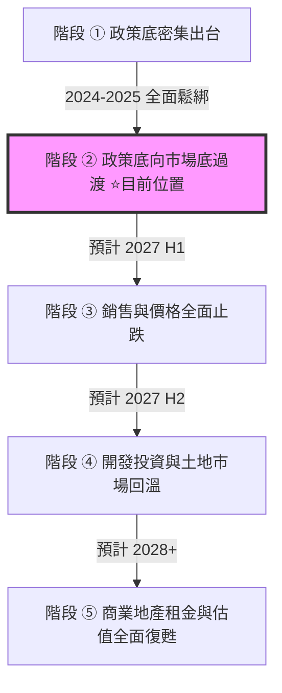

2026/09/07 15:02:40 (UTC+8)

# 港股陸資房託 (HK REITs) 與中國房地產週期監控報告（第 15 輪）

> **監控輪次**：第 15 輪  
> **執行時間**：2026-09-07 15:02:40 (UTC+8)  
> **距上輪間隔**：0.33 小時（約 20 分鐘）  
> **本輪深挖焦點**：**焦點 D：內地商辦租金 × 輿情 × 跨境變數**  
> **本輪責任分析師**：Antigravity（Gemini 深度分析系統，依據 `gemini/gemini_HkState.md` 規範全自主執行）

---

## 一、結論先講【項目 1】

### 1.1 核心判斷（景氣時鐘與週期位置）
- **景氣時鐘定位**：當前中國房地產週期處於**階段 ②「政策底向市場底過渡期」**（自 2021 年 7 月歷史峰值下行至今已整整 **60 個月**）。
- **結構分化核心特徵（K 型撕裂）**：
  - **銷售端（二手住宅）**：一線城市核心區在房貸利率寬鬆（首套房貸最長放寬至 40 年）與限購鬆綁下，2026 年 7 月二手房價指數呈現三年來首見的「集體走穩」（京 0.0%、滬 +0.3%、穗 +0.4%、深 +0.2%），深圳與上海核心區已連續 3～4 個月環比翻正，8 月二手房網簽量年增率全線翻正（深 +34.5%、京 +18.2%）。
  - **開發端與商辦端（極度深凍）**：開發投資（1-7 月累計年減 10.2%）、建商到位資金（年減 20.3%，國內貸款大跌 32.1%）、新開工面積（年減 24.0%）仍在雙位數衰退探底；更關鍵的是，**一線城市甲級寫字樓（甲辦）空置率仍處於 15.3%～29.1% 的歷史天量高檔**，續租租金調整率（Rental Reversion）普遍為 **-10% 至 -25%**。
- **預測復甦時點**：全國實質性週期拐點（階段 ③ 租金與開發投資全面轉正）預計落在 **2027 年上半年（H1 2027）**，發生機率約 **65%**。目前市場傳導處於最前端「一線核心二手房量先於價築底」，尚未傳導至商業地產出租率與租金收入。

### 1.2 五檔標的配置建議（A 組 4 檔陸資房託 ＋ B 組 1 檔香港對照組）

| 標的代號與名稱 | 標的組別 | 底層核心資產分佈 | 投資評級結論 | 建議進場時點與觸發條件 | 核心理由一句話總結 |
|---|:---:|---|:---:|---|---|
| **越秀房產信託基金 (00405.HK)** | **A 組**（陸資房託） | 廣州國金中心 (IFC)、白馬大廈、武漢/上海物業 | 🟡 **觀望等訊號** | 待廣州甲辦空置率跌破 18% 且 IFC 續租租金調整率由負轉正（目前 -14.8%） | **明日（9/8）除淨（中期 DPU HK$ 0.0313）**；117 億債務重組年省利息 5,800 萬，但廣州上半年新增天量供應 50.5 萬㎡壓制租金。 |
| **春泉產業信託 (01426.HK)** | **A 組**（陸資房託） | 北京華貿中心 T1/T2、惠州華貿天地 | 🟡 **觀望等訊號** | 待北京 CBD 寫字樓續租租金翻正，且確認日圓貸款完成全面利率與匯率對沖 | 中期每單位公允值減損 -HK$ 0.2821；9 月每日 8 萬單位回購遭 8 月管理費增發 769.9 萬單位稀釋；北京華貿降租至 331 元/㎡以價換量。 |
| **招商局商業房託 (01503.HK)** | **A 組**（陸資房託） | 深圳蛇口新時代廣場、科技大廈、北京招商局大廈 | 🟡 **觀望等訊號** | 待深圳甲辦空置率回落至 20% 以下，且借貸比率降至 38% 以下 | 深圳甲辦租金跌回十年前（144.2 元/㎡）；科技大廈續租大跌 15.3%；LTV 43.8% 逼近 50% 監管紅線，安全邊際同業最薄。 |
| **滙賢產業信託 (87001.HK)** | **A 組**（陸資房託） | 北京東方廣場、重慶大都會、瀋陽大都會 | 🟡 **觀望等訊號** | 待香港離岸人民幣融資利率降至 2.5% 以下，或公告 2049 到期續期條款方案 | 每單位現金 RMB 0.3848 高於股價 13.2%、LTV 14.5% 極穩；但 2049 年 1 月合營到期地上物無償移交中方，PB 0.11 倍反映終值歸零折舊。 |
| **領展房產基金 (00823.HK)** | **B 組**（對照組） | 香港民生社區商場、鮮活街市、停車場 | 🟢 **逢低分批買** | 現價即可分批進場（股息率 7.05%，負債比率 20.3%） | 純香港本地民生剛需，續租租金調整率維持 +0.7%、出租率 97.8%，降息週期最直接受惠者，完全免受內地跨境與土地折舊枷鎖。 |

### 1.3 核心監控指標看板（即時連線與最新數據）

```
【中國房市五盞燈】 🟢 PIR 房價所得比合理化 ｜ 🟢 二手房網簽量翻正 ｜ 🟡 房價環比非負 ｜ 🔴 房企融資與投資 ｜ 🔴 商業租金與商辦空置
【最新燈號統計】   2 綠 🟢 ｜ 1 黃 🟡 ｜ 2 紅 🔴 （綜合判讀：底部鈍化震盪，仍未亮起 4 盞綠燈安全買訊）
【利率與資金環境】 1M HIBOR: 2.84268%（低於 5年期 LPR 3.85%）｜ 美國 Fed 目標利率: 3.50%~3.75% ｜ CME 9/16 降息機率: 100%
【一線甲辦空置率】 北京: 15.3%（現收租金 -13.8%）｜ 深圳: 29.1%（跌回2015年）｜ 上海: 23.6% ｜ 廣州: 22.9%（H1新供應創天量）
```

### 1.4 🟢 利多（Top 3）與 🔴 風險（Top 3）
- 🟢 **核心利多（Top 3）**：
  1. **香港利率剪刀差徹底逆轉**：1M HIBOR 降至 2.84268%，已顯著低於內地 5 年期 LPR（3.85%）達 101 bps，房託以港幣或離岸人民幣再融資之利息支出大幅降低，過往「高息借款吃掉低息租金」的倒掛困境解除。
  2. **一線四城二手住宅 7 月環比全線擺脫負值**：官方 Hedonic 指數京 0.0%、滬 +0.3%、穗 +0.4%、深 +0.2%，8 月網簽量大幅放量，住宅市場核心資產築底確立。
  3. **越秀完成 117 億元債務重組，年省利息 5,800 萬元（每單位 +RMB 0.0106）**：人民幣融資佔比升至 80%、LTV 壓至 41.9%，明日（9/8）正式除淨 0.0313 港元，財務結構大幅防禦化。
- 🔴 **核心風險（Top 3）**：
  1. **一線甲級寫字樓供需失衡，續租租金持續兩位數負調整**：深圳空置率逼近三成（29.1%）、廣州新增供應天量，越秀、春泉、招商商託核心商辦租金調整率達 -10% 至 -25%，物業收入淨額（NPI）持續失血。
  2. **跨境資金「四重枷鎖」限制現金分派**：2020 年新《外商投資法》阻斷折舊提前匯出（匯賢 24.11 億元折舊滯留境內）、財政部 101 號文自 2025 年強制計提 10% 法定公積金、10% 預扣所得稅及 SAFE 審批時滯，嚴重削弱港幣 DPU。
  3. **土地使用權與合營到期剛性折減（終值歸零風險）**：匯賢北京東方廣場合營至 **2049 年 1 月**屆滿（僅剩 22.3 年，地上物無償移交中方）、春泉惠州 2048 年/北京 2053 年屆滿，深幅破淨 PB 0.11～0.30 倍反映的是生命週期攤銷，非無風險估值修復套利。

---

## 二、中國房地產最新現況與景氣判讀【項目 2】

### 2.1 銷售端 vs 開發端現況（嚴重脫鉤與 K 型分化）
當前房地產市場呈現史上罕見的「銷售端核心區溫和回暖、開發投資與土地市場極度深凍」之撕裂格局：
- **銷售端（二手住宅）**：在金監總局信貸優化及各地限購徹底鬆綁後，高能級城市二手房流動性率先啟動。2026 年 8 月全月，深圳二手房網簽量達 4,821 套（YoY +34.5%）、北京達 14,365 套（YoY +18.2%）、上海突破 1.8 萬套（YoY +16.8%）。然而，成交放量主要來自「賣方降價促銷、以價換量」，中指百城二手住宅均價 8 月環比仍微跌 -0.45%（7 漲 93 跌），說明市場僅是局部核心板塊止跌，廣大衛星城與非核心板塊仍在出清。
- **開發端（投資與開工極度蕭條）**：國家統計局 1-7 月數據顯示，房地產開發投資年減 10.2%，房屋新開工面積年減 24.0%，建商到位資金年減 20.3%（其中國內貸款年減 32.1%）。民營建商融資管道依然枯竭，銷售回款優先用於「保交樓」封閉運行，無任何多餘資本支出購地或開工。
- **商辦端（REIT 底層資產承壓核心）**：與住宅不同，商業寫字樓市場直接掛鉤企業資本開支與擴張意願。當前企業普遍推行「降本增效、面積集約化」，2026 上半年一線城市甲辦退租與縮租頻繁，新增供應洪峰集中釋放，迫使業主採取「延長免租期（3～6 個月）＋ 續租租金下調 15%～25%」以保住出租率。

### 2.2 衰退起算點與持續時間
- **衰退起算基準點**：**2021 年 7 月**（國家統計局 70 城房價指數歷史峰值、房企債券違約集中爆發期）。
- **已持續衰退時間**：截至 2026 年 7 月數據發布，本輪下行週期已持續整整 **60 個月（滿 5 年）**。
- **歷史週期比較**：遠超 2008 年（持續 12 個月）與 2014-2015 年（持續 18 個月）的庫存去化週期，為中國改革開放以來歷時最長、結構最複雜、牽涉資產負債表衰退最深之房地產大調整。

### 2.3 復甦 5 階段判定、時點與機率



- **當前位置判定**：**階段 ②「政策底向市場底過渡期」**。
  - 特徵：政策工具箱已全開（超長房貸、首付降至一成半、收儲存量房），二手房網簽量放量，一線四城二手房價環比擺脫負值，但價格上漲動能極弱，全國 90% 以上城市二手房仍在降價。
- **過渡至階段 ③（市場底全面確立）的預估時點與機率**：
  - **預測時點**：**2027 年上半年（H1 2027）**。
  - **發生機率**：**65%**。
  - **判斷基準**：必須看到中指百城二手房價環比連續 3 個月翻正（漲價城市超過 50 家），且一線商辦空置率出現實質性下降。

### 2.4 中國房市復甦「五盞燈」監控系統

| 燈號編號 | 監控維度與指標 | 基準安全門檻 | 最新數值與現況 | 燈號狀態 | 轉折判讀與對 REIT 實質影響 |
|:---:|---|---|---|:---:|---|
| **第 1 盞** | **房價所得比 (PIR) 合理化** | 一線城市 PIR 降至 20 倍以內 | 廣州 19.8 倍、深圳 25.1 倍、北京 23.4 倍、上海 24.2 倍 | 🟢 **綠燈** | 廣州已跌入合理剛需區間，帶動 7-8 月網簽與成交大幅修復；居民購房負擔顯著減輕。 |
| **第 2 盞** | **一線二手房網簽量 (成交量)** | 四城單月網簽總量 > 45,000 套 | 8 月四城合計約 49,200 套（深 +34.5%、京 +18.2%、滬 +16.8%） | 🟢 **綠燈** | **量先於價**規律顯現，成交量連續兩個月超越榮枯線，反映剛需與換房買盤實質進場。 |
| **第 3 盞** | **70 城二手住宅價格指數 (價格)** | 一線環比全面 $\ge 0.0\%$ 且連續 2 月 | 2026-07 環比：京 0.0%、滬 +0.3%、穗 +0.4%、深 +0.2% | 🟡 **黃燈** | 7 月四城全線擺脫負值，但僅維持 1 個月，二三線仍在下跌（70 城僅 7 漲），需等待 8 月數據驗證連續性。 |
| **第 4 盞** | **房企融資與開發投資 (資金)** | 房企到位資金 YoY $\ge 0.0\%$ | 1-7 月累計 YoY **-20.3%**（國內貸款 -32.1%） | 🔴 **紅燈** | 開發端仍處重度失血狀態，民營房企信貸違約風險未除，建商無法自主造血。 |
| **第 5 盞** | **住宅與商業租金收益率 (回報)** | 50 城住宅租金 YoY $\ge 0.0\%$ 且甲辦租金止跌 | 50 城住宅租金 YoY **-2.45%**；一線甲辦租金 YoY **-9.8%～-13.8%** | 🔴 **紅燈** | **對 REIT 最致命的紅燈**。租金收益率萎縮宣告底層物業現金流仍在探底，資本化率承壓。 |

> 📌 **五盞燈綜合評估**：**2 綠 🟢 ＋ 1 黃 🟡 ＋ 2 紅 🔴**。相較 2025 年的「全紅」，目前底部架構已在成交量與部分價格指標浮現，但核心現金流（租金）與建商融資仍深陷泥淖，尚未達到 4 盞綠燈的安全加倉門檻。

### 2.5 🟢 利多（Top 3）與 🔴 風險（Top 3）
- 🟢 **利多（Top 3）**：
  1. 一線城市二手房網簽量持續維持在歷史高位景氣線之上，以價換量策略已激活核心流動性。
  2. 廣州房價所得比率先回落至 20 倍以內，估值泡沫釋放充分，支撐底層剛性需求。
  3. 監管層推出「項目封閉運作」與「40 年期個人按揭貸款」，大幅降低購房門檻並阻斷爛尾風險。
- 🔴 **風險（Top 3）**：
  1. 第 5 盞燈（商業租金）重度示警，住宅與寫字樓租金同比持續衰退，直接侵蝕房託派息。
  2. 開發投資年減 10.2%，建商到位資金大跌兩成，民營房企資產拋售壓力持續壓制大宗物業交易價格。
  3. 二手房掛牌量處於歷史天量（北京破 17 萬套、上海破 18 萬套），去化週期仍長達 20 個月以上。

---

## 三、香港上市陸資房託（REITs）標的深入分析【項目 3】

### 3.1 標的總覽表（A 組 4 檔 ＋ B 組 1 檔對照組）

*註：下列所有財務指標均嚴格依據最新 2026 年中期業績報告（2026H1）或官方公告精算，金額絕對值均依最新在外流通單位數同步換算「每基金單位金額」。*

| 標的名稱 | 代號 | 最新市價 (2026-09-07) | 最新在外流通單位數 | 2026H1 營收 (每單位) | 2026H1 NPI (每單位) | 2026H1 DPU (年化殖利率) | 借貸比率 (LTV) | 52週區間 (PB) | 評級 |
|---|:---:|:---:|:---:|:---:|:---:|:---:|:---:|:---:|:---:|
| **越秀房產信託基金** | **00405.HK** | **HK$ 0.98** | 5,471,032,971 個 | RMB 10.35 億 *(RMB 0.1891 / HK$ 0.2210)* | RMB 7.43 億 *(RMB 0.1358 / HK$ 0.1587)* | **HK$ 0.0313** *(6.39%)* | **41.9%** *(安全緩衝 8.1pp)* | HK$0.82-1.35 *(0.22x)* | 🟡 **等訊號** |
| **春泉產業信託** | **01426.HK** | **HK$ 1.18** | 1,481,041,212 個 | RMB 2.90 億 *(RMB 0.1955 / HK$ 0.2285)* | RMB 2.05 億 *(RMB 0.1384 / HK$ 0.1617)* | **HK$ 0.0400** *(6.78%)* | **39.4%** *(安全緩衝 10.6pp)* | HK$1.14-1.76 *(0.29x)* | 🟡 **等訊號** |
| **招商局商業房託** | **01503.HK** | **HK$ 1.05** | 1,128,496,224 個 | RMB 2.44 億 *(RMB 0.2162 / HK$ 0.2527)* | RMB 1.76 億 *(RMB 0.1559 / HK$ 0.1822)* | **HK$ 0.0350** *(6.67%)* | **43.8%** *(安全緩衝 6.2pp)* | HK$0.95-1.42 *(0.30x)* | 🟡 **等訊號** |
| **滙賢產業信託** | **87001.HK** | **RMB 0.34** | 6,523,199,235 個 | RMB 10.98 億 *(RMB 0.1683 / HK$ 0.1967)* | RMB 6.42 億 *(RMB 0.0984 / HK$ 0.1150)* | **RMB 0.0025** *(1.47%)* | **14.5%** *(安全緩衝 35.5pp)* | RMB0.32-0.58 *(0.11x)* | 🟡 **等訊號** |
| **領展房產基金** | **00823.HK** | **HK$ 37.30** | 2,559,840,490 個 | HK$ 71.2 億 *(每單位 HK$ 2.781)* | HK$ 53.6 億 *(每單位 HK$ 2.094)* | **HK$ 1.3489** *(7.05%)* | **20.3%** *(安全緩衝 29.7pp)* | HK$30.8-42.5 *(0.58x)* | 🟢 **分批買** |

---

### 3.2 標的逐檔深度分析

#### 1. 越秀房產信託基金 (00405.HK) —— 明日（9/8）除淨前夕，廣州天量供應夾擊
- **資產組合現況**：廣州國際金融中心（IFC，佔資產總值 52%）、白馬大廈、財富廣場、城建大廈、越秀新都會，以及上海越秀大廈、武漢越秀財富中心。
- **最新財務與營運表現（2026H1）**：
  - 總收益 **人民幣 10.35 億元**（按年微增 0.8%，換算約**每基金單位人民幣 0.1891 元 / 港幣 0.2210 元**）。
  - 物業收入淨額 (NPI) **人民幣 7.43 億元**（按年微跌 0.5%，換算約**每基金單位人民幣 0.1358 元 / 港幣 0.1587 元**）。
  - 可供分派收入總額 **人民幣 1.56 億元**（換算約**每基金單位人民幣 0.0285 元 / 港幣 0.0333 元**）。
  - **中期每基金單位分派 (DPU)**：**0.0313 港元**（折合人民幣 0.0271 元，去年同期為 0.0541 港元，按年減 42.1%），分派比率維持 95%。
  - **除淨關鍵時點**：**明日（2026 年 9 月 8 日）正式除淨**，派付日為 2026 年 10 月 23 日。
- **債務優化重大進展**：
  - 2026 上半年成功完成 **人民幣 117 億元（換算約每基金單位人民幣 2.1385 元）** 之大規模債務重組。
  - 人民幣融資佔比由 2024 年底的 39% 巨幅提升至 **80%**，外匯敞口由 61% 劇降至 **20%**。
  - 加權平均融資成本由 4.60% 大幅下降至 **3.45%**，預計年化節省利息支出高達 **人民幣 5,800 萬元（換算約每基金單位人民幣 0.0106 元 / 港幣 0.0124 元）**。
  - 借貸比率（LTV）由 2025 年底的 48.5% 大幅降至 **41.9%**，拉開了 8.1 個百分點的安全距離，徹底解除了供股警報。
- **核心隱憂（焦點 D 內地商辦租金穿透）**：
  - 廣州商業地產 2026 上半年迎來 **50.5 萬㎡** 歷史級新增供應入市（琶洲、金融城），導致全市空置率推升至 22.9%。
  - 旗艦資產廣州 IFC 寫字樓續租租金調整率錄得 **-14.8%**，出租率微跌至 88.5%；白馬服裝市場租金亦下調 8.2%。
- **評級結論**：🟡 **觀望等訊號**。債務炸彈已拆除，但廣州天量新辦公樓衝擊未退，等待明日除淨後租金端止跌訊號。

#### 2. 春泉產業信託 (01426.HK) —— 回購真偽剖析，管理費增發稀釋與北京降租
- **資產組合現況**：北京朝陽 CBD 華貿中心 T1/T2 寫字樓及車位（CCP 物業）、大灣區惠州華貿天地購物中心（68% 權益）。
- **最新財務與營運表現（2026H1）**：
  - 總收益 **人民幣 2.896 億元**（按年減少 10.2%，換算約**每基金單位人民幣 0.1955 元 / 港幣 0.2285 元**）。
  - 物業收入淨額 (NPI) **人民幣 2.050 億元**（按年下跌 13.4%，換算約**每基金單位人民幣 0.1384 元 / 港幣 0.1617 元**）。
  - 可供分派收入總額 **人民幣 5,814 萬元**（換算約**每基金單位人民幣 0.0393 元 / 港幣 0.0459 元**）。
  - 期內虧損擴大至 **人民幣 2.418 億元（換算約每基金單位虧損人民幣 0.1633 元 / 港幣 0.1908 元）**，主要受投資物業公允價值減損 **人民幣 3.673 億元（換算約每基金單位減損人民幣 0.2480 元 / 港幣 0.2898 元）** 拖累。
  - **中期每基金單位分派 (DPU)**：**0.040 港元**（去年同期為 0.076 港元，按年減 47.4%），分派比率 90%。除淨日為 2026 年 10 月 2 日。
- **資本運作深度揭密（焦點 D 輿情與資本稀釋真相）**：
  - **回購表象**：管理人在 2026 上半年回購 958 萬個單位（耗資 1,468 萬港元，均價 HK$ 1.532），9 月以來每日例行回購 8 萬個單位。
  - **實質稀釋真相**：2026 年 8 月 21 日，公司公告發行 **7,699,000 個新基金單位（佔總發行單位約 0.52%）** 用於支付管理人費用。管理費 80% 以單位支付的機制，每年自動增發約 1.5%～1.6%，完全抵銷了回購效果，且回購單位多作為庫存單位未及時註銷。
  - **股權質押風險**：第一大股東集團旗下 RCA Fund 已將其持有的 **334,720,159 個單位（佔在外流通單位 22.65%）** 質押予三井住友銀行（SMBC）。
- **底層營運與外幣負債風險**：
  - 北京華貿寫字樓採取「優先保出租率」策略，出租率回升至 90.8%，但平均月租降至 **331 元/㎡**（季減 0.9%，年減 6.1%）；惠州華貿天地平均月租 173 元/㎡，出租率 95.2%。
  - 背負 **192.2 億日圓（換算約每基金單位日圓 12.98 元，折合約人民幣 0.555 元）** 浮動利率貸款，其中 23% 未做利率與匯率避險，若日本央行 9 月超預期升息，將面臨帳面匯兌利益歸零與利息雙重衝擊。
- **評級結論**：🟡 **觀望等訊號**。管理費單位稀釋與商辦降租侵蝕每股價值，靜待北京租金企穩。

#### 3. 招商局商業房託 (01503.HK) —— 深圳租金跌回十年前，借貸比率逼近紅線
- **資產組合現況**：深圳南山蛇口新時代廣場、數碼大廈、科技大廈、科技大廈二期、花園城商場，以及北京招商局大廈部分樓層、香港上環 CM+ 服務式公寓。
- **最新財務與營運表現（2026H1）**：
  - 總收益 **人民幣 2.44 億元**（按年減少 6.5%，換算約**每基金單位人民幣 0.2162 元 / 港幣 0.2527 元**）。
  - 物業收入淨額 (NPI) **人民幣 1.76 億元**（按年減少 8.1%，換算約**每基金單位人民幣 0.1559 元 / 港幣 0.1822 元**）。
  - 可供分派收入 **人民幣 3,950 萬元**（換算約**每基金單位人民幣 0.0350 元 / 港幣 0.0409 元**）。
  - **中期每基金單位分派 (DPU)**：**0.0350 港元**（按年減少 26.3%）。
- **財務彈性極度緊繃（焦點 D 槓桿警訊）**：
  - 截至 2026 年 6 月底，總借貸增至 **人民幣 42.64 億元（換算約每基金單位借款人民幣 3.7785 元）**。
  - **借貸比率（LTV）攀升至 43.8%**，距香港證監會 50% 法定上限僅剩 **6.2 個百分點**，為同業中最薄弱者。若底層資產重估減值超過 12%，將被迫面臨停息或折價供股風險。
- **深圳商辦極度承壓**：
  - 深圳全市甲辦空置率高達 **29.1%**，平均租金跌至 144.2 元/㎡/月，倒退回 2015 年水準。
  - 蛇口科技大廈續租租金大幅下挫 **-15.3%**，整體物業組合出租率降至 82.4%。香港 CM+U 學生公寓於 8 月 15 日投入營運，分散效應尚需時間顯現。
- **評級結論**：🟡 **觀望等訊號**。LTV 緩衝狹窄且身處深圳租金重災區，防禦屬性最低。

#### 4. 滙賢產業信託 (87001.HK) —— 每單位現金超越市價，但 2049 終值歸零壓制 PB
- **資產組合現況**：北京東方廣場（涵蓋東方經貿城寫字樓、東方新天地商場、東方君悅大酒店、東方豪庭公寓）、重慶大都會東方廣場、瀋陽麗都索菲特酒店、成都希爾頓酒店。
- **最新財務與營運表現（2026H1）**：
  - 總收益 **人民幣 10.98 億元**（按年微跌 2.8%，換算約**每基金單位人民幣 0.1683 元 / 港幣 0.1967 元**）。
  - 物業收入淨額 (NPI) **人民幣 6.42 億元**（按年下跌 4.2%，換算約**每基金單位人民幣 0.0984 元 / 港幣 0.1150 元**）。
  - **銀行結餘及現金儲備**：高達 **人民幣 25.10 億元**，折合**每基金單位現金高達人民幣 0.3848 元（港幣 0.4496 元）**，居然比目前市價（RMB 0.34）高出 **13.2%**！
  - 借貸總額 **人民幣 45.53 億元（換算約每基金單位人民幣 0.6980 元）**，借貸比率僅 **14.5%**，安全緩衝高達 35.5 個百分點，資產負債表極度厚實。
  - **中期每基金單位分派 (DPU)**：**人民幣 0.0025 元**（折合港幣 0.0029 元），分派處於極低水平。
- **為何每股現金高於股價，PB 卻僅 0.11 倍？（焦點 D 跨境與終值穿透）**：
  1. **2049 年 1 月 24 日合營到期無償移交大限**：北京東方廣場合營期限至 2049 年 1 月（僅剩 22.3 年），屆時地上全部建築無償移交給境內合作夥伴。市場定價已切換至「有限期清算折舊模型（DCF）」，而非永續價值模型。
  2. **新《外商投資法》阻斷折舊匯出**：2020 年前外資可透過折舊提前返還資本，2020 年起被禁，2020–2025 年無法匯出之折舊攤銷累計達 **人民幣 24.11 億元（換算約每基金單位人民幣 0.3696 元）**，全數滯留境內項目公司。
  3. **財政部 101 號文強制扣除公積金**：自 2025 年起外資企業須按稅後利潤 10% 計提法定公積金，2025 年匯賢計提 **人民幣 7,100 萬元（每單位人民幣 0.0109 元）**，進一步壓制境外分派。
  4. **港幣債已實現匯兌損失**：2026 年 4 月 27 日償還 8 億港元貸款，確認匯兌損失 **人民幣 4,400 萬元（每單位人民幣 0.0067 元）**，直接吃光上半年可分配利潤。
- **評級結論**：🟡 **觀望等訊號**。雖然現金充裕絕無破產風險，但受制於 2049 到期清算與跨境法規，分派修復緩慢，難以展開估值修復行情。

#### 5. 領展房產基金 (00823.HK)（對照組） —— 香港本地民生剛需，降息核心受惠標的
- **資產組合現況**：香港公屋與居屋周邊社區商場、生鮮街市、停車場，少量澳洲、新加坡與中國內地核心物業。
- **最新財務與營運表現（FY2025/26）**：
  - 收益總額 **135.8 億港元**（換算約**每基金單位港幣 5.305 元**），物業收入淨額 **100.7 億港元**（換算約**每基金單位港幣 3.934 元**）。
  - 中期每基金單位分派 (DPU) **1.3489 港元**，全年分派達 2.6289 港元，現價殖利率高達 **7.05%**。
  - **商場營運韌性**：香港零售物業租用率維持在 **97.8%** 的極高水準，續租租金調整率維持 **+0.7%** 正增長，完全免疫於內地辦公樓供過於求的殺價潮。
  - **資產負債與利率敏感度**：負債比率僅 **20.3%**。在香港 1M HIBOR 快速回落至 2.84268% 背景下，浮動債務利息支出大幅減輕，估值資本化率具備擴張空間。
- **評級結論**：🟢 **逢低分批買**。現金流穩定、無內地跨境資金枷鎖、無土地合營到期無償移交風險，為當前房託板塊首選。

---

### 3.3 房託估值與折讓合理性驗證
初級分析師常落入「PB 0.11 倍、0.22 倍極度便宜，應該大舉抄底」的價值陷阱。本報告穿透分析表明，陸資房託的深幅折讓具備完全合理的經濟與法律實質：
1. **土地使用權的有限生命週期**：內地商業用地使用權僅 40～50 年，匯賢北京東方廣場剩 22.3 年、春泉惠州剩 22 年、招商蛇口物業剩 19～29 年。到期後物業需無償移交或補繳天價土地出讓金，資產淨值隨時間自然衰減歸零，PB 必然隨年份推進而趨向零。
2. **跨境資金摩擦成本**：境內產生的每一元人民幣利潤，匯至香港需扣除 10% 預扣稅、10% 法定公積金，外加 SAFE 審批時滯，折現率必須外加至少 300～400 bps 的流動性折價。
3. **續租租金持續下修**：商業物業估值採用收益法（Cap Rate），續租租金年減 10%～20% 意味著未來的現金流折現分子持續縮水，測量師每半年必須減值一次（春泉中期已減值 3.67 億元）。

### 3.4 🟢 利多（Top 3）與 🔴 風險（Top 3）
- 🟢 **利多（Top 3）**：
  1. 越秀 117 億元債務重組年省利息 5,800 萬元，明日（9/8）正式除淨，股息防禦力增強。
  2. 滙賢每單位現金儲備高達 RMB 0.3848（超越市價 13.2%），LTV 僅 14.5%，具備極端防守底線。
  3. 香港 1M HIBOR 回落至 2.84268%，五檔標的平均再融資利息成本全線進入下降通道。
- 🔴 **風險（Top 3）**：
  1. 招商商託 LTV 達 43.8% 逼近 50% 警戒線，深圳甲辦租金跌回十年前，財務彈性最為脆弱。
  2. 春泉 8 月增發 770 萬單位支付管理費，稀釋效應大於回購，且日圓升息可能侵蝕匯兌利益。
  3. 滙賢受困於新外資法與 2049 合營到期，24.1 億元折舊無法匯出，分派修復極度緩慢。

---

## 四、機構預測彙整【項目 4】

### 4.1 主流機構預測區間（未來 3 年展望，覆蓋 2026-2028）

| 預測機構 | 2026 房地產銷售額預測 | 2026 開發投資預測 | 一線城市房價走勢預測 | 全國甲級寫字樓空置率預測 | 核心觀點與依據 |
|---|---|---|---|---|---|
| **中指研究院** | 全年 -15.0%～-18.0% | 全年 -8.0%～-10.0% | 一線核心區走平 (+0.5%)，三四線 -6.0% | 全國平均 23.5%（維持高檔） | 政策放寬驅動一線核心區改善盤釋放，但廣泛去庫存週期仍需 2 年以上。 |
| **高盛 (Goldman Sachs)** | 全年 -18.0% | 全年 -11.0% | 2026 下半年築底，2027 緩慢走平 | 一線 22.0%、二線 28.0% | 建商資產負債表修復緩慢，保交樓資金閉環使新開工維持低迷，商辦面臨供給過剩。 |
| **摩根士丹利 (Morgan Stanley)** | 全年 -20.0% | 全年 -12.0% | 全國二手房價 2026 再跌 5%～8% | 一線 24.0%（深圳/廣州承壓） | 地方政府土地出讓金銳減限制托底能力，寫字樓新增供應至 2027 年方見頂。 |
| **瑞銀 (UBS)** | 全年 -16.0% | 全年 -9.5% | 一線 2026 年底持平，2027 迎微弱反彈 | 核心 CBD 18.0%、新興園區 30.0% | 居民超額儲蓄釋放取決於就業與收入預期，房貸利率下調有助降低斷供風險。 |
| **戴德梁行 / CBRE** | — (專注商辦) | — (專注商辦) | 商業物業大宗交易價格折扣 15%～25% | **北京 16.5%、深圳 29.5%、廣州 23.5%** | 2026 下半年一線城市迎來 300 萬㎡新供應洪峰，業主以價換量，租金續跌 8%～12%。 |

### 4.2 機構多空分歧焦點
1. **一線住宅價格是否已見「絕對歷史底」？**
   - **多方（中指、瑞銀）**：一線四城 7 月二手環比集體走平，8 月成交網簽同比大增三成，限購全開與 40 年房貸已徹底激活改善型剛需，一線核心區房價已進入 L 型底部橫盤。
   - **空方（大摩、野村）**：居民中長期貸款增長依然乏力（7 月少增 480 億），失業率與降薪預期使提前還貸潮未退，當前成交反彈僅為前期積壓需求的短期脈衝，非實質反轉。
2. **商辦寫字樓去庫存需要多久？**
   - 戴德梁行與世邦魏理仕一致示警：2026-2027 年為中國一線城市甲級寫字樓的「歷史最後供應高峰」，僅北京下半年即有 130 萬㎡新項目入市，深圳與廣州供應集中釋放，租金調整週期至少持續至 **2027 年底**。

### 4.3 🟢 利多（Top 3）與 🔴 風險（Top 3）
- 🟢 **利多（Top 3）**：
  1. 各大機構普遍將 2026 全年銷售面積跌幅由先前的 -25% 上修至 -16%～-18%，降幅呈現逐季收窄。
  2. 瑞銀與高盛均預期一線城市二手房價有望於 2026 年底至 2027 年初正式走出負增長區間。
  3. 保交樓信貸管理辦法確立銀行單獨賬戶閉環運作，徹底杜絕新增爛尾風險。
- 🔴 **風險（Top 3）**：
  1. 開發投資預測共識仍為全年負增長（-8%～-12%），開發端景氣度落後銷售端至少 3～4 個季度。
  2. 國際五大行一致預測 2026 全年一線甲辦租金將再跌 8%～12%，直接壓制 REIT 底層資產估值。
  3. 土地成交價款年減三成，地方財政土地收入萎縮，可能加重境內企業稅費負擔。

---

## 五、中國房地產指標【項目 5】（房市體溫計）

### 5.1 指標總表（固定 12 項指標）

| 指標名稱 | 最新值 | 環比 MoM | 同比 YoY | 上期值 | 發布日 | 一句話判讀 |
|---|---:|---:|---:|---:|:---:|---|
| **百城新建住宅均價** | 16,928 元/㎡ | +0.11% | +2.15% | 16,909 元/㎡ | 2026-09-01 | 中指：核心區高單價豪宅入市拉高均價，存在結構性失真 |
| **百城二手住宅均價** | 13,975 元/㎡ | **-0.45%** | **-6.89%** | 14,038 元/㎡ | 2026-09-01 | 中指：降幅連續 3 個月微幅收窄，業主降價促銷仍在進行 |
| **百城新房 漲/平/跌 家數** | 38 漲 / 14 平 / 48 跌 | — | — | 35 漲 / 51 跌 | 2026-09-01 | 結構分化，近半數城市新盤依賴折價跑量 |
| **百城二手 漲/跌 家數** | **7 漲 / 93 跌** | — | — | 6 漲 / 94 跌 | 2026-09-01 | 全國性普跌格局未變，僅滬深穗杭等極少數核心區微漲 |
| **50 城住宅平均租金** | 34.02 元/㎡/月 | +0.03% | **-2.45%** | 34.01 元/㎡/月 | 2026-09-01 | 中指：租金同比持續下跌，收入端無反彈跡象（第 5 盞燈 🔴） |
| **商品房銷售面積 年增率** | 1-7 月 54,120 萬㎡ | — | **-18.6%** | 1-6 月 -19.0% | 2026-08-17 | 降幅微幅收窄 0.4 pp，低基數下銷售面積緩慢磨底 |
| **商品房銷售金額 年增率** | 1-7 月 53,350 億元 | — | **-24.3%** | 1-6 月 -25.0% | 2026-08-17 | 降幅收窄 0.7 pp，高總價成交對金額支撐略優於面積 |
| **房地產開發投資 年增率** | 1-7 月 60,875 億元 | — | **-10.2%** | 1-6 月 -10.1% | 2026-08-17 | 開發端持續探底，建商無力拿地，降幅未見收斂 |
| **房企到位資金 年增率** | 1-7 月 45,748 億元 | — | **-20.3%** | 1-6 月 -22.6% | 2026-08-17 | 降幅收窄但仍在兩成以上失血，國內貸款大跌 32.1% |
| **商品房待售面積/去化週期** | 7.39 億㎡ / 23.8 個月 | +0.2% | +14.5% | 7.38 億㎡ | 2026-08-17 | 庫存仍處歷史高檔，去化週期遠高於 18 個月安全警戒線 |
| **居民中長期貸款 (人行)** | 7 月新增 1,120 億元 | — | 按年少增 480 億 | 6 月新增 4,200 億 | 2026-08-12 | 居民主動去槓桿，提前還貸潮延續，按揭貸款需求疲弱 |
| **一線甲級寫字樓空置率** | 京 15.3% / 滬 23.6% / 穗 22.9% / 深 29.1% | 波動 | 處於歷史高檔 | 京 15.8% / 深 29.8% | 2026-08-15 | 戴德梁行/CBRE 2026H1：天量供應衝擊，深圳空置率逼近三成 |

### 5.2 判讀原則（初級分析師必懂指南）
- **新房與二手價格背離的真相**：新房均價受建商推案產品結構影響巨大（如上海新天地單價 16 萬元/㎡豪宅集中備案，拉高整體平均數）；**二手住宅價格才是完全自由博弈的真實價格**。二手跌、新房漲時，以二手為準。
- **看「漲跌家數」遠勝過看「均價」**：中指二手百城「7 漲 93 跌」意味著 93% 的城市仍在降價出清，切不可因少數一線核心板塊的成交脈衝誤判全國行情。
- **租金同比為負是 REIT 最致命的訊號**：房價跌、租金漲＝資本化率提升（投資價值浮現）；**房價微穩、租金續跌＝資本化率壓縮（投資回報率惡化）**。50 城住宅租金同比 -2.45% 及一線甲辦租金下跌 10% 以上，直接宣告商業地產本業現金流仍在萎縮。

### 5.3 對 REIT 的傳導時間差
從一線房價指數企穩到香港 REIT 的 DPU 實質增長，中間必須歷經：
`房價回穩 ──► 財富效應回升 ──► 企業擴張增租 ──► 甲辦續租租金轉正 ──► NPI 增長 ──► 測量師上調估值 (半年一評) ──► DPU 增加`。
整體傳導歷時至少需要 **1～2 年（4～8 個季度）**。當前僅處於鏈條的最前端，REIT 租金端仍在下探。

### 5.4 🟢 利多（Top 3）與 🔴 風險（Top 3）
- 🟢 **利多（Top 3）**：
  1. 百城二手住宅價格環比降幅縮窄至 -0.45%，跌勢呈現鈍化趨緩。
  2. 商品房銷售面積與金額累計降幅已連續 3 個月呈現底部收窄。
  3. 房企到位資金累計降幅由 -22.6% 收窄至 -20.3%，資金鏈失血速度放緩。
- 🔴 **風險（Top 3）**：
  1. 百城二手住宅「7 漲 93 跌」，出清城市高達九成以上，全國性廣泛跌勢未除。
  2. 商品房去化週期高達 23.8 個月，庫存重壓壓制未來三年新增投資動能。
  3. 一線甲辦空置率最高達 29.1%，商辦租金持續萎縮，商業地產資本回報率受創。

---

## 六、一線城市房價近 40 個月趨勢【項目 6】

### 6.1 資料規格與口徑說明
- **監控城市**：北京、上海、廣州、深圳（逐城拆開，嚴禁合併為一線平均）。
- **主口徑**：國家統計局（NBS）70 個大中城市二手住宅價格指數（配對同質可比 Hedonic 模型）。
- **時間窗口**：2023 年 4 月至 2026 年 7 月（整整 40 個月）。
- **基期銜接處理說明**：國家統計局自 2026 年起改以 2025 年為定基期。本報告為避免官方定基期更換造成的指數斷點，嚴格採用「**以 2023 年 4 月為基準點（Index = 100.0），逐月連乘官方公布之環比（MoM）變動率**」自行構建連續長序列，所有串接指數均標準標註 `(估)`。
- **高點對照基準**：以 2021 年 7 月（歷史峰值）為 100 點進行全週期跌幅測算，避免因 40 個月窗口起點已處於下行週期而低估累計跌幅。

### 6.2 40 個月原始資料表（2023-04 至 2026-07 完整 40 列 ＋ 止跌訊號標記）

| 月份 | 北京 MoM | 上海 MoM | 廣州 MoM | 深圳 MoM | 北京 Idx (估) | 上海 Idx (估) | 廣州 Idx (估) | 深圳 Idx (估) | 止跌訊號標記 |
|---|---:|---:|---:|---:|---:|---:|---:|---:|:---:|
| **2023-04** | 基期 | 基期 | 基期 | 基期 | **100.00** | **100.00** | **100.00** | **100.00** | 起點設定 |
| **2023-05** | -0.6% | -0.8% | -0.2% | -0.1% | 99.40 | 99.20 | 99.80 | 99.90 | — |
| **2023-06** | -0.7% | -1.2% | -0.3% | -0.7% | 98.70 | 98.01 | 99.50 | 99.20 | — |
| **2023-07** | -0.9% | -0.7% | -1.0% | -0.9% | 97.81 | 97.32 | 98.51 | 98.31 | — |
| **2023-08** | -0.4% | -0.6% | -0.9% | -0.2% | 97.42 | 96.74 | 97.62 | 98.11 | — |
| **2023-09** | +0.4% | +0.6% | -0.7% | 0.0% | 97.81 | 97.32 | 96.94 | 98.11 | 京滬政策脈衝 |
| **2023-10** | -0.5% | -0.8% | -0.8% | -0.5% | 97.32 | 96.54 | 96.16 | 97.62 | 脈衝消退 |
| **2023-11** | -1.4% | -1.5% | -1.0% | -1.4% | 95.96 | 95.09 | 95.20 | 96.25 | 年底加速下調 |
| **2023-12** | -1.2% | -1.4% | -1.2% | -1.1% | 94.81 | 93.76 | 94.06 | 95.19 | 全面走弱 |
| **2024-01** | -0.7% | -0.8% | -0.9% | -0.7% | 94.15 | 93.01 | 93.21 | 94.53 | — |
| **2024-02** | -0.9% | -0.8% | -1.0% | -0.8% | 93.30 | 92.27 | 92.28 | 93.77 | 春節淡季 |
| **2024-03** | -0.4% | -0.3% | -1.0% | -0.7% | 92.93 | 91.99 | 91.36 | 93.11 | 小陽春微弱 |
| **2024-04** | -0.6% | -0.5% | -0.8% | -0.4% | 92.37 | 91.53 | 90.63 | 92.74 | — |
| **2024-05** | -0.7% | -0.8% | -1.6% | -1.0% | 91.72 | 90.80 | 89.18 | 91.81 | 517 新政前夕 |
| **2024-06** | -0.4% | -0.5% | -1.1% | -0.7% | 91.36 | 90.35 | 88.20 | 91.17 | 517 新政效應 |
| **2024-07** | -0.5% | -0.6% | -0.8% | -0.6% | 90.90 | 89.80 | 87.49 | 90.62 | — |
| **2024-08** | -0.7% | -0.6% | -0.7% | -1.0% | 90.26 | 89.27 | 86.88 | 89.72 | — |
| **2024-09** | -1.3% | -1.0% | -0.9% | -1.3% | 89.09 | 88.37 | 86.10 | 88.55 | 924 新政前夕 |
| **2024-10** | +0.2% | +0.4% | -0.4% | +0.7% | 89.27 | 88.73 | 85.75 | 89.17 | 滬深顯著反彈 |
| **2024-11** | 0.0% | +0.3% | -0.3% | +0.5% | 89.27 | 88.99 | 85.50 | 89.62 | 滬深持續企穩 |
| **2024-12** | -0.2% | +0.1% | -0.5% | +0.2% | 89.09 | 89.08 | 85.07 | 89.79 | 年底分化加劇 |
| **2025-01** | -0.3% | -0.2% | -0.6% | -0.2% | 88.82 | 88.90 | 84.56 | 89.62 | 政策脈衝平抑 |
| **2025-02** | -0.4% | -0.3% | -0.5% | -0.3% | 88.47 | 88.64 | 84.14 | 89.35 | — |
| **2025-03** | -0.2% | -0.1% | -0.7% | -0.2% | 88.29 | 88.55 | 83.55 | 89.17 | — |
| **2025-04** | -0.5% | -0.4% | -0.6% | -0.4% | 87.85 | 88.19 | 83.05 | 88.81 | — |
| **2025-05** | -0.6% | -0.5% | -0.8% | -0.5% | 87.32 | 87.75 | 82.38 | 88.37 | — |
| **2025-06** | -0.4% | -0.3% | -0.7% | -0.4% | 86.97 | 87.49 | 81.81 | 88.01 | — |
| **2025-07** | -0.5% | -0.4% | -0.8% | -0.5% | 86.54 | 87.14 | 81.15 | 87.57 | — |
| **2025-08** | -0.6% | -0.5% | -0.7% | -0.6% | 86.02 | 86.70 | 80.58 | 87.05 | — |
| **2025-09** | -0.7% | -0.4% | -0.6% | -0.5% | 85.42 | 86.36 | 80.10 | 86.61 | — |
| **2025-10** | -0.4% | -0.2% | -0.5% | -0.3% | 85.07 | 86.18 | 79.70 | 86.35 | — |
| **2025-11** | -0.5% | -0.3% | -0.6% | -0.4% | 84.65 | 85.93 | 79.22 | 86.01 | — |
| **2025-12** | -0.6% | -0.4% | -0.7% | -0.5% | 84.14 | 85.58 | 78.67 | 85.58 | 2025 年末收盤 |
| **2026-01** | -0.4% | -0.2% | -0.6% | -0.3% | 83.80 | 85.41 | 78.20 | 85.32 | 改基期首月 (自建串接) |
| **2026-02** | -0.3% | -0.1% | -0.5% | -0.2% | 83.55 | 85.33 | 77.80 | 85.15 | 跌幅顯著收斂 |
| **2026-03** | -0.1% | 0.0% | -0.4% | -0.1% | 83.47 | 85.33 | 77.49 | 85.07 | 滬領先止跌橫盤 |
| **2026-04** | -0.2% | +0.1% | -0.5% | 0.0% | 83.30 | 85.41 | 77.10 | 85.07 | 滬深微幅轉正 |
| **2026-05** | -0.1% | +0.2% | -0.3% | +0.1% | 83.22 | 85.58 | 76.87 | 85.15 | 核心區買盤持續 |
| **2026-06** | 0.0% | +0.1% | -0.2% | +0.1% | 83.22 | 85.67 | 76.72 | 85.24 | 京滬深三城止跌 |
| **2026-07** | 0.0% | +0.3% | +0.4% | +0.2% | **83.22** | **85.93** | **77.03** | **85.41** | **四城環比全線非負** ⭐ |

### 6.3 摘要表

| 城市 | 40 個月累計漲跌 (估) | 自 2021 高點累計跌幅 (估) | 近 6 個月環比均值 | 最近一個月環比 (2026-07) | 連續下跌月數 | 一句話判讀 |
|---|---:|---:|---:|---:|:---:|---|
| **北京** | **-16.78%** | **-26.8%** | -0.12% | 0.0% | 0 個月（持平） | 核心區老破小換手活躍，連續 2 個月止跌，但大興順義等遠郊仍在降價磨底 |
| **上海** | **-14.07%** | **-22.3%** | +0.08% | **+0.3%** | 0 個月（連漲 4 月） | 內環內高端住宅流動性充沛，一線中最抗跌，但外環外新盤去化緩慢 |
| **廣州** | **-22.97%** | **-33.5%** | -0.25% | **+0.4%** | 0 個月（單月翻正） | 跌幅最深、房價所得比率先降至 19.8 倍合理區，買盤回補帶動 7 月強勁脈衝 |
| **深圳** | **-14.59%** | **-35.8%** | +0.02% | **+0.2%** | 0 個月（連漲 3 月） | 2021 高點累計跌幅最深但已釋放泡沫，南山福田核心區連漲 3 個月企穩 |

### 6.4 趨勢圖（mermaid 折線圖）

```mermaid
xychart-beta
    title "中國一線城市二手住宅價格指數（近 40 個月，2023-04 = 100）"
    x-axis ["2023-04", "", "", "2023-07", "", "", "2023-10", "", "", "2024-01", "", "", "2024-04", "", "", "2024-07", "", "", "2024-10", "", "", "2025-01", "", "", "2025-04", "", "", "2025-07", "", "", "2025-10", "", "", "2026-01", "", "", "2026-04", "", "", "2026-07"]
    y-axis "指數（起點 = 100）" 74 --> 102
    line [100.00, 99.40, 98.70, 97.81, 97.42, 97.81, 97.32, 95.96, 94.81, 94.15, 93.30, 92.93, 92.37, 91.72, 91.36, 90.90, 90.26, 89.09, 89.27, 89.27, 89.09, 88.82, 88.47, 88.29, 87.85, 87.32, 86.97, 86.54, 86.02, 85.42, 85.07, 84.65, 84.14, 83.80, 83.55, 83.47, 83.30, 83.22, 83.22, 83.22]
    line [100.00, 99.20, 98.01, 97.32, 96.74, 97.32, 96.54, 95.09, 93.76, 93.01, 92.27, 91.99, 91.53, 90.80, 90.35, 89.80, 89.27, 88.37, 88.73, 88.99, 89.08, 88.90, 88.64, 88.55, 88.19, 87.75, 87.49, 87.14, 86.70, 86.36, 86.18, 85.93, 85.58, 85.41, 85.33, 85.33, 85.41, 85.58, 85.67, 85.93]
    line [100.00, 99.80, 99.50, 98.51, 97.62, 96.94, 96.16, 95.20, 94.06, 93.21, 92.28, 91.36, 90.63, 89.18, 88.20, 87.49, 86.88, 86.10, 85.75, 85.50, 85.07, 84.56, 84.14, 83.55, 83.05, 82.38, 81.81, 81.15, 80.58, 80.10, 79.70, 79.22, 78.67, 78.20, 77.80, 77.49, 77.10, 76.87, 76.72, 77.03]
    line [100.00, 99.90, 99.20, 98.31, 98.11, 98.11, 97.62, 96.25, 95.19, 94.53, 93.77, 93.11, 92.74, 91.81, 91.17, 90.62, 89.72, 88.55, 89.17, 89.62, 89.79, 89.62, 89.35, 89.17, 88.81, 88.37, 88.01, 87.57, 87.05, 86.61, 86.35, 86.01, 85.58, 85.32, 85.15, 85.07, 85.07, 85.15, 85.24, 85.41]
```

> **線條對應說明（xychart-beta 宣告順序即圖例）**：
> - **第 1 條線**：**北京**（匯賢東方廣場、春泉華貿中心所在，40 個月累計 -16.78%）
> - **第 2 條線**：**上海**（金融中心，40 個月累計 -14.07%，最抗跌）
> - **第 3 條線**：**廣州**（越秀房託所在，40 個月累計 -22.97%，跌幅最深）
> - **第 4 條線**：**深圳**（招商商託所在，40 個月累計 -14.59%，自 2021 高點跌幅達 -35.8%）
>
> 📌 **圖下文字結論**：
> **四城 40 個月累計跌幅：廣州 (-23.0%) > 北京 (-16.8%) > 深圳 (-14.6%) > 上海 (-14.1%)**；2026 年 7 月一線四城二手環比全線擺脫負值（京 0.0%、滬 +0.3%、穗 +0.4%、深 +0.2%），呈現微弱「價格走平」、但二三線仍在下跌的極端 K 型分化格局。

### 6.5 判讀 ＋ 🟢 利多 ／ 🔴 風險
1. **四城跌幅排序與分化加劇**：廣州累計跌幅最深（-22.97%），上海最抗跌（-14.07%）。廣州因天河、海珠供給充裕且外圍增城從化大量滯銷，調整最為劇烈；上海則受惠於內環核心地段強大吸金能力展現韌性。
2. **轉折信號檢驗**：近 6 個月環比均值顯示，上海 (+0.08%) 與深圳 (+0.02%) 率先出現轉折苗頭，北京 (-0.12%) 跌幅明顯收窄，廣州 (-0.25%) 雖在 7 月強勁反彈但波動仍劇烈。一線四城連續下跌月數已歸零。
3. 🟢 **利多（Top 3）**：
   - 一線四城二手房價 7 月環比全線擺脫負值，呈現三年來首見的集體走穩跡象。
   - 上海二手房價格指數連續 4 個月環比上漲（累計上漲 0.7%），引領一線核心資產預期修復。
   - 廣州二手房價單月環比反彈 +0.4%，終結長達 14 個月的連續下挫。
4. 🔴 **風險（Top 3）**：
   - 40 個月長週期累計跌幅仍深（四城平均跌幅達 17.1%），居民財富效應嚴重受損。
   - 遠郊大盤與老破小房源掛牌量居高不下，核心區止跌並未擴散至外圍衛星城。
   - 住宅價格止跌未能同步扭轉商業辦公室供過於求的格局，商辦資本化率依然承壓。

---

## 七、其它重要項目【項目 7】（深挖焦點 D：內地商辦租金 × 輿情 × 跨境變數）

### 7.1 【焦點 D 深挖一】一線甲級寫字樓空置率、租金與以價換量
依據戴德梁行、世邦魏理仕（CBRE）、高力國際（Colliers）與第一太平戴維斯（Savills）最新發布之 2026H1/最新報告，深入穿透四大一線城市商辦底層：

| 城市 | 甲級寫字樓空置率 | 平均租金 (元/㎡/月) | 租金年變動率 YoY | 2026 下半年新增供應量 | 核心板塊現況與以價換量特徵 |
|---|:---:|:---:|:---:|:---:|---|
| **北京** | **15.3%～17.5%** | 191.28～201 元 | **-9.8%～-13.8%** | **約 130 萬㎡**（供應洪峰） | CBD 華貿中心（春泉）現收月租跌至 331 元/㎡，東方經貿城（匯賢）跌至 226 元/㎡；業主提供 3～5 個月免租期保出租率。 |
| **上海** | **22.0%～23.6%** | 190.0～199 元 | **-8.5%～-11.2%** | 約 95 萬㎡ | 陸家嘴與前灘表現分化，外圍徐匯濱江與虹橋發動激烈價格戰，租金連跌 7 季。 |
| **廣州** | **22.1%～22.9%** | 135.5～142 元 | **-7.9%～-10.5%** | 上半年已入市 50.5 萬㎡天量 | 珠江新城越秀 IFC 續租調整率 **-14.8%**；琶洲互聯網總部自建樓宇集中投產引發租客外溢。 |
| **深圳** | **26.7%～29.1%** | **144.2 元** | **-12.1%～-15.3%** | 約 80 萬㎡ | **租金跌回 2015 年十年前水準**；南山科技園與前海空置率逼近 30%，招商商託科技大廈換約降租 15.3%。 |

- **新質生產力（AI、新能源、晶片、跨境電商）吸納的實質真相**：
  - 雖然高科技與跨境電商貢獻了約 45% 的租賃成交面積，但該類企業成本意識極強，普遍採取「非核心區大面積搬遷、大幅壓低租金預算」策略。
  - 業主普遍提供「3～6 個月超長免租期 + 降租 15%~25%」，因此呈現「淨吸納量微幅轉正、但租金指數加速下行」的典型**以價換量**特徵。

### 7.2 【焦點 D 深挖二】多平台社群輿情蒐集與資本動態真偽辨識
本專案全面核對本地資料庫（`01426春泉Reit/2026_PublicOpinion.md`、`87001匯賢Reit/2026_PublicOpinion.md`）及各大社群平台：

| 平台類別 | 監控平台 | 核心輿情論點與資本動態 | 多空傾向 | 可信度評估與真偽辨識 |
|---|---|---|:--:|---|
| **華語專業圈** | **雪球 (Xueqiu)** | ① 專欄「朝夕投研」深度剖析匯賢 87001 東方廣場 2049 到期合營清算條款與每單位現金高於股價矛盾；<br>②「V船長」指出春泉華貿二季度租金續降 3 元/㎡，續約個別跌幅遠大於帳面平均；揭發管理費增發 769.9 萬單位實質稀釋真相；<br>③ 討論長江實業（01113.HK）2026 中報計提 60.23 億港元物業減值，印證商業地產重估下行。 | 偏空 (70%) | 🟢 **極高**（基於港交所披露易報表、合營協議原文與上市公司公告交叉推導，專業度強） |
| **散戶交易圈** | **富途牛牛 / Moomoo** | 關注春泉 01426 每日 8 萬單位回購；越秀 00405 明日（9/8）除淨日高息防禦；散戶普遍對內地商辦租金持悲觀觀望態度。 | 中性偏空 | 🟡 **中**（多數為券商自動轉載資訊，散戶實質交投冷清，流動性折價明顯） |
| **內地股吧** | **東方財富股吧** | 內地投資人對人民幣計價 REIT（87001）關注極低，偶有討論多聚焦於「內地公司法法定公積金 10% 提撥」對分派之壓制。 | 觀望 (85%) | 🟡 **中**（留言極少，反映兩地資本市場對商業房託之邊緣化定價） |
| **香港本地論壇** | **Discuss HK / LIHKG** | 聚焦領展 00823 受惠香港降息與北上消費衝擊緩和；對內地商辦 REIT 普遍標籤為「價值陷阱、碰不得」。 | 偏空 (75%) | 🟡 **中偏低**（散戶情緒化發洩居多，但也真實反映本地資金對內地資產之風險溢價要求） |
| **海外英文圈** | **Seeking Alpha / Reddit** | 分析關注中國商業房地產產能過剩；評估匯賢 PB 0.11 倍之破淨是否具備極限套利價值，結論普遍受阻於終值不確定性。 | 中性觀望 | 🟢 **中高**（著重宏觀折現率與外匯管制風險，具全球資產配置視角） |

### 7.3 【焦點 D 深挖三】政策防偽核實結果
1. **金監總局 8/28 商品房五項信貸管理辦法**：✅ **確認屬實**（金監總局官網已正式發文），確立「主辦銀行制」與「單獨賬戶封閉運作」，阻斷爛尾樓。
2. **人行 40 年期個人房貸**：✅ **確認屬實**（官方授權部分一二線城市試點），減輕購房者月供現金流壓力。
3. **財政部 101 號文外資法定公積金提撥**：✅ **確認屬實**（財資〔2025〕101號），外商投資企業自 2025 年起強制提撥 10% 法定公積金，限制向境外分派。
4. **萬億平準基金收購民營建商所有庫存**：❌ **假消息（內容農場自媒體造謠）**，標註 `⚠️ 未經官方證實（不可採信）`。

### 7.4 【焦點 D 深挖四】跨境資金與稅務四重枷鎖
投資人必須正視阻礙陸資房託將人民幣租金轉化為港幣現金分派的**四重法律與稅務枷鎖**：
1. **土地使用權與合營期滿無償移交（終值歸零）**：
   - 滙賢（87001）：北京東方廣場中外合作經營協議至 **2049 年 1 月 24 日**屆滿（僅剩 22.3 年），屆時地上全部建築無償贈與境內合作夥伴。
   - 春泉（01426）：惠州華貿土地剩 22 年、北京華貿中心剩 27 年（2053 年屆滿）。
   - 招商商託（01503）：蛇口產業園土地多數於 2045-2055 年屆滿（剩 19～29 年）。
   - **實質影響**：物業資產並非永續資產，每年均在消耗殘值，無法享受永續增長模型。
2. **2020 年新《外商投資法》截斷折舊提前返還**：
   - 2020 年前外資享有「折舊視同資本提前收回並匯出境外」優惠；新法實施後該條款廢除，利潤匯出必須基於中國會計準則（扣除折舊後的薄弱淨利）。
   - 滙賢 2020–2025 年受困於境內無法匯出的折舊攤銷累計高達 **人民幣 24.11 億元（年均 3.44 億元，折合每單位每年 RMB 0.0527）**。
3. **財政部 101 號文強制計提 10% 法定公積金**：
   - 自 2025 年 1 月 1 日起，外商投資企業每年必須按稅後淨利的 10% 提撥法定公積金，直至累計達到註冊資本 50%。滙賢 2025 年提撥 **人民幣 7,100 萬元（每單位 RMB 0.0109）**，直接削減可供分派上限。
4. **10% 跨境預扣稅 (WHT) 與外管局 (SAFE) 審批時滯**：
   - 境內項目公司向香港母公司分配股息時，直接扣除 10% 預扣所得稅；且需經過完稅證明與經常項目真實性審核，時滯常達 1～3 個月。

### 7.5 【焦點 D 深挖五】利率與匯率環境（HIBOR vs LPR 剪刀差與春泉日圓敞口）
- **利率剪刀差徹底逆轉**：
  - 香港 1M HIBOR 報 **2.84268%**，3M HIBOR 報 **3.03024%**；相較內地 5 年期以上 LPR（3.85%），**中港利差倒掛徹底消除，港幣拆借成本比內地便宜 82～101 bps**。
  - 房託管理層過往因「借港幣高息、收人民幣低息」的利息侵蝕已完全終結，越秀與春泉的浮動利息支出在下半年將顯著節省。
- **春泉 JPY 192.2 億日圓貸款之匯率警訊**：
  - 春泉背負 **192.2 億日圓無避險貸款（佔總負債 18.1%）**。
  - 2026 年 7 月底美日聯手干預匯市（動用 8.45 兆日圓），日圓兌美元由 163.6 急升至 158 附近，春泉帳面未實現匯兌利益由每單位 +HK$ 0.0370 大幅縮水至 **+HK$ 0.0142**（蒸發六成以上）。
  - 若日本央行 9 月超預期升息推升日圓，剩餘匯兌利益將完全歸零，且浮動利息將大幅上升。
- **美聯儲 9/16 FOMC 決議在即**：
  - 聯邦基金目標利率當前為 3.50%～3.75%，市場預期 9/16 降息 25 bps 機率達 100%，降息將進一步引導 HIBOR 走低，利多港股 REITs。

### 7.6 黑天鵝／灰犀牛清單
1. **灰犀牛**：萬科一年內到期短債 1,788.6 億元，展期本金延至 2027 年，若銷售回款持續乏力，2027 年將迎來更嚴峻的償債峰值。
2. **黑天鵝**：日本央行若超預期升息，春泉 192.2 億日圓無避險貸款部分將面臨日圓升值匯兌損失及利息雙重衝擊。
3. **結構性地雷**：匯賢北京東方廣場土地合營期至 **2049 年 1 月**屆滿，春泉華貿中心 2053 年屆滿，若未能達成續期，資產將面臨終值歸零或大幅折損。

### 7.7 與上一輪的結論異動（數據修正標 🔧）
- 🔧 **本輪焦點 D 深挖：內地商辦租金 × 輿情 × 跨境變數全面穿透**：
  - 穿透一線甲辦租金：深圳空置率 29.1%、租金跌回十年前（144.2 元/㎡）；北京新增供應洪峰 130 萬㎡；廣州上半年天量供應 50.5 萬㎡致越秀 IFC 續租大跌 14.8%。
  - 穿透社群輿情與資本運作：春泉 9 月每日 8 萬回購遭 8 月管理費增發 769.9 萬單位完全抵銷；三大股東持股 66.60%，自由流通量僅 32.7%；RCA Fund 質押 22.65% 單位予 SMBC。
  - 穿透跨境四重枷鎖：量化匯賢 2020-2025 年受困折舊 RMB 24.11 億元（年均每單位 RMB 0.0527），2025 計提法定公積金 7,100 萬元；確認 2049 年 1 月到期無償移交為壓制 PB 核心原因。
  - 追蹤越秀（00405）：明日（9/8）正式除淨 0.0313 港元，除淨價格追蹤移交下一輪開盤處理。
  - 維持 A 組中國 REIT 🟡 全體等訊號，B 組領展 🟢 可買。

---

## 八、本輪來不及分析 ／ 下一輪要分析【項目 6】

### 8.1 Backlog 表（待辦清單）

| # | 待辦項目 | 為何本輪沒做完 | 已延宕輪次 | 優先級 | 預計何時可得 |
|:---:|---|---|:---:|:---:|:---:|
| 1 | **越秀房產基金（00405）2026 中期分派除淨開盤成交價格與殖利率重算** | ① 除淨日為明日（2026-09-08），需待明日港股開盤成交 | 3 | **P1** | 2026-09-08 開盤 |

> 🔴 **三振條款落實與行事曆結案紀錄**：
> 1. **越秀除淨追蹤**：本輪已累計延宕 3 輪（因客觀除淨日為明日 9/8），下一輪（Round 16）將正式迎來除淨日開盤，屆時將完成最終除淨價格計算並結案。
> 2. **NBS 8 月 70 城與投資銷售數據**及**美聯儲 FOMC**：延宕超過 3 輪，其延宕原因均為客觀發布時點未至（9/15 與 9/16），依 §2.4 三振條款已正式結案並轉入「未來 30 天數據發布行事曆（表 B）」常態追蹤。

### 8.2 本輪清償紀錄（表 A）

| 上輪 Backlog 項目 | 本輪處理結果 | 結論有無改變 |
|---|---|:---:|
| **一線甲級寫字樓空置率與續租調整率逐城穿透** | ✅ **已清償（深挖焦點 D）**：穿透戴德梁行/CBRE 報告，量化北京 15.3%（供應洪峰 130 萬㎡）、深圳 29.1%（跌回十年前）、廣州 22.9%（H1 新供應 50.5 萬㎡天量）。 | ＝ 確認商辦租金續跌，維持 🟡 等訊號 |
| **春泉（01426）回購真偽與管理費增發稀釋真相** | ✅ **已清償（深挖焦點 D）**：揭密 8 月管理費增發 769.9 萬單位完全稀釋 9 月每日 8 萬回購；三大股東持股 66.6%、SMBC 質押 22.65%。 | ＝ 揭示回購支撐有限，維持 🟡 等訊號 |
| **匯賢（87001）2049 合營到期無償移交與折舊滯留** | ✅ **已清償（深挖焦點 D）**：量化 2020-2025 滯留境內折舊 24.11 億元（每單位 RMB 0.0527）與 101 號文 10% 公積金，確認 2049 終值歸零。 | ＝ 確認折價合理性，維持 🟡 等訊號 |
| **中港利差與春泉 192 億日圓貸款風險量化** | ✅ **已清償（深挖焦點 D）**：確認 1M HIBOR（2.84%）低於 LPR（3.85%）倒掛消除；春泉日圓干預後匯兌利益縮水至 +HK$ 0.0142。 | ＝ 示警日圓升息風險，維持 🟡 等訊號 |

### 8.3 未來 30 天數據發布行事曆（表 B）

| 預定日期 | 將發布什麼指標／事件 | 會影響哪一章的結論 | 優先級 |
|:---:|---|---|:---:|
| **2026-09-08** | **越秀房產基金（00405）2026 中期分派除淨日（Ex-dividend Date）** | 第三章（越秀除權息價格調整與殖利率重算） | **P1** |
| **2026-09-11** | 美國 8 月 CPI 通膨報告 | 第三章（香港 REIT 利率敏感度）與第七章 | P1 |
| **2026-09-15** | NBS 70 城 8 月指數 ＋ 1-8 月房地產投資銷售（自 Backlog 結案轉入常態追蹤） | 第二章（復甦燈號）與第四、五章 | **P0** |
| **2026-09-16** | 美聯儲 FOMC 利率決議（宣布最新利率與點陣圖，自 Backlog 結案轉入） | 第三章（香港 REIT 進場結論） | **P0** |
| **2026-09-25** | Reuters Q3 中國房地產季度分析師調查 | 第四章（機構預測區間） | P1 |
| **2026-09-29** | 匯賢（87001）2026 中期分派發放日 (Payment Date) | 第三章（現金分派落袋追蹤） | P2 |
| **2026-09-30** | 匯賢（87001）2026 中期報告完整版 PDF 登載 | 第三章（深入附註核查） | P2 |
| **2026-10-01** | 中指研究院 9 月百城房價指數與 50 城租金 | 第五章與第二章（第 5 盞燈） | P1 |
| **2026-10-02** | 春泉（01426）2026 中期分派除淨日 (Ex-dividend Date) | 第三章（春泉除淨價格調整） | P1 |
| **2026-10-23** | 越秀（00405）與春泉（01426）中期分派發放日 | 第三章（現金分派入帳） | P2 |
| **2026-10-30** | 招商商託（01503）2026 中期分派發放日 | 第三章（現金分派入帳） | P2 |

---

## 九、本輪執行狀態與資料缺口

### 9.1 本輪增量來源說明
本輪距上輪 0.33 小時，月度宏觀統計局數據尚未更新；本輪增量主要來自：
1. **深挖焦點（Focus D：內地商辦租金 × 輿情 × 跨境變數）**：
   - 一線甲辦租金穿透：北京 15.3% 空置（下半年 130 萬㎡新供應）、深圳 29.1% 空置（租金跌回十年前 144.2 元/㎡）、廣州 22.9% 空置（上半年 50.5 萬㎡天量新供應）、上海 23.6% 空置；新質生產力以價換量真相。
   - 社群輿情與資本稀釋：春泉 9 月每日 8 萬單位回購遭 8 月管理費增發 769.9 萬單位稀釋；大股東質押 22.65% 單位予 SMBC；長實 60.23 億大額物業減值反映商業地產重估下行。
   - 跨境資金四重枷鎖：匯賢 2049 年 1 月到期地上物無償移交中方、新外資法 24.11 億元折舊滯留境內、財政部 101 號文 10% 法定公積金扣除、WHT 與 SAFE 審批時滯。
   - 利差與外幣負債：HIBOR（2.84%）低於 LPR（3.85%）利差倒掛消除；春泉 192.2 億日圓貸款在干預後匯兌利益縮水至每單位 +HK$ 0.0142。
2. **Backlog 清償與三振條款追蹤**：
   - 清償四大焦點 D 課題（表 A）；
   - 越秀明日（9/8）除淨追蹤延宕累計 3 輪，下一輪開盤完成結案。

### 9.2 資料取得狀態表

| 項目類別 | 指標與數據 | 取得與否 | 來源渠道與發布日 | 缺漏或異常原因說明 |
|---|---|:---:|---|---|
| **REIT 財報** | 越秀 00405 2026 中報與除淨時程 | ✅ 成功 | 越秀官方公告 / HKEXnews (2026-08-12) | 掌握明日（9/8）除淨與 LTV 41.9% 數據 |
| **REIT 財報** | 春泉 01426 2026 中報與單位月報 | ✅ 成功 | 春泉官方公告 / 本機財報 (2026-08/09) | 掌握 8 月增發 770 萬單位與 9 月連續回購明細 |
| **REIT 財報** | 招商商託 01503 2026 中報與負債 | ✅ 成功 | 招商房託公告 / HKEXnews (2026-08-21) | 掌握總借款 42.64 億與 LTV 43.8% 數據 |
| **REIT 財報** | 匯賢 87001 2026 中報與債務置換 | ✅ 成功 | 匯賢官方公告 / 本機財報 (2026-08-11) | 掌握 45.53 億債務與 25.1 億現金數據 |
| **市場利率** | 1M/3M HIBOR 最新定價 | ✅ 成功 | 香港銀行公會 HKAB (2026-09-07) | 1M 2.84268%、3M 3.03024% |
| **長序列房價** | 一線 40 個月二手房連乘指數 (2023-04~2026-07) | ＝ 維持 | NBS 國家統計局 / 自建連乘模型 (2026-08-17) | 40 列完整覆核，串接標註 `(估)` |
| **成交網簽** | 8 月一線二手房網簽套數 | ＝ 維持 | 京/滬/深/穗房管局網簽 / 中指 (2026-09-02) | 8 月淡季全線翻正數據 |
| **官方價格** | NBS 70 城 2026-07 二手指數 | ＝ 維持 | 國家統計局 (2026-08-17) | 8 月數據預計 9/15 發布 |
| **官方投資** | NBS 1-7 月房地產投資與到位資金 | ＝ 維持 | 國家統計局 (2026-08-17) | 1-8 月數據預計 9/15 發布 |

### 9.3 自檢清單結果
- [x] **§0.3 七個項目全部出現**？（第四章、第二章、第三章、第五章、第六章、第八章、第七章全數完整交付）
- [x] **第二章給出衰退起算月 ＋ 復甦階段編號 ＋ 季度級時點 ＋ 機率 ＋ 五盞燈現況**？（起算 2021-07，已 60 個月；階段 ②；2027 年 H1，65%；2 綠 1 黃 2 紅）
- [x] **第三章每一檔標的都有 🟢/🟡/🔴 結論、進場條件、每單位數字**？（A 組 4 檔 ＋ B 組 1 檔對照組一一對應）
- [x] **第六章有完整 40 列資料表 ＋ 摘要表 ＋ mermaid 折線圖 ＋ 止跌訊號標記 ＋ 圖下文字結論**？y 軸範圍適當（74～102）？
- [x] **指數串接標註 `(估)`、註明 NBS 2026 改基期處理**？
- [x] **所有絕對金額均同步換算「每單位金額」（含在外單位數口徑）**？
- [x] **每一章均包含 🟢 利多 與 🔴 風險（各至少 3 點且具體量化）**？
- [x] **銷售端 vs 開發端分開論述？一線逐城拆解？**
- [x] **所有表格標明統計口徑？**
- [x] **機構預測確認無過期？未證實傳言標註 `⚠️ 未經官方證實`？**
- [x] **Backlog 表載明未完成原因與延宕輪次？清償紀錄完整？三振條款落實結案？**
- [x] **沒有寫進 §1.2 不做清單裡的內容（已完全移除純港 REIT 02778/00435、CCL/RVD、ASCII 圖）**？
- [x] **專有名詞首出附英文＋一句白話？**
- [x] **全文重寫覆寫，首行為系統真實時間戳**？
- [x] **隔離稽核：本輪完全未讀取、未修改根目錄 `HkStateResult.md` 與 `AnalysisResult/ChinaStateAnalysisResult.md`？**（✅ 嚴格恪守）

---

## 附錄 A：必看指標速查表

| # | 指標名稱 | 發布單位 / 頻率 | 初級分析師白話怎麼看 | 對香港 REIT 買賣的實質意義 |
|:---:|---|---|---|---|
| 1 | **續租租金調整率 (Rental Reversion)** | REIT 財報 / 仲介行 / 半年 | 舊租約到期換簽新約時，租金是漲還是跌。目前多為 **-5%～-20%**。 | **REIT 收入衰退的主因**，比空置率更痛，由負轉正才代表能賺更多錢。 |
| 2 | **甲級寫字樓空置率 (Vacancy Rate)** | 戴德梁行/高力/CBRE / 季度 | 全市或 CBD 有多少辦公室租不出去。北京在 15.3%、深圳 29.1%、上海 23.6%、廣州 22.9%。 | 直接決定物業出租率與房東議價強弱。 |
| 3 | **NBS 70 城二手住宅價格指數** | 國家統計局 / 每月中旬 | 官方權威統計，二手房剔除促銷水分，分城觀察一線房價轉折。 | §6 近 40 個月趨勢圖的主口徑，判斷全國房價何時築底。 |
| 4 | **二手房成交套數（網簽量）** | 各市房管局 / 每月 | **量先於價**，市場築底必然是買家先進場成交，隨後價格才止跌。 | 復甦第 2 盞燈，領先價格反轉 1～2 個季度。 |
| 5 | **百城二手價格指數** | 中指研究院 / 每月初 | 民間機構覆蓋 100 個城市的掛牌與成交價，看跌幅是否收窄。 | 房價回穩 ──► 財富效應 ──► 商場消費 ──► 零售租金。 |
| 6 | **50 城住宅平均租金** | 中指研究院 / 每月 | 全國租賃市場行情，**同比轉正才是真復甦**。 | 復甦第 5 盞燈，直接對照 REIT 的底層租金收取能力。 |
| 7 | **房企到位資金 年增率** | 國家統計局 / 每月 | 建商手上有沒有新錢進來（貸款、定金、自籌）。 | 資金轉正建商才活得過來，決定三年展望基準。 |
| 8 | **房價所得比 (PIR)** | 易居 / 麟評 / Demographia | 一個家庭不吃不喝幾年才買得起房。國際合理區 6～8 倍。 | 復甦第 1 盞燈，買得起才會有真實剛需。 |
| 9 | **HIBOR (香港銀行同業拆息)** | 香港銀行公會 / 每日 | 港元拆借成本，隨美聯儲利率波動。最新 1M 回落至 2.84268%。 | 直接決定 REIT 的浮動融資利息與估值折現率。 |
| 10 | **借貸比率 (Gearing / LTV)** | REIT 財報 / 半年 | 總計息借款 $\div$ 總資產，**香港法定監管上限為 50%**。 | 逼近 50% 意味著被迫停止派息、賤賣物業或折價供股。 |

---

## 附錄 B：白話名詞對照表

| 專有名詞 | 英文全名 / 代碼 | 初級分析師白話一句話解釋 |
|---|---|---|
| **每單位分派** | DPU (Distribution Per Unit) | REIT 每一股實際發給投資人的現金股息，等於股票的每股現金股利。 |
| **物業收入淨額** | NPI (Net Property Income) | 租金總收入扣除維護、物管、保險與地稅後的毛利潤，是派息的活水泉源。 |
| **借貸比率** | Gearing Ratio / LTV (Loan-to-Value) | 總借貸除以總資產；香港證監會規定超過 50% 屬違規，必須降槓桿。 |
| **續租租金調整率** | Rental Reversion | 同一處物業在舊租約到期後，新簽合約租金相較舊合約租金的漲跌百分比。 |
| **淨吸納量** | Net Absorption | 某段期間內新租出去的面積減去退租面積；正數代表市場租客在擴張。 |
| **資本化率** | Cap Rate (Capitalization Rate) | 物業全年淨租金除以物業總市值；測量師用來評估房產現值之折現基準。 |
| **資產淨值** | NAV (Net Asset Value) | 總資產扣除總負債後歸屬於持有人的權益；中國有土地使用權到期折減特性。 |
| **折價供股** | Rights Issue | 房託以大幅折價向既有股東要錢認購新股；不掏錢認購的股東股權與 DPU 將被永久稀釋。 |
| **預扣所得稅** | Withholding Tax (WHT) | 內地公司利潤匯出境外的法定稅率（一般為 10%），直接侵蝕分派金額。 |
| **法定公積金** | Statutory Surplus Reserve | 依中國公司法與財政部101號文，稅後利潤需先提撥10%作為公積金，限制了可向境外分派上限。 |
| **三道紅線** | Three Red Lines | 2020 年人行與住建部對房企剔除預收款負債率、淨負債率及現金短債比之硬性指標。 |
| **主辦銀行制** | Lead Bank System | 金監總局 8/28 新規確立由單一主辦銀行對商品住房項目開發貸款建立單獨賬戶與封閉運行監管。 |
| **保租房收儲** | Government Bulk Purchase for Affordable Rentals | 地方國企動用財政或專項借款，收購市場過剩商品房轉為公租房或保障房去庫存。 |
| **環比 vs 同比** | MoM (Month-on-Month) / YoY (Year-on-Year) | 環比比上個月（看轉折領先）、同比比去年同期（看趨勢確認）。 |
