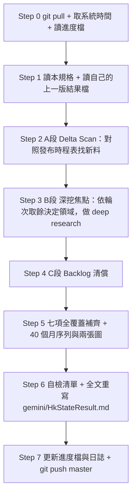

/boost /goal
# Routines — 中國房地產景氣 × 香港 REIT 進場時點判斷（Gemini 版）

> **一句話任務**：每一輪都要回答「**中國房地產走到哪一階段？香港 REIT 現在該買、該等、還是該避開？**」，並把完整結果**全文重寫**到 `gemini/HkStateResult.md`。
>
> **唯一輸出檔**：`gemini/HkStateResult.md`（Gemini 專屬，**每輪全文覆寫，不可往後追加**）。
>
> **執行模式**：`/boost /goal` 全自動輪詢（Polling）。**嚴禁中途停下向使用者提問**，必須自主走完 Step 0 → Step 7。
>
> **本文件唯一排序原則**：**越會改變買賣決策的資訊，放越上面。** §4～§8 是決策內容，§9～§14 是流程與規則，附錄是隨時回查的工具區。

---

## 0. 三分鐘導讀

### 0.1 這份報告最終只回答三句話

> **Q1（現在在哪）**：中國房地產**衰退從哪一個月開始**、目前走到**復甦四階段的第幾階段**？
> → 必須是**明確的月份 ＋ 階段編號 ＋ 五盞訊號燈現況**。寫在**第二章**。
>
> **Q2（什麼時候買）**：復甦（尤其是**租金落底**）預估在哪一個**季度**？機率多少？
> → 必須給**季度級時間點 ＋ 機率 ＋ 還缺哪一盞燈**。**不准只寫「持續觀察」**。寫在**第二章**。
>
> **Q3（買什麼／買不買）**：以現價買進香港 REIT，划不划算？哪幾檔先受惠、哪幾檔是價值陷阱？
> → 必須是**每檔標的一句話結論：🟢 可買／🟡 等訊號／🔴 避開**，並附**每單位（Per Unit）數字**。寫在**第三章**。

### 0.2 一句話心法（初級分析師必背）

> **中國房價止跌 ≠ 香港 REIT 可以買。**
> 中間隔著一條傳導鏈：`住宅價格止跌 → 財富效應 → 消費／企業擴張 → 商辦與商場租金止跌 → NPI 回升 → DPU 回升`，
> 每一段都有 **2～4 個季度**的時間差，整條走完常常是 **1～2 年**。
> 所以看到「一線房價環比轉正」就喊 REIT 要漲，是本報告最容易犯、也最貴的錯。

### 0.3 使用者指定的七個必備項目 → 對應章節（**每一輪都必須全部出現，缺一即為交付失敗**）

| # | 使用者要求的項目 | 產出章節 | 每輪最低要求 |
|:--:|---|:--:|---|
| **1** | 分析中國房地產 | **§4 → 結果檔第四章** | 銷售端／開發端分開講，含官方最新月度數據 |
| **2** | 中國房地產**何時開始衰退**、**何時開始復甦** | **§5 → 結果檔第二章** | 衰退起點（月份＋事件）＋ 復甦階段判定 ＋ 季度級時點 ＋ 機率 |
| **3** | 對香港 REIT 的影響 | **§6 → 結果檔第三章** | 每檔標的 🟢/🟡/🔴 結論 ＋ 每單位數字 ＋ 傳導時間差 |
| **4** | 中國房地產指標 | **§7 → 結果檔第五章** | 指標總表（最新值／環比／同比／發布日／判讀） |
| **5** | 一線城市房價**過去 40 個月**趨勢＋**趨勢圖** | **§8 → 結果檔第六章** | 40 列資料表 ＋ mermaid 折線圖 ＋ ASCII 備援圖 |
| **6** | 本輪來不及分析、下一輪要分析的項目 | **§9 → 結果檔第八章** | Backlog 表（含未完成原因、輪次計數、優先級） |
| **7** | 其它重要項目 | **§10 → 結果檔第七章** | 輿情、政策防偽、匯率利率、跨境稅、黑天鵝 |

### 0.4 檔案與路徑

| 用途 | 路徑（repo 相對；本機鏡像為 `d:\FinancialReport\`） |
|---|---|
| **本規格檔（每輪執行前必讀）** | `gemini/gemini_HkState.md` |
| **唯一輸出檔** | `gemini/HkStateResult.md` |
| **輪詢進度檔** | `Log/gemini_HkState_Summary.md` |
| **每輪日誌** | `Log/gemini_HkState_{yyyyMMdd}.md` |
| 本機 REIT 財報資料夾 | `01426春泉Reit/`、`87001匯賢Reit/`（**先讀本機再上網**） |
| 強制遵守的總規則 | `AGENTS.md`（每股化、利多風險並重、繁中、資料來源查證） |

- **讀者設定**：**入行 1～2 年的初級股票分析師**。專有名詞第一次出現要附英文＋一句白話；能用表格就不要寫長篇文章。
- **標的範圍**：只做**個別 REIT**，**不做 REIT ETF**（`AGENTS.md` REIT 分析規則）。

---

## 1. 不可違反規則（Invariants）

| # | 規則 | 違反後果 |
|:-:|:-----|:---------|
| 1 | **檔案隔離（最高優先）**：只准讀寫 `gemini/HkStateResult.md`。**嚴禁讀取、參考、引用、複製、寫入或修改根目錄 `HkStateResult.md`**（Claude 專用，見 §2） | 污染 Claude 版本 ＝ 任務失敗 |
| 2 | **全文重寫**：每輪最後一個動作是**整份重寫**輸出檔，不是往後追加補丁 | 流水帳堆疊 ＝ 任務失敗 |
| 3 | **零阻塞**：遇到任何錯誤（逾時、被擋、API 額度用盡）→ 記錄後繼續，不可停下等人 | 停下 ＝ 任務失敗 |
| 4 | **防幻覺**：所有數據必須有來源＋發布日；**嚴禁用訓練資料捏造**。查不到就寫 `N/A` 並說明原因 | 捏造 ＝ 任務失敗 |
| 5 | **七項全覆蓋**：§0.3 的七個項目每輪都要有；本輪沒新料也要寫「無新數據，維持上輪值」 | 缺項 ＝ 交付失敗 |
| 6 | **每單位化 ⭐**：只要出現絕對金額（億元），**強制**同步換算 `÷ 最新在外流通單位數`，寫成 `HK$X.XXXX/單位` | 「減值 9 億」沒感覺，「每單位 −HK$0.14」才有感 |
| 7 | **口徑必須標註 ⭐**：房價指數、空置率、房價所得比都有多種口徑。**同一張表只能用同一口徑**；跨口徑只能比「變化幅度」，不可比「絕對值」 | 數字可以差一倍，結論整個反過來 |
| 8 | **禁用全國均值代表一線**：北京、上海、廣州、深圳**必須逐城拆開** | 用全國 −3% 推論北京 CBD，結論必錯 |
| 9 | **銷售端 vs 開發端分開講**：兩端經常方向相反（銷售磨底、開發續探） | 混在一起講必然誤導 |
| 10 | **利多風險並重**：每一章都要同時列 🟢 利多 與 🔴 風險，**各至少 3 點且要有數字** | 只講故事不講風險 |
| 11 | **透明度標記**：資料逾 6 個月標 `(舊)`；自行推估標 `(估)`；查無標 `N/A`＋原因；機構改口標 🔧 | 把估算值寫成官方數據 |
| 12 | **幣別**：中國標 **RMB**、香港標 **HKD**；換算須附 `HKD/RMB` 匯率與**取價日** | 寫「賺了 9 億」不寫幣別等於沒寫 |
| 13 | **繁體中文**輸出，第一行為**真實系統時間戳**（指令實取，禁止憑印象） | — |
| 14 | **本地優先**：REIT 財報直接讀本機公司資料夾，**不從 GitHub 線上倉庫重新下載** | 浪費輪次預算 |

### 1.1 資料來源優先序（衝突時一律以左為準）

> **官方**（NBS 國家統計局／人行 PBOC／住建部／香港差餉物業估價署 RVD／HKMA／HKEXnews）
> ＞ **國際投行**（Goldman Sachs／Morgan Stanley／UBS／Fitch／S&P／Moody's）
> ＞ **專業機構**（中指研究院／貝殼研究院／高力 Colliers／JLL／戴德梁行／中原地產／Demographia）
> ＞ **主流媒體**（Reuters／Bloomberg／新華社）
> ＞ **論壇輿情**（只能當情緒觀察，**不可當數據來源**）

**🔴 二手轉載鐵律**：搜尋引擎摘要（snippet）與自媒體轉載**不可直接採信**。同一事件若在不同轉載中出現**日期或數字互相矛盾**，一律判定為內容農場（content farm）產物，標 `⚠️ 未經證實（不可採信）`，並記入 Backlog 待官方一手來源出現再處理。

---

## 2. 檔案隔離規則（File Isolation · 規則 1 的執行細則）

> **背景**：同一個題目由 Claude 與 Gemini 各自獨立產出一份報告，用**路徑**區分：
>
> | 檔案 | 擁有者 | 本排程的權限 |
> |:-----|:-------|:-------------|
> | `HkStateResult.md`（**repo 根目錄**） | **Claude 專用** | ❌ 不可讀、不可寫、不可參考、不可引用 |
> | `Prompt/hourAnalysis.hkreit.md` | Claude 的任務單 | ❌ 不可當本排程的指令來源 |
> | `AnalysisResult/ChinaStateAnalysisResult.md` | Claude 專用 | ❌ 不可讀、不可引用 |
> | `gemini/HkStateResult.md` | **Gemini（本排程）** | ✅ 唯一可讀可寫的輸出目標 |
>
> **理由**：兩份報告必須各自獨立。Gemini 一旦讀了 Claude 的版本，產出就變成「抄寫／混血」，失去交叉比對兩個模型判斷的意義。

### 2.1 禁止清單（Never · 看到就停手）

| # | 禁止行為 |
|:-:|:---------|
| 1 | 開啟任何路徑為根目錄 `HkStateResult.md` 或 `AnalysisResult/ChinaStateAnalysisResult.md` 的檔案 |
| 2 | `grep` / `find` 命中上述檔案時去讀它的內容（命中也要**主動跳過**） |
| 3 | 把上述檔案當成資料來源、佐證、對照基準或「上一版」 |
| 4 | 寫入或修改上述檔案 |
| 5 | 在輸出檔或日誌中出現上述檔名（會誤導讀者以為參考過） |
| 6 | 把 `Prompt/hourAnalysis.hkreit.md` 的 `OUTPUT_FILENAME: HkStateResult.md` 當成本排程的輸出路徑（**該值一律忽略**） |

> **若 Gemini 版與 Claude 版數字不一致怎麼辦？** 不處理、不比對、不記錄。差異由使用者自行判讀。

---

## 3. 輪詢引擎（Polling Engine）— 本規格的核心設計

> 這份報告會**不斷被重複執行**。兩次執行之間可能只隔幾小時，**大多數月度數據根本還沒更新**。
> 如果每輪都把同樣的搜尋重跑一次，只會產出「換句話說的同一份報告」，浪費預算又製造假更新。
> **本章就是為了讓每一輪都真的產生增量價值。**

### 3.1 每輪的三段預算（依序執行，不可跳過第一段）

| 段 | 名稱 | 占比 | 做什麼 |
|:--:|---|:--:|---|
| **A** | **增量掃描（Delta Scan）** | 20% | 依 §3.2 發布時程表，逐項確認「**上輪之後有沒有新數據／新事件**」。有新料 → 列入本輪必更新清單；無新料 → 標 `＝ 無變化`，**不重跑搜尋** |
| **B** | **深挖焦點（Rotating Deep Dive）** | 50% | 依 §3.3 輪替焦點，對本輪指定的領域做 deep research（可平行多路搜尋） |
| **C** | **Backlog 清償** | 30% | 依 §3.4 處理上輪遺留的待辦項目，優先清償 carry-over 次數最多的 |

> **原則**：A 段確認「世界變了沒」，B 段挖「這一輪要挖深的地方」，C 段還「上一輪欠的債」。
> 三段做完就收工——**寧可少寫一章的廢話，不可漏掉一項 Backlog**。

### 3.2 資料發布時程表（Delta Scan 的檢查清單）

| 指標／事件 | 發布單位 | 慣例發布時點 | 上輪值 | 本輪有無新值 |
|---|---|---|---|:--:|
| **70 城房價指數**（新建＋二手） | NBS 國家統計局 | 每月**約 15～17 日** | 填 | ✅/＝ |
| 房地產開發投資、商品房銷售面積／金額 | NBS | 每月**約 15～17 日**（與上同批） | 填 | ✅/＝ |
| **百城價格指數**（新房／二手） | 中指研究院 | 每月**月初**發布上月 | 填 | ✅/＝ |
| **50 城住宅租金**（復甦第 5 盞燈） | 中指研究院 | 每月月初 | 填 | ✅/＝ |
| 一線二手房**網簽成交套數** | 各市房管局／中原、貝殼 | 每月初～中旬 | 填 | ✅/＝ |
| 金融統計數據（居民中長期貸款） | 人行 PBOC | 每月中旬；季報約次月底 | 填 | ✅/＝ |
| 百強房企銷售榜 | 克而瑞 CRIC | 每月**月底最後一日** | 填 | ✅/＝ |
| **中原城市領先指數 CCL** | 中原地產 | **每週五**（領先指標） | 填 | ✅/＝ |
| 私人住宅售價／租金指數 | 香港 RVD 差餉物業估價署 | **每月月底** | 填 | ✅/＝ |
| 基本利率／HIBOR | HKMA／香港銀行公會 | 隨 FOMC 及每日 | 填 | ✅/＝ |
| **FOMC 利率決議** | Fed | 依會議行事曆（一年 8 次） | 填 | ✅/＝ |
| REIT 年報／中期業績 | HKEXnews | 年報約 3～4 月；中報約 8 月 | 填 | ✅/＝ |
| 機構預測改口 | 投行研究報告 | 不定期 | 填 | ✅/＝ |

> **🔑 Delta Scan 判斷法**：先算「距上輪執行時間」。若不足 24 小時，除 CCL（週更）與突發事件外，**幾乎必然全部 `＝ 無變化`**——此時應把預算全部倒進 B 段與 C 段，而不是重跑一次搜尋硬湊「本輪更新」。
> **🔴 嚴禁**：把「上輪已經有的數據」重新包裝成「本輪新發現」。同一個數字連續兩輪出現時，必須標 `＝（自 YYYY-MM-DD 起未更新）`。

### 3.3 輪替深挖焦點（Rotating Deep Dive）

用進度檔的 `round_no` 取餘數決定本輪深挖領域。**其餘章節仍需輕量更新（照 Delta Scan 結果），只是不做 deep research。**

| `round_no % 4` | 本輪深挖焦點 | 具體要挖到什麼 |
|:--:|---|---|
| **0** | **中國總體 × 房企債務** | NBS 銷售／開發端最新月度、萬科／碧桂園／恒大處置進度、政策一手公告核實 |
| **1** | **一線城市 × 40 個月房價序列** | §8 的 40 個月資料表逐月覆核與延伸、商辦空置率與續租租金調整率逐城更新 |
| **2** | **香港 REIT 財務與估值** | 每檔標的最新財報：借貸比率、NPI、DPU、續租調整率、到期年限、每單位價值區間 vs 現價 |
| **3** | **香港總體 × 輿情 × 跨境變數** | CCL／RVD／HIBOR／Fed 路徑、多平台輿情蒐集與真偽過濾、預扣稅與資金匯出 |

### 3.4 Backlog 隊列與 carry-over 規則（對應使用者要求第 6 項）

每一輪結束時，**沒做完的事情一律進 Backlog**，格式如下（此表原封不動寫進結果檔第八章）：

| # | 待辦項目 | 為何本輪沒做完 | 已延宕輪次 | 優先級 | 預計何時可得 |
|:-:|---|---|:--:|:--:|---|
| 1 | 例：NBS 70 城 8 月值 | 尚未發布（約 9/15） | 0 | P0 | 2026-09-15 |

- **未完成原因只准四種**：`① 資料尚未發布` `② 來源被擋／查證失敗` `③ 本輪預算不足` `④ 需要更多期數才能判斷趨勢`。**禁止寫「持續觀察」這種沒有資訊量的理由。**
- **優先級**：`P0`＝會直接改變買賣結論；`P1`＝會改變信心度；`P2`＝背景補充。
- **🔴 carry-over 三振條款**：同一項目**延宕滿 3 輪**，下一輪**必須**二選一——(a) 用盡 C 段預算把它做掉；(b) 正式結案，寫明「為何這項永遠拿不到」並從 Backlog 移除。**不准無限期掛著。**
- **✅ 已清償項目**必須在結果檔第八章下半保留一張「本輪清償紀錄」表，讓讀者看得出上輪的債還了沒。

### 3.5 沒有新數據的那一輪怎麼寫（最常見的情境）

1. 執行摘要表的「較上輪變化」整欄寫 `＝ 持平`，**不可為了看起來有更新而改動結論措辭**。
2. 把 B 段（深挖焦點）與 C 段（Backlog）的成果當成本輪的主要增量。
3. 在結果檔第九章明寫一句：`本輪距上輪僅 X 小時，月度數據未更新；本輪增量來自【深挖焦點 X】與【清償 Backlog N 項】。`
4. **仍然要全文重寫**（規則 2）——重寫的價值在於把上一輪寫得不清楚的地方改到初級分析師讀得懂。

---

## 4. 【項目 1】中國房地產分析（→ 結果檔第四章）

**要交出的判斷**：未來三年（含當年）是「**L 型底部橫盤**」、「**緩步修復**」還是「**二次下探**」？並給**機率**與**信心度**。

### 4.1 必查清單

1. **官方月度數據（NBS）**——**銷售端與開發端必須分開列**：

   | 面向 | 指標 | 看什麼 |
   |---|---|---|
   | **銷售端** | 商品房銷售面積／銷售金額 年增率（近 12 個月） | 降幅是**收窄**還是**擴大**（收窄＝築底中） |
   | **開發端** | 房地產開發投資、新開工面積、到位資金 年增率 | 到位資金**轉正**才代表建商活過來 |
   | 庫存 | 商品房待售面積、去化週期（存銷比） | 去化週期 > 18 個月＝嚴重供過於求 |

2. **機構預測區間**：Fitch、UBS、Goldman Sachs、Morgan Stanley、S&P、Reuters Poll 的年度銷售金額與房價預測，**列表並註明發布日**。
   > ⚠️ **強制查核**：機構會**改口**，同一家的看空／看多可能只隔幾個月。**必須查到最新一份**，有改口就標 🔧 並寫明改口內容與日期。**引用過期預測是本報告最容易犯的錯。**
3. **房企債務（信用風險傳導）**：萬科（`000002.SZ`／`02202.HK`）公開債展期與兌付、國資支援金額、最新盈警；碧桂園（`02007.HK`）、恒大（`03333.HK`）重組／清算進度。
   > 🔑 **「零違約」與「巨額虧損」可以同時成立**——展期解決的是**流動性**，不是**獲利能力**。還要看輸血方自己有沒有在流血。
4. **政策**：收儲（地方國企收購存量商品房轉保障房）、白名單融資、限購與信貸鬆綁。**每一條都要找到一手官方公告**（gov.cn／住建部／人行），查無者標 `⚠️ 未經官方證實（不可採信）`。
5. **結構性因素**：人口與新生兒數、城鎮化率、剛需 vs 改善型需求比重變化。

### 4.2 輸出格式

三年逐年情境表（**樂觀／基準／保守，各給機率與觸發條件**）＋ 🟢 利多 Top 3 ／ 🔴 風險 Top 3（每點要有數字）。

---

## 5. 【項目 2】何時開始衰退、何時開始復甦（→ 結果檔第二章 · **全報告最重要**）

### 5.1 衰退時間軸（**歷史事實，僅在出現新證據時修訂**）

每輪必須寫出一張時間軸表，並算出「**距高點已經幾年幾個月**」。骨架如下（數值每輪覆核）：

| 時點 | 事件 | 為什麼是轉折 |
|---|---|---|
| 2020-08 | **三道紅線**（Three Red Lines）出台 | 政策性收緊房企融資＝**供給端衰退的起點** |
| 2021-07 前後 | **全國房價高點** | NBS 70 城指數轉折點；本報告的**衰退起算月** |
| 2021-09 | 恒大流動性危機公開化 | 信用風險擴散、預售信心崩解 |
| 2022 全年 | 停貸風波、銷售面積大幅萎縮 | **需求端衰退確立** |
| 2023～ | 政策放鬆（認房不認貸、限購鬆綁等）但量價續探 | **政策底 ≠ 市場底** |
| 最新 | 由本輪數據判定 | — |

> **必寫兩個數字**：① **衰退起算月**（以 NBS 70 城一線二手指數的高點月為準，非新聞口語）；② **已衰退幾個月**（自起算月至最新可得月）。
> **歷史錨**：全球過去 22 次房市危機，高點到落底平均約 **6 年**。**但要提醒**：中國有「人口負成長 ＋ 地方財政依賴土地」兩個特殊性，**歷史平均可能偏樂觀**。

### 5.2 復甦四階段定義（每輪必須明確講出「現在在第幾階段」）

| 階段 | 名稱 | 白話定義 | 判斷指標（要同時成立） |
|:--:|---|---|---|
| **①** | **量的底** | 賣得掉了，但還在降價賣 | 一線二手**成交套數**同比連 **3** 個月正成長 |
| **②** | **價的底** | 不用再降價了 | 一線二手**價格環比**連 **6** 個月 ≥ 0，且同比跌幅收斂至 −1% 內 |
| **③** | **開發端的底** | 建商敢重新拿地、開工了 | 開發投資年增率降幅**連 2 季收窄**、到位資金年增率**轉正**、土地出讓金止跌 |
| **④** | **租金的底** | 房東能漲租了 | 50 城住宅租金**同比轉正**、甲級商辦**續租租金調整率（Rental Reversion）由負轉正** |

> 🔑 **對香港 REIT 而言，只有階段 ④ 才算真復甦。** 階段 ①② 是住宅市場的事，**跟 REIT 的租金收入沒有直接關係**，中間還隔 2～4 個季度傳導。

### 5.3 復甦五盞訊號燈（每輪逐盞更新 🟢／🟡／🔴）

| # | 訊號燈 | 為什麼是必要條件 | 轉綠門檻 | 資料來源 |
|:--:|---|---|---|---|
| **1** | 房價所得比（PIR）回到可負擔區間 | 買不起就不可能有需求 | 一線 < **20** 倍、香港 < **12** 倍 | Demographia（香港）／中指、諸葛（一線，須標口徑） |
| **2** | **量先於價**：一線二手成交量 | 量領先價 1～2 季 | 同比連 **3** 個月正成長 | 各市房管局網簽 |
| **3** | 價格站穩：一線二手環比 | 確認買方不再殺價 | 環比連 **6** 個月 ≥ 0 | NBS 70 城 |
| **4** | 開發端資金回流 | 建商沒錢＝供給端無法正常化 | 到位資金年增率**轉正**、國內貸款降幅收斂至 −10% 內 | NBS 開發經營月報 |
| **5** | **租金止跌（REIT 專屬）** | REIT 的收入端。**房價可以靠政策撐，租金撐不了** | 50 城租金**同比轉正**；甲辦續租調整率 > 0 | 中指研究院、REIT 財報 |

**強制輸出格式**（本章必須有這一行）：
`目前 X 綠 / Y 黃 / Z 紅 → 判定處於階段 ②｜REIT 受惠時點推估 20XX 年 HX｜信心度：中｜還缺第 4、5 盞`

### 5.4 機構復甦時點預測（必查，每輪更新並註明發布日）

| 機構 | 發布日 | 全國觸底時點 | 一線分城時點 | 較上一份是否改口 🔧 |
|---|---|---|---|---|
| 高盛（Goldman Sachs） | | | | |
| 摩根士丹利（Morgan Stanley） | | | | |
| 惠譽（Fitch Ratings） | | | | |
| 瑞銀（UBS） | | | | |
| Reuters 分析師季度調查 | | | | |

### 5.5 🟢 支持提早復甦 Top 3 ／ 🔴 拖延復甦 Top 3

必列，各至少 3 點，**每點要有數字**。

---

## 6. 【項目 3】對香港 REIT 的影響（→ 結果檔第三章 · **買賣結論寫在這裡**）

### 6.1 標的池（**只做個別 REIT，不做 REIT ETF**）

| 分組 | 代號 | 名稱 | 中國曝險 | 本報告定位 |
|---|---|---|---|---|
| **A 組：純／高中國曝險** | `87001` | 匯賢產業信託（Hui Xian REIT） | 100%（北京東方廣場、重慶、瀋陽） | **主標的**，RMB 計價（`AGENTS.md` 指定唯一保留 RMB 者） |
| | `01426` | 春泉產業信託（Spring REIT） | 高（北京華貿中心、惠州） | **主標的** |
| | `00405` | 越秀房產信託基金（Yuexiu REIT） | 高（廣州國金中心等） | 主標的 |
| | `01503` | 招商局商業房託（CMC REIT） | 高（深圳蛇口） | 主標的 |
| **B 組：香港本地為主（對照組）** | `00823` | 領展房產基金（Link REIT） | 部分（內地商場／物流） | 對照：中港雙暴露 |
| | `02778` | 冠君產業信託（Champion REIT） | 低 | 對照：純港利率敏感度 |
| | `00435` | 陽光房地產基金（Sunlight REIT） | 低 | 對照：純港 |

> **A 組看的是「中國房地產何時復甦」；B 組看的是「香港利率何時下來」。兩組的進場時點不同，必須分開結論。**

### 6.2 傳導路徑與時間差（每輪必畫、必解釋）

```text
中國住宅價格轉折 ──(2~4 季)──► 財富效應／企業擴張 ──(2~4 季)──► 商辦與商場租金止跌
        │                                                              │
        └──► 開發商信用改善 ──► 收儲與土地財政 ──► 地方消費             ▼
                                                              NPI 回升 ──(1~2 季)──► 估值報告回升
                                                                 │
                                                                 ▼
                                                              DPU 回升 ──► 股價
```

- **估值師每半年才做一次估值** → **現在看到的 REIT 減值，反映的是一年前的租金**；最新的供給潮**還沒進到帳上**。
- **所以本報告的核心結論不是「中國房價止跌了嗎」，而是「租金落底了嗎」。**

### 6.3 每檔標的必算數字（**全部每單位化**）

| 欄位 | 說明 | 為什麼要看 |
|---|---|---|
| 現價 / 52 週區間 | HKD（`87001` 用 RMB） | 對比基準 |
| **DPU（每單位分派）** 與 **殖利率** | 最新年化 | 8%～12% 高殖利率**必須先問**：是租金，還是**退還本金（Return of Capital）**？ |
| **NPI（物業收入淨額）年增率** | 每單位化 | REIT 的本業收入端 |
| **續租租金調整率（Rental Reversion）** | % | **比空置率更痛**：目前產業普遍 −5%～−20%，還要送 3～6 個月免租期 |
| 出租率／空置率 | % | 議價能力 |
| **借貸比率（Gearing / LTV）** | % ＋ 距**香港法定 50% 上限**的緩衝（pp） | 估值被調降 → 分母縮小 → LTV **被動飆升** |
| **公允價值變動** | 每單位金額 | 「減值 9 億」沒感覺，「每單位 −0.14」才有感 |
| **P/NAV（股價淨值比）** | 倍 | ⚠️ 中國物業 REIT 的 NAV 有「**剛性下折**」（土地使用權有到期日），**P/NAV 打二折可能是假便宜** |
| **土地使用權／合營期到期日** | 每一項物業，非只主力資產 | **最早到期的那一筆才是第一顆地雷** |
| 匯率與利率剪刀差 | RMB 收租 vs HKD/USD 負債占比、有效融資成本、真實避險覆蓋率 | 兩頭夾殺 |

> **LTV 被動破表的三種解法，每一種都痛**：① 扣留／停止配息還債 ② 折價供股（永久稀釋）③ 賤賣核心物業（永久失去現金流）。

### 6.4 香港本地驅動變數（B 組專屬，A 組也受影響）

| 變數 | 追蹤什麼 | 對 REIT 的意義 |
|---|---|---|
| **Fed 利率路徑** | FOMC 決議、點陣圖、市場隱含機率（CME FedWatch／LSEG） | 港元聯繫匯率下，香港利率**跟著美國走** |
| **HIBOR ／ HKMA 基本利率** | 1M/3M HIBOR、基本利率 | 直接決定 REIT 的**融資成本**與**估值折現率** |
| **中原城市領先指數（CCL）** | 每週五公布（**領先指標**） | 香港住宅景氣的最快溫度計 |
| **RVD 私人住宅售價／租金指數** | 每月月底（**確認指標**） | 確認 CCL 的走勢是否傳導到月度成交 |
| 人才引進（高才通／新資本投資者入境計劃 CIES） | 核准人數、置業比例 | 住宅需求端增量 |
| 北部都會區與土地供應 | 招標結果、賣地表 | 中長期供給壓力 |

### 6.5 本章強制輸出：每檔標的一句話結論

| 代號 | 名稱 | 結論 | 進場條件（要看到什麼才動手） | 每單位關鍵數字 |
|---|---|:--:|---|---|
| 87001 | 匯賢產業信託 | 🟢/🟡/🔴 | 例：第 5 盞燈轉綠且續租調整率 > −5% | DPU RMB X.XXX｜LTV XX.X%｜到期 20XX |

- 🟢 **可買**＝進場條件已成立；🟡 **等訊號**＝條件明確但未成立（**要寫出還缺什麼**）；🔴 **避開**＝結構性問題（如終值歸零）壓過殖利率。
- **必附一句話理由**，且理由必須引用本報告內的數字。

---

## 7. 【項目 4】中國房地產指標（→ 結果檔第五章 · 房市體溫計）

### 7.1 固定要做的總表（**每輪重填，不可留空白列**）

| 指標 | 最新值 | 環比 MoM | 同比 YoY | 上期值 | 發布日 | 一句話判讀 |
|---|---|---|---|---|---|---|
| 百城**新建**住宅均價（RMB/㎡） | | | | | | |
| 百城**二手**住宅均價（RMB/㎡） | | | | | | |
| 百城新房 漲／平／跌 城市家數 | | — | — | | | |
| 百城二手 漲／跌 城市家數 | | — | — | | | |
| **50 城住宅平均租金**（RMB/㎡/月） | | | | | | |
| 商品房銷售面積 年增率 | — | — | | | | |
| 商品房銷售金額 年增率 | — | — | | | | |
| 房地產開發投資 年增率 | — | — | | | | |
| 房企**到位資金** 年增率 | — | — | | | | |
| 商品房待售面積／去化週期 | | | | | | |
| 居民中長期貸款（人行） | | | | | | |
| 一線甲級寫字樓空置率（逐城） | | | | | | |
| 一線甲級寫字樓平均租金（RMB/㎡/月） | | | | | | |

> 🔧 **本規格不列「國房景氣指數」**：NBS 自 2025 年起已不在月度新聞稿列示，連續多輪查證皆為 `N/A`，保留只會製造假缺口。**若 NBS 恢復發布，再議是否納入。**

### 7.2 判讀原則（初級分析師最容易搞混的地方，**每輪都要重講**）

- **新房漲、二手跌 ≠ 市場回暖**：新房均價常因「高總價核心區案量占比上升（結構效應）」被拉高；**二手跌才是真實需求在退。兩者背離時以二手為準。**
- **看「漲跌城市家數」比看均價重要**：`8:92` 這種懸殊比代表**全國性下行**，只有極少數核心城市例外。
- **環比看轉折、同比看趨勢**：二手「環比由負轉正、同比仍為負」＝「**跌幅收窄、正在築底**」，**不是「已經反轉」**。
- **租金同比為負是最壞的訊號**：租金是不動產的本業收入，**房價可以靠政策撐，租金撐不了**。這是第 5 盞燈。
- **口徑衝突處理**：NBS 70 城（網簽備案、核心城區、同質可比）與中指百城（掛牌＋成交、涵蓋外圍、均價）常常方向相反。**兩個都要列**，並說明「核心區在漲、外圍在跌」的真相，**不可只挑對自己論點有利的那一個**。

---

## 8. 【項目 5】一線城市房價過去 **40 個月**趨勢 ＋ 趨勢圖（→ 結果檔第六章）

> 這一章是本報告**唯一的長序列**，目的是讓讀者一眼看出「**跌了多久、跌到哪、有沒有轉彎**」。
> **40 個月的窗口不是隨便訂的**：它剛好涵蓋 3 年多，足以蓋掉單月雜訊與季節性，又不會長到把 2021 年高點前的舊格局混進來。

### 8.1 資料規格（**每輪必須遵守，否則圖會失真**）

| 項目 | 規範 |
|---|---|
| **城市** | 北京、上海、廣州、深圳（**逐城，禁止用一線平均取代**） |
| **主口徑（唯一畫圖依據）** | **NBS 70 城「二手住宅」價格指數**——二手才反映真實供需，新房受建商促銷與結構效應干擾 |
| **輔口徑（並列於資料表，不畫在主圖）** | NBS 70 城「新建商品住宅」；中指／貝殼的絕對價格（RMB/㎡） |
| **窗口** | 最新可得月份 `M` 起往前推 40 個月（含 `M`），即 `M-39 ~ M`。**每輪滾動，不可固定寫死** |
| **指數化（Rebase）** | NBS 只發布環比／同比，**沒有可跨年直接比較的絕對指數**。故須自行串接：`Index(M-39) = 100`，`Index(t) = Index(t-1) × (1 + MoM_t)`。**串接結果標 `(估)`** |
| **基期陷阱 🔴** | NBS 自 2026 年起改以 **2025 年為基期**。**跨基期不可直接接續官方指數**，必須一律用「環比串接」自建序列，並在圖下註明 |
| **高點對照** | 另列一行「**自 2021 年高點以來累計跌幅**」——40 個月窗口的起點已在高點之後，只看窗口會**低估**整體跌幅 |
| **缺值處理** | 該月查無 → 填 `N/A`，**串接時以 `0%` 代入並標記該月為推估**，圖上該點以虛線表示 |

### 8.2 必做表格一：40 個月原始資料表（**完整 40 列，不可只寫近 12 個月**）

| 月份 | 北京 MoM | 上海 MoM | 廣州 MoM | 深圳 MoM | 北京 Idx | 上海 Idx | 廣州 Idx | 深圳 Idx |
|---|---:|---:|---:|---:|---:|---:|---:|---:|
| YYYY-MM（＝基期） | — | — | — | — | 100.0 | 100.0 | 100.0 | 100.0 |
| …（共 40 列） | | | | | | | | |

**必做表格二：摘要表**

| 城市 | 40 個月累計漲跌 | 自 2021 高點累計跌幅 | 近 6 個月環比均值 | 最近一個月環比 | 連續下跌月數 | 一句話判讀 |
|---|---:|---:|---:|---:|:--:|---|

### 8.3 必做圖一：mermaid 折線圖（主圖）

**固定語法骨架**（數字每輪替換；**系列宣告順序固定為 北京→上海→廣州→深圳**，因 `xychart-beta` 無圖例，順序就是圖例）：

````markdown
```mermaid
xychart-beta
    title "中國一線城市二手住宅價格指數（近 40 個月，YYYY-MM = 100）"
    x-axis [YYYY-MM, ..., YYYY-MM]
    y-axis "指數（起點 = 100）" 70 --> 105
    line [100.0, 99.7, ...]
    line [100.0, 99.8, ...]
    line [100.0, 99.5, ...]
    line [100.0, 99.2, ...]
```
````

| 線條順序 | 城市 | 說明 |
|:--:|---|---|
| 第 1 條 | 北京 | 匯賢東方廣場、春泉華貿中心所在，**對 REIT 最關鍵** |
| 第 2 條 | 上海 | — |
| 第 3 條 | 廣州 | 越秀房託所在 |
| 第 4 條 | 深圳 | 招商局商業房託所在；港深連動的觀察點 |

> **x-axis 標籤處理**：40 個標籤會擠在一起，**每 3 個月標一次**（其餘以 `""` 佔位），首月與末月必標。
> **y-axis 範圍**：取四城最小值向下取整 −2、最大值向上取整 +2，**不可固定寫 0→100**（會把曲線壓成一條平線，圖就白畫了）。

### 8.4 必做圖二：ASCII 備援圖（**強制，不可省略**）

mermaid 在部分閱讀器（純文字檢視、部分 Markdown 引擎）不會渲染，因此**必須同時提供**一張純文字圖。格式：每城一列，取 40 個月中**每 2 個月一格**共 20 格，以字元表示相對水位。

```text
圖例：█ = 高於起點  ▓ = 起點 −0~3%  ▒ = −3~6%  ░ = 低於起點 6% 以上
北京 ███▓▓▓▓▒▒▒▒▒▒░░░░░░░  40M: -12.3%  最近一月 MoM: -0.35%
上海 ███▓▓▓▓▓▒▒▒▒▒▒▒░░░░░  40M: -10.1%  最近一月 MoM: -0.21%
廣州 ██▓▓▒▒▒▒▒░░░░░░░░░░░  40M: -18.7%  最近一月 MoM: -0.52%
深圳 ██▓▓▒▒▒▒▒▒░░░░░░░░░░  40M: -17.4%  最近一月 MoM: -0.44%
```

### 8.5 判讀（必寫，每點要有數字）

1. **跌幅排序**與**分化程度**：四城差距擴大還是收斂？
2. **有沒有轉彎**：近 6 個月環比均值是否收斂？**連續下跌月數**是否中斷？
3. **核心區 vs 外圍**：NBS（核心區為主）與中指百城（含外圍）背離時，說明真相。
4. **對 REIT 的意義**：北京走勢直接對應春泉／匯賢，廣州對應越秀，深圳對應招商局商業房託——**逐檔連結，不可只講總體**。
5. 🟢 利多 ／ 🔴 風險 各至少 3 點。

---

## 9. 【項目 6】本輪來不及分析 ／ 下一輪要分析（→ 結果檔第八章）

依 §3.4 的 Backlog 表原封不動輸出，**加上兩張補充表**：

**表 A — 本輪清償紀錄**

| 上輪 Backlog 項目 | 本輪處理結果 | 結論有無改變 |
|---|---|:--:|

**表 B — 下一輪數據發布行事曆（未來 30 天）**

| 預定日期 | 將發布什麼 | 會影響哪一章的結論 | 優先級 |
|---|---|---|:--:|

> **這一章是輪詢制度的靈魂**：讀者靠它知道「下一輪值不值得再跑一次」。**寫得敷衍，整套輪詢就失去意義。**

---

## 10. 【項目 7】其它重要項目（→ 結果檔第七章）

| 子項 | 每輪要做什麼 |
|---|---|
| **社群輿情蒐集** | 平台：雪球、東方財富股吧、富途/moomoo 社區、淘股吧、知乎、小紅書｜香港：LIHKG、香港討論區｜英文：Reddit、Seeking Alpha、X。**輸出表格：平台 / 風向 / 多空 / 可信度評估**。⚠️ 必須分辨「真實市場反饋」與「情緒噪音／假消息」 |
| **本機輿情檔** | 先檢查 `01426春泉Reit/`、`87001匯賢Reit/` 等資料夾內既有的 `{yyyy}_PublicOpinion.md` 與輿情檔，**本地優先** |
| **政策防偽** | 所有「救市大禮包」類傳言，一律回 gov.cn／住建部／人行官網查一手公告。**日期在不同轉載中飄移＝內容農場特徵**，直接標 `⚠️ 未經證實` |
| **匯率與利率** | `HKD/RMB`、`USD/HKD` 取價日；HIBOR 與內地 LPR 的**剪刀差**方向 |
| **跨境資金與稅** | 內地匯往香港的 **10% 預扣稅（Withholding Tax）**、外管局（SAFE）流程時滯、資金留存內地比重 |
| **黑天鵝／灰犀牛** | 房企債務集中到期月份、REIT 再融資到期牆、地方財政、地緣政治 |
| **與上輪結論異動** | 逐項列出「強化／弱化／修正」，**數據修正必須標 🔧** |

---

## 11. 執行流程（Step 0 → Step 7）



**Step 0**：`git pull origin master`（衝突則 `git stash` → pull → `stash pop`；網路失敗重試 3 次 2s/4s/8s，仍失敗則記錄後**繼續**）。取真實系統時間戳。讀 `Log/gemini_HkState_Summary.md` 取 `round_no`、`last_run_time`；不存在則 `round_no = 0`（首輪）。

**Step 1**：讀本規格檔＋讀 `gemini/HkStateResult.md`（**只讀自己的**，見 §2）。列出上輪結論、上輪 Backlog、上輪各數據的發布日。不存在 → 視為首輪，依 §13 骨架全新產出。

**Step 2（A 段）**：依 §3.2 逐列判斷「有沒有新料」。先算距上輪幾小時——不足 24 小時就預期幾乎全 `＝`，**不要硬湊更新**。

**Step 3（B 段）**：依 §3.3 取 `round_no % 4` 決定深挖焦點，可平行多路搜尋。**官方數據一律回官網原始頁核對，禁止只採信媒體摘要。**

**Step 4（C 段）**：依 §3.4 清償 Backlog，優先處理 carry-over 次數最多者；觸發三振條款者**必須**做掉或正式結案。

**Step 5**：補齊 §0.3 七項。REIT 財報**先讀本機資料夾**（零延遲、資料完整），不足再上 HKEXnews／公司 IR。所有金額**每單位化**。

**Step 6**：跑完 §12 自檢清單 → **全文重寫**輸出檔（不是補丁），並以「初級分析師讀得懂」為驗收標準再讀一次。

**Step 7**：更新 `Log/gemini_HkState_Summary.md`（`round_no += 1`）＋寫當輪日誌 → `git add -A` → `git commit` → `git push origin master`（被拒則 `git pull --rebase origin master` 後重推；網路失敗重試 4 次 2s/4s/8s/16s）。
**push 前最後一眼**：`git diff --cached --name-only`，確認**沒有**根目錄 `HkStateResult.md` 或 `AnalysisResult/ChinaStateAnalysisResult.md` 被夾帶進去；若有，`git checkout -- <該檔>` 還原並記入日誌。

### 11.1 錯誤處理（零阻塞 Playbook）

| 狀況 | 處置 |
|---|---|
| 搜尋被擋／逾時 | 換來源或升級工具鏈（內建 → Firecrawl → Bright Data → Apify → Playwright），全失敗就誠實寫「查無」並記 Backlog（原因 ②） |
| MCP 額度用盡 | 記錄後改用原生工具，繼續 |
| NBS 官網打不開 | 改用中指研究院／貝殼作為**輔口徑**，並在該列標 `(輔口徑)`，**不可混進主圖** |
| 某一章整段失敗 | 標 ❌ 記錄原因，**繼續下一章**，不可中斷全輪 |
| 誤讀／誤改 Claude 專用檔 | 立即停手 → `git checkout -- <該檔>` 還原 → 受污染結論**作廢重寫** → 日誌記錄 |
| git pull／push 失敗 | 依 Step 0／Step 7 重試規則，仍失敗則記錄並在摘要標 ❌ |

---

## 12. 自檢清單（Step 6 必跑，依重要性排序）

- [ ] **§0.3 七個項目全部出現**？（缺一即交付失敗）
- [ ] **第二章給出了衰退起算月 ＋ 復甦階段編號 ＋ 季度級時點 ＋ 機率 ＋ 五盞燈現況**？（不准只寫「持續觀察」）
- [ ] **第三章每一檔標的都有 🟢/🟡/🔴 結論、進場條件、每單位數字**？
- [ ] **第六章有完整 40 列資料表 ＋ mermaid 折線圖 ＋ ASCII 備援圖**？y 軸範圍有依實際數據調整，不是 0→100？
- [ ] 指數串接有標 `(估)`、有註明 NBS 2026 改基期的處理方式？
- [ ] 所有絕對金額都換算成**每單位**了？
- [ ] 每一章都有 🟢 利多 與 🔴 風險（各至少 3 點且有數字）？
- [ ] 銷售端與開發端**分開講**了？一線**逐城拆開**了？
- [ ] 每一張表都標了**口徑**？同一張表沒有混用不同口徑？
- [ ] 機構預測都確認過**沒有更新版本**？有改口的標 🔧 了？
- [ ] 未證實傳言都標 `⚠️ 未經官方證實`？
- [ ] 資料逾 6 個月標 `(舊)`、推估標 `(估)`、查無標 `N/A` ＋原因？
- [ ] **Backlog 表有填「為何沒做完」與「已延宕輪次」**？三振條款有執行？
- [ ] 專有名詞第一次出現有附英文＋一句白話？
- [ ] **全文重寫過，而不是在舊文上補丁**？第一行是本輪真實系統時間戳？
- [ ] **隔離稽核**：本輪未讀取、未修改根目錄 `HkStateResult.md` 與 `AnalysisResult/ChinaStateAnalysisResult.md`？

---

## 13. 結果檔骨架（`gemini/HkStateResult.md`）

> **排序原則同本規格：結論最上面，附錄最下面。** 大標題固定 **9 個**（一～九）＋附錄。

```markdown
YYYY/MM/DD HH:mm:ss (UTC+8)

# 中國房地產景氣 × 香港 REIT 進場時點判斷（Gemini 版）

> 第 X 輪｜距上輪 X 小時｜本輪深挖焦點：<A 中國總體／B 一線 40 月／C REIT 財務／D 香港與輿情>
> 基準匯率：HKD/RMB = X.XXXX（取價日 YYYY-MM-DD）
> 讀者：入行 1～2 年的初級股票分析師
> ⚠️ 本檔為輪詢自動化產出，數據以標註來源與日期為準；投資決策前請回官方一手資料核對。

## 一、結論與進場建議（買賣結論寫最前面）＋ 30 秒執行摘要
   1.1 三句話結論（現在在哪／什麼時候買／買什麼）
   1.2 執行摘要表（主題 / 一句話結論 / 信心度 / 較上輪變化 / 依據）
   1.3 免責聲明

## 二、中國房地產何時衰退、何時復甦【項目 2】
   2.1 衰退時間軸與「已衰退幾個月」
   2.2 復甦四階段定義與目前所在階段
   2.3 五盞訊號燈現況表 ＋ 一句話判定
   2.4 機構復甦時點預測彙整（含改口紀錄 🔧）
   2.5 歷史對照與時間錨
   2.6 🟢 支持提早復甦 Top 3 ／ 🔴 拖延復甦 Top 3

## 三、對香港 REIT 的影響【項目 3】
   3.1 每檔標的一句話結論表（🟢 可買／🟡 等訊號／🔴 避開 ＋ 進場條件）
   3.2 傳導路徑與時間差
   3.3 A 組（高中國曝險）逐檔數字，全部每單位化
   3.4 B 組（香港本地）逐檔數字與利率敏感度
   3.5 香港本地驅動變數（Fed／HIBOR／CCL／RVD／人才引進／土地供應）
   3.6 🟢 利多 ／ 🔴 風險

## 四、中國房地產分析【項目 1】
   4.1 總體走勢判斷（銷售端 vs 開發端分開，含機率與信心度）
   4.2 機構預測彙整表（Fitch／Goldman／MS／UBS／Reuters，含發布日）
   4.3 房企債務進度（萬科／碧桂園／恒大）
   4.4 政策與傳言真偽核實
   4.5 🟢 利多 Top 3 ／ 🔴 風險 Top 3

## 五、中國房地產指標【項目 4】
   5.1 指標總表（最新值／環比／同比／發布日／判讀）
   5.2 判讀原則（新房與二手背離、漲跌家數、環比 vs 同比、租金為何是關鍵）
   5.3 對 REIT 的傳導時間差

## 六、一線城市房價近 40 個月趨勢【項目 5】
   6.1 資料規格與口徑說明（含 NBS 改基期的處理）
   6.2 40 個月原始資料表（完整 40 列）
   6.3 摘要表（累計漲跌／自 2021 高點跌幅／近 6 月均值／連跌月數）
   6.4 趨勢圖（mermaid 折線圖 ＋ 線條對照表）
   6.5 ASCII 備援圖
   6.6 判讀 ＋ 🟢 利多 ／ 🔴 風險

## 七、其它重要項目【項目 7】
   7.1 社群輿情整理（平台 / 風向 / 多空 / 可信度）
   7.2 政策防偽核實結果
   7.3 匯率、利率剪刀差與跨境預扣稅
   7.4 黑天鵝／灰犀牛清單
   7.5 與上一輪的結論異動（數據修正標 🔧）

## 八、本輪來不及分析 ／ 下一輪要分析【項目 6】
   8.1 Backlog 表（項目 / 未完成原因 / 已延宕輪次 / 優先級 / 預計何時可得）
   8.2 本輪清償紀錄
   8.3 未來 30 天數據發布行事曆

## 九、本輪執行狀態與資料缺口
   9.1 本輪增量來源說明（Delta Scan 結果／深挖焦點／清償項數）
   9.2 資料取得狀態表（項目 / 取得與否 / 來源 / 發布日 / 缺漏原因）
   9.3 自檢清單結果

## 附錄 A：必看指標速查表
## 附錄 B：白話名詞對照表
```

---

## 14. 對話框回覆格式（Step 7 完成後輸出，**只輸出這一段**）

```text
✅ 中國房市 × 香港 REIT 進場時點 — YYYY-MM-DD hh:mm:ss（第 X 輪，焦點 <A/B/C/D>）
- 【現在在哪】衰退起算 YYYY-MM（已 XX 個月）｜復甦階段 <①量底/②價底/③開發底/④租金底>
- 【何時買】五盞燈 X綠/Y黃/Z紅（缺第 N 盞）｜REIT 受惠時點推估 20XX 年 HX（信心度：高/中/低）
- 【買什麼】🟢 <代號> ｜🟡 <代號> ｜🔴 <代號>
- 一線 40 個月：京 -XX.X% ｜滬 -XX.X% ｜穗 -XX.X% ｜深 -XX.X%（最近一月 MoM：京 -X.XX%）
- 指標：百城二手 RMB X,XXX/㎡（環比 -X.XX%）｜50 城租金同比 -X.X%｜漲跌家數 X:XX
- REIT 關鍵數：<代號> DPU X.XXX｜殖利率 XX.X%｜LTV XX.X%（距 50% 上限 X.X pp）｜續租調整率 -XX%
- 本輪增量：Delta Scan 新料 X 項｜深挖 <焦點>｜清償 Backlog X 項｜新增 Backlog X 項
- 隔離：✅ 未讀取／未修改 Claude 專用檔
- 交付：✅ 七項全覆蓋｜✅ 40 列表＋雙圖｜✅ 每單位化｜✅ 口徑標註｜✅ 全文重寫
- Git：✅ 已 push master
```

---

## 附錄 A：必看指標速查表（工具區，隨時回查）

| # | 指標 | 誰發布／多久一次 | 白話怎麼看 | 對香港 REIT 的意義 |
|:--:|---|---|---|---|
| 1 | **續租租金調整率**（Rental Reversion） | REIT 財報／仲介行 | 舊約換新約，租金漲還是跌。目前多為 **−5%～−20%**，還要送 3～6 個月免租期 | REIT 收入衰退的**主因**，比空置率更痛 |
| 2 | **甲級寫字樓空置率**（Vacancy Rate） | 高力 Colliers／JLL／戴德梁行 | 北京、上海 CBD 已在 15%～20%+。**各家口徑不同，不可互減** | 直接決定出租率與議價能力 |
| 3 | **NBS 70 城房價指數** | NBS／每月中旬（2026 年起改以 2025 為基期） | 分新建／二手，各有環比、同比 | **逐城拆解一線的唯一官方權威來源**；§8 主口徑 |
| 4 | **二手房成交量（套數）** | 各市房管局／中原、貝殼 | **量先於價**，領先房價 1～2 季 | 最早的落底訊號（第 2 盞燈） |
| 5 | **百城價格指數** | 中指研究院／每月月初 | 新房受促銷干擾，**二手才是真實供需**。看環比與漲跌家數 | 房價 → 財富效應 → 商場消費 → 零售租金 |
| 6 | **50 城住宅租金** | 中指研究院／每月 | **同比轉正**才是 REIT 真正的復甦訊號 | 第 5 盞燈，收入端直接對照 |
| 7 | **開發投資／銷售面積年增率** | NBS／每月 | 判斷「L 型築底」還是「續探」。**兩端要分開看** | 決定三年展望主基調 |
| 8 | **房價所得比**（PIR） | Demographia（年度）／中指、諸葛 | 不吃不喝幾年買得起一間房。國際合理區 6～8 倍 | 復甦的**第一個前提**（第 1 盞燈） |
| 9 | **租售比／資本化率**（Cap Rate） | 自算：年租金 ÷ 物業價格 | 住宅租售比回到 2.5%～3.5% 時，長租買盤進場撐住價格底 | 估值師用它定 NAV |
| 10 | **CCL 中原城市領先指數** | 中原地產／**每週五** | 香港住宅最快的溫度計 | B 組 REIT 的先行指標 |
| 11 | **HIBOR ／ HKMA 基本利率** | 香港銀行公會／HKMA | 港元聯繫匯率下跟著美國走 | 直接決定 REIT 融資成本與估值折現率 |
| 12 | **借貸比率（Gearing / LTV）** | REIT 財報／半年一次 | 總計息負債 ÷ 總資產 | **香港 REIT 法定上限 50%**，逼近＝被迫減派息或供股 |

**兩個必背小抄**

- **環比（MoM）vs 同比（YoY）**：環比＝跟上月比，看**轉折**（領先）；同比＝跟去年同月比，看**趨勢**（確認）。二手「環比轉正、同比仍負」＝「跌幅收窄、正在築底」，**不是已經反轉**。
- **NPI（Net Property Income）**：租金收入扣掉物業直接開支後的錢，是 REIT 配息的源頭。**NPI 掉 → DPU 掉 → 股價掉**。

---

## 附錄 B：白話名詞對照表

| 名詞 | 英文 | 一句話白話 |
|---|---|---|
| 每單位分派 | DPU (Distribution Per Unit) | REIT 每一單位配給你的錢，等於股票的每股股利 |
| 物業收入淨額 | NPI (Net Property Income) | 租金扣掉物業開支後的錢，配息的源頭 |
| 借貸比率 | Gearing Ratio / LTV | 總計息負債 ÷ 總資產；**香港 REIT 法定上限 50%** |
| 續租租金調整率 | Rental Reversion | 舊約換新約，租金漲跌幾 % |
| 淨吸納量 | Net Absorption | 一段期間內新增被租走的面積；**新增供給 ÷ 它 ＝ 要幾年才消化得完** |
| 資本化率 | Cap Rate | 年淨租金 ÷ 物業價值；估值師用它決定房子值多少 |
| 資產淨值 | NAV (Net Asset Value) | 資產減負債的帳面值；**有到期日的中國物業，NAV 會被高估** |
| 殖利率陷阱 | Yield Trap | 看起來配很高，其實是在把你的本金還給你 |
| 折價供股 | Rights Issue | 打折向股東要錢，不掏錢就被稀釋 |
| 預扣稅 | Withholding Tax | 錢匯出中國前先被扣掉的稅（一般 10%） |
| 房價所得比 | PIR (Price-to-Income Ratio) | 不吃不喝幾年買得起一間房；**口徑不同數字可差一倍** |
| 三道紅線 | Three Red Lines | 2020-08 限制房企舉債的三條財務紅線，本輪衰退的政策起點 |
| 收儲 | State Purchase of Housing Inventory | 地方國企收購存量商品房轉作保障房，用來去化庫存 |
| 環比／同比 | MoM / YoY | 跟上個月比／跟去年同月比 |
