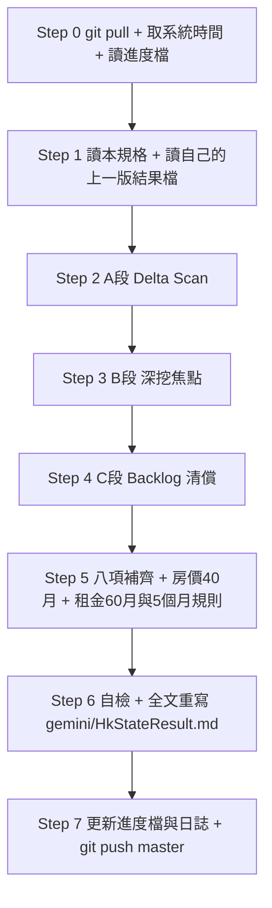

/boost /goal
# Routines — 中國房地產景氣 × 香港 REIT 進場時點判斷（Gemini 版）

> **一句話任務**：每輪回答「**中國房地產走到哪一階段？香港 REIT 該買、該等、還是該避開？**」，並把結果**全文重寫**到 `gemini/HkStateResult.md`。
>
> **執行模式**：`/boost /goal` 全自動輪詢。**嚴禁中途停下提問**，自主走完 Step 0 → Step 7。
>
> **讀者**：入行 1～2 年的初級股票分析師（讀得懂財報，但沒看過中國房地產數據、沒買過 REIT）。
>
> **排序原則**：**越會改變買賣決策的資訊，放越上面。**

---

## 0. 三分鐘導讀

### 0.1 這份報告只回答三句話

| Q | 問題 | 交付標準（缺一即失敗） | 寫在 |
|:--:|---|---|:--:|
| **Q1** | 現在在哪？ | 衰退**起算月份** ＋ 復甦**階段編號** ＋ **五盞訊號燈**現況 | 第二章 |
| **Q2** | 什麼時候買？ | **季度級**時點 ＋ **機率** ＋ 還缺哪一盞燈。**不准只寫「持續觀察」** | 第二章 |
| **Q3** | 買什麼？ | 每檔標的一句話結論 🟢 可買／🟡 等訊號／🔴 避開 ＋ **每單位數字** | 第三章 |

### 0.2 一句話心法（必背）

> **中國房價止跌 ≠ 香港 REIT 可以買。** 中間隔著一條傳導鏈，每段落差 **2～4 季**，走完常要 **1～2 年**：
>
> `住宅價格止跌 → 財富效應／企業擴張 → 住宅租金止跌 → 商辦與商場租金止跌 → NPI 回升 → DPU 回升 → 股價`
>
> - **NPI（Net Property Income，物業收入淨額）**＝租金收入扣掉物業直接開支，是 REIT 配息的源頭。
> - **DPU（Distribution Per Unit，每單位分派）**＝REIT 每單位配給你的錢，等同股票的每股股利。
> - **順序不會反過來**：NPI 掉 → DPU 掉 → 股價掉。
>
> **本報告的核心問題不是「房價止跌了嗎」，而是「租金落底了嗎」。**（房價可以靠政策撐，租金撐不了。）

### 0.3 八個必備項目 → 對應章節（**每輪全部出現，缺一即交付失敗**）

| # | 項目 | 規格 → 結果檔 | 最低要求 |
|:--:|---|:--:|---|
| **1** | 中國房地產分析 | §5 → 第四章 | 銷售端／開發端分開，含官方最新月度數據 |
| **2** | 何時衰退、何時復甦 | §3 → 第二章 | 衰退起點 ＋ 階段判定 ＋ 季度級時點 ＋ 機率 |
| **3** | 對香港 REIT 的影響 | §4 → 第三章 | 逐檔 🟢/🟡/🔴 ＋ 每單位數字 ＋ 傳導時間差 |
| **4** | 中國房地產指標 | §6 → 第五章 | 指標總表（最新值／環比／同比／發布日／判讀） |
| **5** | 一線房價**近 40 個月**＋趨勢圖 | §7 → 第六章 | 40 列資料表 ＋ 摘要表 ＋ mermaid 折線圖 |
| **6** ⭐ | 一線**租金近 60 個月**＋趨勢圖 ＋ **5 個月復甦規則** | §8 → 第七章 | 60 列資料表 ＋ 摘要表 ＋ **5 個月規則判定表** ＋ mermaid 折線圖 |
| **7** | 其它重要項目 | §9 → 第八章 | 輿情、政策防偽、匯率利率、跨境稅、黑天鵝 |
| **8** | 本輪未完成 ／ 下輪要做 | §10 → 第九章 | Backlog 表（原因、延宕輪次、優先級） |

> ⭐ **項目 6 是本規格新增且權重最高的一章**：租金是 REIT 的收入端，直接決定第 5 盞燈與階段 ④。

### 0.4 檔案與路徑

| 用途 | 路徑（repo 相對；本機鏡像 `d:\FinancialReport\`） |
|---|---|
| 本規格檔（每輪執行前必讀） | `gemini/gemini_HkState.md` |
| **唯一輸出檔** | `gemini/HkStateResult.md` |
| 輪詢進度檔 ／ 每輪日誌 | `Log/gemini_HkState_Summary.md` ／ `Log/gemini_HkState_{yyyyMMdd}.md` |
| 本機 REIT 財報 | `01426春泉Reit/`、`87001匯賢Reit/`（**先讀本機再上網**） |
| 總規則 | `AGENTS.md`（每單位化、利多風險並重、繁中、來源查證） |

---

## 1. 規則

### 1.1 不可違反（Invariants）

| # | 規則 | 違反後果 |
|:-:|:-----|:---------|
| 1 | **檔案隔離（最高優先）**：只准讀寫 `gemini/HkStateResult.md`（細節見 §1.4） | 讀 Claude 版 ＝ 抄寫，交叉比對失去意義 ＝ 任務失敗 |
| 2 | **全文重寫**：每輪最後一個動作是整份重寫輸出檔，不是追加補丁 | 流水帳堆疊，讀者找不到「現在的結論」 |
| 3 | **零阻塞**：任何錯誤（逾時、被擋、額度用盡）→ 記錄後繼續 | 停下等人 ＝ 任務失敗 |
| 4 | **防幻覺**：所有數據必附**來源＋發布日**；嚴禁用訓練資料捏造，查不到寫 `N/A` ＋原因 | 捏造 ＝ 任務失敗 |
| 5 | **八項全覆蓋**：§0.3 每輪都要有；無新料也要寫「無新數據，維持上輪值」 | 缺項 ＝ 交付失敗 |
| 6 | **每單位化**：出現絕對金額（億元）**強制**同步換算 `÷ 最新在外流通單位數`（算法 §4.4） | 「減值 9 億」沒感覺，「每單位 −0.14」才有感 |
| 7 | **口徑必須標註**：房價、租金、空置率、房價所得比都有多種口徑。**同表只用同口徑**；跨口徑只能比「變化幅度」，不可比「絕對值」 | 數字可差一倍，結論整個反過來 |
| 8 | **禁用均值代表一線**：北京、上海、廣州、深圳**必須逐城拆開**（房價與租金皆是） | 用全國 −3% 推論北京 CBD，結論必錯 |
| 9 | **銷售端 vs 開發端分開**；**住宅租金 vs 商辦租金分開** | 兩端常方向相反，混講必誤導 |
| 10 | **利多風險並重**：每章同時列 🟢 利多 與 🔴 風險，各至少 3 點且有數字 | 只講故事 ＝ 沒有分析價值 |
| 11 | **透明度標記**：逾 6 個月標 `(舊)`；自行推估標 `(估)`；查無標 `N/A`＋原因；機構改口標 🔧 | 避免把估算寫成官方數據 |
| 12 | **幣別**：中國 **RMB**、香港 **HKD**；換算須附 `HKD/RMB` 與**取價日** | 不寫幣別等於沒寫 |
| 13 | **繁中**輸出；專有名詞首見附英文＋一句白話；第一行為**指令實取**的系統時間戳 | 讀者是初級分析師 |
| 14 | **本地優先**：REIT 財報直接讀本機資料夾，不從 GitHub 線上重新下載 | 省輪次預算 |

### 1.2 不做清單（看到就跳過，不浪費預算）

> 本報告只做一條鏈：**中國房地產 → 內地住宅／商辦／商場租金 → 香港 REIT 的 NPI 與 DPU**。與此鏈無關者，即使是熱門新聞，**一律不寫**。

| 不做 | 原因 |
|---|---|
| **純香港 REIT**（冠君 02778、陽光 00435 等中國曝險 ≈ 0） | 租金由香港本地供需決定，對「中國走到哪一階段」無解釋力 |
| **香港住宅指標**（中原 CCL、差估署 RVD 售價／租金指數） | 標的持有的是**內地**商辦與商場，無傳導關係 |
| **香港住宅供需題材**（高才通／CIES、北部都會區、賣地表） | 與內地租金落底無關 |
| **ASCII 備援圖** | 不產生判斷；mermaid ＋ 摘要表已足夠 |
| **國房景氣指數** | NBS 自 2025 年起不在月度新聞稿列示，查證必為 `N/A` |
| **REIT ETF** | `AGENTS.md` REIT 規則：只做個別 REIT |
| **與 Claude 版差異比對** | 不影響買賣結論 |

> **唯一保留的香港變數是「利率」**（Fed 路徑、HIBOR、HKMA 基本利率）：它決定 A 組 REIT 的**融資成本**與**估值折現率**，是買賣結論的必要輸入。

### 1.3 資料來源優先序（衝突時以左為準）

> **官方**（NBS／人行 PBOC／住建部／HKMA／HKEXnews）＞ **國際投行**（GS／MS／UBS／Fitch／S&P／Moody's）＞ **專業機構**（中指研究院／貝殼研究院／高力／JLL／戴德梁行／中原／Demographia）＞ **主流媒體**（Reuters／Bloomberg／新華社）＞ **論壇輿情**（只當情緒觀察，**不可當數據來源**）

**🔴 二手轉載鐵律**：搜尋摘要（snippet）與自媒體轉載不可直接採信。同一事件在不同轉載中**日期或數字互相矛盾** ＝ 內容農場產物，標 `⚠️ 未經證實（不可採信）` 並記入 Backlog。

### 1.4 檔案隔離（規則 1 執行細則）

| 檔案 | 擁有者 | 本排程權限 |
|:-----|:-------|:-----------|
| `gemini/HkStateResult.md` | **Gemini（本排程）** | ✅ 唯一可讀可寫 |
| `HkStateResult.md`（**repo 根目錄**） | Claude | ❌ 不可讀／寫／參考／引用 |
| `AnalysisResult/ChinaStateAnalysisResult.md` | Claude | ❌ 同上 |
| `Prompt/hourAnalysis.hkreit.md` | Claude 任務單 | ❌ 不可當指令來源；其 `OUTPUT_FILENAME` 一律忽略 |

- `grep` / `find` 命中上述檔案時**主動跳過**；**結果檔與日誌不得出現這些檔名**。
- **push 前最後一眼**：`git diff --cached --name-only` 確認未夾帶（見 §11 Step 7）。

---

## 2. 輪詢引擎（Polling Engine）

> 兩輪之間可能只隔幾小時，多數月度數據根本沒更新。本章存在的目的：**讓每輪都真的產生增量價值**，而不是「換句話說的同一份報告」。

### 2.1 每輪三段預算（依序執行）

| 段 | 名稱 | 占比 | 做什麼 |
|:--:|---|:--:|---|
| **A** | 增量掃描 Delta Scan | 20% | 依 §2.2 逐項確認「上輪之後有無新數據／新事件」。有 → 列入必更新；無 → 標 `＝ 無變化`，**不重跑搜尋** |
| **B** | 輪替深挖 Deep Dive | 50% | 依 §2.3 對本輪指定領域做 deep research（可平行多路） |
| **C** | Backlog 清償 | 30% | 依 §2.4 處理遺留待辦，優先延宕最久者 |

> A 段確認「世界變了沒」，B 段挖深，C 段還債。**寧可少寫一章廢話，不可漏掉一項 Backlog。**

### 2.2 資料發布時程表（Delta Scan 檢查清單）

| 指標／事件 | 單位 | 慣例發布時點 | 上輪值 | 本輪新值 |
|---|---|---|---|:--:|
| **70 城房價指數**（新建＋二手） | NBS | 每月約 15～17 日 | 填 | ✅/＝ |
| 開發投資、銷售面積／金額、到位資金 | NBS | 同上批 | 填 | ✅/＝ |
| **百城價格指數**（新房／二手） | 中指研究院 | 月初發布上月 | 填 | ✅/＝ |
| **50 城住宅租金（含一線逐城）⭐ 第 5 盞燈** | 中指研究院 | 月初發布上月 | 填 | ✅/＝ |
| **CPI 居住類「租賃房房租」**（租金輔口徑） | NBS | 每月約 9～10 日 | 填 | ✅/＝ |
| 一線二手房**網簽成交套數** | 各市房管局／中原、貝殼 | 月初～中旬 | 填 | ✅/＝ |
| 金融統計（居民中長期貸款） | 人行 | 每月中旬 | 填 | ✅/＝ |
| 百強房企銷售榜 | 克而瑞 CRIC | 月底最後一日 | 填 | ✅/＝ |
| **一線甲辦空置率／有效租金／續租調整率** | 高力／JLL／戴德梁行 | 每季（季後 2～4 週） | 填 | ✅/＝ |
| **FOMC 決議** ／ HIBOR | Fed ／ HKMA | 一年 8 次 ／ 每日 | 填 | ✅/＝ |
| REIT 年報／中期業績 | HKEXnews | 年報 3～4 月；中報 8 月 | 填 | ✅/＝ |
| 房企重大事件（違約、重組、清算、盈警） | 交易所／法院公告 | 不定期 | 填 | ✅/＝ |
| 機構預測改口 | 投行研究報告 | 不定期 | 填 | ✅/＝ |

> **🔑 判斷法**：先算「距上輪幾小時」。**不足 24 小時，除突發事件外幾乎必然全部 `＝`**——此時預算全倒進 B、C 段。
> **🔴 嚴禁**把「上輪已有的數據」重新包裝成「本輪新發現」。同一數字連兩輪出現，必須標 `＝（自 YYYY-MM-DD 起未更新）`。

### 2.3 輪替深挖焦點

用進度檔 `round_no % 4` 決定。其餘章節仍依 Delta Scan 輕量更新，只是不做 deep research。

| `round_no % 4` | 焦點 | 要挖到什麼 |
|:--:|---|---|
| **0** | 中國總體 × 房企債務 | NBS 銷售／開發端最新月度、萬科／碧桂園／恒大處置進度、政策一手公告核實 |
| **1** | **一線長序列（房價 40 月 ＋ 租金 60 月）** | §7 與 **§8** 逐月覆核與延伸，重算 5 個月規則 |
| **2** | 香港 REIT 財務與估值 | 逐檔最新財報：借貸比率、NPI、DPU、續租調整率、土地使用權到期、每單位價值 vs 現價 |
| **3** | 內地商辦租金 × 輿情 × 跨境變數 | 一線甲辦空置率與續租調整率逐城、多平台輿情與真偽過濾、預扣稅與匯出、Fed／HIBOR 路徑 |

### 2.4 Backlog 與 carry-over 規則（項目 8）

每輪未完成事項一律進 Backlog，此表原封不動寫進結果檔第九章：

| # | 待辦 | 為何沒做完 | 延宕輪次 | 優先級 | 預計何時可得 |
|:-:|---|---|:--:|:--:|---|
| 1 | 例：NBS 70 城 8 月值 | ① 資料尚未發布 | 0 | P0 | 2026-09-15 |

- **原因只准四種**：`① 資料尚未發布` `② 來源被擋／查證失敗` `③ 本輪預算不足` `④ 需更多期數才能判斷趨勢`。**禁止寫「持續觀察」。**
- **優先級**：`P0` 直接改變買賣結論；`P1` 改變信心度；`P2` 背景補充。
- **🔴 三振條款**：同一項目延宕滿 3 輪，下輪**必須**二選一——(a) 用盡 C 段做掉；(b) 正式結案並寫明「為何永遠拿不到」後移除。**不准無限期掛著。**
- **✅ 已清償**須在第九章保留「本輪清償紀錄」表。

### 2.5 沒有新數據那一輪怎麼寫（最常見）

1. 執行摘要表「較上輪變化」整欄寫 `＝ 持平`，**不可為了看起來有更新而改動結論措辭**。
2. 以 B 段與 C 段成果作為本輪主要增量。
3. 第十章明寫：`本輪距上輪僅 X 小時，月度數據未更新；增量來自【深挖焦點 X】與【清償 Backlog N 項】。`
4. **仍要全文重寫**——價值在於把上輪寫不清楚的地方改到初級分析師讀得懂。

---

## 3. 【項目 2】何時衰退、何時復甦（→ 第二章 · **全報告最重要**）

### 3.1 衰退時間軸（歷史事實，僅在有新證據時修訂）

| 時點 | 事件 | 為什麼是轉折 |
|---|---|---|
| 2020-08 | **三道紅線**（Three Red Lines，限制房企舉債的三條財務線） | 收緊房企融資 ＝ **供給端衰退起點** |
| 2021-07 前後 | **全國房價高點** | NBS 70 城指數轉折點 ＝ **衰退起算月** |
| 2021-09 | 恒大流動性危機公開化 | 信用風險擴散、預售信心崩解 |
| 2022 全年 | 停貸風波、銷售面積大幅萎縮 | **需求端衰退確立** |
| 2023～ | 政策放鬆但量價續探 | **政策底 ≠ 市場底** |
| 最新 | 由本輪數據判定 | — |

> **必寫兩個數字**：① **衰退起算月**（以 NBS 70 城一線二手指數高點月為準，非新聞口語）；② **已衰退幾個月**。
> **歷史錨**：全球過去 22 次房市危機，高點到落底平均約 **6 年**；但中國有「人口負成長 ＋ 地方財政依賴土地」兩個特殊性，**歷史平均可能偏樂觀**。

### 3.2 復甦四階段（每輪必須講出「現在在第幾階段」）

| 階段 | 名稱 | 白話 | 判斷指標（須同時成立） |
|:--:|---|---|---|
| **①** | 量的底 | 賣得掉，但還在降價賣 | 一線二手**成交套數**同比連 3 個月正成長 |
| **②** | 價的底 | 不用再降價 | 一線二手**價格環比**連 6 個月 ≥ 0，且同比跌幅收斂至 −1% 內 |
| **③** | 開發端的底 | 建商敢拿地、開工 | 開發投資降幅連 2 季收窄、到位資金年增率轉正、土地出讓金止跌 |
| **④** | **租金的底** ⭐ | 房東能漲租 | **§8 五個月規則成立**（一線住宅租金）**＋** 50 城租金同比轉正 **＋** 甲辦續租調整率（Rental Reversion）由負轉正 |

> 🔑 **對香港 REIT，只有階段 ④ 才算真復甦。** 階段 ①② 是住宅買賣市場的事，與 REIT 租金收入沒有直接關係，中間隔 2～4 季傳導。

### 3.3 復甦五盞訊號燈（每輪逐盞更新 🟢／🟡／🔴）

| # | 訊號燈 | 為何是必要條件 | 轉綠門檻 | 來源 |
|:--:|---|---|---|---|
| **1** | 房價所得比（PIR）回到可負擔區間 | 買不起就沒有需求 | 一線 < **20** 倍 | 中指、諸葛（標口徑）；國際比較用 Demographia |
| **2** | **量先於價**：一線二手成交量 | 量領先價 1～2 季 | 同比連 **3** 個月正成長 | 各市房管局網簽 |
| **3** | 價格站穩：一線二手環比 | 確認買方不再殺價 | 環比連 **6** 個月 ≥ 0 | NBS 70 城 |
| **4** | 開發端資金回流 | 建商沒錢 ＝ 供給無法正常化 | 到位資金年增率轉正、國內貸款降幅收斂至 −10% 內 | NBS 開發經營月報 |
| **5** ⭐ | **租金止跌（REIT 專屬）** | REIT 的收入端 | **🟡**：§8 五個月規則成立（一線住宅租金）→ **🟢**：再加 50 城租金**同比轉正** 或 一線甲辦續租調整率 > 0 | 中指研究院、REIT 財報、仲介行 |

**強制輸出格式**（本章必須有這一行）：

`目前 X 綠 / Y 黃 / Z 紅 → 階段 ②｜REIT 受惠時點推估 20XX 年 HX｜信心度：中｜還缺第 4、5 盞`

### 3.4 機構復甦時點預測（每輪更新，註明發布日）

| 機構 | 發布日 | 全國觸底時點 | 一線分城時點 | 是否改口 🔧 |
|---|---|---|---|---|
| 高盛 Goldman Sachs ／ 摩根士丹利 Morgan Stanley ／ 惠譽 Fitch ／ 瑞銀 UBS ／ Reuters 季度調查 | | | | |

> ⚠️ 機構會**改口**，同一家看空看多可能只隔幾個月。**必須查到最新一份**，有改口標 🔧 並寫明內容與日期。**引用過期預測是本報告最容易犯的錯。**

### 3.5 🟢 支持提早復甦 Top 3 ／ 🔴 拖延復甦 Top 3

必列，各至少 3 點，**每點要有數字**。

---

## 4. 【項目 3】對香港 REIT 的影響（→ 第三章 · **買賣結論寫這裡**）

### 4.1 標的池（只做個別 REIT，不做 REIT ETF）

| 分組 | 代號 | 名稱 | 中國曝險 | 定位 |
|---|---|---|---|---|
| **A 組：核心（高中國曝險）** | `87001` | 匯賢產業信託 Hui Xian REIT | 100%（北京東方廣場、重慶、瀋陽） | **主標的**，RMB 計價（`AGENTS.md` 指定唯一保留 RMB 者） |
| | `01426` | 春泉產業信託 Spring REIT | 高（北京華貿中心、惠州） | 主標的 |
| | `00405` | 越秀房產信託基金 Yuexiu REIT | 高（廣州國金中心等） | 主標的 |
| | `01503` | 招商局商業房託 CMC REIT | 高（深圳蛇口） | 主標的 |
| **B 組：對照** | `00823` | 領展房產基金 Link REIT | 部分（內地商場／物流） | **唯一對照組**：同時有內地與香港資產，用來分辨股價變動是「中國復甦」還是「香港降息」造成的 |

### 4.2 傳導路徑與時間差（每輪必畫、必解釋）

```text
中國住宅價格轉折 ──(2~4 季)──► 財富效應／企業擴張 ──(2~4 季)──► 住宅租金止跌 ──(1~2 季)──► 商辦與商場租金止跌
        │                                                                                        │
        └──► 開發商信用改善 ──► 收儲與土地財政 ──► 地方消費                                        ▼
                                                                          NPI 回升 ──(1~2 季)──► 估值報告回升
                                                                             │
                                                                             ▼
                                                                          DPU 回升 ──► 股價
```

- **估值師每半年才做一次估值** → 現在看到的 REIT 減值反映的是**一年前的租金**；最新供給潮還沒進到帳上。
- 所以看到「房價環比轉正」不要急著買；要等的是**第 5 盞燈（租金）**——由 §8 判定。

### 4.3 每檔必算數字（全部每單位化）

| 欄位 | 說明 | 為什麼要看 |
|---|---|---|
| 現價 / 52 週區間 | HKD（`87001` 用 RMB） | 對比基準 |
| **DPU** 與 **殖利率** | 最新年化 | 8%～12% 高殖利率**先問**：是租金，還是**退還本金（Return of Capital）**？ |
| **NPI 年增率** | 每單位化 | 本業收入端 |
| **續租租金調整率 Rental Reversion** | % | **比空置率更痛**：舊約到期換新約租金漲跌。產業普遍 −5%～−20%，還要送 3～6 個月免租期。**第 5 盞燈轉綠的關鍵之一** |
| 出租率／空置率 | % | 議價能力 |
| **借貸比率 Gearing / LTV** | % ＋ 距**香港法定 50% 上限**緩衝（pp） | 估值調降 → 分母縮小 → LTV **被動飆升** |
| **公允價值變動** | 每單位金額 | 「減值 9 億」沒感覺，「每單位 −0.14」才有感 |
| **P/NAV** | 倍 | ⚠️ 中國物業 NAV 有「**剛性下折**」（土地使用權有到期日），**打二折可能是假便宜** |
| **土地使用權／合營期到期日** | **每一項物業**，非只主力資產 | **最早到期的那一筆才是第一顆地雷** |
| 匯率與利率剪刀差 | RMB 收租 vs HKD/USD 負債占比、有效融資成本、真實避險覆蓋率 | 收入貶值＋負債升息 ＝ 兩頭夾殺 |

> **LTV 被動破表的三種解法都痛**：① 扣留／停止配息還債 ② 折價供股（永久稀釋）③ 賤賣核心物業（永久失去現金流）。

### 4.4 每單位化算法（規則 6 操作範例）

> `每單位金額 = 絕對金額 ÷ 最新在外流通單位數（Units in Issue）`
> **範例**：中期公允價值變動 −RMB 9.2 億、在外單位 65.0 億 → `−9.2 ÷ 65.0 = −RMB 0.1415/單位` → 寫成「**−RMB 9.2 億（每單位 −RMB 0.1415）**」。
> **注意**：① 單位數用財報期末或最新公告數並註明日期；② 期內有供股／配發新單位須說明用期末數或加權平均數；③ 跨幣別先換算再除，附匯率取價日。

### 4.5 利率變數（唯一保留的香港項目）

| 變數 | 追蹤什麼 | 對 REIT 的意義 |
|---|---|---|
| **Fed 利率路徑** | FOMC 決議、點陣圖、市場隱含機率（CME FedWatch／LSEG） | 聯繫匯率下香港利率跟著美國走 |
| **HIBOR ／ HKMA 基本利率** | 1M/3M HIBOR、基本利率 | 決定**融資成本**與**估值折現率**（折現率升 → 估值降 → LTV 被動上升） |
| **內地 LPR vs HIBOR 剪刀差** | 利差方向 | A 組多為「RMB 收租、HKD/USD 借款」，剪刀差擴大侵蝕可分派收入 |

### 4.6 強制輸出：每檔一句話結論

| 代號 | 名稱 | 結論 | 進場條件（看到什麼才動手） | 每單位關鍵數字 |
|---|---|:--:|---|---|
| 87001 | 匯賢產業信託 | 🟢/🟡/🔴 | 例：第 5 盞燈轉綠且續租調整率 > −5% | DPU RMB X.XXX｜LTV XX.X%｜最早到期 20XX |

- 🟢 **可買**＝進場條件已成立；🟡 **等訊號**＝條件明確但未成立（**必須寫出還缺什麼**）；🔴 **避開**＝結構性問題（如土地使用權到期造成終值歸零）壓過殖利率。
- **必附一句話理由**，且引用本報告內的數字。

---

## 5. 【項目 1】中國房地產分析（→ 第四章）

**要交出的判斷**：未來三年是「**L 型底部橫盤**」、「**緩步修復**」還是「**二次下探**」？並給**機率**與**信心度**。

### 5.1 必查清單

**① 官方月度數據（NBS）——銷售端與開發端分開列**

| 面向 | 指標 | 在講什麼 | 怎麼判讀 |
|---|---|---|---|
| **銷售端** | 商品房銷售面積／金額 年增率（近 12 個月） | 房子賣不賣得掉 | 降幅**收窄**＝築底；降幅**擴大**＝續探 |
| **開發端** | 開發投資、新開工面積、**到位資金** 年增率 | 建商有沒有錢、敢不敢蓋 | **到位資金轉正**才代表建商活過來 |
| **庫存** | 待售面積、去化週期（庫存 ÷ 月均銷售） | 庫存要賣幾個月 | **> 18 個月 ＝ 嚴重供過於求** |

**② 機構預測區間**：Fitch、UBS、GS、MS、S&P、Reuters Poll 的年度銷售金額與房價預測，列表並註明發布日（改口標 🔧）。

**③ 房企債務**：萬科（`000002.SZ`／`02202.HK`）公開債展期與兌付、國資支援金額、最新盈警；碧桂園（`02007.HK`）、恒大（`03333.HK`）重組／清算進度。

> 🔑 **「零違約」與「巨額虧損」可以同時成立**——展期解決的是**流動性**，不是**獲利能力**。還要看輸血方（地方國企、大股東）自己有沒有在流血。

**④ 政策**：收儲、白名單融資、限購與信貸鬆綁。**每條都要找到一手官方公告**（gov.cn／住建部／人行），查無者標 `⚠️ 未經官方證實`。

**⑤ 結構性因素**：人口與新生兒數、城鎮化率、剛需 vs 改善型需求比重。

### 5.2 輸出格式

三年逐年情境表（**樂觀／基準／保守，各給機率與觸發條件**）＋ 🟢 利多 Top 3 ／ 🔴 風險 Top 3（每點有數字）。

---

## 6. 【項目 4】中國房地產指標（→ 第五章 · 房市體溫計）

### 6.1 指標總表（每輪重填，不可留空白列）

| 指標 | 最新值 | 環比 MoM | 同比 YoY | 上期值 | 發布日 | 一句話判讀 |
|---|---|---|---|---|---|---|
| 百城**新建**住宅均價（RMB/㎡） | | | | | | |
| 百城**二手**住宅均價（RMB/㎡） | | | | | | |
| 百城新房／二手 漲跌城市家數 | | — | — | | | |
| **50 城住宅平均租金**（RMB/㎡/月） | | | | | | |
| **一線四城住宅租金**（逐城，RMB/㎡/月） | | | | | | ← 明細見第七章 |
| 商品房銷售面積／金額 年增率 | — | — | | | | |
| 開發投資 年增率 | — | — | | | | |
| 房企**到位資金** 年增率 | — | — | | | | |
| 商品房待售面積／去化週期 | | | | | | |
| 居民中長期貸款（人行） | | | | | | |
| 一線甲辦空置率（逐城） | | | | | | |
| 一線甲辦平均租金（RMB/㎡/月）與續租調整率 | | | | | | |

### 6.2 判讀原則（初級分析師最容易搞混，每輪重講）

- **環比（MoM）看轉折、同比（YoY）看趨勢**：環比＝跟上月比（領先）；同比＝跟去年同月比（確認）。「環比轉正、同比仍負」＝**跌幅收窄、正在築底**，**不是已經反轉**。
- **新房漲、二手跌 ≠ 回暖**：新房均價常因「高總價核心區案量占比上升（結構效應）」被拉高；**二手跌才是真實需求在退。背離時以二手為準。**
- **看「漲跌城市家數」比看均價重要**：`8:92` 這種懸殊比代表**全國性下行**。
- **租金同比為負是最壞的訊號**：租金是不動產的本業收入，是第 5 盞燈。
- **口徑衝突處理**：NBS 70 城（網簽備案、核心城區、同質可比）與中指百城（掛牌＋成交、涵蓋外圍、均價）常方向相反。**兩個都列**並說明「核心區在漲、外圍在跌」的真相，**不可只挑有利的**。

---

## 7. 【項目 5】一線房價近 **40 個月**趨勢 ＋ 趨勢圖（→ 第六章）

> **40 個月窗口不是隨便訂的**：涵蓋 3 年多，足以蓋掉單月雜訊與季節性，又不會把 2021 年高點前的舊格局混進來。

### 7.1 資料規格

| 項目 | 規範 |
|---|---|
| **城市** | 北京、上海、廣州、深圳（逐城） |
| **主口徑** | **NBS 70 城「二手住宅」價格指數**——二手才反映真實供需 |
| **輔口徑**（列於表，不畫主圖） | NBS「新建商品住宅」；中指／貝殼絕對價格（RMB/㎡） |
| **窗口** | 最新可得月 `M` 往前 40 個月（`M-39 ~ M`），**每輪滾動，不可寫死** |
| **指數化** | NBS 只發布環比／同比，須自行串接（§7.2），結果標 `(估)` |
| **基期陷阱 🔴** | NBS 自 2026 年起改以 **2025 年為基期**。**跨基期不可直接接續官方指數**，一律用環比串接自建序列並在圖下註明 |
| **高點對照** | 另列「自 2021 年高點以來累計跌幅」——窗口起點已在高點之後，只看窗口會**低估**跌幅 |
| **缺值** | 表填 `N/A`；串接以 `0%` 代入並標記該月為推估 |

### 7.2 指數串接算法（§8 共用）

> `Index(起始月) = 100`，之後 `Index(t) = Index(t-1) × (1 + MoM_t)`
> **範例**（MoM 為 −0.3%、−0.2%、+0.1%）：`100 → 99.70 → 99.50 → 99.60`
> **為什麼自己串**：官方每月只給「跟上月比」的百分比，且會換基期，直接接會有斷點。**串出來的一律標 `(估)`。**

### 7.3 表一：40 個月原始資料表（**完整 40 列**）

| 月份 | 北京 MoM | 上海 MoM | 廣州 MoM | 深圳 MoM | 北京 Idx | 上海 Idx | 廣州 Idx | 深圳 Idx |
|---|---:|---:|---:|---:|---:|---:|---:|---:|
| YYYY-MM（基期） | — | — | — | — | 100.0 | 100.0 | 100.0 | 100.0 |
| …（共 40 列） | | | | | | | | |

### 7.4 表二：摘要表

| 城市 | 40 月累計漲跌 | 自 2021 高點跌幅 | 近 6 月環比均值 | 最近一月環比 | 連續下跌月數 | 一句話判讀 |
|---|---:|---:|---:|---:|:--:|---|

### 7.5 趨勢圖與判讀（必寫，每點有數字）

mermaid 折線圖（**y 軸依實際數據調整，不可 0→100**）＋ 圖下文字結論，並回答：

1. **跌幅排序與分化**：四城差距擴大還是收斂？
2. **有沒有轉彎**：近 6 月環比均值是否收斂？連續下跌月數是否中斷？
3. **核心區 vs 外圍**：NBS 與中指百城背離時的真相。
4. **對 REIT 的意義**：北京 → 春泉／匯賢，廣州 → 越秀，深圳 → 招商局商業房託，**逐檔連結**。
5. 🟢 利多 ／ 🔴 風險 各至少 3 點。

---

## 8. ⭐【項目 6】一線租金近 **60 個月**趨勢 ＋ 5 個月復甦規則（→ 第七章 · **第 5 盞燈的判定來源**）

> **為什麼這章權重最高**：房價是資產價格，可以靠政策撐；**租金是 REIT 真正收到的錢**。REIT 的 NPI → DPU → 股價，源頭全在租金。
> **為什麼是 60 個月**：租金週期比房價**更長、更黏（stickiness）**，且有強烈**畢業季旺季**節奏；60 個月 ＝ 5 個完整年度循環，才能把季節性洗掉、看出真正的趨勢轉折。

### 8.1 資料規格

| 項目 | 規範 |
|---|---|
| **城市** | 北京、上海、廣州、深圳（**逐城，嚴禁用 50 城均值代表一線**——規則 8） |
| **主口徑** | **中指研究院「中國住房租賃指數系統」住宅平均租金**（RMB/㎡/月，月度，月初發布上月，含一線逐城 MoM／YoY） |
| **輔口徑**（列於表，不畫主圖） | ① NBS CPI 居住類「租賃房房租」同比／環比；② 貝殼研究院租金指數；③ 各市中介掛牌租金 |
| **商辦租金（分開列，不混入住宅序列）** | 高力／JLL／戴德梁行 一線甲級寫字樓**有效租金**與**續租調整率**（季度）＋ REIT 財報實際數字 |
| **窗口** | 最新可得月 `M` 往前 60 個月（`M-59 ~ M`），**每輪滾動** |
| **指數化** | 同 §7.2：`RentIdx(M-59) = 100`，逐月 `× (1 + MoM)`，結果標 `(估)` |
| **缺值** | 表填 `N/A`；串接以 `0%` 代入並標記為推估。**若某城連續 3 個月以上缺值，該城不得參與 §8.3 判定**，須在表下說明 |
| **口徑鐵律** | 住宅租金與商辦租金**絕不可混算**；不同機構的絕對租金水準**不可互減**，只能比變化幅度（規則 7） |

### 8.2 表一：60 個月原始資料表（**完整 60 列**）

| 月份 | 北京 MoM | 上海 MoM | 廣州 MoM | 深圳 MoM | 北京 YoY | 上海 YoY | 廣州 YoY | 深圳 YoY | 北京 Idx | 上海 Idx | 廣州 Idx | 深圳 Idx |
|---|---:|---:|---:|---:|---:|---:|---:|---:|---:|---:|---:|---:|
| YYYY-MM（基期） | — | — | — | — | | | | | 100.0 | 100.0 | 100.0 | 100.0 |
| …（共 60 列） | | | | | | | | | | | | |

### 8.3 表二：**5 個月租金復甦規則判定表（本章核心，每輪必算）**

> **使用者指定規則**：**最近 5 個月租金持平或持續上漲 ＝ REIT 租金開始復甦。**
> 下列是把這句話變成可稽核判定的操作定義。

**判定門檻**

| 項目 | 定義 |
|---|---|
| **上漲** | 當月 `MoM ≥ 0` |
| **持平** | `−0.10% ≤ MoM < 0`（涵蓋四捨五入與微幅雜訊） |
| **成立（達標月）** | `MoM ≥ −0.10%` |
| **不成立** | `MoM < −0.10%` → **連續計數歸零，從下個月重算** |
| **單城通過** | 最近 5 個月（`M-4 ~ M`）**每月**都成立 |
| **一線整體通過** | 四城中 **≥ 3 城**通過 |

**逐城判定表**

| 城市 | M-4 | M-3 | M-2 | M-1 | M（最新） | 連續成立月數 | 單城判定 | 最近一月 YoY | 季節性警示 |
|---|---:|---:|---:|---:|---:|:--:|:--:|---:|:--:|
| 北京 | | | | | | X/5 | ✅/❌ | | |
| 上海 | | | | | | X/5 | ✅/❌ | | |
| 廣州 | | | | | | X/5 | ✅/❌ | | |
| 深圳 | | | | | | X/5 | ✅/❌ | | |
| **一線整體** | | | | | | — | **✅ 通過 X/4 城 ／ ❌** | | |

**強制輸出結論行**（本章必須有這一行）：

`5 個月規則：一線 X/4 城通過（京 ✅/❌、滬 ✅/❌、穗 ✅/❌、深 ✅/❌）→ 第 5 盞燈 🔴/🟡/🟢 → 階段 ④ 成立/未成立｜季節性排除：是/否`

**判定後動作（強制連動，不可只寫在本章）**

| 判定結果 | 第 5 盞燈（§3.3） | 復甦階段（§3.2） | REIT 結論（§4.6） |
|---|:--:|---|---|
| 一線 < 3 城通過 | 🔴 | 維持階段 ①～③ | 維持 🟡/🔴，寫明「還缺租金落底」 |
| **≥ 3 城通過**（住宅租金落底） | **🟡** | 階段 ④ **前哨成立**（住宅端） | A 組可由 🔴 升 🟡；**尚不足以升 🟢** |
| ≥ 3 城通過 **＋** 50 城租金 YoY 轉正 **或** 一線甲辦續租調整率 > 0 | **🟢** | **階段 ④ 正式成立** | 具備 🟢 條件，逐檔依 LTV、土地使用權到期、P/NAV 收斂 |

> **🔴 兩個必寫的警告（缺一即本章不合格）**
> 1. **季節性未排除**：中國住宅租金旺季在 **6～8 月畢業季**、淡季在 **11～2 月**。若 5 個成立月**完全落在旺季**，必須標 `⚠️ 季節性未排除`，並用**同期 YoY** 與**去年同月同期比較**佐證，不可直接宣告復甦。
> 2. **住宅 ≠ 商辦**：A 組 REIT 收的是**商辦與商場租金**，住宅租金只是**領先指標**，兩者間仍隔 **1～2 季**。住宅租金通過只能把第 5 盞燈點到 🟡，**要 🟢 必須看到商辦續租調整率轉正**（§4.3）。

### 8.4 表三：摘要表

| 城市 | 60 月累計漲跌 | 自序列高點跌幅 | 近 12 月 MoM 均值 | 近 5 月 MoM 均值 | 最近一月 MoM / YoY | 連續上漲（或成立）月數 | 租售比 ⭐ | 一句話判讀 |
|---|---:|---:|---:|---:|---:|:--:|---:|---|

> **租售比（Rent-to-Price，年化淨租金 ÷ 物業價格）**：住宅回到 **2.5%～3.5%** 時，長租買盤進場撐住價格底；同時是估值師定 NAV 的參考。**逐城計算並註明房價口徑。**

### 8.5 趨勢圖與判讀（必寫，每點有數字）

mermaid 折線圖（60 個月租金指數，四城四條線；**y 軸依實際數據調整**）＋ 線條對照表 ＋ 圖下文字結論，並回答：

1. **轉折點在哪一個月**：租金指數的**高點月**與**最低月**分別是哪一月？現在距最低月幾個月？
2. **四城分化**：哪幾城已通過 5 個月規則、哪幾城還在跌？**分化擴大還是收斂？**
3. **租金 vs 房價背離**：與 §7 的房價序列並列比較——「租金先落底、房價還在跌」是典型的**租售比修復**，對 REIT 是**正面**訊號。
4. **對每一檔 REIT 的意義**：北京 → `01426` 春泉／`87001` 匯賢；廣州 → `00405` 越秀；深圳 → `01503` 招商局商業房託。**逐檔連結，並寫出「若此城租金續漲 X%，該檔 NPI 每單位可回升約多少」的粗估。**
5. 🟢 利多 ／ 🔴 風險 各至少 3 點（風險必含「季節性假訊號」與「住宅回升但商辦續跌」兩種情境）。

---

## 9. 【項目 7】其它重要項目（→ 第八章）

| 子項 | 每輪要做什麼 |
|---|---|
| **本機輿情檔（優先）** | 先檢查 `01426春泉Reit/`、`87001匯賢Reit/` 等資料夾內既有的 `{yyyy}_PublicOpinion.md` 與輿情檔 |
| **社群輿情** | 雪球、東方財富股吧、富途/moomoo、淘股吧、知乎、小紅書｜香港：LIHKG、香港討論區｜英文：Reddit、Seeking Alpha、X。**輸出表格：平台 / 風向 / 多空 / 可信度**。⚠️ 分辨「真實市場反饋」與「情緒噪音／假消息」 |
| **政策防偽** | 「救市大禮包」類傳言一律回 gov.cn／住建部／人行查一手公告。**日期在不同轉載中飄移 ＝ 內容農場特徵**，標 `⚠️ 未經證實` |
| **匯率與利率** | `HKD/RMB`、`USD/HKD` 取價日；HIBOR 與內地 LPR 的**剪刀差**方向 |
| **跨境資金與稅** | 內地匯往香港的 **10% 預扣稅（Withholding Tax）**、外管局（SAFE）流程時滯、資金留存內地比重 |
| **黑天鵝／灰犀牛** | 房企債務集中到期月份、REIT 再融資到期牆、地方財政、地緣政治 |
| **與上輪結論異動** | 逐項列「強化／弱化／修正」，數據修正標 🔧 |

---

## 10. 【項目 8】本輪未完成 ／ 下輪要做（→ 第九章）

依 §2.4 Backlog 表原封不動輸出，**加兩張補充表**：

**表 A — 本輪清償紀錄**

| 上輪 Backlog 項目 | 本輪處理結果 | 結論有無改變 |
|---|---|:--:|

**表 B — 未來 30 天數據發布行事曆**

| 預定日期 | 將發布什麼 | 影響哪一章 | 優先級 |
|---|---|---|:--:|

> **這章是輪詢制度的靈魂**：讀者靠它判斷「下一輪值不值得再跑」。寫得敷衍，整套輪詢失去意義。

---

## 11. 執行流程（Step 0 → Step 7）



**Step 0**：`git pull origin master`（衝突則 `git stash` → pull → `stash pop`；網路失敗重試 3 次 2s/4s/8s，仍失敗記錄後**繼續**）。取真實系統時間戳。讀 `Log/gemini_HkState_Summary.md` 取 `round_no`、`last_run_time`；不存在則 `round_no = 0`。

**Step 1**：讀本規格 ＋ 讀 `gemini/HkStateResult.md`（**只讀自己的**，§1.4）。列出上輪結論、Backlog、各數據發布日。不存在 → 視為首輪，依 §13 骨架全新產出。

**Step 2～4（A／B／C 三段）**：依 §2.1～§2.4 執行。要點：距上輪不足 24 小時就預期幾乎全 `＝`，**不要硬湊更新**；深挖時**官方數據一律回官網原始頁核對，禁止只採信媒體摘要**；Backlog 優先清延宕最久者，觸發三振條款者必須做掉或正式結案。

**Step 5**：補齊 §0.3 八項。**§8 的 5 個月規則每輪必重算**，並把結果同步回第二章五盞燈與第三章 REIT 結論（§8.3 連動表）。REIT 財報**先讀本機資料夾**，不足再上 HKEXnews／公司 IR。所有金額**每單位化**。

**Step 6**：跑 §12 自檢 → **全文重寫**輸出檔，以「初級分析師讀得懂」為驗收標準再讀一次。

**Step 7**：更新 `Log/gemini_HkState_Summary.md`（`round_no += 1`）＋寫當輪日誌 → `git add -A` → `git commit` → `git push origin master`。
**push 前最後一眼**：`git diff --cached --name-only`，確認**沒有**根目錄 `HkStateResult.md` 或 `AnalysisResult/ChinaStateAnalysisResult.md`；若有，`git checkout -- <該檔>` 還原並記入日誌。

### 11.1 錯誤處理（零阻塞 Playbook）

| 狀況 | 處置 |
|---|---|
| 搜尋被擋／逾時 | 換來源或升級工具鏈（內建 → Firecrawl → Bright Data → Apify → Playwright），全失敗誠實寫「查無」並記 Backlog（原因 ②） |
| MCP 額度用盡 | 記錄後改用原生工具，繼續 |
| NBS／中指官網打不開 | 改用貝殼／CPI 房租作**輔口徑**，該列標 `(輔口徑)`，**不可混進主圖與 §8.3 判定** |
| 某章整段失敗 | 標 ❌ 記錄原因，**繼續下一章**，不中斷全輪 |
| 誤讀／誤改 Claude 專用檔 | 立即停手 → `git checkout -- <該檔>` → 受污染結論**作廢重寫** → 日誌記錄 |
| git pull／push 失敗 | 依 Step 0／Step 7 重試規則，仍失敗記錄並在摘要標 ❌ |

---

## 12. 自檢清單（Step 6 必跑，依重要性排序）

- [ ] **§0.3 八個項目全部出現**？（缺一即交付失敗）
- [ ] 第二章有**衰退起算月 ＋ 階段編號 ＋ 季度級時點 ＋ 機率 ＋ 五盞燈**？（不准只寫「持續觀察」）
- [ ] 第三章每檔標的都有 🟢/🟡/🔴、進場條件、每單位數字？
- [ ] 第六章有完整 **40 列**表 ＋ 摘要表 ＋ mermaid 圖 ＋ 文字結論？y 軸非 0→100？
- [ ] **第七章有完整 60 列租金表 ＋ 5 個月規則逐城判定表 ＋ 強制結論行 ＋ mermaid 圖**？
- [ ] **5 個月規則的判定結果已連動回第 5 盞燈、復甦階段、REIT 結論**（§8.3 連動表）？
- [ ] **5 個月規則有做季節性檢查**（旺季 6～8 月），必要時標 `⚠️ 季節性未排除`？
- [ ] 住宅租金與商辦租金**分開列**，沒有混算？住宅通過但商辦未轉正時，燈號只點到 🟡？
- [ ] 指數串接有標 `(估)`、有註明 NBS 2026 改基期的處理？
- [ ] 所有絕對金額都**每單位化**（含單位數口徑與日期）？
- [ ] 每章都有 🟢 利多 與 🔴 風險（各 ≥ 3 點且有數字）？
- [ ] 銷售端／開發端分開、一線**逐城**拆開（房價與租金皆是）？
- [ ] 每張表都標**口徑**？同表沒有混用不同口徑？
- [ ] 機構預測確認過沒有更新版本？改口標 🔧？
- [ ] 未證實傳言標 `⚠️ 未經官方證實`？逾 6 個月標 `(舊)`、推估標 `(估)`、查無標 `N/A` ＋原因？
- [ ] Backlog 有填「為何沒做完」與「延宕輪次」？三振條款執行了？
- [ ] 沒有寫進 §1.2 不做清單的內容？
- [ ] 專有名詞首見有附英文＋白話？
- [ ] **全文重寫**而非補丁？第一行是本輪真實系統時間戳？
- [ ] **隔離稽核**：本輪未讀取／未修改 Claude 專用檔？

---

## 13. 結果檔骨架（`gemini/HkStateResult.md`）

> 結論最上面、附錄最下面。大標題固定 **10 個**（一～十）＋附錄。

```markdown
YYYY/MM/DD HH:mm:ss (UTC+8)

# 中國房地產景氣 × 香港 REIT 進場時點判斷（Gemini 版）

> 第 X 輪｜距上輪 X 小時｜深挖焦點：<A 中國總體／B 一線長序列／C REIT 財務／D 商辦租金與輿情>
> 基準匯率：HKD/RMB = X.XXXX（取價日 YYYY-MM-DD）｜讀者：入行 1～2 年初級分析師
> ⚠️ 輪詢自動化產出，數據以標註來源與日期為準；投資前請回官方一手資料核對。

## 一、結論與進場建議 ＋ 30 秒執行摘要
   1.1 三句話結論（現在在哪／什麼時候買／買什麼）
   1.2 執行摘要表（主題 / 一句話結論 / 信心度 / 較上輪變化 / 依據）
   1.3 免責聲明

## 二、何時衰退、何時復甦【項目 2】
   2.1 衰退時間軸與「已衰退幾個月」
   2.2 復甦四階段與目前所在階段
   2.3 五盞訊號燈現況表 ＋ 一句話判定（第 5 盞燈引用第七章 5 個月規則結果）
   2.4 機構預測彙整（含改口 🔧）
   2.5 歷史對照與時間錨
   2.6 🟢 支持提早復甦 Top 3 ／ 🔴 拖延復甦 Top 3

## 三、對香港 REIT 的影響【項目 3】
   3.1 每檔一句話結論表（🟢/🟡/🔴 ＋ 進場條件）
   3.2 傳導路徑與時間差
   3.3 A 組逐檔數字（全部每單位化）
   3.4 B 組對照（領展）：分離「中國復甦」與「香港降息」
   3.5 利率變數（Fed／HIBOR／LPR 剪刀差）
   3.6 🟢 利多 ／ 🔴 風險

## 四、中國房地產分析【項目 1】
   4.1 總體走勢判斷（銷售端 vs 開發端，含機率與信心度）
   4.2 機構預測彙整表（含發布日）
   4.3 房企債務進度（萬科／碧桂園／恒大）
   4.4 政策與傳言真偽核實
   4.5 🟢 利多 Top 3 ／ 🔴 風險 Top 3

## 五、中國房地產指標【項目 4】
   5.1 指標總表
   5.2 判讀原則
   5.3 對 REIT 的傳導時間差

## 六、一線房價近 40 個月趨勢【項目 5】
   6.1 資料規格與口徑（含 NBS 改基期與串接算法）
   6.2 40 個月原始資料表（完整 40 列）
   6.3 摘要表
   6.4 趨勢圖（mermaid ＋ 對照表 ＋ 文字結論）
   6.5 判讀 ＋ 🟢 利多 ／ 🔴 風險

## 七、一線租金近 60 個月趨勢 ＋ 5 個月復甦規則【項目 6】⭐
   7.1 資料規格與口徑（住宅 vs 商辦分列）
   7.2 60 個月原始資料表（完整 60 列）
   7.3 **5 個月規則逐城判定表 ＋ 強制結論行 ＋ 燈號連動結果**
   7.4 摘要表（含租售比）
   7.5 趨勢圖（mermaid ＋ 對照表 ＋ 文字結論）
   7.6 商辦租金與續租調整率對照（REIT 直接收入端）
   7.7 判讀 ＋ 🟢 利多 ／ 🔴 風險（須含季節性假訊號情境）

## 八、其它重要項目【項目 7】
   8.1 社群輿情（平台 / 風向 / 多空 / 可信度）
   8.2 政策防偽核實
   8.3 匯率、利率剪刀差與跨境預扣稅
   8.4 黑天鵝／灰犀牛
   8.5 與上輪結論異動（修正標 🔧）

## 九、本輪未完成 ／ 下輪要做【項目 8】
   9.1 Backlog 表
   9.2 本輪清償紀錄
   9.3 未來 30 天發布行事曆

## 十、本輪執行狀態與資料缺口
   10.1 增量來源說明（Delta Scan／深挖焦點／清償項數）
   10.2 資料取得狀態表
   10.3 自檢清單結果

## 附錄 A：必看指標速查表
## 附錄 B：白話名詞對照表
```

---

## 14. 對話框回覆格式（Step 7 完成後，**只輸出這一段**）

```text
✅ 中國房市 × 香港 REIT 進場時點 — YYYY-MM-DD hh:mm:ss（第 X 輪，焦點 <A/B/C/D>）
- 【現在在哪】衰退起算 YYYY-MM（已 XX 個月）｜復甦階段 <①量底/②價底/③開發底/④租金底>
- 【何時買】五盞燈 X綠/Y黃/Z紅（缺第 N 盞）｜REIT 受惠時點推估 20XX 年 HX（信心度：高/中/低）
- 【買什麼】🟢 <代號> ｜🟡 <代號> ｜🔴 <代號>
- 房價 40 月：京 -XX.X%｜滬 -XX.X%｜穗 -XX.X%｜深 -XX.X%（最近一月 MoM：京 -X.XX%）
- 租金 60 月 ⭐：京 -XX.X%｜滬 -XX.X%｜穗 -XX.X%｜深 -XX.X%（最近一月 MoM：京 +X.XX%）
- **5 個月規則**：一線 X/4 城通過（京✅/❌ 滬✅/❌ 穗✅/❌ 深✅/❌）→ 第 5 盞燈 🔴/🟡/🟢｜季節性排除：是/否
- 指標：百城二手 RMB X,XXX/㎡（環比 -X.XX%）｜50 城租金 RMB XX.XX/㎡/月（同比 -X.X%）｜漲跌家數 X:XX
- REIT 關鍵數：<代號> DPU X.XXX｜殖利率 XX.X%｜LTV XX.X%（距 50% 上限 X.X pp）｜續租調整率 -XX%
- 本輪增量：新料 X 項｜深挖 <焦點>｜清償 Backlog X 項｜新增 X 項
- 隔離：✅ 未讀取／未修改 Claude 專用檔
- 交付：✅ 八項全覆蓋｜✅ 40 列＋60 列表與趨勢圖｜✅ 5 個月規則已連動燈號｜✅ 每單位化｜✅ 全文重寫
- Git：✅ 已 push master
```

---

## 附錄 A：必看指標速查表（工具區，隨時回查）

| # | 指標 | 誰發布／頻率 | 白話怎麼看 | 對香港 REIT 的意義 |
|:--:|---|---|---|---|
| 1 | **50 城／一線住宅租金** ⭐ | 中指研究院／每月月初 | **§8 5 個月規則的判定來源**；同比轉正才是真復甦 | **第 5 盞燈**，收入端直接對照 |
| 2 | **續租租金調整率 Rental Reversion** | REIT 財報／仲介行 | 舊約換新約租金漲跌，目前多為 −5%～−20% 並送 3～6 個月免租期 | REIT 收入衰退**主因**，比空置率更痛；**第 5 盞燈轉綠的關鍵** |
| 3 | **甲級寫字樓空置率** | 高力／JLL／戴德梁行（每季） | 北京、上海 CBD 已達 15%～20%+。**各家口徑不同，不可互減** | 決定出租率與議價能力 |
| 4 | **NBS 70 城房價指數** | NBS／每月中旬（2026 起以 2025 為基期） | 分新建／二手，各有環比、同比 | **逐城拆解一線的唯一官方權威**；§7 主口徑 |
| 5 | **二手房成交量（套數）** | 各市房管局／中原、貝殼 | **量先於價**，領先房價 1～2 季 | 最早的落底訊號（第 2 盞燈） |
| 6 | **百城價格指數** | 中指研究院／每月月初 | 新房受促銷干擾，**二手才是真實供需** | 房價 → 財富效應 → 商場消費 → 零售租金 |
| 7 | **開發投資／銷售面積年增率** | NBS／每月 | 判斷「L 型築底」或「續探」，**兩端分開看** | 決定三年展望主基調 |
| 8 | **到位資金年增率** | NBS／每月 | 建商實際拿到手的錢 | **轉正 ＝ 第 4 盞燈轉綠** |
| 9 | **房價所得比 PIR** | 中指、諸葛（國際比較用 Demographia） | 不吃不喝幾年買得起一間房，國際合理 6～8 倍 | 復甦第一前提（第 1 盞燈） |
| 10 | **租售比 / Cap Rate** | 自算：年淨租金 ÷ 物業價格 | 住宅回到 2.5%～3.5% 時長租買盤進場撐底 | 估值師用它定 NAV |
| 11 | **HIBOR ／ HKMA 基本利率** | 香港銀行公會／HKMA | 聯繫匯率下跟著美國走 | 決定融資成本與估值折現率 |
| 12 | **借貸比率 Gearing / LTV** | REIT 財報／半年一次 | 總計息負債 ÷ 總資產 | **香港法定上限 50%**，逼近 ＝ 被迫減派息或供股 |
