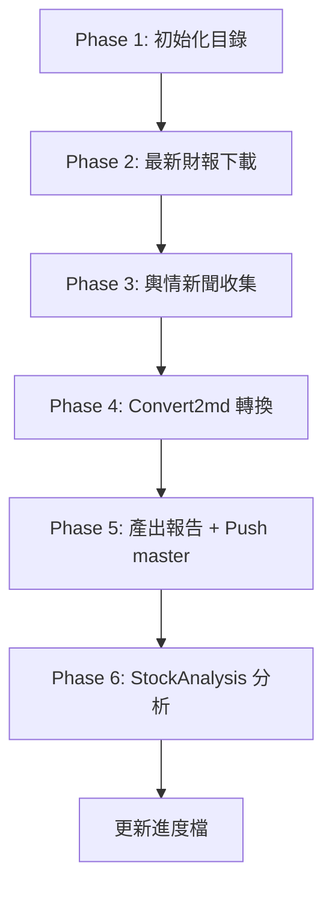

# gemini_CollectsentimentAndReports — 輪替排程執行器
> **用途**：定期輪替執行 `CollectsentimentAndReports` skill，每次執行一間不同公司。
> 每次啟動時讀取 `Routines_CollectsentimentAndReports.md` 內的「每日輪替表」，依序輪替執行。
> **完成輿情/財報收集後，自動串接執行 `StockAnalysis` Skill**（讀取 `Routines_StockAnalysis.md` 對應日期的參數）。

---

## 執行流程

### Step 1：讀取輪替表

1. 開啟 `d:\FinancialReport\Routines_CollectsentimentAndReports.md`。
2. 解析「每日輪替表 (Rotation Table)」，取得所有「執行日期」對應的公司清單。
3. **排除** 執行日期 31（標記為「無/不執行 (Skip)」）。

### Step 2：讀取上次進度

1. 開啟 `d:\FinancialReport\Log\gemini_CollectsentimentAndReports_Summary.md`（進度追蹤檔）。
2. 讀取 `last_executed_date` 欄位（上次已執行的「執行日期」編號）。
3. 若進度檔**不存在**或**讀取失敗** → random挑一個**執行日期** 開始。

### Step 3：決定本輪要執行的公司

1. **本輪執行日期** = `last_executed_date + 1`。
2. 若本輪執行日期**超過輪替表最大日期**（目前為 30） → 回到**執行日期 1**（循環）。
3. 若本輪執行日期**剛好是 31**（Skip）→ 也跳過，繼續 +1 直到找到有效日期。
4. 從輪替表中取出該日期對應的 `COMPANY_TICKER`、`COMPANY_NAME`、`本地資料夾名稱 (Folder)`、`備註 / 市場`。
5. **同一日期有多間公司**（如執行日期 5 有 `3445 RS` 和 `688432 有研硅`，執行日期 14 有 `6121 新普` 和 `6781 AES-KY`）→ 該輪**全部執行**，視為同一批次。

### Step 4：執行 CollectsentimentAndReports Skill

1. 對本輪日期的每一間公司，呼叫 `CollectsentimentAndReports` skill，帶入：
   - `COMPANY_TICKER` = 該列的股票代碼
   - `COMPANY_NAME` = 該列的公司名稱
2. 依照 skill 的完整流程執行（Phase 1 ~ Phase 5）。
3. 若同一日期有多間公司，依序逐間執行（完成一間再做下一間）。

### Step 5：更新進度檔

執行完畢後，更新 `d:\FinancialReport\Log\gemini_CollectsentimentAndReports_Summary.md`：

```markdown
# Rotation Progress — CollectsentimentAndReports

| 欄位 | 值 |
| :--- | :--- |
| **last_executed_date** | {本輪執行日期} |
| **last_executed_companies** | {本輪公司清單，如 `00941 中國移動`} |
| **last_executed_time** | {完成時間 YYYY-MM-DD HH:MM} |
| **next_date** | {下一輪預計執行日期} |
| **stock_analysis_status** | {StockAnalysis 執行結果：✅ 成功 / ⏭️ 無對應 / ❌ 失敗} |
```

### Step 6：串接 StockAnalysis Skill（新增）

> **目的**：收集完輿情/財報後，趁資料最新鮮，立即對同一公司做深度分析，產出 `hourAnalysisResult.md`。

1. 開啟 `d:\FinancialReport\Routines_StockAnalysis.md`。
2. 用**本輪執行日期**去比對「每日輪替表」的「執行日期」欄。
3. **有對應公司** → 取出 `COMPANY_NAME`、`MARKET`、`COMPANY_FOLDER`、`EXTRA_ANALYSIS`，搭配全域參數 `OUTPUT_FILENAME = hourAnalysisResult.md`，載入並執行 `StockAnalysis` Skill（`.agents/skills/StockAnalysis/SKILL.md`）。
4. **同一日期有多間公司** → 依序逐間執行。
5. **無對應公司** → Skip，在進度檔 `stock_analysis_status` 欄位記錄「⏭️ 無對應公司」。
6. 執行完成後，更新進度檔的 `stock_analysis_status` 欄位。



---

## 輪替範例

| 輪次 | 執行日期 | 公司 | CollectsentimentAndReports | StockAnalysis | 說明 |
| :--- | :---: | :--- | :---: | :---: | :--- |
| 第 1 輪 | 1 | `02318 中國平安` | ✅ | ✅ | 首次執行或上輪結束於 30 |
| 第 2 輪 | 2 | `00941 中國移動` | ✅ | ✅ | |
| 第 3 輪 | 3 | `01426 春泉Reit` | ✅ | ✅ | |
| 第 4 輪 | 4 | `9435 光通訊` | ✅ | ✅ | |
| 第 5 輪 | 5 | `3445 RS` + `688432 有研硅` | ✅ | ✅ | 同日期多公司，一次全做 |
| ... | ... | ... | ... | ... | |
| 第 14 輪 | 14 | `6121 新普` + `6781 AES-KY` | ✅ | ✅ | 同日期多公司 |
| ... | ... | ... | ... | ... | |
| 第 29 輪 | 29 | `00883` + `00857` + `00386` | ✅ | ✅ | 同日期三間；StockAnalysis 僅 00883 有對應 |
| 第 30 輪 | 30 | `8002 丸紅` | ✅ | ✅ | |
| 第 31 輪 | 跳過 31 → **回到 1** | `02318 中國平安` | ✅ | ✅ | 循環重頭開始 |

---

## 注意事項

1. **每次啟動都必須重新讀取 `Routines_CollectsentimentAndReports.md` 和 `Routines_StockAnalysis.md`**，不可快取或硬編碼輪替表。原因：使用者可能隨時新增/移除/調整公司或日期。
2. **進度追蹤依賴 `gemini_CollectsentimentAndReports_Summary.md`**，不依賴系統日期來決定該做哪間公司。系統日期僅用於判斷「是否為每月一號」（觸發 ArrangePublicOpinionMd）。
3. **若輪替表被修改**（例如新增了執行日期 32 的公司），下一輪會自然適應，因為每次都重新解析表格。
4. **同一「執行日期」有多間公司時**，視為同一批，全部完成後才將進度推進到該日期。若中途失敗，`last_executed_date` 不更新，下次會重新嘗試同一日期。
5. **StockAnalysis 的執行日期與 CollectsentimentAndReports 共用同一套日期編號**。若 `Routines_StockAnalysis.md` 中無對應日期，StockAnalysis 自動 Skip，不影響 CollectsentimentAndReports 的進度推進。
6. **StockAnalysis 失敗不阻塞進度**：若 StockAnalysis 執行失敗，進度檔仍然推進（記錄 `stock_analysis_status: ❌ 失敗`），下次不會因此重跑 CollectsentimentAndReports。